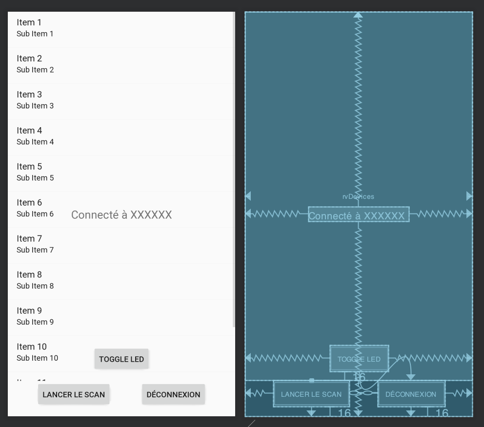
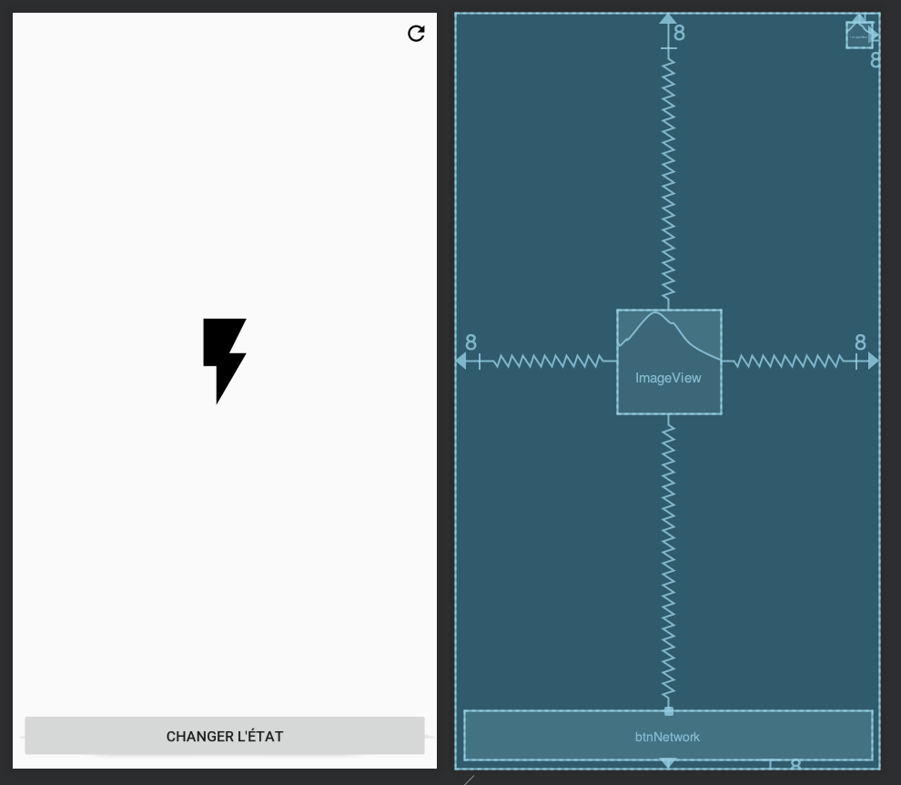

# Télécommande Bluetooth & Réseau

## Objectif

Concevoir une application qui va :

- Avoir 3 activités.
- Scanner les périphériques Bluetooth.
- Connexion à notre « Équipement ».
- Commander la led / afficher l'état.

## Les activités





## Le scan

- Création d'un Adapter pour les résultats du scan.
- Création d'un objet représentant « Un Device ».
- Création du layout permettant de l'afficher.
- Ajout des permissions.
- Ajout du code « de scan Bluetooth ».
- Pour chaque périphérique « Ajout d'un device » dans la `Datasource`.
- Notifier le recycler view à des nouveaux éléments.

### Les permissions

```xml
<uses-feature android:name="android.hardware.bluetooth_le" android:required="true"/>
<uses-feature android:name="android.hardware.location.gps"/>
<uses-permission android:name="android.permission.INTERNET"/>
<uses-permission android:name="android.permission.BLUETOOTH"/>
<uses-permission android:name="android.permission.BLUETOOTH_ADMIN"/>
<uses-permission android:name="android.permission.ACCESS_FINE_LOCATION"/>
```

### Vérifier les permissions

```java
private void checkPermissions() {
    if (ContextCompat.checkSelfPermission(this, Manifest.permission.ACCESS_FINE_LOCATION) == PackageManager.PERMISSION_DENIED) {
        ActivityCompat.requestPermissions(this, new String[]{Manifest.permission.ACCESS_FINE_LOCATION}, REQUEST_LOCATION_CODE);
    } else {
        checkForLocationEnabled();
    }
}

@Override
public void onRequestPermissionsResult(final int requestCode, @NonNull final String[] permissions, @NonNull final int[] grantResults) {
    if (requestCode == REQUEST_LOCATION_CODE) {
        if (grantResults.length > 0 && grantResults[0] == PackageManager.PERMISSION_GRANTED) {
            checkForLocationEnabled();
        } else {
            checkPermissions(); // force permission
        }
    }
}
```

### Vérifier si la localisation est active

```java
private void checkForLocationEnabled() {
    final LocationManager lm = (LocationManager) getSystemService(Context.LOCATION_SERVICE);
    if (lm != null) {
        final boolean gps_enabled = lm.isProviderEnabled(LocationManager.GPS_PROVIDER);
        final boolean network_enabled = lm.isProviderEnabled(LocationManager.NETWORK_PROVIDER);

        if (!gps_enabled || !network_enabled) {
            startActivityForResult(new Intent(Settings.ACTION_LOCATION_SOURCE_SETTINGS), REQUEST_ENABLED_LOCATION_CODE);
        } else {
            setupBLE();
        }
    } else {
        startActivityForResult(new Intent(Settings.ACTION_LOCATION_SOURCE_SETTINGS), REQUEST_ENABLED_LOCATION_CODE);
    }
}
```

### Le code du scan

```java
private void setupBLE() {
    final BluetoothManager bluetoothManager = (BluetoothManager) getSystemService(Context.BLUETOOTH_SERVICE);
    if (bluetoothManager != null) {
        bluetoothAdapter = bluetoothManager.getAdapter();
    }

    if (bluetoothManager == null || !bluetoothAdapter.isEnabled()) { // bluetooth is off
        startActivityForResult(new Intent(BluetoothAdapter.ACTION_REQUEST_ENABLE), REQUEST_ENABLE_BLE);
    } else {
        scanNearbyDevices(); // start scanning by default
    }
}
```

```java
private void scanNearbyDevices() {
    if (isScanning) {
        return;
    }

    isScanning = true;
    scanningHandler.postDelayed(scanDevicesRunnable, SCAN_DURATION_MS);

    if (Build.VERSION.SDK_INT >= Build.VERSION_CODES.LOLLIPOP) { // for recent version of android
        final ScanSettings settings = new ScanSettings.Builder().setScanMode(ScanSettings.SCAN_MODE_LOW_LATENCY).build();
        final List<ScanFilter> scanFilters = new ArrayList<>();

        // Filtre sur le scan
        // scanFilters.add(new ScanFilter.Builder().setServiceUuid(new ParcelUuid(DEVICE_UUID)).build()); // add service filters

        bluetoothAdapter.getBluetoothLeScanner().startScan(scanFilters, settings, bleLollipopScanCallback);
    }
}

// À votre avis ?
private final Runnable scanDevicesRunnable = () -> stopScan();
```

### Gestions des résultats

```java
private final ScanCallback bleLollipopScanCallback = new ScanCallback() {
    @TargetApi(Build.VERSION_CODES.LOLLIPOP)
    @Override
    public void onScanResult(final int callbackType, final ScanResult result) {
        super.onScanResult(callbackType, result);
        BluetoothDevice bluetoothDevice = result.getDevice();
        // C'est ici que nous allons créer notre « device » et l'ajouter dans le RecyclerView (Datasource)
        // Et surtout notifier du changement

        // todo créer un Device
        // l'ajouter
        // notifier
    }

    @Override
    public void onScanFailed(final int errorCode) {
        super.onScanFailed(errorCode);
        Toast.makeText(ScanActivity.this, getString(R.string.ble_scan_error, errorCode), Toast.LENGTH_SHORT).show();
    }
};
```

### Arrêt du scan

```java
private void stopScan(){
    if (Build.VERSION.SDK_INT >= Build.VERSION_CODES.LOLLIPOP) {
        bluetoothAdapter.getBluetoothLeScanner().stopScan(bleLollipopScanCallback);
    }
    isScanning=false;
}
```

### Quelques variables

```java
// REQUEST Code de gestion
private static final int REQUEST_LOCATION_CODE = 1235;
private static final int REQUEST_ENABLED_LOCATION_CODE = 1236;
private static final long SCAN_DURATION_MS = 10_000L;
private static final int REQUEST_ENABLE_BLE = 999;

// Gestion du bluetooth
private BluetoothAdapter bluetoothAdapter;
private BluetoothGatt currentBluetoothGatt = null; // Connexion actuelle
private boolean isScanning = false;
private final Handler scanningHandler = new Handler();

// Partie adapter
private DeviceAdapter deviceAdapter;
private ArrayList<BluetoothDevice> deviceArrayList = new ArrayList<>();

// Filtre UUID
private static UUID DEVICE_UUID = UUID.fromString("795090c7-420d-4048-a24e-18e60180e23c");
private static UUID CHARACTERISTIC_TOGGLE_LED_UUID = UUID.fromString("59b6bf7f-44de-4184-81bd-a0e3b30c919b");

```

### Intéragir avec le ReyclerView

```java
listView.setClickable(true);
listView.setOnItemClickListener(listClick);
```

```java
final Device item = deviceAdapter.getItem(position);
selectedDevice = item;
LocalPreferences.getInstance(this).saveCurrentSelectedDevice(item.getName());
connectToCurrentDevice();
```

### LocalPreferences ?

Sauvegarde de manière « persistant » de paramètres.

```java
import android.content.Context;
import android.content.SharedPreferences;

public class LocalPreferences {

    private SharedPreferences sharedPreferences;
    private static LocalPreferences INSTANCE;

    public static LocalPreferences getInstance(Context context) {
        if (INSTANCE == null) {
            INSTANCE = new LocalPreferences(context);
        }
        return INSTANCE;
    }

    private LocalPreferences(Context context) {
        sharedPreferences = context.getSharedPreferences("MyPref", Context.MODE_PRIVATE);
    }

    public void saveCurrentSelectedDevice(String deviceName) {
        sharedPreferences.edit().putString("selectedDevice", deviceName).apply();
    }

    public String getCurrentSelectedDevice() {
        return sharedPreferences.getString("selectedDevice", null);
    }

}
```

### Connexion à un périphérique

```java
private void connectToCurrentDevice() {
    if (selectedDevice != null) {
        Toast.makeText(this, "Connexion en cours…", Toast.LENGTH_SHORT).show();
        currentBluetoothGatt = selectedDevice.connectGatt(this, false, gattCallback);
    }
}
```

```java
private final BluetoothGattCallback gattCallback = new BluetoothGattCallback() {
    @Override
    public void onServicesDiscovered(final BluetoothGatt gatt, final int status) {
        super.onServicesDiscovered(gatt, status);
        runOnUiThread(() -> {
            Toast.makeText(ScanActivity.this, "Services discovered with success", Toast.LENGTH_SHORT).show();
            setUiMode(true);
        });
    }

    @Override
    public void onConnectionStateChange(final BluetoothGatt gatt, final int status, final int newState) {
        super.onConnectionStateChange(gatt, status, newState);

        runOnUiThread(() -> {
            switch (newState) {
                case BluetoothGatt.STATE_CONNECTED:
                    currentBluetoothGatt.discoverServices(); // start services
                    break;
                case BluetoothProfile.STATE_DISCONNECTED:
                    gatt.close();
                    setUiMode(false);
                    break;
            }

        });
    }

    @Override
    public void onCharacteristicWrite(final BluetoothGatt gatt, final BluetoothGattCharacteristic characteristic, final int status) {
        super.onCharacteristicWrite(gatt, characteristic, status);
    }
};

private void discconnectFromCurrentDevice() {
    if(currentBluetoothGatt != null) {
        currentBluetoothGatt.disconnect();
    }
}
```

### setUiMode ?

Méthode permettant de changer l'état de l'interface en fonction de la connexion. Je vous laisse écrire la méthode mais petite aide :

```java
private void setUiMode(boolean isConnected) {
    if(isConnected){
        // On vide l'apapter
        // On cache le RecyclerView
        // On cache le bouton scan

        // On affiche le TextView qui indique le device sur lequel on est connecté
        // On set la bonne valeur au TextView
        // On affiche le bouton déconnexion
        // On affiche le bouton permettant de changer l'état de la led

        // On oublie pas de stopper le scan
    } else {
        // À vous de trouver les bonnes actions
    }

}
```

### Intéragir avec la led

```java
private void toggleLed() {
    if (currentBluetoothGatt == null) {
        Toast.makeText(this, "Non Connecté", Toast.LENGTH_SHORT).show();
        return;
    }

    final BluetoothGattService service = currentBluetoothGatt.getService(DEVICE_UUID);
    if (service == null) {
        Toast.makeText(this, "UUID Introuvable", Toast.LENGTH_SHORT).show();
        return;
    }

    final BluetoothGattCharacteristic toggleLed = service.getCharacteristic(CHARACTERISTIC_TOGGLE_LED_UUID);
    toggleLed.setValue("1");
    currentBluetoothGatt.writeCharacteristic(toggleLed);
}
```

### Ajout des actions aux cliques sur l'interface

Nous avons nos méthodes, mais elle ne sont actuellement pas appelé par une action utilisateur. Pour vous guider dans la mission, vous devez dans le `OnCreate` ajouter des lignes de code similaire à :

```java
// Lancement du scan
scanBtn = findViewById(R.id.startScan);
scanBtn.setOnClickListener(v -> checkPermissions());
// Bouton pour la deconnexion
// TODO

// Bouton pour change l'état de la led
// TODO
```

## Télécommande via Internet

Nécéssite le « nom » du périphérique (donc d'un scan précédent).

- Modifier la vue de la home pour que nous ne puissions pas cliquer sur le bouton.
- L'activité ne dois pas être accessible. (elle dois `finish()` si pas de `getCurrentSelectedDevice() == null`)
- Créer un nouveau model `LedStatus`

### La classe LedStatus

```java

/**
 * LedStatus model
 */
public class LedStatus {
    private String identifier;
    private boolean status;

    public String getIdentifier() {
        return identifier;
    }

    public LedStatus setIdentifier(final String identifier) {
        this.identifier = identifier;
        return this;
    }

    public boolean getStatus() {
        return status;
    }

    public LedStatus setStatus(final boolean status) {
        this.status = status;
        return this;
    }

    public LedStatus reverseStatus() {
        return setStatus(!status);
    }

    @Override
    public LedStatus clone() {
        return new LedStatus().setIdentifier(getIdentifier()).setStatus(getStatus());
    }
}
```

### Nouvelle dépendances Gradle 

```groovy
implementation 'com.squareup.retrofit2:retrofit:2.3.0'
implementation 'com.squareup.retrofit2:converter-gson:2.3.0'
implementation 'com.squareup.okhttp3:okhttp:3.8.0'
implementation 'com.squareup.okhttp3:logging-interceptor:3.8.0'
```

### la classe APIService

```java
/**
 * ApiService
 */
public interface ApiService {

    @GET("/status")
    Call<LedStatus> readStatus(@Query("identifier") final String identifier);

    @POST("/status")
    Call<LedStatus> writeStatus(@Body final LedStatus status);

    class Builder {
        /**
         * Create a singleton only for simplicity. Should be done through a DI system instead.
         */
        private static final ApiService instance = build();

        public static ApiService getInstance() {
            return instance;
        }

        private Builder() {
        }

        /**
         * Build an ApiService instance
         */
        private static ApiService build() {
            final Gson gson = new GsonBuilder().create(); // JSON deserializer/serializer

            // Create the OkHttp Instance
            final OkHttpClient okHttpClient = new OkHttpClient.Builder()
                    .readTimeout(30, TimeUnit.SECONDS)
                    .writeTimeout(30, TimeUnit.SECONDS)
                    .addInterceptor(new HttpLoggingInterceptor().setLevel(BuildConfig.DEBUG ? HttpLoggingInterceptor.Level.BODY : HttpLoggingInterceptor.Level.NONE))
                    .addInterceptor(chain -> {
                        final Request request = chain.request().newBuilder().addHeader("Accept", "application/json").build();
                        return chain.proceed(request);
                    })
                    .build();

            return new Retrofit.Builder()
                    .baseUrl(BuildConfig.URI_REMOTE_SERVER)
                    .client(okHttpClient)
                    .addConverterFactory(GsonConverterFactory.create(gson))
                    .build()
                    .create(ApiService.class);
        }
    }
}
```

### Exemple d'utilisation

```java
void refreshLedState() {
    apiService.readStatus(ledStatus.getIdentifier()).enqueue(new Callback<LedStatus>() {
        @Override
        public void onResponse(Call<LedStatus> call, Response<LedStatus> ledStatusResponse) {
            runOnUiThread(() -> {
                boolean newStatus = ledStatus.getStatus();
                if (ledStatusResponse.body() != null) {
                    newStatus = ledStatusResponse.body().getStatus();
                }

                setLedState(newStatus);
            });
        }

        @Override
        public void onFailure(Call<LedStatus> call, Throwable t) {
            t.printStackTrace();
            runOnUiThread(() -> {
                Toast.makeText(ActionActivity.this, "Erreur de connexion au serveur", Toast.LENGTH_SHORT).show();
            });
        }
    });
}
```