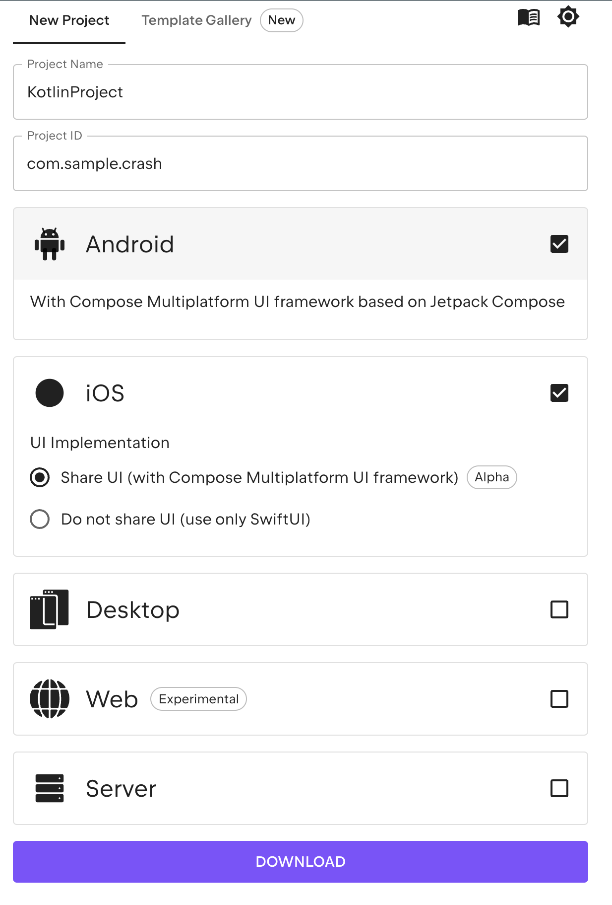
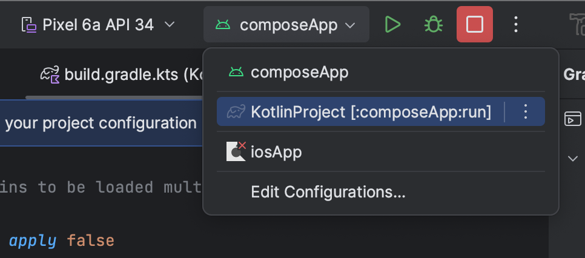
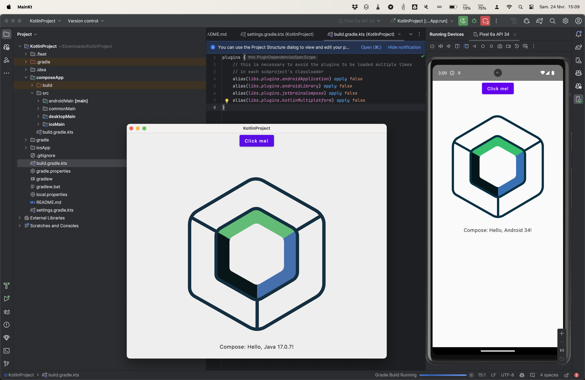
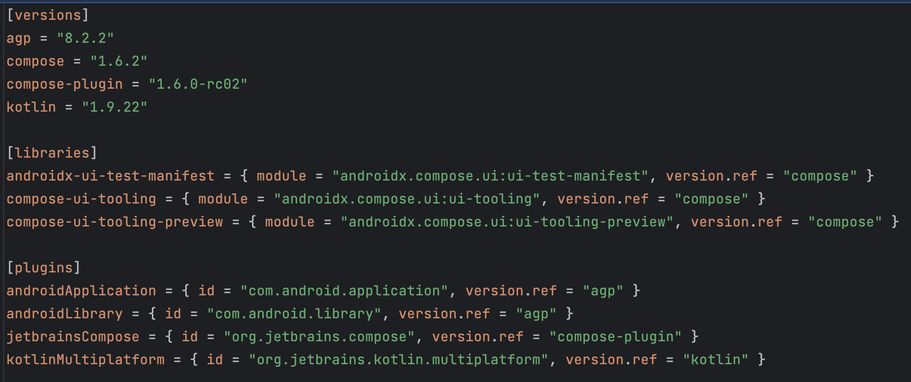
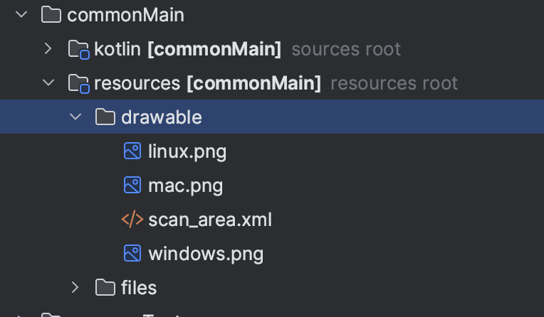

# Compose Multiplateforme

Dans ce support, nous allons voir comment JetBrains avec son outil Compose Multiplatform permet de créer des applications multip-plateforme. Nous nous intéresserons notamment aux différences avec le développement d'applications natives et plus particulièrement l'état d'esprit à adopter pour développer des applications Multiplatforms de manière efficace.

::: details Sommaire
[[toc]]
:::

## Objectifs

- Comprendre les enjeux du développement multip-plateforme.
- Découvrir les outils de JetBrains pour le développement multip-plateforme.
- Comprendre les différences entre le développement multip-plateforme et le développement natif.

## Prérequis

Comprendre les principes du développement en Kotlin et l'approche composant.

## Le Multiplateforme ?

Compose Multiplateforme est « la suite » du **Kotlin** Multiplateforme. En effet, JetBrains a décidé de créer un outil spécifique pour le développement d'applications Multiplatforms. Cet outil est basé sur le framework Compose, lui-même basé sur le langage Kotlin.

Le Kotlin Multiplateforme permet de créer relativement simplement des couches communes à des applications Android, iOS, JVM, JS, WASM, etc. Cependant, il ne permet pas de créer des interfaces utilisateurs communes. C'est là que Compose Multiplatform intervient.

Compose est un framework de création d'interfaces utilisateurs développé par Google. Il est le renouveau du développement d'interfaces utilisateurs sur Android. C'est à partir de cette base et en lien avec Google que JetBrains a décidé de créer Compose Multiplatform, un outil permettant de créer des interfaces avec des composants similaires pour les différentes plateformes.

## Un peu de terminologie

Avant de rentrer dans le vif du sujet, il est important de comprendre la terminologie utilisée par Compose Multiplatform.

- **Composant** : Un composant est un élément graphique, par exemple un bouton, un texte, une liste, etc.
- **Koin** : Koin est un injecteur de dépendances pour Kotlin. Il permet de gérer les dépendances entre les composants d'une application.
- **Scaffold** : Un Scaffold est un composant de haut niveau qui permet de créer une structure de base pour une application. Il contient une barre de titre, un contenu, un menu, etc.
- **ViewModel** : Un ViewModel est un composant qui permet de gérer l'état d'une application. Il est souvent utilisé pour stocker des données et des états.
- **State** : Un State est un élément qui permet de stocker des données et des états. Il est souvent utilisé pour stocker des données qui peuvent être modifiées. Il est souvent utilisé avec un ViewModel.
- **Composable** : Un Composable est une fonction qui génère un composant graphique. Il est annoté avec `@Composable`.
- **PreCompose** : Librairie permettant de gérer la navigation et la gestion des états dans une application Compose Multiplatform.
- **Navigation** : Système déclaratif permettant de gérer la navigation de l'utilisateur entre différentes vues de l'application.
- **Ressources** : Les ressources sont des éléments externe au code, mais utilisé par l'application, par exemple des images, des textes, des couleurs, etc.
- **gradle** : Gradle est un système de build, il permet de gérer les dépendances, les tâches, les configurations, etc.
- **libs.versions.toml** : Fichier de configuration permettant de gérer les versions des dépendances d'un projet. Il est utilisé par Gradle.
- **ktor** : Ktor est un framework pour créer des applications serveur et client en Kotlin. Il est souvent utilisé pour créer des applications qui communiquent avec des serveurs.

::: tip Remarque

Il est important de comprendre que Compose Multiplatform est un outil en constante évolution, il est donc possible que certaines notions évoluent dans le temps.

Beaucoup d'éléments sont encore en cours de développement, notamment la partie ressource. Mais si vous avez déjà fait du développement Android, vous savez que la gestion des ressources est un élément important et qu'il ne vas aller qu'en s'améliorant.

:::

## Compose Multiplateforme

Avant de rentrer dans le détail du Multiplatform, arrêtons-nous un instant sur Compose, et notamment sur la manière dont il fonctionne. L'approche de compose est similaire à ce que nous pouvons trouver dans d'autres frameworks à base de composants, nous allons donc écrire des éléments d'interface utilisateur directement en Kotlin, mais avec une base de code commun fourni en grande partie par Google (Boutons, Textes, etc.).

```kotlin
@Composable
fun Greeting(name: String) {
    Text(text = "Bonjour, $name!")
}
```

Dans cet exemple, nous avons une fonction `Greeting` qui prend en paramètre un nom et qui affiche un texte. Cette fonction est annotée avec `@Composable` ce qui signifie que c'est une fonction qui va générer un composant graphique. La fonction `Text` est un composant de base de Compose qui permet d'afficher du texte.

Si nous voulons aller plus loin, nous pouvons créer des composants plus complexes, par exemple un composant qui affiche une liste de noms.

```kotlin
@Composable
fun NameList(names: List<String>) {
    LazyColumn {
        items(items = names) { name ->
            Greeting(name = name)
        }
    }
}
```

Ici nous assemblons deux composants, un `LazyColumn` qui est un composant de Compose permettant d'afficher une liste de manière optimisée, et un `Greeting` qui est un composant que nous avons créé précédemment. Le résultat est un nouveau composant qui affiche une liste de noms.

Et si nous souhaitons rendre notre application interactive, rien de plus simple :

```kotlin
@Composable
fun Counter() {
    var count by remember { mutableStateOf(0) }

    Button(onClick = { count++ }) {
        Text("J'ai été cliqué $count fois")
    }
}
```

Dans cet exemple, nous avons un composant `Counter` qui affiche un bouton et un texte. Le texte affiche le nombre de fois que le bouton a été cliqué. Le nombre de clics est stocké dans une variable `count` qui est un état mutable. Lorsque le bouton est cliqué, la variable `count` est incrémentée.

Il est bien évidemment possible de créer des composants bien plus complexes, mais ces exemples permettent de comprendre la manière dont Compose fonctionne. Vous en voulez plus ? 

```kotlin
@Composable
fun Exemple() {
    var text by remember { mutableStateOf("Cliquez sur le bouton") }

    Column {
        
        Button(onClick = { text = "Bouton cliqué" }) {
            Text("Cliquez ici")
        }

        Text(text)
    }
}
```

Dans cet exemple, nous avons un composant `Exemple` qui affiche un bouton et un texte. Lorsque le bouton est cliqué, le texte est modifié. Le texte est stocké dans une variable `text` qui est un état mutable. Lorsque le bouton est cliqué, la variable `text` est modifiée.

## Material Design

Compose est basé sur Material Design, un ensemble de règles et de composants graphiques créés par Google. Ces règles sont utilisées pour créer des applications sur Android, mais aussi globalement le Web. Je vois déjà les développeurs iOS se dire que ce n'est pas pour eux, mais détrompez-vous, Material Design est aussi utilisé sur iOS, notamment dans les applications Google.

Cependant, Compose n'est pas limité à Material Design, il est possible de créer des composants personnalisés, mais il est important de comprendre que Material Design est la base de Compose.

C'est d'ailleurs ce que nous avons fait dans des développements précédents comme par exemple « Vivre à Angers » où nous avons utilisé Compose pour créer une application Android identique à l'application iOS.

Mais vous allez me dire… Nous aurions pu utiliser Compose Multiplatform pour créer l'application ? Et bien oui… très certainement…

## Un petit parallèle avec les autres frameworks

Précédemment nous avons fait des applications en Flutter, ces applications sont également compatibles avec iOS, Android et le Web. Cependant, la manière de faire est différente, Flutter utilise un langage spécifique, le Dart, et une manière de faire spécifique (Widgets, approche très similaire à React). Compose Multiplateforme, lui, utilise le Kotlin, un langage que nous connaissons déjà.

L'autre gros avantage Compose, est le Kotlin, en effet écrire du code en Kotlin nous permet de déjà de créer du code commun à plusieurs plateformes, nous l'avons déjà fait, nous savons que c'est très efficaces et relativement simple à mettre en place.

Avec Compose Multilplateforme, nous passons un cran au-dessus… Faire l'intégralité d'une application !

Suffisant de blabla, rentrons dans le dur !

<center>
    <iframe src="https://giphy.com/embed/xUA7aVcq56dQ4YueZO" width="480" height="262" frameBorder="0" class="giphy-embed" allowFullScreen></iframe>
</center>

## L'architecture

Vue que nous avons tous des bases différentes sur Compose, je me permets de vous faire un petit rappel sur les bénéfices de Compose et d'un développement à base de composants réutilisable. Dans un premier temps, intéressons-nous à un composant très important le `Scaffold`. 

```kotlin
@Composable
fun ScaffoldExample() {
    Scaffold(
        topBar = {
            TopAppBar(
                title = {
                    Text(text = "Titre")
                }
            )
        },
        content = {
            Text("Contenu")
        }
    )
}
```

Le Scaffold est un élément qui va nous permettre de créer une structure de base pour notre application. Il va nous permettre de définir une barre de titre, un contenu, un menu, etc. C'est un élément très important dans la création d'une application.

Un Scaffold est donc une structure, elle est souvent la racine de notre application :


Dans cette image, nous voyons que le Scaffold est la racine de notre application, il contient une barre de titre, un contenu, et un menu.

Le Scaffold est un exemple de composant de haut niveau, c'est-à-dire un composant qui va contenir d'autres composants.

## Créer notre première application

Le plus simple pour créer une structure de base pour notre application est d'utiliser le site fourni dans la documentation de Compose Multiplatform. Ce site permet de générer une structure de base dans laquelle nous pouvons choisir les plateformes que nous souhaitons (Web, Android, iOS, etc.).

::: danger Attention

Le système est pour l'instant très jeune, tous n'est pas encore vraiment compatibl. Exemple si vous activé WASM, beaucoup de librairie rendront votre application non compilable (car non compatible avec WASM).

Ceci étant, les librairies sont en constant évolution, et il est certain que très rapidement cet avertissement ne sera plus d'actualité.

Pour information, j'ai échangé à ce sujet sur plusieurs librairies :

- [PreCompose](https://github.com/Tlaster/PreCompose/pull/251)
- [Koin](https://github.com/InsertKoinIO/koin/issues/1634#issuecomment-1960959984)
- [Repo officiel de Compose Multiplateforme](https://github.com/JetBrains/compose-multiplatform/issues/4277#issuecomment-1945922199)

Bref, ça bouge, et ça bouge vite !

:::

Le site de Jetbrains est une bonne base pour commencer la découverte [https://www.jetbrains.com/lp/compose-multiplatform/](https://www.jetbrains.com/lp/compose-multiplatform/). Il est une vitrine assez représentative de ce que nous allons pouvoir faire, dans la documentation, nous y trouvons le fameux outil qui va nous permettre de créer notre application :

- [https://kmp.jetbrains.com/](https://kmp.jetbrains.com/)



Pour commencer nous allons créer une application « simple » :

- Android
- iOS
- Desktop (JVM)

## L'IDE

Pour ce support, nous allons utiliser Android Studio, mais Fleet (le nouvel IDE de JetBrains) est également compatible avec Compose Multiplateforme. Il semble que Fleet soit bien adapté, mais si comme moi vous n'avez pas les outils de build de Xcode, Android Studio est un bon choix.

::: tip Vous êtes sous Android ?

Si vous êtes sous Android Sudio, il est possible de faire l'ensemble des compilations (Android, iOS, Desktop) pour peu que vous ayez les outils de Build de Xcode et le [plugin officiel](https://plugins.jetbrains.com/plugin/14936-kotlin-multiplatform-mobile)


:::

## L'architecture des dossiers

Contrairement à une application Android classique, une application Compose (MP) va contenir l'ensemble des plateformes dans un seul projet. Nous allons donc retrouver des dossiers spécifiques à chaque plateforme, mais aussi des dossiers communs.


Entrons un peu dans le détail de ces dossiers de code :

- `composeApp` : Ce dossier va contenir notre code Compose / Kotlin. C'est ici que nous allons écrire notre application.
- `composeApp/src/commonMain` : Ce dossier va contenir le code commun à toutes les plateformes. Dans un monde idéal, nous allons essayer de mettre le maximum de code ici.
- `composeApp/src/androidMain` : Ce dossier va contenir le code spécifique à Android. Nous y retrouvons une structure classique d'application Android (Manifest, etc.). C'est dans ce dossier que nous intégrerons les composants et le code spécifique à Android.
- `composeApp/src/iosMain` : Vous l'avez compris, ce dossier va contenir le code spécifique à iOS. Nous y retrouvons une structure classique d'application iOS (Info.plist, etc.). **Cependant**, Compose Multiplateforme propose un bridge vers les fonctionnalités natives d'iOS, nous n'écrirons donc pas de code en Swift ici, mais du Kotlin qui a comme spécificité d'être en mesure d'importer des librairies iOS (Network, Camera, etc.).
- `composeApp/src/desktopMain` : Ici nous écrirons du code qui a pour vocation de fonctionner sur un ordinateur (Linux, Windows, Mac). Le code fonctionnera sur la JVM, ce qui signifie que nous pourrons utiliser des librairies Java.

Nous avons également quelques éléments de configuration :

- `settings.gradle.kts` : Peu d'éléments ici, mais c'est ici que nous allons déclarer nos repositories.
- `/build.gradle.kts` : Configuration de base de notre projet, nous déclarons ici les plugins communs à toutes les plateformes.
- `/composeApp/build.gradle.kts` : Configuration spécifique à notre application Compose. Configuration de la partie Android, iOS, Desktop, **mais aussi** de la partie commune (common).

::: tip Remarque

Nous allons principalement travailler dans le dossier `composeApp`, mais il est important de comprendre que nous allons certainement avoir à configurer nos plateformes et surtout ajouter des dépendances (Koin, PreCompose, etc.).

:::

## Lancer notre application

Avant de rentrer dans le détail des fichiers de configuration, nous allons lancer notre application.


Dans cette fenêtre, nous voyons que nous avons plusieurs tâches disponibles :

Lancement de l'application de bureau :

```sh
gradle :composeApp:run
```

Pour les autres plateformes, pas besoin de lancer une tâche spécifique :



::: tip Le résultat



:::

## Les fichiers de configuration

Maintenant que nous avons lancé notre application, nous allons rentrer dans le détail des fichiers de configuration. En effet, Compose Multiplateforme n'est qu'une base de code, pour réaliser nos applications de manière efficace, nous allons devoir ajouter des dépendances, des configurations, etc.

### composeApp/build.gradle.kts

Ce fichier est **le plus important** de tous, il va contenir les configurations spécifiques et les dépendances. La partie la plus intéressante de ce fichier est la partie `sourceSets` :

```kotlin
sourceSets {
        val desktopMain by getting
        
        androidMain.dependencies {
            implementation(libs.compose.ui.tooling.preview)
            implementation(libs.androidx.activity.compose)
        }
        
        commonMain.dependencies {
            implementation(compose.runtime)
            implementation(compose.foundation)
            implementation(compose.material)
            implementation(compose.ui)
            @OptIn(ExperimentalComposeLibrary::class)
            implementation(compose.components.resources)
        }

        desktopMain.dependencies {
            implementation(compose.desktop.currentOs)
        }
    }
```

Dans le code que vous avez généré, nous avons le minimum pour faire fonctionner notre application. Vous avez dans le code ci-dessus les dépendances de chaque plateforme. En fonction des problèmes, nous allons ajouter des dépendances soit dans la partie `commonMain` (si la dépendance est commune à toutes les plateformes), soit dans la partie spécifique à la plateforme (Android, iOS, Desktop).

Nous avons deux types de dépendances :

- `libs.…` : Ce sont des dépendances spécifiques à Compose Multiplateforme. Elles sont définies dans le fichier `gradle/libs.versions.toml`.
- `compose.…` : Ce sont des dépendances spécifiques à Compose, elle ne sont pas défini dans notre application mia via le plugin Compose Multiplateforme (pas celui installé dans Android Studio, mais celui qui est dans le fichier `build.gradle.kts`).

::: tip Remarque

Cette différence est importante, en effet, pour que notre application fonctionne. Jetbrains maintient une sorte de structure de dépendances compatible, un mauvais choix ? Et votre application ne compile plus.

Ça paraît contraignant, mais c'est en réalité une très bonne chose comme nous allons le voir par la suite.

:::

### gradle/libs.versions.toml

Vous avez remarqué ? Non ? Vraiment ? Bon, je vous guide alors… Dans la partie `sourceSets` nous avons des dépendances mais jamais de version. C'est normal, cette écriture est la nouvelle façon de déclarer nos dépendances. Elle simplifie la lecture du fichier `build.gradle.kts` et permet de centraliser les versions des dépendances dans le fichier `gradle/libs.versions.toml`.

```toml
[versions]
# Déclaration des versions 

[libraries]
# Déclaration des dépendances

[plugins]
# Déclaration des plugins
```

Dans ce toml, nous avons trois sections :

- `versions` : Cette section va contenir les versions des dépendances. C'est ici que nous allons déclarer les versions des dépendances que nous allons utiliser dans notre application.
- `libraries` : Cette section va contenir les dépendances. Quelle que soit la plateforme, nous allons déclarer ici les dépendances que nous allons utiliser.
- `plugins` : Cette section va contenir les plugins. C'est ici que nous allons déclarer les plugins que nous allons utiliser dans notre application.

Concrètement, voici un exemple :



Dans cette exemple nous avons déclaré :

- Les versions des dépendances (Compose, AGP, etc.).
- Les dépendances (androidx-ui-test-manifest, compose-ui-tooling, etc.).
- Les plugins (androidApplication, androidLibrary, etc.).

::: tip Remarque

Il est important de comprendre que ce fichier est centralisé, c'est-à-dire que toutes les plateformes vont utiliser les mêmes versions de dépendances. C'est une très bonne chose, car cela permet de garantir une certaine compatibilité entre les différentes plateformes.

:::

### Évolution des versions

Avant de continuer notre exploration, je vous propose de basculer certaines dépendances vers des versions plus récentes :

```
compose = "1.6.2"
compose-plugin = "1.6.0-rc02"
```

Et également ajouter quelques dépendances :

```toml
[version]
koin = "3.6.0-wasm-alpha2"
precompose = "1.6.0-beta01"
ktorClient = "2.3.8"

[libraries]
koin = { module = "io.insert-koin:koin-core", version.ref = "koin" }
koin-compose = { module = "io.insert-koin:koin-compose", version.ref = "koin" }
koin-android = { module = "io.insert-koin:koin-android", version.ref = "koin" }
ktor-client-cio = { module = "io.ktor:ktor-client-cio", version.ref = "ktorClient" }
ktor-client-core = { module = "io.ktor:ktor-client-core", version.ref = "ktorClient" }
ktor-client-mock = { module = "io.ktor:ktor-client-mock", version.ref = "ktorClient" }
precompose = { module = "moe.tlaster:precompose", version.ref = "precompose" }
precompose-koin = { module = "moe.tlaster:precompose-koin", version.ref = "precompose" }
precompose-viewmodel = { module = "moe.tlaster:precompose-viewmodel", version.ref = "precompose" }
```

Je vous laisse déclarer ces dépendances dans le fichier de version (`gradle/libs.versions.toml`). Et les déclarer dans la partie `sourceSets` du fichier `composeApp/build.gradle.kts`.

```kotlin
commonMain.dependencies {
    // Dépendances communes à ajouter
    api(libs.koin)
    api(libs.koin.compose)
    api(libs.precompose)
    api(libs.precompose.viewmodel)
    api(libs.precompose.koin)
    api(libs.ktor.client.core)
    api(libs.ktor.client.cio)
}
```

::: tip Remarque
Pourquoi mettre des versions alpha ? Ça bouge vite, et si nous voulons bénéficier des dernières fonctionnalités, il est important de suivre les versions. Cependant, il est important de comprendre que les versions alpha sont instables, il est donc possible que votre application ne compile plus. C'est un choix à faire.

La version 1.6.0 ajoute le support de WASM et une amélioration de la gestion des ressources, elle est donc très intéressante pour nous.
:::

## L'approche multi-plateforme first

Il y a plusieurs façons d'imaginer une application multi-plateforme, pour moi la plus efficace est de penser « comment je peux faire pour que mon code soit le plus commun possible ? ». C'est une approche qui demande un peu de réflexion, mais qui est très efficace.

En effet, une fois que nous avons compris que le code commun est le plus important, nous allons chercher à réduire au maximum les variations d'implémentation entre les plateformes.

Cette façon de faire permet :

- De limiter la répétition de code.
- S'assurer que le visuel est le plus proche possible de la maquette.
- S'assurer que le visuel est le plus proche possible entre les plateformes.

**En résumé**, essayer de coder « comme avant », est l'erreur à ne pas commettre.

### Un exemple

Prenons un exemple, simple, vous souhaitez afficher par exemple la caméra de l'utilisateur. La manière de faire sera forcément différente en fonction de la plateforme. Vous pourriez être tenté de créer un composant « CameraScreen » qui serait à implémenter pour chaque plateforme.

#### La mauvaise façon de faire

```kotlin
@Composable
expect fun CameraScreen()
```

Puis dans chaque plateforme :

```kotlin
@OptIn(ExperimentalResourceApi::class)
@Composable
actual fun ScanScreen() {
    Box(modifier = Modifier.fillMaxSize()) {

        /**
            Le code spécifique à Android
            …
            Très long, avec la gestion des permissions, etc.
        **/


        Column(
            modifier = Modifier.fillMaxSize().padding(24.dp),
            verticalArrangement = Arrangement.Center,
            horizontalAlignment = Alignment.CenterHorizontally
        ) {
            Spacer(modifier = Modifier.weight(1f))
            Image(
                modifier = Modifier.testTag("scanArea"),
                painter = painterResource(DrawableResource("drawable/scan_area.xml")),
                contentDescription = "Scan Area"
            )
            Spacer(modifier = Modifier.weight(1f))

            OutlinedButton(
                modifier = Modifier.fillMaxWidth().testTag("manualButton"),
                onClick = {},
                text = "Enter the code manually"
            )
        }
    }
}
```

::: danger Attention

Procéder de cette manière serait en réalité une erreur. En faisant comme cela, nous allons créer des composants pour chaque plateforme avec énormément de code « d'interface », donc avec un risque de divergence entre les plateformes.

:::

#### La « bonne façon de faire »

Alors qu'en réalité, si nous inversons la logique, nous allons d’abord créer un composant commun, ce composant doit être le plus « fonctionnel » possible, c'est-à-dire qu'il doit être capable de fonctionner sur toutes les plateformes.

J'ai même envie de dire qu'il doit pouvoir fonctionner (sans afficher la caméra évidemment), dans cette façon de procéder, notre composant pourrait ressembler à :

```kotlin
@Composable
expect fun CameraView()

@OptIn(ExperimentalResourceApi::class)
@Composable
fun ScanScreen() {
    Box(modifier = Modifier.fillMaxSize()) {
        CameraView()

        Column(
            modifier = Modifier.fillMaxSize().padding(24.dp),
            verticalArrangement = Arrangement.Center,
            horizontalAlignment = Alignment.CenterHorizontally
        ) {
            Spacer(modifier = Modifier.weight(1f))
            Image(
                modifier = Modifier.testTag("scanArea"),
                painter = painterResource(DrawableResource("drawable/scan_area.xml")),
                contentDescription = "Scan Area"
            )
            Spacer(modifier = Modifier.weight(1f))

            OutlinedButton(
                modifier = Modifier.fillMaxWidth().testTag("manualButton"),
                onClick = {},
                text = "Enter the code manually"
            )
        }
    }
}
```

::: details L'implémentation Android

```kotlin
@Composable
actual fun CameraView() {
    val context = LocalContext.current
    val lifecycleOwner = LocalLifecycleOwner.current
    var preview by remember { mutableStateOf<Preview?>(null) }

    val cameraProviderFuture: ListenableFuture<ProcessCameraProvider> = ProcessCameraProvider.getInstance(context)
    DisposableEffect(cameraProviderFuture) {
        onDispose {
            cameraProviderFuture.get().unbindAll()
        }
    }

    var hasCamPermission by remember {
        mutableStateOf(
            ContextCompat.checkSelfPermission(
                context,
                Manifest.permission.CAMERA
            ) == PackageManager.PERMISSION_GRANTED
        )
    }
    val launcher = rememberLauncherForActivityResult(
        contract = ActivityResultContracts.RequestPermission(),
        onResult = { granted ->
            hasCamPermission = granted
        }
    )
    LaunchedEffect(key1 = true) {
        launcher.launch(Manifest.permission.CAMERA)
    }
    if (hasCamPermission) {
        AndroidView(
            factory = { AndroidViewContext ->
                PreviewView(AndroidViewContext).apply {
                    this.scaleType = PreviewView.ScaleType.FILL_CENTER
                    layoutParams = ViewGroup.LayoutParams(
                        ViewGroup.LayoutParams.MATCH_PARENT,
                        ViewGroup.LayoutParams.MATCH_PARENT,
                    )
                    implementationMode = PreviewView.ImplementationMode.COMPATIBLE
                }
            },
            modifier = Modifier.fillMaxSize(),
            update = { previewView ->
                val cameraSelector: CameraSelector = CameraSelector.Builder()
                    .requireLensFacing(CameraSelector.LENS_FACING_BACK)
                    .build()
                val cameraExecutor: ExecutorService = Executors.newSingleThreadExecutor()

                cameraProviderFuture.addListener({
                    preview = Preview.Builder().build().also {
                        it.setSurfaceProvider(previewView.surfaceProvider)
                    }
                    val cameraProvider: ProcessCameraProvider = cameraProviderFuture.get()
                    
                    try {
                        cameraProvider.unbindAll()
                        cameraProvider.bindToLifecycle(
                            lifecycleOwner,
                            cameraSelector,
                            preview,
                            imageAnalysis
                        )
                    } catch (e: Exception) {
                        e.printStackTrace()
                        Log.e("qr code", e.message ?: "")
                    }
                }, ContextCompat.getMainExecutor(context))
            }
        )
    }
}
```

:::

::: details L'implémentation iOS

```kotlin
package ui.scan

import androidx.compose.foundation.background
import androidx.compose.foundation.layout.*
import androidx.compose.material3.Text
import androidx.compose.runtime.*
import androidx.compose.ui.Alignment
import androidx.compose.ui.Modifier
import androidx.compose.ui.graphics.Color
import androidx.compose.ui.interop.UIKitView
import kotlinx.cinterop.CValue
import kotlinx.cinterop.ExperimentalForeignApi
import kotlinx.cinterop.ObjCAction
import platform.AVFoundation.*
import platform.AVFoundation.AVCaptureDeviceDiscoverySession.Companion.discoverySessionWithDeviceTypes
import platform.AVFoundation.AVCaptureDeviceInput.Companion.deviceInputWithDevice
import platform.AudioToolbox.AudioServicesPlaySystemSound
import platform.AudioToolbox.kSystemSoundID_Vibrate
import platform.CoreGraphics.CGRect
import platform.Foundation.NSNotification
import platform.Foundation.NSNotificationCenter
import platform.Foundation.NSSelectorFromString
import platform.QuartzCore.CATransaction
import platform.QuartzCore.kCATransactionDisableActions
import platform.UIKit.UIDevice
import platform.UIKit.UIDeviceOrientation
import platform.UIKit.UIView
import platform.darwin.NSObject
import platform.darwin.dispatch_get_main_queue

// Source :
// https://gist.github.com/oianmol/77b84e498ca0210632ad2f3523c08752

private sealed interface CameraAccess {
    object Undefined : CameraAccess
    object Denied : CameraAccess
    object Authorized : CameraAccess
}

private val deviceTypes = listOf(
    AVCaptureDeviceTypeBuiltInWideAngleCamera,
    AVCaptureDeviceTypeBuiltInDualWideCamera,
    AVCaptureDeviceTypeBuiltInDualCamera,
    AVCaptureDeviceTypeBuiltInUltraWideCamera,
    AVCaptureDeviceTypeBuiltInDuoCamera
)

@Composable
actual fun CameraView() {
    var cameraAccess: CameraAccess by remember { mutableStateOf(CameraAccess.Undefined) }
    LaunchedEffect(Unit) {
        when (AVCaptureDevice.authorizationStatusForMediaType(AVMediaTypeVideo)) {
            AVAuthorizationStatusAuthorized -> {
                cameraAccess = CameraAccess.Authorized
            }

            AVAuthorizationStatusDenied, AVAuthorizationStatusRestricted -> {
                cameraAccess = CameraAccess.Denied
            }

            AVAuthorizationStatusNotDetermined -> {
                AVCaptureDevice.requestAccessForMediaType(
                    mediaType = AVMediaTypeVideo
                ) { success ->
                    cameraAccess = if (success) CameraAccess.Authorized else CameraAccess.Denied
                }
            }
        }
    }

    AuthorizedCamera()
}

@Composable
private fun AuthorizedCamera() {
    val camera: AVCaptureDevice? = remember {
        discoverySessionWithDeviceTypes(
            deviceTypes = deviceTypes,
            mediaType = AVMediaTypeVideo,
            position = AVCaptureDevicePositionBack,
        ).devices.firstOrNull() as? AVCaptureDevice
    }
    if (camera != null) {
        RealDeviceCamera(camera)
    } else {
        Text(
            """
            Camera is not available on simulator.
            Please try to run on a real iOS device.
            """.trimIndent(), color = Color.White
        )
    }
}

@OptIn(ExperimentalForeignApi::class)
@Composable
private fun RealDeviceCamera(camera: AVCaptureDevice) {
    val capturePhotoOutput = remember { AVCapturePhotoOutput() }
    var actualOrientation by remember {
        mutableStateOf(
            AVCaptureVideoOrientationPortrait
        )
    }


    val captureSession: AVCaptureSession = remember {
        AVCaptureSession().also { captureSession ->
            captureSession.sessionPreset = AVCaptureSessionPresetPhoto
            val captureDeviceInput: AVCaptureDeviceInput = deviceInputWithDevice(device = camera, error = null)!!
            captureSession.addInput(captureDeviceInput)
        }
    }

    val cameraPreviewLayer = remember {
        AVCaptureVideoPreviewLayer(session = captureSession)
    }

    DisposableEffect(Unit) {
        class OrientationListener : NSObject() {
            @Suppress("UNUSED_PARAMETER")
            @ObjCAction
            fun orientationDidChange(arg: NSNotification) {
                val cameraConnection = cameraPreviewLayer.connection
                if (cameraConnection != null) {
                    actualOrientation = when (UIDevice.currentDevice.orientation) {
                        UIDeviceOrientation.UIDeviceOrientationPortrait ->
                            AVCaptureVideoOrientationPortrait

                        UIDeviceOrientation.UIDeviceOrientationLandscapeLeft ->
                            AVCaptureVideoOrientationLandscapeRight

                        UIDeviceOrientation.UIDeviceOrientationLandscapeRight ->
                            AVCaptureVideoOrientationLandscapeLeft

                        UIDeviceOrientation.UIDeviceOrientationPortraitUpsideDown ->
                            AVCaptureVideoOrientationPortrait

                        else -> cameraConnection.videoOrientation
                    }
                    cameraConnection.videoOrientation = actualOrientation
                }
                capturePhotoOutput.connectionWithMediaType(AVMediaTypeVideo)
                    ?.videoOrientation = actualOrientation
            }
        }

        val listener = OrientationListener()
        val notificationName = platform.UIKit.UIDeviceOrientationDidChangeNotification
        NSNotificationCenter.defaultCenter.addObserver(
            observer = listener,
            selector = NSSelectorFromString(
                OrientationListener::orientationDidChange.name + ":"
            ),
            name = notificationName,
            `object` = null
        )
        onDispose {
            NSNotificationCenter.defaultCenter.removeObserver(
                observer = listener,
                name = notificationName,
                `object` = null
            )
        }
    }
    UIKitView(
        modifier = Modifier.fillMaxSize(),
        background = Color.Black,
        factory = {
            val cameraContainer = UIView()
            cameraContainer.layer.addSublayer(cameraPreviewLayer)
            cameraPreviewLayer.videoGravity = AVLayerVideoGravityResizeAspectFill
            captureSession.startRunning()
            cameraContainer
        },
        onRelease = {
            if (captureSession.isRunning()) {
                captureSession.stopRunning()
            }
        },
        onResize = { view: UIView, rect: CValue<CGRect> ->
            CATransaction.begin()
            CATransaction.setValue(true, kCATransactionDisableActions)
            view.layer.setFrame(rect)
            cameraPreviewLayer.setFrame(rect)
            CATransaction.commit()
        },
    )
}
```

:::

::: tip La différence semble minime

À première vue, la différence semble minime, mais en réalité, c'est loin d'être le cas.

Si vous observez bien, dans la partie multiplateforme, nous avons globalement que la partie « interface » et dans le code Android, nous n'avons pas d'élément d'interface, mais uniquement la gestion de la caméra.

:::

### Les mots clés `expect` et `actual`

Dans le code précédent, nous avons utilisé les mots clés `expect` et `actual`. Ce sont des mots clés spécifiques à la gestion du multiplateforme en Kotlin. Ils permettent de déclarer une fonction qui doit être implémentée dans une autre plateforme.

- `expect` : Ce mot clé est utilisé pour déclarer une fonction qui doit être implémentée dans une autre plateforme.
- `actual` : Ce mot clé est utilisé pour implémenter une fonction déclarée avec le mot clé `expect`.

Une fois un morceau de code déclaré avec le mot clé `expect`, **vous devrez** l'implémenter dans chaque plateforme. Cette syntaxe s'applique également aux classes, aux propriétés, etc.

Exemple :

```kotlin
// Méthode permettant de récupérer la route par défaut, elle doit être implémentée dans chaque plateforme
expect fun getDefaultRoute(): String

// Méthode permettant de retourner un module Koin permettant de gérer le stockage, elle doit être implémentée dans chaque plateforme
expect fun storageModule(): Module

// Classe permettant de standardiser la gestion du stockage, elle doit être implémentée dans chaque plateforme
expect open class LocalStorage : ILocalStorage{
    override fun save(key: String, value: String)
    override fun get(key: String): String
    override fun remove(key: String)
    override fun clear()
}
```

Le mot clé `expect` est la réelle force du langage Kotlin, c'est avec lui que nous allons pouvoir créer des applications multiplateformes efficaces.

::: danger Attention

C'est une force si vous l'utilisez de manière intelligente, c'est-à-dire en ciblant pour garder au maximum le code commun. Personnellement, je commence toujours par écrire le code commun (sans `excpect` donc), puis je regarde par la suite ce qui doit être spécifié par plateforme.

Keep it simple comme dirais l'autre…

<center>
    <iframe src="https://giphy.com/embed/TSokjMYhJAZRMqExC2" width="480" height="270" frameBorder="0" class="giphy-embed" allowFullScreen></iframe>
</center>

:::

### Les ressources

Comme pour le code, j'ai envie de dire que les ressources doivent être les plus communes possibles ! J'ai bien l'impression que c'est la même chose pour JetBrain, les ressources sont en effet centralisées dans le dossier `composeApp/src/commonMain/resources`.

Jusqu'à la version 1.6.0, les ressources étaient très librement gérées, mais avec la version 1.6.0, JetBrain a introduit une nouvelle manière de gérer les ressources (pas de dossier en particulier autre que `commonMain/resources`). Depuis la version 1.6.0, cette gestion est maintenant plus structurée et très proche de ce que nous pouvons trouver dans une application Android classique.



Voir la documentation officielle pour plus d'informations : <https://www.jetbrains.com/help/kotlin-multiplatform-dev/compose-images-resources.html>

### C'est à vous

Avec les éléments que nous avons vus. Je vous propose de modifier votre application pour ajouter la fameuse Caméra. Vous pouvez utiliser la librairie [CameraX](https://developer.android.com/training/camerax) pour Android, et pour iOS, vous pouvez utiliser la librairie [AVFoundation](https://developer.apple.com/documentation/avfoundation/cameras_and_media_capture).

## `precompose`

Et bien voilà, nous y sommes, nous avons vu les éléments de bases pour créer une application Compose Multiplateform. C'est bien, mais notre application est très simple (un seul écran), et nous n'avons pas encore vu la navigation, la gestion des états, etc.

C'est ici que `precompose` intervient. Sur une application Android classique, nous aurions utilisé `Jetpack` pour gérer la navigation, la gestion des états, etc. Cependant, même si Google est très actif sur le multi-plateforme, il n'est pas pour l'instant possible d'utiliser les éléments comme la navigation sur autre chose qu'Android.

::: tip est-ce que ça changera ?

Pour l'instant ça ne semble pas être le cas. En effet, il ne faut pas oublier que Compose Multiplateform est développé par JetBrains et non par Google. Les deux mondes vont donc se rapprocher petit à petit. Mais je doute très fortement que Google mette à disposition des éléments centraux de Jetpack pour le multi-plateforme.

:::

Il existe plusieurs librairies pour gérer la navigation, la gestion des états, etc, [Jetbrains, les liste d'ailleurs sur leur documentation](https://www.jetbrains.com/help/kotlin-multiplatform-dev/compose-navigation-routing.html), toutes sont très bien, certaines vont très loin voir plus loin que Jetpack. Après avoir passé un peu de temps à les tester (et à lire des retours d'expérience), j'ai choisi de travailler avec `precompose`. Cette librairie est très simple à prendre en main, elle est très proche (voir identique) à ce que nous pouvons trouver dans Jetpack.

Vous pouvez consulter la documentation de `precompose` ici : [https://tlaster.github.io/PreCompose/](https://tlaster.github.io/PreCompose/)

### Ajouter `precompose`

Nous avons déjà ajouté `precompose` dans notre fichier de version, il est maintenant temps de l'ajouter dans notre application. Pour tester `precompose`, nous allons restructurer notre application pour y inclure un `NavHost` et y définir des routes.

::: tip Remarque

N'oubliez pas de synchroniser votre projet pour récupérer les dépendances.

:::

### Modifier la structure de notre application

Pour ajouter `precompose`, nous allons modifier le fichier `composeApp/src/commonMain/kotlin/App.kt` :

```kotlin
@Composable
@ExperimentalTransitionApi
fun App() {
    PreComposeApp {
        val navigator = rememberNavigator()

        YourApplicationTheme {
            NavHost(
                navigator = navigator,
                initialRoute = "/"
            ) {
                scene("/") {
                    MainRoute {
                        navigator.navigate(route = "/second")
                    }
                }

                scene("/second") {
                    HelloRoute {
                        navigator.navigate(route = "/")
                    }
                }
            }
        }
    }
}
```

Si vous avez bien suivi, nous avons modifié la structure de notre application pour y inclure un `NavHost` et des `scene`. Mais nous avons également commencé à structurer notre application en créant un `YourApplicationTheme` qui va contenir l'ensemble des éléments de style de notre application ainsi que le Scaffold.

::: tip Un instant

Avant de parler du `YourApplicationTheme`, arrêtons-nous un instant sur les `…Route`. Découper le `Screen` de la `Route` nous permettra de gérer plus facilement la partie Tests et également l'injection de dépendances.

:::

Donc, dans mon cas, le fichier `YourApplicationTheme` ressemble à :

```kotlin
@Composable
fun YourApplicationTheme(content: @Composable () -> Unit) {
    MaterialTheme {
        Scaffold(
            topBar = {
                TopAppBar(
                    title = {
                        Text("Demo App")
                    }
                )
            }
        ) { innerPadding ->
            Box(modifier = Modifier.padding(innerPadding)) {
                content()
            }
        }
    }
}
```

Qu'avons nous ici ?

- `MaterialTheme` : C'est le thème de base de notre application, il va contenir l'ensemble des éléments de style de notre application. Nous n'avons aucune personnalisation ici, mais il est possible de le faire.
- `Scaffold` : C'est le conteneur principal de notre application, il va contenir l'ensemble des éléments de notre application. Ici, nous avons un `TopAppBar` qui va contenir le titre de notre application.
- Le seul contenu de notre `Scaffold` est un `Box` qui va contenir l'ensemble des éléments de notre application (ici, notre `NavHost`).

::: danger Comment ranger les fichiers ?

Évidemment vous pouvez ranger les fichiers comme vous le souhaitez, mais je vous conseille de ranger les fichiers de la manière suivante :


Pourquoi ce rangement ? Organiser son code en package est une bonne pratique, l'organiser avec au minimum des packages `ui`, `di`, `data` est une très bonne pratique. Cela permet de séparer les éléments de l'interface, de la gestion des états, et de la gestion des données. De plus, elle permettra à n'importe qui de comprendre rapidement l'organisation de votre application afin d'y apporter des correctifs ou des améliorations.

:::

### Créer les composants `MainRoute` et `HelloRoute`

Avant de continuer, nous allons créer deux composants `MainRoute` et `HelloRoute`, ils auront pour vocation de simuler deux écrans différents. Le rendu final de mon application ressemble à :


::: tip C'est à vous

Je vous laisse créer ces deux composants. Puis tester votre application à la fois sur Android et sur Desktop.

:::

::: details Vous débutez en Compose ?

Voici un exemple de composant `MainRoute` :

```kotlin
@Composable
fun MainRoute(onClick: () -> Unit) {
    MainScreen(onClick)
}

@Composable
fun MainScreen(onClick: () -> Unit) {
    Column(
        modifier = Modifier.fillMaxSize().padding(24.dp),
        verticalArrangement = Arrangement.Center,
        horizontalAlignment = Alignment.CenterHorizontally
    ) {
        Button(onClick = onClick) {
            Text("Go to second screen")
        }
    }
}
```

:::

### Définir nos routes

### Définir un point d'entrée différent par plateforme

## Koin

### Une configuration centralisée

### Des spécificités par plateforme

## Les ViewsModels

## ktor

### Penser centralisé

### Le cas du Bearer

## Les tests

## L'intégration continue