# Android Compose : les écrans et les données

::: details Sommaire
[[toc]]
:::

- [Slides Android Base](/cours/android_base.md)
- [Support Android Base](./android-base.md)

## Introduction

Dans le [TP précédent](./android-base.md), nous avons découvert les bases de Compose : les composants, les ressources et les interactions. Notre application ne possède pour l'instant qu'un seul écran, et ses données sont écrites en dur.

Dans ce TP, nous allons continuer dans le même projet pour :

- ajouter plusieurs écrans et naviguer de l'un à l'autre ;
- donner une structure à chaque écran (barre du haut, bouton flottant) ;
- organiser les données et la logique avec le découpage MVVM ;
- afficher une liste qui se met à jour toute seule ;
- demander une permission à l'utilisateur.

C'est la dernière étape avant le [TP sur le BLE](./android-ble.md), qui s'appuie directement sur le découpage MVVM vu ici.

## Les slides

Avant de commencer, voici une présentation rapide de la partie théorie de notre TP du jour : la navigation entre les écrans, le `Scaffold`, les données avec le découpage MVVM et les permissions.

<ClientOnly>
<SlidesDeck src="android_tp_donnees" />
</ClientOnly>

Ces slides sont un condensé. Le support complet du cours est disponible ici : [Slides Android Base](/cours/android_base.md).

## Prérequis

- Avoir réalisé le [TP précédent](./android-base.md) : nous repartons de votre projet, avec son composant `Home` (le logo et ses deux boutons).
- Être à l'aise avec les composants de base, le `Modifier` et les variables d'état (`mutableStateOf`).

## Objectifs

À la fin de ce TP vous saurez :

- naviguer entre plusieurs écrans avec un `NavHost` ;
- structurer un écran avec le `Scaffold` ;
- séparer la logique de l'interface avec le découpage MVVM ;
- observer des données avec un `Flow` ;
- afficher une liste avec `LazyColumn` ;
- créer vos propres composants réutilisables ;
- demander une permission à l'utilisateur.

## Structure, organisation d'un code avec plusieurs Screens

Avant compose, une application Android était composée de plusieurs `Activity` qui permettaient de naviguer entre les différents écrans de l'application.

Avec Compose, nous allons utiliser un autre système : les `Screen`. Chaque `Screen` est une interface qui va être affichée à l'écran. Nous allons pouvoir naviguer entre les différentes `Screen` en utilisant un `Router` que nous allons appeler un `NavHost`.

```kotlin
val navController = rememberNavController()

NavHost(
    navController = navController,
    startDestination = "screen1"
) {
    // Une page simple sans paramètre
    composable("screen1") { Screen1(goToScreen2 = { name -> navController.navigate("screen2/$name") }) }

    // Une page avec un paramètre (ici un nom)
    composable(
        route = "screen2/{name}",
        arguments = listOf(navArgument("name") { type = NavType.StringType })
    ) { backStackEntry -> Screen2(
            name = backStackEntry.arguments?.getString("name") ?: "",
            goBack = { navController.popBackStack() }
        )
    }
}
```

Dans cet exemple, nous avons un `NavHost` qui contient deux `Screen` : `Screen1` et `Screen2`. `Screen2` prend un paramètre `name` qui est un `String`.

- `goBack = { navController.popBackStack() }` permet de revenir à l'écran précédent. C'est une fonction de callback que nous allons passer à la `Screen2` pour lui permettre de revenir à l'écran précédent.

`PopBackStack` ? Il faut imaginer que votre navigation est une pile (comme un millefeuille). Chaque fois que vous naviguez vers un nouvel écran, celui-ci est ajouté en haut de la pile. Si vous ne faites qu'ajouter des écrans, vous allez finir par avoir une pile très haute. `popBackStack` permet de retirer l'écran du dessus de la pile et de revenir à l'écran précédent. C'est l'équivalent de l'action du bouton « retour » sur votre téléphone (ou du geste retour).

---

Ce code nécessite une librairie supplémentaire `navigation-compose`. Pour l'ajouter, il suffit d'ajouter la dépendance suivante dans votre `build.gradle.kts` (celui du module `app`) :

```kotlin
implementation("androidx.navigation:navigation-compose:2.10.2")
```

Une fois la dépendance ajoutée, vous **devez** `Sync` votre projet.

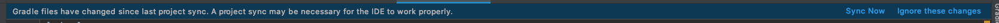

Android Studio vous proposera peut-être de déplacer la dépendance dans le catalogue de versions (`gradle/libs.versions.toml`). Vous pouvez accepter : le résultat est le même, les versions sont simplement regroupées dans un seul fichier.

::: warning Une erreur à la compilation ?

Les librairies récentes demandent parfois un `compileSdk` plus élevé que celui de votre projet (le message d'erreur indique la version attendue) :

```text
Dependency 'androidx.navigation:navigation-compose-android:2.10.2' requires libraries and applications
that depend on it to compile against version 37 or later of the Android APIs.
:app is currently compiled against android-36.
```

Il suffit alors d'ajuster la valeur de `compileSdk` dans le même fichier, puis de synchroniser à nouveau.

:::

### Exemple de Screen

Maintenant que vous avez un exemple de `NavHost`, je vous laisse créer deux `Screen` :

```kotlin
@Composable
fun Screen1(goToScreen2: (name: String) -> Unit) {
    Column {
        Button(onClick = { goToScreen2("Valentin") }) {
            Text("Bonjour Valentin")
        }
    }
}
```

- Screen1 est une page qui possède un paramètre `goToScreen2` qui est une fonction. Ce paramètre va nous permettre de naviguer entre les différentes `Screen`.
- `goToScreen2("Valentin")` permet de naviguer vers la `Screen2` avec le paramètre `Valentin`.

```kotlin
@Composable
fun Screen2(name: String, goBack: () -> Unit) {
    Column {
        Text("Bonjour $name")
        Button(onClick = { goBack() }) {
            Text("Retour")
        }
    }
}
```

- Screen2 est une page qui possède deux paramètres : `name` qui est un `String` et une action `goBack` qui est une fonction (callback).

::: tip Où ranger les `Screen`

Les `Screen` sont des composants comme les autres. Vous pouvez les ranger dans un dossier `ui` par exemple.

- `ui/` : Les pages.
  - `home.kt` : La page d'accueil, logo + deux boutons.
  - `screen1.kt` : La première page.
  - `screen2.kt` : La seconde page.

:::

::: danger Des callbacks partout ?

Il est possible que vous trouviez cela « bizarre » d'avoir des callbacks partout. C'est normal, c'est le principe de la programmation avec Compose. Ça nous permet de garder une application simple et modulaire. Et avec des composants réutilisables, indépendants les uns des autres. 

En effet, les composants ne connaissent pas le contexte dans lequel ils sont utilisés. Ils ne font qu'afficher des données et appeler des actions. C'est à vous de gérer la logique de votre application.

:::

#### Créer des éléments

Avant de réaliser le code, nous allons dans un premier temps créer un nouveau package. Il nous servira à stocker nos composants.

Création du package, la procédure est intégrée dans Android Studio :

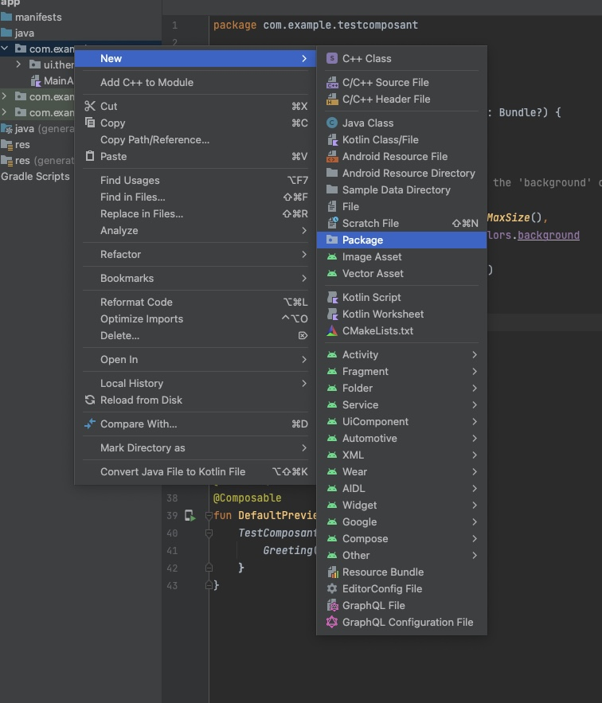

Nommage du package, dans mon cas « ui » :

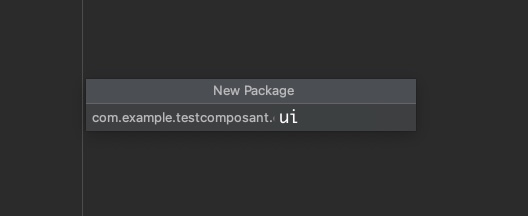

Maintenant que votre package est créé, je vous laisse créer le fichier Kotlin qui contiendra votre code :

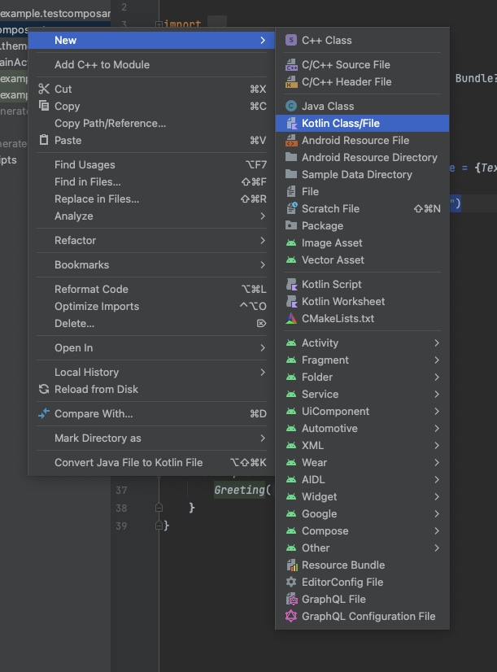
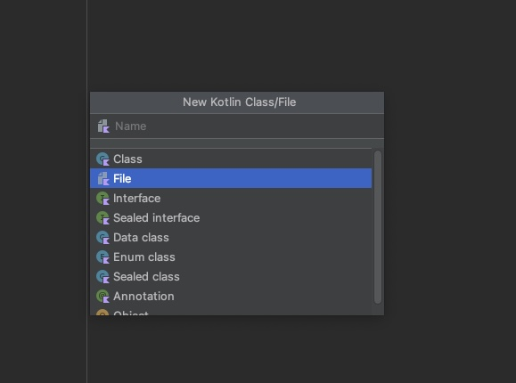

Pour le nom du fichier, je vous laisse choisir. Moi dans mon cas je vais le nommer « `home.kt` ».

::: tip Un instant !

Pas de classe !?

<iframe src="https://giphy.com/embed/l0HlKrB02QY0f1mbm" width="480" height="270" frameBorder="0" class="giphy-embed" allowFullScreen></iframe>

**Et non** avec Compose, les composants ne sont pas des classes. Ce sont des fonctions « Composable » qui seront appelées au bon moment suivant les bonnes conditions dans votre vue.

:::

#### À faire

- Remplacer le contenu du `setContent` de votre `MainActivity` par le `NavHost` que nous avons vu ensemble. 
- Créer les `Screen` `Screen1` et `Screen2`.
- Lancer votre application et tester la navigation entre les deux `Screen`.

::: danger Attention

Pour le `NavHost` dans le `setContent` il est important de retirer **le Scaffold**. En effet, en le retirant nous allons pouvoir le gérer écran par écran.

Tant que vos écrans n'ont pas leur propre `Scaffold`, leur contenu passe sous la barre d'état (c'est l'affichage « bord à bord », activé par `enableEdgeToEdge()`). Pas de panique, nous corrigeons ça dans la partie suivante.

:::

Voici le rendu attendu :

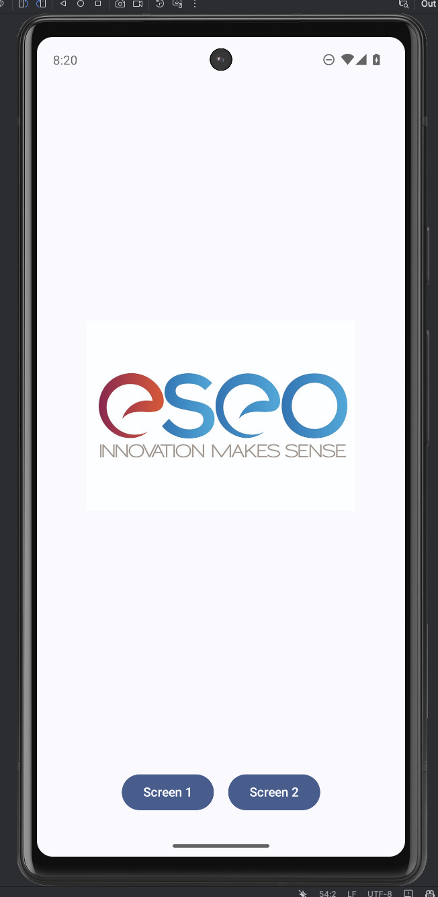

Dans mon cas, après la création de mes `Screen` j'ai l'architecture suivante :

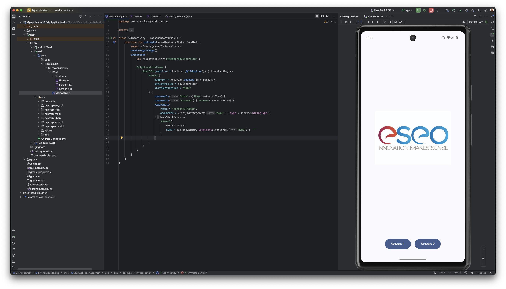

Et d'un point de vue code :

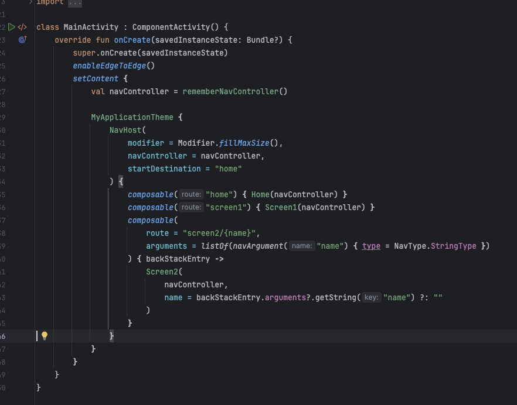

#### Testons ensemble

Nous avons vu ensemble comment passer des paramètres. Mais le nom `Valentin` est un peu statique. Nous allons voir ensemble comment rendre cet élément dynamique.

- Rendre dynamique le nom saisi dans le Screen 1.
- À votre avis, comment faire ? Quelle ressource utiliser ?

## Le scaffold

Le `Scaffold` est un composant qui permet de créer une structure de base pour notre application. Il contient plusieurs éléments :

- `topBar` : La barre en haut de l'application (une `TopAppBar`).
- `bottomBar` : La barre en bas de l'application (une `BottomAppBar` ou une `NavigationBar`).
- `floatingActionButton` : Le bouton flottant.
- `snackbarHost` : L'emplacement des Snackbars.

Chaque élément est optionnel, vous pouvez donc choisir de les afficher ou non.

```kotlin
Scaffold(
        topBar = {
            TopAppBar(
                title = { Text("Ma liste") },
                navigationIcon = {
                    IconButton(onClick = { navController.popBackStack() }) {
                        Icon(
                            imageVector = Icons.AutoMirrored.Filled.ArrowBack,
                            contentDescription = "Back"
                        )
                    }
                })

        }
    ) { innerPadding ->
        Column(modifier = Modifier.padding(innerPadding)) {
            // Contenu de la page
        }
    }
```

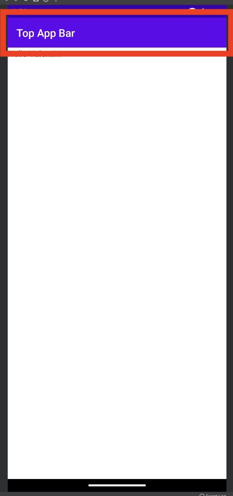

::: warning Deux points pour que ce code compile

Les icônes (`Icons.…`) ne sont plus fournies avec Material 3 (erreur `Unresolved reference 'Icons'`). Ajouter la dépendance suivante dans votre `build.gradle.kts` (celui du module `app`), puis `Sync` :

```kotlin
implementation("androidx.compose.material:material-icons-core")
```

Pas de numéro de version ici : il est géré par le « BOM » Compose déjà présent dans votre projet.

La `TopAppBar` est encore marquée « expérimentale ». Android Studio vous proposera d'ajouter `@OptIn(ExperimentalMaterial3Api::class)` au-dessus de votre composant : acceptez.

:::

### À faire

Je vous laisse ajouter un `Scaffold` à votre `Screen1` et `Screen2`.

- Le `Screen1` doit avoir un `TopAppBar` avec un titre et un bouton de retour.
- Le `Screen2` doit avoir un `TopAppBar` avec un titre et un bouton de retour.

::: tip Un peu de couleur

Votre top-bar est blanche ? C'est normal, nous n'avons pas encore ajouté de thème. Je vous laisse ajouter le thème suivant :

```kotlin
topBar = {
    TopAppBar(
        title = {Text("Top App Bar") }, // Titre de la barre
        colors = TopAppBarDefaults.topAppBarColors(
            containerColor = MaterialTheme.colorScheme.primaryContainer,
            titleContentColor = MaterialTheme.colorScheme.primary,
        ), // Couleur de la barre
    )
},
```

:::

## Les données

Depuis le début, nous avons globalement travaillé sur des données statiques. Android est une plateforme « très ouverte », il est donc très facilement possible de faire « n'importe quoi ».

Dans cette partie nous allons voir l'organisation des données, et surtout l'organisation du code pour les gérer.

Avant de rentrer dans le vif du sujet, voici ce que nous allons réaliser :

<center>
<iframe width="560" height="315" src="https://www.youtube-nocookie.com/embed/ai1NUBL0gRs?si=Ldr1g2OIqPyMoPWX" title="YouTube video player" frameborder="0" allow="accelerometer; autoplay; clipboard-write; encrypted-media; gyroscope; picture-in-picture; web-share" referrerpolicy="strict-origin-when-cross-origin" allowfullscreen></iframe>
</center>

### MVVM : Model View ViewModel

Le MVVM est un pattern de conception qui permet de séparer les données de l'interface. Bien que plutôt ancien (créé par Microsoft en 2005), il est toujours d'actualité. 

Il est très utilisé dans l'approche composant, car il permet de séparer les données de l'interface. Il est composé de trois éléments :

- `Model` : Les données de l'application. Sur Android nous allons utiliser des classes `data class`.
- `View` : L'interface de l'application. Ce sont nos composants (`@Composable`).
- `ViewModel` : La logique de l'application. Ce sont des classes particulières qui vont faire le lien entre les `Model` et les `View`.

Quelques points sont à retenir :

- Le `Model` ne doit pas contenir de logique, il doit uniquement contenir les données.
- Le `ViewModel` doit contenir la logique de l'application. Il doit être testable.
- Le `View` doit uniquement contenir l'interface de l'application.
- Le `ViewModel` doit être observé par la `View`. (Nous verrons cela plus tard).
- Le `ViewModel` **ne doit pas** contenir de référence à la `View`.

::: tip Découper plus ?

Il est bien évidemment possible de découper davantage le code. Par exemple, nous pourrions ajouter un `Repository` ou un `Service` qui va permettre de gérer les données. Mais pour l'instant, nous allons nous concentrer sur le MVVM. Ceux qui ont l'habitude de travailler avec des architectures plus complexes pourront facilement adapter ce modèle.

Ce qu'il faut retenir, c'est que Google vous laisse de la liberté dans l'organisation de votre code, mais recommande fortement le MVVM pour les applications Android.

:::

### La recomposition

Il faut comprendre ici que notre vue sera « recomposée » à chaque fois que nous allons mettre à jour nos données. Nous allons donc devoir gérer des listes qui vont être modifiées en temps réel. Pour ça nous allons utiliser un `MutableStateFlow`, le `MutableStateFlow` sera un flux de données qui va nous permettre de mettre à jour notre liste (visuellement dans notre interface).

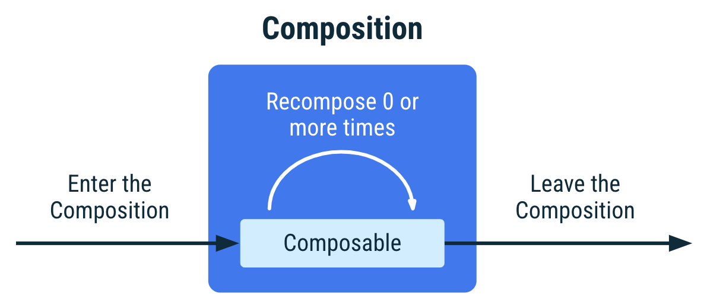

[En savoir plus sur la recomposition](https://developer.android.com/develop/ui/compose/lifecycle?hl=fr)

### Évolution de la structure

Notre projet va évoluer un peu, voici les éléments que nous allons devoir ajouter :

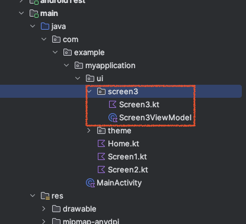

- `Screen3ViewModel.kt` : Le ViewModel qui va contenir la logique de notre écran.
- `Screen3.kt` : Le composant qui va contenir l'interface de notre écran (notre liste et nos boutons d'actions).

::: tip Pas d'inquiétude

Ici, il faut bien voir que je vous communique une façon correcte de faire. Nous pourrions évidemment tout simplifier en mettant tout dans le même fichier (dans la vue par exemple). Mais à mon sens, il est important de comprendre dès le début les bonnes pratiques.

:::

### Quelques librairies à ajouter

Pour que nous puissions faire notre scan en arrière-plan et échanger les données entre la `View` et le `ViewModel` nous allons avoir besoin de quelques librairies :

```kotlin
implementation("androidx.lifecycle:lifecycle-runtime-compose:2.11.0")
implementation("androidx.lifecycle:lifecycle-viewmodel-compose:2.11.0")
```

Ajouter ces dépendances dans votre fichier `build.gradle.kts` (celui dans `app` du projet). Il faut ensuite synchroniser le projet avec les modifications (bandeau bleu en haut).

[Plus d'informations](https://developer.android.com/jetpack/androidx/releases/lifecycle)

### Création du ViewModel

Le `ViewModel` est une classe qui va contenir la logique de notre écran. Il va permettre de séparer les données de l'interface.

```kotlin
class Screen3ViewModel: ViewModel() {
    // Liste de String
    val listFlow = MutableStateFlow(listOf<String>())

    // Ajouter un élément
    fun addElement(element: String) {
        listFlow.value += element
    }

    // Supprimer un élément
    fun removeElement(element: String) {
        listFlow.value -= element
    }

    fun clearList() {
        listFlow.value = emptyList()
    }
}
```

- `listFlow` : Une liste de `String` qui est un `MutableStateFlow`. Un `MutableStateFlow` est un élément qui va permettre de stocker des données et de les observer.
- `addElement` : Une fonction qui va permettre d'ajouter un élément à la liste.
- `removeElement` : Une fonction qui va permettre de supprimer un élément de la liste.
- `clearList` : Une fonction qui va permettre de vider la liste.

::: tip Je vous laisse faire

Créer le fichier `Screen3ViewModel.kt` dans le bon dossier. Et ajouter le code ci-dessus.

:::

### Création de la `View`

Pour la vue, nous allons procéder différemment. Je vais vous montrer le résultat final, et vous allez devoir le reproduire étape par étape.

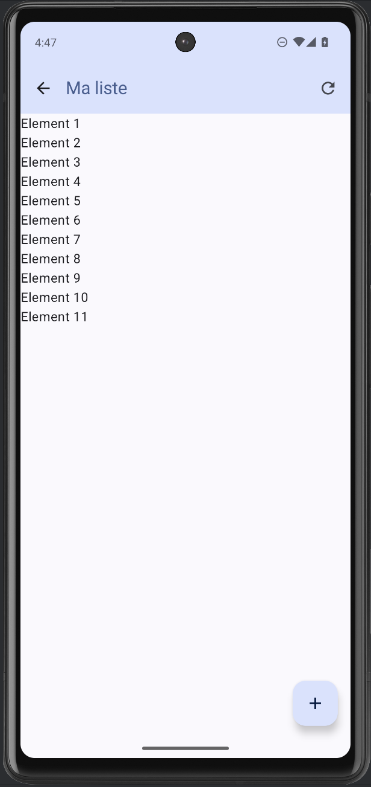

::: tip Analyse

Avant de continuer, qu'observez-vous dans l'image ci-dessus ?

- Quels éléments sont présents ?
- À votre avis, quels sont les composants utilisés ?
- Combien avons-nous d'actions ?

:::

### La structure du composant

Avant de vous donner le code, nous allons analyser ensemble la structure du code que vous allez devoir écrire.

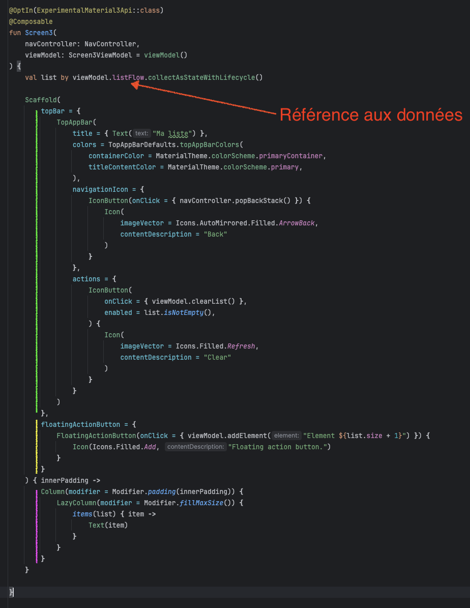

- En vert : La TopAppBar avec le bouton de retour et l'action pour vider la liste.
- En jaune : Le bouton flottant qui va permettre d'ajouter un élément à la liste.
- En violet : La liste des éléments. `LazyColumn` est un composant qui va permettre d'afficher une liste de manière optimisée.

### Structure du composant

Pour fonctionner, notre composant va avoir besoin de plusieurs paramètres :

```kotlin
@OptIn(ExperimentalMaterial3Api::class)
@Composable
fun Screen3(
    navController: NavController,
    viewModel: Screen3ViewModel = viewModel()
) {
    // Code du composant
}
```

- `navController` : Le `NavController` qui va permettre de naviguer entre les différentes `Screen`.
- `viewModel` : Le `ViewModel` qui va contenir la logique de notre écran.

::: tip Attention

Android Studio est parfois un peu capricieux. Si vous avez une erreur sur `viewModel()`. Ajuster le code en ajoutant l'import suivant :

```kotlin
import androidx.lifecycle.viewmodel.compose.viewModel
```

:::

### Les données

Pour observer les données, nous allons utiliser un `collectAsStateWithLifecycle`. Cela va nous permettre de mettre à jour l'interface en fonction des données.

```kotlin
val list by viewModel.listFlow.collectAsStateWithLifecycle()
```

::: tip Comprendre les Flow en deux mots

Un `Flow` est un élément qui va permettre de stocker des données et de les observer. Il est très utilisé dans l'approche MVVM. Voici quelques éléments à retenir :

- Un `Flow` est un flux de données asynchrone.
- Il peut être modifié.
- Il peut être observé.

```kotlin
// Dans le ViewModel
val listFlow = MutableStateFlow(listOf<String>())
listFlow.value += "Un élément"
// Ou
val intFlow = MutableStateFlow(0)
intFlow.value += 1

// Dans le composant
val list by viewModel.listFlow.collectAsStateWithLifecycle()
```

Le flow est mis à jour dans le ViewModel via le `.value = …`. 
Dans le composant, nous allons observer le flow avec un `collectAsStateWithLifecycle`. À chaque fois que le flow est mis à jour, le composant sera mis à jour de manière réactive et automatique.

:::

### La TopAppBar

La `TopAppBar` doit permettre dans cet écran de :

- Revenir à l'écran précédent.
- Afficher le titre de l'écran.
- Vider la liste.

```kotlin
topBar = {
    TopAppBar(
        title = { Text("Ma liste") },
        colors = TopAppBarDefaults.topAppBarColors(
            containerColor = MaterialTheme.colorScheme.primaryContainer,
            titleContentColor = MaterialTheme.colorScheme.primary,
        ),
        navigationIcon = {
            IconButton(onClick = { navController.popBackStack() }) {
                Icon(
                    imageVector = Icons.AutoMirrored.Filled.ArrowBack,
                    contentDescription = "Back"
                )
            }
        },
        actions = {
            IconButton(
                onClick = { viewModel.clearList() },
                enabled = list.isNotEmpty(),
            ) {
                Icon(
                    imageVector = Icons.Filled.Refresh,
                    contentDescription = "Clear"
                )
            }
        }
    )
},
```

Comment lire ce code ? Il y a plusieurs éléments importants :

- `NavigationIcon` : Le bouton de retour. Celui-ci va permettre de revenir à l'écran précédent avec `navController.popBackStack()`.
- `Actions` : Les actions de la `TopAppBar`. Ici nous avons un seul bouton qui va permettre de vider la liste. Ce bouton est un `IconButton` qui contient un `Icon`.
  - Celui-ci est activé uniquement si la liste n'est pas vide (`list.isNotEmpty()`).

::: tip Et oui…

Avec Compose et Kotlin, rendre actif ou inactif un bouton est très simple. Il suffit de mettre `enabled = true` ou `enabled = false`. En exploitant le côté réactif de Compose, le bouton sera automatiquement mis à jour en fonction de la valeur de `list`.

- Liste vide : `enabled = false` == `list.isNotEmpty()`
- Liste non vide : `enabled = true` == `list.isNotEmpty()`

Ça change du code que vous avez l'habitude de voir non ? 😏

:::

### Le bouton flottant

Le bouton flottant est également un élément courant dans les applications Android. Il permet de réaliser une action principale. Dans notre cas ici, il va permettre d'ajouter un élément à la liste.

```kotlin
floatingActionButton = {
    FloatingActionButton(onClick = { viewModel.addElement("Element ${list.size + 1}") }) {
        Icon(Icons.Filled.Add, "Floating action button.")
    }
}
```

- `FloatingActionButton` : Le bouton flottant.
- `onClick` : L'action à réaliser lors du clic sur le bouton.
- `Icon` : L'icône du bouton.

L'action à réaliser appelle la fonction `addElement` du `ViewModel` avec un élément de la forme `Element ${list.size + 1}`. Cela va permettre d'ajouter un élément à la liste.

### La liste

Pour la liste rien de bien compliqué, nous allons utiliser un `LazyColumn` qui va permettre d'afficher une liste de manière optimisée.

```kotlin
Column(modifier = Modifier.padding(innerPadding)) {
    LazyColumn(modifier = Modifier.fillMaxSize()) {
        items(list) { item ->
            // Affiché à chaque élément de la liste.
            // Ici un simple Text
            Text(item)
        }
    }
}
```

::: tip LazyColumn ?

`LazyColumn` est un composant qui va permettre d'afficher une liste de manière optimisée. En effet, il ne va afficher que les éléments qui sont visibles à l'écran. Cela permet de ne pas charger tous les éléments en même temps.

Nous pourrions avoir des milliers d'éléments dans notre liste, `LazyColumn` va permettre de les afficher sans problème. Quelle que soit la puissance de votre téléphone…

:::

### À faire

Maintenant que vous avez l'ensemble des éléments, je vous laisse créer votre `Screen3`. N'hésitez pas à me poser des questions si vous avez des difficultés.

## Découper plus finement / améliorer l'affichage

Votre liste est plutôt basique, un simple texte qui se répète. Nous allons voir ensemble comment améliorer l'affichage de cette liste. L'objectif est d'avoir un affichage similaire à celui-ci :

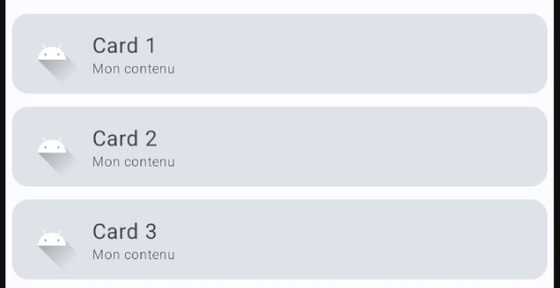

Avant de continuer, analysons ensemble ce que nous avons :

- Nous avons un `Card` qui contient un Titre, un Sous-Titre et une icône.
- Le `Card` est répété pour chaque élément de la liste.
- Vous ne le voyez pas, mais le `Card` est cliquable.

### Organisation du code

Ici, les cards ne sont pas des `Screens`, mais un simple composant, nous allons donc les ranger dans un dossier différent. Pour cela, je vous laisse créer un dossier `components` dans votre dossier `ui`.

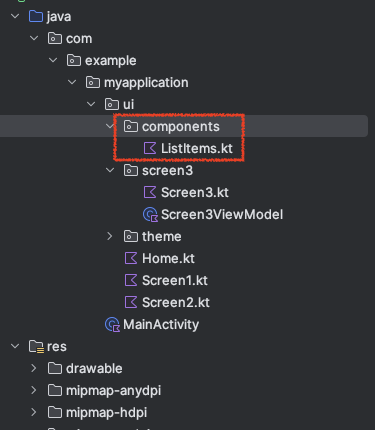

### Base du composant

Cette fois-ci je ne vous donne que la base du composant, je vous laisse le compléter.

```kotlin
@Composable
fun ElementList(
    title: String = "Mon titre",
    content: String = "Mon contenu",
    image: Int? = R.drawable.ic_launcher_foreground,
    onClick: () -> Unit = {}
) {
    // À vous de jouer
}
```

### À faire

Je vous laisse créer le composant `ElementList` dans le dossier `components`. Puis l'utiliser dans votre `Screen3` à la place du `Text`.

Dans mon cas voici le rendu final :

<center>
<iframe width="560" height="315" src="https://www.youtube-nocookie.com/embed/y5himtvZQFQ?si=Ldr1g2OIqPyMoPWX" title="YouTube video player" frameborder="0" allow="accelerometer; autoplay; clipboard-write; encrypted-media; gyroscope; picture-in-picture; web-share" referrerpolicy="strict-origin-when-cross-origin" allowfullscreen></iframe>
</center>

### À faire suite

Maintenant que vous avez votre liste d'éléments avec un peu de style, je vous laisse implémenter la suppression d'un élément avec une confirmation. Pour cela, vous pouvez utiliser un `Dialog` ou un `Snackbar` (plus compliqué, il faut regarder la documentation).

## Vous souhaitez aller plus loin ?

Nous avons créé des composants simples, mais il est possible d'aller beaucoup plus loin. Par exemple, vous n'avez pas l'impression que votre Scaffold est toujours un peu identique ?

Et oui, ce sont toujours un peu les mêmes choses, je vous propose de créer un composant `MyScaffold` qui va permettre de simplifier la création de vos `Screen`.

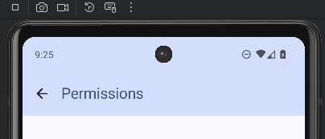

Dans le dossier `components`, je vous laisse créer un fichier `MyScaffold.kt`. Voici la base du composant :

```kotlin
@OptIn(ExperimentalMaterial3Api::class)
@Composable
fun MyScaffold(title: String, onBackClick: () -> Unit, content: @Composable () -> Unit) {
    Scaffold(
        topBar = {
            TopAppBar(
                title = { Text(title) },
                colors = TopAppBarDefaults.topAppBarColors(
                    containerColor = MaterialTheme.colorScheme.primaryContainer,
                    titleContentColor = MaterialTheme.colorScheme.primary,
                ),
                navigationIcon = {
                    IconButton(onClick = { onBackClick() }) {
                        Icon(
                            imageVector = Icons.AutoMirrored.Filled.ArrowBack,
                            contentDescription = "Back"
                        )
                    }
                }
            )
        }
    ) { innerPadding ->
        Column(modifier = Modifier.padding(innerPadding)) {
            content()
        }
    }
}
```

### À faire

Je vous laisse mettre à jour vos `Screen1`, `Screen2` pour utiliser ce nouveau composant.

::: danger Pourquoi pas le `Screen3`

Il est tentant de vouloir généraliser au maximum son code. Cependant, il faut faire attention à ne pas tomber dans le piège de la généralisation à outrance. En effet, il est important de bien comprendre les besoins de l'application et de ne pas généraliser pour généraliser.

C'est le cas ici, le `Screen3` est un écran qui est très spécifique (FloatButton, Action de clear, etc.). Il est donc important de ne pas généraliser ce composant.

:::

## Les permissions

Les permissions sont un élément important d'une application Android. Elles permettent de demander à l'utilisateur l'autorisation d'accéder à certaines fonctionnalités de l'appareil.

Elles sont obligatoires pour accéder à certaines fonctionnalités de l'appareil. Par exemple, pour accéder à la caméra, il est nécessaire d'avoir la permission `CAMERA`.

::: danger Point important

L'utilisateur aura toujours le choix d'accepter ou de refuser une permission. Il est donc important de gérer les deux cas. De plus, l'utilisateur peut également changer son choix a posteriori dans les paramètres de l'application.

Il ne faut donc **jamais** sauvegarder le choix de l'utilisateur dans une base de données ou autre. Il est important de toujours demander la permission à chaque lancement de l'application.

Si l'utilisateur a déjà accepté la permission, la demande sera automatiquement acceptée **et donc invisible pour lui**.

:::

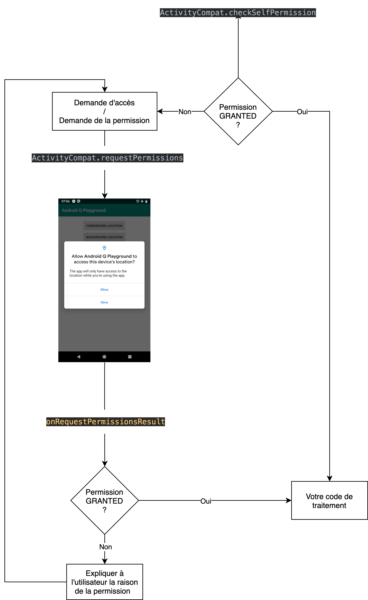

Nous allons voir comment faire avec Compose. Pour ça nous allons devoir utiliser une librairie développée par Google : [Accompanist](https://google.github.io/accompanist/)

::: tip Accompanist

Accompanist est une librairie de transition : elle accueille des fonctionnalités le temps qu'elles soient intégrées dans Compose. La plupart de ses modules ont d'ailleurs déjà été intégrés puis retirés, la gestion des permissions fait partie de ceux qui restent.

:::

Pour rester dans le thème du Bluetooth, nous allons regarder comment demander les permissions en lien avec le BLE. À savoir :

- `ACCESS_FINE_LOCATION` : Pour accéder à la localisation de l'appareil.

### Ajouter la librairie

Pour ajouter la librairie, nous allons devoir modifier notre fichier `build.gradle.kts` (celui dans `app` du projet). Nous allons ajouter la dépendance suivante :

```kotlin
implementation("com.google.accompanist:accompanist-permissions:0.37.3")
```

Il faut ensuite synchroniser le projet avec les modifications (bandeau bleu en haut).

### Le fichier AndroidManifest.xml

Avant de demander les permissions, nous allons devoir les déclarer pour que l'application puisse les demander. Pour ça nous allons modifier le fichier `AndroidManifest.xml`. Nous allons ajouter les permissions suivantes :

```xml
<!-- Permissions pour le BLE Android 12 et plus -->
<uses-permission android:name="android.permission.BLUETOOTH_SCAN"
    android:usesPermissionFlags="neverForLocation"
    tools:targetApi="s" />
<uses-permission android:name="android.permission.BLUETOOTH_CONNECT" />

<!-- Anciennes permissions BLE (jusqu'à Android 11 inclus) -->
<uses-permission android:name="android.permission.BLUETOOTH" android:maxSdkVersion="30" />
<uses-permission android:name="android.permission.BLUETOOTH_ADMIN" android:maxSdkVersion="30" />

<uses-permission android:name="android.permission.ACCESS_COARSE_LOCATION" />
<uses-permission android:name="android.permission.ACCESS_FINE_LOCATION" />
```

::: tip Des nouvelles permissions avec Android S

Avec Android S, Google a ajouté de nouvelles permissions pour le BLE. Il est donc important de les ajouter pour que votre application fonctionne correctement sur les appareils Android 12 et plus.

Ces permissions vont permettre de demander l'accès au BLE sans demander l'accès à la localisation. Cela permet surtout de ne pas effrayer l'utilisateur avec une demande de permission de localisation (qui souvent est mal perçue).

:::

### Utiliser la librairie

Cette librairie va nous permettre de demander les permissions à l'utilisateur et de gérer l'état de la demande (acceptée, refusée, etc.). Si vous avez compris ce que nous avons vu précédemment, vous vous doutez que tout va être géré par un état.

```kotlin
val toCheckPermissions = listOf(android.Manifest.permission.ACCESS_FINE_LOCATION)
val permissionState = rememberMultiplePermissionsState(toCheckPermissions)
```

Quelques explications :

- `toCheckPermissions` : La liste des permissions à vérifier.
- `permissionState` : L'état des permissions. Cet état va nous permettre de savoir si les permissions sont accordées ou non.

Cette librairie est marquée « expérimentale » : comme pour la `TopAppBar`, il faut ajouter `@OptIn(ExperimentalPermissionsApi::class)` au-dessus de votre composant.

Maintenant que nous avons notre état, nous allons pouvoir l'utiliser pour demander les permissions à l'utilisateur. Pour ça, un simple test sur l'état des permissions suffit :

```kotlin
if (!permissionState.allPermissionsGranted) {
    Button(onClick = { permissionState.launchMultiplePermissionRequest() }) {
        Text(text = "Demander la permission")
    }
} else {
    Text(text = "Permission accordée")
}
```

Que fait ce code ?

- Si l'utilisateur n'a pas accordé les permissions, nous affichons un bouton qui permet de demander les permissions.
- Si l'utilisateur a accordé les permissions, nous affichons un texte qui indique que les permissions sont accordées.

::: tip C'est tout ?

Et oui, c'est tout. La librairie `Accompanist` va gérer pour vous l'affichage de la demande de permission. Elle va afficher une fenêtre qui va permettre à l'utilisateur d'accepter ou de refuser les permissions.

Vous n'avez pas connu les demandes de permissions à l'ancienne, mais croyez-moi, c'est un sacré gain de temps.

:::

### À faire

Pour tester la demande de permission, nous allons réaliser l'exemple suivant :

<center>
<iframe width="560" height="315" src="https://www.youtube-nocookie.com/embed/jVg4nR6WSic?si=Ldr1g2OIqPyMoPWX" title="YouTube video player" frameborder="0" allow="accelerometer; autoplay; clipboard-write; encrypted-media; gyroscope; picture-in-picture; web-share" referrerpolicy="strict-origin-when-cross-origin" allowfullscreen></iframe>
</center>

Qu'avons-nous ici ?

- Un nouvel écran `Screen4` qui va contenir la demande de permission.
- Un bouton qui va permettre de demander la permission.
- La dernière localisation connue de l'appareil.

::: tip Important

Ici l'idée est de comprendre la logique de demande de permissions. Obtenir la localisation est plutôt un prétexte pour vous montrer comment ça doit fonctionner.

Dans le cas du BLE, la demande de permission nous permettra d'accéder à la partie scan du BLE. La localisation ici est « un bonus » pour illustrer.

:::

#### Comment obtenir la dernière localisation connue ?

Pour obtenir la dernière localisation connue de l'appareil, nous allons utiliser le `LocationManager` d'Android.

```kotlin
// Récupérer le contexte de l'application
val applicationContext = androidx.compose.ui.platform.LocalContext.current

// Récupérer la dernière localisation connue. C'est une variable mutable
// c'est-à-dire que nous allons pouvoir la modifier. Et la vue sera mise à jour
var locationText by remember { mutableStateOf("") }

// Récupérer la position de l'utilisateur. Cette récupération
// est faite après la demande de permission.
// VOUS DEVEZ METTRE CE CODE DANS LE BLOCK DU IF
// QUAND LES PERMISSIONS SONT ACCORDÉES
LaunchedEffect(permissionState) {
    val locationManager = applicationContext.getSystemService(LOCATION_SERVICE) as LocationManager?

    locationManager?.run {
        locationManager.getLastKnownLocation(LocationManager.PASSIVE_PROVIDER)?.run {
            // Ici nous avons la dernière localisation connue
            // mais nous ne l'affichons pas
            val latitude = this.latitude
            val longitude = this.longitude

            // Nous modifions le texte. Quand la valeur va changer
            // Compose va mettre à jour l'interface
            locationText = "Latitude: $latitude, Longitude: $longitude"
        }
    }
}

Text(text = locationText)
```

::: tip `LaunchedEffect` ?

`LaunchedEffect` est un composant qui va permettre de lancer une action lorsqu'un élément change. Ici, nous allons lancer la récupération de la localisation lorsque les permissions sont accordées.

L'idée derrière `LaunchedEffect` est de lancer une action qui n'est pas liée à l'interface. Par exemple, lancer une requête réseau, ou récupérer une localisation. Il ne sera lancé qu'une seule fois.

**Attention** : `LaunchedEffect` est un composant qui ne doit pas être utilisé à tout va. Il est important de bien comprendre son fonctionnement et de l'utiliser à bon escient. Ici il nous aide juste à avoir un code simple. En réalité, il serait intéressant de gérer la récupération de la localisation dans le `ViewModel`.

:::

### À faire

Je vous laisse créer le `Screen4` avec la demande de permission et l'affichage de la dernière localisation connue.

N'oubliez pas :

- La page doit être ajoutée sur la Home (bouton).
- La localisation doit être récupérée dans le `LaunchedEffect`, une fois les permissions accordées.
- Votre `Screen4` doit être dans votre dossier `ui`.
- Votre `Screen4` doit être mis dans le `NavHost`.

## Conclusion

Dans ce TP, vous avez :

- navigué entre plusieurs écrans avec un `NavHost` et des callbacks ;
- structuré vos écrans avec le `Scaffold` ;
- séparé la logique (ViewModel) de l'interface (les composants) ;
- observé un `Flow` pour mettre à jour une liste automatiquement ;
- découpé votre interface en composants réutilisables ;
- demandé une permission à l'utilisateur.

Gardez bien ce projet : il vous servira de référence. Dans le [TP suivant](./android-ble.md), nous allons réutiliser exactement ce découpage pour dialoguer avec un périphérique BLE.

👋 Si vous avez des questions, n'hésitez pas.
