# TP Android Compose

::: details Sommaire
[[toc]]
:::

## Introduction

Dans ce TP, nous allons découvrir Android Compose, la nouvelle façon de créer des interfaces pour Android.

Nous allons y découvrir les bases de Compose, comment créer des interfaces, comment gérer les états, et comment interagir avec les utilisateurs.

L'objectif est de vous donner les clefs pour réaliser le projet final de ce cours : Une application Android qui dialogue avec un périphérique Bluetooth (BLE).

::: tip Note importante

L'application que nous réalisons dans ce TP est une application « fictive », elle est là pour vous faire pratiquer Compose. Elle ne sera pas celle à restituer. Cependant, ne la perdez pas, elle vous sera utile comme « projet de référence » pour votre réalisation.

Elle va surtout nous servir à comprendre comment fonctionne Compose, et comment l'utiliser pour réaliser des interfaces.

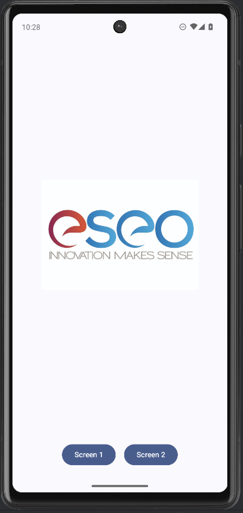

:::

## Fonctionnement de Android

Android est une plateforme mobile développée par Google. Elle repose sur un noyau Linux et est globalement utilisée pour des smartphones et des tablettes.

D'un point de vue sécurité et performance, Android est une plateforme très intéressante. Elle est également très populaire, ce qui en fait une plateforme de choix pour le développement d'applications mobiles.

Android repose sur plusieurs éléments :

- **Kotlin** : Kotlin est un langage plus récent qui est devenu le langage de prédilection pour le développement Android.
- **Gradle** : Gradle est un outil de build qui permet de compiler, de packager et de déployer les applications Android.
- **Android SDK** : L'Android SDK est un ensemble d'outils et de bibliothèques qui permettent de développer des applications Android.
- **Play Services** : Play Services est un ensemble de services qui permettent d'ajouter des fonctionnalités à une application Android.
- **Compose** : Compose est une bibliothèque qui permet de créer des interfaces pour Android.
- **Jetpack** : Jetpack est un ensemble de bibliothèques qui permettent de faciliter le développement d'applications Android.
- **View** : Les Views sont les éléments de base qui permettent de créer des interfaces pour Android (ancien système).

Android étant relativement ancien, beaucoup d'éléments reposent sur du XML. Cependant, récemment, Google a annoncé Compose, une nouvelle façon de créer des interfaces pour Android. C'est celle-ci que nous allons découvrir dans ce TP.

### Sécurité

Lors de l'installation d'une application Android. Techniquement, l'application est isolée des autres applications :

- Utilisation de permissions pour accéder à des ressources.
- Isolation des applications (sandbox).
- Sécurité des données (chiffrement, etc.).
- Permissions pour accéder à des ressources (caméra, contacts, localisation, etc).

::: tip Signature

Lors de l'installation d'une application, Android vérifie que l'application est signée par un certificat valide. Cela permet de garantir que l'application n'a pas été modifiée depuis sa publication.

Cette signature est également utilisée pour identifier l'application et pour gérer les mises à jour. Elle est de type RSA et est stockée dans le fichier APK.

:::

### Moteur de rendu

Depuis l'arrivée de Compose, Android utilise un nouveau moteur de rendu pour afficher les interfaces. Ce moteur nommé « Skia » est un moteur de rendu 2D qui est utilisé par de nombreux projets (Chrome, Firefox, etc.).

Il est très performant et permet de créer des interfaces fluides et réactives. Il est également très flexible et permet de créer des interfaces complexes.

### Principe de Compose

- **Déclaratif** : Compose est un framework déclaratif. Cela signifie que vous décrivez ce que vous voulez afficher, et Compose se charge de mettre à jour l'interface en fonction des changements.
- **Composable** : Compose repose sur le concept de composable. Un composable est une fonction qui prend des paramètres et qui retourne un élément de l'interface.
- **Observation** : Compose permet d'observer des données et de mettre à jour l'interface en fonction des changements.

::: tip Performances

Seul les composants qui ont changé sont mis à jour, ce qui permet d'optimiser les performances.

:::

### Multiplateforme

Avec Compose, il est également possible de créer des interfaces pour d'autres plateformes (Web, Desktop, iOS.). Plusieurs approches sont possibles :

Trois termes à retenir :

- **Compose** : La librairie de Google pour Android => Interface déclarative.
- **KMM** : Kotlin Multiplatform (Jetbrains) => Logique métier partagée.
- **CMP** : Compose Multiplatform (Jetbrains) => Interface partagée.

## Création du projet

Pour la création du projet, rien de spécial à prévoir. Il s'agit ici de suivre le processus de création d'une application comme habituellement. Pour ça nous allons utiliser « Android Studio » qui est l'IDE à utiliser pour créer une application Android.

Lors de la création, Android Studio va nous poser plusieurs questions, nous allons donc choisir :

- Template : Empty **Compose** Activity
- Language : Kotlin
- SDK Min. : SDK 26. (ou plus)

Je vous laisse suivre les étapes de création d'un nouveau projet.

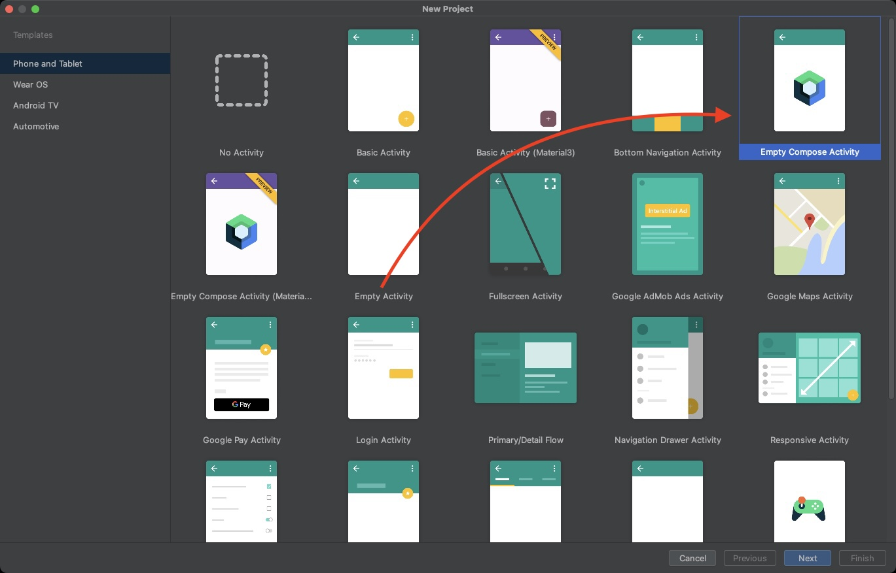
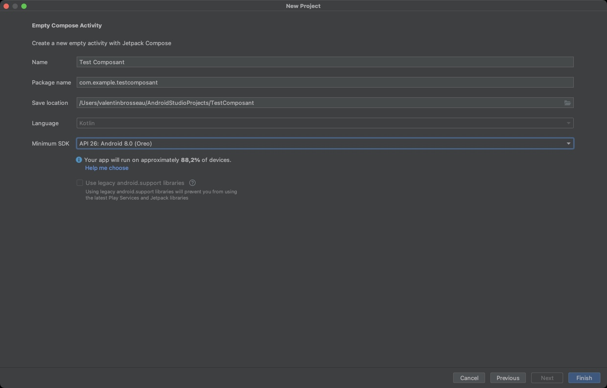

::: warning Mais quelques petites remarques :

- Le choix du package est très important. Comme nous avons vu ensemble en cours, le « Package » doit être unique. En effet deux applications ne peuvent pas avoir le même.
- Choisir un min SDK qui correspond aux cibles des mobiles souhaités. (Si vous êtes en France ou dans un autre pays, il conviendra de faire le bon choix).
- Kotlin est maintenant le langage à choisir, Java et Kotlin cohabite sans problème vous n'aurez donc aucun problème de compatibilité.

:::

### L'émulateur

Comme vu ensemble pendant le cours, l'émulateur va nous permettre de tester « simplement » notre application avec des performances _suffisantes dans les cas simples_. La création de celui-ci est intégrée à Android Studio. Dans Android Studio la partie émulateur s'appelle Device Manager et est disponible dans le menu. `tools`

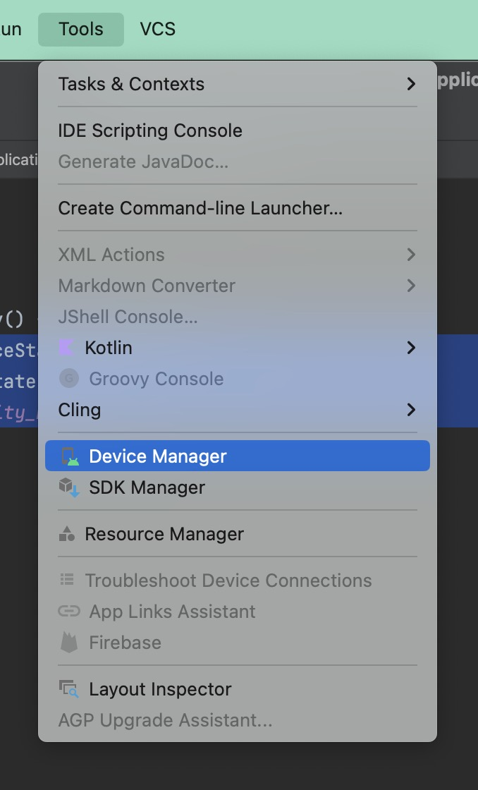

Pour le choix du type de devices vous êtes libres… Mais le mieux est de choisir un « template de mobile » assez représentatif de ce que l'on trouve chez les clients. Un bon choix est par exemple un « Pixel 6a » avec Android Oreo.

::: tip

Le Logo Playstore présent sur la ligne d'un simulateur indique que celui-ci est équipé des Play Services. Bien que dans notre cas ça ne change pas grand-chose. Cependant, je vous invite vivement à choisir un émulateur avec les Play Services, car celui-ci sera très proche d'un vrai téléphone trouvable dans le commerce.

:::

Maintenant que votre émulateur est créé, nous allons pouvoir lancer l'application « Run -> Run App ».

### Premier lancement et découverte

Pour débuter (et avant de tout retravailler), je vous laisse compiler et lancer une première fois l'application proposée par Google.

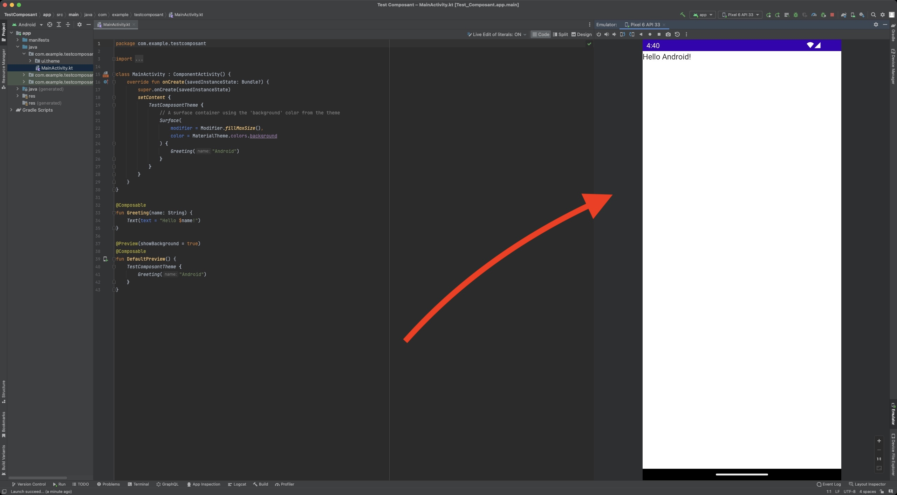

> Dans mon cas l'application est sur la droite.

::: tip Analysons le code

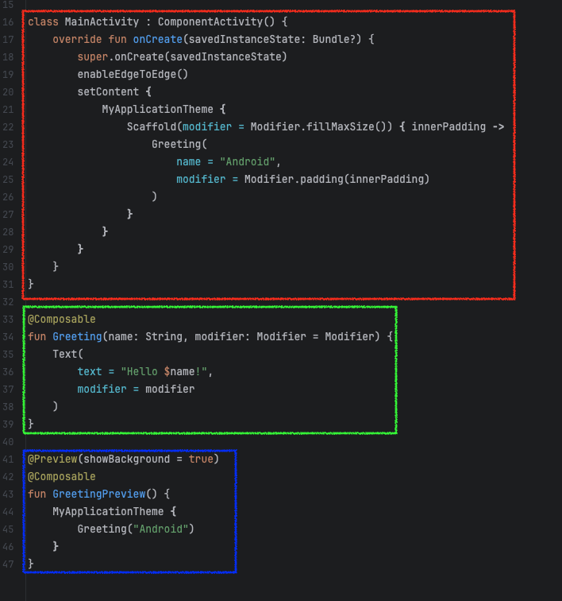

Ici, nous avons :

- Notre `MainActivity` qui est la première activité lancée. Elle contient un `setContent` qui va afficher notre interface.
- `Greeting` qui est un composant. Un composant est une partie de l'interface. Ici, nous avons un composant qui affiche un texte.
- `GreetingPreview` qui est une fonction qui a pour but de prévisualiser notre composant `Greeting` (une preview qui évite de lancer l'application à chaque fois pour voir le rendu).

:::

::: danger Note

Si vous avez des erreurs, il est possible que votre installation d'Android Studio ne soit pas correcte. Je vous invite à vérifier que vous avez bien installé les composants nécessaires.

:::

## L'architecture d'un projet Compose

### Les dossiers

Un projet Android est composé de plusieurs dossiers :

- `app` : C'est le dossier principal de l'application. Il contient le code source, les ressources, les fichiers de configuration, etc.
- `build` : C'est le dossier où sont stockés les fichiers générés par Gradle lors de la compilation de l'application.
- `gradle` : C'est le dossier où sont stockés les fichiers de configuration de Gradle.
- `res` : C'est le dossier où sont stockées les ressources de l'application (images, fichiers XML, etc). Nous avons dans ce dossier plusieurs sous-dossiers :
  - `drawable` : C'est le dossier où sont stockées les images.
  - `layout` : C'est le dossier où sont stockés les fichiers XML qui définissent l'interface de l'application.
  - `mipmap` : C'est le dossier où sont stockées les icônes de l'application.
  - `values` : C'est le dossier où sont stockés les fichiers XML qui définissent les valeurs de l'application (couleurs, dimensions, etc).

### Les textes

Android est un système d'exploitation pensé pour être internationalisé. C'est pourquoi il est important de séparer les textes de l'interface de l'application.

Pour cela, Android utilise des fichiers XML qui contiennent les textes de l'application. Ces fichiers sont stockés dans le dossier `res/values`.

Avant de continuer, je vous invite à ouvrir le fichier `strings.xml` qui se trouve dans le dossier `res/values` pour y observer les textes de l'application.

## Le fichier AndroidManifest

Pour rappel le fichier manifest va nous permettre d'exposer « de la configuration » relative à votre application sur le téléphone, cette configuration est très large :

- Le nom de votre application.
- Les `activity` accessibles.
- L'icône de votre application.
- Les services de votre application.
- Les paramétrages spécifiques de vos activités (Orientation, thème, comportement…)

### Personnalisation de l'application

### À faire :

- Éditer le fichier `AndroidManifest.xml`.
- Changer le nom de votre application (attention à bien utiliser la mécanique `i18n`).
- Regarder l'ensemble des paramètres spécifier dans le XML
- Tester à nouveau votre application

::: tip
Petit raccourci pratique d'Android Studio. Si vous appuyez deux fois sur la touche <kbd>Shift</kbd><kbd>Shift</kbd> Android Studio vous proposera de chercher des actions / fichiers / menus dans l'ensemble de votre projet.
:::

### À faire 2 :

Changer l'icône de l'application en utilisant les outils fournis par Google dans Android Studio « Image asset » :

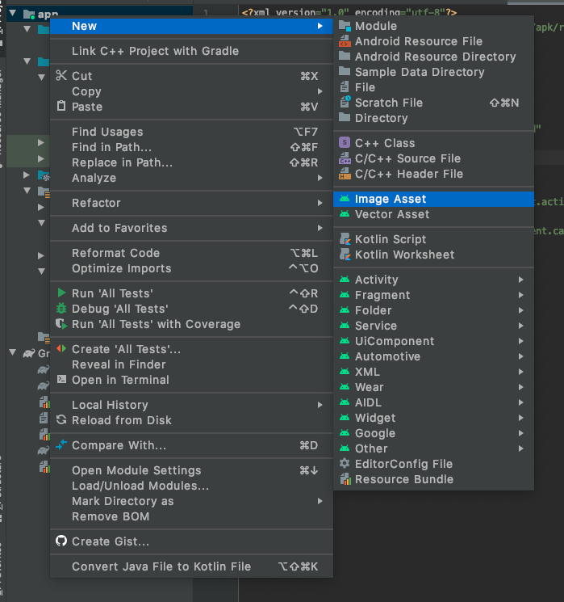

Une fois fait, regarder les modifications dans votre projet.

_Notamment :_

- Le fichier `AndroidManifest.xml` est-ce que celui-ci a été modifié ?
- Si oui, quel(s) élément(s) sont différents ?
- Si non, pouvez-vous me dire pourquoi ?

## L'interface

Compose repose sur l'utilisation du code pour définir l'interface que l'utilisateur va voir. Elle reprend les principes de la programmation en composant qui est largement utilisée dans le développement web.

Nous avons à notre disposition un ensemble de composants « fonctionnels » qui vont nous permettre de créer les éléments de notre interface :

- `Text` : Un composant qui permet d'afficher du texte.
- `Button` : Un composant qui permet d'afficher un bouton.
- `Switch` : Un composant qui permet d'afficher un toggle (un bouton qui peut être activé ou désactivé).
- `Image` : Un composant qui permet d'afficher une image.
- `LazyColumn` : Un composant qui permet d'afficher une liste.
- `Scaffold` : Un composant qui permet de créer une structure de base pour notre application (barre de navigation, etc.).
- `TopAppBar` : Un composant qui permet de créer une barre de navigation en haut de l'application.
- `Card` : Un composant qui permet de créer une carte.
- `IconButton` : Un composant qui permet de créer un bouton avec une icône.
- Etc… (Il y en a beaucoup plus, mais nous allons nous arrêter là pour l'instant).

Nous avons également des composants qui sont là pour définir la structure de notre application :

- `Column` : Un composant qui permet de créer une colonne.
- `Row` : Un composant qui permet de créer une ligne.
- `Box` : Un composant qui permet de créer une boîte.
- `Spacer` : Un composant qui permet de créer un espace entre deux éléments.

Les composants sont des fonctions que nous allons pouvoir appeler dans notre code. Ils seront appelés au bon moment en fonction de conditions que nous allons définir. Les composants seront imbriquables les uns dans les autres, ce qui nous permettra de créer des interfaces complexe. Par exemple :

```kotlin
Column() {
    Text("Texte 1")
    Text("Texte 2")
    Text("Texte 3")
}
```

Ce code va nous permettre d'afficher trois textes les uns en dessous des autres. Et si nous souhaitons afficher les textes les uns à côté des autres ? Il suffit de changer le composant `Column` par `Row`.

```kotlin
Row() {
    Text("Texte 1")
    Text("Texte 2")
    Text("Texte 3")
}
```

Nous pouvons également imbriquer les Colonnes et les Lignes :

```kotlin
Column() {
    Row() {
        Text("Texte 1")
        Text("Texte 2")
        Text("Texte 3")
    }
    Row() {
        Text("Texte 4")
        Text("Texte 5")
        Text("Texte 6")
    }
}
```

Cet exemple est là pour vous montrer la puissance de Compose. Compose a été pensé pour être simple et modulaire, par exemple pour un bouton le principe est le même :

```kotlin
Button(onClick = { /* Code appelé lors du clique sur le bouton */ }) {
    Text("Mon bouton")
}
```

Ici nous voyons que le composant `Button` prend en paramètre une action (un code qui sera appelé lors du clique sur le bouton) et un composant `Text` qui sera affiché dans le bouton. Pratique ! Et si nous souhaitons un bouton avec un loader ? Et bien c'est simple il suffit de changer le composant `Text` par un composant `CircularProgressIndicator` (qui est un loader).

```kotlin
Button(onClick = { /* Code appelé lors du clique sur le bouton */ }) {
    CircularProgressIndicator()
}
```

Et évidemment, nous allons pouvoir créer nos propres composants… Mais nous verrons ça plus tard.

### Imbrication des composants

Avec Compose, tout est composant. Cela signifie que nous allons pouvoir imbriquer les composants les uns dans les autres pour créer des interfaces complexes.

```kotlin
Column {
    Button(onClick = { /* Action */ }) {
        Text("Cliquez ici")
    }
    Spacer(modifier = Modifier.weight(1f))
    Text("Un texte")
}
```

Comment lire le code ci-dessus ?

- Nous avons un composant `Column` qui contient trois composants : un composant `Button`, un composant `Spacer` et un composant `Text`.
- Le composant `Button` est un bouton qui affiche le texte « Cliquez ici » et qui appelle une action lorsqu'il est cliqué.
- Le composant `Spacer` est un espace qui prend tout l'espace disponible.
- Le composant `Text` est un texte qui affiche le texte « Un texte ».

### Une disposition en « grille »

Nous construisons donc des grilles de composants.

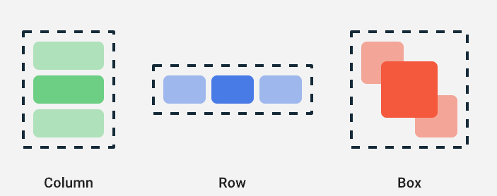

::: tip Et n'oubliez pas

Tout est imbriquable, vous pouvez donc imbriquer des `Column` dans des `Row`, des `Row` dans des `Column`, etc.

:::

### Les animations

Sans entrer dans les détails, réaliser des animations avec Compose est très simple. Nous avons à notre disposition plusieurs composants qui vont nous permettre de réaliser des animations :

```kotlin
var counter by remember { mutableStateOf(0) }

Column {
    Button(onClick = { counter++ }) {
        Text("Action")
    }

    AnimatedVisibility(visible = counter > 0) {
        Text("Visible")
    }

    AnimatedContent(targetState = count) { targetState ->
        Text(text = "Count: $targetState")
    }
}
```

Dans cet exemple, nous avons un compteur qui va être incrémenté lors du clique sur le bouton. Lorsque le compteur est supérieur à 0, le texte « Visible » va apparaître avec une animation. Et le texte « Count: $targetState » va être mis à jour avec une animation.

::: tip C'est pour vous

Je vous laisse tester, et garder ce genre de code pour votre projet final. Les animations sont un plus pour une application, elles permettent de rendre l'application plus dynamique et plus agréable à utiliser.

:::

### Le material design

En plus des composants proposés par Compose, nous avons également accès aux composants de Material Design. Le projet que vous avez créé utilise déjà le Material Design en version 3.

Les composants proposés sont prêts à l'emploi, ils intègrent toutes les bonnes pratiques définies par Google.

[Documentation de Material Design](https://m3.material.io/)

Ce TP est guidé, vous n'avez pas à « apprendre la documentation », par contre je vous invite à la parcourir pour voir les options / fonctionnements, votre compréhension en sera grandement facilitée.

## Définir notre layout / composant

Maintenant que nous avons vu, les bases du fonctionnement de compose (et que vous avez observé le code de l'application de base), nous allons pouvoir commencer à définir notre propre layout.

Dans un premier temps, nous allons modifier le composant `Greeting` pour qu'il affiche « autre chose ». Il va devenir en quelque sorte notre composant principal (`home`).

### À faire

Nous allons modifier notre composant `Greeting` pour qu'il ressemble à ceci :

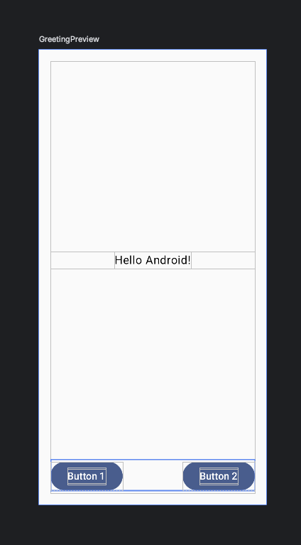

#### Prototyper l'idée

Pour cette première fois, nous allons prototyper l'idée ensemble, dans un premier temps tester en utilisant le code suivant :

```kotlin
@Composable
fun Greeting(name: String) {
    Column {
        Button(onClick = { /* Action */ }) {
            Text("Cliquez ici")
        }
        Spacer(modifier = Modifier.weight(1f))
        Text("Un texte")
    }
}
```

::: tip Spacer ?

```kotlin
Spacer(modifier = Modifier.weight(1f))
```

Un espace qui prend tout l'espace disponible. `weight` est un pourcentage. Ici nous avons un poids de 1, donc il prend tout l'espace disponible.

:::

#### Centrer nos éléments

Plusieurs solutions :

- `horizontalAlignment = Alignment.CenterHorizontally` sur la `Column`.
- `textAlign = TextAlign.Center` sur le `Text`. ⚠️ Attention, cela ne fonctionne que si votre `Text` fait la largeur de l'écran.

---

```kotlin
Column(
    horizontalAlignment = Alignment.CenterHorizontally
) {
    Spacer(modifier = Modifier.weight(1f))
    Text("Un texte")
}
```

#### Ajouter un padding

Pour ajouter un padding à un composant, nous allons utiliser le `Modifier.padding` :

```kotlin
Column(
    horizontalAlignment = Alignment.CenterHorizontally,
    modifier = Modifier.padding(16.dp)
) {
    Spacer(modifier = Modifier.weight(1f))
    Text("Un texte")
}
```

#### Mettre deux boutons côte à côte

Pour mettre deux boutons côte à côte, nous allons utiliser un `Row` dans notre `Column` :

```kotlin
@Composable
fun Greeting(name: String) {
    Column(
        horizontalAlignment = Alignment.CenterHorizontally,
        modifier = Modifier.padding(16.dp)
    ) {
        Row {
            Button(onClick = { /* Action */ }) {
                Text("Cliquez ici")
            }
            Spacer(modifier = Modifier.width(16.dp))
            Button(onClick = { /* Action */ }) {
                Text("Cliquez là")
            }
        }
        Spacer(modifier = Modifier.weight(1f))
        Text("Un texte")
    }
}
```

#### C'est à vous

Avec les éléments que nous avons vus ensemble, je vous laisse **créer** un composant `Home` pour qu'il ressemble à l'image ci-dessus.

Pour cette première fois, je vais vous donner le code complet (profitez-en, ce ne sera pas toujours le cas) :

```kotlin
@Composable
fun Home(){
    Column(
        modifier = Modifier.padding(innerPadding)
    ) {
        Spacer(modifier = Modifier.weight(1f))

        Row(
            modifier = Modifier.fillMaxWidth(),
            horizontalArrangement = Arrangement.Center,
            verticalAlignment = Alignment.CenterVertically
        )
        {
            Greeting(
                name = "Android",
            )
        }

        Spacer(modifier = Modifier.weight(1f))

        Row {
            Button(onClick = { /*TODO*/ }) {
                Text("Button 1")
            }

            Spacer(modifier = Modifier.weight(1f))

            Button(onClick = { /*TODO*/ }) {
                Text("Button 2")
            }
        }
    }
}

@Preview(showBackground = true)
@Composable
fun HomePreview() {
    Home()
}
```

Arrêtons-nous un instant, que constatez-vous dans le code que vous avez copié-collé sans trop réfléchir 👀…

- `@Composable` au-dessus de la fonction, indique l'emplacement d'un composant.
- `@Preview(showBackground = true)` permet de réaliser une preview de votre composant sans la lancer sur un téléphone (pratique, testons).

Je vous laisse mettre en place le code. Et valider que celui-ci s'affiche correctement dans la partie preview.

#### L'agencement

En compose, nous parlons de `Modifier`.

Les modifiers ont des méthodes pour modifier les composants (taille, couleur, etc.). Ils sont chaînables et varient en fonction du composant.

```kotlin
Text(
    text = "Hello World",
    modifier = Modifier
        .padding(16.dp)
        .background(Color.Blue)
        .border(1.dp, Color.Black)
)
```

##### Exemple les dimensions

```kotlin
Modifier.fillMaxWidth() // Rempli la largeur
Modifier.fillMaxHeight() // Rempli la hauteur
Modifier.fillMaxSize() // Rempli la taille
```

---

##### Exemple le padding

```kotlin
Modifier.padding(16.dp) // Ajoute un padding de 16dp
Modifier.padding(16.dp, 8.dp) // Ajoute un padding de 16dp en largeur et 8dp en hauteur
```

## Taille et style du texte

```kotlin
Text(text = content, fontWeight = FontWeight.Light, fontSize = 10.sp)
```

## Les ressources

Les ressources sont un élément important d'une application Android. Elles peuvent être de plusieurs types :

- `drawable` : Les images.
- `miap` : Les icônes.
- `values` : Les valeurs (couleurs, textes, dimensions, etc.).

::: warning Internationalisation

Je ne le répéterai jamais assez, l'internationalisation est un élément important d'une application. Android Studio propose un outil pour gérer les traductions de votre application.

:::

Extraire les textes de votre application est donc un **un incontournable**. Android Studio vous guide pour cela :

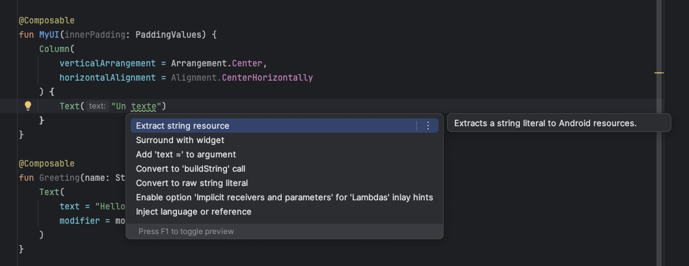

::: tip C'est à vous

Je vous laisse extraire les différents textes de votre application.

:::

### Les ressources alternatives

Les ressources alternatives sont des ressources qui sont utilisées en fonction de la configuration de l'appareil. Par exemple, si l'appareil est en mode sombre, les ressources alternatives seront utilisées. Voici une liste non exhaustive des configurations qui peuvent être utilisées :

- Taille de l'écran.
- Langue.
- Rotation de l'écran (Paysage / Portrait).
- DPI
- Thème sombre
- Version d'Android
- etc.

Cette création de ressource est réalisable directement depuis Android Studio :

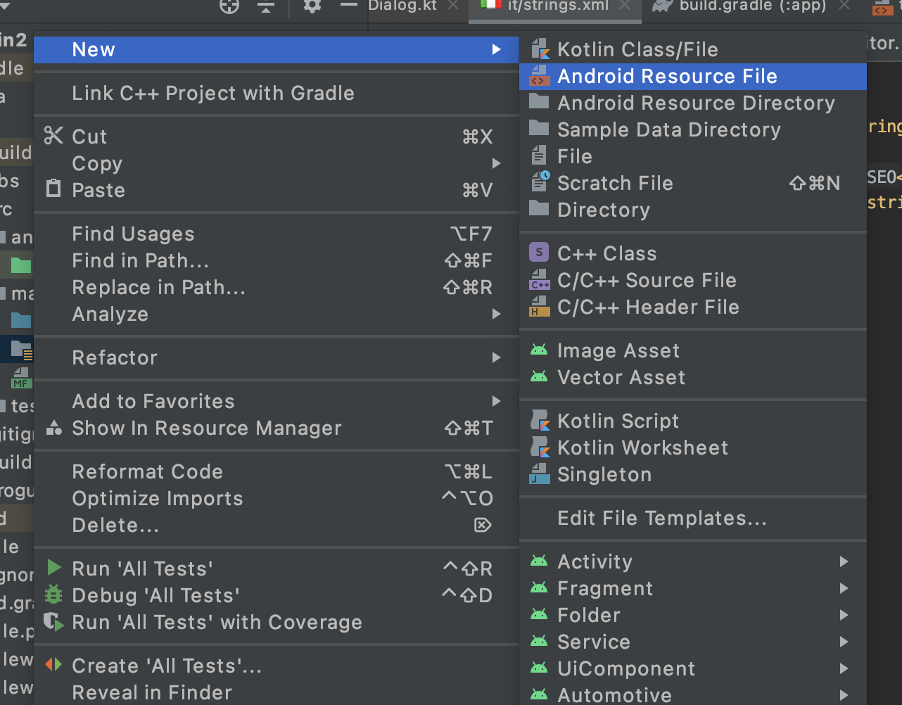
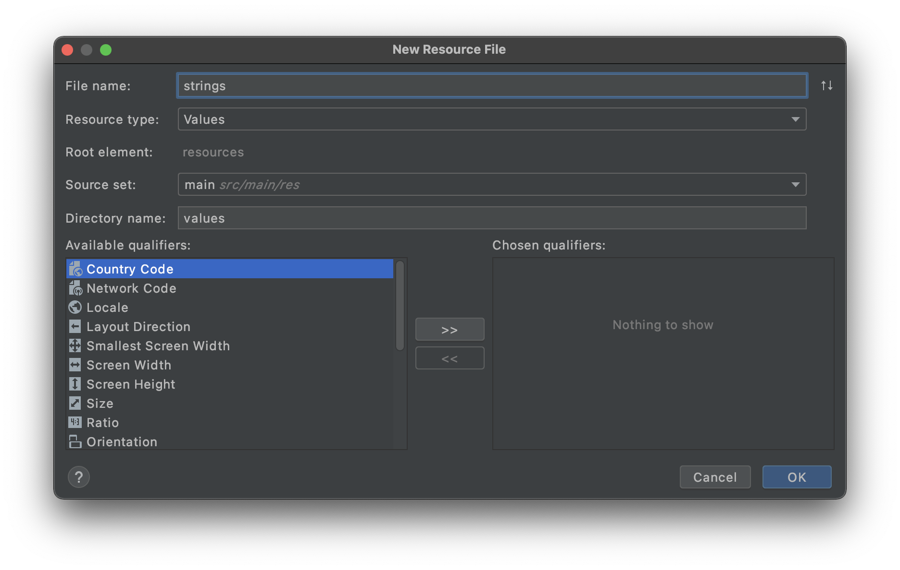

::: tip Vous pouvez tout redéfinir
L'ensemble des ressources (`res`) est redéfinissable sans écrire de code. Par exemple si vous souhaitez redéfinir des `strings` dans différentes conditions il suffit de :

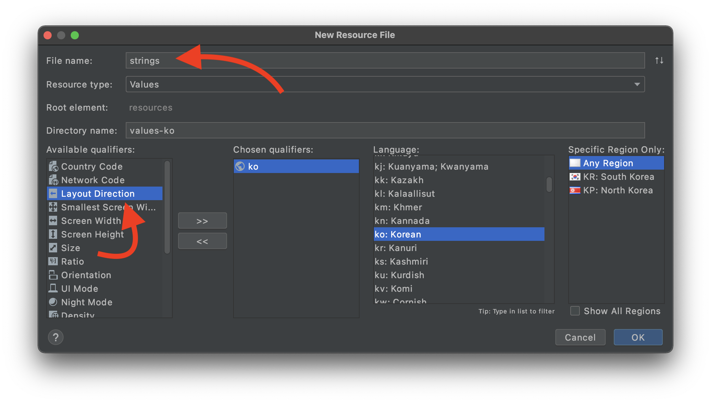
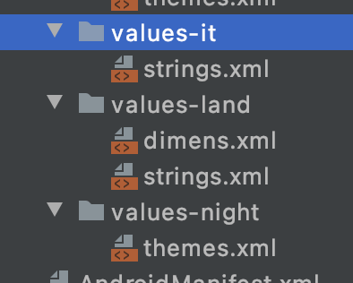
:::

#### À faire

Nous allons tester ensemble ce fonctionnement grâce aux textes que vous avez extraits :

- Ajouter la langue `it` (Italien) à votre application.
- Traduire votre fichier `strings.xml` en italien.
- Lancer votre application et changer la langue de votre téléphone pour voir le résultat.

### Les images

Nous avons dans notre application un dossier `drawable` qui contient les images de l'application. Nous allons maintenant ajouter une image à notre application.

Je vous laisse chercher le logo de l'ESEO, et l'ajouter à votre application (un glisser-déposer dans le dossier `drawable` suffit).

#### À faire

Placer l'image dans le dossier `res/drawable/`. Puis ajouter le au-dessus de votre `Text` qui est actuellement au centre de votre `Column`.

```kotlin
Image(
    painter = painterResource(R.drawable.nom_image),
    contentDescription = "Une image",
    modifier = Modifier.size(128.dp)
)
```

⚠️ `R.drawable.nom_image` est un exemple, vous devez remplacer `nom_image` par le nom de votre image. ⚠️


## Les interactions

Intéragir avec l'utilisateur est un élément clé d'une application. Sur Android, au-delà dès `onClick` que nous avons vu, nous avons également accès à d'autres interactions :

- **Toast** : Un message qui s'affiche à l'écran.
- **Snackbar** : Un message qui s'affiche en bas de l'écran.
- **Dialog** : Une fenêtre qui s'affiche à l'écran.

### Les Toast

Nous avons une activité qui pour l'instant ne fait pas grand-chose. Si vous regardez le code, celui-ci est presque vide. Je vous propose de la modifier, en premier lieu nous allons ajouter un message au lancement de celle-ci.

Un message simple sur Android s'appelle un Toast :

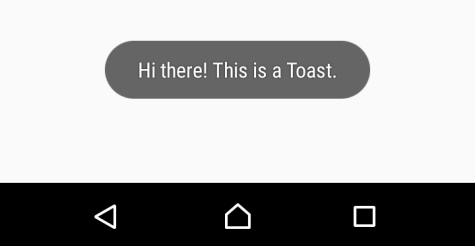

Ajouter un toast directement dans le `setContent` de votre `MainActivity` :

Vous pouvez utiliser la complétion de votre IDE, `toast` puis <kbd>tab</kbd>.

::: tip
Les toasts sont rapides et simples à mettre en place. Cependant, ils ne sont pas très beaux. C'est pour ça que nous les utiliserons principalement que pour « les informations de tests ou sans grandes importances ».
:::

Le code à ajouter :

```kotlin
// Récupération du context
val context = LocalContext.current

Toast.makeText(context, "Je suis un Toast", Toast.LENGTH_LONG).show();
```

Évidemment, le texte du toast est à internationaliser…

### Les Snackbars

Les snackbars sont des messages qui s'affichent en bas de l'écran. Ils sont plus beaux que les toasts et permettent d'ajouter des actions.

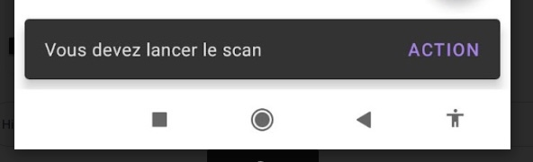
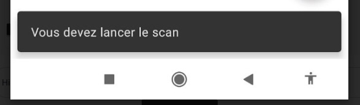

Documentation : [https://developer.android.com/develop/ui/compose/components/snackbar]

::: tip Des durées d'affichage différentes

Plusieurs options s'offre à vous :

- `Snackbar.LENGTH_SHORT`
- `Snackbar.LENGTH_LONG`
- `Snackbar.LENGTH_INDEFINITE`

:::

### Rendre un bouton cliquable

Pour rendre un bouton cliquable, nous allons utiliser le paramètre `onClick` :

```kotlin
Button(onClick = { /* Action */ }) {
    Text("Cliquez ici")
}
```

- `onClick` : L'action à réaliser lors du clique sur le bouton.

Ici, nous avons une action vide (en commentaire `/* Action */`). Nous allons maintenant ajouter une action qui va afficher un toast.

### À faire

Je vous laisse modifier le code pour afficher le toast **uniquement** lors du clique sur le bouton.

### Les dialogues

Les dialogues sont des fenêtres qui s'affichent à l'écran. Ils permettent de demander une confirmation à l'utilisateur, de lui demander de saisir des informations, etc.

Elles sont très utilisées dans les applications mobiles, car elles sont très rapides à mettre en place :

```kotlin
val context = LocalContext.current

AlertDialog(
    onDismissRequest = { /* Action */ },
    title = { Text("Titre") },
    text = { Text("Contenu") },
    confirmButton = {
        Button(
            onClick = {
                Toast.makeText(context, "Clic sur le bouton", Toast.LENGTH_LONG).show()
            }
        ) {
            Text("Confirmer")
        }
    },
    dismissButton = {
        Button(
            onClick = {
                Toast.makeText(context, "Clic sur le bouton", Toast.LENGTH_LONG).show()
            }
        ) {
            Text("Annuler")
        }
    }
)
```

- `onDismissRequest` : L'action à réaliser lors de la fermeture de la fenêtre.
- `title` : Le titre de la fenêtre.
- `text` : Le contenu de la fenêtre.
- `confirmButton` : Le bouton de confirmation.
- `dismissButton` : Le bouton de fermeture.

#### À faire

Je vous laisse mettre ce dialogue dans le `setContent` de votre `MainActivity`. 

Lancer votre application et tester le dialogue. Normalement, vous devriez voir une fenêtre s'afficher avec un titre, un contenu et deux boutons.

### Conditionner l'affichage d'un élément

Le dialogue est un bon exemple pour conditionner l'affichage d'un élément. En effet, il est possible de conditionner l'affichage d'un élément en fonction d'une condition.

```kotlin
var showDialog by remember { mutableStateOf(false) }

if (showDialog) {
    // Afficher le Dialog
}

Button(onClick = { showDialog = true }) {
    Text("Afficher le Dialog")
}
```

Dans cet exemple, nous avons une variable `showDialog` qui est initialisée à `false`. Lorsque l'utilisateur clique sur le bouton, la variable `showDialog` passe à `true` et le dialogue s'affiche.

::: tip MutableState

La variable `showDialog` est une variable d'état. Cela signifie que Compose va observer cette variable et mettre à jour l'interface en fonction des changements.

:::

#### À faire

Modifier votre code pour que le dialogue ne s'affiche que si l'utilisateur clique sur le logo de l'ESEO.

::: tip Rendre un logo cliquable ?

Pour rendre un logo cliquable, il suffit d'ajouter un `clickable` sur le composant `Image`.

```kotlin
Image(
    painter = painterResource(R.drawable.logo_eseo),
    contentDescription = "Logo ESEO",
    modifier = Modifier.size(128.dp).clickable {
        /* Action */
    }
)
```

Bien que pratique, cette méthode n'est pas la plus propre. En effet, d'un point de vue de l'accéssibilité, il est préférable d'utiliser un bouton.

:::

#### Les règles de Google

N'oubliez pas, Google propose des règles pour vous aider dans le développement. Exemple pour les dialogues :

- [La documentation](https://material.io/develop/android/components/dialogs)

## Structure, organisation d'un code avec plusieurs Screens

Avant compose, une application Android était composée de plusieurs `Activity` qui permettaient de naviguer entre les différents écrans de l'application.

Avec Compose, nous allons utiliser un autre système : les `Screen`. Chaque `Screen` est une interface qui va être affichée à l'écran. Nous allons pouvoir naviguer entre les différentes `Screen` en utilisant un `Router` que nous allons appeler un `NavHost`.

```kotlin
val navController = rememberNavController()

NavHost(
    modifier = Modifier.padding(innerPadding),
    navController = navController,
    startDestination = "screen1"
) {
    // Une page simple sans paramètre
    composable("screen1") { Screen1(navController) }

    // Une page avec un paramètre (ici un nom)
    composable(
        route = "screen2/{name}",
        arguments = listOf(navArgument("name") { type = NavType.StringType })
    ) { backStackEntry -> Screen2(
            navController,
            name = backStackEntry.arguments?.getString("name") ?: ""
        )
    }
}
```

Dans cet exemple, nous avons un `NavHost` qui contient deux `Screen` : `Screen1` et `Screen2`. `Screen2` Prends un paramètre `name` qui est un `String`.

Ce code nécessite une librairie supplémentaire `navigation-compose`. Pour l'ajouter, il suffit d'ajouter la dépendance suivante dans votre `build.gradle` :

```gradle
implementation("androidx.navigation:navigation-compose:2.7.7")
```

Une fois la dépendance ajoutée, vous **devez** `Sync` votre projet.

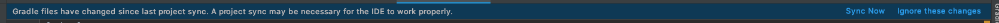

### Exemple de Screen

Maintenant que vous avez un exemple de `NavHost`, je vous laisse créer deux `Screen` :

```kotlin
@Composable
fun Screen1(navController: NavController) {
    Column {
        Button(onClick = { navController.navigate("screen2/Valentin") }) {
            Text("Bonjour Valentin")
        }
    }
}
```

- Screen1 est une page qui possède un paramètre `navController` qui est un `NavController`. Ce paramètre va nous permettre de naviguer entre les différentes `Screen`.
- `navController.navigate("screen2/Valentin")` permet de naviguer vers la `Screen2` avec le paramètre `Valentin`.

```kotlin
@Composable
fun Screen2(navController: NavController, name: String) {
    Column {
        Text("Bonjour $name")
        Button(onClick = { navController.popBackStack() }) {
            Text("Retour")
        }
    }
}
```

- Screen2 est une page qui possède deux paramètres : `navController` qui est un `NavController` et `name` qui est un `String`. `name` est le paramètre que nous avons passé dans la `Screen1`.
- `navController.popBackStack()` permet de revenir à la `Screen1`. `popBackStack` permet de revenir à la `Screen` précédente.

::: tip Où ranger les `Screen`

Les `Screen` sont des composants comme les autres. Vous pouvez les ranger dans un dossier `ui` par exemple.

- `ui/` : Les pages.
  - `home.kt` : La page d'accueil, logo + deux boutons.
  - `screen1.kt` : La première page.
  - `screen2.kt` : La seconde page.

:::

#### Créer des éléments

Avant de réaliser le code, nous allons dans un premier temps créer un nouveau package. Il nous servira à stocker nos composants.

Création du package, la procédure est intégrée dans Android Studio :

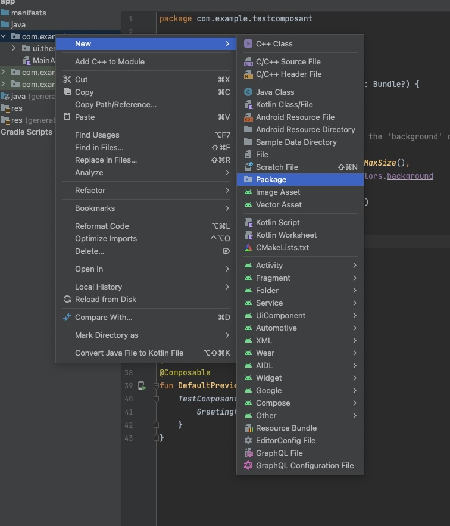

Nommage du package, dans mon cas « ui » :

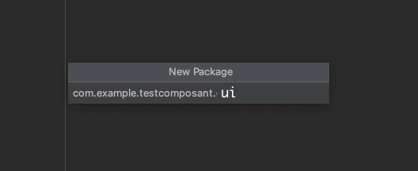

Maintenant que votre package est créé, je vous laisse créer le fichier Kotlin qui contiendra votre code :

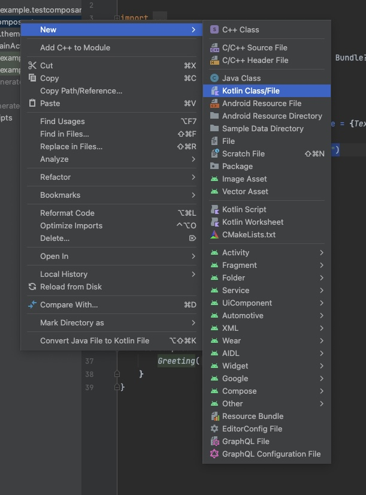
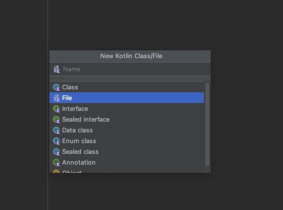

Pour le nom du fichier, je vous laisse choisir. Moi dans mon cas je vais le nommer « `home.kt` ».

::: tip Un instant !

Pas de classe !?

<iframe src="https://giphy.com/embed/l0HlKrB02QY0f1mbm" width="480" height="270" frameBorder="0" class="giphy-embed" allowFullScreen></iframe>

**Et non** avec Compose, les composants ne sont pas des classes. Ce sont des fonctions « Composable » qui seront appelées au bon moment suivant les bonnes conditions dans votre vue.

:::

#### À faire

- Remplacer le contenu du `setContent` de votre `MainActivity` par le `NavHost` que nous avons vu ensemble. 
- Créer les `Screen` `Screen1` et `Screen2`.
- Lancer votre application et tester la navigation entre les deux `Screen`.

::: danger Attention

Pour le `NavHost` dans le `setContent` il est important de retirer **le Scaffold**. En effet, en le retirant nous allons pouvoir le gérer écran par écran.

:::

Voici le rendu attendu :

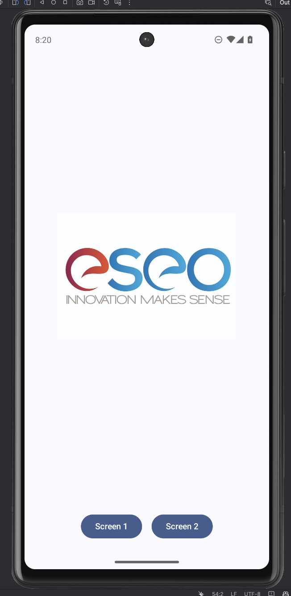

Dans mon cas, après la création de mes `Screen` j'ai l'architecture suivante :

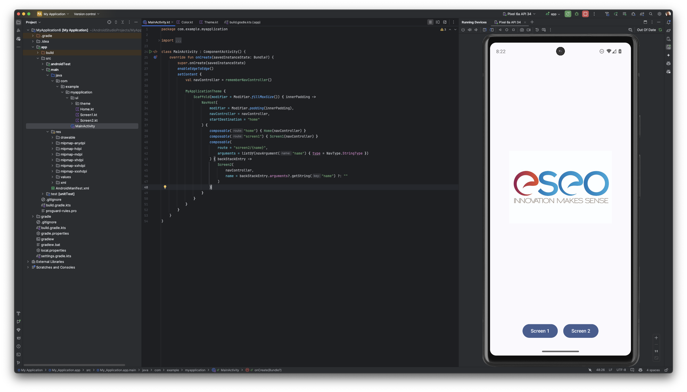

Et d'un point de vue code :

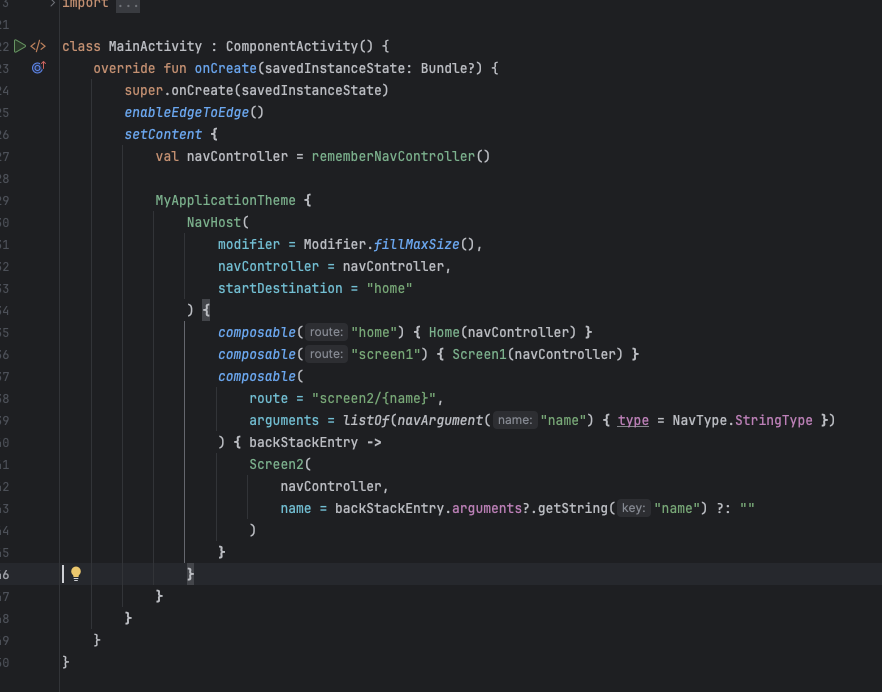

#### Testons ensemble

Nous avons vu ensemble comment passer des paramètres. Mais le nom `Valentin` est un peu statique. Nous allons voir ensemble comment rendre cet élément dynamique.

- Rendre dynamique le nom saisi dans la le Screen 1.
- À votre avis, comment faire ? Quelle ressource utiliser ?

## Le scaffold

Le `Scaffold` est un composant qui permet de créer une structure de base pour notre application. Il contient plusieurs éléments :

- `TopAppBar` : La barre de navigation en haut de l'application.
- `BottomAppBar` : La barre de navigation en bas de l'application.
- `FloatingActionButton` : Le bouton flottant.
- `Drawer` : Le menu latéral.

Chaque élément est optionnel, vous pouvez donc choisir de les afficher ou non.

```kotlin
Scaffold(
        topBar = {
            TopAppBar(
                title = { Text("Ma liste") },
                navigationIcon = {
                    IconButton(onClick = { navController.popBackStack() }) {
                        Icon(
                            imageVector = Icons.AutoMirrored.Filled.ArrowBack,
                            contentDescription = "Back"
                        )
                    }
                })

        }
    ) { innerPadding ->
        Column(modifier = Modifier.padding(innerPadding)) {
            // Contenu de la page
        }
    }
```

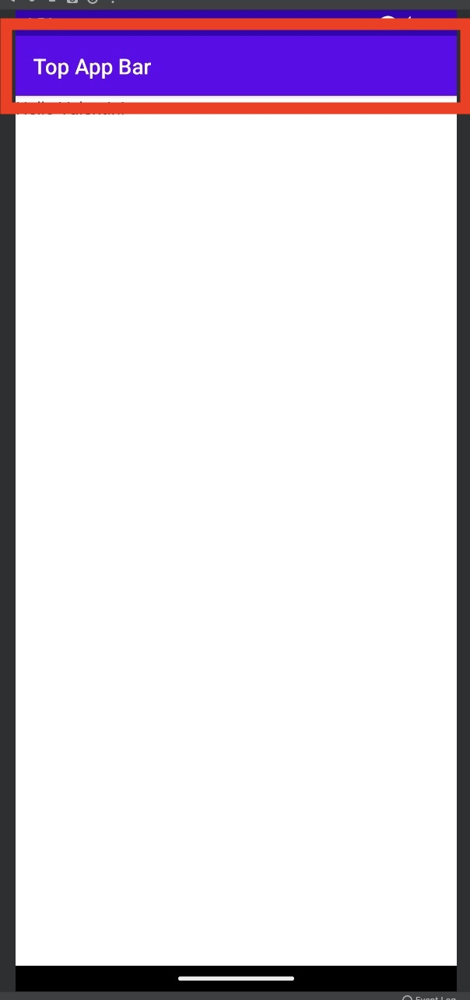

### À faire

Je vous laisse ajouter un `Scaffold` à votre `Screen1` et `Screen2`.

- Le `Screen1` doit avoir un `TopAppBar` avec un titre et un bouton de retour.
- Le `Screen2` doit avoir un `TopAppBar` avec un titre et un bouton de retour.

::: tip Un peu de couleur

Votre top-bar est blanche ? C'est normal, nous n'avons pas encore ajouté de thème. Je vous laisse ajouter le thème suivant :

```kotlin
topBar = {
    TopAppBar(
        title = {Text("Top App Bar") }, // Titre de la barre
        colors = TopAppBarDefaults.smallTopAppBarColors(
            containerColor = MaterialTheme.colorScheme.primaryContainer,
            titleContentColor = MaterialTheme.colorScheme.primary,
        ), // Couleur de la barre
    ),
},
```

## Les données

Depuis le début, nous avons globalement travaillé sur des données statique. Android est une plateforme « très ouverte », il est donc très facilement possible de faire « n'importe quoi ».

Dans cette partie nous allons voir l'organisation des données, et surtout l'organinisation du code pour les gérer.

Avant de rentrer dans le vif du sujet, voici ce que nous allons réaliser :

<center>
<iframe width="560" height="315" src="https://www.youtube-nocookie.com/embed/ai1NUBL0gRs?si=Ldr1g2OIqPyMoPWX" title="YouTube video player" frameborder="0" allow="accelerometer; autoplay; clipboard-write; encrypted-media; gyroscope; picture-in-picture; web-share" referrerpolicy="strict-origin-when-cross-origin" allowfullscreen></iframe>
</center>

### MVVM : Model View ViewModel

Le MVVM est un pattern de conception qui permet de séparer les données de l'interface. Bien que plutôt ancien (créé par Microsoft en 2005), il est toujours d'actualité. 

Il est très utilisé dans l'approche composant, car il permet de séparer les données de l'interface. Il est composé de trois éléments :

- `Model` : Les données de l'application. Sur Android nous allons utiliser des classes `data class`.
- `View` : L'interface de l'application. Ce sont nos composants (`@Composable`).
- `ViewModel` : La logique de l'application. Ce sont des classes particulières qui vont faire le lien entre les `Model` et les `View`.

Quelques points sont à retenir :

- Le `Model` ne doit pas contenir de logique, il doit uniquement contenir les données.
- Le `ViewModel` doit contenir la logique de l'application. Il doit être testable.
- Le `View` doit uniquement contenir l'interface de l'application.
- Le `ViewModel` doit être observé par la `View`. (Nous verrons cela plus tard).
- Le `ViewModel` **ne doit pas** contenir de référence à la `View`.

### Évolution de la structure

Notre projet va évoluer un peu, voici les éléments que nous allons devoir ajouter :

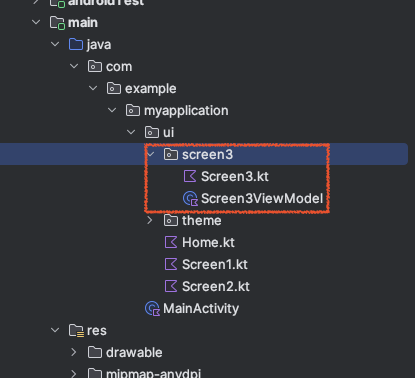

- `Screen2ViewModel.kt` : Le ViewModel qui va contenir la logique de notre écran.
- `Screen2.kt` : Le composant qui va contenir l'interface de notre écran (notre liste et nos boutons d'actions).

::: tip Pas d'inquiétude

Ici, il faut bien voir que je vous communique une façon correcte de faire. Nous pourrions évidemment tout simplifier en mettant tout dans le même fichier (dans la vue par exemple). Mais à mon sens, il est important de comprendre dès le début les bonnes pratiques.

:::

### Quelques libraires à ajouter

Pour que nous puissions faire notre scan en arrière-plan et échanger les données entre la `View` et le `ViewModel` nous allons avoir besoin de quelques librairies :

```groovy
implementation("androidx.lifecycle:lifecycle-runtime-compose:2.8.4")
implementation("androidx.lifecycle:lifecycle-viewmodel-compose:2.8.4")
implementation("androidx.lifecycle:lifecycle-viewmodel-ktx:2.8.4")
implementation("androidx.lifecycle:lifecycle-runtime-ktx:2.8.4")
```

Ajouter ces dépendances dans votre fichier `build.gradle` (celui dans `app` du projet). Il faut ensuite synchroniser le projet avec les modifications (bandeau bleu en haut).

[Plus d'informations](https://developer.android.com/jetpack/androidx/releases/lifecycle)

### Création du ViewModel

Le `ViewModel` est une classe qui va contenir la logique de notre écran. Il va permettre de séparer les données de l'interface.

```kotlin
class Screen3ViewModel: ViewModel() {
    // Liste de String
    val listFlow = MutableStateFlow(listOf<String>())

    // Ajouter un élément
    fun addElement(element: String) {
        listFlow.value += element
    }

    // Supprimer un élément
    fun removeElement(element: String) {
        listFlow.value -= element
    }

    fun clearList() {
        listFlow.value = emptyList()
    }
}
```

- `listFlow` : Une liste de `String` qui est un `MutableStateFlow`. Un `MutableStateFlow` est un élément qui va permettre de stocker des données et de les observer.
- `addElement` : Une fonction qui va permettre d'ajouter un élément à la liste.
- `removeElement` : Une fonction qui va permettre de supprimer un élément de la liste.
- `clearList` : Une fonction qui va permettre de vider la liste.

::: tip Je vous laisse faire

Créer le fichier `Screen3ViewModel.kt` dans le bon dossier. Et ajouter le code ci-dessus.

:::

### Création de la `View`

Pour la vue, nous allons procéder différement. Je vais vous montrer le résultat final, et vous allez devoir le reproduire étape par étape.

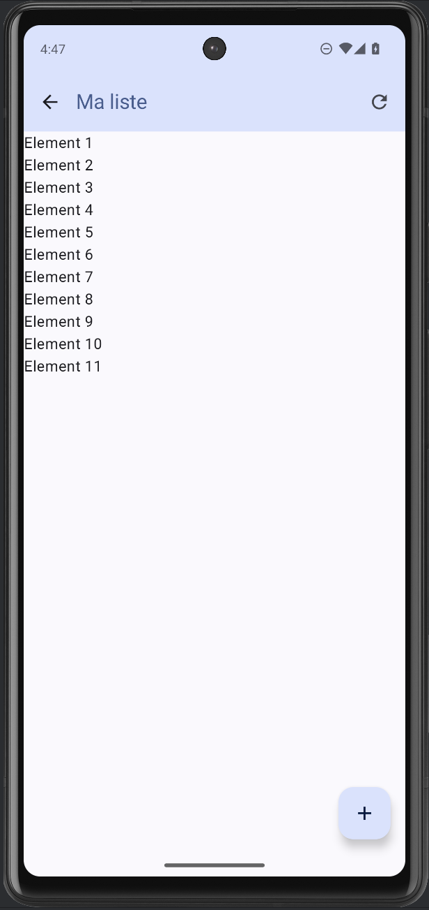

::: tip Analyse

Avant de continuer, qu'observez-vous dans l'image ci-dessus ?

- Quels éléments sont présents ?
- À votre avis, quels sont les composants utilisés ?
- Combien avons-nous d'actions

:::

### La structure du composant

Avant de vous donner le code, nous allons analyser ensemble la structure du code que vous allez devoir écrire.


- En vert : La TopAppBar avec le bouton de retour et l'action pour vider la liste.
- En jaune : Le bouton flottant qui va permettre d'ajouter un élément à la liste.
- En violet : La liste des éléments. `LazyColumn` est un composant qui va permettre d'afficher une liste de manière optimisée.

### Structure du composant

Pour fonctionner, notre composant va avoir besoin de plusieurs paramètres :

```kotlin
@OptIn(ExperimentalMaterial3Api::class)
@Composable
fun Screen3(
    navController: NavController,
    viewModel: Screen3ViewModel = viewModel()
) {
    // Code du composant
}
```

- `navController` : Le `NavController` qui va permettre de naviguer entre les différentes `Screen`.
- `viewModel` : Le `ViewModel` qui va contenir la logique de notre écran.

### Les données

Pour observer les données, nous allons utiliser un `collectAsStateWithLifecycle`. Cela va nous permettre de mettre à jour l'interface en fonction des données.

```kotlin
val list by viewModel.listFlow.collectAsStateWithLifecycle()
```

### La TopAppBar

La `TopAppBar` dois permettre dans cet écran de :

- Revenir à l'écran précédent.
- Afficher le titre de l'écran.
- Vider la liste.

```kotlin
topBar = {
    TopAppBar(
        title = { Text("Ma liste") },
        colors = TopAppBarDefaults.topAppBarColors(
            containerColor = MaterialTheme.colorScheme.primaryContainer,
            titleContentColor = MaterialTheme.colorScheme.primary,
        ),
        navigationIcon = {
            IconButton(onClick = { navController.popBackStack() }) {
                Icon(
                    imageVector = Icons.AutoMirrored.Filled.ArrowBack,
                    contentDescription = "Back"
                )
            }
        },
        actions = {
            IconButton(
                onClick = { viewModel.clearList() },
                enabled = list.isNotEmpty(),
            ) {
                Icon(
                    imageVector = Icons.Filled.Refresh,
                    contentDescription = "Clear"
                )
            }
        }
    )
},
```

Comment lire ce code ? Il y a plusieurs éléments importants :

- `NavigationIcon` : Le bouton de retour. Celui-ci va permettre de revenir à l'écran précédent avec `navController.popBackStack()`.
- `Actions` : Les actions de la `TopAppBar`. Ici nous avons un seul bouton qui va permettre de vider la liste. Ce bouton est un `IconButton` qui contient un `Icon`.
  - Celui-ci est activé uniquement si la liste n'est pas vide (`list.isNotEmpty()`).

::: tip Et oui…

Avec Compose et Kotlin, rendre actif ou inactif un bouton est très simple. Il suffit de mettre `enabled = true` ou `enabled = false`. En exploitant le côté réactif de Compose, le bouton sera automatiquement mis à jour en fonction de la valeur de `list`.

- Liste vide : `enabled = false` == `list.isNotEmpty()`
- Liste non vide : `enabled = true` == `list.isNotEmpty()`

Ça change du code que vous avez l'habitude de voir non ? 😏

:::

### Le bouton flottant

Le bouton flottant est également un élément courant dans les applications Android. Il permet de réaliser une action principale. Dans notre cas ici, il va permettre d'ajouter un élément à la liste.

```kotlin
floatingActionButton = {
    FloatingActionButton(onClick = { viewModel.addElement("Element ${list.size + 1}") }) {
        Icon(Icons.Filled.Add, "Floating action button.")
    }
}
```

- `FloatingActionButton` : Le bouton flottant.
- `onClick` : L'action à réaliser lors du clique sur le bouton.
- `Icon` : L'icône du bouton.

L'action à réaliser appelle la fonction `addElement` du `ViewModel` avec un élément de la forme `Element ${list.size + 1}`. Cela va permettre d'ajouter un élément à la liste.

### La liste

Pour la liste rien de bien compliqué, nous allons utiliser un `LazyColumn` qui va permettre d'afficher une liste de manière optimisée.

```kotlin
Column(modifier = Modifier.padding(innerPadding)) {
    LazyColumn(modifier = Modifier.fillMaxSize()) {
        items(list) { item ->
            // Affiché à chaque élément de la liste.
            // Ici un simple Text
            Text(item)
        }
    }
}
```

::: tip LazyColumn ?

`LazyColumn` est un composant qui va permettre d'afficher une liste de manière optimisée. En effet, il ne va afficher que les éléments qui sont visibles à l'écran. Cela permet de ne pas charger tous les éléments en même temps.

Nous pourrions avoir des milliers d'éléments dans notre liste, `LazyColumn` va permettre de les afficher sans problème. Quelle que soit la puissance de votre téléphone…

:::

### À faire

Maintenant que vous avez l'ensemble des éléments, je vous laisse créer votre `Screen3`. N'hésitez pas à me poser des questions si vous avez des difficultés.

## Découper plus finement / améliorer l'affichage

Votre liste est plutôt basique, un simple texte qui se répète. Nous allons voir ensemble comment améliorer l'affichage de cette liste. L'objectif est d'avoir un affichage similaire à celui-ci :

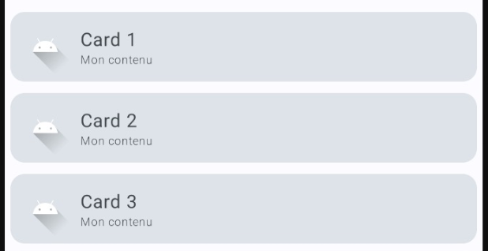

Avant de continuer, analysons ensemble ce que nous avons :

- Nous avons un `Card` qui contient un Titre, un Sous-Titre et une icône.
- Le `Card` est répété pour chaque élément de la liste.
- Vous ne le voyez pas, mais le `Card` est cliquable.

### Organisation du code

Ici, les cards ne sont pas des `Screens` Mais un simple composant, nous allons donc les ranger dans un dossier différent. Pour cela, je vous laisse créer un dossier `components` dans votre dossier `ui`.

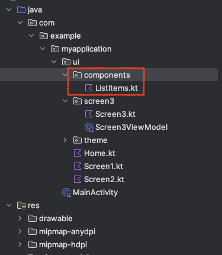

### Base du composant

Cette fois-ci je ne vous donne que la base du composant, je vous laisse le compléter.

```kotlin
@Composable
fun ElementList(
    title: String = "Mon titre",
    content: String = "Mon contenu",
    image: Int? = R.drawable.ic_launcher_foreground,
    onClick: () -> Unit = {}
) {
    // À vous de jouer
}
```

### À faire

Je vous laisse créer le composant `ElementList` dans le dossier `components`. Puis l'utiliser dans votre `Screen3` à la place du `Text`.

Dans mon cas voici le rendu final :

<center>
<iframe width="560" height="315" src="https://www.youtube-nocookie.com/embed/y5himtvZQFQ?si=Ldr1g2OIqPyMoPWX" title="YouTube video player" frameborder="0" allow="accelerometer; autoplay; clipboard-write; encrypted-media; gyroscope; picture-in-picture; web-share" referrerpolicy="strict-origin-when-cross-origin" allowfullscreen></iframe>
</center>

### À faire suite

Maintenant que vous avez votre liste d'éléments avec un peu de style, je vous laisse implémenter la suppression d'un élément avec une confirmation. Pour cela, vous pouvez utiliser un `Dialog` ou un `Snackbar` (plus compliqué, il faut regarder la documentation).

## Vous souhaitez aller plus loin ?

Nous avons créé des composants simples, mais il est possible d'aller beaucoup plus loin. Par exemple, vous n'avez pas l'impression que votre Scaffold est toujours un peu identique ?

Et oui, c'est toujours un peu là mêmes choses, je vous propose de créer un composant `MyScaffold` qui va permettre de simplifier la création de vos `Screen`.

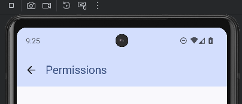

Dans le dossier `components`, je vous laisse créer un fichier `MyScaffold.kt`. Voici la base du composant :

```kotlin
@OptIn(ExperimentalMaterial3Api::class)
@Composable
fun MyScaffold(title: String, onBackClick: () -> Unit, content: @Composable () -> Unit) {
    Scaffold(
        topBar = {
            TopAppBar(
                title = { Text(title) },
                colors = TopAppBarDefaults.topAppBarColors(
                    containerColor = MaterialTheme.colorScheme.primaryContainer,
                    titleContentColor = MaterialTheme.colorScheme.primary,
                ),
                navigationIcon = {
                    IconButton(onClick = { onBackClick() }) {
                        Icon(
                            imageVector = Icons.AutoMirrored.Filled.ArrowBack,
                            contentDescription = "Back"
                        )
                    }
                }
            )
        }
    ) { innerPadding ->
        Column(modifier = Modifier.padding(innerPadding)) {
            content()
        }
    }
}
```

### À faire

Je vous laisse mettre à jours vos `Screen1`, `Screen2` pour utiliser ce nouveau composant.

::: danger Pourquoi pas le `Screen3`

Il est tentant de vouloir généraliser au maximum son code. Cependant, il faut faire attention à ne pas tomber dans le piège de la généralisation à outrance. En effet, il est important de bien comprendre les besoins de l'application et de ne pas généraliser pour généraliser.

C'est le cas ici, le `Screen3` est un écran qui est très spécifique (FloatButton, Action de clear, etc.). Il est donc important de ne pas généraliser ce composant.

:::

## Les permissions

Les permissions sont un élément important d'une application Android. Elles permettent de demander à l'utilisateur l'autorisation d'accéder à certaines fonctionnalités de l'appareil.

Elles sont obligatoires pour accéder à certaines fonctionnalités de l'appareil. Par exemple, pour accéder à la caméra, il est nécessaire d'avoir la permission `CAMERA`.

::: danger Point important

L'utilisateur aura toujours le choix d'accepter ou de refuser une permission. Il est donc important de gérer les deux cas. De plus, l'utilisateur peut également changer sont choix à posteriori dans les paramètres de l'application.

Il ne faut donc **jamais** sauvegarder le choix de l'utilisateur dans une base de données ou autre. Il est important de toujours demander la permission à chaque lancement de l'application.

Si l'utilisateur à déjà accepté la permission, la demande sera automatiquement acceptée **et donc invisible pour lui**

:::

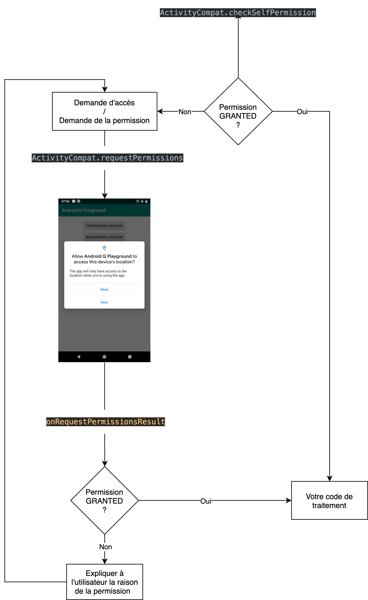

Nous allons voir comment faire avec Compose. Pour ça nous allons devoir utiliser une librairie développée par Google : [Accompanist](https://google.github.io/accompanist/)

::: tip Accompanist

Accompanist est une librairie de transition, elle existe le temps que Compose évolue, mûrisse et que les fonctionnalités soient intégrées dans Compose (ou pas, mais c'est un autre débat).

:::

Pour rester dans le thème du Bluetooth, nous allons regarder comment demander les permissions en lien avec le BLE. À savoir :

- `ACCESS_FINE_LOCATION` : Pour accéder à la localisation de l'appareil.

### Ajouter la librairie

Pour ajouter la librairie, nous allons devoir modifier notre fichier `build.gradle` (celui dans `app` du projet). Nous allons ajouter la dépendance suivante :

```groovy
implementation("com.google.accompanist:accompanist-permissions:0.35.1-alpha")
```

Il faut ensuite synchroniser le projet avec les modifications (bandeau bleu en haut).

### Le fichier AndroidManifest.xml

Avant de demander les permissions, nous allons devoir les déclarer pour que l'application puisse les demander. Pour ça nous allons modifier le fichier `AndroidManifest.xml`. Nous allons ajouter les permissions suivantes :

```xml
<!-- Permissions pour le BLE Android 12 et plus -->
<uses-permission android:name="android.permission.BLUETOOTH_SCAN"
    android:usesPermissionFlags="neverForLocation"
    tools:targetApi="s" />
<uses-permission android:name="android.permission.BLUETOOTH_CONNECT" />

<!-- Ancienne permission pour permettre l'usage du BLE  Android avant 11 inclus -->
<uses-permission android:name="android.permission.BLUETOOTH" />
<uses-permission android:name="android.permission.BLUETOOTH_ADMIN" />

<uses-permission android:name="android.permission.ACCESS_COARSE_LOCATION" />
<uses-permission android:name="android.permission.ACCESS_FINE_LOCATION" />
```

::: tip Des nouvelles permissions avec Android S

Avec Android S, Google a ajouté de nouvelles permissions pour le BLE. Il est donc important de les ajouter pour que votre application fonctionne correctement sur les appareils Android 12 et plus.

C'est permissions vont permettre de demander l'accès au BLE sans demander l'accès à la localisation. Cela permet surtout de ne pas effrayer l'utilisateur avec une demande de permission de localisation (qui souvent est mal perçue).

:::

### Utiliser la librairie

Cette librairie va nous permettre de demander les permissions à l'utilisateur et de gérer l'état de la demande (acceptée, refusée, etc.). Si vous avez compris ce que nous avons vu précédemment, vous vous doutez que tout va être géré par un état.

```kotlin
val toCheckPermissions = listOf(android.Manifest.permission.ACCESS_FINE_LOCATION)
val permissionState = rememberMultiplePermissionsState(toCheckPermissions)
```

Quelques explications :

- `toCheckPermissions` : La liste des permissions à vérifier.
- `permissionState` : L'état des permissions. Cet état va nous permettre de savoir si les permissions sont accordées ou non.

Maintenant que nous avons notre état, nous allons pouvoir l'utiliser pour demander les permissions à l'utilisateur. Pour ça nous allons utiliser un composant nommé `PermissionRequired` :

```kotlin
if (!permissionState.allPermissionsGranted) {
    Button(onClick = { permissionState.launchMultiplePermissionRequest() }) {
        Text(text = "Demander la permission")
    }
} else {
    Text(text = "Permission accordée")
}
```

Que fait ce code ?

- Si l'utilisateur n'a pas accordé les permissions, nous affichons un bouton qui permet de demander les permissions.
- Si l'utilisateur a accordé les permissions, nous affichons un texte qui indique que les permissions sont accordées.

::: tip C'est tout ?

Et oui, c'est tout. La librairie `Accompanist` va gérer pour vous l'affichage de la demande de permission. Elle va afficher une fenêtre qui va permettre à l'utilisateur d'accepter ou de refuser les permissions.

Vous n'avez pas connu les demandes de permissions à l'ancienne, mais croyez-moi, c'est un sacré gain de temps.

:::

### À faire

Pour tester la demande de permission, nous allons réaliser l'exemple suivant :

<center>
<iframe width="560" height="315" src="https://www.youtube-nocookie.com/embed/jVg4nR6WSic?si=Ldr1g2OIqPyMoPWX" title="YouTube video player" frameborder="0" allow="accelerometer; autoplay; clipboard-write; encrypted-media; gyroscope; picture-in-picture; web-share" referrerpolicy="strict-origin-when-cross-origin" allowfullscreen></iframe>
</center>

Qu'avons-nous ici ?

- Un nouvel écran `Screen4` qui va contenir la demande de permission.
- Un bouton qui va permettre de demander la permission.
- La dernière localisation connue de l'appareil.

::: tip Important

Ici l'idée est de comprendre la logique de demande de permissions. Obtenir la localisation est plutôt un prétexte pour vous montrer comment ça doit fonctionner.

Dans le cas du BLE, la demande de permission nous permettra d'accéder à la partie scan du BLE. La localisation ici est « un bonus » pour illustrer.

:::

#### Comment obtenir la dernière localisation connue ?

Pour obtenir la dernière localisation connue de l'appareil, nous allons utiliser le `LocationManager` d'Android.

```kotlin
// Récupérer le contexte de l'application
val applicationContext = androidx.compose.ui.platform.LocalContext.current

// Récupérer la dernière localisation connue. C'est une variable mutable
// c'est à dire que nous allons pouvoir la modifier. Et la vue sera mise à jour
var locationText by remember { mutableStateOf("") }

// Récupérer la position de l'utilisateur. Cette récupération
// est faite après la demande de permission.
// VOUS DEVEZ METTRE CE CODE DANS LE BLOCK DU IF
// QUAND LES PERMISSIONS SONT ACCORDÉES
LaunchedEffect(permissionState) {
    val locationManager = applicationContext.getSystemService(LOCATION_SERVICE) as LocationManager?

    locationManager?.run {
        locationManager.getLastKnownLocation(LocationManager.PASSIVE_PROVIDER)?.run {
            // Ici nous avons la dernière localisation connue
            // mais nous ne l'affichons pas
            val latitude = this.latitude
            val longitude = this.longitude

            // Nous modifions le texte. Quand la valeur va changer
            // Compose va mettre à jour l'interface
            locationText = "Latitude: $latitude, Longitude: $longitude"
        }
    }
}

Text(text = locationText)
```

::: tip `LaunchedEffect` ?

`LaunchedEffect` est un composant qui va permettre de lancer une action lorsqu'un élément change. Ici, nous allons lancer la récupération de la localisation lorsque les permissions sont accordées.

L'idée derrière `LaunchedEffect` est de lancer une action qui n'est pas liée à l'interface. Par exemple, lancer une requête réseau, ou récupérer une localisation. Il ne sera lancé qu'une seule fois.

**Attention** : `LaunchedEffect` est un composant qui ne doit pas être utilisé à tout va. Il est important de bien comprendre son fonctionnement et de l'utiliser à bon escient. Ici il nous aide juste à avoir un code simple. En réalité, il serait intéressant de gérer la récupération de la localisation dans le `ViewModel`.

:::

### À faire

Je vous laisse créer le `Screen4` avec la demande de permission et l'affichage de la dernière localisation connue.

N'oubliez pas :

- La page doit être ajoutée sur la Home (bouton).
- Les permissions doivent être demandées dans le `LaunchedEffect`.
- Votre `Screen4` doit être dans votre dossier `ui`.
- Votre `Screen4` doit être mis dans le `NavHost`.