# Introduction à Android avec Compose

::: details Sommaire
[[toc]]
:::

- [Slides Android Base](/cours/android_base.md)

## Introduction

Dans ce TP, nous allons découvrir Android Compose, la nouvelle façon de créer des interfaces pour Android.

Nous allons y découvrir les bases de Compose, comment créer des interfaces, comment gérer les états, et comment interagir avec les utilisateurs.

L'objectif est de vous donner les clefs pour réaliser le projet final de ce cours : une application Android qui dialogue avec un périphérique Bluetooth (BLE).

::: tip Note importante

L'application que nous réalisons dans ce TP est une application « fictive », elle est là pour vous faire pratiquer Compose. Elle ne sera pas celle à restituer. Cependant, ne la perdez pas, elle vous sera utile comme « projet de référence » pour votre réalisation.

Elle va surtout nous servir à comprendre comment fonctionne Compose, et comment l'utiliser pour réaliser des interfaces.

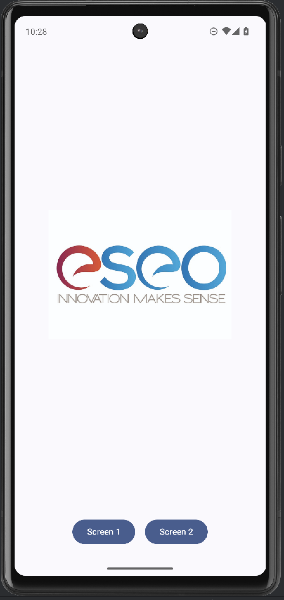

:::

## Les slides

Avant de commencer, voici une présentation rapide de la partie théorie de notre TP du jour : le fonctionnement d'Android, Compose, les composants, les ressources et les interactions.

<ClientOnly>
<SlidesDeck src="android_tp_base" />
</ClientOnly>

Ces slides sont un condensé. Le support complet du cours est disponible ici : [Slides Android Base](/cours/android_base.md).

## Fonctionnement d'Android

Android est une plateforme mobile développée par Google. Elle repose sur un noyau Linux et est globalement utilisée pour des smartphones et des tablettes.

D'un point de vue sécurité et performance, Android est une plateforme très intéressante. Elle est également très populaire, ce qui en fait une plateforme de choix pour le développement d'applications mobiles.

Android repose sur plusieurs éléments :

- **Kotlin** : Kotlin est un langage plus récent qui est devenu le langage de prédilection pour le développement Android.
- **Gradle** : Gradle est un outil de build qui permet de compiler, de packager et de déployer les applications Android.
- **Android SDK** : L'Android SDK est un ensemble d'outils et de bibliothèques qui permettent de développer des applications Android.
- **Play Services** : Play Services est un ensemble de services qui permettent d'ajouter des fonctionnalités à une application Android.
- **Compose** : Compose est une bibliothèque qui permet de créer des interfaces pour Android.
- **Jetpack** : Jetpack est un ensemble de bibliothèques qui permettent de faciliter le développement d'applications Android.
- **View** : Les Views sont les éléments de base qui permettent de créer des interfaces pour Android (ancien système).

Android étant relativement ancien, beaucoup d'éléments reposent sur du XML. Cependant, récemment, Google a annoncé Compose, une nouvelle façon de créer des interfaces pour Android. C'est celle-ci que nous allons découvrir dans ce TP.

### Sécurité

Lors de l'installation d'une application Android, techniquement, l'application est isolée des autres applications :

- Utilisation de permissions pour accéder à des ressources.
- Isolation des applications (sandbox).
- Sécurité des données (chiffrement, etc.).
- Permissions pour accéder à des ressources (caméra, contacts, localisation, etc.).

::: tip Signature

Lors de l'installation d'une application, Android vérifie que l'application est signée par un certificat valide. Cela permet de garantir que l'application n'a pas été modifiée depuis sa publication.

Cette signature est également utilisée pour identifier l'application et pour gérer les mises à jour. Elle est de type RSA et est stockée dans le fichier APK.

:::

### Moteur de rendu

Depuis l'arrivée de Compose, Android utilise un nouveau moteur de rendu pour afficher les interfaces. Ce moteur nommé « Skia » est un moteur de rendu 2D qui est utilisé par de nombreux projets (Chrome, Firefox, etc.).

Il est très performant et permet de créer des interfaces fluides et réactives. Il est également très flexible et permet de créer des interfaces complexes.

### Principe de Compose

- **Déclaratif** : Compose est un framework déclaratif. Cela signifie que vous décrivez ce que vous voulez afficher, et Compose se charge de mettre à jour l'interface en fonction des changements.
- **Composable** : Compose repose sur le concept de composable. Un composable est une fonction qui prend des paramètres et qui retourne un élément de l'interface.
- **Observation** : Compose permet d'observer des données et de mettre à jour l'interface en fonction des changements.

::: tip Performances

Seuls les composants qui ont changé sont mis à jour, ce qui permet d'optimiser les performances.

:::

### Multiplateforme

Avec Compose, il est également possible de créer des interfaces pour d'autres plateformes (Web, Desktop, iOS). Plusieurs approches sont possibles :

Trois termes à retenir :

- **Compose** : La librairie de Google pour Android => Interface déclarative.
- **KMM** : Kotlin Multiplatform (Jetbrains) => Logique métier partagée.
- **CMP** : Compose Multiplatform (Jetbrains) => Interface partagée.

## Création du projet

Pour la création du projet, rien de spécial à prévoir. Il s'agit ici de suivre le processus de création d'une application comme habituellement. Pour ça nous allons utiliser « Android Studio » qui est l'IDE à utiliser pour créer une application Android.

Lors de la création, Android Studio va nous poser plusieurs questions, nous allons donc choisir :

- Template : Empty **Compose** Activity
- Language : Kotlin
- SDK Min. : SDK 26. (ou plus)

Je vous laisse suivre les étapes de création d'un nouveau projet.

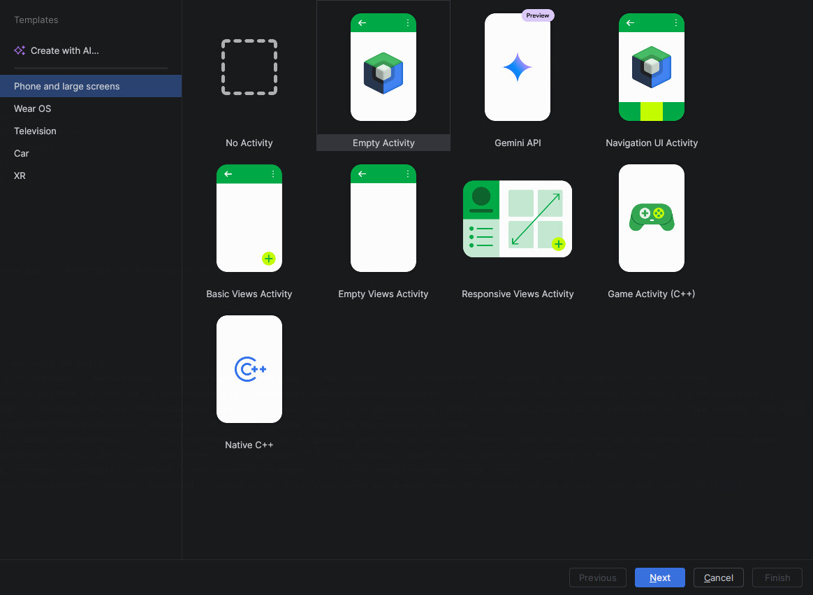
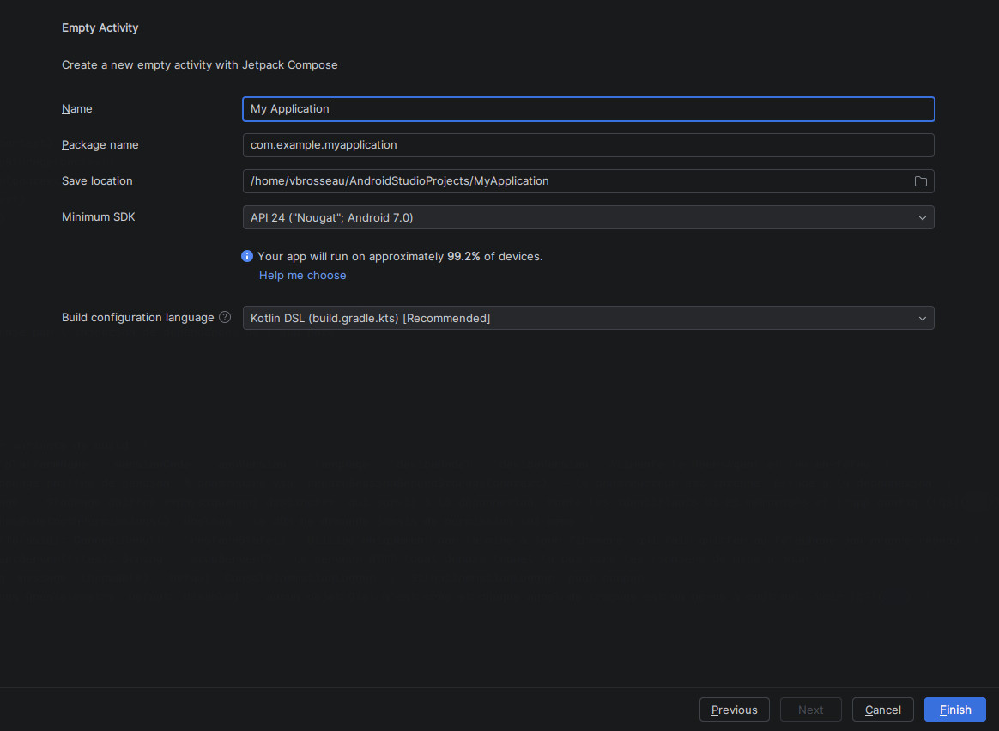

::: warning Mais quelques petites remarques :

- Le choix du package est très important. Comme nous avons vu ensemble en cours, le « Package » doit être unique. En effet deux applications ne peuvent pas avoir le même.
- Choisir un min SDK qui correspond aux cibles des mobiles souhaités. (Si vous êtes en France ou dans un autre pays, il conviendra de faire le bon choix).
- Kotlin est maintenant le langage à choisir, Java et Kotlin cohabitent sans problème, vous n'aurez donc aucun problème de compatibilité.

:::

### L'émulateur

Comme vu ensemble pendant le cours, l'émulateur va nous permettre de tester « simplement » notre application avec des performances _suffisantes dans les cas simples_. La création de celui-ci est intégrée à Android Studio. Dans Android Studio la partie émulateur s'appelle Device Manager et est disponible dans le menu `tools`.

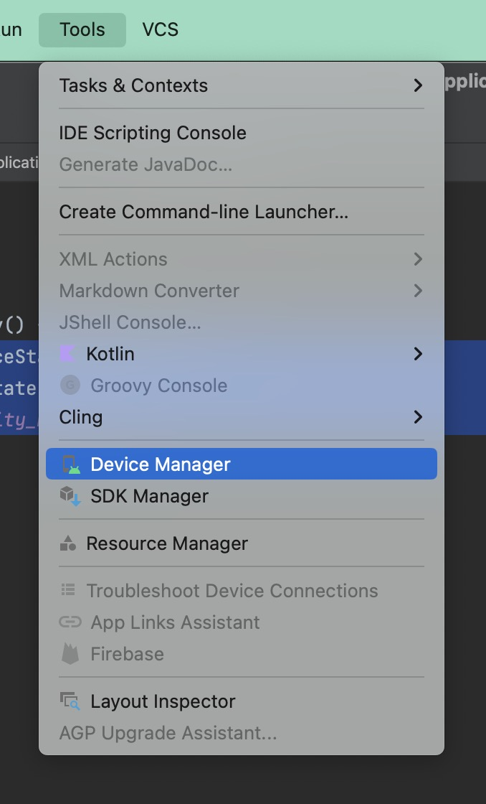

Pour le choix du type de devices vous êtes libres… Mais le mieux est de choisir un « template de mobile » assez représentatif de ce que l'on trouve chez les clients. Un bon choix est par exemple un « Pixel 6a » avec Android 14.

::: tip

Le Logo Playstore présent sur la ligne d'un simulateur indique que celui-ci est équipé des Play Services. Bien que dans notre cas ça ne change pas grand-chose. Cependant, je vous invite vivement à choisir un émulateur avec les Play Services, car celui-ci sera très proche d'un vrai téléphone trouvable dans le commerce.

:::

Maintenant que votre émulateur est créé, nous allons pouvoir lancer l'application « Run -> Run App ».

### Premier lancement et découverte

Pour débuter (et avant de tout retravailler), je vous laisse compiler et lancer une première fois l'application proposée par Google.

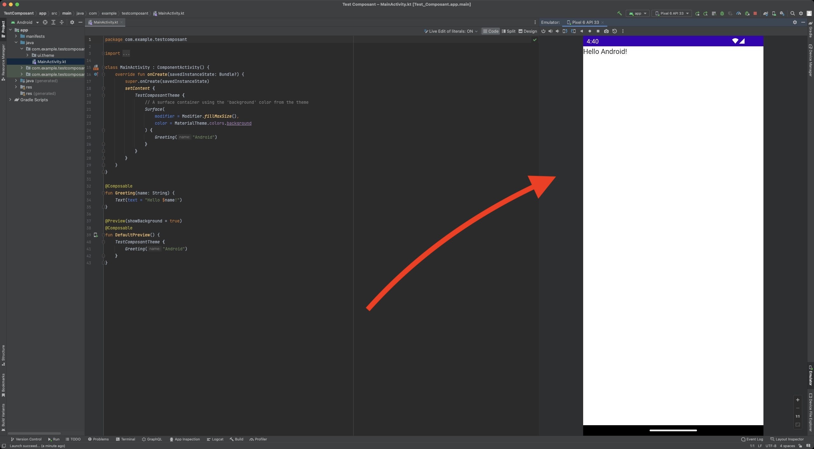

> Dans mon cas l'application est sur la droite.

::: tip Analysons le code

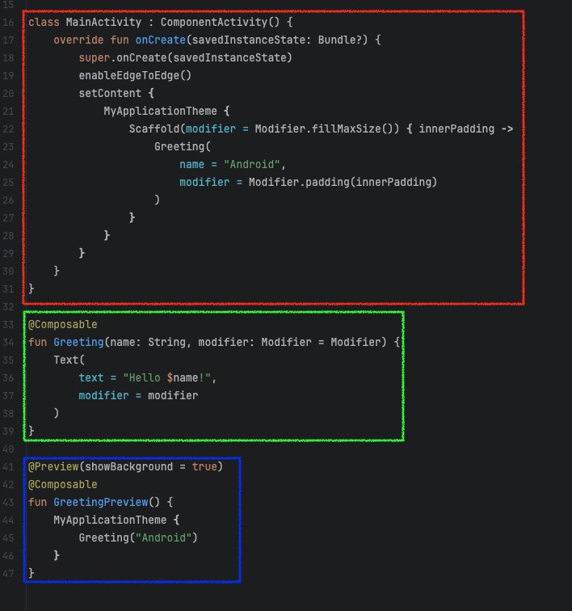

Ici, nous avons :

- Notre `MainActivity` qui est la première activité lancée. Elle contient un `setContent` qui va afficher notre interface.
- `Greeting` qui est un composant. Un composant est une partie de l'interface. Ici, nous avons un composant qui affiche un texte.
- `GreetingPreview` qui est une fonction qui a pour but de prévisualiser notre composant `Greeting` (une preview qui évite de lancer l'application à chaque fois pour voir le rendu).

:::

::: danger Note

Si vous avez des erreurs, il est possible que votre installation d'Android Studio ne soit pas correcte. Je vous invite à vérifier que vous avez bien installé les composants nécessaires.

:::

## L'architecture d'un projet Compose

### Les dossiers

Un projet Android est composé de plusieurs dossiers :

- `app` : C'est le dossier principal de l'application. Il contient le code source, les ressources, les fichiers de configuration, etc.
- `build` : C'est le dossier où sont stockés les fichiers générés par Gradle lors de la compilation de l'application.
- `gradle` : C'est le dossier où sont stockés les fichiers de configuration de Gradle.
- `res` : C'est le dossier où sont stockées les ressources de l'application (images, fichiers XML, etc.). Nous avons dans ce dossier plusieurs sous-dossiers :
  - `drawable` : C'est le dossier où sont stockées les images.
  - `layout` : C'est le dossier où sont stockés les fichiers XML qui définissent l'interface de l'application.
  - `mipmap` : C'est le dossier où sont stockées les icônes de l'application.
  - `values` : C'est le dossier où sont stockés les fichiers XML qui définissent les valeurs de l'application (couleurs, dimensions, etc.).

### Les textes

Android est un système d'exploitation pensé pour être internationalisé. C'est pourquoi il est important de séparer les textes de l'interface de l'application.

Pour cela, Android utilise des fichiers XML qui contiennent les textes de l'application. Ces fichiers sont stockés dans le dossier `res/values`.

Avant de continuer, je vous invite à ouvrir le fichier `strings.xml` qui se trouve dans le dossier `res/values` pour y observer les textes de l'application.

## Le fichier AndroidManifest

Pour rappel le fichier manifest va nous permettre d'exposer « de la configuration » relative à votre application sur le téléphone, cette configuration est très large :

- Le nom de votre application.
- Les `activity` accessibles.
- L'icône de votre application.
- Les services de votre application.
- Les paramétrages spécifiques de vos activités (Orientation, thème, comportement…)

### Personnalisation de l'application

### À faire :

- Éditer le fichier `AndroidManifest.xml`.
- Changer le nom de votre application (attention à bien utiliser la mécanique `i18n`).
- Regarder l'ensemble des paramètres spécifiés dans le XML
- Tester à nouveau votre application

::: tip
Petit raccourci pratique d'Android Studio. Si vous appuyez deux fois sur la touche <kbd>Shift</kbd><kbd>Shift</kbd> Android Studio vous proposera de chercher des actions / fichiers / menus dans l'ensemble de votre projet.
:::

### À faire 2 :

Changer l'icône de l'application en utilisant les outils fournis par Google dans Android Studio « Image asset » :

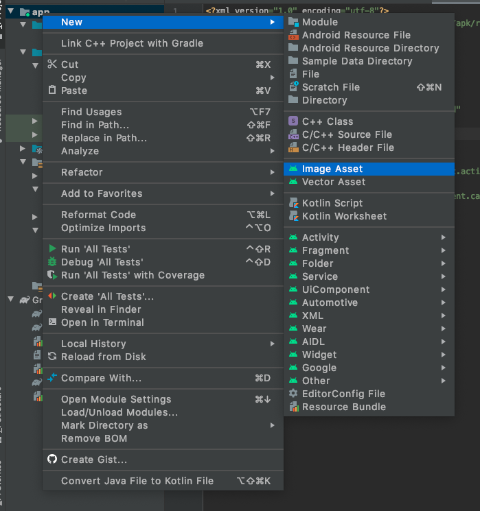

Une fois fait, regarder les modifications dans votre projet.

_Notamment :_

- Le fichier `AndroidManifest.xml`, est-ce que celui-ci a été modifié ?
- Si oui, quel(s) élément(s) sont différents ?
- Si non, pouvez-vous me dire pourquoi ?

## L'interface

Compose repose sur l'utilisation du code pour définir l'interface que l'utilisateur va voir. Elle reprend les principes de la programmation en composant qui est largement utilisée dans le développement web.

Nous avons à notre disposition un ensemble de composants « fonctionnels » qui vont nous permettre de créer les éléments de notre interface :

- `Text` : Un composant qui permet d'afficher du texte.
- `Button` : Un composant qui permet d'afficher un bouton.
- `Switch` : Un composant qui permet d'afficher un toggle (un bouton qui peut être activé ou désactivé).
- `Image` : Un composant qui permet d'afficher une image.
- `LazyColumn` : Un composant qui permet d'afficher une liste.
- `Scaffold` : Un composant qui permet de créer une structure de base pour notre application (barre de navigation, etc.).
- `TopAppBar` : Un composant qui permet de créer une barre de navigation en haut de l'application.
- `Card` : Un composant qui permet de créer une carte.
- `IconButton` : Un composant qui permet de créer un bouton avec une icône.
- Etc… (Il y en a beaucoup plus, mais nous allons nous arrêter là pour l'instant).

Nous avons également des composants qui sont là pour définir la structure de notre application :

- `Column` : Un composant qui permet de créer une colonne.
- `Row` : Un composant qui permet de créer une ligne.
- `Box` : Un composant qui permet de créer une boîte.
- `Spacer` : Un composant qui permet de créer un espace entre deux éléments.

Les composants sont des fonctions que nous allons pouvoir appeler dans notre code. Ils seront appelés au bon moment en fonction de conditions que nous allons définir. Les composants seront imbriquables les uns dans les autres, ce qui nous permettra de créer des interfaces complexes. Par exemple :

```kotlin
Column() {
    Text("Texte 1")
    Text("Texte 2")
    Text("Texte 3")
}
```

Ce code va nous permettre d'afficher trois textes les uns en dessous des autres. Et si nous souhaitons afficher les textes les uns à côté des autres ? Il suffit de changer le composant `Column` par `Row`.

```kotlin
Row() {
    Text("Texte 1")
    Text("Texte 2")
    Text("Texte 3")
}
```

Nous pouvons également imbriquer les Colonnes et les Lignes :

```kotlin
Column() {
    Row() {
        Text("Texte 1")
        Text("Texte 2")
        Text("Texte 3")
    }
    Row() {
        Text("Texte 4")
        Text("Texte 5")
        Text("Texte 6")
    }
}
```

Cet exemple est là pour vous montrer la puissance de Compose. Compose a été pensé pour être simple et modulaire, par exemple pour un bouton le principe est le même :

```kotlin
Button(onClick = { /* Code appelé lors du clic sur le bouton */ }) {
    Text("Mon bouton")
}
```

Ici nous voyons que le composant `Button` prend en paramètre une action (un code qui sera appelé lors du clic sur le bouton) et un composant `Text` qui sera affiché dans le bouton. Pratique ! Et si nous souhaitons un bouton avec un loader ? Et bien c'est simple il suffit de changer le composant `Text` par un composant `CircularProgressIndicator` (qui est un loader).

```kotlin
Button(onClick = { /* Code appelé lors du clic sur le bouton */ }) {
    CircularProgressIndicator()
}
```

Et évidemment, nous allons pouvoir créer nos propres composants… Mais nous verrons ça plus tard.

### Taille des composants

Via le `Modifier` (que nous verrons plus tard), nous allons pouvoir définir la taille des composants. Par exemple :

```kotlin
Text(
    text = "Hello World",
    modifier = Modifier.size(128.dp)
)
```

Ou plus largement, nous allons pouvoir définir des tailles par rapport à l'écran :

```kotlin
Text(
    text = "Hello World",
    modifier = Modifier.fillMaxWidth() // Remplit toute la largeur de l'écran
)
```

```kotlin
Text(
    text = "Hello World",
    modifier = Modifier.fillMaxHeight() // Remplit toute la hauteur de l'écran
)
```

```kotlin
Text(
    text = "Hello World",
    modifier = Modifier.fillMaxSize() // Remplit toute la taille de l'écran
)
```

::: tip Le modifier

Le `Modifier` est disponible sur tous les composants. Il permet de modifier le comportement du composant (taille, couleur, etc.). Nous verrons plus en détail le `Modifier` plus tard.

Vous pouvez le découvrir en utilisant l'autocomplétion de votre IDE. Point important, il est également chaînable. Ce qui signifie que vous pouvez enchaîner plusieurs modificateurs les uns après les autres, exemple :

```kotlin
Text(
    text = "Hello World",
    modifier = Modifier
        .padding(16.dp)
        .background(Color.Blue)
        .border(1.dp, Color.Black)
)
```

Nous avons ici un `Text` avec un padding de 16dp, un fond bleu et une bordure noire de 1dp.

:::

::: danger Attention

Ici la taille est relative au parent. Si le parent n'a pas de taille définie, le composant n'aura pas de taille définie.

:::

### Imbrication des composants

Avec Compose, tout est composant. Cela signifie que nous allons pouvoir imbriquer les composants les uns dans les autres pour créer des interfaces complexes.

```kotlin
Column {
    Button(onClick = { /* Action */ }) {
        Text("Cliquez ici")
    }
    Spacer(modifier = Modifier.weight(1f))
    Text("Un texte")
}
```

Comment lire le code ci-dessus ?

- Nous avons un composant `Column` qui contient trois composants : un composant `Button`, un composant `Spacer` et un composant `Text`.
- Le composant `Button` est un bouton qui affiche le texte « Cliquez ici » et qui appelle une action lorsqu'il est cliqué.
- Le composant `Spacer` est un espace qui prend tout l'espace disponible.
- Le composant `Text` est un texte qui affiche le texte « Un texte ».

### Une disposition en « grille »

Nous construisons donc des grilles de composants.

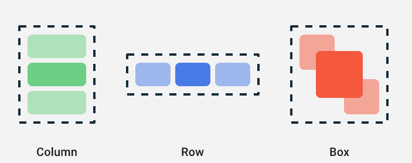

::: tip Et n'oubliez pas

Tout est imbriquable, vous pouvez donc imbriquer des `Column` dans des `Row`, des `Row` dans des `Column`, etc.

:::

### Les animations

Sans entrer dans les détails, réaliser des animations avec Compose est très simple. Nous avons à notre disposition plusieurs composants qui vont nous permettre de réaliser des animations :

```kotlin
var counter by remember { mutableStateOf(0) }

Column {
    Button(onClick = { counter++ }) {
        Text("Action")
    }

    AnimatedVisibility(visible = counter > 0) {
        Text("Visible")
    }

    AnimatedContent(targetState = counter) { targetState ->
        Text(text = "Count: $targetState")
    }
}
```

Dans cet exemple, nous avons un compteur qui va être incrémenté lors du clic sur le bouton. Lorsque le compteur est supérieur à 0, le texte « Visible » va apparaître avec une animation. Et le texte « Count: $targetState » va être mis à jour avec une animation.

::: tip C'est pour vous

Je vous laisse tester, et garder ce genre de code pour votre projet final. Les animations sont un plus pour une application, elles permettent de rendre l'application plus dynamique et plus agréable à utiliser.

:::

#### Aller plus loin avec les animations


_Source:_ [Twitter](https://twitter.com/JorgeCastilloPr/status/1579057096360079361)

### Le material design

En plus des composants proposés par Compose, nous avons également accès aux composants de Material Design. Le projet que vous avez créé utilise déjà le Material Design en version 3.

Les composants proposés sont prêts à l'emploi, ils intègrent toutes les bonnes pratiques définies par Google.

[Documentation de Material Design](https://m3.material.io/)

Ce TP est guidé, vous n'avez pas à « apprendre la documentation », par contre je vous invite à la parcourir pour voir les options / fonctionnements, votre compréhension en sera grandement facilitée.

## Définir notre layout / composant

Maintenant que nous avons vu les bases du fonctionnement de Compose (et que vous avez observé le code de l'application de base), nous allons pouvoir commencer à définir notre propre layout.

Dans un premier temps, nous allons modifier le composant `Greeting` pour qu'il affiche « autre chose ». Il va devenir en quelque sorte notre composant principal (`home`).

### À faire

Nous allons modifier notre composant `Greeting` pour qu'il ressemble à ceci :

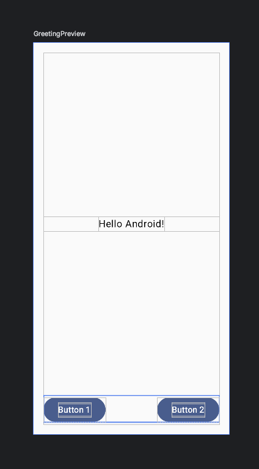

#### Prototyper l'idée

Pour cette première fois, nous allons prototyper l'idée ensemble, dans un premier temps tester en utilisant le code suivant :

```kotlin
@Composable
fun Greeting(name: String) {
    Column {
        Button(onClick = { /* Action */ }) {
            Text("Cliquez ici")
        }
        Spacer(modifier = Modifier.weight(1f))
        Text("Un texte")
    }
}
```

::: tip Spacer ?

```kotlin
Spacer(modifier = Modifier.weight(1f))
```

Un espace qui prend tout l'espace disponible. `weight` est un pourcentage. Ici nous avons un poids de 1, donc il prend tout l'espace disponible.

:::

#### Centrer nos éléments

Plusieurs solutions :

- `horizontalAlignment = Alignment.CenterHorizontally` sur la `Column`.
- `textAlign = TextAlign.Center` sur le `Text`. ⚠️ Attention, cela ne fonctionne que si votre `Text` fait la largeur de l'écran.

---

```kotlin
Column(
    horizontalAlignment = Alignment.CenterHorizontally
) {
    Spacer(modifier = Modifier.weight(1f))
    Text("Un texte")
}
```

#### Ajouter un padding

Pour ajouter un padding à un composant, nous allons utiliser le `Modifier.padding` :

```kotlin
Column(
    horizontalAlignment = Alignment.CenterHorizontally,
    modifier = Modifier.padding(16.dp)
) {
    Spacer(modifier = Modifier.weight(1f))
    Text("Un texte")
}
```

#### Mettre deux boutons côte à côte

Pour mettre deux boutons côte à côte, nous allons utiliser un `Row` dans notre `Column` :

```kotlin
@Composable
fun Greeting(name: String) {
    Column(
        horizontalAlignment = Alignment.CenterHorizontally,
        modifier = Modifier.padding(16.dp)
    ) {
        Row {
            Button(onClick = { /* Action */ }) {
                Text("Cliquez ici")
            }
            Spacer(modifier = Modifier.width(16.dp))
            Button(onClick = { /* Action */ }) {
                Text("Cliquez là")
            }
        }
        Spacer(modifier = Modifier.weight(1f))
        Text("Un texte")
    }
}
```

#### C'est à vous

Avec les éléments que nous avons vus ensemble, je vous laisse **créer** un composant `Home` pour qu'il ressemble à l'image ci-dessus.

Pour cette première fois, je vais vous donner le code complet (profitez-en, ce ne sera pas toujours le cas) :

```kotlin
@Composable
fun Home(){
    Column(
        modifier = Modifier.fillMaxSize()
    ) {
        Spacer(modifier = Modifier.weight(1f))

        Row(
            modifier = Modifier.fillMaxWidth(),
            horizontalArrangement = Arrangement.Center,
            verticalAlignment = Alignment.CenterVertically
        )
        {
            Greeting(
                name = "Android",
            )
        }

        Spacer(modifier = Modifier.weight(1f))

        Row {
            Button(onClick = { /*TODO*/ }) {
                Text("Button 1")
            }

            Spacer(modifier = Modifier.weight(1f))

            Button(onClick = { /*TODO*/ }) {
                Text("Button 2")
            }
        }
    }
}

@Preview(showBackground = true)
@Composable
fun HomePreview() {
    Home()
}
```

Arrêtons-nous un instant, que constatez-vous dans le code que vous avez copié-collé sans trop réfléchir 👀…

- `@Composable` au-dessus de la fonction, indique l'emplacement d'un composant.
- `@Preview(showBackground = true)` permet de réaliser une preview de votre composant sans la lancer sur un téléphone (pratique, testons).

Je vous laisse mettre en place le code. Et valider que celui-ci s'affiche correctement dans la partie preview.

#### L'agencement

En compose, nous parlons de `Modifier`.

Les modifiers ont des méthodes pour modifier les composants (taille, couleur, etc.). Ils sont chaînables et varient en fonction du composant.

```kotlin
Text(
    text = "Hello World",
    modifier = Modifier
        .padding(16.dp)
        .background(Color.Blue)
        .border(1.dp, Color.Black)
)
```

##### Exemple les dimensions

```kotlin
Modifier.fillMaxWidth() // Remplit la largeur
Modifier.fillMaxHeight() // Remplit la hauteur
Modifier.fillMaxSize() // Remplit la taille
```

---

##### Exemple le padding

```kotlin
Modifier.padding(16.dp) // Ajoute un padding de 16dp
Modifier.padding(16.dp, 8.dp) // Ajoute un padding de 16dp en largeur et 8dp en hauteur
```

## Taille et style du texte

```kotlin
Text(text = content, fontWeight = FontWeight.Light, fontSize = 10.sp)
```

## Les ressources

Les ressources sont un élément important d'une application Android. Elles peuvent être de plusieurs types :

- `drawable` : Les images.
- `mipmap` : Les icônes.
- `values` : Les valeurs (couleurs, textes, dimensions, etc.).

### Les images

Nous avons dans notre application un dossier `drawable` qui contient les images de l'application. Nous allons maintenant ajouter une image à notre application.

Je vous laisse chercher le logo de l'ESEO, et l'ajouter à votre application (un glisser-déposer dans le dossier `drawable` suffit).

#### À faire

Placer l'image dans le dossier `res/drawable/`. Puis l'ajouter au-dessus de votre `Text` qui est actuellement au centre de votre `Column`.

```kotlin
Image(
    painter = painterResource(R.drawable.nom_image),
    contentDescription = "Une image",
    modifier = Modifier.size(128.dp)
)
```

⚠️ `R.drawable.nom_image` est un exemple, vous devez remplacer `nom_image` par le nom de votre image. ⚠️

## Les interactions

::: tip Avant de continuer… Les callbacks avec Kotlin

Un callback est une fonction qui est passée en paramètre d'une autre fonction.

```kotlin
fun doSomething(callback: () -> Unit) {
    callback()
}
```

Fonctionne dans le code, mais également dans vos composants Compose.

```kotlin
@Composable
fun MyButton(onClick: () -> Unit) {
    Button(onClick = onClick) {
        Text("Cliquez ici")
    }
}
```

:::

Interagir avec l'utilisateur est un élément clé d'une application. Sur Android, au-delà du `onClick` que nous avons vu, nous avons également accès à d'autres interactions :

- **Toast** : Un message qui s'affiche à l'écran.
- **Snackbar** : Un message qui s'affiche en bas de l'écran.
- **Dialog** : Une fenêtre qui s'affiche à l'écran.

### Internationalisation

Je ne le répéterai jamais assez, l'internationalisation est un élément important d'une application. Android Studio propose un outil pour gérer les traductions de votre application.

Extraire les textes de votre application est donc **un incontournable**. Android Studio vous guide pour cela :

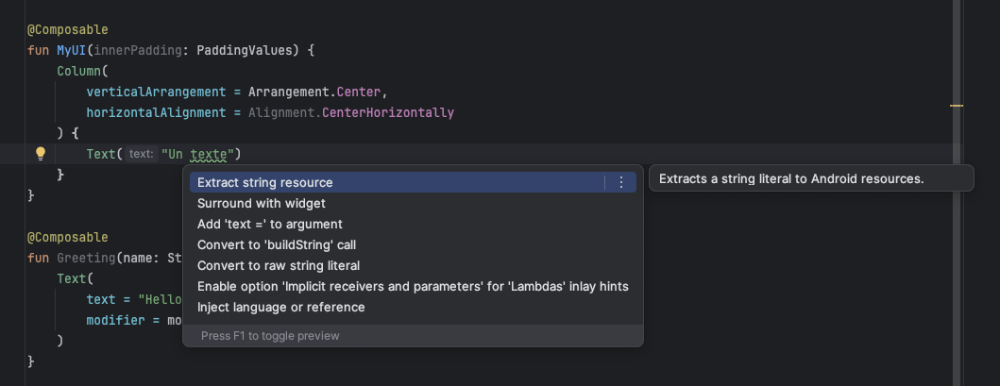

::: tip C'est à vous

Je vous laisse extraire les différents textes de votre application.

:::

### Les ressources alternatives

Les ressources alternatives sont des ressources qui sont utilisées en fonction de la configuration de l'appareil. Par exemple, si l'appareil est en mode sombre, les ressources alternatives seront utilisées. Voici une liste non exhaustive des configurations qui peuvent être utilisées :

- Taille de l'écran.
- Langue.
- Rotation de l'écran (Paysage / Portrait).
- DPI
- Thème sombre
- Version d'Android
- etc.

Cette création de ressource est réalisable directement depuis Android Studio :

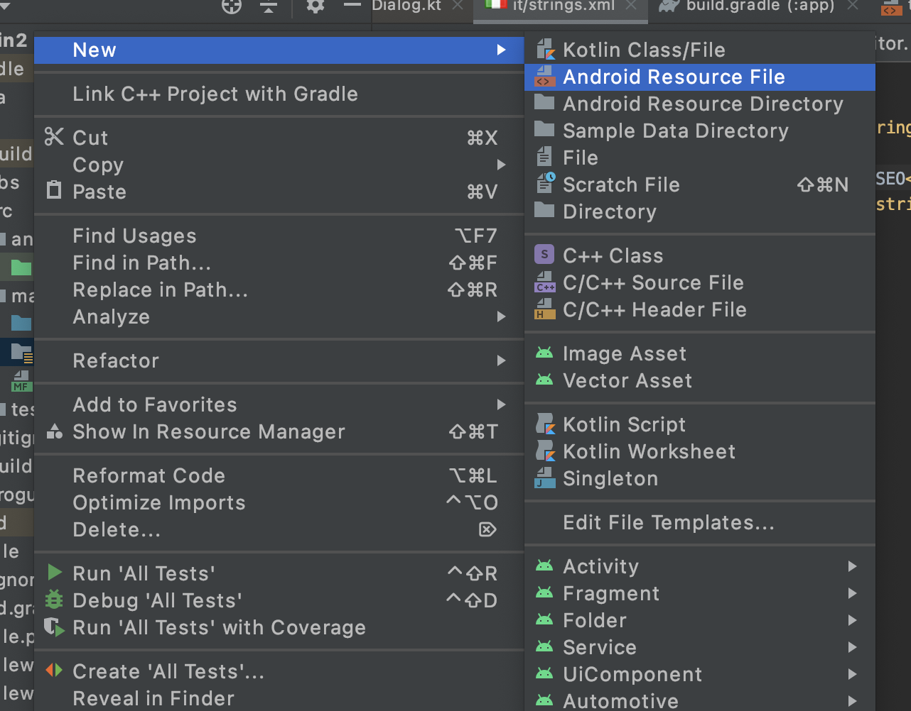
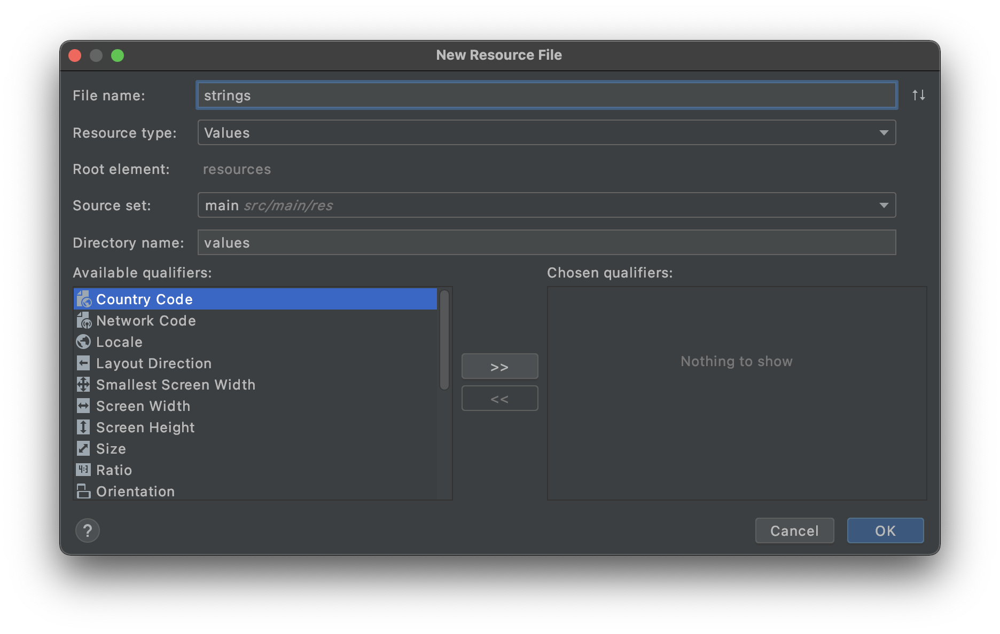

::: tip Vous pouvez tout redéfinir
L'ensemble des ressources (`res`) est redéfinissable sans écrire de code. Par exemple si vous souhaitez redéfinir des `strings` dans différentes conditions il suffit de :

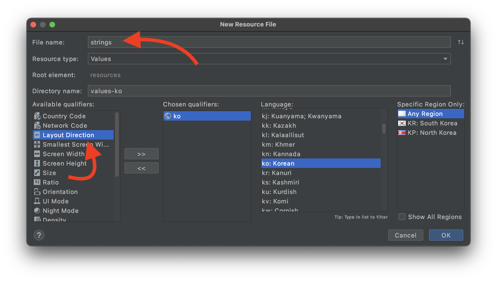
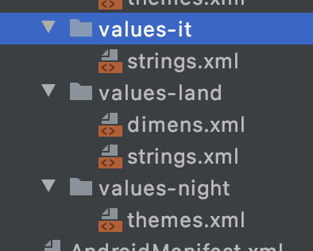
:::

#### À faire

Nous allons tester ensemble ce fonctionnement grâce aux textes que vous avez extraits :

- Ajouter la langue `it` (Italien) à votre application.
- Traduire votre fichier `strings.xml` en italien.
- Lancer votre application et changer la langue de votre téléphone pour voir le résultat.

### Les Toast

Nous avons une activité qui pour l'instant ne fait pas grand-chose. Si vous regardez le code, celui-ci est presque vide. Je vous propose de la modifier, en premier lieu nous allons ajouter un message au lancement de celle-ci.

Un message simple sur Android s'appelle un Toast :

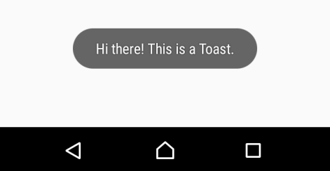

Ajouter un toast directement dans le `setContent` de votre `MainActivity` :

Vous pouvez utiliser la complétion de votre IDE, `toast` puis <kbd>tab</kbd>.

::: tip
Les toasts sont rapides et simples à mettre en place. Cependant, ils ne sont pas très beaux. C'est pour ça que nous les utiliserons principalement pour « les informations de test ou sans grande importance ».
:::

Le code à ajouter :

```kotlin
// Récupération du context
val context = LocalContext.current

Toast.makeText(context, "Je suis un Toast", Toast.LENGTH_LONG).show();
```

Évidemment, le texte du toast est à internationaliser…

### Les Snackbars

Les snackbars sont des messages qui s'affichent en bas de l'écran. Ils sont plus beaux que les toasts et permettent d'ajouter des actions.

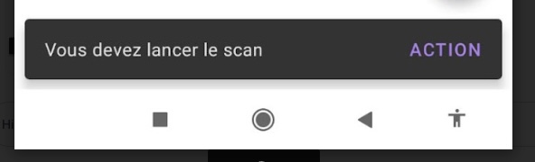
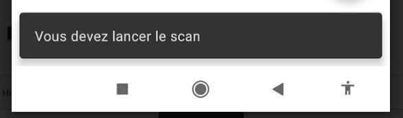

Documentation : [https://developer.android.com/develop/ui/compose/components/snackbar]

::: tip Des durées d'affichage différentes

Plusieurs options s'offrent à vous :

- `Snackbar.LENGTH_SHORT`
- `Snackbar.LENGTH_LONG`
- `Snackbar.LENGTH_INDEFINITE`

:::

#### Le `Context`

Pour rappel, le `Context` est un objet qui permet d'accéder à des informations sur l'application. Dans notre cas, nous allons avoir besoin du contexte pour accéder au Bluetooth du téléphone.

Le terme `Context` est utilisé dans le développement Android pour faire référence à l'environnement dans lequel l'application s'exécute. Il permet d'accéder à des ressources, des services et des informations sur l'application (préférences, ressources, bluetooth, etc.).

⚠️ C'est un élément obligatoire. Et une notion importante à comprendre pour le développement Android. Sans `Context`, vous ne pouvez pas accéder aux ressources de l'application, ni aux services du téléphone.

### Rendre un bouton cliquable

Pour rendre un bouton cliquable, nous allons utiliser le paramètre `onClick` :

```kotlin
Button(onClick = { /* Action */ }) {
    Text("Cliquez ici")
}
```

- `onClick` : L'action à réaliser lors du clic sur le bouton.

Ici, nous avons une action vide (en commentaire `/* Action */`). Nous allons maintenant ajouter une action qui va afficher un toast.

### À faire

Je vous laisse modifier le code pour afficher le toast **uniquement** lors du clic sur le bouton.

### Les dialogues

Les dialogues sont des fenêtres qui s'affichent à l'écran. Ils permettent de demander une confirmation à l'utilisateur, de lui demander de saisir des informations, etc.

Ils sont très utilisés dans les applications mobiles, car ils sont très rapides à mettre en place :

```kotlin
val context = LocalContext.current

AlertDialog(
    onDismissRequest = { /* Action */ },
    title = { Text("Titre") },
    text = { Text("Contenu") },
    confirmButton = {
        Button(
            onClick = {
                Toast.makeText(context, "Clic sur le bouton", Toast.LENGTH_LONG).show()
            }
        ) {
            Text("Confirmer")
        }
    },
    dismissButton = {
        Button(
            onClick = {
                Toast.makeText(context, "Clic sur le bouton", Toast.LENGTH_LONG).show()
            }
        ) {
            Text("Annuler")
        }
    }
)
```

- `onDismissRequest` : L'action à réaliser lors de la fermeture de la fenêtre.
- `title` : Le titre de la fenêtre.
- `text` : Le contenu de la fenêtre.
- `confirmButton` : Le bouton de confirmation.
- `dismissButton` : Le bouton de fermeture.

#### À faire

Je vous laisse mettre ce dialogue dans le `setContent` de votre `MainActivity`. 

Lancer votre application et tester le dialogue. Normalement, vous devriez voir une fenêtre s'afficher avec un titre, un contenu et deux boutons.

### Conditionner l'affichage d'un élément

Le dialogue est un bon exemple pour conditionner l'affichage d'un élément. En effet, il est possible de conditionner l'affichage d'un élément en fonction d'une condition.

```kotlin
var showDialog by remember { mutableStateOf(false) }

if (showDialog) {
    // Afficher le Dialog
}

Button(onClick = { showDialog = true }) {
    Text("Afficher le Dialog")
}
```

Dans cet exemple, nous avons une variable `showDialog` qui est initialisée à `false`. Lorsque l'utilisateur clique sur le bouton, la variable `showDialog` passe à `true` et le dialogue s'affiche.

::: tip MutableState

La variable `showDialog` est une variable d'état. Cela signifie que Compose va observer cette variable et mettre à jour l'interface en fonction des changements.

:::

#### À faire

Modifier votre code pour que le dialogue ne s'affiche que si l'utilisateur clique sur le logo de l'ESEO.

::: tip Rendre un logo cliquable ?

Pour rendre un logo cliquable, il suffit d'ajouter un `clickable` sur le composant `Image`.

```kotlin
Image(
    painter = painterResource(R.drawable.logo_eseo),
    contentDescription = "Logo ESEO",
    modifier = Modifier.size(128.dp).clickable {
        /* Action */
    }
)
```

Bien que pratique, cette méthode n'est pas la plus propre. En effet, d'un point de vue de l'accessibilité, il est préférable d'utiliser un bouton.

:::

#### Les règles de Google

N'oubliez pas, Google propose des règles pour vous aider dans le développement. Exemple pour les dialogues :

- [La documentation](https://material.io/develop/android/components/dialogs)

## Conclusion

Dans ce TP, vous avez :

- compris comment fonctionne Android (isolation des applications, permissions, `AndroidManifest`) ;
- créé un projet Compose et découvert son organisation ;
- assemblé des composants (`Text`, `Button`, `Column`, `Row`…) et ajusté leur affichage avec le `Modifier` ;
- sorti les textes et les images dans les ressources, et traduit votre application ;
- interagi avec l'utilisateur (Toast, Snackbar, dialogue) et conditionné l'affichage avec une variable d'état.

Votre application ne possède pour l'instant qu'un seul écran. Dans le [TP suivant](./android-avance.md), nous allons lui en ajouter plusieurs, puis organiser ses données avec le découpage MVVM.

👋 Si vous avez des questions, n'hésitez pas.
