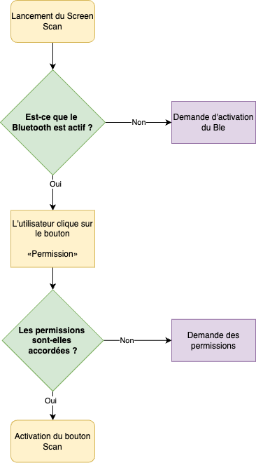
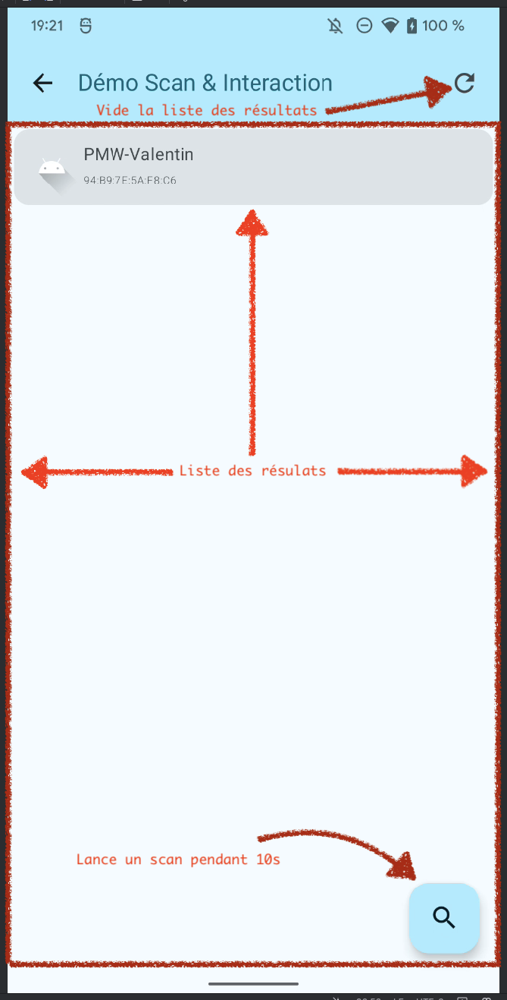
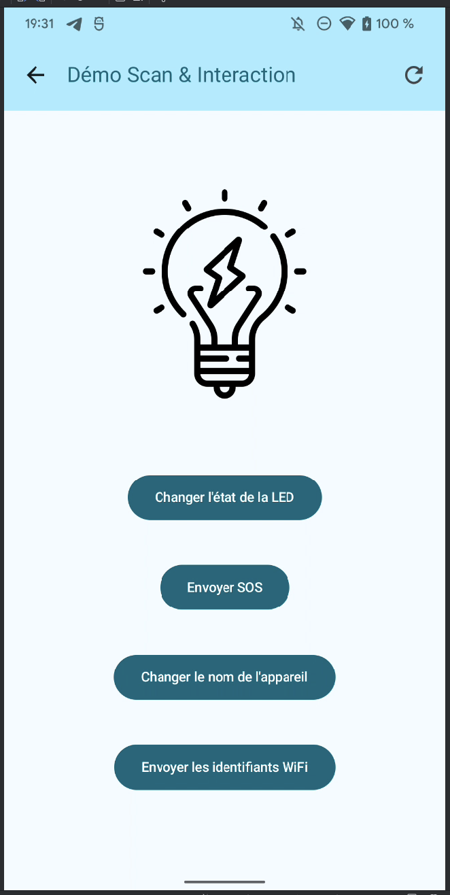
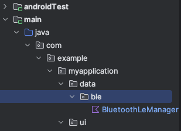
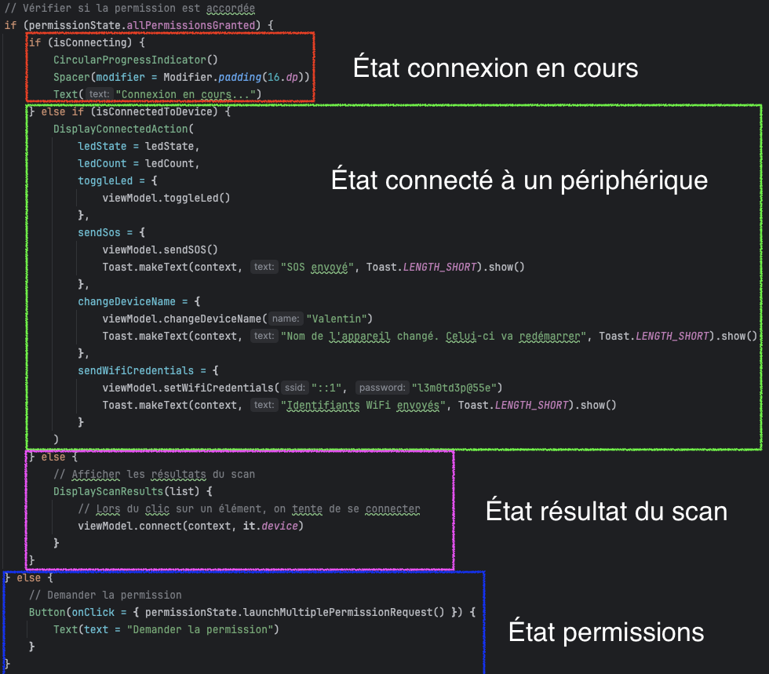

# Android Compose et le BLE

::: details Sommaire
[[toc]]
:::

- [Slides Android BLE](/cours/android_ble.md)
- [Support Android Base](./android-base.md)

## Introduction

Maintenant que nous avons vu les bases de la conception d'application Android avec Compose, nous allons voir comment interagir avec des périphériques BLE.

Dans cette partie nous allons voir comment interagir avec des périphériques BLE :

- Découverte des périphériques (Scan)
- Connexion à un périphérique (Connect)
- Lire des données (Notify)
- Ecrire des données (Write)

## Prérequis

Pour réaliser ce TP, vous avez besoin des notions vues précédemment dans [Android Compose](./android-base.md). Et plus particulièrement le découpage MVVM (Model View ViewModel), en effet nous allons utiliser ce pattern pour dialoguer avec les périphériques BLE.

## Le périphérique BLE

Dans ce TP nous allons utiliser un périphérique BLE à base d'ESP32. Ce dernier est programmé pour simuler une « lampe connectée ». Il possède les caractéristiques suivantes :

**En BLE :**

- Toggle de la LED.
- Comptage du nombre d’allumages.
- Changement du nom de la carte (persistant).
- Notification lors de l’allumage / extinction de la LED.
- Liste des réseaux Wifi environnants.
- Définition des credentials Wifi (persistant).

**En WiFi :**

- Allumage et extinction de la LED (toggle).
- Récupération du statut.

**En Physique :**

- Utilisation du bouton pour allumer et éteindre la LED.

<center>
<iframe width="560" height="315" src="https://www.youtube-nocookie.com/embed/LQsL3jDOc7o?si=6ceKFVKceKS3GlwU" title="YouTube video player" frameborder="0" allow="accelerometer; autoplay; clipboard-write; encrypted-media; gyroscope; picture-in-picture; web-share" referrerpolicy="strict-origin-when-cross-origin" allowfullscreen></iframe>
</center>

<center>
<iframe width="560" height="315" src="https://www.youtube-nocookie.com/embed/W9N-JtwWSzE?si=6ceKFVKceKS3GlwU" title="YouTube video player" frameborder="0" allow="accelerometer; autoplay; clipboard-write; encrypted-media; gyroscope; picture-in-picture; web-share" referrerpolicy="strict-origin-when-cross-origin" allowfullscreen></iframe>
</center>

## Rappel sur le fonctionnement du BLE

Le BLE est un protocole de communication sans fil basse consommation. Il est utilisé pour connecter des périphériques à faible consommation d'énergie, comme les montres connectées, les capteurs, les appareils médicaux, les serrures de porte, les thermostats, les télécommandes, etc.

Il repose sur le principe de GATT (Generic Attribute Profile) qui permet de définir des services et des caractéristiques. Les services sont des collections de caractéristiques et les caractéristiques sont des valeurs de données qui peuvent être lues ou écrites.

Dans le cadre d'un échange BLE nous avons donc :

- Un Serveur : Le périphérique BLE qui expose des services et des caractéristiques. (Dans notre cas l'ESP32).
- Un Client : L'application qui va se connecter au serveur pour lire ou écrire des données. (Dans notre cas l'application Android).

::: tip Fonctionnement asynchrone

Le BLE est un protocole asynchrone, c'est-à-dire que les actions de lecture ou d'écriture ne sont pas bloquantes. Il faut donc gérer les réponses de manière asynchrone.

Exemple lecture :

1. L'application Android demande à lire une caractéristique.
2. Le serveur répond avec la valeur de la caractéristique.

**Il faut donc gérer le cas « d'attente » de la réponse.** Ça veut dire que l'application doit afficher des loaders au bon moment (pendant la connexion par exemple).

Sur Android l'affichage d'un loader :

```kotlin
// Affichage du loader
if(isLoading) {
    CircularProgressIndicator()
}
```

:::

## Implémentation dans l'application Compose

Le BLE est une technologie à la fois simple et complexe. Simple, car les actions sont basiques (lire, écrire, notifier), mais complexe, car il faut gérer les erreurs, les déconnexions, les timeouts, etc.

D'autant plus que le BLE est un protocole avec une implémentation parfois « hasardeuse » (selon les constructeurs).

Il est donc important de bien structurer son code pour gérer les erreurs et les déconnexions.

::: tip Ça peut paraître négatif…

C'est propos peuvent vous sembler négatifs, mais ne vous y trompez pas, le BLE est une technologie très puissante et très utilisée. Il est important de bien comprendre son fonctionnement pour éviter les erreurs.

:::

## Découvrir le péprhérique avec nRF Connect

Pour commencer, nous allons utiliser l'application nRF Connect pour découvrir les services et les caractéristiques du périphérique.

1. Téléchargez l'application [nRF Connect](https://play.google.com/store/apps/details?id=no.nordicsemi.android.mcp) sur votre téléphone. (Disponible sur Android et iOS).
2. Ouvrez l'application et cliquez sur le bouton « Scan ».
3. Vous devriez voir des périphériques nommés `PMW-…`.
4. Cliquez sur un périphérique pour voir les services et les caractéristiques.

::: tip l'objectif identifier **votre** périphérique

L'objectif est d'identifier **votre** périphérique. Pour cela, nous allons regarder comment envoyer des données à l'ESP32.

**Nous allons le faire ensemble**, mais voici les étapes :

- Allumez la led avec l'UUID : `59b6bf7f-44de-4184-81bd-a0e3b30c919b` ou avec le bouton physique.
- Regardez les notifications avec l'UUID : `d75167c8-e6f9-4f0b-b688-09d96e195f00`.
- Une fois que vous avez identifié votre ESP32, changez le nom via la caractéristique `1497b8a8-64f8-11ee-8c99-0242ac120002`.

:::

## L'implémentation sur Android

Pour l'implémentation nous avons plusieurs possibilités :

- Utiliser une librairie tierce.
- Utiliser les API Android.

Dans ce TP nous allons utiliser les API Android pour vous montrer comment fonctionne le BLE. Mais vous allez voir que je vous ai quand même préparé quelques méthodes et classes pour vous simplifier la vie.

::: danger Attention

Même si je vous fournis le code, l'idée ici pour vous va être de comprendre le fonctionnement et l'enchaînement des opérations. **Il est donc important de ne pas copiez-collez bêtement le code que je vous donne.**

:::

### Voici les étapes que nous allons suivre :

- Vérifier si le BLE est disponible
- Demander les permissions (Manifest + Code)
- Filtrer les résultats (ou pas)
- Démarrer le Scan
- Connexion au `BluetoothDevice`
- Lire / Ecrire des données

::: tip Ceci est un préparatif au projet final

Dans le projet final, vous devrez implémenter ces étapes, mais aussi gérer les erreurs, les déconnexions, les timeouts, etc. Ce que vous faites ici est donc une étape préparatoire, plus vous vous approprierez ces étapes, plus vous serez à l'aise pour le projet final.

:::

### Le BLE sur Android : Une boîte à états



## Création du Screen Scan

Respirez un bon coup, on va commencer par créer un écran qui va nous permettre de scanner les périphériques BLE. Cet écran sera très similaire à celui que nous avons réalisé dans le TP précédent pour comprendre le système de liste. La différence ici est que nous allons scanner les périphériques BLE et non pas ajouter des éléments à la main via un bouton.

Il va également reprendre le système de demande de permission que nous avons vu dans le TP précédent. Mais avec plus de permissions à demander et surtout des permissions différentes en fonction de la version d'Android.

### Les permissions niveau AndroidManifest.xml

```xml
<!-- Permissions pour le BLE Android 12 et plus -->
<uses-permission android:name="android.permission.BLUETOOTH_SCAN"
    android:usesPermissionFlags="neverForLocation"
    tools:targetApi="s" />
<uses-permission android:name="android.permission.BLUETOOTH_CONNECT" />

<!-- Ancienne permission pour permettre l'usage du BLE  Android avant 11 inclus -->
<uses-permission android:name="android.permission.BLUETOOTH" />
<uses-permission android:name="android.permission.BLUETOOTH_ADMIN" />

<uses-permission android:name="android.permission.ACCESS_COARSE_LOCATION" />
<uses-permission android:name="android.permission.ACCESS_FINE_LOCATION" />
```

### La vue et le ViewModel

Je vous laisse créer ce nouveau composable et son ViewModel. Vous pouvez vous inspirer du TP précédent pour la structure. Dans mon cas j'ai créé un `ScreenScan` et un `ScanViewModel`. Celui-ci ressemble à ça :

<center>
<iframe width="560" height="315" src="https://www.youtube-nocookie.com/embed/XzDb5gaF2zI?si=6ceKFVKceKS3GlwU" title="YouTube video player" frameborder="0" allow="accelerometer; autoplay; clipboard-write; encrypted-media; gyroscope; picture-in-picture; web-share" referrerpolicy="strict-origin-when-cross-origin" allowfullscreen></iframe>
</center>

::: tip C'est à vous

- Créer une nouvelle « Screen ».
- Créer un nouveau ViewModel.
  - Cette vue doit afficher une « liste », je vous laisse préparer le code pour afficher une liste.
  - Nous allons utiliser le pattern MVVM.

:::

### Les permissions dans le code

```kotlin
// Partie 1: Demander la permission
// En fonction de la version d'Android, on demande des permissions différentes
// Pour Android 12, on demande les permissions BLUETOOTH_CONNECT et BLUETOOTH_SCAN (qui sont moins agréssives pour l'utilisateur)
// Pour les autres versions, on demande la permission ACCESS_FINE_LOCATION (Souvent non comprise par l'utilisateur)
val toCheckPermissions = if (Build.VERSION.SDK_INT < Build.VERSION_CODES.S) {
    listOf(android.Manifest.permission.ACCESS_FINE_LOCATION)
} else {
    listOf(android.Manifest.permission.BLUETOOTH_CONNECT, android.Manifest.permission.BLUETOOTH_SCAN)
}

// État de la demande de permission (granted, denied, shouldShowRationale)
val permissionState = rememberMultiplePermissionsState(toCheckPermissions)

 // Vérifier si la permission est accordée
if (permissionState.allPermissionsGranted) {
    // La permission est accordée
    // Nous sommes prêt à scanner
} else {
    // La permission n'est pas accordée
    // Nous devons demander la permission
    Button(onClick = { permissionState.launchMultiplePermissionRequest() }) {
        Text(text = "Demander la permission")
    }
}
```

Je vous laisse implémenter cette partie dans votre composant.

### Vérifier si le BLE est disponible

Le composable :

```kotlin
@Composable
fun checkBluetoothEnabled(context: Context, notAvailable: () -> Unit = {}) {
    val bluetoothManager: BluetoothManager? = remember {
        context.getSystemService(Context.BLUETOOTH_SERVICE) as BluetoothManager?
    }
    val bluetoothAdapter: BluetoothAdapter? = bluetoothManager?.adapter
    val enableBluetoothLauncher = rememberLauncherForActivityResult(contract = ActivityResultContracts.StartActivityForResult()) {}
    LaunchedEffect(bluetoothAdapter) {
        when {
            bluetoothAdapter == null -> { notAvailable() }
            !bluetoothAdapter.isEnabled -> {
                // Demander l'activation du Bluetooth
                val enableBtIntent = Intent(BluetoothAdapter.ACTION_REQUEST_ENABLE)
                enableBluetoothLauncher.launch(enableBtIntent)
            }
        }
    }
}
```

Son utilisation :

```kotlin
// Vérification si le Bluetooth est activé
checkBluetoothEnabled(context) {
    // Le Bluetooth n'est pas disponible
    Toast.makeText(context, "Le Bluetooth n'est pas disponible", android.widget.Toast.LENGTH_SHORT).show()
    navController.popBackStack()
}
```

::: tip Question

À votre avis, que fait ce code ? Où doit-il être placé ?

:::

### L'interface

Voici les éléments minimums que vous devez implémenter pour votre interface :



::: danger La liste des périphériques

Évidemment la liste des périphériques est dynamique, dans ma screenshot j'ai un élément, mais pendant votre développement, vous ne devez au début pas avoir d'élément.

:::

## La logique du Scan dans le ViewModel

Maintenant que nous avons notre interface, nous allons implémenter la logique du scan. Cette logique est répartie entre le ViewModel et le Composable.

- La vue doit afficher la liste des périphériques.
- Le ViewModel doit gérer le scan (méthode asynchrone).

Les variables nécessaires :

```kotlin
// Le processus de scan
private var scanJob: Job? = null

// Durée du scan
private val scanDuration = 10000L

/**
    * Le scanner bluetooth
    */
private val scanFilters: List<ScanFilter> = listOf(
    // À décommenter pour filtrer les périphériques
    // ScanFilter.Builder().setServiceUuid(ParcelUuid(BluetoothLEManager.DEVICE_UUID)).build()
)
// Les options de scan (mode faible latence)
private val scanSettings = ScanSettings.Builder().setScanMode(ScanSettings.SCAN_MODE_LOW_LATENCY).build()

// Liste des résultats du scan, Le Set sera utilisé pour éviter les doublons
private val scanResultsSet = mutableMapOf<String, ScanResult>()

// Référence au BluetoothGatt en cours (device sur lequel nous sommes connectés)
private var currentBluetoothGatt : BluetoothGatt? = null
```

Et la méthode de scan :

```kotlin
@SuppressLint("MissingPermission")
fun startScan(context: Context) {
    // Récupération du scanner BLE
    val bluetoothLeScanner = (context.getSystemService(BLUETOOTH_SERVICE) as BluetoothManager).adapter.bluetoothLeScanner

    // Si nous sommes déjà en train de scanner, on ne fait rien
    if (isScanningFlow.value) return

    // Définition du processus de scan (Coroutine)
    // Une coroutine est un moyen de gérer des tâches asynchrones de manière plus simple et plus lisible
    scanJob = CoroutineScope(Dispatchers.IO).launch {
        // On indique que nous sommes en train de scanner
        isScanningFlow.value = true

        // Objet qui sera appelé à chaque résultat de scan
        val scanCallback = object : ScanCallback() {
            /**
                * Le callback appelé à chaque résultat de scan (nouvel appareil trouvé)
                * Il n'est pas dédoublonné, c'est à nous de le faire (il peut être appelé plusieurs fois pour le même appareil)
                */
            override fun onScanResult(callbackType: Int, result: ScanResult) {
                super.onScanResult(callbackType, result)
                // On ajoute le résultat dans le set, si il n'y est pas déjà
                // L'ajout retourne null si l'élément n'était pas déjà présent
                if (scanResultsSet.put(result.device.address, result) == null) {
                    // On envoie la nouvelle liste des appareils scannés
                    scanItemsFlow.value = scanResultsSet.values.toList()
                }
            }
        }

        // On lance le scan BLE a la souscription de scanFlow
        bluetoothLeScanner.startScan(scanFilters, scanSettings, scanCallback)

        // On attend la durée du scan (10 secondes)
        delay(scanDuration)

        // Lorsque scanFlow est stoppé, on stop le scan BLE
        bluetoothLeScanner.stopScan(scanCallback)

        // On indique que nous ne sommes plus en train de scanner
        isScanningFlow.value = false
    }
}

fun stopScan() {
    scanJob?.cancel()
    isScanningFlow.value = false
}
```

Quelques éléments à noter

- La méthode `startScan` est une méthode asynchrone.
- Elle utilise une coroutine pour gérer le scan.
- Elle utilise un `Flow` pour envoyer les résultats de scan.

::: tip En parlant de Flow

Pour le fonctionnement du scan, vous devez déclarer dans votre ViewModel :

```kotlin
// La liste des appareils scannés autour
val scanItemsFlow = MutableStateFlow<List<ScanResult>>(emptyList())

// Boolean permettant de savoir si nous sommes en train de scanner
val isScanningFlow = MutableStateFlow(false)

// État de la led
val connectedDeviceLedStateFlow = MutableStateFlow(false)
```

:::

## La logique du Scan dans le Composable

Je vous laisse adapter votre code pour afficher la liste des périphériques scannés. Pour rappel, pour écouter des `Flow` dans un composable, vous devez :

```kotlin
val list by viewModel.scanItemsFlow.collectAsStateWithLifecycle()
val isScanning by viewModel.isScanningFlow.collectAsStateWithLifecycle()
```

## La connexion à un périphérique

### Côté interface

L'Action de connexion déclenchée par l'utilisateur. (Clic sur un élément de la liste). Prévoir l'affichage d'un loader pendant la connexion. Une fois établi l'écran la liste est remplacé par un nouveau composant d'action. Dans mon cas :



::: tip Qu'allons-nous faire ?

- Modifier le ViewModel pour ajouter de nouvelles variables d'état.
- Écouter les variables côté Vue.

```kotlin
// Flow permettant de savoir si nous sommes en train de nous connecter
val isConnectingFlow = MutableStateFlow(false)

// Flow permettant de savoir si un appareil est connecté
val isConnectedToDeviceFlow = MutableStateFlow(false)
```

:::

### Côté logique du ViewModel

```kotlin
@SuppressLint("MissingPermission")
fun connect(context: Context, bluetoothDevice: BluetoothDevice) {
    // On arrête le scan si il est en cours
    stopScan()

    // On indique que nous sommes en train de nous connecter (pour afficher un loader par exemple)
    isConnectingFlow.value = true

    // On tente de se connecter à l'appareil
    // On utilise le GattCallback pour gérer les événements BLE (connexion, déconnexion, notifications).
    currentBluetoothGatt = bluetoothDevice.connectGatt(
        context,
        false,
        BluetoothLEManager.GattCallback(
            // La connexion a réussi (onServicesDiscovered)
            onConnect = {
                isConnectedToDeviceFlow.value = true
                isConnectingFlow.value = false
                // On active les notifications pour recevoir les événements de la LED et du compteur
                // enableNotify()
            },

            // Nouvelle valeur reçue sur une caractéristique de type notification
            onNotify = { characteristic, value ->
                when (characteristic.uuid) {
                    BluetoothLEManager.CHARACTERISTIC_NOTIFY_STATE -> connectedDeviceLedStateFlow.value = value == "1"
                    // Implémenter les autres caractéristiques ici (count, wifi)
                }
            },

            // L'ESP32 s'est déconnecté (BluetoothGatt.STATE_DISCONNECTED)
            onDisconnect = {
                isConnectedToDeviceFlow.value = false
            }
        ))
}
```

::: tip avez-vous remarqué ?

- La méthode `connect` est une méthode asynchrone.
- Elle repose sur un `GattCallback` pour gérer les événements BLE.
- Elle utilise des `Flow` pour envoyer les informations à la Vue.

:::

#### La classe `BluetoothLEManager`

- Code générique pour gérer les états BLE.
- Contiens les UUIDs des services et caractéristiques.
- Contiens-le `GattCallback` pour gérer les événements BLE.
- Écrit par moi-même pour simplifier le code.

Ce code est à ajouter dans un fichier `BluetoothLEManager.kt` dans un package `data.ble`



```kotlin
class BluetoothLEManager {

    companion object {
        var currentDevice: BluetoothDevice? = null

        /**
         * Les UUIDS sont des identifiants uniques qui permettent d'identifier les services et les caractéristiques.
         * Ces UUIDs sont définis dans le code de l'ESP32.
         */
        val DEVICE_UUID: UUID = UUID.fromString("795090c7-420d-4048-a24e-18e60180e23c")
        val CHARACTERISTIC_TOGGLE_LED_UUID: UUID = UUID.fromString("59b6bf7f-44de-4184-81bd-a0e3b30c919b")
        val CHARACTERISTIC_NOTIFY_STATE: UUID = UUID.fromString("d75167c8-e6f9-4f0b-b688-09d96e195f00")
        val CHARACTERISTIC_GET_COUNT: UUID = UUID.fromString("a877d87f-60bf-4ad5-ba61-56133b2cd9d4")
        val CHARACTERISTIC_GET_SET_WIFI: UUID = UUID.fromString("10f83060-64f8-11ee-8c99-0242ac120002")
        val CHARACTERISTIC_SET_DEVICE_NAME: UUID = UUID.fromString("1497b8a8-64f8-11ee-8c99-0242ac120002")
        val CHARACTERISTIC_UPDATE_NOTIFICATION_DESCRIPTOR_UUID: UUID = UUID.fromString("00002902-0000-1000-8000-00805f9b34fb")

    }

    /**
     * Définitionn de la classe GattCallback qui va nous permettre de gérer les différents événements BLE
     * Elle implémente la classe BluetoothGattCallback fournie par Android
     */
    open class GattCallback(
        val onConnect: () -> Unit,
        val onNotify: (characteristic: BluetoothGattCharacteristic, value: String) -> Unit,
        val onDisconnect: () -> Unit
    ) : BluetoothGattCallback() {

        /**
         * Méthode appelé au moment ou les « services » ont été découvert
         */
        override fun onServicesDiscovered(gatt: BluetoothGatt, status: Int) {
            super.onServicesDiscovered(gatt, status)
            if (status == BluetoothGatt.GATT_SUCCESS) {
                onConnect()
            } else {
                onDisconnect()
            }
        }

        /**
         * Méthode appelé au moment du changement d'état de la stack BLE
         */
        @SuppressLint("MissingPermission")
        override fun onConnectionStateChange(gatt: BluetoothGatt, status: Int, newState: Int) {
            super.onConnectionStateChange(gatt, status, newState)
            when (newState) {
                BluetoothGatt.STATE_CONNECTED -> gatt.discoverServices()
                BluetoothProfile.STATE_DISCONNECTED -> onDisconnect()
            }
        }

        /**
         * Méthode appelé lorsqu'une caractéristique a été modifiée
         * Dans les nouvelles versions d'Android, cette méthode est appelée
         */
        override fun onCharacteristicChanged(gatt: BluetoothGatt, characteristic: BluetoothGattCharacteristic, value: ByteArray) {
            super.onCharacteristicChanged(gatt, characteristic, value)
            onNotify(characteristic, value.toString(Charsets.UTF_8))
        }

        /**
         * Méthode appelé lorsqu'une caractéristique a été modifiée
         * Ancienne méthode utilisée sur les versions antérieures d'Android
         */
        override fun onCharacteristicChanged(gatt: BluetoothGatt, characteristic: BluetoothGattCharacteristic) {
            super.onCharacteristicChanged(gatt, characteristic)
            onNotify(characteristic, characteristic.value.toString(Charsets.UTF_8))
        }

        override fun onDescriptorWrite(gatt: BluetoothGatt?, descriptor: BluetoothGattDescriptor?, status: Int) {
            if (status == BluetoothGatt.GATT_SUCCESS) {
                Log.d("BLE", "Descriptor write successful for ${descriptor?.characteristic?.uuid}")
            } else {
                Log.e("BLE", "Descriptor write failed for ${descriptor?.characteristic?.uuid}, status: $status")
            }
        }
    }
}
```

::: tip À vous

- Créer l'action de connexion dans la Vue (clique sur un élément de la liste).
- Écouter les variables du ViewModel.
- Créer un **Composant** pour afficher les actions.
- Gérer les différents états (scan, connexion, actions).

Pour vous aider :



**Notez le découpage en composant, c'est important pour la suite. Notez également les paramètres pour le composant `DisplayConnectedActions`, notamment les callbacks pour les actions (toggle, etc).**

:::

### Interagir avec le périphérique côté ViewModel

Maintenant que nous sommes connectés à notre périphérique, nous allons voir comment lire et écrire des données. Pour cela nous allons utiliser les caractéristiques que nous avons découvertes avec nRF Connect.

Les données seront récupérées via des notifications BLE. C'est-à-dire que le périphérique va nous envoyer des données sans que nous lui demandions.

```kotlin
fun toggleLed() {
    writeCharacteristic(BluetoothLEManager.CHARACTERISTIC_TOGGLE_LED_UUID, "1")
}
```

::: tip Code générique

Méthode générique pour écrire dans une caractéristique. Elle s'applique à toutes les caractéristiques du projet.

:::

La méthode `writeCharacteristic` est générique et permet d'écrire dans une caractéristique.

```kotlin
@SuppressLint("MissingPermission")
private fun writeCharacteristic(uuid: UUID, value: String) {
    // Récupération du service principal (celui de l'ESP32)
    getMainService()?.let { service ->
        // Récupération de la caractéristique
        val characteristic = service.getCharacteristic(uuid)

        if (characteristic == null) {
            Log.e("BluetoothLEManager", "La caractéristique $uuid n'a pas été trouvée")
            return
        }

        Log.i("BluetoothLEManager", "Ecriture de la valeur $value dans la caractéristique $uuid")

        // En fonction de la version de l'OS, on utilise la méthode adaptée
        if (Build.VERSION.SDK_INT >= Build.VERSION_CODES.TIRAMISU) {
            // On écrit la valeur dans la caractéristique
            currentBluetoothGatt?.writeCharacteristic(characteristic, value.toByteArray(), BluetoothGattCharacteristic.WRITE_TYPE_DEFAULT)
        } else {
            // On écrit la valeur dans la caractéristique
            characteristic.setValue(value)
            currentBluetoothGatt?.writeCharacteristic(characteristic)

        }
    }
}
```

```kotlin
private fun getMainService(): BluetoothGattService? = currentBluetoothGatt?.getService(BluetoothLEManager.DEVICE_UUID)
```

Je vous laisse observer le code et le comprendre. Quelques éléments à noter :

- La méthode `writeCharacteristic` est générique.
- Elle utilise la méthode `getMainService` pour récupérer le service principal (celui de l'ESP32).
- Elle utilise la méthode `getCharacteristic` pour récupérer la caractéristique à écrire (UUID dynamique en fonction de la méthode appelée).
- En fonction de la version de l'OS, elle utilise la méthode adaptée pour écrire dans la caractéristique.

::: tip À vous

Je vous laisse implémenter les méthodes afin de changer l'état de la LED.

:::

### Recevoir l'état de la LED

La réception de l'état de la LED se fait via une notification. C'est-à-dire que le périphérique va nous envoyer des données sans que nous lui demandions. Il notifie automatiquement les personnes connectées quand l'état de la LED change (lors d'un clic sur le bouton physique, en BLE ou en HTTP).

Ce code est complètement asynchrone. Il sera « déclenché » par le périphérique au bon moment. Nous allons donc devoir utiliser un `Flow` pour envoyer les informations à la Vue.

Côté ViewModel :

```kotlin
// Flow permettant de savoir si la LED est allumée ou éteinte
val connectedDeviceLedStateFlow = MutableStateFlow(false)

// Sera mis à jour dans la méthode onNotify du GattCallback
// Si la valeur est "1", la LED est allumée, sinon elle est éteinte
// connectedDeviceLedStateFlow.value = value == "1"
```

Dans le Composable :

```kotlin
val ledState by viewModel.connectedDeviceLedStateFlow.collectAsStateWithLifecycle()

// … ailleurs dans votre code
if(ledState) {
    // La LED est allumée
} else {
    // La LED est éteinte
}
```

::: tip À vous

Ici je vous donne juste un exemple, à vous de jouer pour afficher l'image de la LED allumée ou éteinte.

:::

#### Activer les notifications

Pour que le code fonctionne, vous devez indiquer à l'ESP32 que vous souhaitez recevoir des notifications. Voici comment faire :

```kotlin
@SuppressLint("MissingPermission")
private fun enableNotify() {
    getMainService()?.let { service ->
        // Indique que le GATT Client va écouter les notifications sur le charactérisque
        val notificationStatus = service.getCharacteristic(BluetoothLEManager.CHARACTERISTIC_NOTIFY_STATE)
        val notificationLedCount = service.getCharacteristic(BluetoothLEManager.CHARACTERISTIC_GET_COUNT)
        val wifiScan = service.getCharacteristic(BluetoothLEManager.CHARACTERISTIC_GET_SET_WIFI)

        listOf(notificationStatus, notificationLedCount, wifiScan).forEach { characteristic ->
            currentBluetoothGatt?.setCharacteristicNotification(characteristic, true)
            characteristic.getDescriptor(BluetoothLEManager.CHARACTERISTIC_UPDATE_NOTIFICATION_DESCRIPTOR_UUID)?.let {
                if (Build.VERSION.SDK_INT >= Build.VERSION_CODES.TIRAMISU) {
                    currentBluetoothGatt?.writeDescriptor(it, BluetoothGattDescriptor.ENABLE_NOTIFICATION_VALUE)
                } else {
                    it.value = BluetoothGattDescriptor.ENABLE_NOTIFICATION_VALUE
                    currentBluetoothGatt?.writeDescriptor(it)
                }
            }
        }
    }
}
```

Cette méthode est à appeler après la connexion à l'ESP32 (dans le `onConnect` du `GattCallback`).

::: tip À vous

Je vous laisse implémenter cette méthode dans votre ViewModel.

:::

## Conclusion

Dans ce TP nous avons vu comment interagir avec des périphériques BLE. Nous avons vu comment scanner des périphériques, nous connecter à un périphérique et lire des données.

D'autres actions sont possibles dans l'objet. Celles-ci seront à implémenter dans le projet final.