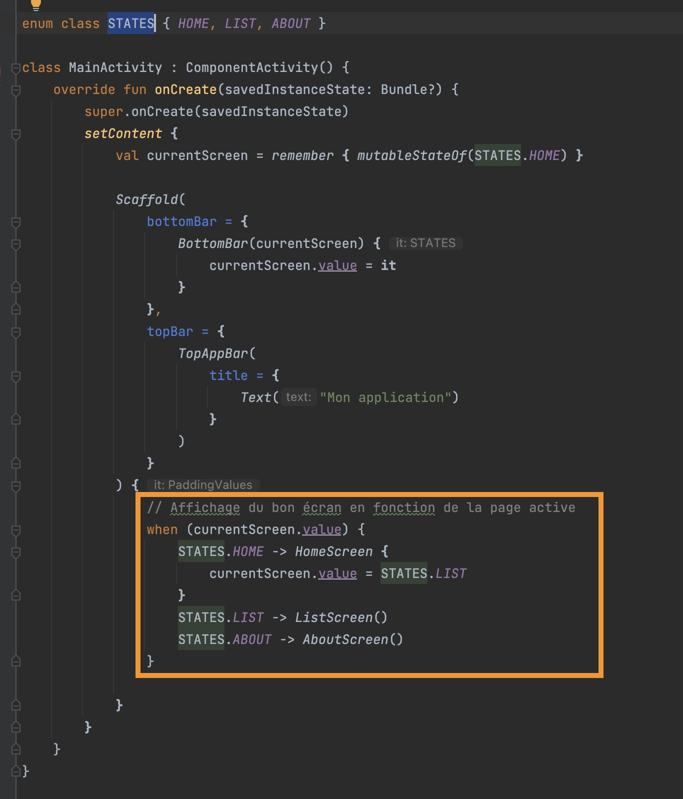

# Android Compose, une liste et une API Rest

Dans cette page vous trouverez un exemple d'application Android utilisant Jetpack Compose et appellant une API Rest.

::: details Table des matières
[[toc]]
:::

::: warning Application d'apprentissage

Cette application est un exemple d'application Android utilisant Jetpack Compose et appelant une API Rest. Elle est destinée à être utilisée comme support de cours.

Dans un vrai projet, il est fortement recommandé d'utiliser une architecture MVVM, et de séparer les composants de l'application en plusieurs modules. Et surtout d'utiliser Jetpack Navigation pour la navigation entre les écrans.

:::

## Présentation

Cette application contient les éléments suivants :

- Une page d'accueil.
- Une page de liste, les données sont récupérées depuis une API (fichier `ApiService.kt`).
- Une page de détail affiche les données de l'élément sélectionné dans la liste.
- Une page à propos affiche des informations sur l'application.

<iframe width="560" height="315" src="https://www.youtube.com/embed/-6sUwt4ZL9k" title="YouTube video player" frameborder="0" allow="accelerometer; autoplay; clipboard-write; encrypted-media; gyroscope; picture-in-picture" allowfullscreen></iframe>

## Prérequis

Pour comprendre cette application, vous devez avoir des notions de :

- [Kotlin](https://kotlinlang.org/)
- [Android](https://developer.android.com/)
- [Jetpack Compose](https://developer.android.com/jetpack/compose)
- Suivi le TP [Android Compose, Une liste](/tp/composants/android.md)

## Récupération du code source

Vous pouvez récupérer le code source de cette application depuis le dépôt GitHub suivant :

- [Code source](https://github.com/c4software/project-compose-api-sample)

## Organisation du code source

Le code source de cette application est organisé de la manière suivante :


- `MainActivity.kt` : Activité principale de l'application.
- `screens/` : Contient les écrans de l'application.
- `screens/HomeScreen.kt` : Écran d'accueil.
- `screens/AboutScreen.kt` : Écran à propos.
- `screens/list/ListScreen.kt` : Écran de liste.
- `screens/list/ListViewModel.kt` : Logique métier de l'écran de liste, ici nous appelons l'API et gérons l'état de la liste (chargement, erreur, données).
- `data/ApiService.kt` : Service d'appel à l'API.
- `data/Enums.kt` : Énums utilisés dans l'application (état de la liste, état de la requête).
- `components/` : Contient les composants utilisés dans l'application.

Ce qu'il faut retenir c'est que nous découpons notre application en 3 parties :

- `screens` : Ce sont les écrans de l'application.
- `components` : Ce sont les composants utilisés dans les différents écrans
- `data` : C'est le code d'accès aux données (API, base de données, etc.)

## Le `ApiService.kt`

Le fichier `ApiService.kt` contient le service d'appel à l'API. Il utilise la librairie [Retrofit](https://square.github.io/retrofit/) pour appeler l'API.

```kotlin
interface ApiService {
    @GET("todos")
    suspend fun getTodos(): List<Todo>
}
```

Ici nous utilisons l'annotation `@GET` pour indiquer que nous faisons un appel `GET` sur l'URL `/todos`. Nous indiquons également que la méthode retourne une liste de `Todo`. 

::: tip Pas de code ?

Et oui, c'est là tout l'intérêt de Retrofit, il génère le code pour nous. Nous n'avons pas à écrire le code pour appeler l'API, il suffit de définir l'interface et de l'utiliser. Magique !

:::

L'autre partie du code est la création de l'instance de `ApiService` :

```kotlin
companion object {
    var apiService: APIService? = null
    fun getInstance(): APIService {
        if (apiService == null) {
            apiService = Retrofit.Builder()
                .baseUrl(BASE_URL)
                .addConverterFactory(GsonConverterFactory.create())
                .build().create(APIService::class.java)
        }
        return apiService!!
    }
}
```

Nous utilisons le pattern `Singleton` pour créer une seule instance de `ApiService`. Nous utilisons également le pattern `Builder` pour créer l'instance de `Retrofit`.

Dans le code ci-dessus nous avons défini une constante `BASE_URL` qui contient l'URL de base de l'API. Nous utilisons cette constante pour définir l'URL de base de l'API. Nous indiquons également que nous utilisons `Gson` pour convertir les données reçues en `Todo`.

C'est ce morceau de code qui nous permet d'appeler l'API **et surtout** qui décodera les données reçues en JSON pour les transformer en `Todo` (dans notre cas).

Par la suite pour récupérer les données de l'API il suffit d'appeler la méthode `getTodos()` :

```kotlin
val todos = ApiService.getInstance().getTodos()
```

::: tip Compliqué ?

Pas tant que ça ! Avec l'habitude, cette gymnastique de créer un service d'appel à une API sera un jeu d'enfant pour vous.

:::

## Les enums

L'enum `LOADING_STATE` est utilisé pour définir l'état du chargement des données :

- `LOADING`: Les données sont en cours de chargement.
- `ERROR`: Une erreur est survenue lors du chargement des données.
- `SUCCESS`: Les données ont été chargées avec succès.

Créer des énums est une bonne pratique pour définir des états. Nous pouvons ensuite utiliser ces énums pour définir l'état de notre application. C'est plus simple à lire et à comprendre que des `Boolean` ou des `Int`.

## Rappel sur les callbacks

En Kotlin un composant peut définir un paramètre de type `() -> Unit` pour définir un callback. Ce callback sera appelé au moment de l'utilisation par l'utilisateur. 

Par exemple, dans le composant, `ListItems` nous avons défini un callback `onItemClicked` :

```kotlin
@Composable
fun ListItem(item: String, onClick: () -> Unit) {
    Row(
        Modifier
            .fillMaxWidth()
            .clickable { onClick() }, verticalAlignment = Alignment.CenterVertically
    ) {
        Text(item, modifier = Modifier.padding(16.dp))
        Spacer(modifier = Modifier.weight(1f))
    }
}
```

Notre paramètre `onClick` est de type `() -> Unit`. Cela signifie que nous pouvons passer une fonction à ce paramètre. Ce qui nous permet de définir une action à effectuer lors du clic sur l'item.

```kotlin
ListItem(item = todo.title) {
    // Action à effectuer lors du clic sur l'item
}
```

::: tip Point syntaxe

Dans l'exemple ci-dessus, nous avons défini une fonction anonyme. Celle-ci est sortie de la liste des paramètres de la fonction `ListItem`. Nous pouvons également définir la fonction anonyme dans la liste des paramètres :

```kotlin
ListItem(item = todo.title, onClick = {
    // Action à effectuer lors du clic sur l'item
})
```

Les deux syntaxes sont correctes. En Kotlin il est préférable d'écrire la première syntaxe. Car elle est plus concise et plus lisible.

:::


## Les tabs (La NavBar)

Dans cette application nous utilisons des tabs (NavBar) pour naviguer entre les écrans. Pour cela nous utilisons le composant `BottomNavigation` de Jetpack Compose.

Ce Composant contient une liste de `BottomNavigationItem` qui correspondent aux différents différents éléments de la NavBar. Chaque élément est associé à un écran. Écrans qui seront affichés lors du clic sur l'élément via le callback `onClick`.


Dans le fichier `MainActivity.kt` nous avons défini une liste d'écrans :

- `STATES`: Correspond à la liste des différents écrans.
- `currentScreen`: Écran actuellement affiché.

Pour afficher le bon écran :



Pour les interactions avec les tabs :


- Le `OnClick` de chaque `BottomNavigationItem` permet de changer l'écran actuellement affiché.
- Le `Selected` de chaque `BottomNavigationItem` permet d'indiquer quel écran est actuellement affiché, et donc de changer l'icône (couleur).

## Conclusion

Dans ce support nous avons vu comment l'architecture d'une application Android avec Jetpack Compose et qui appelle une API. Comme dans le TP précédent, nous nous sommes efforcés de découper notre application en plusieurs parties :

- `screens` : Ce sont les écrans de l'application.
- `components` : Ce sont les composants utilisés dans les différents écrans
- `data` : C'est le code d'accès aux données (API, base de données, etc.)

Cette organisation est vraiment le niveau 0 si vous souhaitez développer des applications maintenables. C'est la base de tout bon développeur Android.

::: tip Et pour la suite ?

Il est bien évidemment possible de découper encore plus notre application. Par exemple, nous pourrions créer un dossier `utils` pour y mettre des fonctions utilitaires. Nous pourrions également créer un dossier `models` pour y mettre les modèles de données utilisés dans l'application.

Il serait également intéressant d'utiliser JetPack Navigation pour gérer les écrans de l'application. Cela permettrait de gérer les transitions entre les écrans : [Jetpack Navigation](https://developer.android.com/guide/navigation/navigation-getting-started)

:::

## Ressources

- <https://developer.android.com/jetpack/compose/architecture>
- [Retrofit](https://square.github.io/retrofit/)
- [Gson](https://github.com/google/gson)
- [Jetpack Navigation](https://developer.android.com/guide/navigation/navigation-getting-started)
- [Le code source de l'application](https://github.com/c4software/project-compose-api-sample)
- [Kotlin](https://kotlinlang.org/)
- [Android](https://developer.android.com/)
- [Jetpack Compose](https://developer.android.com/jetpack/compose)