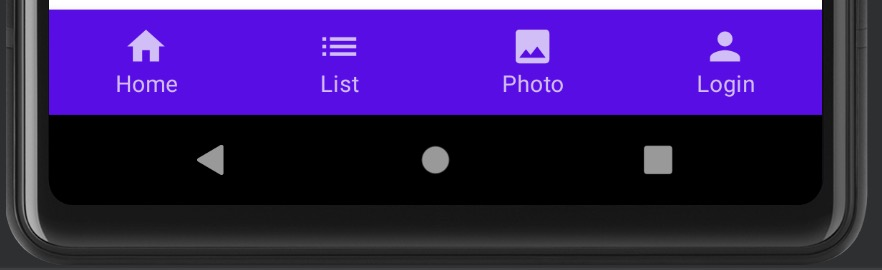
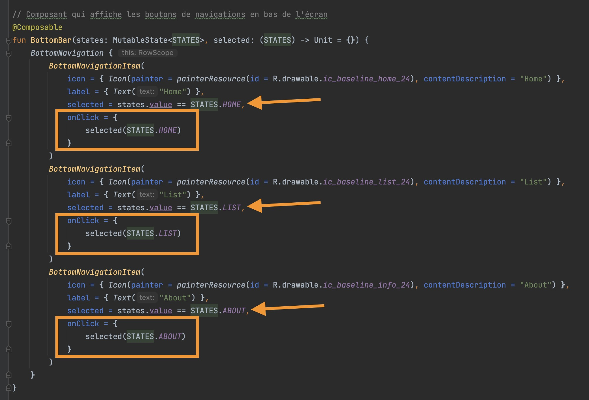

# Android Compose, Une liste et une API Rest

Dans cette page vous trouverez un exemple d'application Android utilisant Jetpack Compose et appellant une API Rest.

::: details Table des matières
[[toc]]
:::

## Présentation

Cette application contient les éléments suivants :

- Une page d'accueil.
- Une page de liste, les données sont récupérées depuis une API (fichier `ApiService.kt`).
- Une page de détail affiche les données de l'élément sélectionné dans la liste.
- Une page à propos affiche des informations sur l'application.

<iframe width="560" height="315" src="https://www.youtube.com/embed/-6sUwt4ZL9k" title="YouTube video player" frameborder="0" allow="accelerometer; autoplay; clipboard-write; encrypted-media; gyroscope; picture-in-picture" allowfullscreen></iframe>

## Prérequis

Pour comprendre cette application, vous devez avoir des notions de :

- [Kotlin](https://kotlinlang.org/)
- [Android](https://developer.android.com/)
- [Jetpack Compose](https://developer.android.com/jetpack/compose)
- Suivi le TP [Android Compose, Une liste](/tp/composants/android.md)

## Récupération du code source

Vous pouvez récupérer le code source de cette application depuis le dépôt GitHub suivant :

- [Code source](https://github.com/c4software/project-compose-api-sample)

## Organisation du code source

Le code source de cette application est organisé de la manière suivante :

- `MainActivity.kt` : Activité principale de l'application.
- `screens/` : Contient les écrans de l'application.
- `screens/HomeScreen.kt` : Écran d'accueil.
- `screens/AboutScreen.kt` : Écran à propos.
- `screens/list/ListScreen.kt` : Écran de liste.
- `screens/list/ListViewModel.kt` : Logique métier de l'écran de liste, ici nous appelons l'API et gérons l'état de la liste (chargement, erreur, données).
- `data/ApiService.kt` : Service d'appel à l'API.
- `data/Enums.kt` : Énums utilisés dans l'application (état de la liste, état de la requête).
- `components/` : Contient les composants utilisés dans l'application.

## Les tabs

Dans cette application nous utilisons les tabs pour naviguer entre les écrans. Pour cela nous utilisons le composant `BottomNavigation` de Jetpack Compose.

Chaque `BottomNavigationItem` est associé à un `Screen` (écran) de l'application.

Dans le fichier `MainActivity.kt` nous avons défini une liste d'écrans :

- `STATES`: Correspond à la liste des différents écrans.
- `currentScreen`: Écran actuellement affiché.

Pour afficher le bon écran :

Pour les interactions avec les tabs :

- Le `OnClick` de chaque `BottomNavigationItem` permet de changer l'écran actuellement affiché.
- Le `Selected` de chaque `BottomNavigationItem` permet d'indiquer quel écran est actuellement affiché, et donc de changer l'icône (couleur).