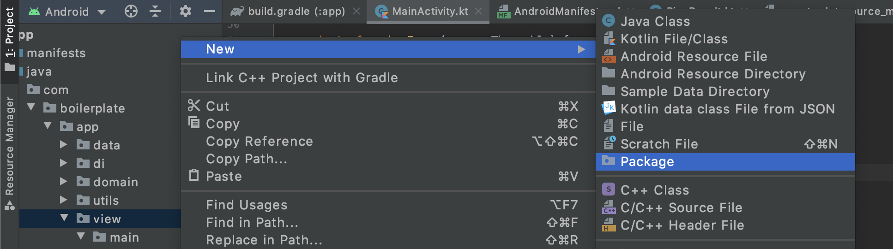
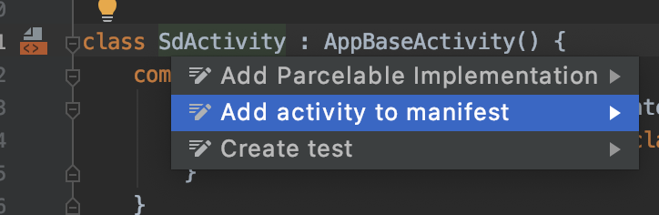

# Explication structure « Android Boilerplate »

Ce document n'est pas un TP, mais une explication de la structure « Android Boilerplate » disponible à l'adresse suivante :

- [Android Boilerplate Koin - Rx - OkHttp](https://github.com/c4software/Android-Boilerplate-Koin-CoRoutines-OkHTTP)

Ce document vous donnera les clés afin de comprendre le fonctionnement et de vous l'approprier.

## But du code

Le but du code fourni sur Github est de simplifier la mise en place d'une base applicative Android « moderne ». Il ne contient aucun code (presque). Il est donc clonnable / téléchargeable et utilisable tel quel, l'idée étant vraiment d'avoir presque un template d'application réutilisable à volonté.

Ceci étant annoncé, passons au détail du fonctionnement.

## Récupérer le code

Pour récupérer le code source, vous avez deux possibilités :

- Le fichier zip en provenance de Github : [À télécharger ici](https://github.com/c4software/Android-Boilerplate-Koin-CoRoutines-OkHTTP/archive/master.zip)
- En clonant le repository : `git clone git@github.com:c4software/Android-Boilerplate-Koin-CoRoutines-OkHTTP.git`

⚠️ Attention, si vous avez choisi de cloner le repository. Pensez bien à supprimer le dossier `.git` à la racine des sources afin de ne pas garder l'historique de mon projet. ⚠️

## Lancer le projet une première fois

Avant d'effectuer des modifications dans le projet, nous allons le lancer une première fois. Pour ça, il suffit d'ouvrir le projet avec Android Studio.


Une fois l'indexation terminée, vous devez pouvoir lancer le projet sur un émulateur ou sur votre téléphone. Ce qui devrait donner quelque chose comme :


## La structure des dossiers

Afin de simplifier l'entrée dans le code, j'ai volontairement limité l'organisation des dossiers au strict minimum. Attention, ça ne veut pas dire que vous ne pouvez pas en créer d'autres pour organiser votre code au mieux.


- `data` : Contiens la définition (interface) de vos sources de données (exemple la définition des appels réseau).
- `di` : La définition des éléments qui sont « injectés ».
- `domain` : Votre code métier, celui qui fait le traitement (soit local, ou alors les appels aux APIs HTTP par exemple)
- `utils` : L'ensemble de vos « helpers » / fonctions que vous vous servez à plusieurs endroits dans votre code.
- `view` : Vos « vues », c'est-à-dire vos différents écrans de votre application.

## MVVM ? Kézako !?

L’acronyme MVVM signifie Modèle Vue Vue-Modèle (Model–view–viewmodel). L'architecture MVVM est « plutôt récente » elle date de 2004, elle est inventée à la base par Microsoft afin de simplifier les problématiques de gestion de l'interface (en utilisant des mécaniques d'évènement)

Elle a récemment été popularisée par certains frameworks JavaScript, car elle permet d'implémenter « simplement » des interfaces avec une réactivité importante.


Cette méthode permet, tel le modèle MVC (modèle-vue-contrôleur), de séparer la vue de la logique et de l'accès aux données en accentuant les principes de liaison et d’évènement.

Il faut donc distinguer _3 parties_ :

- Le modèle : Les données au sens pures (de la data sous forme d'objet), elles peuvent provenir d'API, de base de données, de sources locales.
- La vue : L'affichage utilisé utilisateur, la gestion des clicks… Et _uniquement_ ça, la logique associée à la donnée est effectuée dans le `Vue-Modèle` (via « le bus des évènements »)
- Le Vue-Modèle : Intéragie avec la couche `modèle` et envoi les nouveaux états résultat à la vue (via le « bus des évènements »).

Nous allons, donc devoir définir « des » bus de communication entre le Vue-Modèle et la Vue afin de permettre l'actualisation des données. Cette organisation vous nous permettre une fois en place de ne manipuler essentiellement plus que de la donnée. La vue sera donc « automatiquement » mise à jour, et ce en fonction de l'état de la donnée (exemple les loaders / les mises à jour de liste, etc.)

📖Pour ceux ayant déjà fait du VueJS (ou autre framework JavaScript récent), le découpage est très proche, vous ne serez pas perdu.

## DI ? Injection de dépendances, Koin quelques explications

En introduction j'ai indiqué que mon « Boilerplate » était le strict minimum viable pour un projet… Et bien je vous ai menti ! Mais garder confiance c'est pour votre bien…

Alors, l'injection des dépendances petite définition Wikipedia :

> Il consiste à créer dynamiquement (injecter) les dépendances entre les différents objets en s'appuyant sur une description (fichier de configuration ou métadonnées) ou de manière programmatique. Ainsi les dépendances entre composants logiciels ne sont plus exprimées dans le code de manière statique, mais déterminées dynamiquement à l'exécution.

Pour faire simple, le but est de ne plus avoir à créer des objets dans votre code. Tout est géré « plus haut » afin de centraliser la configuration, la manière dont l'objet est créé, etc.

Quelques avantages à utiliser de l'injection :

- Réduction du code (les créations d'objets sont effectuées qu'une seule fois et injectées automatiquement grâce au typage).
- Réduction de la mémoire, logique moins d'instance d'objet identique créer à plusieurs endroits dans votre code.
- Isolation entre la logique de l'objet et votre code, vous n'êtes qu'un consommateur de fonctionnalités la logique peut-être carrément écrite par quelqu'un d'autre, voir dans certains cas externalisés dans des librairies externes (Kotlin Native par exemple).
- Etc.

### Koin

Dans notre nous allons utiliser la librairie Koin, elle est complètement écrite en Kotlin, elle a comme avantage d'être simple à utiliser avec très peut de code à écrire (et donc à comprendre).

### Concrètement ça ressemble à quoi

```kotlin
val appModule = module {
    // Inject dependencies for the MainViewModel (the only UI in this boilerplate)
    viewModel { MainViewModel(get(), get()) }

    // Sample Remote Data Repository
    single<SampleRemoteRepository>(createdAtStart = true) { SampleRemoteRemoteRepositoryImpl(get()) }

    // Sample Local Data Repository
    single<SampleLocalRepository>(createdAtStart = true) { SampleLocalRepositoryImpl() }
}

val remoteDataSourceModule = module {
    // provided web components
    single { createOkHttpClient() }

    // Fill property
    single { createWebService<SampleRemoteDataSource>(get(), BuildConfig.REMOTE_URI) }
}

val moduleApp = listOf(appModule, remoteDataSourceModule)
```

L'ensemble est, je pense, relativement parlant, mais regardons en détail le `get()`, comme vous pouvez le voir celui-ci est présent un peu partout dans la déclaration de nos éléments à injecter. Ce mot-clé est _magique_ il permet à [Koin](https://insert-koin.io/) de détecter le type de paramètre attendu et d'injecter automatiquement le bon objet.

Par exemple nous indiquons que `createWebService(client: OkHttpClient, url: String)`, automatiquement Koin va chercher dans les objets qu'il connait ceux correspondant à la signature (dans notre cas `single { createOkHttpClient() }`) et `BuildConfig.REMOTE_URI` étant la String attendu.

Dans le cas d'un objet de notre vue, nous avons dans le même principe :

`viewModel { MainViewModel(get(), get()) }` qui représente le View-Modele de notre Activity.

Celui-ci attend deux paramètres :

`MainViewModel(sampleRemoteRepository: SampleRemoteRepository, sampleLocalRepository: SampleLocalRepository)`.

Compliqué ? Pas tellement, avec la pratique ça vous semblera automatique. 😊

## Modifier le package « sample »

Comme vous le savez, sur Android les applications doivent être uniques « de manière cryptographique » une partie du test est basé sur leur package. Nous allons donc faire en sorte de personnaliser le package afin de le rendre unique pour vous et votre téléphone.

<iframe width="560" height="315" src="https://www.youtube.com/embed/3tULbe0wPmU" frameborder="0" allow="accelerometer; autoplay; encrypted-media; gyroscope; picture-in-picture" allowfullscreen></iframe>

## Changer le nom de l'application

Si vous regardez dans votre liste d'application vous allez trouver une application nommée `Boilerplate - Koin - Retrofit`. Pour le changer, c'est simple, il suffit d'éditer le fichier `strings.xml`.

⚠️ En parlant de ce fichier, celui-ci _doit_ contenir l'ensemble de vos textes (et évidemment pas uniquement le nom de votre application).

## Changer la configuration de l'API

Centraliser la configuration dans une application est _essentiel_ au-delà de l'organisation du code, c'est essentiel pour que vous puissiez travailler en équipe, mais également pour reprendre votre code sereinement dans quelques années (eh oui…). Dans notre application la configuration sera centralisée dans le fichier `build.gradle`.

Si vous regardez le fichier en question, vous allez trouver `buildConfigField` cette instruction nous permettra de définir de la configuration propre à l'environnement (Prod, Dev, Staging, etc.). Bref c'est génial !

J'ai donc initialisé dans mon petit Boilerplate `REMOTE_URI` qui sera dans votre code Kotlin l'URL de votre serveur distant.

## Repository ? Kézako !?

Contiens la logique autour de vos données. Elle expose au reste de l'application une API (Interne) permettant de gérer la mise à jour des données.

Cette « brique de code » va permettre d'agréger les différentes sources de données afin d'être utilisable simplement dans vos VueModel (ViewModel).

🛑 N'hésitez pas à découper autant qu'il le faut votre logique dans différents repository 🙏

### LocalRepository ?

Dans le code fourni en exemple, le `Local Repository` « simule » un repository qui accèderait à des données « local » c'est-à-dire dans votre téléphone (mémoire interne par exemple).

### RemoteRepository ?

Dans le code fourni en exemple, le `Remote Repository` « simule » une interaction avec « l'extérieur » de votre téléphone c'est-à-dire dans notre cas `Internet` via un appel d'API via le protocole HTTP.

## Ajouter une nouvelle route d'API distance

Ajouter une nouvelle route d'API à notre projet va se résumer à la modification de quelques fichiers. À premier vu ça peut sembler fastidieux, mais vous allez rapidement voir que ce découpage va nous permettre d'organiser le code au mieux afin de le rendre maintenant dans la durée. Et finalement n'est-ce pas le plus important ?

Je vais prendre un exemple simple, le souhaite ajouter une nouvelle route disponible sur `https://rest.ensembl.org/` dans mon projet. Au hasard la route `/info/rest?content-type=application/json`.

🤔Je rappelle au passage que la finalité est de « Récupérer l'information » du serveur, le faire transiter dans votre code, pour au final l'afficher quelque part dans votre application.

### Déclarer l'appel HTTP dans SampleRemoteDataSource

Déclarer une méthode dans le fichier `sampleRemoteDataSource.kt`, ce fichier est une Interface, qui va « déclarer » l'ensemble des méthodes HTTP appelable dans le code. La déclaration de celles-ci est effectuée via des annotations (symbolisé avec `@`). Dans notre cas le fichier contient actuellement :

```kotlin
@GET("info/ping?content-type=application/json")
@Headers("Content-type: application/json")
suspend fun ping(): PingResult
```

Nous déclarons donc une méthode de type `GET` qui consommera un retour en JSON.

Nous allons ajouter la seconde méthode de la même façon

```kotlin
@GET("info/rest?content-type=application/json")
@Headers("Content-type: application/json")
suspend fun restInfo(): RestResult
```

Vous allez devoir créer une Data Class `RestResult` qui servira à déserialser le retour de l'API. Elle va ressembler à :

```kotlin
data class RestResult(val release: String) {}
```

👀Attention 👀 ranger le fichier dans le bon dossier/package ! À savoir `data/models/RestResult`.

#### Comment ça fonctionne en deux mots ?

Déclarer une méthode dans une Interface pour permettre d'appeler un WebService !? C'est magique ? En réalité tout ça est possible grace à OkHTTP2, Retrofit, et l'injection de dépendance. Pour les curieux, toute la logique est ici `src/main/java/com/boilerplate/app/di/remote_datasource_model.kt`

### Déclarer la méthode dans SampleRemoteRepository

La première étape était la déclaration dans l'interface, c'est chose faite. Maintenant nous allons déclarer notre méthode dans le `Repository`, donc dans la brique qui va appeler la source de données.

Nous allons donc tout simplement :

- Ajouter la déclaration de la méthode dans l'interface `SampleRemoteRepository` nommée infoRest.
- Implémenter la méthode `infoRest` dans `SampleRemoteRemoteRepositoryImpl` afin de pouvoir appeler l'API.

### L'appeler depuis le code

Pour tester (et uniquement pour tester), nous allons appeler la nouvelle méthode depuis la vue principale. La procédure va être relativement simple :

- Ajout d'une méthode dans `MainViewModel.kt`
  - La méthode doit implémenter les states. (Chargement, et retour de la « string reçu »)
- Appeler la méthode déclarée dans le MainViewModel depuis l'activity. (ex `myViewModel.getRestInfomations()`).

Dans l'implémentation actuelle, je vous propose d'afficher un `un Toast` lors de la réception de la donnée.

## Ajouter une nouvelle Activity

Maintenant que nous avons validé que notre code fonctionne, nous allons pouvoir ajouter une nouvelle vue. Nous avons une nouvelle route `infoRest` qui pour l'instant est inutilisée, nous allons créer une vue et le code associé afin d'afficher l'information reçue du serveur.

### Layout

La première étape va être la création de la vue. Pour ça créer un Layout XML comme nous avons déjà pu le voir ensemble.

### Code

Le minimum de code pour que votre activity fonctionne est le suivant :

```kotlin
class YourActivity : AppCompatActivity() {
    companion object {
        fun getStartIntent(ctx: Context): Intent {
            return Intent(ctx, YourActivity::class.java)
        }
    }

    override fun onCreate(savedInstanceState: Bundle?) {
        super.onCreate(savedInstanceState)
        setContentView(R.layout.activity_demo)
    }
}
```

👀 Comme toujours l'organisation du code est une chose très importante, ne placez pas votre classe n'importe où. Mais dans un package dans `view` :



<iframe width="560" height="315" src="https://www.youtube.com/embed/M1RJ1kQg7Hg" frameborder="0" allow="accelerometer; autoplay; encrypted-media; gyroscope; picture-in-picture" allowfullscreen></iframe>

Si vous souhaitez plus de détail, inspirer du code présent dans le `MainActivity.kt` ou dans les exemples que nous avons évoqués pendant le cours.

#### getStartIntent ?

Cette méthode a pour but de simplifier la lecture (et la navigation) entre les vues. Cette méthode est statique, elle sera appelée que vous souhaiterez appeler votre `activity` depuis une autre `vue` / `activity`. Elle retourne une `Intent` qui nous servira à démarrer l'activity souhaitée.

_Exemple :_

```kotlin
    startActivity(MainActivity.getStartIntent(this))
```

Le but également de créer des `getStartIntent` est de simplifier la gestion du passage des paramètres. En effet, sur Android passer des paramètres à une activité se résume à les attacher à l'Intent. Centraliser la déclaration, permet également de centraliser cette logique.

_Exemple :_

```kotlin
companion object {
    const val AGE_DU_CAPITPAINE = "AGE_DU_CAPITPAINE"
    fun getStartIntent(ctx: Context, ageDuCapitaine: Int): Intent {
        return Intent(ctx, MainActivity::class.java).apply {
            putExtra(FROM_HOME, ageDuCapitaine)
        }
    }
}

// Pour récupérer cette valeur.
private fun ageDuCapitaine(): Int = intent.getBooleanExtra(AGE_DU_CAPITPAINE, 33)
```

## Rendre accessible cette vue / activity

Maintenant que cette activity est créée, nous allons devoir la rendre « visible » par Android. Cette étape est relativement simple. Il suffit de laisser faire votre IDE pour lui faire autodéclarer le bon XML dans le fichier `AndroidManifest.xml`.

Si vous souhaitez réaliser cette action à la main. Il suffit d'ajouter « dans / sous » l'élément application :

```xml
    <activity android:name="com.boilerplate.app.view.main.MainActivity">
```

⚠️ Mais sérieusement, ne l'ajoutez pas à la main. Faite plutôt alt entrée sur le nom de votre class dans l'IDE l'action vous sera proposée.



### Créer une home

En suivant le même principe que précédemment, créez une Home avec deux boutons permettant d'accéder à la `MainActivity` et à `InfoRestActivity`.

Petit rappel, pour « attacher » une action de clique sur un bouton :

```kotlin
btnMain.setOnClickListener {
    startActivity(MainActivity.getStartIntent(this))
}

btnInfosRest.setOnClickListener {
    startActivity(InfoRestActivity.getStartIntent(this))
}
```

### Déclarer cette home comme activity principale de votre application

Un certain nombre de paramètres autour des intent est modifiable directement dans `AndroidManifest.xml`, la déclaration de `l'intent` à lancer au démarrage de l'application est faite via :

```xml
<intent-filter>
    <action android:name="android.intent.action.MAIN" />
    <category android:name="android.intent.category.LAUNCHER" />
</intent-filter>
```

Déplacer `l'intent filter` dans bloc correspondant à votre activity.

### Connecter le tout

Votre application contient maintenant 3 activités :

- Une home.
- L'activité permettant de connaitre la version du serveur. `infoRest`
- Une activité permettant de « réaliser des pings ».

Appeler les différends `getStartIntent()` depuis les bonnes vues.

Exemple :

```kotlin
fun startMainActivity(){
    startActivity(MainActivity.getStartIntent(this))
}
```

## Utiliser un Repository depuis une nouvelle activity

Comme indiqué précédemment, nous n'allons pas directement appeler notre `Repository` directement depuis notre `Activity`.

::: tip Petit rappel

Nous allons découper notre logique en différentes parties :

- La logique de la vue va rester dans l'Activity.
- La logique des données de la vue va être mise dans la partie `ViewModel`.
- La logique « de récupération » des données va être mise dans un `Repository`.

:::

Créer un ViewModel pour une `Activity` va se résumer à trois opérations :

- Créer une Class `YourActivityViewModel` et qui extend de `BaseViewModel()`
- Déclarer votre `YourActivityViewModel` dans l'activity en spécifiant que celui-ci sera automatiquement injecté.
- Le déclarer dans l'injecteur de dépendances.

### Création de votre `YourActivityViewModel`

Cette étape est la première, nous allons créer une Class qui contiendra la « logique » des données de la vue, le minimum que doit contenir cette classe est :

```kotlin

class YourActivityViewModel() : BaseViewModel() {
    val states = MutableLiveData<ViewModelState>()

    // Vous déclarerez ici vos méthodes et variables nécessaires
    // au bon fonctionnement de votre application.
}
```

::: tip Vous voulez un exemple « plus grand » ?

Vous avez dans le projet un exemple de `ViewModel` un peu plus complet, c'est le fichier `MainViewModel.kt` il est également [accessible ici](https://raw.githubusercontent.com/c4software/Android-Boilerplate-Koin-CoRoutines-OkHTTP/master/app/src/main/java/com/boilerplate/app/view/main/MainViewModel.kt)

:::

### Déclarer votre ViewModel dans l'activity

Pour ça rien de bien compliqué, il suffit d'ajouter le code suivant :

```kotlin
    private val myViewModel: YourActivityViewModel by viewModel()
```

::: danger Attention
Ne pas mettre le code n'importe où. Nous avons ici un **attribut de class**.
:::

### Déclaration dans l'injecteur de dépendance

Si vous souhaitez que ça fonctionne, vous devez dire à votre code comment le `by viewModel()` va être résolu. Pour ça nous devons indiquer à notre injecteur de dépendance comment créer cette dépendance, cette déclaration est à faire dans le fichier `app_module.kt` (il se trouve dans le package `.di`).

Vous devez donc ajouter dans le `appModule` le code suivant :

```kotlin
    viewModel { YourActivityViewModel() }
```

🤓 Bien évidemment, vous ajoutez le code à la suite du `viewModel` déjà présent 🤓
