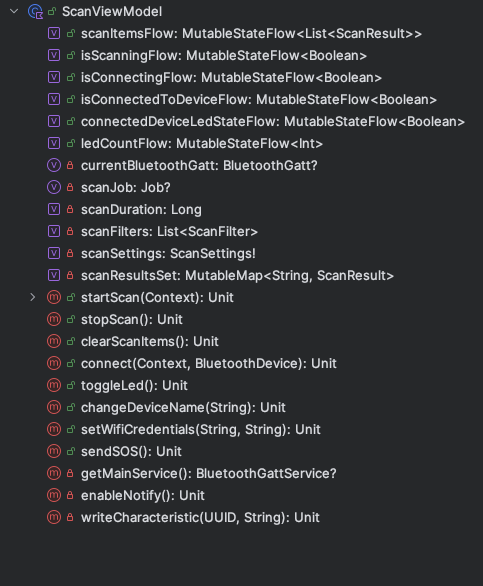
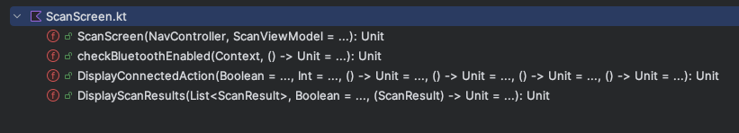

# Télécommande Bluetooth & Réseau

::: details Sommaire
[[toc]]
:::

## Objectif

Concevoir une application qui va :

- Avoir au minimum 3 écrans.
- Scanner les périphériques Bluetooth.
- Connexion à notre « Équipement ».
- Commander la LED / afficher l'état.

::: tip Rappels

L'application que vous réaliserez doit respecter les bonnes pratiques vues en cours. Et cela doit être le reflet de votre travail personnel.

:::

## Rappels des fonctionnalités de l'équipement

L'équipement dispose des caractéristiques suivantes :

- Allumer / éteindre la LED.
- Récupérer l'état de la LED (via une notification BLE).
- Récupérer le nombre de fois que la LED a été allumée et éteinte.
- Récupérer la liste des réseaux WiFi disponibles environnants.
- Changer le nom de l'équipement.
- Allumer ou éteindre la LED en suivant un paterne (1 étant allumé, 0 étant éteint. Alors S.O.S = `1010100011101110111000101010`).
- Définir les informations de connexion au réseau WiFi.
- **Si un réseau Wifi est défini**, lancement d'un serveur sur le port 80 permettant :
  - D'afficher l'état de la LED (`/status`).
  - D'allumer / éteindre la LED (`/toggle`).

## Projet final

Le projet final a pour objectif de réaliser une application Android **propre** et **fonctionnelle**. La thématique est libre, mais doit respecter les contraintes suivantes :

- Gérer correctement les messages d'erreurs (permissions, liste périphérique vide, etc.).
- Ranger / organiser « correctement le code source » dans des packages comme vus précédemment.
- Ne scanner que les équipements compatibles.
- Vider la liste après une connexion (et ne pas avoir de doublons dans la liste).
- Personnaliser l'icône de l'application (mettre le logo de l'école + ampoule).
- L'ensemble des textes **doivent-être** dans le `strings.xml`. Deux langues minimum (français + italien).
- Empêcher la rotation de l'ensemble de l'application (`manifest.xml`).
- Permettre l'allumage / l'extinction de la LED.
- Afficher le nombre de fois que la LED a été allumée / éteinte.
- Implémenter la partie notification BLE.
- Implémenter l'animation de la LED en envoyant une chaîne de caractères du type `1010100011101110111000101010`.
- Bonus: Afficher la liste des réseaux WiFi disponibles.
- Bonus: Changer le nom de l'équipement.
- Bonus: Proposer à l'utilisateur une liste de pattern (S.O.S, etc.) pour animer la LED.
- Bonus: Le réseau WiFi est défini, il est possible d'allumer / éteindre la LED via un accès HTTP.

::: tip Rappel

Le projet est le résultat de votre investissement dans les différentes interventions. Il doit donc respecter les bonnes pratiques vues en cours. Je vous invite à vous dépasser pour réaliser un projet de qualité dans la thématique de votre choix.

**Je ne veux pas récupérer un projet qui ressemble à un copier-coller de ce que j'ai pu vous montrer. Je veux voir votre travail personnel.**

:::

## Les activités

- Home : Logo de l'école (ou de votre choix) + Nom de l'application. Ainsi que les boutons :
  - Scan / Connexion / Action
  - À propos
- Scan : Liste des périphériques trouvés + action de connexion.
- À propos : Informations sur l'application.

## Structure

**À titre d'exemple** voici la structure des méthodes de la partie Scan de mon application.

View Model : 



Composable :



## Le scan

- Création d'une liste pour les résultats du scan.
- Création de plusieurs composables pour les différents cas
- Ajout des permissions.
- Ajout du code « de scan Bluetooth ».
- Gestion des cas d'erreurs.

### La classe LocalPreferences ?

Cette classe va nous permettre de sauvegarder de manière « persistant » des paramètres.

Pour l'instant nous allons sauvegarder le nom du dernier périphérique connecté.

```kotlin

import android.content.Context
import android.content.SharedPreferences

class LocalPreferences private constructor(context: Context) {
    private val sharedPreferences: SharedPreferences = context.getSharedPreferences("MyPref", Context.MODE_PRIVATE)

    fun lastConnectedDeviceName(deviceName: String?) {
        sharedPreferences.edit().putString("selectedDevice", deviceName).apply()
    }

    fun lastConnectedDeviceName(): String? {
        return sharedPreferences.getString("selectedDevice", null)
    }

    companion object {
        private var INSTANCE: LocalPreferences? = null

        fun getInstance(context: Context): LocalPreferences {
            return INSTANCE?.let {
                INSTANCE
            } ?: run {
                INSTANCE = LocalPreferences(context)
                return INSTANCE!!
            }
        }
    }
}
```


### La commande via HTTP

La carte ESP32 dispose d'un serveur HTTP. Celui-ci ne sera actif que si vous envoyez une trame de configuration WiFi.

Une fois connecté au réseau WiFi, votre ESP32 expose 2 endpoints :

- `/status` : Permet de récupérer l'état de la LED (`{state: "ON", count: 0}` ou `{state: "OFF", count: 0}`).
- `/toggle` : Permet de changer l'état de la LED (`{state: "ON", count: 0}` ou `{state: "OFF", count: 0}`).

Pour appeler ces endpoints, vous pouvez utiliser la librairie `OkHttp` ou `Retrofit`. Nous pouvons en discuter ensemble si vous avez des questions, vous avez à votre disposition [la documentation ici](./network.md)

### Fourniture des sources

Votre code doit être disponible sur un dépôt Git (GitHub, GitLab, Bitbucket, etc.). Vous devez fournir l'URL de votre dépôt dans le formulaire ci-dessous. 

[Partage du projet](https://docs.google.com/forms/d/e/1FAIpQLScZ5WflYVlnNzQlwYwdJsCc9izqthZJT9zVQK6HWsypgb06Bg/viewform)

⚠️ N'oubliez pas de mettre votre nom et prénom dans le formulaire.

Bravo, vous avez terminé le projet ! 🎉

::: tip Rappel

L'intégration de Git dans Android Studio est très simple. Celle-ci est disponible dans le menu `VCS` de la barre de menu, elle vous permettra de réaliser l'ensemble des opérations de base sur votre dépôt Git.

Vous avez un doute ? N'hésitez pas à me demander de l'aide :).

:::