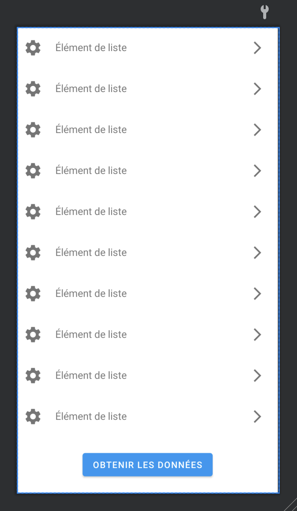

# Appeler une API simplement

Appeler une API peut-être intimidant, par le passé il était « en effet compliqué » de faire des appels réseaux. En effet afin de s'assurer que votre application soit de qualité quelques règles sont imposées par la plateforme Android :

- Pas d'appel réseau depuis le `UIThread`.
- Pas de manipulation de l'interface depuis le `IOThread`.

::: tip Petit rappel Wikipedia
Un thread ou fil (d'exécution) ou tâche (terme et définition normalisée par ISO/CEI 2382-7:2000 ; autres appellations connues : processus léger, fil d'instruction, processus allégé, exétron, voire unité d'exécution1 ou unité de traitement2,3[réf. nécessaire]) est similaire à un processus, car tous deux représentent l'exécution d'un ensemble d'instructions du langage machine d'un processeur. Du point de vue de l'utilisateur, ces exécutions semblent se dérouler en parallèle.
:::

::: details Sommaire
[[toc]]
:::

## Pourquoi est-ce complexe ?

Internet est une variable incontrôlable dans un projet Android, vous n'êtes pas certains que :

- Votre utilisateur possède du réseau.
- Que celui-ci soit rapide.
- Que votre serveur ne soit pas surchargé.
- Que votre serveur soit rapide.

C'est pour l'ensemble de ces raisons que le code qui repose sur un appel réseau peut faire peur ! Mais vous allez le voir avec Kotlin, et les librairies de qualités à notre disposition un appel réseau sera aussi simple qu'une « `setOnClickListener` »

## Travailler intelligemment

Nous allons travailler avec de la logique, nous sommes dans un langage-objet, nous allons utiliser la puissance de l'objet, et des techniques modernes pour faire des appels réseaux sans nous prendre la tête :

- Les interfaces pour définir nos « endpoints » d'API (comprendre les liens que nous allons devoir appeler).
- L'utilisation d'objet pour « décoder » les réponses du serveur (au format JSON)
- Les coroutines pour le multithread. (`UiThread` `IOThread`)
- Les scopes pour manipuler la vue après l'obtention des données (`runOnUiThread { … }`)

Beaucoup de problématiques seront résolues par des librairies standards dans le monde d'Android.

## Les librairies

Les librairies en question sont à ajouter dans votre fichier `Gradle`, nous allons avoir besoin de :

- OkHttp
- GSON
- Retrofit
- CoRoutines Kotlin

---

### Les permissinos

Pour accéder à Internet, il faut ajouter une permission, celle-ci autorisera à votre application l'accès à Internet. Aucune confirmation utilisateur ne sera demandée.

```xml
    <uses-permission android:name="android.permission.INTERNET" />
```

### La configuration

Vous pouvez, **si vous le souhaitez**, ajouter dans votre `Build.gradle` (app) le domaine de votre API dans le block `defaultConfig`, exemple

```txt
    buildConfigField "String", "URI_REMOTE_SERVER", "\"http://IP.DU.ESP\""
```

### Les CoRoutines Kotlin

- Gestion automatique des threads
- Traitement asynchrone des tâches
- Un mot magique… `suspend`

::: tip suspend ?
Les coroutines sont dites « suspendable », elles vont pouvoir donc attendre que le réseau donne sa réponse pour réveiller le traitement. Pour nous ça va indiquer que notre code sera appelé « plus tard » au moment où le contenu sera disponible.

Magique ? Non pas vraiment, mais pratique ça c'est certains. En tout cas, ce mot-clé est très pratique il nous simplifiera très grandement la partie appel HTTP en retirant toute la partie `enqueue` que vous avez peut-être déjà croisé sur Internet.
:::

[Plus d'informations](https://kotlinlang.org/docs/coroutines-overview.html)

### OkHttp

Client HTTP permettant de :

- RestClient
- Http2
- Gestion du cache
- Intercepteur de requête

### GSON

Cette librairie va nous permettre la Sérialisation / Deserialisation automatique entre un JSON et un Objet Java / Kotlin

### Retrofit

Surcouche à OkHttp permettant de simplifier toute la partie des appels réseaux :

- Une API Http qui s'utilise comme une « Interface ».
- Conversion de données (mapping automatique des objets 🚀).
- Utilise des annotations (@GET, @POST, @PUT, @DELETE, @HEAD, …)
- Compatible CoRoutine (mais également sans)

```groovy
implementation 'org.jetbrains.kotlinx:kotlinx-coroutines-core:1.6.4'
implementation 'org.jetbrains.kotlinx:kotlinx-coroutines-android:1.6.4'

implementation 'com.squareup.retrofit2:retrofit:2.9.0'
implementation 'com.squareup.retrofit2:converter-gson:2.9.0'
implementation 'com.squareup.okhttp3:okhttp:4.9.3'
implementation 'com.squareup.okhttp3:logging-interceptor:4.9.3'
```

::: tip
Une fois ajouté, n'oubliez pas le sync

:::

Notre projet est maintenant prêt pour faire des appels réseau. Nous allons écrire le code « minimum » permettant de réaliser les appels.

## Définir les modèles de retour

La première étape et certainement la plus importante, c'est la définition des modèles de retour de votre API. En tant que débutant vous négligez souvent cette partie-là du travail. C'est pourtant l'un des éléments les plus importants. Pour l'exemple, je vais prendre un retour d'API tels que :

```json
[
  {
    "id": 22,
    "name": "Valentin Brosseau",
    "content": "Ceci est un retour d'API d'exemple",
    "done": true
  },
  {
    "id": 23,
    "name": "John Doe",
    "content": "Random data",
    "done": false
  }
]
```

Le format JSON est simple à lire, vous l'avez certainement croisé, mais dans l'exemple précédent nous avons donc :

- Un tableau (identifiable par la notation `[]`).
- Une structure `Objet`, qui contient `4 propriétés` (id, name, content, done).

Nous allons donc avoir une définition en Kotlin qui va ressembler à :

::: warning Un instant
Le code que vous allez voir, est là juste pour illustrer il ne fonctionne pas directement. C'est juste une « traduction objet » de la structure JSON précédemment proposée.
:::

```kotlin

// Objet présent dans la liste (structure objet)
data class SampleObject (var id : Int, var name : String, var content : String, var done : Boolean)

// Données fourni par l'API
Array<SampleObject>
```

::: tip ET C'EST TOUT
Cette étape que vous négligez souvent est aussi simple que ça…
:::

## Le code permettant de créer l'API

Nous avons maintenant notre objet de retour, nous allons pouvoir attaquer la partie qui nous intéresse le plus la partie appel HTTP. Vous allez le voir grâce à OkHTTP, Gson et Retrofit cette partie-là sera très simple. D'ailleurs, elle est assez répétitive une fois que vous en avez fait une vous en avez fait des centaines.

Nous allons donc déclarer une `Interface` cette interface va décrire les appels HTTP :

- Les liens.
- Le type (GET, POST, …).
- Les paramètres.
- Et surtout le format de retour que vous souhaitez.

Plutôt que des grandes explications, voilà un exemple de comment ça fonctionne.

```kotlin
/**
 * ApiService
 */
interface ApiService {

    // Début définition des différentes API disponible sur votre serveur
    @GET("/status")
    suspend fun readStatus(@Query("identifier") identifier: String): Array<SampleObject>

    @POST("/status")
    suspend fun writeStatus(@Body status: SampleObject): Array<SampleObject>
    // Fin de la définition

    // Équivalenent en kotlin d'élément « static »
    companion object {
        /**
         * Création d'un singleton pour la simplicité, mais normalement nous utilisons plutôt un
         * injecteur de dépendances.
         */
        val instance = build()

        /**
         * Création de l'objet qui nous permettra de faire les appels d'API
         */
        private fun build(): ApiService {
            val gson = GsonBuilder().create() // JSON deserializer/serializer

            // Create the OkHttp Instance
            val okHttpClient = OkHttpClient.Builder()
                .readTimeout(30, TimeUnit.SECONDS)
                .writeTimeout(30, TimeUnit.SECONDS)
                .addInterceptor(HttpLoggingInterceptor().setLevel(if (BuildConfig.DEBUG) HttpLoggingInterceptor.Level.BODY else HttpLoggingInterceptor.Level.NONE))
                .addInterceptor(Interceptor { chain: Interceptor.Chain ->
                    val request = chain.request().newBuilder().addHeader("Accept", "application/json").build()
                    chain.proceed(request)
                })
                .build()

            return Retrofit.Builder()
                .baseUrl("https://le.lien.de.votre.api") // Mieux -> BuildConfig.URI_REMOTE_SERVER, oui oui écrire en dur un lien est une TRÈS MAUVAISE IDÉE !
                .client(okHttpClient)
                .addConverterFactory(GsonConverterFactory.create(gson))
                .build()
                .create(ApiService::class.java)
        }
    }
}
```

::: tip Oui c'est tout
Cette Interface contient l'ensemble de la logique nécessaire. Le reste, ça va être votre code « permettant d'utiliser l'API ». Et c'est là le grand avantage de cette stack applicative.

Vous allez donc consommer de la donnée dans des types « natifs » comme si vos données étaient en locale, le tout typer. La Rolls donc 👌
:::

::: danger N'oubliez pas la structure
Ici je me concentre sur le code et pas sur l'organisation. Bien évidemment, dans votre vrai code vous rangerez correctement cette Interface.

Dans par exemple un package `remote.http`.

🚀 C'est important ne le négligez pas 🚀
:::

## Appeler votre API

Nous y sommes, enfin ! Voilà l'étape que vous attendiez… Comment appeler l'API depuis votre `activity`… Vous allez voir ça va encore être trèèèès simple !

Pour l'exemple voilà notre Interface :



```kotlin
    override fun onCreate(savedInstanceState: Bundle?) {
        // Votre code de d'habitude…

        findViewById<Button>(R.id.httpButton).setOnClickListener{
            CoroutineScope(Dispatchers.IO).launch {
                runCatching {
                    val arrStatus = ApiService.instance.readStatus(ledStatus.identifier)

                    runOnUiThread{
                        dataSource.addAll(arrStatus)
                        Toast.makeText(this@YourActivity, "Résultat de l'appel réseau" + arrStatus.size, Toast.LENGTH_SHORT).show()
                    }
                }
            }
        }
    }
```

Détaillons le code, nous avons une partie de votre `onCreate`, pour l'instant aucun changement.

La partie qui vous intéresse est la suivante, pour que celle-ci soit compréhensible là voilà documenté.

```kotlin
// Démarrage d'une coroutine sur le thread IO celui permettant de faire un appel réseau.
// Si vous êtes sur le UI l'application plantera instantanément (car c'est interdit, vous risquez de freezer l'interface le temps de la réponse du serveur)
CoroutineScope(Dispatchers.IO).launch {
    runCatching {

        // « Le Scope » présent ici est capable de s'arrêter et de se réveiller en fonction d'action extérieur, dans notre cas, il va être actif au moment de la demande « de la ressource » réseau.

        // On appel le code généré par « Retrofit », en suivant la définition de votre interface.
        // Nous allons donc ici avoir en retour un tableau de « SampleObject »
        val arrStatus = ApiService.instance.readStatus(ledStatus.identifier)

        // Puis il sera réveillé au moment de la réponse du serveur pour afficher les données
        runOnUiThread{
            // runOnUiThread indique que le code sera exécuté dans le contexte de l'UI, c'est-à-dire dans le bon thread.
            // ATTENTION si vous oubliez le runOnUiThread la manipulation de votre vue sera impossible ! Et votre application plantera.
            dataSource.addAll(arrStatus)
            Toast.makeText(this@YourActivity, "Résultat de l'appel réseau" + arrStatus.size, Toast.LENGTH_SHORT).show()
        }
    }
}
```

Et voilà ! C'est fini, votre application est maintenant capable de faire des appels réseau.

## À faire

Maintenant que nous avons vu la théorie, je vous laisse implémenter la consigne suivante :

- L'API à appeler est la suivante : https://reqres.in/api/users
- Vous devez créer une activity qui affichera le contenu retourné par l'API
- Vous devez définir des modèles correspondant au retour.
- Vous devez organiser votre code en package.
- Vous devez utiliser un RecyclerView (Natif, ou librairie type Recyclical)

::: details En panne d'inspiration ?
[Voilà un exemple de code pour répondre à la consigne](https://github.com/c4software/android-api-course-project)
:::
