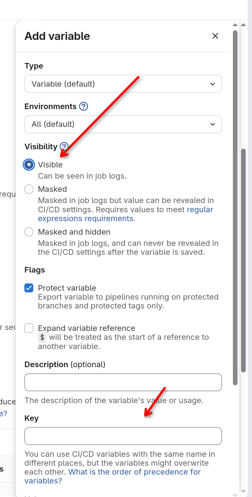
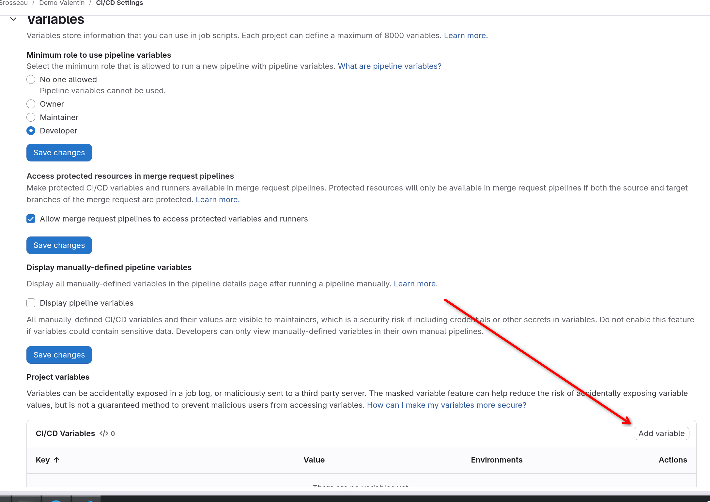
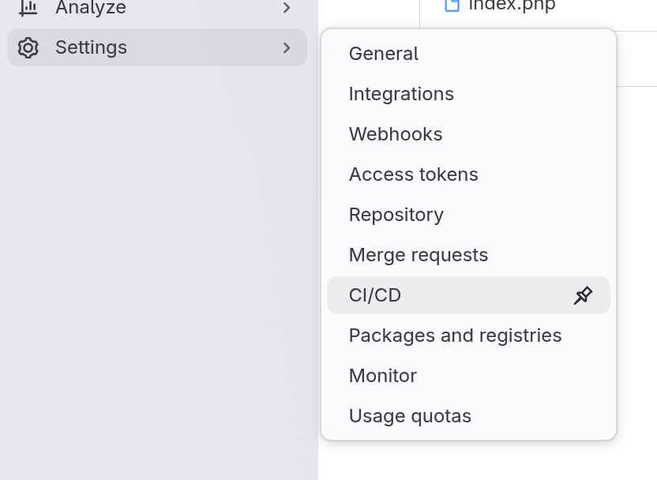

# Déployer en continu un site internet avec Gitlab-CI

::: details Sommaire
[[toc]]
:::

## Introduction

Dans ce TP nous allons voir comment mettre simplement en place un déploiement continu pour un site internet. Nous allons utiliser Gitlab-CI pour effectuer l'automatisation du déploiement du code source de notre site internet.

## Rappel sur Gitlab-CI

Gitlab-CI est un outil d’intégration continue, il permet d’automatiser des tâches à chaque fois que vous poussez du code sur votre dépôt Git. Par exemple, à chaque fois que vous poussez du code, Gitlab-CI peut automatiquement lancer des tests unitaires, ou encore compiler votre application.

## Prérequis

Pour suivre ce TP, vous devez avoir un projet Gitlab avec un dépôt Git. Vous devez également avoir un site internet à déployer, pour cela vous pouvez utiliser n’importe quel site internet, ou même en créer un simple avec du HTML et du CSS.

- Avoir le code source de votre site internet dans un dépôt Gitlab.
- Avoir un serveur web sur la ferme (ou autre du moment qu'il est accessible depuis Gitlab) pour héberger votre site internet.
- Avoir compris le principe d'échange de clés SSH pour permettre à Gitlab de se connecter à votre serveur web ([voir ce TP](/cheatsheets/ssh-key/)).

## Mise en place de Gitlab-CI

Dans ce TP / TD / Fiche de procédure, je vais directement vous donner le contenu du fichier `.gitlab-ci.yml` à mettre à la racine de votre dépôt Gitlab. Ce fichier va contenir les instructions pour Gitlab-CI afin de déployer votre site internet à chaque fois que vous poussez du code.

```yaml
stages:
  - deploy

deploy:
  image: alpine:latest
  stage: deploy
  only:
    - main
  before_script:
    - apk update
    - apk add openssh-client
    - install -m 600 -D /dev/null ~/.ssh/id_rsa
    - echo "$SSH_PRIVATE_KEY" | base64 -d > ~/.ssh/id_rsa
    - ssh-keyscan -H $SSH_HOST > ~/.ssh/known_hosts
  script:
    - ssh $SSH_USER@$SSH_HOST "cd $WORK_DIR && git pull && exit"
  after_script:
    - rm -rf ~/.ssh
```

::: tip Qu'avons nous ici ?

- `stages` : Nous définissons les différentes étapes de notre pipeline, ici nous n'avons qu'une seule étape qui est le déploiement.
- `deploy` : C'est le nom de notre job, il peut être n'importe quel nom que vous souhaitez.
- `image` : Nous utilisons une image Docker légère basée sur Alpine Linux, qui contient les outils nécessaires pour se connecter à notre serveur web via SSH.
- `only` : Nous spécifions que ce job ne doit être exécuté que lorsque nous poussons du code sur la branche `main`.
- `before_script` : Avant d'exécuter le script de déploiement, nous installons les outils nécessaires pour se connecter à notre serveur web via SSH, et nous configurons la clé SSH pour permettre à Gitlab de se connecter à notre serveur web.
- `script` : C'est la partie où nous exécutons les commandes pour déployer notre site internet. Ici, nous nous connectons à notre serveur web via SSH et nous exécutons la commande `git pull` pour récupérer les dernières modifications du code source de notre site internet.
- `after_script` : Après l'exécution du script de déploiement, nous supprimons la configuration SSH pour des raisons de sécurité.

:::

## Deux niveaux de clef

Nous avons besoin de deux clefs SSH pour que ce déploiement fonctionne :

- Autoriser votre serveur à se connecter à votre dépôt Gitlab pour récupérer le code source de votre site internet. (il faut donc créer une clef SSH **sur votre serveur web** et ajouter la clé publique dans les clés SSH de votre projet Gitlab).
- Autoriser Gitlab à se connecter en SSH à votre serveur Web (depuis la CI), pour ça nous allons avoir devoir créer des variables dans gitlab pour stocker la clé SSH privée, l'hôte SSH, l'utilisateur SSH et le répertoire de travail sur le serveur web.

## Initialiser le dépôt Gitlab sur votre serveur web

La première étape est d'avoir votre serveur complètement prêt à recevoir votre site :

- Avoir un serveur Web avec un virtual host configuré pour héberger votre site internet.
- Avoir git d'installé sur votre serveur web.
- Avoir cloné votre dépôt Gitlab sur votre serveur web par exemple `/var/www/html/votreSite`.

::: tip Comment cloner votre dépôt Gitlab sur votre serveur web ?

Pour cloner votre dépôt Gitlab sur votre serveur web, vous devez d'abord créer une clef SSH sur votre serveur web et ajouter la clé publique dans les clés SSH de votre projet Gitlab. Ensuite vous pourrez cloner votre dépôt Gitlab sur votre serveur web.

:::

## Comprendre le fonctionnement

Si vous avez bien observé le contenu du fichier `.gitlab-ci.yml`, vous avez peut-être remarqué que nous utilisons des variables d'environnement pour stocker des informations sensibles telles que la clé SSH privée, l'hôte SSH, l'utilisateur SSH et le répertoire de travail sur le serveur web.

Ces variables d'environnement sont définies dans les paramètres de votre projet Gitlab, et elles sont utilisées dans le script de déploiement pour se connecter à votre serveur web et déployer votre site internet.

Voici les variables à définir :

- `SSH_PRIVATE_KEY` : La clé SSH privée que Gitlab utilisera pour se connecter à votre serveur web. Cette clé doit être encodée en base64 avant d'être ajoutée à Gitlab.
- `SSH_HOST` : L'adresse IP ou le nom de domaine de votre serveur web.
- `SSH_USER` : Le nom d'utilisateur que Gitlab utilisera pour se connecter à votre serveur web.
- `WORK_DIR` : Le répertoire de travail sur votre serveur web où votre site internet est hébergé.





## La clef SSH d'accès à votre serveur web

Votre serveur contient déjà une clef SSH, la votre, celle que vous utilisez pour vous connecter à votre serveur. Nous allons créer maintenant une clef SSH privée spécialement pour Gitlab-CI, afin de ne pas compromettre la sécurité de votre serveur web.

Pour créer une nouvelle clef SSH privée, **sur votre ordinateur** :

```bash
ssh-keygen -t rsa -b 4096 -C "gitlab-ci" -f gitlab_ci_key
```

**Attention** : Ne pas ajouter de passphrase lors de la création de la clef SSH, sinon Gitlab-CI ne pourra pas se connecter à votre serveur web.
**Attention 2** : La clef SSH sera sauvegardée dans le répertoire où vous avez exécuté la commande, assurez-vous de vous trouver dans un répertoire sécurisé avant de créer la clef SSH.

Cette commande va créer une nouvelle paire de clés SSH, avec le nom `gitlab_ci_key` pour la clé privée et `gitlab_ci_key.pub` pour la clé publique.

Nous allons maintenant ajouter cette clef sur votre serveur en utilisant la commande suivante :

```bash
ssh-copy-id -i gitlab_ci_key.pub <votre_utilisateur>@<ip.de.votre.serveur>
```

::: details Vous avez fermé l'accès par mot de passe sur votre serveur web ?

Si vous avez fermé l'accès par mot de passe sur votre serveur web, vous ne pourrez pas utiliser la commande `ssh-copy-id` pour ajouter la clé publique sur votre serveur web. Dans ce cas, vous devrez ajouter manuellement la clé publique dans le fichier `~/.ssh/authorized_keys` de votre utilisateur sur votre serveur web.

:::

Maintenant que nous avons ajouté la clé publique sur notre serveur web, nous allons encoder la clé privée en base64 pour pouvoir l'ajouter à Gitlab. Voici la commande pour l'avoir en base64 :

```bash
base64 -w 0 gitlab_ci_key
```

Cette commande va encoder la clé privée en base64 et afficher le résultat dans la console. Vous pouvez ensuite copier ce résultat et l'ajouter à Gitlab dans les variables d'environnement.

Pour les autres variables d'environnement :

- `SSH_HOST` : L'adresse IP de votre serveur web.
- `SSH_USER` : Le nom d'utilisateur que vous utilisez pour vous connecter à votre serveur web.
- `WORK_DIR` : Le répertoire de travail sur votre serveur web où votre site internet est hébergé, par exemple `/var/www/html/votreSite`.

## Et maintenant ?

Et bien, maintenant, si vous avez tout bien configuré, à chaque fois que vous pousserez du code sur la branche `main` de votre dépôt Gitlab, Gitlab-CI va automatiquement se connecter à votre serveur web et déployer votre site internet en exécutant la commande `git pull` dans le répertoire de travail que vous avez spécifié.

## Conclusion

Dans ce TP, nous avons vu comment mettre en place un déploiement continu pour un site internet en utilisant Gitlab-CI. Nous avons vu comment configurer Gitlab-CI pour se connecter à notre serveur web via SSH et déployer notre site internet à chaque fois que nous poussons du code sur la branche `main` de notre dépôt Gitlab.

Cette méthode de déploiement continu est très simple à mettre en place et peut être utilisée pour n'importe quel site internet, que ce soit un site statique ou un site dynamique. Elle permet d'automatiser le processus de déploiement et de s'assurer que votre site internet est toujours à jour avec les dernières modifications du code source.

Elle est évidemment très basique, et il existe de nombreuses autres méthodes pour mettre en place un déploiement continu plus avancé, mais cette méthode est un bon point de départ pour comprendre les concepts de base du déploiement continu avec Gitlab-CI. Qui ne sont finalement que des automatisations de commandes que vous pourriez exécuter manuellement pour déployer votre site internet.
