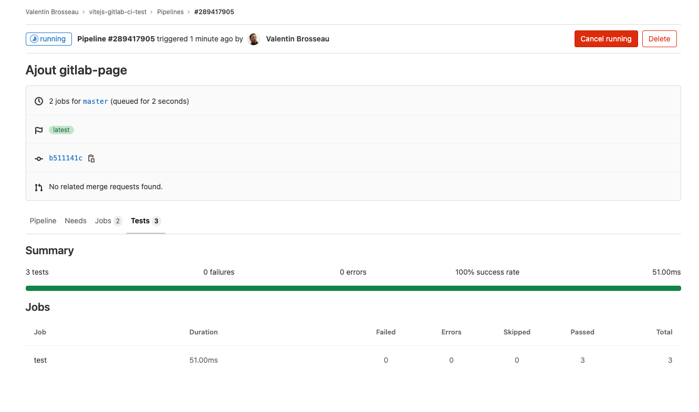

# Tester en continu

L'autre gros avantage d'une stack d'intégration continue c'est la partie « test en continu ». Actuellement il y a fort à parier que vous avez appris que vous pouviez tester vos projets pour garantir la bonne qualité du code que vous produisez, mais également vous assurer de la non-régression.

L'intégration Continue (CI) va nous permettre justement de tester cette non-régression au fur et à mesure du projet. Ce TP va nous permettre de mettre en place la stack permettant de tester votre projet. Je vais illustrer la problématique avec deux langages, PHP et JavaScript mais sachez que ce que nous allons voir ici fonctionnera avec **n'importe quel langage de programmation**.

Je ne vais pas me concentrer ici sur la partie écriture des tests (car la question n'est pas ici). Si vous avez déjà écrits des tests vous vous êtes peut-être déjà demandé « Pourquoi ? », en effet quand on apprend à écrire des tests on s'intéresse souvent qu'aux tests et pas à quand les tests vont s'exécuter… Et bien c'est maintenant !

## Les tests et le JavaScript

Comme en PHP il est possible de tester votre code JavaScript pour s'assurer que celui-ci ne connaisse pas de régression ou tout simplement ne perde pas en qualité au fur et à mesure des dévoloppement.

L'idée ici n'est pas de voir comment vous devez écrire des tests en JavaScript, l'idée est plutôt de voir comment les tests vont s'intégrer dans notre flow de développement. Pour illustrer, je vais utiliser Gitlab-CI (car je trouve la plateforme bien faite, et gratuite).

- La première étape va être la récupération du projet d'exemple. [Celui-ci est disponible ici](/sample/vite-project-with-test.zip)
- Nous avons notre projet « préconfiguré », **avant de continuer je vous laisse le tester sur votre machine**.
- Pour activer la partie CI il suffit de créer un fichier `gitlab-ci.yml`. Voilà le contenu.

```yml
before_script:
  - npm install

test:
  image: node:latest
  stage: test
  script:
    - npm run test:unit
  artifacts:
    when: always
    reports:
      junit:
        - junit.xml
```

C'est à vous, je vous laisse créer le :

- Le projet sur Gitlab
- Tester.
- Ajouter le fichier `.gitlab-ci.yml`
- Le push vers Gitlab.

Une fois correctement configuré vous devriez voir :



::: tip Nous avons ici les résultats
Pour chaque Pipelines nous allons donc avoir le résultat des tests. Si un test échoue l'ensemble du processus de CI/CD va être arrêté pour ne pas déployer un site qui ne fonctionnerait potentiellement plus.
:::

## Modifier les tests

Je vous laisse modifier un peu les tests pour tester le fonctionnement :

- Ajouter un nouveau test.
- Modifier un test.
- « Rendre un test » non valide.

C'est à vous ! Je suis là si vous avez des questions.

## Intégrer le test dans un flow CI/CD entier

Nous avons vu comment les tests pouvaient être ajoutés dans votre processus de développement, mais en général nous n'avons pas que les tests dans un projet ! Avec Gitlab-CI il va être très simple d'ajouter par exemple Gitlab-Page pour livrer en continu votre site internet.

Je vous laisse reprendre le [TP Gitlab Page pour intégrer la partie « pages ».](../pages.md#deployer-un-site-vuejs)


::: details Un peu d'aide? Bloqué ?

Vous avez vraiment cherché ? Si oui voilà une solution possible.

```yml
pages:
  image: node:latest
  stage: deploy
  script:
    - npm run gitlab
    - mv public public-vue
    - mv dist public
  artifacts:
    paths:
      - public
  only:
    - master
```

Je vous laisse chercher ou l'ajouter.
:::
