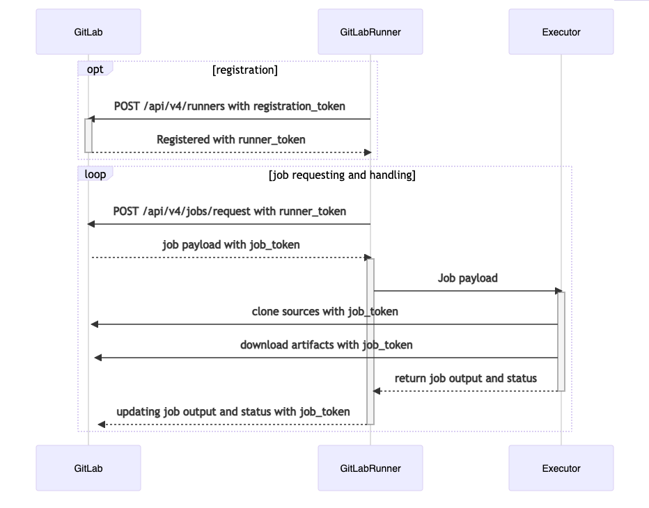
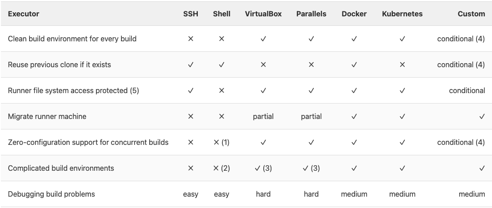
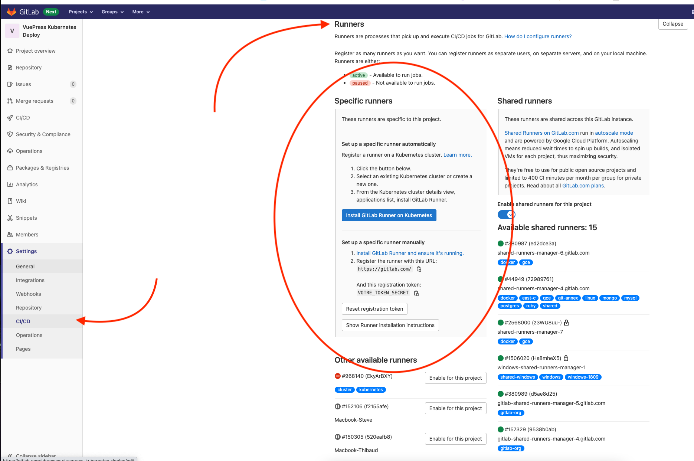
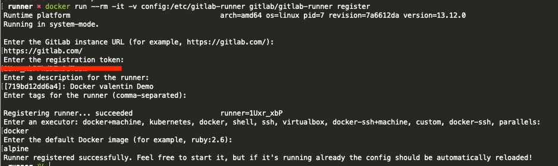
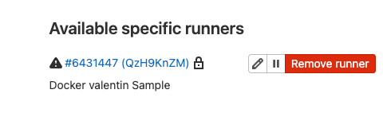
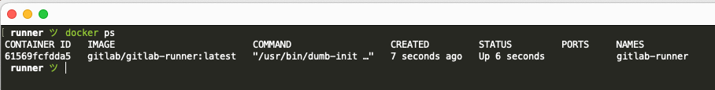
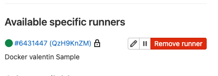
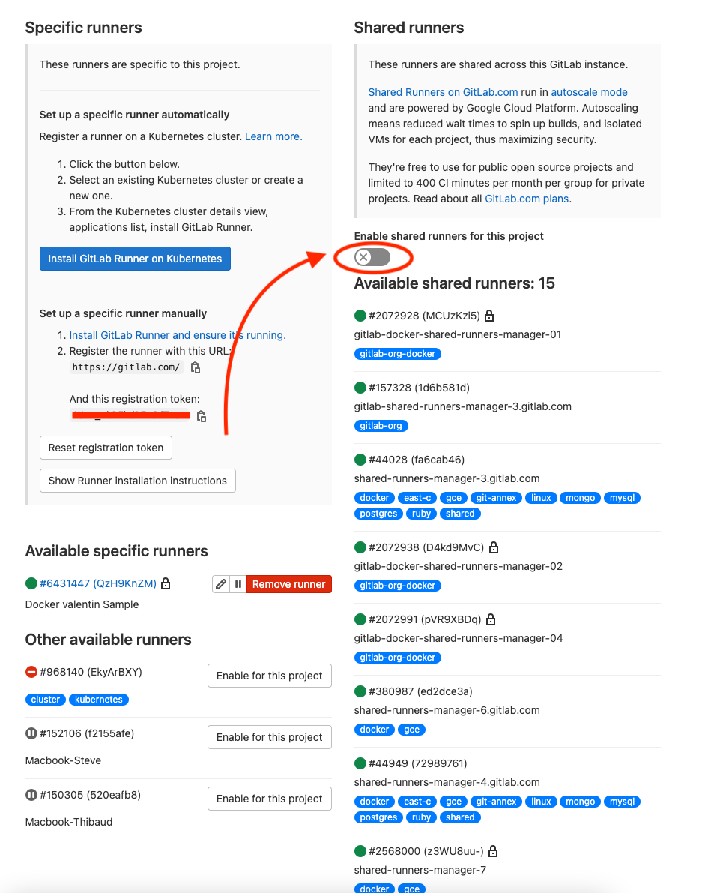
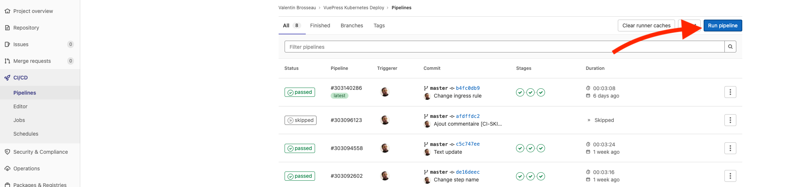
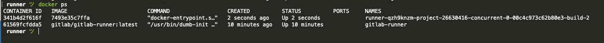

# Installation & Configuration d'un Runner

Dans ce TP nous allons voir comment installer un Runner Gitlab-CI sur votre machine. Posséder un Runner Gitlab aura plusieurs avantages que nous détaillerons au fur et à mesure ensemble.

::: details Sommaire
[[toc]]
:::

## Introduction

Nous avons vu que Gitlab-CI « offrait » des runners pour compiler / exécuter vos opérations de CI. Ces runners sont partagés avec l'ensemble des utilisateurs de la plateforme Gitlab. Même s’ils sont globalement très réactifs et très peu souvent en « panne », je vous propose ici d'installer votre (ou vos) propre(s) runner(s) afin de maitriser entièrement votre processus de CI.

- À votre avis, pourquoi est-ce important ? Quels « problèmes » voyez-vous à l'utilisation des runners partagés ?

Le runner Gitlab-CI est un petit logiciel qui va être connecté aux serveurs de Gitlab et qui va se mettre en écoute des demandes de tâches de compilation / test / packaging que **vos projets** ont besoin de réaliser. L'avantage est double :

- Pas de limite en nombre de compilations.
- Accès à vos ressources locales pour le déploiement.



## L'exécuteur

Un Runner Gitlab-CI est un simple démon qui attend les Jobs comme vu dans le diagramme précédent. Une fois un Job reçu, celui-ci va demander à « un exécuteur » de traiter la demande. Les exécuteurs sont des sous-processus qui vont se charger d'exécuter les commandes (`scripts`) que vous avez définies dans votre gitlab-ci. Gitlab-CI est capable de fonctionner de différentes manières :

- SSH
- Shell
- Parallels
- VirtualBox
- Docker
- Docker Machine (auto-scaling)
- Kubernetes
- Custom



### Comment choisir ?

#### Shell

C'est le plus simple de tous. Vos scripts seront lancés sur la machine qui possède le Runner.

#### Parallels, VirtualBox

Le Runner va créer (ou utiliser) une machine virtuelle pour exécuter les scripts. Pratique pour avoir un environnement spécifique (exemple macOS).

#### Docker

Utilise Docker pour créer / exécuter vos scripts et traitements (en fonction de la configuration de votre `.gitlab-ci.yml`).

**Solution la plus simple et à privilégier.**

#### Docker Machine (auto-scaling)

Identique à Docker, mais dans un environnement Docker multimachine avec auto-scaling.

#### Kubernetes

Lance vos builds dans un cluster Kubernetes. Très similaire à Docker Machine.

#### SSH

À ne pas utiliser. Il existe, car il permet à Gitlab-CI de gérer l'ensemble des configurations possibles.

## Installation

L'installation d'un Runner Gitlab-CI est possible quel que soit votre :

- Système d'exploitation.
- Architecture (ARM, X86, …).

Deux installations sont possibles : « en mode natif » (binaire) ou « en mode Docker » (container).

::: tip Une préférence ?
Pas de préférence particulière sur la façon d'installer le Runner Gitlab-CI, dans les deux cas les options sont relativement similaires.
:::

### En mode « natif » (binaire)

L'installation en mode « natif » est similaire à l'installation d'un logiciel classique sur votre ordinateur. Le runner Gitlab-CI va prendre la forme d'un _service_ qui démarrera en même temps que la machine sur laquelle vous l'installez. L'installation est différente en fonction de votre environnement. Mais celle-ci se résume toujours à la même suite d'opérations :

- Récupération du Runner.
- Installation.
- Configuration / Démarrage.

En fonction de votre environnement, l'installation peut être différente, je vous laisse suivre la documentation officielle (et posez-moi des questions) :

- [GNU/Linux](https://docs.gitlab.com/runner/install/linux-manually.html)
- [macOS](https://docs.gitlab.com/runner/install/osx.html)
- [Windows](https://docs.gitlab.com/runner/install/windows.html)

::: danger Attention danger
Nous avons vu dans les exécuteurs qu'il était possible de choisir **Shell**. Même si dans certains cas c'est utile (exemple compilation d'application iOS), **ce mode de fonctionnement** est très dangereux ! En effet, avec ce mode, vous lancerez des commandes de manière arbitraire directement sur la machine. Ce qu'il faut comprendre ici, c'est que si vous vous trompez et que vous lancez un `rm` hasardeux, vous allez casser votre propre machine.

**Donc attention danger**, si vous installez Gitlab Runner sur votre machine en mode binaire, je vous conseille vivement de choisir le mode de fonctionnement `Docker executor` lors de la configuration.
:::

### Dans un Docker

Si vous cherchez une solution simple pour configurer / installer un runner Gitlab, la solution Docker est clairement la plus facile. Elle vous permettra en quelques minutes de monter un Runner. La [documentation officielle](https://docs.gitlab.com/runner/install/docker.html) explique bien comment procéder, mais si on résume, la procédure se déroulera en deux temps :

#### Étape 1 : Création du Runner dans l'interface Gitlab

Depuis Gitlab 16, la création d'un runner commence dans l'interface web (l'ancien « registration token » partagé n'existe plus). Rendez-vous dans votre projet :

- `Settings` > `CI/CD` > `Runners`.
- Cliquez sur `New project runner` (ou `Create project runner`).
- Choisissez votre système d'exploitation.
- Renseignez les **tags** (ou cochez `Run untagged jobs` si vous souhaitez que le runner accepte tous les jobs).
- Ajoutez éventuellement une description, puis validez avec `Create runner`.

Gitlab vous affiche alors un **runner authentication token** de la forme `glrt-…`. C'est ce token qui va permettre d'associer votre runner à votre projet.



::: warning L'interface évolue
La capture ci-dessus a pu évoluer légèrement, l'important est de retrouver le bouton `New project runner` et de récupérer le token `glrt-…` affiché après la création.
:::

- À quoi correspondent les tags ?
- Pourquoi ce token est-il affiché une seule fois ?

#### Étape 2 : Enregistrement du Runner

L'étape d'enregistrement n'est à réaliser qu'une seule fois. Elle a pour but d'autoriser Gitlab à communiquer avec votre runner, elle s'assure aussi que seuls vos jobs vont être lancés sur votre Runner.

```sh
docker run --rm -it -v $(pwd)/config:/etc/gitlab-runner gitlab/gitlab-runner register
```

La commande va vous poser quelques questions :

- **GitLab instance URL** : `https://gitlab.com` (ou l'URL de votre instance Gitlab).
- **Runner authentication token** : le token `glrt-…` récupéré à l'étape précédente.
- **Name for the runner** : un nom libre pour identifier votre machine.
- **Executor** : `docker`.
- **Default Docker image** : par exemple `alpine:latest` (l'image utilisée si votre `.gitlab-ci.yml` n'en précise pas).

Vous remarquerez que la commande ne vous demande plus les tags : ceux-ci sont maintenant définis dans l'interface web (et modifiables à tout moment depuis celle-ci). Si vous avez des questions je suis ici :wave:. Dans mon cas voilà mes choix :



- Pourquoi ai-je choisi Docker comme `executor` ?

::: tip Be curious !
La configuration de votre runner est maintenant générée. Celle-ci est contenue dans le fichier `config`. Je vous laisse la regarder.
:::

#### Étape 3 : Lancer le runner

Notre runner est maintenant connu de Gitlab, il n'est par contre pas encore en fonction pour l'instant.



Pour le lancer on réutilise évidemment Docker, via la commande suivante :

```sh
docker run -d --name gitlab-runner --restart always \
     -v $(pwd)/config:/etc/gitlab-runner \
     -v /var/run/docker.sock:/var/run/docker.sock \
     gitlab/gitlab-runner:latest
```

::: tip Un instant :stop:
Analysons ensemble la commande afin de comprendre chacune des lignes, pour ne pas lancer n'importe quoi sur notre machine.
:::

Cette action lance un Container Docker visible via la commande `docker ps` :



**Félicitations**, votre runner est maintenant actif sur Gitlab-CI :



## Configuration & Test

Votre système est maintenant prêt à recevoir des commandes / des ordres depuis Gitlab-CI. Pour être certain que ce soit bien votre `runner` qui prenne les ordres, il faut désactiver les runners partagés. Cette opération se trouve au même endroit que la gestion de vos runners (`Settings` > `CI/CD` > `Runners`, section `Instance runners`, désactivez `Turn on runners for this project`) :



::: tip À partir de maintenant
À partir de maintenant (sous réserve que votre runner soit actif), vos builds ne seront plus décomptés du quota mensuel de 400 « compute minutes » offert par Gitlab.com. Vous n'avez plus de limite.
:::

Gitlab offre une option pour lancer un build, pour ça, rendez-vous dans la partie `Build > Pipelines` de votre projet :



Puis faites un `Run pipeline` depuis la branche souhaitée.

::: tip Que va-t-il se passer ?

Votre runner va être sollicité pour compiler. Vous pouvez suivre les opérations directement depuis Gitlab-CI. Mais si vous êtes curieux, vous pouvez également lancer un `docker ps` sur votre machine, vous devriez voir au bout de quelques secondes un container démarré sur votre machine. Dans mon cas :


:::

Quelques questions :

- Comment s'assurer que notre runner ne s'exécute que dans certains cas ?
- Comment utiliser par exemple les Shared Runners pour la partie « Construction de l'image Docker », mais pas dans les autres cas ?
- Comment n'utiliser notre runner que pour la partie « livraison continue » par exemple ?
