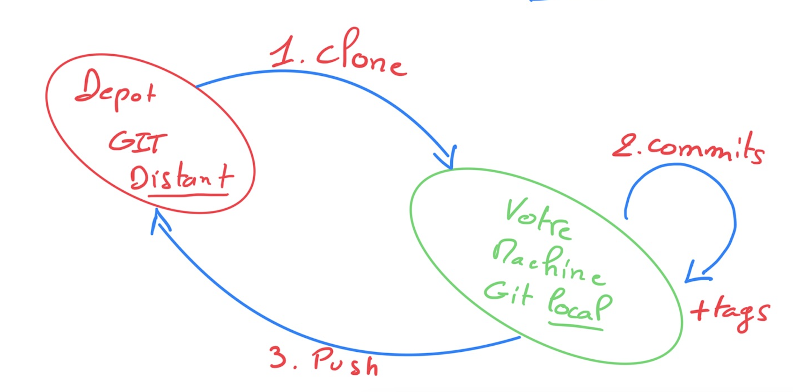
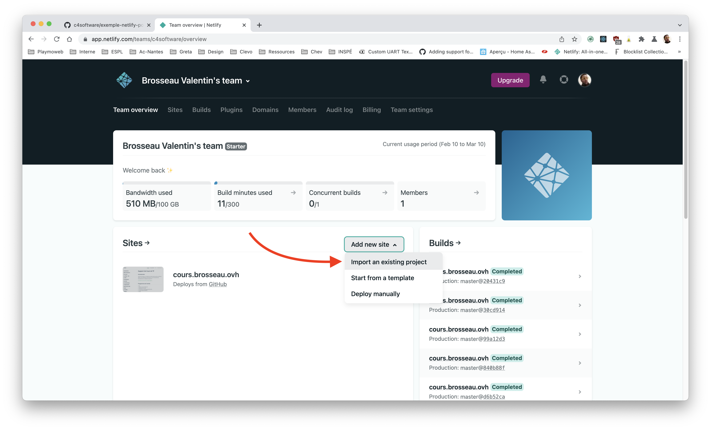
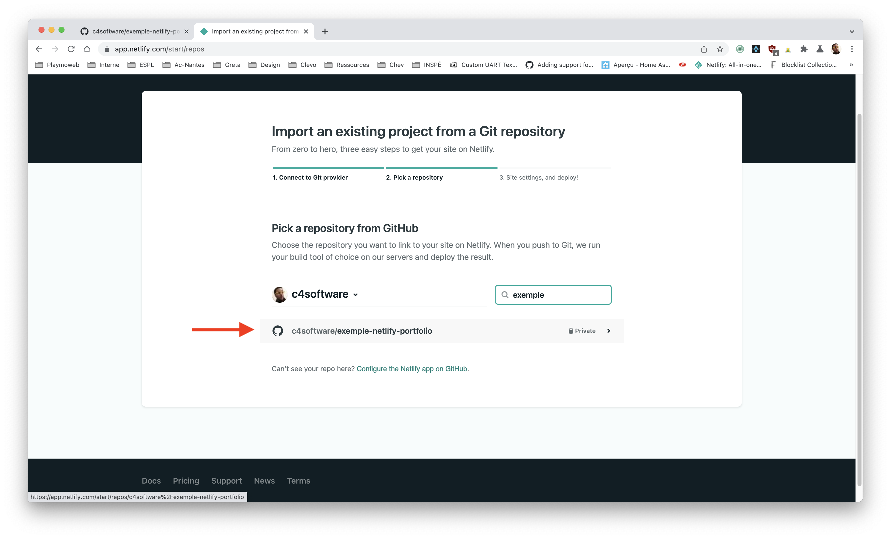
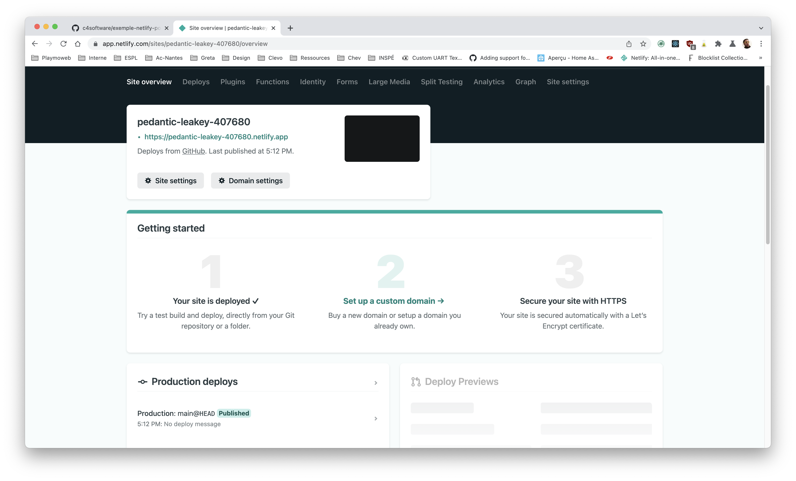
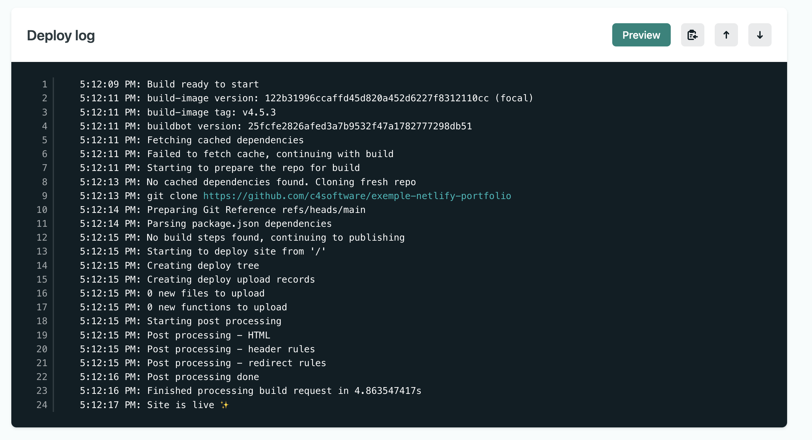

# Build, Deploy avec Netlify

Dans ce document nous allons voir comment déployer votre Portfolio simplement dans « le cloud » avec la plateforme [Netlify](https://www.netlify.com).

::: details Sommaire
[[toc]]
:::

## Introduction

Netlify est une plateforme gérant l'ensemble des problématiques de déploiement, mais également d'intégration continue pour que vous puisiez vous concentrer dans ce qui **vous intéresse** le développement de votre site Internet.

La solution de Netlify est intéressante, car elle nous permet entre autres de :

- Remplacer votre serveur.
- Intégration continue (CI).
- Déploiement continu (CD).
- Intercepter les formulaires pour envoyer des emails sans devoir ajouter du PHP.

Et le tout vous allez le voir très très simplement (et en grande partie gratuitement)

## Principe de fonctionnement

NetLify est une solution qui repose entièrement sur votre Workflow de travail GIT (vous pouvez passer par une archive ZIP, mais ça n'aurait aucun sens).



Nous allons donc :

- Connecter Github / Gitlab.
- Choisir le projet.
- Configurer le projet (branche, formulaire, script de déploiement)

Vous allez le voir, la solution vous guidera pour que vous connectiez simplement votre projet Git et Netlify.

::: danger Trop beau pour être vrai ?
C'est magique, ça semble parfait, non ? Si c'est magique … C'est qu'il y a un truc ! Le truc ici c'est que Netlify est compatible uniquement avec des sites pensés jamStack.
:::

### JamStack ?

La JamStack c'est une nouvelle façon de voir la conception de site Internet, cette nouvelle façon de faire va nous permettre de réduire les couts d'hébergements / et bénéficier de l'avantage du Cloud (CI/CD, compression des ressources graphiques également nommées ASSETS, FAAS…)

Plein de mots qui font peur, mais ne vous inquiétez pas… C'est beaucoup plus simple qu'il n'y parait. Ici pas de PHP pour générer vos pages nous allons tout concevoir en HTML / JavaScript (VanillaJS, React, Vue, …) / CSS


**JavaScript**
Les fonctionnalités dynamiques sont gérées par JavaScript. Vous êtes libres d’utiliser la bibliothèque ou le framework que vous voulez.

**APIs**
Les opérations côté serveur sont abstraites sous forme d’APIs réutilisables, accessibles en HTTPS à l’aide de JavaScript. Ces opérations peuvent être déléguées à des services tiers ou bien à vos propres fonctions. C'est ce que l'on appelle souvent FAAS (Function As A Service)

**Markup**
Les sites web sont servis sous forme de fichiers HTML statiques. Ses fichiers peuvent être générés à partir de fichiers sources (Markdown, générateur de sites, ou simplement avec du HTML à l'ancienne).

::: danger Est-ce la meilleure façon ?
C'est à la mode, oui… Mais est-ce la meilleure façon ? Je ne sais pas. Sachez juste que pour l'instant c'est un standard et que beaucoup l'utilisent.

**Il faut donc le connaitre / le maitriser.**
:::

[Plus d'information sur la JamStack](https://jamstack.wtf/)

::: tip Votre portfolio est-il JamStack ?

C'est une bonne question, non ? À votre avis ? Parlons-en !

:::

## Déployer votre portfolio

L'objectif ici est de rendre votre portfolio accessible sur Internet grâce au cloud. Dans un premier temps, nous allons donc devoir partager votre Portfolio sur Github / Gitlab.

Avant de continuer, nous allons tester en local votre portfolio afin de vérifier que tout fonctionne comme attendu.

::: details Vous n'avez pas de site ?

Vous devez avoir un portfolio pour l'examen, mais si vous n'avez pour l'instant rien de disponible, il est tout à fait possible de continuer le TP. Pour ça je vous propose d'utiliser autre chose !

Vous utilisez depuis le début d'année mon site, mon site est **un site  de type JamStack** il utilise VueJS et pour écrire les pages je ne fais pas de HTML j'écris du Markdown.

Je n'ai rien inventé. J'utilise un outil qui s'appelle [VuePress](https://vuepress.vuejs.org/), VuePress est un générateur de site statique, c'est-à-dire un site qui ne sera pas différent à chaque chargement de page. Il est possible d'utiliser VuePress dans beaucoup d'usages différents :

- De la documentation.
- Un Blog
- Un portfolio ([exemple](https://github.com/forestryio/portfolio-vuepress))
- Et via les thèmes vous pouvez tout imaginer ([exemple](https://github.com/vuepress/awesome-vuepress#community-themes))

```sh
npx create-vuepress-site 
```


Cette commande va nous créer un projet « vide » que nous pourrons déployer sur Netlify en quelques minutes. Vous allez voir… C'est magique !

⚠️ Avant d'aller plus loin, je vous laisse tester ce que vous allez déployer avec :

```sh
cd docs
npm install
npm run dev
```

Vous devriez avoir :


:::

### Créer le site sur Github / Gitlab

Nous allons utiliser à 100% le principe de CI / CD, nous allons donc mettre en place notre projet sur Github / Gitlab pour que celui-ci puisse être « observer » (*watch* en anglais) par Netlify.


::: tip Github ?
Dans la suite des exemples je vais utiliser Github, mais le fonctionnement est **identique** si vous décidez d'utiliser GitLab.
:::

Je vous laisse créer votre projet sur Github / Gitlab. Je pense que vous l'avez déjà fait plusieurs fois. Si ce n'est pas le cas, n'hésitez pas à me solliciter.


::: danger Privé ou Public ?

Ici vous avez le choix… Cependant je pense que pour l'instant il est peut-être plus raisonnable de mettre votre projet en privé. Pourquoi ? Github / Gitlab est un peu votre vitrine, ce que vous y déposez sera regardé lors d'un recrutement, attention donc…

:::

### Connecter Github / Gitlab à Netlify

Maintenant que nous avons un projet sur Github / Gitlab, nous allons connecter la plateforme Netlify à votre code. Celle-ci prendra en charge **automatiquement** tout le processus de compilation de votre projet.

Concrètement, qu'est-ce que ça veut dire ? Lors d'une modification de votre code source, Netlify va se déclencher et lancer « une machine » qui :

- Clonera la nouvelle version de votre site web.
- Va installer les dépendances de votre projet.
- Testera votre projet si vous avez des tests.
- Lancera le script de « build ».
- Sauvegardera dans leur CDN le résultat de la compilation.
- … (et bien plus si vous avez activé d'autres options).

Nous allons donc suivre la configuration « ultra simple » de Netlify






::: tip Ici rien de bien compliqué
La seule partie « vraiment intéressante », c'est la partie Build Settings. Pourquoi n'avons-nous rien spécifié pour :

- Build
- Publish directory

Pourquoi ceux qui utilisent VuePress ont-ils quelque chose ?

:::

### Compilation & Build

Et voilà ! Votre site est en cours de compilation… Dans quelques instants vous aurez déployé sur Internet un site complètement fonctionnel.



::: danger Un peu de curiosité
Je vous laisse regarder ce que fait Netlify pendant le build notamment le Deploy Log.


:::

Le site est [maintenant en ligne voici le mien par exemple](https://pedantic-leakey-407680.netlify.app/)

### Apporter des modifications

Je vous laisse modifier votre portfolio. Si vous avez correctement configuré votre stack applicatif, vous devriez normalement déclencher une recompilation de votre site web.

C'est à vous.

PS: N'oubliez pas de commiter et pusher.

### Paramétrage

Mais Netlify c'est pas uniquement un simple CDN qui compile automatiquement vos sources ! C'est aussi tout un tas d'options permettant d'optimiser votre site.


Ces règles sont nommées PostProcessing sur Netlify. Ne vous y trompez pas, les règles en question ne sont que des outils préparamètrés pour vous faire gagner du temps. Si vous le souhaitez, il est complètement possible de faire la même chose avec des solutions comme Gitlab-CI.

Nous allons faire le tour ensemble des options. Je vous attends.

### Aller plus loin

Nous avons vu la base, regardons ce que nous allons pouvoir faire très simplement avec Netlify.

#### Les branches

Tester en production, personne n'aime ça… Pourtant vous pourriez vouloir montrer à votre client / collègue votre travail sans forcément le montrer sur votre ordinateur. Avec Netlify c'est possible :

Dans les paramètres de votre projet, vérifiez que les options suivantes sont actives :


À partir de maintenant, si vous créez une branche dans votre projet Git, une version de `prévisualisation` sera créée pour tester en temps réel votre modification.

- Créer une branche.
- Apporter une modification.
- Vérifier que Netlify a bien créé un sous-domaine permettant de valider votre modification.

::: tip Un instant !

- À votre avis quel est l'intérêt ?
- Pourquoi est-ce intéressant dans le cadre de la méthode agile ?

:::

#### Les formulaires

Notre site est statique, oui… Donc exit le traitement serveur vous me direz ? Et bien pas vraiment… Souvent sur un site Internet ce que nous avons besoin c'est « juste » d'un envoi d'email.

Et bien avec Netlify c'est possible ! Et c'est très simple ! La procédure sera la suivante :

- Ajouter un formulaire dans notre site Internet.
- Activation de l'option et mise en place de notification

La documentation explique très bien la procédure : [consulter la documentation](https://docs.netlify.com/forms/setup/#html-forms)

#### La compression des ASSETS

Des images trop lourdes ? Un CSS non compressé ? Des fichiers non minifiés ? Aucun problème, regardons comment répondre à cette problématique.

#### La suite

Netlify est vraiment une solution simple et intéressante pour livrer en continu des sites web. Vous l'avez vu, il est possible en quelques clics de mettre en ligne un site, cependant cette mise en ligne est très simpliste :

- Vous n'avez que très peu la main sur les outils.
- Vous ne pouvez pas faire autre chose que de la JamStack.

Pour aller plus loin, je vous propose de tester Gitlab Pages qui, comme Netlify, va nous permettre de mettre en ligne votre site. Mais, cette fois-ci, vous allez voir que nous aurons la main sur l'ensemble des opérations.

[La suite est par ici =>](../pages-portfolio.md)
