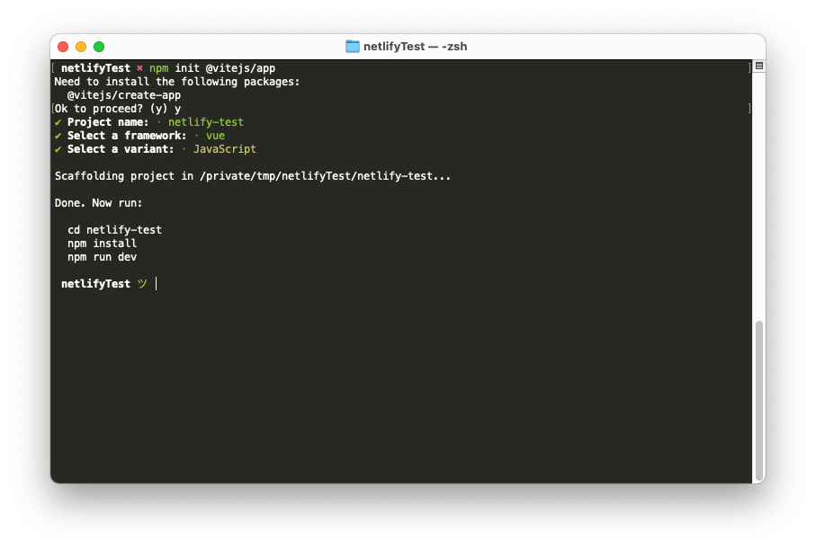
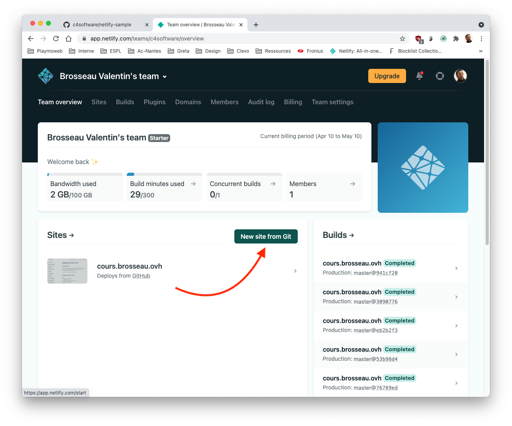
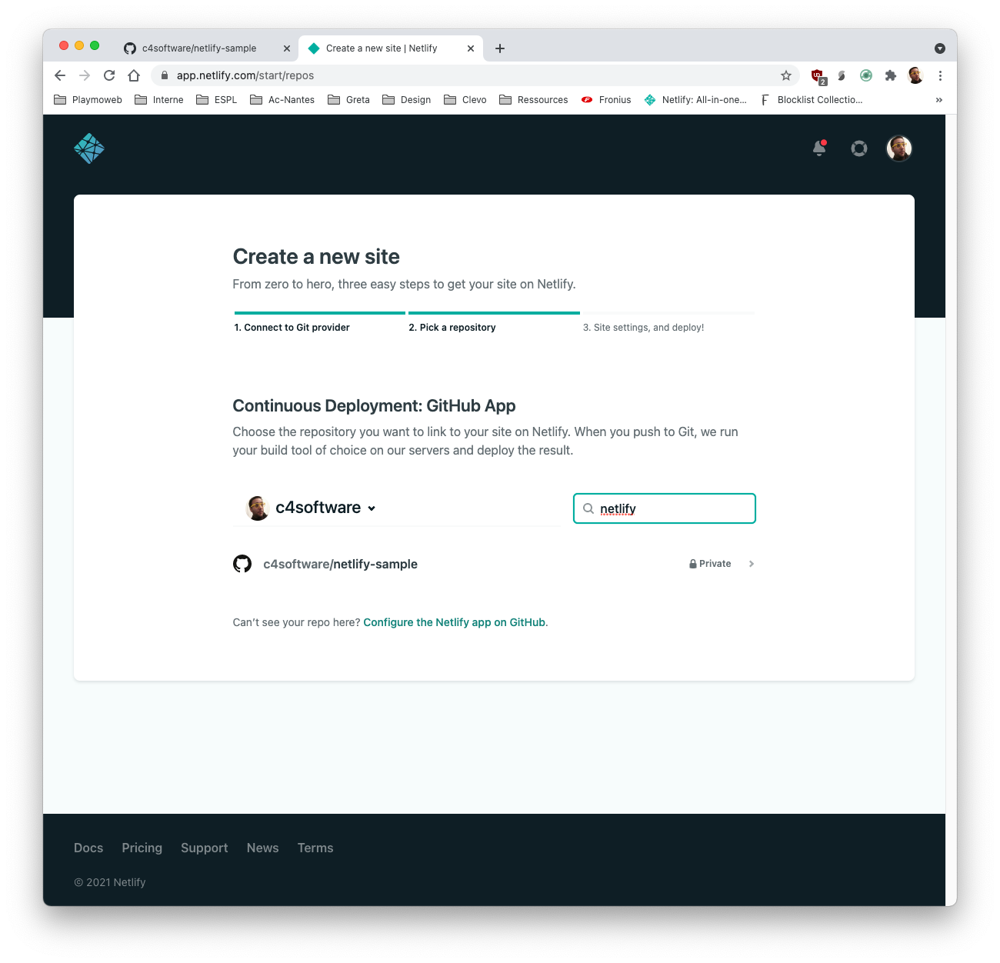
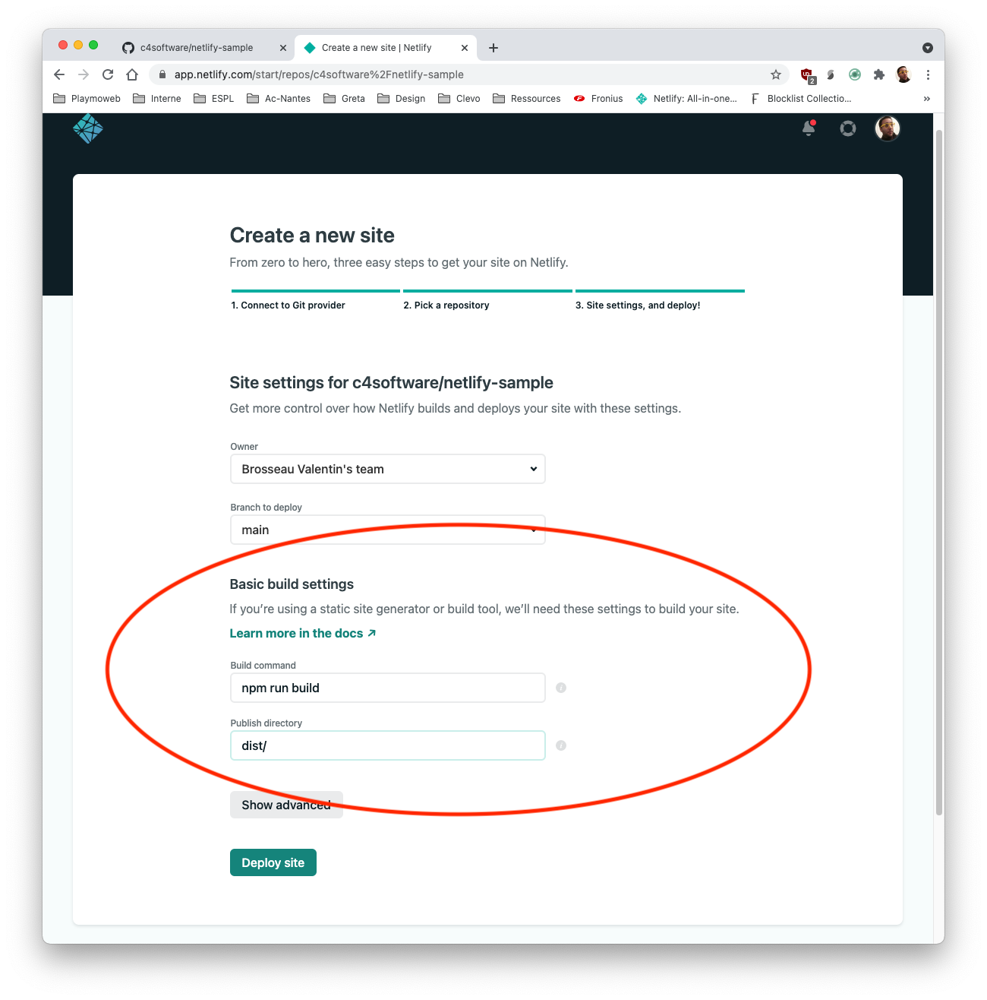
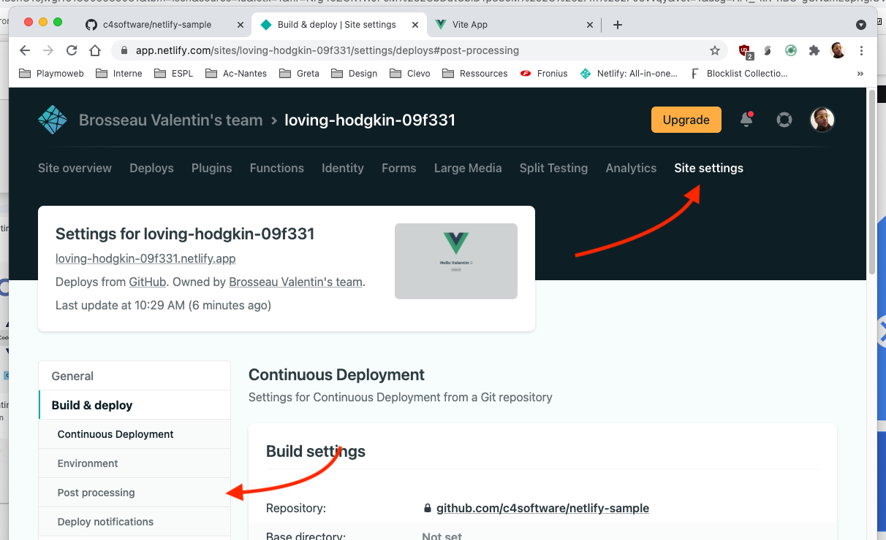

# Build, Deploy avec Netlify

Dans ce document nous allons voir comment déployer une application simplement dans « le cloud » avec la plateforme Netlify.

## Introduction

Netlify est une plateforme gérant l'ensemble des problématiques de déploiement, mais également d'intégration continue pour que vous puisiez vous concentrer dans ce qui **vous intéresse** le développement de votre site Internet.

La solution de Netlify est intéressante, car elle nous permet entre autres de :

- Remplacer votre serveur.
- Intégration continue (CI).
- Déploiement continu (CD).
- Intercepter les formulaires pour envoyer des emails sans rien coder.

Et le tout vous allez le voir très très simplement (et en grande partie gratuitement)

## Principe de fonctionnement

NetLify est une solution qui repose entièrement sur votre Workflow de travail GIT (vous pouvez passer par une archive ZIP, mais ça n'aurait aucun sens).

Nous allons donc :

- Connecter Github / Gitlab.
- Choisir le projet.
- Configurer le projet (branche, formulaire, script de déploiement)

Vous allez le voir, la solution vous guidera pour que vous connectiez simplement votre projet Git et Netlify.

::: danger Trop beau pour être vrai ?
C'est magique, ça semble parfait non ? Si c'est magique … C'est qu'il y a un truc ! Le truc ici c'est que Netlify est compatible uniquement avec des sites pensés jamStack.
:::

### JamStack ?

La jamstack c'est une nouvelle façon de voir la conception de site Internet, cette nouvelle façon de faire va nous permettre de réduire les couts d'hébergements / et bénéficier de l'avantage du Cloud (CI/CD, compression des assets, FAAS…)

Plein de mots qui font peur, mais ne vous inquiétez pas… C'est beaucoup plus simple qu'il n'y parait. Ici pas de PHP pour générer vos pages nous allons tout concevoir en HTML / JavaScript (VanillaJS, React, Vue, …) / CSS


**JavaScript**
Les fonctionnalités dynamiques sont gérées par JavaScript. Vous êtes libres d’utiliser la bibliothèque ou le framework que vous voulez.

**APIs**
Les opérations côté serveur sont abstraites sous forme d’APIs réutilisables, accessibles en HTTPS à l’aide de JavaScript. Ces opérations peuvent être déléguées à des services tiers ou bien à vos propres fonctions. C'est ce que l'on appelle souvent FAAS (Function As A Service)

**Markup**
Les sites web sont servis sous forme de fichiers HTML statiques. Ses fichiers peuvent être générés à partir de fichiers source (Markdown, générateur de site, ou simplement avec du HTML à l'ancienne).

::: danger Est-ce la meilleure façon ?
C'est à la mode oui… Mais est-ce la meilleure façon ? Je ne sais pas. Sachez juste que pour l'instant c'est un standard et que beaucoup l'utilise.

**Il faut donc le connaitre / le maitriser.**
:::

[Plus d'information sur la JamStack](https://jamstack.wtf/)

## Déployer un site

Nous allons donc déployer un site « pour tester Netlify », si vous n'avez pas de site static sous la main je vous propose d'en créer un rapidement avec [ViteJS](https://vitejs.dev/)

```sh
npm init @vitejs/app
```



Cette commande va nous créer un projet « générique » que nous pourrons déployer sur Netlify en quelques minutes. Vous allez voir… C'est magique !

::: danger Un instant
⚠️ Avant d'aller plus loin je vous laisse tester ce que vous aller déployer.
:::

### Créer le site sur Github / Gitlab

Nous allons utiliser à 100% le principe de CI / CD, nous allons donc mettre en place notre projet sur Github / Gitlab pour que celui-ci puisse être « watch » par Netlify.


::: tip Github ?
Dans la suite des exemples je vais utiliser Github, mais le fonctionnement est **identique** si vous décidez d'utiliser GitLab.
:::

Je vous laisse créer votre projet sur Github / Gitlab. Je pense que vous l'avez déjà fait plusieurs fois. Si ce n'est pas le cas, n'hésitez pas à me solliciter.


### Connecter Github / Gitlab à Netlify

Maintenant que nous avons un projet sur Github / Gitlab, nous allons connecter la plateforme Netlify à votre code. Celle-ci prendra en charge **automatiquement** tout le processus de compilation de votre projet.

Concrètement qu'est-ce que ça veut dire ? Lors d'une modification de votre code source, Netlify va se déclencher et lancer « une machine » qui :

- Clonera la nouvelle version de votre site web.
- Va installer les dépendances de votre projet.
- Testera votre projet si vous avez des tests.
- Lancera le script de « build ».
- Sauvegardera dans leur CDN le résultat de la compilation.
- … (et bien plus si vous avez activé d'autres options).

Nous allons donc suivre la configuration « ultra simple » de Netlify





::: tip Ici rien de bien compliqué
La seule partie « vraiment intéressante », c'est la partie Build Settings. Nous avons ici les deux paramètres importants de notre flow CI/CD à savoir :

- La commande qui va compiler votre site.
- Le dossier qui contiendra le résultat.

:::

### Compilation & Build

Et voilà ! Votre site est en cours de compilation… Dans quelques instants vous aurez déployé sur Internet un site complètement fonctionnel.


::: danger Un peu de curiosité
Je vous laisse regarder ce que fait Netlify pendant le build notamment le Deploy Log.


:::

Le site est [maintenant en ligne voici le mien par exemple](https://607e90d957d531e74a211201--loving-hodgkin-09f331.netlify.app/)

### Apporter des modifications

Je vous laisse modifier votre site Internet. Si vous avez correctement configuré votre stack applicatif, vous devriez normalement déclencher une recompilation de votre site web.

C'est à vous.

### Paramètrage

Mais Netlify c'est pas uniquement un simple CDN qui compile automatiquement vos sources ! C'est aussi tout un tas d'options permettant d'optimiser votre site.



Ces règles sont nommées PostProcessing sur Netlify. Ne vous y trompez pas, les règles en question ne sont que des outils préparamètres pour vous faire gagner du temps. Si vous le souhaitez, il est complètement possible de faire la même chose avec des solutions comme Gitlab-CI.

Nous allons faire le tour ensemble des options. Je vous attends.

### Aller plus loin

Nous avons vu la base regardons ce que nous allons pouvoir faire très simplement avec Netlify.

#### Le prérendering

Nous avons ici un site complètement en JavaScript, pas idéal pour le référencement, pour le partage sur les Réseaux sociaux, etc. Nous allons pouvoir dire à Netlify de pré-render le site sur « leur serveur » pour que les robots des moteurs de recherche obtiennent une version HTML classique.

Cette problématique est relativement complexe à mettre en place en temps normal ! Avec Netlify vous allez voir c'est très très simple.

#### Les formulaires

Notre site est static oui… Donc exit le traitement serveur vous me direz ? Et bien pas vraiment… Souvent sur un site Internet ce que nous avons besoin c'est « juste » d'un envoi d'email.

Et bien avec Netlify c'est possible ! Et c'est très simple ! Nous allons le configurer ensemble et tester.

- Ajouter un formulaire dans notre site Internet.
- Activation de l'option et mise en place de notification

#### Les branches

Tester en prod personne n'aime ça… Pourtant vous pourriez vouloir montrer à votre client / collègue votre travail sans forcément le montrer sur votre ordinateur. Avec Netlify c'est possible. Nous allons le configurer sur votre projet.

#### La compression des ASSETS

Des images trop lourdes ? Un CSS non compressé ? Des fichiers non minifiés ? Aucun problème regardons comment répondre à cette problématique.
