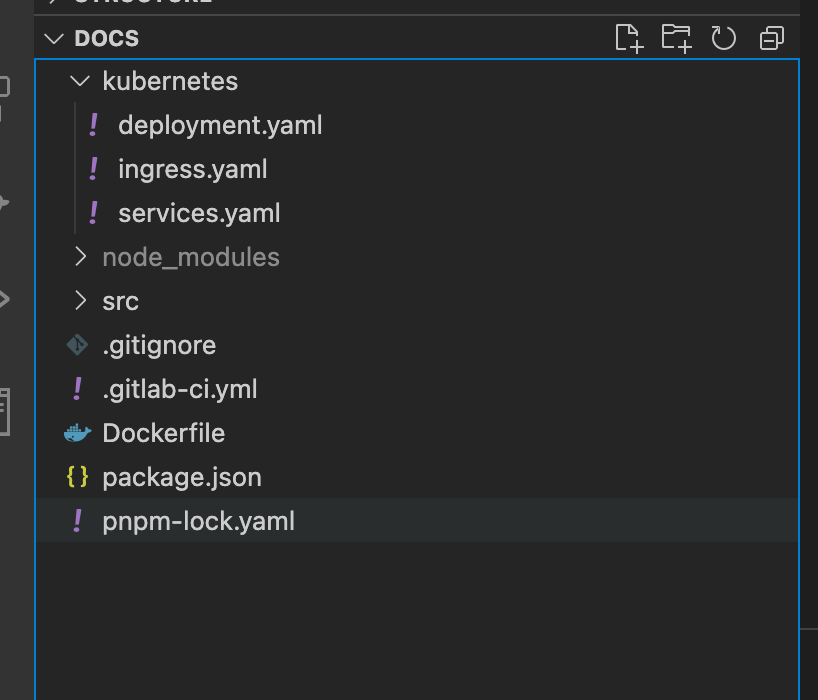
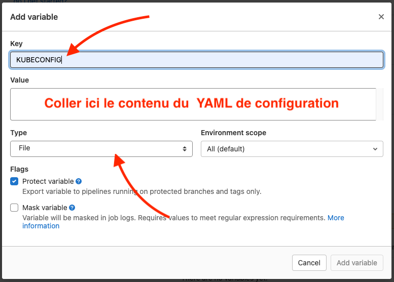
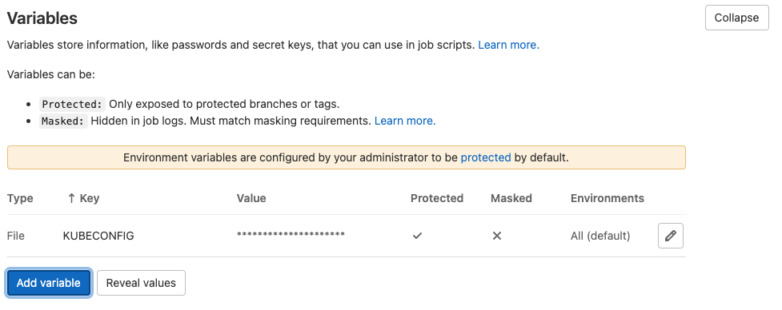

# Livraison continue, Gitlab-CI + Kubernetes

[Dans le précédent TP](./deploy-container-in-kubernetes.md) nous avons vu que nous pouvions déployer une image Docker produite par Gitlab-CI « directement » dans un cluster Kubernetes. Dans ce TP nous allons voir comment il est possible d'automatiser ce (re)déploiement.

::: details Sommaire
[[toc]]
:::

## Introduction

Vous avez remarqué dans [le TP d'initiation à Kubernetes](./deploy-container-in-kubernetes.md) qu'après la construction du cluster, les déploiements **étaient très simple** et que finalement il se résume à :

```sh
kubectl apply -f deployment.yaml
```

Nous allons voir que finalement le mettre dans d'un flow de CI/CD ça ne sera finalement pas si compliqué.

::: warning Auto devops ?
Quand on débute, l'option auto devops de Gitlab est tentante. Elle est en effet très intéressante, car elle est plutôt clef en main… **cependant**, je pense que pour un débutant c'est encore plus intéressant de comprendre comment ça fonctionne réellement.

D'autant plus que vous allez le voir, pour un cas simple comme celui que nous avons construit la configuration à mettre est vraiment **très minimaliste**.
:::

## Le retour de la question « On commit la configuration ? »

Gros débat… Dans un projet privé pas de problème, cette configuration peut accompagner le projet… dans le cas d'un projet « public » attention à ne pas commiter un YAML qui ferait référence à des informations privées / non destinée aux publiques (IP, port, …)

Nous sommes dans le cadre d'un projet privé, nous allons commiter la configuration d'autant plus qu'il ne s'agira que des fichiers suivants :

- `deployment.yaml`
- `services.yaml`
- `ingress.yaml`

Un projet nommé `helm` existe également pour automatiser cette partie. Nous pourrions l'utiliser, mais mon objectif est de rester très simple dans l'approche.

::: tip c'est à vous !
Je vous laisse commiter la configuration dans un dossier `kubernetes` (par exemple) **dans le dossier docs**.

Dans mon cas ça donne :


:::

::: danger ATTENTION PAS DE SECRET !
Vous noterez que je ne commit pas la partie contenant les secrets. En effet celle-ci sera présente dans notre projet évidemment ! Mais elle prendra la forme **d'une variable de type file secrète** dans la partie configuration de votre projet gitlab.
:::

## Mise en place du CI/CD

Dans le TP précédent nous avons déjà initialisé dans notre projet la partie CI, en effet l'image du projet est construite automatiquement, cette image est sauvegardée automatiquement dans le Registry Docker interne à Gitlab. Nous allons nous concentrer sur la partie qui nous intéresse à savoir :

- Quel(s) opération(s) nous devons faire lors de la mise à jour de notre Cluster ?
- Quel(s) information(s) nous avons besoin pour échanger avec notre cluster (authentification, secret, registry, …) ?
- Quel(s) commande(s) nous devons utiliser pour déployer notre application ?

::: warning C'est à vous
Cette étape est importante dans le cadre de la mise en place d'un déploiement continue. En effet, le déploiement continu est « juste » une automatisation des actions de livraison. Si vous savez comment livrer, vous saurez comment livrer en continu.

Avant de continuer… Je vous laisse donc réfléchir ! Je vous attends pour échanger sur votre réflexion.
:::

::: danger Une note importante
Dans notre `CI/CD`, et plus particulièrement dans la partie `CD` il s'agit que de la partie déploiement / livraison. **Nous partons du principe** que le cluster est déjà en place et déjà fonctionnel, pour éviter de surcharger notre flow de CD.

Donc normalement :

- Votre cluster existe et est fonctionnel.
- Votre cluster est capable de dialoguer avec votre Registry. (à discuter ensemble)
- Il possède déjà une version de votre application complètement fonctionnelle.

:::

## Authentification (aka comment se connecter à votre serveur depuis la CI)

Nous l'avons vu dens le point précédent, la première étape est d'autoriser le dialogue entre Gitlab et votre Cluster Kubernetes.

Dans le précédent TP nous avons vu que l'authentification était réaliser via un fichier `yaml` obtenu depuis le serveur qui contient le cluster. Nous devrons donc procéder de la même façon depuis GITLAB, le problème est que je vous ai dit que ce fichier **devait rester privé** vous ne devez jamais le commiter dans votre projet.

Les développeurs (Open-Source) de Gitlab ont pensé à tout. Vous avez dans les paramètres de votre projet la possibilité de mettre des variables, ces variables peuvent-être de deux types :

- `string`, pour une variable simple type token, configuration, etc (Ex `$SERVER="https://url-de-staging.devotreprojet.fr"`)
- `file`, représente le contenu de votre fichier, lors de l'étape de CI/CD Gitlab va créer un fichier avec le contenu et déclarera une variable avec comme contenu le chemin vers le fichier en question. (Ex. `$KUBECONFIG="/private/mon_fichier_yaml_RANDOMID.yml"`)

La force des variables c'est qu'en plus d'être souple (de par le type) elles sont également (re)définissables en fonction de l'environnement. Pratique !

Pour configurer une variable, rendez-vous dans "Settings > CICD" puis "Variables".


Puis


### Création de la variable

Nous allons créer une variable de type `file` avec comme nom la variable attendue par `kubectl` à savoir `KUBECONFIG` :



Pour le contenu, je vous laisse prendre le contenu du fichier `YAML` (celui qui contient les secrets) sous **mac** c'est aussi simple que `cat $KUBECONFIG | pbcopy -`.



::: tip Et c'est tout !
Cette étape de création de variables est l'équivalent du `export KUBECONFIG="emplacement/de/votre/vosSecret.yaml"`. Ça veut dire que dans notre flow de CI/CD nous n'aurons rien de spécial à faire. En effet, comme précisé la variable de type `file` expose une variable avec l'emplacement du fichier.
:::

## Configuration et variable dans la CI

Notre authentification est maintenant effective, Gitlab-CI est maintenant capable de dialoguer avec notre Cluster Kubernetes. L'étape suivante est la personnalisation du YAML, pourquoi ? En effet, si vous vous souvenez du précédent TP, nous devions indiquer manuellement l'identifiant de l'image à déployer. Exemple :

```yaml
# …
spec:
  containers:
    - name: vuepress-test
      image: registry.gitlab.com/vbrosseau/vuepress-kubernetes-deploy:bb2d2d0b # <- Identifiant du build à déployer
# …
```

Nous devons donc trouver un moyen de le changer **à chaque build** (c'est à dire commit donc). Gitlab-CI intègre un système de variable automatique avec plein d'informations relatives au contexte de votre Build ([Plus d'informations](https://docs.gitlab.com/ee/ci/variables/predefined_variables.html)). Dans cette énorme liste de variable, nous avons une variable qui va nous intéresser plus particulièrement `$CI_COMMIT_SHORT_SHA`. En effet si vous vous souvenez de votre fichier gitlab-ci c'est la variable que nous avons utilisée par tagguer l'image dans le Registry Gitlab.

Mais nous allons avoir un problème… En effet les fichiers `YAML` n'acceptent pas les variables comme un simple script shell, nous allons devoir jouer d'une petite astuce pour pouvoir le changer dynamiquement.

::: danger Helm
L'autre solution serait d'utiliser `Helm`, en effet `Helm` permet de gérer ce genre de chose. **Cependant**, ici nous allons faire simple. Nous allons utiliser `sed`, ça sera suffisant pour faire notre livraison continue minimaliste.
:::

### Modifier le `deployment.yaml`

Parlons de l'outil `sed`, `sed` (éditeur de flux) est un programme permettant d'appliquer différentes transformations prédéfinies à un flux séquentiel de données textuelles. Concrètement, `sed` lit des données d'entrée ligne par ligne, modifie chaque ligne selon des règles spécifiées. Nous allons donc nous en servir pour modifier le fichier `deployment.yml` « à la volée » autrement dit, au moment où nous allons vouloir déployer.

Dans mon cas, j'ai décidé de modifier mon fichier `deployment.yml` pour retirer **l'identifiant** du build (hash) pour y mettre un texte que je vais remplacer via `sed`.

```yaml
apiVersion: apps/v1
kind: Deployment
metadata:
  name: vuepress-test
spec:
  replicas: 1
  selector:
    matchLabels:
      app: vuepress-test
  template:
    metadata:
      labels:
        app: vuepress-test
    spec:
      containers:
        - name: vuepress-test
          image: registry.gitlab.com/VALEUR-D-AVANT/LE-LIEN-QUE-VOUS-AVIEZ-AVANT:{{CI_COMMIT_SHORT_SHA}}
      imagePullSecrets:
        - name: gitlab-registry
```

Nous avons donc maintenant un fichier YAML presque dynamique… En effet celui-ci contient maintenant une valeur (`{{CI_COMMIT_SHORT_SHA}}`) que nous allons remplacer via `sed` directement à chaque exécution de la step sur Gitlab-CI.

::: tip C'est à vous
Je vous laisse modifier votre fichier en fonction de votre cas.
:::

## 3 étapes

::: tip Ce n'est que de l'automatisation
Je me répète, mais c'est important à comprendre ! Le livraison continue n'est vraiment pas un système magique, il s'agit seulement d'automatiser les actions que **vous** faites habituellement pour livrer votre application. Rien de plus rien de moins
:::

### La commande sed

L'idée va être la suivante : « utiliser `sed` pour lui faire remplacer `{{CI_COMMIT_SHORT_SHA}}` par la valeur de `$CI_COMMIT_SHORT_SHA`. Pour ça nous pouvons utiliser `sed` de la façon suivante :

```sh
cat ./kubernetes/deployment.yaml | sed "s/{{CI_COMMIT_SHORT_SHA}}/$CI_COMMIT_SHORT_SHA/g" | kubectl apply -f -
```

Cette commande va prendre le fichier de déploiement « type », remplacer

### Déterminer les actions de déploiement

Maintenant que nous savons comment rendre dynamique notre déploiement, il faut maintenant assembler les commandes nécéssaire au bon déploiement de notre application. Nous avons déterminé ensemble que lors du déploiement nous faisions :

```sh
cat ./kubernetes/deployment.yaml | sed "s/{{CI_COMMIT_SHORT_SHA}}/$CI_COMMIT_SHORT_SHA/g" | kubectl apply -f -
kubectl apply -f ./kubernetes/services.yaml
kubectl apply -f ./kubernetes/ingress.yaml
```

Comme pour l'étape de compilation, et de `dockerise`, nous allons utiliser un step Gitlab-CI. Cette étape aura besoin de la commande `kubectl`, je vous laisse chercher un peu, mais moi dans mon cas j'ai utilisé l'image `bitnami/kubectl:latest` qui dispose de l'ensemble des commandes dont j'ai besoin.

::: details Vous séchez ? Vous souhaitez de l'aide ?

Avez-vous vraiment cherchez ? Si oui… Voilà **ma solution** à **ma problématique** :

```yaml
# Nécessite une variable nommée KUBECONFIG de type file avec le contenu de votre « secret » Kubernetes (kubeconfig-monCluster.yaml)
# Sous Mac le contenu peut-être obtenu via cat $KUBECONFIG | pbcopy -
# Sous Linux le contenu peut-être obtenu via cat $KUBECONFIG | xclip -selection clipboard
publish_to_prod:
  image:
    name: bitnami/kubectl:latest
    entrypoint: [""]
  stage: publish
  dependencies:
    - dockerise
  script:
    - cat ./kubernetes/deployment.yaml | sed "s/{{CI_COMMIT_SHORT_SHA}}/$CI_COMMIT_SHORT_SHA/g" | kubectl apply -f -
    - kubectl apply -f ./kubernetes/services.yaml
    - kubectl apply -f ./kubernetes/ingress.yaml
  only:
    - master
```

:::

### Solution alternative

L'autre solution (merci Kevin RIOU), est d'utiliser la commande :

```sh
kubectl set image deployment/vuepress-test vuepress-test=registry.gitlab.com/vbrosseau/vuepress-kubernetes-deploy:$IMAGE_TAG
```

Celle-ci va remplacer l'image lors du (re)déploiement avec celle que nous avons actuellement buildé.

Cette solution est préférable à celle du `sed` car elle permet d'avoir une configuration toujours fonctionnelle dans notre fichier `yaml`.

## Un résultat possible

Voilà l'un des résultats possibles, exemple de configuration Pages + Docker + Kubernetes

```yaml
stages:
  - build
  - deploy
  - publish

build:
  image: node:latest
  stage: build
  script:
    - npm install
    - npm run build
  artifacts:
    paths:
      - src/.vuepress/dist
  only:
    - master

dockerise:
  image: docker:19.03.12
  stage: deploy
  dependencies:
    - build
  services:
    - docker:19.03.12-dind
  variables:
    IMAGE_TAG: $CI_REGISTRY_IMAGE:$CI_COMMIT_SHORT_SHA
  script:
    - docker login -u $CI_REGISTRY_USER -p $CI_REGISTRY_PASSWORD $CI_REGISTRY
    - docker build -t $IMAGE_TAG .
    - docker push $IMAGE_TAG
  only:
    - master

# Nécessite une variable nommée KUBECONFIG de type file avec le contenu de votre « secret » Kubernetes (kubeconfig-monCluster.yaml)
# Sous Mac le contenu peut-être obtenu via cat $KUBECONFIG | pbcopy -
# Sous Linux le contenu peut-être obtenu via cat $KUBECONFIG | xclip -selection clipboard
publish_to_prod:
  image:
    name: bitnami/kubectl:latest
    entrypoint: [""]
  stage: publish
  dependencies:
    - dockerise
  script:
    # Décommenter pour autoriser le kubernetes à s'authentifier pour pull l'image docker
    # - kubectl create secret docker-registry gitlab-registry --docker-server="$CI_REGISTRY" --docker-username="$CI_DEPLOY_USER" --docker-password="$CI_DEPLOY_PASSWORD" --docker-email="$GITLAB_USER_EMAIL" -o yaml --dry-run=client | kubectl apply -f -
    - cat ./kubernetes/deployment.yaml | sed "s/{{CI_COMMIT_SHORT_SHA}}/$CI_COMMIT_SHORT_SHA/g" | kubectl apply -f -
    - kubectl apply -f ./kubernetes/services.yaml
    - kubectl apply -f ./kubernetes/ingress.yaml
  only:
    - master
```

## Image multi-architectures ?

Vous souhaitez créer une image qui fonctionnera sur un Raspberry Pi, mais également sur une machine X86? C'est possible, c'est ce que l'on appelle les « Multi-architectures. Nous sommes plus dans quelque chose d'aussi simple qu'avec l'exemple précédent, mais vous pouvez le faire sans problème depuis Gitlab-CI ?

```yaml
dockerise:
  image: docker:19.03.12
  stage: deploy
  dependencies:
    - build
  services:
    - name: docker:19.03.12-dind
      command: ["--experimental"]
  variables:
    IMAGE_TAG: $CI_REGISTRY_IMAGE:$CI_COMMIT_SHORT_SHA
    DOCKER_DRIVER: overlay2
    DOCKER_TLS_CERTDIR: ""
    BUILDX_VERSION: v0.4.1
  before_script:
    - apk add curl
    - mkdir -p ~/.docker/cli-plugins
    - curl -sSLo ~/.docker/cli-plugins/docker-buildx https://github.com/docker/buildx/releases/download/$BUILDX_VERSION/buildx-$BUILDX_VERSION.linux-amd64
    - chmod +x ~/.docker/cli-plugins/docker-buildx
    - docker run --rm --privileged multiarch/qemu-user-static --reset -p yes
    - docker info
  script:
    - docker login -u $CI_REGISTRY_USER -p $CI_REGISTRY_PASSWORD $CI_REGISTRY
    - docker buildx create --use
    - docker buildx build --push --platform linux/arm/v8,linux/amd64 -t $IMAGE_TAG .
  only:
    - master
```

## Déployer dans un cluster « privés »

Nous avons vu avec les précédents exemples qu'il était relativement simple de déployer en continu un cluster Kubernetes du moment que celui-ci est accessible via Internet. C'est un peu plus compliqué quand il s'agit d'un cluster « interne » / « privé », non forcément exposé sur Internet.

Pour répondre à cette problématique, vous pouvez utiliser le système de [runner privé de Gitlab-CI](/tp/ci/gitlab/runner.md). Pourquoi à votre avis ?

- Pour terminer ce TP, je vous propose de monter sur votre machine :
  - Un cluster Kubernetes
  - Un Runner Gitlab
  - Un déploiement continue depuis gitlab.com
