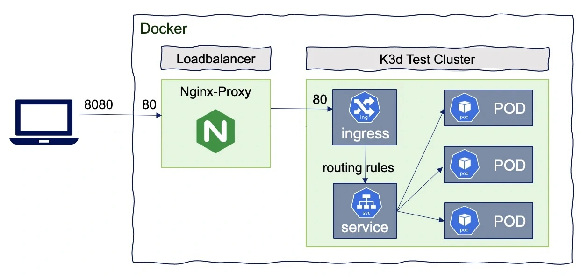
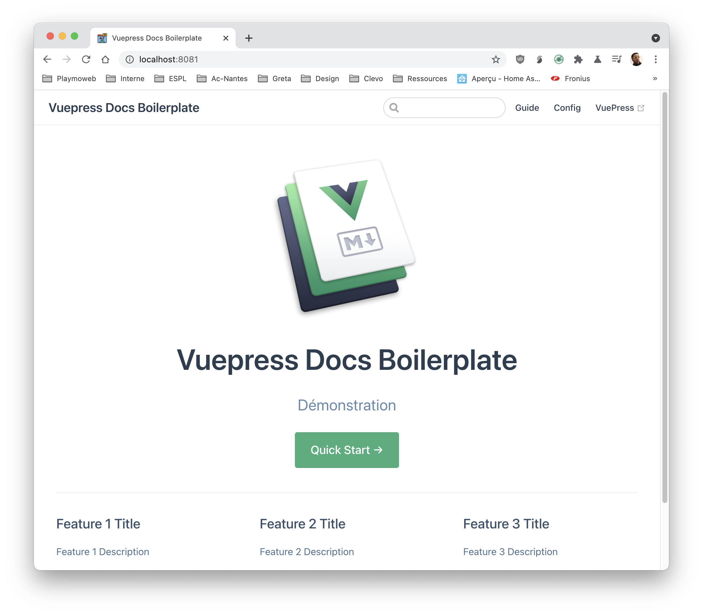
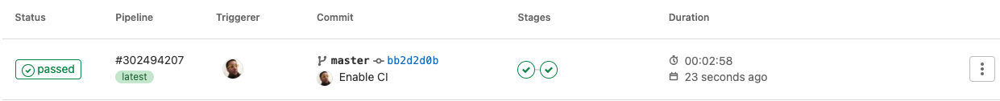
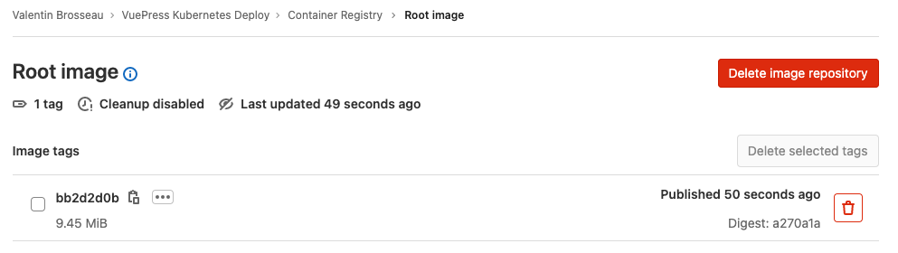
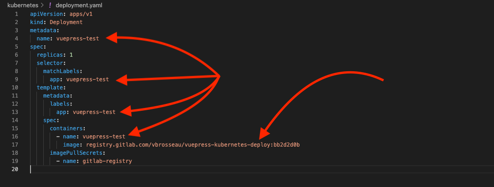

# Déployer une Image Docker dans Kubernetes

Nous avons vu précédemment qu'il était possible de compiler puis de packager une application grâce à Gitlab-CI, dans ce TP nous allons voir comment déployer cette image (**présente dans un registry privée**) dans un cluster Kubernetes

::: details Sommaires
[[toc]]
:::

## Introduction

Dans ce TP nous allons voir comment :

- Configurer un cluster Kubernetes simple avec `k3d`.
- Comment autoriser le cluster Kubernetes à « pull » l'image depuis le repo privé de Gitlab.
- Comment lancer & autoriser les connexions sur un port accessible depuis le réseau.

::: tip Contenu non exhaustif
Kubernetes est un sujet très large qui est très large. Dans ce TP nous poserons uniquement les bases, celle-ci vous servirons à découvrir le fonctionnement de Kubernetes, mais également comme l'utiliser dans un usage « avancés » c'est-à-dire sans forcément utiliser une image sur le hub public de Docker.
:::

## Le Cluster

Contrairement à un simple Docker, compose Kubernetes reposes sur un principe de Cluster. Le cluster n'est pas « une simple image ». Il s’agit d'un outil d'orchestration qui regroupera à la fois :

- Les images (container).
- Les paramétrages des volumes.
- Le nombre d'instances déployé.
- Le réseau
- En passant par l'exposition des services.

L'idée ici est donc de gérer l'ensemble de votre « stack » et pas seulement la combinaison d'images dans un Docker-Compose. L'ensemble de votre configuration sera configurée en YAML dans _un_ ou **plusieurs** fichiers.

Nous allons avoir plusieurs possibilités pour créer notre cluster, il existe plusieurs « logiciels » permettant de créer des Clusters Kubernetes :

- k8s
- minikube
- k3s
- k3d (en réalité c'est k3s in Docker)
- kind
- …

Beaucoup de possibilité pour répondre à des cas d'usage différents, le plus simple dans notre cas c'est « k3d » ; pourquoi ? Car il permet de déployer un cluster Kubernetes dans un environnement conteneurisé type Docker.

::: warning Du YAML ?
Oui… Beaucoup de YAML ! Mais vous allez voir… Une fois une bonne base en place c'est « plutôt simple ».


:::

::: danger Gérer son cluster… kubectl ? helm ?
Le monde Kubernetes est rempli de plusieurs outils, les différents outils ont été créé à différentes époques et répondent à des besoins différents, et surtout des tailles de projet différentes.

Pour cette introduction, je vais rester sur l'outil de base à savoir `kubectl`, il sera amplement suffisant et vous les verrez il nous permettra même de déployer sans trop de difficultés en automatique dans un flow de CI/CD.
:::

### k3d

Nous allons donc installer [k3d](https://k3d.io/), l'installation va être relativement simple, il s'agit ici juste d'un petit outil qui nous permettra de créer / initialiser, mais également de manager nos différents clusters.

Pour l'installation, je vous laisse vous reporter [à la documentation officielle](https://github.com/rancher/k3d#get) en effet, en fonction de votre OS l'installation sera évidemment différente.

Une fois installé sur votre machine / serveur, vous devriez pouvoir jouer dans votre terminal la commande :

```sh
$ k3d --version
k3d version v4.4.3
k3s version v1.20.6-k3s1 (default)
```

Dans mon cas, j'ai donc la version `4.4.3` de k3d.

#### Initialiser un Cluster

Pour l'instant nous n'avons pas initialisé de cluster, notre machine / serveur est toujours identique à avant l'installation. La création de clusters va se réaliser via la commande `k3d` récemment installés. Pour faire simple, si vous souhaitez créer un cluster il vous suffira de :

```sh
k3d cluster create --api-port 20135 -p "8080:80@loadbalancer" --volume ./volume/:/data/ -s 1 -a 2 monCluster
```

**Avant de jouer la commande comme un sauvage**, détaillons un peu ce que vous allez lancer sur votre machine :



| Options                     | Usage                                                                                       |
| --------------------------- | ------------------------------------------------------------------------------------------- |
| `cluster`                   | Indique que nous souhaitons gérer la partie cluster                                         |
| `create`                    | Indique que nous souhaitons créer un nouveau cluster                                        |
| `--api-port 20125`          | Port d'écoute de la partie API **de management** du cluster                                 |
| `-p "8888:80@loadbalancer"` | Expose le port `8888` sur votre machine, il permettra d'accéder à votre « service déployé » |
| `--volume ./volume/:/data/` | Fournis un espace de stockage persistant à votre cluster                                    |
| `-s 1`                      | Indique que vous souhaitez 1 serveur                                                        |
| `-a 2`                      | Indique que vous souhaitez 2 agents                                                         |
| `monCluster`                | Le nom du cluster que vous souhaitez créer                                                  |

Vous pouvez maintenant lancer la commande. Dans quelques minutes / secondes en fonctions de votre machine vous aurez un cluster Kubernetes disponible.

::: tip C'est dans « du docker »

Vous pouvez vérifier que nous sommes bien dans différents Container Docker via un simple `docker ps`.


:::

Votre cluster Kubernetes est maintenant **opérationnel**, vous pouvez déployer dessus ce que vous souhaitez. Si vous avez initialisé le cluster sur votre machine, celui-ci est normalement disponible immédiatement.

Cependant, je vous invite à réaliser un cluster « distant » ; même si fondamentalement ça ne change pas grand-chose au fonctionnement, vous devrez vous poser des questions toutes bêtes comme par exemple :

« Mais comment j'accède à distance à mon Cluster ? Comment est gérée la sécurité de mon cluster ? »

### Accès du cluster à distance

Nous allons donc voir comment « récupérer » la configuration du cluster `monCluster` que nous avons initialisé précédemment.

::: warning Pourquoi est-ce important à mon avis ?

Dans le monde réel, il est peu probable que votre cluster Kubernetes soit en local sur votre serveur, l'intérêt est très limité et l'ajout de Kubernetes serait très subjectif…

Même si ce TP utilise une implémentation « simple » d'un cluster Kubernetes, il peut complètement être utilisé dans le cadre d'un environnement de développement. Et dans ce cadre, il est évident qu’accéder à son cluster à distance est primordial.

:::

k3d (ou k3s in Docker) utilise la même logique d'authentification que les autres solution Kubernetes du marché. Ça repose comme souvent avec Kubernetes sur … un fichier YAML, celui-ci va contenir l'ensemble de la configuration et des clés d'accès de votre cluster.

Il est donc **important que celui-ci reste privé**, vous ne devez jamais le partager, le comité dans un dépot public, voire le diffuser en ligne. Car évidemment celui-ci donne les pleins pouvoirs pour modifier / déployer / interagir avec votre Cluster.

Pour forcer `k3d` à écrire la configuration de votre Cluster, il faut saisir la commande:

```sh
$ k3d kubeconfig write monCluster
/home/vbrosseau/.k3d/kubeconfig-monCluster.yaml
```

À cette étape, vous venez d'écrire la configuration de votre Cluster dans votre serveur. Cette configuration va nous permettre par la suite de piloter le cluster via **votre ordinateur**.

Le fichier est sauvegardé dans le dossier `.k3d` dans la home de votre utilisateur. Vous pouvez la récupérer via un `scp` (ou autre solution de transfert).

```sh
scp vbrosseau@monServer.dev:.k3d/kubeconfig-monCluster.yaml .
```

Et voilà vous avez maintenant l'ensemble des `secrets` nécessaires pour que votre serveur vous reconnaisse 👋. Pour les fournir à `kubectl` il suffit de :

```sh
export KUBECONFIG=kubeconfig-monCluster.yaml
kubectl cluster-info
```

Si vous avez bien suivi… vous devriez avoir les informations de votre cluster.

::: danger STOP !
La curiosité n'est pas un vilain défaut ! Regardons ensemble le contenu du fichier que vous venez de récupérer !
:::

Votre Cluster est maintenant pleinement fonctionnel. Il est pour l'instant vide, mais vous allez voir, nous allons très prochainement déployer votre application.

### kubectl ?

`kubectl` est l'outil officiel permettant de gérer votre cluster Kubernetes. [Pour l'installation je vous laisse suivre la documentation officielle](https://kubernetes.io/docs/tasks/tools/) :

- [Linux](https://kubernetes.io/docs/tasks/tools/install-kubectl-linux/) (ou via votre gestionnaire de paquet)
- [Windows](https://kubernetes.io/docs/tasks/tools/install-kubectl-windows/)
- [MacOS](https://kubernetes.io/docs/tasks/tools/install-kubectl-macos/) (ou via brew)

### Les solutions payantes

Bon, même si ce n’est pas le sujet de ce TP, il faut avoir en tête qu'il existe énormément de solutions pour monter un Cluster Kubernetes. Ici nous avons créé un cluster avec `k3s` (via `k3d`), aucun problème votre cluster va fonctionner comme attendu. **Cependant** cette solution est valide pour expérimenter Kubernetes ou pour déployer une application perso.

Si vous souhaitez utiliser Kubernetes **en prod** ou de manière professionnelle, je vous conseille vivement de passer par une solution manager du type :

- [Kubernetes sur AWS](https://aws.amazon.com/fr/kubernetes/)
- [Google Engine Kubernetes](https://cloud.google.com/kubernetes-engine)
- [OVH Kubernetes](https://www.ovhcloud.com/en/public-cloud/kubernetes/)
- [Kubernetes Kapsule de Scaleway](https://www.scaleway.com/en/kubernetes-kapsule/)

L'usage de ce type de solution ne change rien à ce que nous avons vu / allons voir. Leur avantage c'est que vous n'avez rien à gérer, la solution est **managée** par le fournisseur de service.

## Créer l'image Docker via Gitlab-CI

Avant d'aller plus loin… Il nous faut quelque chose à déployer. Dans Kubernetes nous pouvons déployer différents types d'application :

- Des outils sans « interface » (HTML, ou API).
- Des API (exposée en HTTP).
- Un site Internet.
- Une base de données
- Une combinaison de site Internet + API + BDD

Bref, ce que vous souhaitez donc !

### Le projet

Pour débuter nous allons déployer un projet simple, je vous propose de déployer un projet similaire à la documentation que vous êtes entrain de lire. La solution que j'utilise s'appelle [VuePress](https://vuepress.vuejs.org/), cette solution permet de créer rapidement un site à partir de fichier `Markdown` nous sommes donc en plein dans la JamStack.

**-> Je vous laisse regarder un peu la documentation de VuePress avant de continuer**

Pour créer un projet VuePress, il suffit d'entrer la commande :

```sh
npx create-vuepress-site vuePressInKube
```

::: tip Au passage
Je vous avais parlé de `pnpm` précédemment… Ici si vous souhaitez l'utiliser également vous pouvez faire `pnpx` à la place à `npx`.
:::

Avant d'aller plus loin, je vous laisse :

- Tester que ça fonctionne en local avec un `npm install` puis un `npm run dev` (attention à être dans le dossier `docs`).
- Créer votre projet sur Gitlab et créer une première version du dossier `docs`.

Pour le premier point si tout va bien vous devriez avoir :



### Le Docker File

Si tout est bon, continuons, nous allons maintenant créer une image Docker de votre site. C'est celle-ci que nous déploierons dans notre container.

Ici il s'agit d'un site Internet, donc comme [dans le TP sur le packaging avec Docker](/tp/ci/packager-docker.md) nous utiliserons une image « simpliste » à base de nginx.

Cette image aura pour but de prendre le résultat du Build de VuePress pour l'héberger de manière statique. La première version est donc de créer une première version via :

```sh
pnpm run build
```

Votre site static est généré dans le dossier `src/.vuepress/dist` c'est ce dossier que nous allons mettre dans notre image Docker.

Je vous laisse créer le dossier `Dockerfile` dans le dossier `docs` avec le contenu suivant

```yaml
FROM nginx:stable-alpine
COPY src/.vuepress/dist /usr/share/nginx/HTML
EXPOSE 80
CMD ["nginx", "-g", "daemon off;"]
```

::: danger STOP !

Avant de pusher votre code, tester sur votre ordinateur le bon fonctionnement !

```sh
docker build -t vuepress:test .
docker run -it -p 8888:80 --rm --name vuepresstest vuepress:test
```

« Votre site » doit-être accessible sur [le port 8888](http://localhost:8888)

:::

### La CI

L'idée dans ce TP est de faire générer l'image Docker automatiquement par Gitlab-CI afin de la récupérer de manière privée dans notre cluster Kubernetes. Nous allons donc configurer la CI de Gitlab pour générer une nouvelle image Docker à chaque fois qu'un commit arrive dans la `master`.

Cette image Docker sera taguée avec l'identifiant du commit en question. Cette étape est **identique** à ce que nous avons déjà fait précédemment dans le TP [Packager avec Docker](/tp/ci/packager-docker.md#packager).

Je vous laisse regarder comment nous avions fait, afin de reprendre la même logique dans ce projet. En deux mots l'opération sera la suivante :

- Créer un fichier `.gitlab-ci.yml` à la racine de votre projet.
- Ajouter la configuration qui permettra de `builder le projet` puis de `builder l'image docker`.
- Commiter et pusher votre projet pour que Gitlab-CI lance la compilation.

**Attention**, dans le cas présent les étapes de compilation « JS » seront plus simples que dans l'exemple du TP dont vous vous inspirez, un simple `npm run build` sera certainement suffisant ;).

::: warning Tester c'est douter ?
Avant d'envoyer l'image dans notre cluster Kubernetes, je vous propose de tester que celle-ci fonctionne correctement. Après le build, tester de la récupérer pour la lancer sur votre Docker local.
:::

::: details En manque d'inspiration ?

Avez-vous vraiment cherchez ? Si oui… Voilà un exemple de `.gitlab-ci.yml` qui fonctionne :

```yml
stages:
  - build
  - release

build:
  image: node:latest
  stage: build
  script:
    - npm install
    - npm run build
  artifacts:
    paths:
      - src/.vuepress/dist
  only:
    - master

release:
  image: docker:19.03.12
  stage: release
  dependencies:
    - build
  services:
    - docker:19.03.12-dind
  variables:
    IMAGE_TAG: $CI_REGISTRY_IMAGE:$CI_COMMIT_SHORT_SHA
  script:
    - docker login -u $CI_REGISTRY_USER -p $CI_REGISTRY_PASSWORD $CI_REGISTRY
    - docker build -t $IMAGE_TAG .
    - docker push $IMAGE_TAG
  only:
    - master
```

:::

### L'image Docker

Si tout s'est bien passé, vous avez maintenant une première version de votre application dans votre Registry Privée, celle-ci contient une version de votre application.

Le registry étant privé, nous allons devoir autoriser le cluster Kubernetes à communiquer avec celui-ci. Rien de bien compliqué rassurez-vous.




## Déployer l'image sur le cluster Kubernetes

Nous attaquons maintenant la partie qui vous intéresse, j'imagine :smile:, comment déployer cette image dans notre cluster Kubernetes.

### Introduction

Comme je disais en introduction nous allons devoir écrire quelques fichiers YAML. Ces fichiers ont chacun une fonction :

- `deployment.yaml` va contenir l'ensemble des paramètres liés à votre déploiement (images à déployer, nombre de replicas, nom de votre projet, la référence à vos secrets de pull Docker).
- `services.yaml` va indiquer le ou les ports disponibles à l'intérieur de votre/vos image(s).
- `ingress.yaml` va indiquer comment le port ou les ports doivent-être exposé à vos clients (path, ou sur un domaine en particulié)

Ces fichiers sont « presque » toujours identiques entre chaque déploiement, c'est pour ça que des solutions comme `helm` existent. Pour simplifier, dans notre cas je vais vous donner les fichiers.

Cependant, si vous souhaitez vraiment maitriser ce que nous sommes entrain de voir, je vous invite vivement à regarder ce que vous indiquer dans les fichiers.

::: tip Les paramètres importants ?
Même si tous les paramètres sont importants deux doivent attirer votre attention :

- le `name`, présent dans l'ensemble des fichiers, c'est le nom de votre projet à déployer.
- le `image`, c'est le lien vers votre image Docker à déployer (privée ou publique). Si l'image est privée il faudra indiquer un `imagePullSecrets`.


:::

### Le secret

Nous l'avons vu tout à l'heure, pour communiquer avec votre Cluster il faut être authentifié. Attention si vous avez fermé le terminal depuis il faut exporter à nouveau la variable `$KUBECONFIG`.

```sh
export KUBECONFIG=~/emplacement/vers/le/secret/kubeconfig-monCluster.yaml
```

### L'authentification avec le Registry Gitlab

Même si il est complètement possible d'utiliser le Docker Hub j'ai fait le choix de vous montrer directement comment utiliser une image sur un `Registry privé`. Pourquoi ? À mon sens, c'est très certainement la première problématique que vous rencontrerez. En effet dans le cadre du déploiement continu à part travailler sur un projet « Open Source » publique il y a fort à parier que votre entreprise ne souhaite pas vraiment avoir son code source disponible publiquement en ligne…

**C'est pour ça qu'il est important** de maitriser cet aspect. Kubernetes est complètement capable d'utiliser le Registry de Gitlab, il faut juste lui donner « vos identifiants ». Évidemment vous n'aller pas donner votre login et votre mot de passe.

| <iframe src="https://giphy.com/embed/gIfdqZA4ECvMVrRpSv" width="480" height="360" frameBorder="0" class="giphy-embed" allowFullScreen></iframe> |
| :---------------------------------------------------------------------------------------------------------------------------------------------: |
|                            On est bien d'accord, vous ne DONNEZ JAMAIS VOTRE LOGIN ET VOTRE MOT DE PASSE. **JAMAIS**                            |

Cette fois-ci pas de YAML, mais **une simple commande** :

```sh
kubectl create secret docker-registry gitlab-registry --docker-server="https://registry.gitlab.com" --docker-username="VOTRE_UTILISATEUR_GITLAB" --docker-password="TOKEN_OBTENU_PAR_GITLAB" --docker-email="VOTRE_EMAIL_GITLAB" -o yaml --dry-run=client | kubectl apply -f -
```

Pour générer le Token, il suffit de passer par les paramètres de votre profile :


::: warning Be curious !
Inspecter, regarder, questionner moi, l'important est de comprendre ce que vous êtes entrain de faire. Dans le cas présent tenter de jouer la commande sans la fin (`| kubectl apply -f -`), vous allez voir le contenu de la configuration envoyé à votre cluster Kubernetes.

Et oui… C'est encore du YAML :cry:
:::

### La configuration

Cette partie, je vous la donne « pour débuter ». Je vous laisse cependant ajuster les différents paramètres dans les différents fichiers.

|  |
| :-------------------------------------------------------: |
|              Exemple dans le deployment.yml               |

::: tip On commit, ou on ne commit pas ?
Gros débat… Dans un projet privé pas de problème, cette configuration peut accompagner le projet… dans le cas d'un projet « publique » attention à ne pas commiter un YAML qui ferait référence à des informations privées / non destinée aux publiques (IP, port, …)
:::

::: danger Par contre
Ce qui est certain par contre, c'est que nous ne commiterons **jamais** le fichier `kubeconfig-monCluster.yaml` qui contient les secrets de votre cluster.
:::

#### Le deployment.yml

```yaml
apiVersion: apps/v1
kind: Deployment
metadata:
  name: vuepress-test
spec:
  replicas: 1
  selector:
    matchLabels:
      app: vuepress-test
  template:
    metadata:
      labels:
        app: vuepress-test
    spec:
      containers:
        - name: vuepress-test
          image: registry.gitlab.com/vbrosseau/vuepress-kubernetes-deploy:bb2d2d0b
      imagePullSecrets:
        - name: gitlab-registry
```

::: danger image
N'oubliez pas de changer le lien de l'image vers **votre** image dans le registry gitlab.
:::

#### Le services.yml

```yaml
apiVersion: v1
kind: Service
metadata:
  name: vuepress-test
spec:
  selector:
    app: vuepress-test
  ports:
    - port: 80
      targetPort: 80
      protocol: TCP
```

#### Le ingress.yml

```yaml
apiVersion: networking.k8s.io/v1
kind: Ingress
metadata:
  name: vuepress-test
  annotations:
    ingress.kubernetes.io/ssl-redirect: "false"
spec:
  rules:
    - http:
        paths:
          - path: /
            pathType: Prefix
            backend:
              service:
                name: vuepress-test
                port:
                  number: 80
```

### Déployer votre application

Pour le déploiement, c'est plutôt simple il suffit de communiquer avec votre serveur avec `kubectl` :

```sh
kubectl apply -f deployment.yaml
kubectl apply -f services.yaml
kubectl apply -f ingress.yaml
```

Le déploiement va prendre quelques minutes, vous pouvez le suivre avec les commandes suivante :

--> Obtention de l'état du pod `kubectl describe pod vuepress-test`
--> Vérification de déploiement `kubectl get deployments`
--> Vérification des pod(s) qui tourn(ent) `kubectl get pods`

Pour la configuration des services et de l'ingress :

--> Vérification de l'application : `kubectl get services`
--> Vérification de leur application : `kubectl get ingress`

### Tester

Votre application est maintenant disponible, si vous vous souvenez quand nous avons créé le cluster nous avons indiqué un port pour le load balancer. Si vous n'avez rien changé, c'est le `8888`. Rendez-vous à `IP.DE.VOTRE.SERVEUR:8888` pour voir votre déploiement.

Je vous laisse regarder à nouveau :

- Le `docker ps`.
- Le `kubectl get pods`.

## Déployer une mise à jour

Déployer une nouvelle version va être beaucoup plus simple **(c'est la force de toute cette construction)**. Je vous laisse procéder :

- Modifier le code (page, thème, etc).
- Créer un commit et pusher la modification.
- Attendez que la nouvelle version de votre application soit dans le registry gitlab.

::: tip À votre avis
Selon vous, comment allons-nous déployer une nouvelle version de votre application dans le cluster ?

- Quel fichier allons-nous modifier ?
- Quelle commande allons-nous faire pour déployer une nouvelle version ?
  :::

### Modifier le deployment.yml

Déployer une nouvelle version de notre application va être très très simple. Maintenant que nous avons une nouvelle version de notre application dans le registry, il suffit de :

- Modifier l'image dans le fichier `deployment.yml`
  - Dans mon cas`image: registry.gitlab.com/vbrosseau/vuepress-kubernetes-deploy:LE_NOUVEAU_HASH`
- Appliquer la nouvelle configuration sur le Cluster `kubectl apply -f deployment.yaml`

Et c'est tout ! Patientez une ou deux minutes votre modification est en ligne !

## La suite ?

Je pense que vous avez compris la suite ? C'est simple de redéployer, tellement simple que l'automatiser va être également très simple!

La suite de cette introduction ça va être le déploiement automatisé en cas de mise à jour du projet. [La suite c'est par ici =>](./cd-avec-kubernetes.md)
