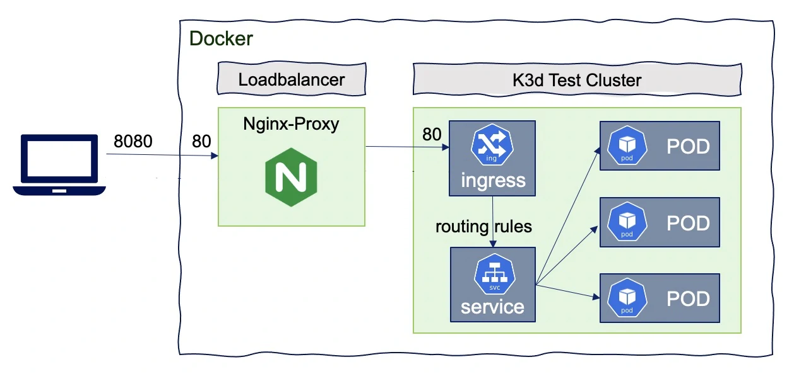

# Déployer une Image Docker dans Kubernetes

Nous avons vu précédemment qu'il était possible de compiler puis de packager une application grace à Gitlab-CI, dans ce TP nous allons voir comment déployer cette image (**présente dans un registry privée**) dans un cluster Kubernetes

::: details Sommaire [[toc]] :::

## Introduction

Dans ce TP nous allons voir comment :

- Configurer un cluster Kubernetes simple avec `k3d`.
- Comment autoriser le cluster Kubernetes à « pull » l'image depuis le repo privé de Gitlab.
- Comment lancer & autoriser les connexions sur un port accessible depuis le réseau.

::: tip Contenu non exhaustif
Kubernetes est un sujet très large qui est très large. Dans ce TP nous poserons uniquement les bases, celle-ci vous servirons à découvrir le fonctionnement de Kubernetes, mais également comme l'utiliser dans un usage « avancés » c'est-à-dire sans forcément utiliser une image sur le hub public de Docker. :::

## Le Cluster

Contrairement à un simple Docker, compose Kubernetes reposes sur un principe de Cluster. Le cluster n'est pas « une simple image ». Il s’agit d'un outil d'orchestration qui regroupera à la fois :

- Les images (container).
- Les paramétrages des volumes.
- Le nombre d'instances déployé.
- Le réseau
- En passant par l'exposition des services.

L'idée ici est donc de gérer l'ensemble de votre « stack » et pas seulement la combinaison d'images dans un Docker-Compose. L'ensemble de votre configuration sera configurée en YAML dans _un_ ou **plusieurs** fichiers.

Nous allons avoir plusieurs possibilités pour créer notre cluster, il existe plusieurs « logiciels » permettant de créer des Clusters Kubernetes :

- k8s
- minikube
- k3s
- k3d (en réalité c'est k3s in Docker)
- kind
- …

Beaucoup de possibilité pour répondre à des cas d'usage différents, le plus simple dans notre cas c'est « k3d » ; pourquoi ? Car il permet de déployer un cluster Kubernetes dans un environnement conteneurisé type Docker.

::: warning Du YAML ?
Oui… Beaucoup de YAML ! Mais vous allez voir… Une fois une bonne base en place c'est « plutôt simple ».
:::


::: danger Gérer son cluster… kubectl ? helm ?
Le monde Kubernetes est rempli de plusieurs outils, les différents outils ont été créé à différentes époques et répondent à des besoins différents, et surtout des tailles de projet différentes.

Pour cette introduction, je vais rester sur l'outil de base à savoir `kubectl`, il sera amplement suffisant et vous les verrez il nous permettra même de déployer sans trop de difficultés en automatique dans un flow de CI/CD.
:::

### k3d

Nous allons donc installer [k3d](https://k3d.io/), l'installation va être relativement simple, il s'agit ici juste d'un petit outils qui nous permettra de créer / initialiser mais également de manager nos différents cluster.

Pour l'installation, je vous laisse vous reporter [à la documentation officiel](https://github.com/rancher/k3d#get) en effet, en fonction de votre OS l'installation sera évidemment différentes.

Une fois installé sur votre machine / serveur, vous devriez pouvoir jouer dans votre terminal la commande :

```sh
$ k3d --version
k3d version v4.4.3
k3s version v1.20.6-k3s1 (default)
```

Dans mon cas, j'ai donc la version `4.4.3` de k3d.

#### Initialiser un Cluster

Pour l'instant nous n'avons pas initalisé de cluster, notre machine / serveur est toujours identique à avant l'installation. La création de cluster va se réaliser via la commande `k3d` récemment installé. Pour faire simple, si vous souhaitez créer un cluster il vous suffirat de :

```sh
k3d cluster create --api-port 20135 -p "8080:80@loadbalancer" --volume ./volume/:/data/ -s 1 -a 2 monCluster
```



**Avant de jouer la commande comme un sauvage**, détaillons un peu ce que vous aller lancer sur votre machine :

| Options                     | Usage                                                                                       |
| --------------------------- | ------------------------------------------------------------------------------------------- |
| `cluster`                   | Indique que nous souhaitons gérer la partie cluster                                         |
| `create`                    | Indique que nous souhaitons créer un nouveau cluster                                        |
| `--api-port 20125`          | Port d'écoute de la partie API **de management** du cluster                                 |
| `-p "8888:80@loadbalancer"` | Expose le port `8888` sur votre machine, il permettra d'accéder à votre « service déployé » |
| `--volume ./volume/:/data/` | Fourni un espace de stockage persistant à votre cluster                                     |
| `-s 1`                      | Indique que vous souhaitez 1 serveur                                                        |
| `-a 2`                      | Indique que vous souhaitez 2 agents                                                         |
| `monCluster`                | Le nom du cluster que vous souhaitez créer                                                  |

Vous pouvez maintenant lancer la commande. Dans quelques minutes / secondes en fonctions de votre machine vous aurez un cluster Kubernetes disponibles.

::: tip C'est dans « du docker »
Vous pouvez vérifier que nous sommes bien dans différents Container Docker via un simple `docker ps`.


:::

#### Accès du cluster à distance

### Les solutions payantes

Alternative payante PaaS à k3d

## Créer l'image Docker via Gitlab-CI

### Le projet

### La CI

### L'image Docker

## Déployer l'image sur le cluster Kubernetes

### Introduction

### L'authentification avec le Registry Gitlab

### Le deployment.yml

### Le services.yml

### Le ingress.yml

## Déployer une mise à jour

### Votre code et la CI

### Modifier le deployment.yml

Pourquoi ? le nom du tag… etc

## La suite ?

La suite de cette introduction ça va être le déploiement automatisé en cas de mise à jour du projet. [La suite c'est par ici =>](./cd-avec-kubernetes.md)
