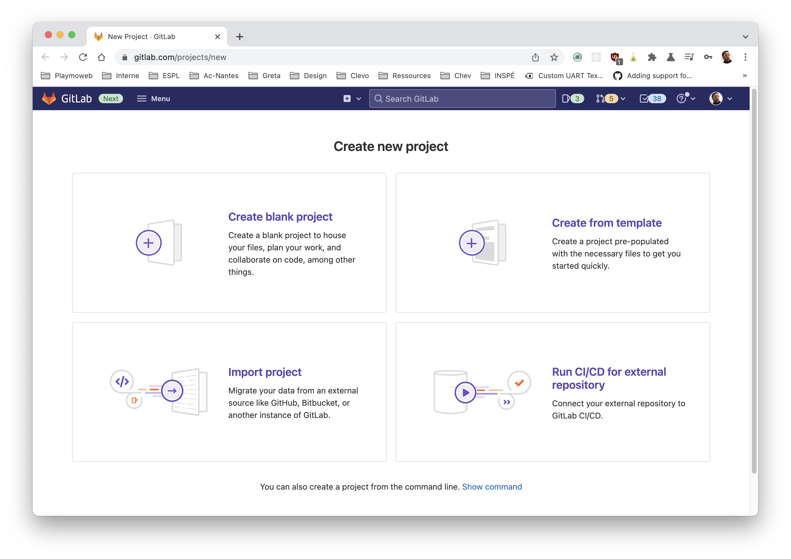
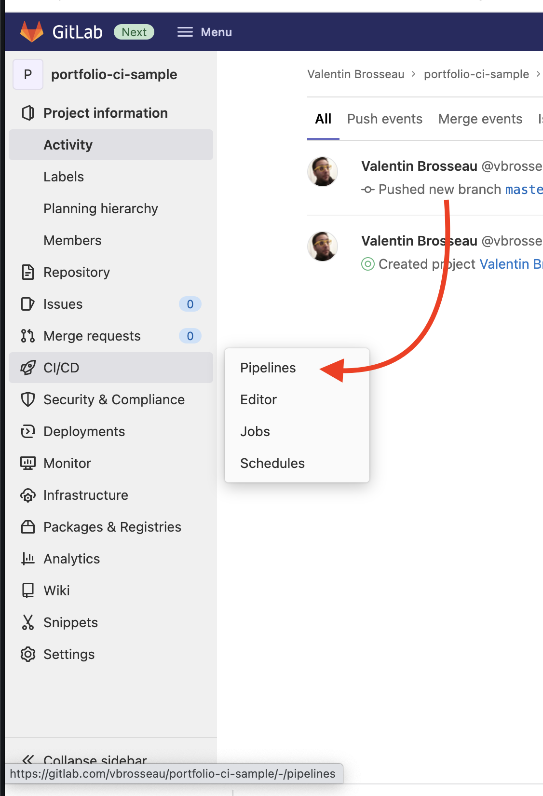
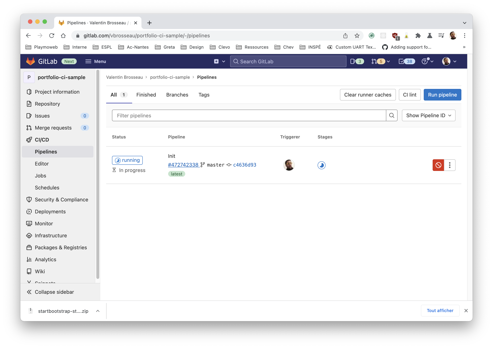
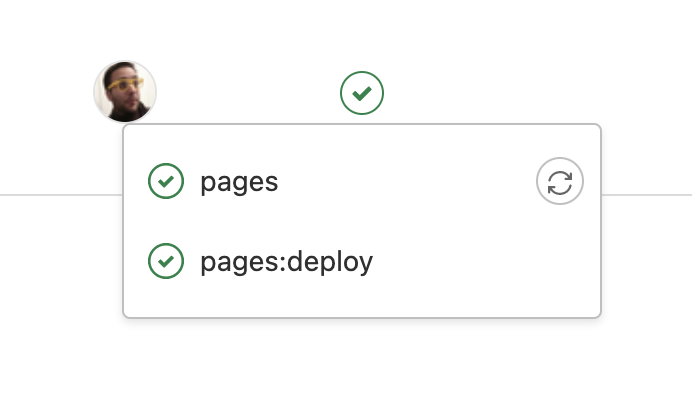
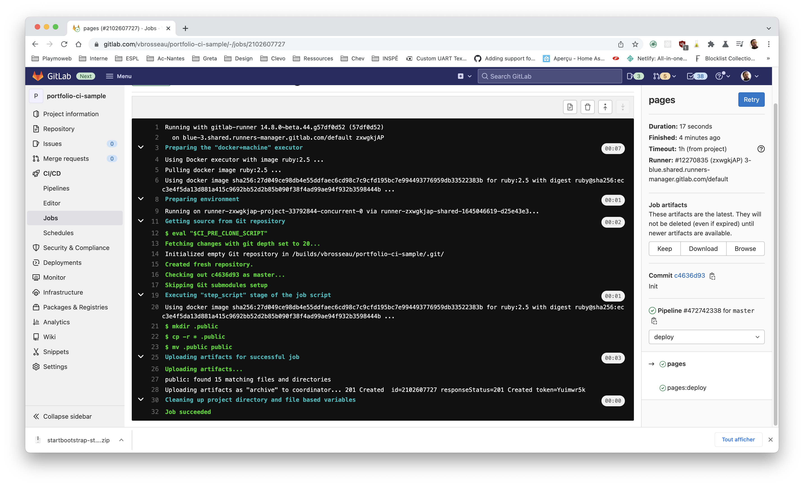

# Déployer votre portfolio avec GitLab Pages

::: details Sommaires [[toc]] :::

## Introduction

Dans ce TP vous allez mettre en ligne votre Portfolio sur Gitlab Pages grâce à Gitlab-CI. Dans [le TP précédent](/tp/ci/jamstack/netlify-portfolio.md) nous avons utilisé Netlify avec une solution en « 1 click » / « clé en main », ici la procédure sera un peu plus compliquée, mais vous allez le voir elle permettra beaucoup plus de choses.

## Création d’un nouveau projet sur Gitlab

Pour commencer, créez [un nouveau projet sur votre compte Gitlab](https://gitlab.com/projects/new).



Nommez-le comme vous le souhaitez, c’est votre projet après tout…

Voilà, nous pouvons continuer !

## Votre portfolio

Nous allons utiliser à nouveau votre portfolio comme support à livrer, je vous laisse mettre le code source sur Gitlab.

::: tip Un instant !

Vous avez très certainement déjà envoyé votre code source sur Github, pas de problème, ici nous allons l'envoyer sur Gitlab. Pour simplifier, je vous propose de copier votre code source (sans le `.git`) dans un nouveau dossier.

:::

Commitez et pushez votre travail sur GitLab (dans le projet que vous venez de créer)

Rappel :

```sh
git add -A
git commit -am "Mon premier commit"
git push
```

::: warning N'oubliez pas !
⚠️ Pour pusher votre code il faut avoir ajouté la remote, pour ça vous pouvez suivre les instructions données par GitLab lors de la création du projet.
:::

::: details Vous n'avez pas de code source ?

Vous n'avez pas de Portfolio ? Aucun problème [vous pouvez utiliser celui-ci.](https://startbootstrap.com/theme/stylish-portfolio)

PS: N'oubliez pas que vous devez avoir un portfolio de prêt pour votre passage de titre.
start
:::

## Activation de GitLab-CI

Maintenant que votre première version est prête, nous allons activer Gitlab-CI pour ça, il faut **simplement** créer un fichier intitulé `.gitlab-ci.yml` à la racine de votre projet. Mettez-y le contenu suivant :

```yml
pages:
  stage: deploy
  script:
    - mkdir .public
    - cp -r * .public
    - mv .public public
  artifacts:
    paths:
      - public
  only:
    - master
```

::: Un instant

Regarder le contenu du fichier, étudier les différentes instructions.

- Que font les instructions / commandes dans `script` ?
- À quoi correspond artifacts ?
- `only: master` ? Que se passe-t-il si vous créez une branche à votre avis ?

:::

## Push de votre code

Pushez votre code sur GitLab, votre portfolio va « se compiler » dans la partie CI. Attendez quelques secondes, votre site web est maintenant en ligne.

## Voir votre site

Après quelques secondes, votre site va être disponible, oui, mais où ? Le système de Gitlab Pages s'active automatiquement, vous retrouverez l'adresse dans le menu : « Settings > Pages »


## Gitlab-CI ≠ Netlify

Sur le papier Netlify semble très proche de Gitlab-CI, mais en réalité les deux solutions sont vraiment différentes, et Gitlab-CI est 1000× plus avancés que Netlify sur la partie « Compilation »

Chez Gitlab, les étapes de compilation sont appelées des Pipelines





Contrairement à Netlify, nous avons ici la vision de l'ensemble des opérations



Et surtout la vision détaillée des opérations du « runner » Gitlab :



::: tip Différence majeure avec Netlify ?

Vous pouvez avoir des sites accessibles uniquement par vous. Pratique pour de la documentation par exemple !

:::

## Apporter une modification

Je vous laisse valider que votre CI fonctionne correctement, apporter une modification à  votre site et vérifier que celle-ci est bien visible en ligne.

## Petit point d'étape

Ce que nous venons de faire est générique! Ça veut dire que si vous souhaitez héberger rapidement (et gratuitement) un petit site Internet codé en HTML, CSS, JavaScript vous avez l'ensemble des éléments.

Vous ajoutez à votre code source un fichier `.gitlab-ci.yml` avec le contenu précédent et c'est terminé quelques minutes plus tard votre site est en ligne.

C'est **LA** force de l'intégration continue !

## Allez plus loin

Écrire du code c’est bien, mais le faire en automatique c’est mieux. C’est pour ça que GitLab-CI et GitLab Pages existent, écrire du HTML pour une page c’est possible, mais quand il s’agit d’un site entier, ce n’est pas forcément adapté. C’est pour ça que l’on utilise régulièrement des CMS (écrit en PHP, Python, Ruby …), mais ce n’est pas la seule façon de faire.

On trouve aussi régulièrement des « générateurs de sites statiques », un générateur c’est un « logiciel » qui va « compiler » votre site pour générer toutes les pages de votre site web (sans avoir à tous les écrire).

Plusieurs avantages :

- Cout d’hébergement réduit (pas de PHP, juste du HTML).
- Sauvegarde simple (c’est juste des fichiers).
- Rapide ! (Oui, pas de PHP)

Inconvénients :

- À votre avis ?

### Déployer un site ViteJS

Je vous laisse observer l'exemple :

```yaml
image: node:16.5.0
pages:
  stage: deploy
  cache:
    key:
      files:
        - package-lock.json
      prefix: npm
    paths:
      - node_modules/
  script:
    - npm install
    - npm run build
    - cp -a dist/. public/
  artifacts:
    paths:
      - public
  only:
    - tags
```

Quelle différence notez-vous par rapport au précédent YAML?

::: tip Vous souhaitez tester ?

Si vous souhaitez créer un site avec ViteJS, vous pouvez utiliser la commande suivante :

```sh
npm create vite@latest
```

Une fois le projet créé, ajouter le fichier `.gitlab-ci.yml` et envoyer votre code sur Gitlab. La magie opérera d'elle-même.

:::

## Aller plus loin…

Compiler et héberger des sites statiques, ce n'est qu'une partie des possibilités de Gitlab-CI, vous pouvez faire bien plus !

Pour ceux qui voudrais mettre en place de l'intégration continue pour créer l'architecture [Docker pour héberger un site Laravel c'est par ici](/tp/ops/deployer-laravel-ci.md)

::: tip Ça semble compliqué ?

L'intégration continue ça peut faire peur… mais si vous maitrisez les codes et le fonctionnement de ce genre de plateforme, vous serez un moteur dans votre entreprise. Ne loupez pas le coche !

:::
