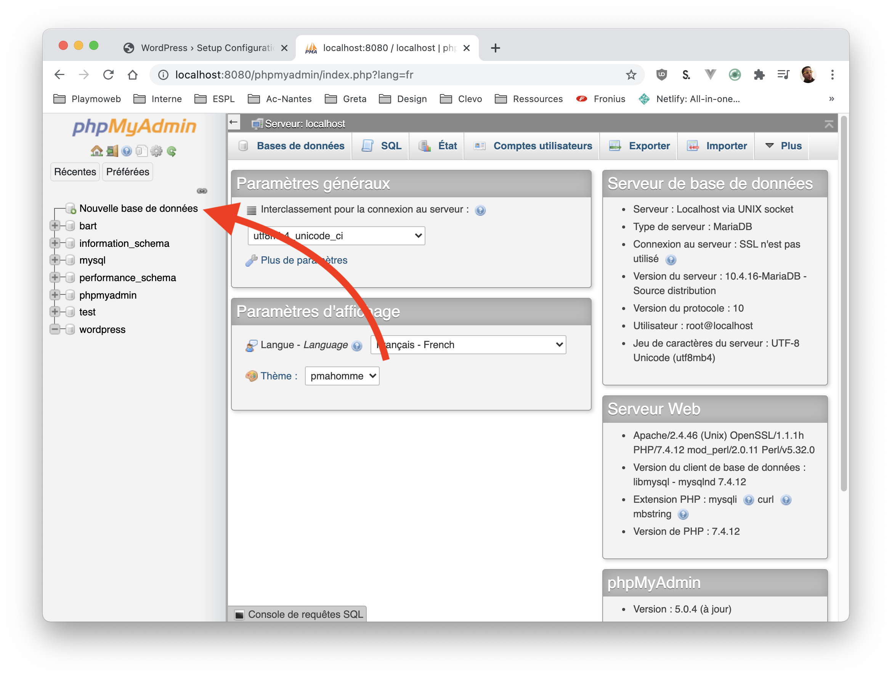
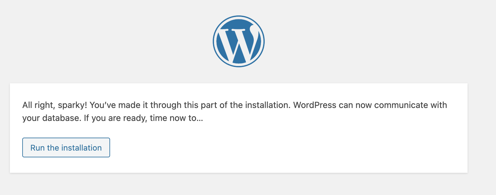
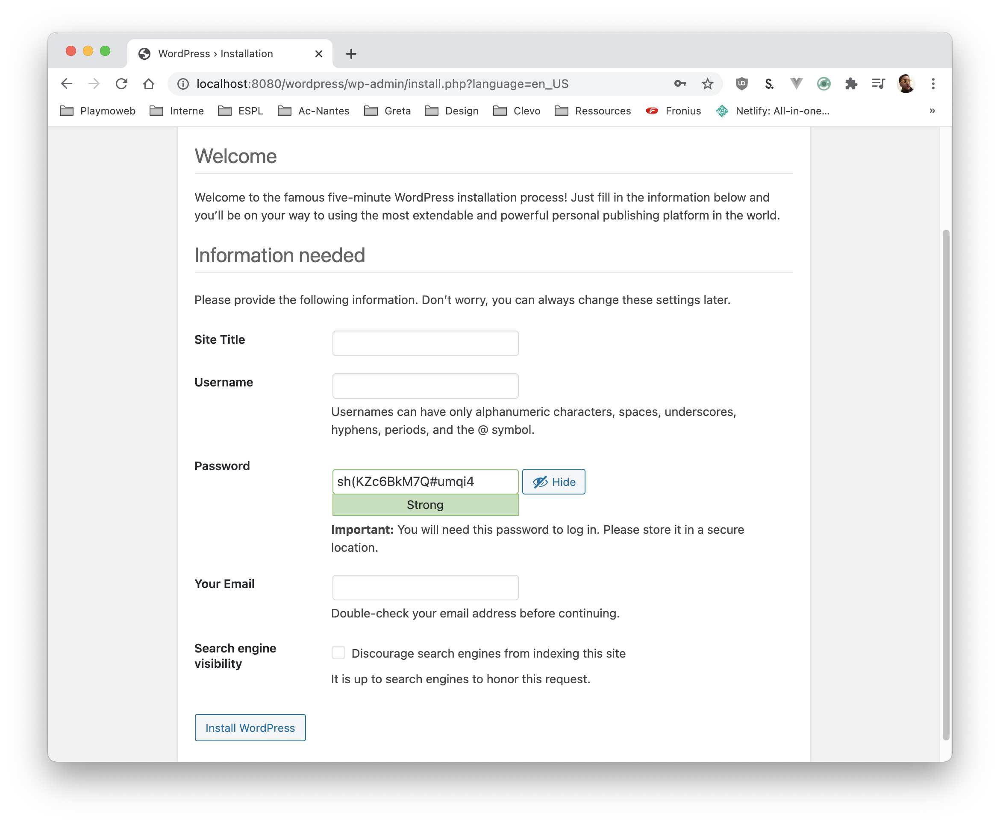
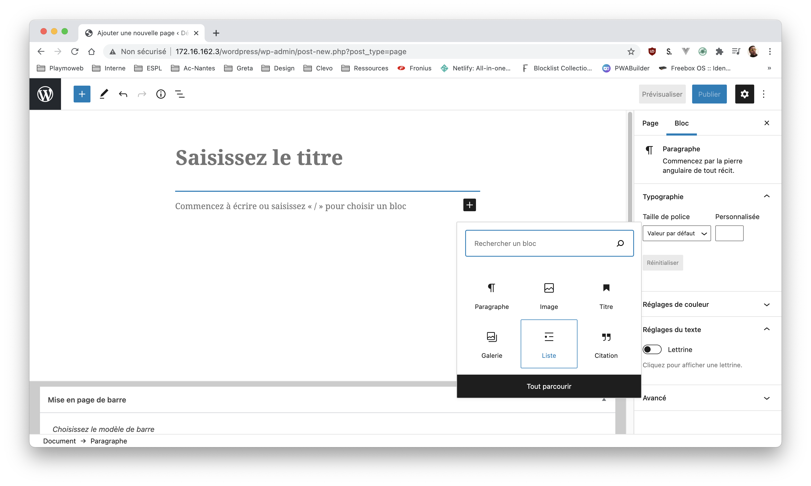

# Installer & Configurer Wordpress

Créer un site depuis zéro n'est pas la seule solution, en informatique nous avons également ce que nous appelons des CMS. Un CMS est un outil qui va nous fournir une base de code « Client & Administration » pour créer un site tel que :

- Un site web.
- Une boutique en ligne.
- Un Blog.

Pour toutes ces situations, vous avez la possibilité d'installer, de configurer, de personnaliser un CMS.

## Introduction

Dans ce document nous allons voir l'installation de Wordpress, sa configuration et sa personnalisation avec des plug-ins.

## Installer Wordpress

L'installation de la solution Wordpress est très simple elle se résume à

- [Télécharger Wordpress](https://fr.wordpress.org/download/)
- Extraire Wordpress « dans votre un dossier sur votre serveur Apache » (htdocs)
- Ouvrir votre navigateur afin de configurer le Wordpress fraichement téléchargé

## Créer la base de données

La première étape va être de créer une base de données « vide ». Celle-ci sera entièrement configurée / rempli par l'installeur de Wordpress.

- [Ouvrir phpMyAdmin](http://localhost/phpmyadmin/)
- Créer une nouvelle base de données nommée `wordpress`

## Configurer Wordpress

Wordpress intègre une interface « pas à pas » pour configurer votre nouveau CMS. Cette interface va nous permettre de configurer :

### Les paramètres de base de données.

Nous avons créé une base de données nommée `wordpress`, nous allons donc indiquer ceci à l'installeur de Wordpress :

Si tout se passe bien, vous devez avoir :

::: tip Lancer l'installation
Pour lancer l'installation, il suffit de cliquer sur « Run the Installation ». À cette étape Wordpress va créer l'ensemble de la base de données.

Soyez curieux ! Je vous invite **fortement** [à regarder les tables créées par Wordpress](http://localhost/phpmyadmin/db_structure.php?server=1&db=wordpress)
:::

### Configurer votre Wordpress

Votre Wordpress est maintenant installé, il nous reste maintenant à spécifier quelques paramètres :

- Le nom du site.
- Le nom et le mot de passe de l'administrateur.
- Votre email « d'administrateur ».
- Si votre Wordpress doit être indexé par les moteurs de recherche.

Une fois installé vous serez redirigé vers la partie d'admin de Wordpress.

::: tip Et voilà !

Et oui c'est tout ! Votre CMS est maintenant installé. 🥳

:::

## Installer un thème

Wordpress intègre un système permettant de télécharger en quelques clics un thème. Vous trouverez ça dans le menu « Apparence »

Vous pouvez personnaliser le thème dans le menu « Apparence > Personaliser »

Testons ensemble, nous allons installer un Thème nommé « Nouveau Blog ».

::: tip Un instant
Chaque thème propose des personnalisations différentes. Donc le choix du thème de départ est plutôt important.
:::

## Installer des plug-ins

Votre Wordpress est maintenant configuré et est prêt à être personnalisé plus en profondeur. Vous pouvez installer des plug-ins qui permettront de le modifier en profondeur afin d'en faire autre chose qu'un simple blog.

Les extensions sont disponibles dans le menu « Extensions »

Je vous propose d'installer un plug-in « très commun en ce moment » : `Cookie Notice`

## Créer une page

Un site sans page ce n’est pas un site non ? Avec Wordpress, vous pouvez créer très simplement des pages. La création de pages est complètement graphique et vous permet **sans écrire de code** la création de pages simple :

L'éditeur est ce que l'on appelle un WYSIWYG, il vous permettra de rédiger visuellement votre contenu (texte, mais également intégration de contenu provenant d'autre site). Vous souhaitez ajouter une image ? Un simple Drag&Drop est suffisant. Puissant hein !

✋ Au passage, le thème « Nouveau blog » que nous avons choisi tout à l'heure, nous permet de mettre une « page » en « page d'accueil » cette option est disponible dans « Apparence > Personaliser ».

::: tip et le responsive ?
Chez Wordpress ils ont également pensé à tout ça. Vous avez la possibilité de « Prévisualiser » votre page sous différents formats.

:::

## Personnaliser le thème

Nous avons installé un thème oui, mais il ne vous convient peut-être pas à 100% ? Vous souhaitez peut-être le modifier pour le transformer légèrement. Pour ça vous avez quatre possibilités :

- Écrire une CSS personnalisée depuis l'interface d'admin.
- Modifier le code source de thème depuis l'interface d'admin **ou** depuis le dossier thème dans le code source de wordpress.
- [Créer un thème enfant](https://www.tutowp.fr/comment-creer-un-theme-enfant-sur-wordpress/)
- [Créer votre propre thème from scratch](https://capitainewp.io/formations/developper-theme-wordpress/creer-base-theme-wordpress/)

## Et la maintenance ?

Maintenir un CMS est très important ! En effet un CMS est un développement « complexe », même si les développeurs de Wordpress ont travaillé avec des contraintes de sécurité importante un bug / faille est toujours possible.

C'est dans cet objectif que Wordpress intègre un système automatique et simplifié de mise à jour, il suffit de cliquer sur le bon menu dans l'interface.

::: tip La sécurité avant tout
S'il y a des mises à jour, ce **n’est pas pour vous embêter** mais pour **vous protéger !**
:::
