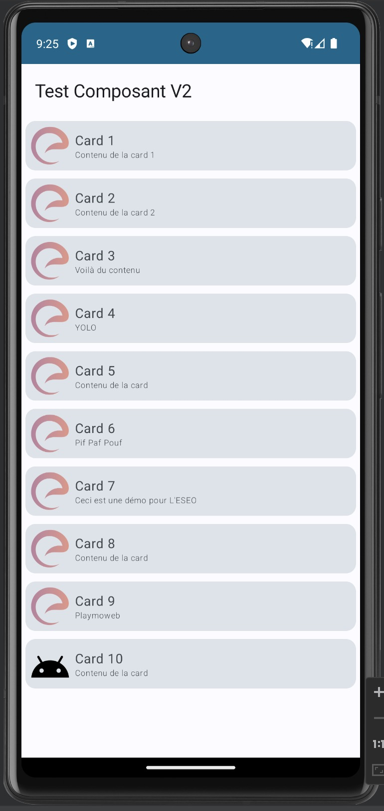
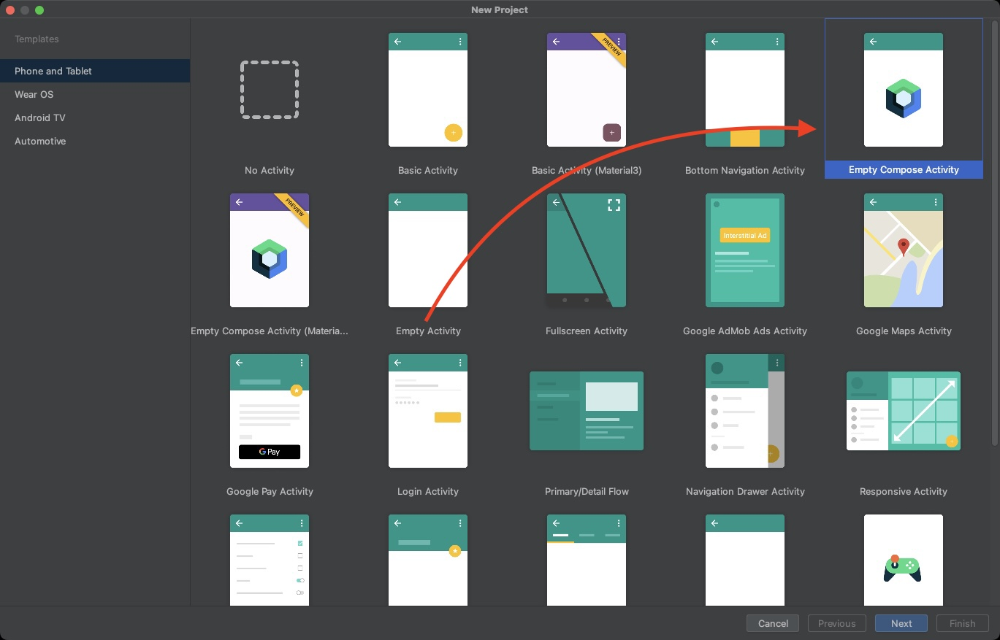
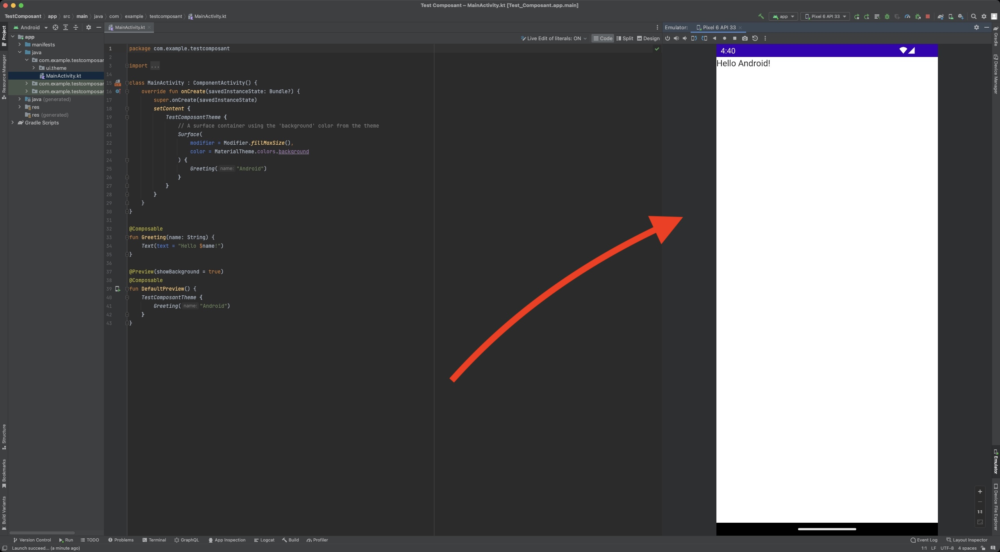
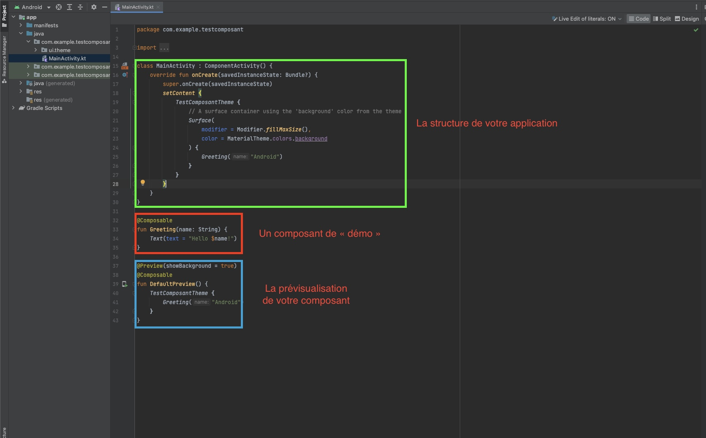
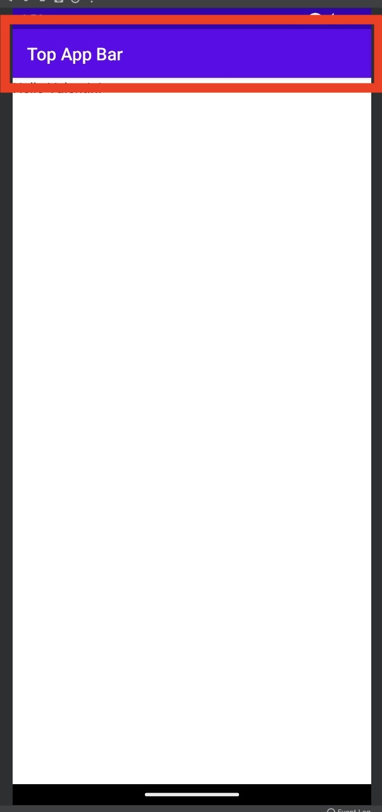
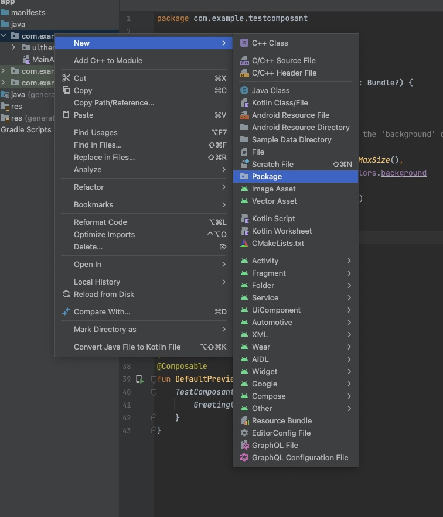
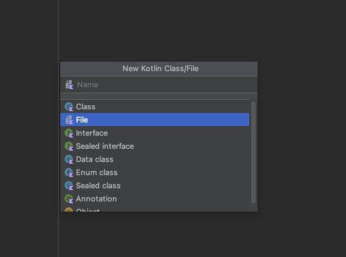
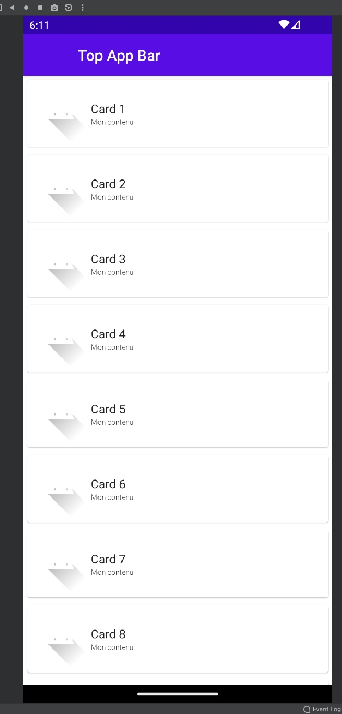
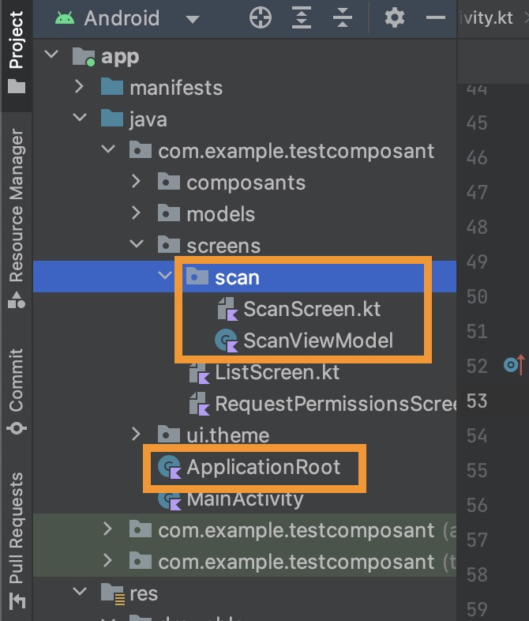

# Introduction à Android Compose

::: details Sommaire
[[toc]]
:::

## Introduction

Dans ce TP nous allons mettre en pratique l'écriture de composants avec Android Compose. De la logique à la réalisation, nous allons parcourir les bases de la réalisation de composants et de « la réactivité » en lien avec ceux-ci.

Ce TP fait suite au cours sur Android Compose, je vous invite donc à le lire avant de commencer ce TP ([Cours Android Compose](/cours/android_compose.md)).

## Aperçu du projet

L'application que nous allons réaliser ici est très simple. Il s'agit juste d'une liste et d'une vue de détail. Elle nous servira à comprendre le système de composant.



## Création du projet

Pour la création du projet, rien de spécial à prévoir. Il s'agit ici de suivre le processus de création d'une application comme habituellement. Pour ça nous allons utiliser « Android Studio » qui est l'IDE à utiliser pour créer une application Android.

Lors de la création, Android Studio va nous poser plusieurs questions, nous allons donc choisir :

- Template : Empty **Compose** Activity
- Language : Kotlin
- SDK Min. : SDK 26. (ou plus)

Je vous laisse suivre les étapes de création d'un nouveau projet.




::: warning Mais quelques petites remarques :

- Le choix du package est très important. Comme nous avons vu ensemble en cours, le « Package » doit être unique. En effet deux applications ne peuvent pas avoir le même.
- Choisir un min SDK qui correspond aux cibles des mobiles souhaités. (Si vous êtes en France ou dans un autre pays, il conviendra de faire le bon choix).
- Kotlin est maintenant le langage à choisir, Java et Kotlin cohabite sans problème vous n'aurez donc aucun problème de compatibilité.

:::

## Un premier lancement

Pour débuter (et avant de tout casser), je vous laisse compiler et lancer une première fois l'application proposée par Google. Le premier résultat va être incroyable, accrochez-vous…


> Dans mon cas l'application est sur la droite.

::: tip STOP ! Analysons ensemble ce que nous avons obtenu.



Nous allons donc retravailler tout ça pour organiser un minimum notre code source.

:::

## La structure / Les composants

Compose repose sur l'utilisation du code pour définir l'interface que l'utilisateur va voir. Elle reprend les principes de la programmation en composant qui est largement utilisée dans le développement web.

Nous avons à notre disposition un ensemble de composants « fonctionnels » qui vont nous permettre de créer les éléments de notre interface :

- `Text` : Un composant qui permet d'afficher du texte.
- `Button` : Un composant qui permet d'afficher un bouton.
- `Switch` : Un composant qui permet d'afficher un toggle (un bouton qui peut être activé ou désactivé).
- `Image` : Un composant qui permet d'afficher une image.
- `LazyColumn` : Un composant qui permet d'afficher une liste.
- `Scaffold` : Un composant qui permet de créer une structure de base pour notre application (barre de navigation, etc.).
- `TopAppBar` : Un composant qui permet de créer une barre de navigation en haut de l'application.
- `Card` : Un composant qui permet de créer une carte.
- `IconButton` : Un composant qui permet de créer un bouton avec une icône.
- Etc… (Il y en a beaucoup plus, mais nous allons nous arrêter là pour l'instant).

Nous avons également des composants qui sont là pour définir la structure de notre application :

- `Column` : Un composant qui permet de créer une colonne.
- `Row` : Un composant qui permet de créer une ligne.
- `Box` : Un composant qui permet de créer une boîte.
- `Spacer` : Un composant qui permet de créer un espace entre deux éléments.

Les composants sont des fonctions que nous allons pouvoir appeler dans notre code. Ils seront appelés au bon moment en fonction de conditions que nous allons définir. Les composants seront imbriquables les uns dans les autres, ce qui nous permettra de créer des interfaces complexe. Par exemple :

```kotlin
Column() {
    Text("Texte 1")
    Text("Texte 2")
    Text("Texte 3")
}
```

Ce code va nous permettre d'afficher trois textes les uns en dessous des autres. Et si nous souhaitons afficher les textes les uns à côté des autres ? Il suffit de changer le composant `Column` par `Row`.

```kotlin
Row() {
    Text("Texte 1")
    Text("Texte 2")
    Text("Texte 3")
}
```

Nous pouvons également imbriquer les Colonnes et les Lignes :

```kotlin
Column() {
    Row() {
        Text("Texte 1")
        Text("Texte 2")
        Text("Texte 3")
    }
    Row() {
        Text("Texte 4")
        Text("Texte 5")
        Text("Texte 6")
    }
}
```

Cet exemple est là pour vous montrer la puissance de Compose. Compose a été pensé pour être simple et modulaire, par exemple pour un bouton le principe est le même :

```kotlin
Button(onClick = { /* Code appelé lors du clique sur le bouton */ }) {
    Text("Mon bouton")
}
```

Ici nous voyons que le composant `Button` prend en paramètre une action (un code qui sera appelé lors du clique sur le bouton) et un composant `Text` qui sera affiché dans le bouton. Pratique ! Et si nous souhaitons un bouton avec un loader ? Et bien c'est simple il suffit de changer le composant `Text` par un composant `CircularProgressIndicator` (qui est un loader).

```kotlin
Button(onClick = { /* Code appelé lors du clique sur le bouton */ }) {
    CircularProgressIndicator()
}
```

Et évidemment, nous allons pouvoir créer nos propres composants…

## Le modifier

Le modifier est un élément qui va nous permettre de modifier un composant. Par exemple, nous pouvons modifier la taille d'un composant, sa couleur, etc. Pour ça nous allons utiliser le composant `Modifier` qui va nous permettre de modifier un composant.

```kotlin
Text("Mon texte", modifier = Modifier.size(20.dp))
```

Le modifier est différent d'un composant à un autre, il faut donc regarder la documentation pour savoir ce que l'on peut faire avec un composant.

Par exemple, pour la colonne nous avons :

```kotlin
Column(
    modifier = Modifier
        .fillMaxWidth()
        .padding(5.dp)
) {
    // Contenu de la colonne
}
```

- `fillMaxWidth` permet de remplir la largeur de la zone disponible.
- `padding` permet d'ajouter un padding (un espace) autour de la colonne.

::: tip Rien de mieux que la documentation

Nous avons vu quelques composants, et quelques modifiers. Mais il y en a beaucoup plus. Je vous laisse regarder la documentation pour en savoir plus.

[Documentation](https://developer.android.com/jetpack/compose/components)

⚠️ Compose évolue très rapidement, il est donc primordial de regarder la documentation…

:::

## Material Design

En plus des composants proposés par Compose, nous avons également accès aux composants de Material Design. Le projet que vous avez créé utilise déjà le Material Design en version 3.

Les composants proposés sont prêts à l'emploi, ils intègrent toutes les bonnes pratiques définies par Google. 

[Documentation de Material Design](https://m3.material.io/)

Ce TP est guidé, vous n'avez pas à « apprendre la documentation », par contre je vous invite à la parcourir pour voir les options / fonctionnements, votre compréhension en sera grandement facilitée.

## Un peu de structure !

Avant d'aller plus loin, nous allons ajouter un peu de structure dans le microprojet. L'idée étant de faire une application qui ressemble à quelque chose. Nous allons ajouter la structure d'une application basique à savoir une `TopAppBar`.



Je vous laisse modifier le code de la méthode `onCreate`, pour y mettre :

```kotlin
setContent {
    MyApplicationTheme {
        Scaffold(
            topBar = { TopAppBar(title = {Text("Top App Bar")}  },
        ) {
            Greeting(name = "Valentin")
        }
    }
}
```

::: tip L'importance de la sémantique

Il est important d'utiliser les bons termes. En développement mobile, nous avons une terminologie qu'il faut respecter. Ici la barre en haut ne se nomme pas « la barre en haut », mais une AppBar.

:::

_À faire :_

Je vous laisse tester votre application à nouveau.

::: tip Un peu de couleur

Votre top-bar est blanche ? C'est normal, nous n'avons pas encore ajouté de thème. Je vous laisse ajouter le thème suivant :

```kotlin
topBar = { 
    TopAppBar(
        title = {Text("Top App Bar") }, // Titre de la barre
        colors = TopAppBarDefaults.smallTopAppBarColors(
            containerColor = MaterialTheme.colorScheme.primaryContainer,
            titleContentColor = MaterialTheme.colorScheme.primary,
        ), // Couleur de la barre
    ),
},
```

:::

## Votre premier composant

Avant de réaliser le code, nous allons dans un premier temps créer un nouveau package. Il nous servira à stocker nos composants.

Création du package, la procédure est intégrée dans Android Studio :


Nommage du package, dans mon cas « composants » :


Maintenant que votre package est créé, je vous laisse créer le fichier Kotlin qui contiendra votre code :




Pour le nom du fichier, je vous laisse choisir. Moi dans mon cas je vais le nommer « `composant_list_item.kt` ».

::: tip Un instant !

Pas de classe !?

<iframe src="https://giphy.com/embed/l0HlKrB02QY0f1mbm" width="480" height="270" frameBorder="0" class="giphy-embed" allowFullScreen></iframe>

**Et non** avec Compose, les composants ne sont pas des classes. Ce sont des fonctions « Composable » qui seront appelées au bon moment suivant les bonnes conditions dans votre vue.

:::

### Le code de votre composant

L'idée ici est de vous faire constater le bon fonctionnement. Voilà le code de votre premier composant :

```kotlin
import androidx.compose.foundation.Image
import androidx.compose.foundation.layout.Column
import androidx.compose.foundation.layout.Row
import androidx.compose.foundation.layout.height
import androidx.compose.foundation.layout.padding
import androidx.compose.material.Card
import androidx.compose.material.ExperimentalMaterialApi
import androidx.compose.material.Text
import androidx.compose.runtime.Composable
import androidx.compose.ui.Alignment
import androidx.compose.ui.Modifier
import androidx.compose.ui.res.painterResource
import androidx.compose.ui.text.font.FontWeight
import androidx.compose.ui.tooling.preview.Preview
import androidx.compose.ui.unit.dp
import androidx.compose.ui.unit.sp
import com.example.testcomposant.R
import com.example.testcomposant.ui.theme.MyApplicationTheme

@OptIn(ExperimentalMaterialApi::class)
@Composable
fun ElementList(
    title: String = "Mon titre",
    content: String = "Mon contenu",
    image: Int? = R.drawable.ic_launcher_foreground,
    onClick: () -> Unit = {}
) {
    Card(modifier = Modifier.fillMaxWidth().padding(5.dp), onClick = onClick) {
        Row(modifier = Modifier.padding(5.dp), verticalAlignment = Alignment.CenterVertically) {
            image?.let {
                Image(modifier = Modifier.height(50.dp), painter = painterResource(id = it), contentDescription = content)
            }

            Column() {
                Text(text = title)
                Text(text = content, fontWeight = FontWeight.Light, fontSize = 10.sp)
            }
        }
    }
}

@Preview(showBackground = true)
@Composable
fun DefaultPreview() {
    MyApplicationTheme {
        ElementList()
    }
}
```

Arrêtons-nous un instant, que constatez-vous dans le code que vous avez copié-collé sans trop réfléchir 👀…

- `@Composable` au-dessus de la fonction, indique l'emplacement d'un composant.
- `@Preview(showBackground = true)` permet de réaliser une preview de votre composant sans la lancer sur un téléphone (pratique, testons).
- Les variables (`title`, `content`, `image`, `onClick`) seront le moyen de customiser notre composant.

Je vous laisse mettre en place le code. Et valider que celui-ci s'affiche correctement dans la partie preview.


## Utiliser votre premier composant

Nous avons réalisé notre premier composant, nous allons maintenant utiliser le composant dans notre application.

Pour ça nous allons créer une liste (`LazyColumn` étant l'équivalent d'un `RecyclerView`, mais en beaucoup plus simple) Celui-ci contiendra le composant que vous avez créé.

```kotlin
val myData = listOf("Card 1","Card 2","Card 3","Card 4","Card 5","Card 6","Card 7","Card 8","Card 9","Card 10")

LazyColumn {
    items(myData) { item ->
        ElementList(title = item) {
            // Code appelé lors du clique sur un élément de la liste.
        }
    }
}
```

Je vous laisse mettre le code en question **à la place** du `Greeting` dans le composant `Scaffold`.

Vous devez obtenir :



### Rendre votre liste interactive

Maintenant que notre liste s'affiche, nous allons la rendre interactive lors du touch / clique de l'utilisateur sur un élément de la liste. Nous allons avoir besoin de deux choses : 

- Une variable qui permettra de connaitre quel élément à été cliqué.
- Une condition (`if`) pour savoir si nous devons afficher la `LazyColumn` ou seulement un `ElementList`.

Pour la variable, la déclaration de celle-ci est un peu particulière :

```kotlin
var selectedItem by remember { mutableStateOf<String?>(null) }
```

Ajouter cette ligne après votre variable `myData`.

::: tip C'est à vous

Je vous laisse ajouter la condition pour :

- Afficher la `LazyColumn` ou `ElementList` en fonction de `selectedItem != null`.

:::

### Gestion du bouton retour

Si tout fonctionne comme prévu, vous devez avoir la possibilité de sélectionner un élément. Mais pour l'instant pas moyen de revenir sur la liste entière.

Pour ça nous allons ajouter un nouvel attribut dans notre `TopAppBar`

```kotlin
navigationIcon = {
    if (selectedItem != null) {
        IconButton(onClick = { selectedItem = null })
        { Icon(Icons.Default.ArrowBack, "Back") }
    }
},
```

Cet attribut va ajouter un bouton retour si un élément est sélectionné. Je vous laisse mettre en place ça dans votre code.

## Utiliser toute la puissance des composants

Vous l'avez peut-être remarqué, pour l'instant notre liste est très simple. Vous avez déclaré une liste de `string`, je vais vous demander d'allez un peu plus loin. Vous allez créer une liste `d'objet` (plutôt que `string`).

Évidemment, je vais vous demander d'organiser tout ça.

- Créer un package nommé models :


- Ajouter dans ce package une Classe (`data class` pour être précis) :

```kotlin
data class CardContent(val title: String, val content: String, @DrawableRes val image: Int?)
```

::: tip Data class ?

Étrange cette classe n'est-ce pas ? 

Nous créons fréquemment des classes dont le but principal est de conserver des données. Dans une telle classe, certaines fonctionnalités standard et fonctions utilitaires sont souvent dérivables mécaniquement à partir des données. Dans Kotlin, cela s'appelle une classe de données et est marqué comme `data`.

:::

C'est à vous, je vous laisse modifier votre liste (nommé `myData`) par une liste de `CardContent` (la classe que vous avez créée). Cette liste doit contenir 10 éléments avec des titres, des contenus et une image différente que celle par défaut (le logo de l'ESEO par exemple).

::: details Besoin d'aide ?

Avez-vous cherché ? Si oui, voilà un indice :

```kotlin
val myData = listOf(CardContent("Card 1", "Contenu de la card 1", R.drawable.logo), …)
```

:::

## Découper encore plus

Nous avons créé un composant, c'est bien, mais nous pouvons faire bien plus. En reprenant la logique du composant `ElementList`, je vous laisse créer un composant nommé `EseoTopAppBar` qui contiendra toute la logique de votre `TopAppBar` :

```kotlin
TopAppBar(
    navigationIcon = {
        if (selectedItem != null) {
            IconButton(onClick = { selectedItem = null })
            { Icon(Icons.Default.ArrowBack, "Back") }
        }
    },
    title = { Text("Top App Bar") },
)
```

Une fois ce composant créé (dans le bon dossier), je vous laisse l'utilisé directement dans votre `Scaffold`.

::: tip Rappel


Les éléments encadrés en rouge sont les paramètres de chaque méthode. Certains sont des strings, d'autres des actions, mais un paramètre peut-être un composant. C'est le cas ici avec `topBar =`. 

:::

Je vous laisse tester que votre application fonctionne toujours.

## Ajouter des animations

Une liste c'est bien ! Mais une liste avec des animations c'est encore mieux !

```kotlin
AnimatedContent(label = "") (/* Votre Condition OU votre état */ ) { targetState ->
    when (targetState) {
        true -> { /* Composant affiché quand la condition est vrai */ }
        false -> { /* Composant affiché quand la condition est fausse */ }
    }
}
```

Je vous laisse intégrer ce code dans votre application afin d'animer le changement d'état. Après intégration vous devriez obtenir :

<iframe width="560" height="315" src="https://www.youtube-nocookie.com/embed/LrYjOWEid2A?controls=0" title="YouTube video player" frameborder="0" allow="accelerometer; autoplay; clipboard-write; encrypted-media; gyroscope; picture-in-picture" allowfullscreen></iframe>

### Aller plus loin avec les animations

[](https://storage.googleapis.com/android-stories/compose/Compose_Animation_Cheat_Sheet.pdf)

_Source:_ [Twitter](https://twitter.com/JorgeCastilloPr/status/1579057096360079361)

## Utiliser les ressources textes

Avoir des composants ne veut pas dire oublier les bonnes pratiques bien au contraire ! Pour finaliser votre application, je vous laisse sortir les différents textes dans le fichier. `strings.xml`

Une fois vos textes externalisés, vous pouvez rendre visible via :

```kotlin
getString(R.string.id_de_votre_string_dans_le_xml)
```

Je vous laisse utiliser cette méthode aux différents endroits ou vous avez mis du texte « en dur ».

## Naviguer entre différents composants

Réaliser une interface avec Jetpack Compose c'est un peu comme assembler des Lego. Vos composants sont vos briques et vous allez devoir les assembler pour créer votre application.

Prenons les composants que nous avons créés :

- Une liste d'éléments.
- Une card représentant un élément.

Finalement, nous avons lié ces deux composants ensemble en utilisant un état. Lors de la sélection d'un élément, nous avons changé l'état de notre application pour afficher la card de l'élément sélectionné.

C'est un peu comme si nous avions une pièce dans laquelle nous pouvions entrer et sortir. Pour entrer et sortir, nous utilisons l'action onClick, le onClick nous permet de changer l'état de notre application.

Dans cet exemple, nous avons utilisé un état pour gérer l'affichage de notre card. Mais nous pouvons aussi utiliser un état pour gérer la sélection d'un élément :

**(C'est un exemple, à ne pas copier-coller)**

```kotlin
val selectedItem = remember { mutableStateOf(null) }

if (selectedItem.value == null) {
    // Nous n'avons pas d'élément sélectionné, nous affichons donc la liste.
    ElementList(selectedItem)
} else {
    // Nous avons un élément sélectionné, nous affichons donc la card.
    ElementCard(selectedItem.value!!)
}
```

Prenons un autre exemple, dans un cas simple de deux composants d'interface, nous pourrions écrire quelque chose comme :

```kotlin
Column(Modifier.padding(it)) {
    val isLoggedIn = remember { mutableStateOf(false) }

    if (isLoggedIn.value) {
        HomeScreen()
    } else {
        LoginScreen() {
            // L'action sera émise par le composant LoginScreen. Via un bouton par exemple.
            isLoggedIn.value = true
        }
    }
}
```

Ici nous avons un état qui nous permet de savoir si l'utilisateur est connecté ou non. Il faut donc comprendre que le code permet de :

- Si l'utilisateur est connecté, afficher l'écran d'accueil.
- Si l'utilisateur n'est pas connecté, afficher l'écran de connexion.

Évidemment, il est possible de faire plus complexe, mais pour l'instant nous allons nous concentrer sur ces deux exemples.

### Exemple de code pour nos deux composants et de leur utilisation

Les deux composants :

```kotlin
@Composable
fun HomeScreen() {
    Text("Bienvenue sur votre application")
    // À compléter avec votre liste d'éléments précédemment créée.
}

@Composable
fun LoginScreen(onLogin: () -> Unit) {
    Button(onClick = onLogin) {
        Text("Se connecter")
    }
}
```

Un peu de détail sur le composant LoginScreen :

- `onLogin` est une action qui sera émise par le composant. Cette action sera émise lors du clique sur le bouton (par l'utilisateur). C'est ce que nous appelons un callback, il permet de faire remonter une action dans le composant parent.

L'utilisation de ces deux composants, dans un Scaffold :

```kotlin
@Composable
fun MyApp() {
    Scaffold(
        topBar = {
            TopAppBar(
                title = {
                    Text("Mon application")
                }
            )
        }
    ) {
        Column(Modifier.padding(it)) {
            val isLoggedIn = remember { mutableStateOf(false) }

            if (isLoggedIn.value) {
                HomeScreen()
            } else {
                LoginScreen() {
                    isLoggedIn.value = true
                }
            }
        }
    }
}
```

Je vous laisse tester le code. Évidemment, dans le composant `HomeScreen` je vous laisse remettre votre liste d'éléments (que vous avez créée précédemment).

Votre fichier `MainActivity.kt` doit ressembler à ça :

```kotlin
class MainActivity : ComponentActivity() {
    override fun onCreate(savedInstanceState: Bundle?) {
        super.onCreate(savedInstanceState)
        setContent {
            MyApplicationTheme {
                MyApp()
            }
        }
    }
}
```

Vous commencez à comprendre le fonctionnement ? Nous avons un composant `MyApp` qui contient un `Scaffold` qui contient un `Column` qui contient un état qui permet de savoir si l'utilisateur est connecté ou non. En fonction de cet état, nous affichons un composant ou un autre.

Ça semble compliqué ? C'est en effet un peu différent de ce que vous avez l'habitude de faire. Mais c'est très puissant, car vous pouvez créer des composants qui sont réutilisables et qui peuvent être utilisés dans plusieurs endroits de votre application.

On découpe notre code en plein de petits morceaux, et on assemble le tout pour créer notre application.

## Les permissions

Nous avons vu dans notre introduction Android que nous avions besoin de demander des permissions à l'utilisateur pour accéder à certaines fonctionnalités de son téléphone. Nous allons voir comment faire avec Compose. Pour ça nous allons devoir utiliser une librairie développée par Google : [Accompanist](https://google.github.io/accompanist/)

::: tip Accompanist

Accompanist est une librairie de transition, elle existe le temps que Compose évolue, mûrisse et que les fonctionnalités soient intégrées dans Compose (ou pas, mais c'est un autre débat).

:::

Pour rester dans le thème du Bluetooth, nous allons regarder comment demander les permissions en lien avec le BLE.

### Ajouter la librairie

Pour ajouter la librairie, nous allons devoir modifier notre fichier `build.gradle` (celui dans `app` du projet). Nous allons ajouter la dépendance suivante :

```groovy
    implementation("com.google.accompanist:accompanist-permissions:0.30.1")
```

Il faut ensuite synchroniser le projet avec les modifications (bandeau bleu en haut).

### Le fichier AndroidManifest.xml

Avant de demander les permissions, nous allons devoir les déclarer pour que l'application puisse les demander. Pour ça nous allons modifier le fichier `AndroidManifest.xml`. Nous allons ajouter les permissions suivantes :

```xml
<!-- Permissions pour le BLE Android 12 et plus -->
<uses-permission android:name="android.permission.BLUETOOTH_SCAN"
    android:usesPermissionFlags="neverForLocation"
    tools:targetApi="s" />
<uses-permission android:name="android.permission.BLUETOOTH_CONNECT" />

<!-- Ancienne permission pour permettre l'usage du BLE  Android avant 11 inclus -->
<uses-permission android:name="android.permission.BLUETOOTH" />
<uses-permission android:name="android.permission.BLUETOOTH_ADMIN" />

<uses-permission android:name="android.permission.ACCESS_COARSE_LOCATION" />
<uses-permission android:name="android.permission.ACCESS_FINE_LOCATION" />
```

### Utiliser la librairie

Cette librarie va nous permettre de demander les permissions à l'utilisateur et de gérer l'état de la demande (acceptée, refusée, etc.). Si vous avez compris ce que nous avons vus précédemment, vous vous doutez que tout va être géré par un état.

```kotlin
val toCheckPermissions = if (Build.VERSION.SDK_INT < Build.VERSION_CODES.S) {
    listOf(android.Manifest.permission.ACCESS_FINE_LOCATION)
} else {
    listOf(android.Manifest.permission.BLUETOOTH_CONNECT, android.Manifest.permission.BLUETOOTH_SCAN)
}

val permissionState = rememberMultiplePermissionsState(toCheckPermissions)
```

Quelques explications :

- `toCheckPermissions` est une liste de permissions à vérifier. Dans notre cas, nous allons vérifier les permissions pour le Bluetooth. En fonction de la version d'Android, nous n'allons pas vérifier les mêmes permissions. C'est pour ça que nous avons une condition qui permet de vérifier la version d'Android.
- `rememberMultiplePermissionsState` est un état qui va contenir l'état de la demande de permission. Cet état va nous permettre de savoir si les permissions sont accordés ou non.

Maintenant que nous avons notre état, nous allons pouvoir l'utiliser pour demander les permissions à l'utilisateur. Pour ça nous allons utiliser un composant nommé `PermissionRequired` :

```kotlin
if (!permissionState.allPermissionsGranted) {
    Button(onClick = { permissionState.launchMultiplePermissionRequest() }) {
        Text(text = "Demander la permission")
    }
else {
    Text(text = "Permission accordée")
}
```

Que fait ce code ?

- Si l'utilisateur n'a pas accordé les permissions, nous affichons un bouton qui permet de demander les permissions.
- Si l'utilisateur a accordé les permissions, nous affichons un texte qui indique que les permissions sont accordées.

## Scannez les périphériques BLE

Sans entrer dans le détails des subtilités du Bluetooth, nous allons décomposer le code permettant de scanner les périphérique BLE. Voilà le résultat final :

<iframe width="560" height="315" src="https://www.youtube-nocookie.com/embed/WZessnr9gZ4?controls=0" title="YouTube video player" frameborder="0" allow="accelerometer; autoplay; clipboard-write; encrypted-media; gyroscope; picture-in-picture" allowfullscreen></iframe>

### Introduction

Pour scanner les périphériques BLE, nous allons avoir besoin de plusieurs choses :

- Un état qui va contenir la liste des périphériques scannés.
- Un état qui va contenir l'état du scan (en cours, terminé, etc.)
- Le contexte de l'application (pour accéder au Bluetooth).
- L'accès au Bluetooth du téléphone.
- Un découpage de notre code en ViewModel.

### Le `Context`

Pour rappel le `Context` est un objet qui permet d'accéder à des informations sur l'application. Dans notre cas, nous allons avoir besoin du contexte pour accéder au Bluetooth du téléphone.

⚠️ C'est un élément obligatoire.

### La recomposition

Il faut comprendre ici que notre vue sera « recomposée » à chaque fois que nous allons obtenir de nouveaux périphériques BLE. Nous allons donc devoir gérer des listes qui vont être modifiées en temps réel. Pour ça nous allons utiliser un `Flow`, le flow sera un flux de données qui va nous permettre de mettre à jour notre liste de périphériques BLE (visuellement dans notre interface).

Cette interface sera également recomposée à chaque fois que nous indiquerons « En Scan » ou « Scan terminé ».


[En savoir plus sur la recomposition](https://developer.android.com/jetpack/compose/lifecycle?hl=fr)

### Le ViewModel

Le ViewModel repose sur le découpage du code de type MVVM (Model View ViewModel). Nous allons donc avoir un ViewModel qui va contenir la logique de notre écran (ici le scan BLE).

Je ne souhaite pas dans cette introduction au composant vous assommer avec des détails techniques. Sachez juste que c'est une bonne pratique de découper son code, et que pour ça nous allons utiliser un ViewModel dans notre cas.

### Évolution de la structure

Notre projet va évoluer un peu, voici les éléments que nous allons devoir ajouter :



- `ScanViewModel.kt` : Le ViewModel qui va contenir la logique de notre écran.
- `ScanScreen.kt` : Le composant qui va contenir l'interface de notre écran (notre liste et nos boutons d'actions).
- `ApplicationRoot.kt` : Une activité qui sera appelée par la plateforme Android, elle nous permettra d'avoir accès au contexte de l'application depuis notre ViewModel.

::: tip Pas d'inquiétude

Ici, il faut bien voir que je vous communique une façon correcte de faire. Nous pourrions évidemment tout simplifier en mettant tout dans le même fichier (dans la vue par exemple). Mais à mon sens, il est important de comprendre dès le début les bonnes pratiques.

Pour revenir au `Context`, il est possible de le récupérer depuis la vue via un `LocalContext`. Dans le cas présent cette solution n'est pas possible (ou partiellement), car lors de la « recomposition » (en cas de changement dans les données) de la vue, notre viewModel sera dans certains cas détruit et recréé et nous perdrons nos données.

:::

### Quelques libraires à ajouter

Pour que nous puissions faire notre scan en arrière-plan et échanger les données entre la `View` et le `ViewModel` nous allons avoir besoin de quelques librairies :

```groovy
implementation("androidx.lifecycle:lifecycle-runtime-compose:2.6.2")
implementation("androidx.lifecycle:lifecycle-viewmodel-compose:2.6.2")
implementation("androidx.lifecycle:lifecycle-viewmodel-ktx:2.6.2")
implementation("androidx.lifecycle:lifecycle-runtime-ktx:2.6.2")
```

Ajouter ces dépendances dans votre fichier `build.gradle` (celui dans `app` du projet). Il faut ensuite synchroniser le projet avec les modifications (bandeau bleu en haut).

[Plus d'informations](https://developer.android.com/jetpack/androidx/releases/lifecycle)

### Le code du ScanScreen

```kotlin
@SuppressLint("MissingPermission")
@Composable
fun ScanScreen(
    modifier: Modifier = Modifier,
    scanViewModel: ScanViewModel = viewModel()
) {
    // La liste des appareils scannés autour
    val scanItems by scanViewModel.scanItemsFlow.collectAsStateWithLifecycle()
    // Boolean permettant de savoir si nous sommes en train de scanner
    val isScanning by scanViewModel.isScanningFlow.collectAsStateWithLifecycle()

    Column(
        modifier = modifier.fillMaxSize(),
        verticalArrangement = Arrangement.Center,
        horizontalAlignment = Alignment.CenterHorizontally
    ) {
        // Boutons en haut de l'écran (débuter le scan, arrêter le scan, vider la liste)
        Row(verticalAlignment = Alignment.CenterVertically, modifier = Modifier.padding(top = 5.dp)) {
            Button(
                colors = if (isScanning) ButtonDefaults.buttonColors(containerColor = Color.Red) else ButtonDefaults.buttonColors(),
                onClick = { scanViewModel.startScan() },
                enabled = !isScanning
            ) {
                if (isScanning) Text(text = "Scan en cours") else Text(text = "Débuter le scan")
            }
            Spacer(modifier = Modifier.padding(5.dp))
            Button(onClick = { scanViewModel.clearScanItems() }) {
                Text(text = "Vider la liste")
            }
        }

        // Le scan est lancé nous affichons la liste des appareils trouvés
        LazyColumn(modifier = Modifier.fillMaxSize()) {
            items(scanItems) { item ->
                ElementList(
                    title = item.device.name ?: "Sans nom",
                    content = item.device.address ?: "00:00:00:00:00:00",
                    image = R.drawable.baseline_bluetooth_24
                )
            }
        }
    }
}
```

Quelques explications :

- `scanViewModel` est un paramètre qui permet de passer le ViewModel à notre composant. C'est ce que nous appelons une dépendance. Nous allons avoir besoin de ce ViewModel pour accéder aux données et aux actions.
- `scanItems` est un état qui va contenir la liste des appareils scannés. Cet état va être mis à jour à chaque fois que nous allons scanner un nouvel appareil.
- `isScanning` est un état qui va contenir l'état du scan. Cet état va être mis à jour à chaque fois que nous allons démarrer ou arrêter le scan.
- `LazyColumn` est un composant qui permet d'afficher une liste. Il est équivalent à un `RecyclerView` sur Android sans Compose. Cette liste contiendra autant d'éléments que d'appareils scannés.

### Le code du ScanViewModel

```kotlin
class ScanViewModel : ViewModel() {
    // La liste des appareils scannés autour
    val scanItemsFlow = MutableStateFlow<List<ScanResult>>(emptyList())

    // Boolean permettant de savoir si nous sommes en train de scanner
    val isScanningFlow = MutableStateFlow(false)

    // Le processus de scan
    private var scanJob: Job? = null

    /**
     * Le scanner bluetooth
     */
    // ApplicationRoot.getContext() est une référence au contexte de l'application
    // Elle est initialisée dans ApplicationRoot
    private val bluetoothLeScanner = (ApplicationRoot.getContext().getSystemService(BLUETOOTH_SERVICE) as BluetoothManager).adapter.bluetoothLeScanner
    private val scanFilters: List<ScanFilter> = emptyList()
    private val scanSettings = ScanSettings.Builder().setScanMode(ScanSettings.SCAN_MODE_LOW_LATENCY).build()
    private val scanResultsSet = mutableMapOf<String, ScanResult>()

    @SuppressLint("MissingPermission")
    fun startScan() {
        if(isScanningFlow.value) return

        scanJob = CoroutineScope(Dispatchers.IO).launch {
            // On indique que nous sommes en train de scanner
            isScanningFlow.value = true

            // Objet qui sera appelé à chaque résultat de scan
            val scanCallback = object : ScanCallback() {
                override fun onScanResult(callbackType: Int, result: ScanResult) {
                    super.onScanResult(callbackType, result)
                    // On ajoute le résultat dans le set, si il n'y est pas déjà
                    // L'ajout retourne null si l'élément n'était pas déjà présent
                    if (scanResultsSet.put(result.device.address, result) == null) {
                        // On envoie la nouvelle liste des appareils scannés
                        scanItemsFlow.value = scanResultsSet.values.toList()
                    }
                }
            }

            // On lance le scan BLE a la souscription de scanFlow
            bluetoothLeScanner.startScan(scanFilters, scanSettings, scanCallback)

            delay(10000)

            // Lorsque scanFlow est stoppé, on stop le scan BLE
            bluetoothLeScanner.stopScan(scanCallback)

            // On indique que nous ne sommes plus en train de scanner
            isScanningFlow.value = false
        }
    }

    fun clearScanItems() {
        scanResultsSet.clear()
        scanItemsFlow.value = scanResultsSet.values.toList()
    }
}
```

Quelques explications :

- `scanItemsFlow` est un `Flow` qui va contenir la liste des appareils scannés. Ce `Flow` va être mis à jour à chaque fois que nous allons scanner un nouvel appareil.
- `isScanningFlow` est un `Flow` qui va contenir l'état du scan. Ce `Flow` va être mis à jour à chaque fois que nous allons démarrer ou arrêter le scan.
- `scanJob` est un `Job` qui va contenir le processus de scan. Ce `Job` sera la tâche en cours d'exécution. Elle permettrait de l'annuler si besoin.
- `bluetoothLeScanner` est un objet qui permet de scanner les périphériques BLE. C'est un objet fourni par Android.
- `scanFilters` est une liste de filtres qui permet de filtrer les périphériques scannés. Dans notre cas, nous ne filtrons rien.
- `scanSettings` est un objet qui permet de définir les paramètres du scan. Dans notre cas, nous définissons le mode de scan en `SCAN_MODE_LOW_LATENCY` (le mode le plus rapide, pour avoir les résultats le plus rapidement possible).
- `scanResultsSet` est un `Set` qui va contenir les résultats du scan. Nous utilisons un `Set` pour éviter d'avoir des doublons dans notre liste.
- `startScan` est une fonction qui permet de démarrer le scan. Cette fonction va être appelée lors du clique sur le bouton « Débuter le scan ».
- `clearScanItems` est une fonction qui permet de vider la liste des appareils scannés. Cette fonction va être appelée lors du clique sur le bouton « Vider la liste ».
- `scanCallback` est un objet qui va être appelé à chaque résultat de scan. Cet objet va nous permettre de mettre à jour notre liste des appareils scannés.

Ici nous avons un code qui est un peu plus complexe, mais complètement lisible. Il faut juste prendre le temps de le décomposer et de comprendre ce que nous faisons (notamment le flow et le callback).

Vous avez des questions ? Je suis là 👋.

::: warning `CallBack` ?

Un `CallBack` est un objet qui va être appelé à chaque fois qu'une action est réalisée. Dans notre cas, nous avons un `CallBack` qui va être appelé à chaque fois que nous allons scanner un nouvel appareil. C'est ce que nous appelons un `CallBack` ou un `Listener`.

:::

### Le code de l'ApplicationRoot

```kotlin

/**
 * Classe permettant de récupérer le contexte de l'application
 * depuis n'importe où dans le code
 *
 * Pour cela il suffit d'appeler ApplicationRoot.getContext()
 *
 * Elle est initialisée dans le fichier AndroidManifest.xml
 * application android:name=".ApplicationRoot"
 * Android va automatiquement appeler la méthode onCreate() pour nous
 * afin d'initialiser la variable INSTANCE
 */
class ApplicationRoot: Application() {

    companion object {
        private lateinit var INSTANCE: Application

        fun getContext(): Context = INSTANCE.applicationContext
    }

    override fun onCreate() {
        super.onCreate()
        INSTANCE = this
    }
}
```

Quelques explications :

- `ApplicationRoot` est une classe qui permet de récupérer le contexte de l'application depuis n'importe où dans le code. Pour cela il suffit d'appeler `ApplicationRoot.getContext()`.
- `getContext()` est une fonction qui permet de récupérer le contexte de l'application.
- `Compagnon` est un objet qui permet de créer des fonctions et des variables statiques. C'est un peu comme si nous avions une classe avec des fonctions et des variables statiques.

### Le fichier AndroidManifest.xml

Pour l'instant le code que je vous ai fourni ne fonctionne pas. Il manque une étape, nous devons déclarer notre `ApplicationRoot` dans le fichier `AndroidManifest.xml`. Pour ça nous allons ajouter l'attribut `android:name` à l'élément `application` :

```xml
android:name=".ApplicationRoot"
```

À ajouter dans le `<Application` :


::: tip Pourquoi ?

En déclarant notre `ApplicationRoot` dans le `AndroidManifest.xml`, nous indiquons à Android que nous souhaitons utiliser notre classe `ApplicationRoot` comme classe principale de notre application. C'est cette classe qui sera appelée en premier lors du lancement de l'application.

Celle-ci n'affichera rien mais elle sera lancé en premier. C'est ce que nous appelons un point d'entrée, « elle tiendra » une référence au contexte de l'application. C'est ce qui nous permettra d'accéder au Bluetooth depuis notre ViewModel.

Il n'y a pour l'instant pas d'autre moyen de faire, c'est une limitation de Compose (ou du moins un comportement / astuce à connaitre).

:::

### C'est à vous

Vous avez l'ensemble des éléments, je vous laisse le mettre en place dans votre application.

Une fois le code en place, vous devrez l'appeler depuis votre « MainActivity » à la place du `ListScreen`. Dans mon cas :

```kotlin
ScanScreen(Modifier.padding(it))
```

## Arrêtons-nous un instant

Ici l'idée était de vous montrer les bases de la création de composants. Il est évident que dans une vraie application, nous aurions un peu plus que ça.

Notamment :

- Une architecture (MVI, MVVM, etc.) qui permet de gérer la logique de l'application. Dans Compose nous appelons ça un ViewModel.
- Une Navigation basée sur un Routeur, sur Android il se nomme Jetpack Compose Navigation.
- Une gestion des erreurs, des exceptions, etc.

Mais pour l'instant, nous allons nous arrêter là. Nous avons vu les bases, nous avons vu comment créer des composants, comment les utiliser, comment les animer, comment les rendre interactifs, etc.

## Aller plus loin dans la navigation

Vous souhaitez aller plus loin ? Là c'est un exemple très simple, pour découvrir. Dans une application plus complexe, nous aurions besoin de Compose Navigation pour gérer les transitions entre les composants. Vous pouvez retrouver un exemple d'utilisation de Compose Navigation dans la documentation officielle : [Compose Navigation](https://developer.android.com/jetpack/compose/navigation).

Compose Navigation est un composant qui permet de gérer les transitions entre les composants. Il permet de gérer les animations, les transitions, les arguments, etc. C'est l'équivalent d'un routeur dans une application web (react-router, vue-router, etc.)

## Bonus : Adapter la TopAppBar

Actuellement votre TopAppBar est statique, elle contient toujours la même chose à savoir « Top App Bar ». Je vous propose de réfléchir à comment faire pour que celle-ci s'adapte et change en fonction de l'élément choisi, en fonctionnant en suivant la logique :

- Aucun élément = « Nom de votre application ».
- Un élément choisi = « Titre de l'élément choisi ».

::: tip Et les animations

N'oubliez pas, les animations sont le détail qui change tout. Je vous laisse regarder pour faire en sorte d'animer le changement de titre.

:::


## Le code complet

Même si je vous ai donné le code au fur et à mesure, je vous laisse le code complet de l'application :

[Code complet](https://github.com/c4software/Android-Composant-sample-ble-scan)

PS: Je vous conseil de créer vous même votre application, c'est en forgeant que l'on devient forgeron.