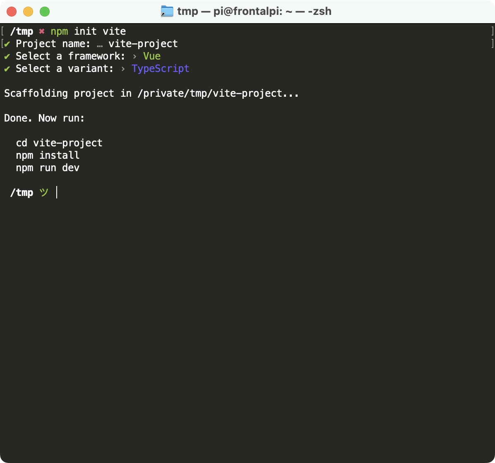
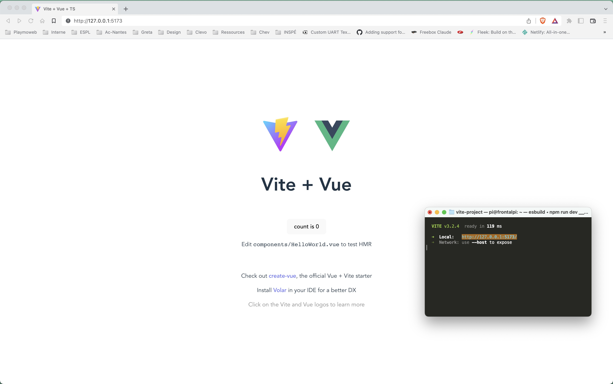
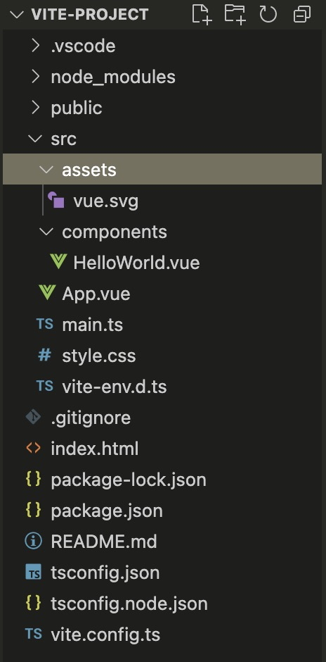

# Les composants avec VueJS 3

::: details Sommaire
[[toc]]
:::

## Introduction

Dans ce TP nous allons mettre en pratique l'écriture de composants en VueJS. De la logique à la réalisation, nous allons parcourir les bases de la réalisation de composants et de la réactivité.

Dans ce projet nous allons utiliser ViteJS qui permettra de créer rapidement un projet VueJS 3.

## Technologies utilisées

Nous allons avoir besoin de différentes technologies pour faire fonctionner le projet :

- [NodeJS](https://nodejs.org/en/)
- [ViteJS](https://vitejs.dev/)
- [VueJS](https://vuejs.org/)
- [Tailwind](https://tailwindcss.com/)

::: tip Pourquoi Tailwind ?
J'ai envie de dire… Pourquoi pas ? Tailwind est une vraie alternative à Bootstrap, l'approche modulaire est intéressante et ce mini projet est un bon moyen de la découvrir.
:::

## Avant-propos

Dans ce TP, je vais partir que votre environnement de travail est déjà fonctionnel. C'est-à-dire que vous avez sur votre machine :

- [NodeJS](https://nodejs.org/en/) (en version LTS)

::: danger Un détail important

Comme pour les PHP avec Laravel, je vous déconseille vivement la création d'un projet dans un lecteur réseau. La multitude de « petits fichiers » est une source de ralentissement non négligeable surtout quand vous êtes plusieurs sur le même lecteur réseau.

:::

## Créer le projet

ViteJS ne nécessite rien d'autre que d'avoir sur votre ordinateur `NodeJS` (minimum 12) et `NPM`. Si c'est le cas pour vous, il vous suffit de saisir dans votre terminal :

```sh
npm init vite
```

::: tip C'est interactif !
L'ensemble du processus est interactif ; il vous suffit donc de suivre les étapes pour créer un projet.

**Attention quand même**, le projet que vous allez créer sera situé dans le dossier courant.
:::



::: warning plusieurs choix !
Vous avez le choix du type de projet ; nous allons choisir **Vue** puis **Typescript**. Cette sélection du type de projet est la vraie force de ViteJS, grâce à son système de plug-in ViteJS est complètement agnostique il est donc complètement possible de faire autre chose que du VueJS (et ça, c'est cool).
:::

## Premier lancement

La création du projet ne devrait prendre que quelques instants, une fois réalisé, je vous laisse suivre les instructions fournies par l'outil créé par l'équipe de Vite. À savoir dans mon cas :

```bash
cd vite-project
npm install
npm run dev
```

Si tout se passe bien, vous devriez être capable d'afficher la page de démo d'un projet Vite « Vide » :



::: tip Qu'avons-nous ici ?

Nous avons ici un projet « vide » fourni par Vite + Vue (le tout en TypeScript).

Quelques éléments importants :

- Le serveur Web est intégré (comme Laravel, ou Mini MVC Sample).
- Le serveur « surveille » les fichiers sources et autorafraîchit la page en cas de modifications.
- Vous avez dans l'exemple un composant interactif de démo.

:::

**Avant d'aller plus loin**, je vous laisse tester :

- Le site que vous venez de lancer.
- La modification du code source, je vous propose de changer **Vite + Vue** par **Vite + Vue + Votre Prénom** (je vous laisse fouinner, mais la modification est à faire dans le `App.vue`)

Votre modification de code doit être immédiatement disponible.

## La structure

Un projet Vite à toujours la même structure de base :



Les éléments **importants** sont les suivants :

- Votre code source sera dans le dossier `src/`.
- Les composants seront dans `src/components/`.
- Vos dépendances / librairies seront dans `package.json`.
- Les scripts (hors `.vue`) seront nommé `….ts` (pour indiquer TypeScript).

**Avant d'allez plus loin, je vous laisse regarder le contenu**.

::: danger Envie de tout changer ?
Bien évidemment vous pouvez la modifier… Mais je vous encourage vivement à la garder telle quelle !
:::

### Les .Vue

Sans entrer trop dans le détail (ce n'est pas le but de ce TP), un fichier `.vue` va contenir l'ensemble de la logique « d'un composant » il pourra donc contenir :

- _La vue (Le HTML) :_ Il s'agit de template, nous avons donc à notre disposition une synthaxe particulière [À voir ici](https://vuejs.org/guide/essentials/template-syntax.html).
- _Le script (Le TypeScript / JavaScript) :_ Il s'agit de l'ensemble de la logique de fonctionnement de votre composant. (appel Ajax, logique de clique, etc). Avec VueJS 3.0 nous avons accès à la [composition API, c'est pratique n'hésitez pas à vous documenter ici](https://vuejs.org/api/sfc-script-setup.html)
- _Le Style (CSS) :_ Style de votre composant, de la css classique, mais appliquée uniquement sur votre composant [En savoir plus](https://vue-loader.vuejs.org/guide/scoped-css.html)