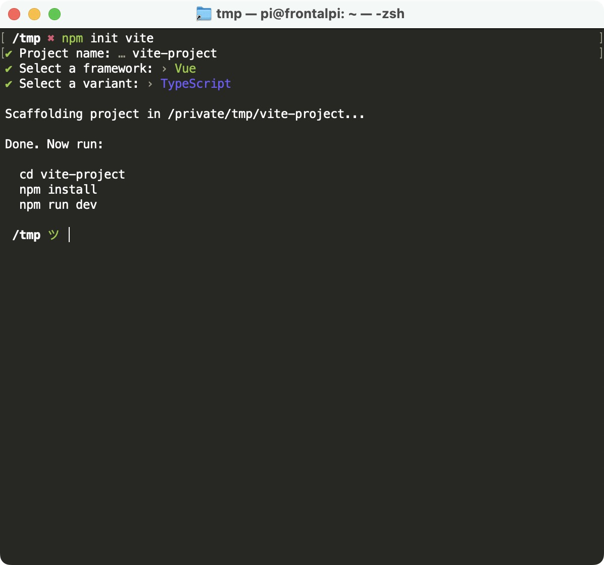
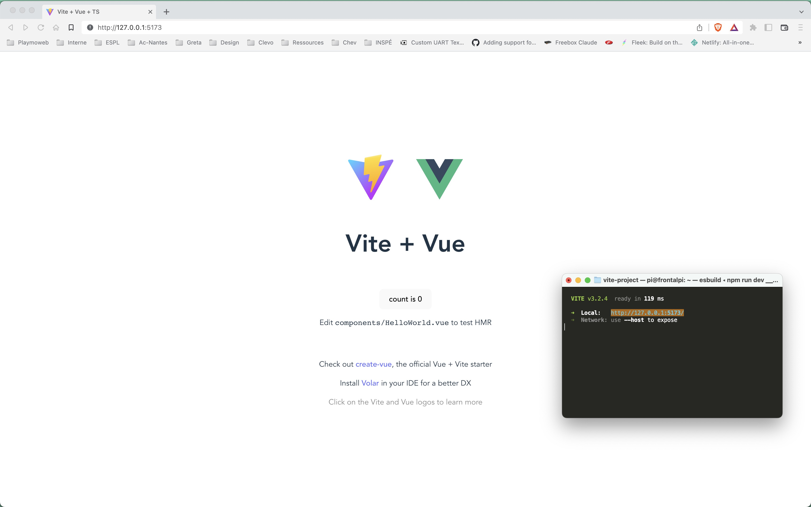
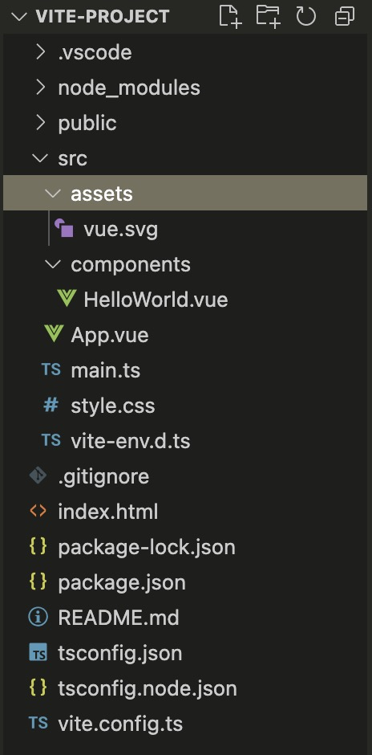

# Les composants avec VueJS 3

::: details Sommaire
[[toc]]
:::

## Introduction

Dans ce TP nous allons mettre en pratique l'écriture de composants en VueJS. De la logique à la réalisation, nous allons parcourir les bases de la réalisation de composants et de la réactivité.

Dans ce projet nous allons utiliser ViteJS qui permettra de créer rapidement un projet VueJS 3.

## Objectifs

À la fin de ce TP vous saurez :

- Créer un projet VueJS 3 avec ViteJS.
- Installer et utiliser Tailwind dans un projet Vite.
- Écrire un composant dans un fichier `.vue` (avec la composition API).
- Rendre un composant paramétrable avec les props.
- Faire remonter une information au parent avec les événements.
- Afficher une liste de composants avec `v-for`.

## Technologies utilisées

Nous allons avoir besoin de différentes technologies pour faire fonctionner le projet :

- [NodeJS](https://nodejs.org/en/)
- [ViteJS](https://vitejs.dev/)
- [VueJS](https://vuejs.org/)
- [Tailwind](https://tailwindcss.com/)

::: tip Pourquoi Tailwind ?
J'ai envie de dire… Pourquoi pas ? Tailwind est une vraie alternative à Bootstrap, l'approche modulaire est intéressante et ce mini projet est un bon moyen de la découvrir.
:::

## Avant-propos

Dans ce TP, je vais partir du principe que votre environnement de travail est déjà fonctionnel. C'est-à-dire que vous avez sur votre machine :

- [NodeJS](https://nodejs.org/en/) (en version LTS)

::: danger Un détail important

Comme pour PHP avec Laravel, je vous déconseille vivement la création d'un projet dans un lecteur réseau. La multitude de « petits fichiers » est une source de ralentissement non négligeable surtout quand vous êtes plusieurs sur le même lecteur réseau.

:::

## Créer le projet

ViteJS ne nécessite rien d'autre que d'avoir sur votre ordinateur `NodeJS` (en version LTS) et `NPM`. Si c'est le cas pour vous, il vous suffit de saisir dans votre terminal :

```sh
npm init vite
```

::: tip C'est interactif !
L'ensemble du processus est interactif ; il vous suffit donc de suivre les étapes pour créer un projet.

**Attention quand même**, le projet que vous allez créer sera situé dans le dossier courant.
:::



::: warning plusieurs choix !
Vous avez le choix du type de projet ; nous allons choisir **Vue** puis **Typescript**. Cette sélection du type de projet est la vraie force de ViteJS, grâce à son système de plug-in ViteJS est complètement agnostique il est donc complètement possible de faire autre chose que du VueJS (et ça, c'est cool).
:::

## Premier lancement

La création du projet ne devrait prendre que quelques instants. Une fois réalisée, je vous laisse suivre les instructions fournies par l'outil créé par l'équipe de Vite. À savoir dans mon cas :

```bash
cd vite-project
npm install
npm run dev
```

Si tout se passe bien, vous devriez être capable d'afficher la page de démo d'un projet Vite « Vide » :



::: tip Qu'avons-nous ici ?

Nous avons ici un projet « vide » fourni par Vite + Vue (le tout en TypeScript).

Quelques éléments importants :

- Le serveur Web est intégré (comme Laravel, ou Mini MVC Sample).
- Le serveur « surveille » les fichiers sources et autorafraîchit la page en cas de modifications.
- Vous avez dans l'exemple un composant interactif de démo.

:::

**Avant d'aller plus loin**, je vous laisse tester :

- Le site que vous venez de lancer.
- La modification du code source, je vous propose de changer **Vite + Vue** par **Vite + Vue + Votre Prénom** (je vous laisse fouiner, mais la modification est à faire dans le `App.vue`).

Votre modification de code doit être immédiatement disponible.

## La structure

Un projet Vite a toujours la même structure de base :



Les éléments **importants** sont les suivants :

- Votre code source sera dans le dossier `src/`.
- Les composants seront dans `src/components/`.
- Vos dépendances / librairies seront dans `package.json`.
- Les scripts (hors `.vue`) seront nommés `….ts` (pour indiquer TypeScript).

**Avant d'aller plus loin, je vous laisse regarder le contenu**.

::: danger Envie de tout changer ?
Bien évidemment vous pouvez la modifier… Mais je vous encourage vivement à la garder telle quelle !
:::

### Les .Vue

Sans entrer trop dans le détail (ce n'est pas le but de ce TP), un fichier `.vue` va contenir l'ensemble de la logique « d'un composant », il pourra donc contenir :

- _La vue (Le HTML) :_ Il s'agit d'un template, nous avons donc à notre disposition une syntaxe particulière [À voir ici](https://vuejs.org/guide/essentials/template-syntax.html).
- _Le script (Le TypeScript / JavaScript) :_ Il s'agit de l'ensemble de la logique de fonctionnement de votre composant (appels Ajax, logique de clic, etc.). Avec VueJS 3.0 nous avons accès à la [composition API, c'est pratique n'hésitez pas à vous documenter ici](https://vuejs.org/api/sfc-script-setup.html).
- _Le Style (CSS) :_ Style de votre composant, du CSS classique, mais appliqué uniquement sur votre composant [En savoir plus](https://vue-loader.vuejs.org/guide/scoped-css.html).

## Nettoyer le projet

Le projet de démo est bien pratique pour vérifier que tout fonctionne, mais nous allons repartir d'une base propre :

- Supprimez le fichier `src/components/HelloWorld.vue`.
- Videz le contenu du fichier `src/style.css`.
- Remplacez le contenu de `src/App.vue` par :

```vue
<script setup lang="ts"></script>

<template>
  <h1>Mes composants</h1>
</template>
```

::: tip Point de contrôle
Votre page affiche uniquement « Mes composants ». Si ce n'est pas le cas, vérifiez la console de votre navigateur (et celle de votre terminal), l'erreur y est certainement affichée.
:::

## Installer Tailwind

Comme annoncé en introduction, nous allons utiliser [Tailwind](https://tailwindcss.com/) pour la partie style. Tailwind s'installe comme n'importe quelle dépendance, avec en plus un plug-in Vite :

```sh
npm install tailwindcss @tailwindcss/vite
```

Modifiez ensuite votre `vite.config.ts` pour déclarer le plug-in :

```ts
import { defineConfig } from "vite";
import vue from "@vitejs/plugin-vue";
import tailwindcss from "@tailwindcss/vite";

export default defineConfig({
  plugins: [vue(), tailwindcss()],
});
```

Et pour terminer, ajoutez dans votre `src/style.css` :

```css
@import "tailwindcss";
```

Une question à ce niveau : pourquoi un plug-in Vite ?

::: details Voir la réponse
Tailwind analyse votre code source pour ne générer **que** les classes CSS que vous utilisez réellement. Le plug-in permet à Vite de faire ce travail automatiquement à chaque modification de vos fichiers, sans configuration supplémentaire.
:::

::: tip Point de contrôle
Pour vérifier que Tailwind est bien en place, ajoutez la classe `text-3xl` sur le `h1` de votre `App.vue` :

```html
<h1 class="text-3xl font-bold">Mes composants</h1>
```

Le titre doit changer de taille. Si rien ne se passe, relancez `npm run dev`.
:::

## Votre premier composant

Assez de préparation, place au premier composant ! Nous allons créer une « Card », un grand classique du web : un bloc avec un titre et un texte, que nous pourrons réutiliser autant de fois que nous le souhaitons.

Créez le fichier `src/components/Card.vue` :

```vue
<script setup lang="ts"></script>

<template>
  <div class="max-w-sm rounded-xl border border-gray-200 bg-white p-6 shadow">
    <h2 class="mb-2 text-xl font-bold">Mon premier composant</h2>
    <p class="text-gray-700">Le contenu de ma première Card.</p>
  </div>
</template>
```

Puis utilisez-le dans votre `App.vue` :

```vue
<script setup lang="ts">
import Card from "./components/Card.vue";
</script>

<template>
  <h1 class="text-3xl font-bold">Mes composants</h1>
  <Card />
  <Card />
  <Card />
</template>
```

::: tip Que se passe-t-il derrière ?
L'`import` rend le composant utilisable comme une nouvelle « balise » dans votre template. À la compilation, Vue remplace chaque `<Card />` par le contenu du template du composant. Trois balises, trois instances **indépendantes** du même composant.
:::

::: tip Point de contrôle
Vous devez voir trois cartes identiques. Je vous laisse jouer avec les classes Tailwind (couleurs, ombres, arrondis) pour vous approprier la syntaxe avant de continuer.
:::

## Rendre le composant paramétrable : les props

Trois cartes identiques, c'est un début… mais un composant n'a d'intérêt que s'il est **réutilisable avec des données différentes**. C'est le rôle des props : des paramètres que le parent transmet à l'enfant.

Modifiez votre `Card.vue` :

```vue
<script setup lang="ts">
defineProps<{
  title: string;
  content: string;
}>();
</script>

<template>
  <div class="max-w-sm rounded-xl border border-gray-200 bg-white p-6 shadow">
    <h2 class="mb-2 text-xl font-bold">{{ title }}</h2>
    <p class="text-gray-700">{{ content }}</p>
  </div>
</template>
```

Et dans votre `App.vue` :

```vue
<template>
  <h1 class="text-3xl font-bold">Mes composants</h1>
  <Card title="Première carte" content="Le contenu de la première carte." />
  <Card title="Seconde carte" content="Un contenu différent, avec le même composant." />
</template>
```

Deux questions pour vous :

- Que se passe-t-il si vous oubliez de passer la prop `title` ?
- Pourquoi déclarer le type des props (`string`) ?

::: details Voir la réponse
Sans la prop, Vue affiche un avertissement dans la console du navigateur (et TypeScript vous le signale directement dans votre éditeur : c'est tout l'intérêt du typage, l'erreur est visible **avant** même de lancer la page).
:::

## Une liste de cartes avec v-for

Écrire les cartes une par une dans le template, ça ne « scale » pas. En situation réelle, vos données viendront d'un tableau (ou d'une API). Modifiez votre `App.vue` :

```vue
<script setup lang="ts">
import { ref } from "vue";
import Card from "./components/Card.vue";

const articles = ref([
  { id: 1, title: "Les composants", content: "Découper son interface en blocs réutilisables." },
  { id: 2, title: "Les props", content: "Paramétrer un composant depuis son parent." },
  { id: 3, title: "Les événements", content: "Faire remonter une information au parent." },
]);
</script>

<template>
  <h1 class="mb-6 text-3xl font-bold">Mes composants</h1>
  <div class="flex flex-wrap gap-4">
    <Card v-for="article in articles" :key="article.id" :title="article.title" :content="article.content" />
  </div>
</template>
```

Deux points méritent votre attention :

- Le `:` devant `title` et `content` : à quoi sert-il ?
- Le `:key` : pourquoi est-il obligatoire ?

::: details Voir la réponse
Le `:` (raccourci de `v-bind`) indique à Vue que la valeur est une **expression JavaScript** (ici `article.title`) et non une simple chaîne de caractères.

Le `:key` permet à Vue d'identifier chaque élément de la liste de manière unique : lors d'un ajout ou d'une suppression, seuls les éléments réellement modifiés sont redessinés.
:::

## La réactivité dans un composant

Un composant peut aussi avoir son **propre état interne**. Ajoutons un compteur de « J'aime » dans notre Card :

```vue
<script setup lang="ts">
import { ref } from "vue";

defineProps<{
  title: string;
  content: string;
}>();

const likes = ref(0);
</script>

<template>
  <div class="max-w-sm rounded-xl border border-gray-200 bg-white p-6 shadow">
    <h2 class="mb-2 text-xl font-bold">{{ title }}</h2>
    <p class="text-gray-700">{{ content }}</p>
    <button class="mt-4 rounded bg-blue-500 px-3 py-1 text-white hover:bg-blue-600" @click="likes++">
      👍 J'aime ({{ likes }})
    </button>
  </div>
</template>
```

Testez : cliquez sur les boutons des différentes cartes.

::: details Pourquoi chaque carte a-t-elle son propre compteur ?
Chaque `<Card />` est une **instance** indépendante du composant : chacune possède sa propre variable `likes`. C'est exactement le même principe qu'en programmation orientée objet avec les instances d'une classe.
:::

## Faire remonter l'information : les événements

Les props descendent du parent vers l'enfant… et les événements font le chemin inverse. Nous allons afficher dans `App.vue` le **total** des « J'aime », toutes cartes confondues.

Dans votre `Card.vue`, déclarez et émettez un événement :

```vue
<script setup lang="ts">
import { ref } from "vue";

defineProps<{
  title: string;
  content: string;
}>();

const emit = defineEmits<{
  (e: "liked"): void;
}>();

const likes = ref(0);

function like() {
  likes.value++;
  emit("liked");
}
</script>
```

N'oubliez pas de remplacer le `@click="likes++"` du bouton par `@click="like"`.

Puis, dans votre `App.vue`, écoutez cet événement :

```vue
<script setup lang="ts">
import { ref } from "vue";
import Card from "./components/Card.vue";

const totalLikes = ref(0);

// … votre tableau articles inchangé …
</script>

<template>
  <h1 class="mb-6 text-3xl font-bold">Mes composants ({{ totalLikes }} 👍)</h1>
  <div class="flex flex-wrap gap-4">
    <Card
      v-for="article in articles"
      :key="article.id"
      :title="article.title"
      :content="article.content"
      @liked="totalLikes++"
    />
  </div>
</template>
```

::: tip Que se passe-t-il derrière ?
Le composant enfant ne connaît pas son parent : il se contente d'émettre un signal (« quelqu'un a aimé »). Le parent décide quoi en faire. C'est ce découplage qui rend les composants réellement réutilisables d'un projet à l'autre.
:::

::: tip Point de contrôle
Chaque clic sur n'importe quel bouton « J'aime » incrémente le compteur du titre. Chaque carte garde en plus son compteur local.
:::

## C'est à vous de jouer !

Vous avez maintenant toutes les bases. Je vous laisse réaliser en autonomie un composant `NewArticleForm.vue` :

- Il contient un champ de saisie pour le titre, un pour le contenu, et un bouton « Ajouter ».
- Au clic sur le bouton, il émet un événement `add` avec le titre et le contenu saisis.
- Dans `App.vue`, l'événement ajoute un nouvel article dans le tableau… et la nouvelle carte apparaît automatiquement dans la liste.

::: details Coup de pouce : émettre un événement avec des données
Un événement peut transporter des valeurs, il suffit de le déclarer avec des paramètres :

```ts
const emit = defineEmits<{
  (e: "add", title: string, content: string): void;
}>();
```

Et côté champ de saisie, la directive `v-model` vous permettra de lier un `input` à une variable `ref`. [La documentation officielle est votre amie](https://vuejs.org/guide/essentials/forms.html).
:::

::: tip Point de contrôle
Vous ajoutez un article via le formulaire et la carte apparaît sans recharger la page. Si oui, vous venez d'écrire votre première interface réactive complète !
:::

## Conclusion

Récapitulons ce que nous avons vu dans ce TP :

- La création d'un projet VueJS 3 avec ViteJS.
- L'installation de Tailwind via son plug-in Vite.
- L'écriture d'un composant dans un fichier `.vue` avec `<script setup>`.
- Les props pour paramétrer un composant, les événements pour faire remonter l'information.
- `v-for` et la réactivité pour afficher des données dynamiques.

La suite logique ? Assembler tout ça dans un vrai projet avec [le TP Créer une application Web avec VueJS 3](/tp/vuejs3/application.md).

👋 Si vous avez des questions, n'hésitez pas !