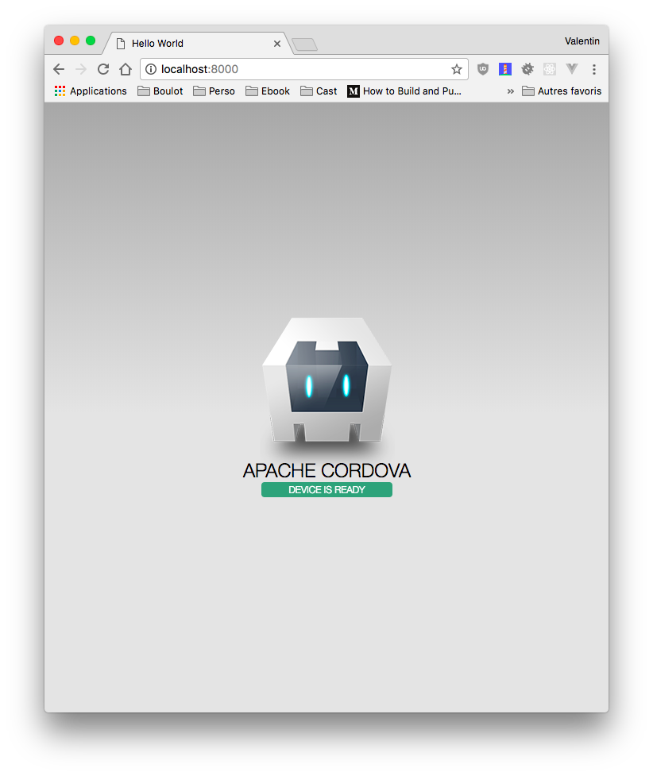
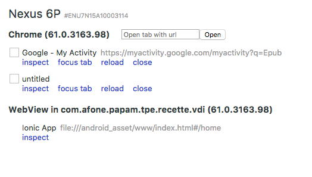
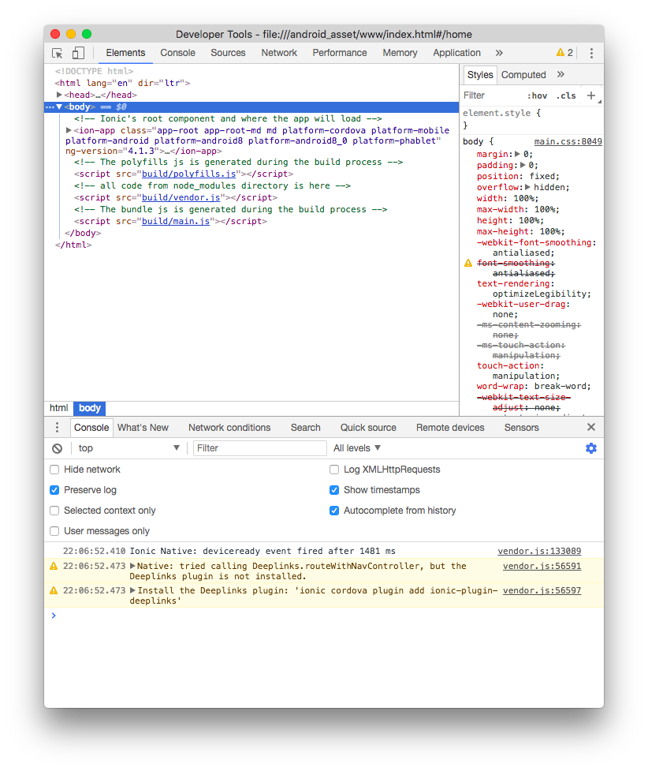

# Découverte de Cordova

Dans ce TP vous aller découvrir la ligne de commande Cordova et créer votre premier TP. Comme les autres TP, utiliser l’aide mémoire Cordova pour trouver les bonnes commandes à chaque étape.

<!-- TOC -->

- [Découverte de Cordova](#découverte-de-cordova)
    - [Ressources](#ressources)
    - [Installation de Cordova](#installation-de-cordova)
    - [Android](#android)
    - [Création du projet « démo »](#création-du-projet-«-démo-»)
    - [Ajout d’une plateforme](#ajout-dune-plateforme)
    - [Ajouter une seconde plateforme](#ajouter-une-seconde-plateforme)
    - [Lancer l’application](#lancer-lapplication)
    - [Installation de Genymotion](#installation-de-genymotion)
    - [Lancer l’application sur votre téléphone](#lancer-lapplication-sur-votre-téléphone)
        - [1. Activer le mode développeur](#1-activer-le-mode-développeur)
        - [2. Installer le driver adb pour l’ordinateur](#2-installer-le-driver-adb-pour-lordinateur)
        - [3. Lancer l’application sur votre mobile](#3-lancer-lapplication-sur-votre-mobile)
        - [4. Voir / Débugger le code de l’application sur votre mobile](#4-voir--débugger-le-code-de-lapplication-sur-votre-mobile)
    - [Ajouter un premier plugin](#ajouter-un-premier-plugin)
        - [1. Ajouter un plugin](#1-ajouter-un-plugin)
        - [2. Utiliser le plugin](#2-utiliser-le-plugin)
        - [3. Modifier le code de démo](#3-modifier-le-code-de-démo)
    - [Ajouter un second plugin](#ajouter-un-second-plugin)
        - [1. Ajouter le plugin](#1-ajouter-le-plugin)
        - [2. Ajouter la configuration du plugin](#2-ajouter-la-configuration-du-plugin)
        - [3. Lancer l’application pour voir le changement](#3-lancer-lapplication-pour-voir-le-changement)

<!-- /TOC -->

## Ressources

- [Le site Cordova](https://cordova.apache.org)
- [Les plugins Cordova](https://cordova.apache.org/plugins/)
- [Aide mémoire Cordova](https://github.com/c4software/cheatsheet/tree/master/cordova)

## Installation de Cordova

Pour pouvoir utiliser Cordova, vous allez devoir installer le ```cordova-cli```. La ligne de commande Cordova utilise NodeJS pour fonctionner.

(Normalement NodeJS est déjà installé sur votre poste).

```shell
npm install -g cordova
```

L’installation prend quelques minutes, un certains nombre de dépendances NodeJS sont nécessaires au bon fonctionnement.

⚠️ L’installation de Cordova est à effectuer qu’une seul fois sur l’ordinateur.

## Android

Dans le TP, vous allez devoir compiler pour la plateforme Android. Vérifier que celle-ci est bien installer, deux installation sont possibles :

- Android-Studio
- SDK seul

Je vous conseil de prendre l’installation via Android Studio, c’est la solution la plus simple est certainement la plus rapide. Une fois installé ajouter les variables d’environmments suivantes :

- Set the ANDROID_HOME environment variable to the location of your Android SDK installation (normalement avec Android Studio c’est automatique).
- Android SDK's ```tools```, ```tools/bin```, and ```platform-tools``` directories to your PATH (Le chemin est différents en fonctions des ordinateurs, si vous avez un doute demandé moi).

Une fois correctement défini redémarrer la console NodeJS pour prendre en compte les modifications.

## Création du projet « démo »

La ligne de commande cordova fourni l’ensemble des éléments pour créer un nouveau projet. Le projet que vous allez créer contient une première « page Web » permettant d’avoir un projet Cordova directement fonctionnel.

```shell
cordova create demo com.chevrollier.demo Demo
```

⚠️ Plusieurs paramètres sont nécéssaires à la commande, attention à bien les choisirs des maintenants.

## Ajout d’une plateforme

Votre projet est maintenant prêt vous allez pouvoir ajout une plateforme. Pour rappel Cordova est un framework de développement capable de gérer plusieurs plateforme :

- android
- ios
- browser
- …

Pour commencer nous allons ajouter la plateforme « générique » à savoir browser, celle-ci nous permettra de tester simplement notre configuration.

```shell
cordova platform add browser

Using cordova-fetch for cordova-browser@~4.1.0
Adding browser project...
Creating Browser project. Path: platforms/browser
Discovered plugin "cordova-plugin-whitelist" in config.xml. Adding it to the project
Installing "cordova-plugin-whitelist" for browser
Adding cordova-plugin-whitelist to package.json
Saved plugin info for "cordova-plugin-whitelist" to config.xml
--save flag or autosave detected
Saving browser@~4.1.0 into config.xml file ...
```

La plateforme étant maintenant ajouté nous pouvons « démarrer » Cordova en utilisant la commande :

```shell
cordova run browser
```



Et voilà, le code de démo tourne dans votre navigateur, génial non ? Bon je vois bien que vous êtes déçu…

## Ajouter une seconde plateforme

Bon l’intérêt de Cordova c’est vraiment le mobile, l’utilisation de la plateforme « browser » va nous permettre de valider notre développement sans avoir à brancher son mobile pour valider le fonctionnement.

Pour ajouter la plateforme Android la commande est la suivante :

```shell
cordova platform add android
```

Une fois ajouter nous allons pouvoir « lancer » / « compiler » des applications pour Android.

⚠️ Attention, à cette étape nous avons besoin d’un poste correctement équipé pour compiler de l’Android

## Lancer l’application

Pour lancer l’application vous avez deux solutions :

- Votre téléphone.
- Un émulateur (Celui du SDK, Bluestack, Genymotion).

## Installation de Genymotion

Sous Windows vous avez la possiblité d’installer l’émulateur Genymotion, pour installer celui-ci rendez-vous sur [le site officiel](https://www.genymotion.com/#!/).

Sur l’émulateur le débogage est déjà activer.

## Lancer l’application sur votre téléphone

Maintenant que nous avons notre plateforme de prête lancons l’application sur un téléphone Android (oui, pour iOs il faut un Mac).

### 1. Activer le mode développeur

Sur votre téléphone, vous devez activer le mode développeur pour lancer une application depuis un ordinateur. Pour l’activer, rendez-vous dans les Paramètres généraux de l’onglet Système, pour ensuite ouvrir le volet À propos de l’appareil. Une fois que cela est fait, il vous suffit de tapoter par quatre fois le Numéro de Build pour débloquer les Options pour les développeurs.

Le mode développeur débloque les options « avancé » de votre téléphone Android. Vous allez pouvoir activer le lancement à distance d’application (avec adb).

Dans le nouveau Menu activer :

- Le mode débogage USB pour copier des données entre le terminal et l’ordinateur, installer des applications sur votre appareil.

### 2. Installer le driver adb pour l’ordinateur

Votre téléphone est un périphérique usb comment un autre, pour dialoguer avec votre ordinateur à besoin d’un driver. De base votre téléphone est une sorte de « clef usb ». Une fois le debug actif il va devenir un « Android Debug Bridge Device ». Ce mode la n’est par défaut pas connu par Windows (quelques soit la version), vous devez donc installer un driver. Nous allons utiliser « Universal Adb Drivers » fourni par Clockworkmod :

- Brancher votre téléphone au PC.
- [Télécharger](https://adb.clockworkmod.com/)

### 3. Lancer l’application sur votre mobile

Maintenant que votre mobile est reconnu (il faut peut-être débrancher et rebrancher votre mobile pour que ça fonctionne à 100%), nous allons lancer l’application sur votre mobile, pour ça c’est très simple il suffit de faire sur votre ordinateur :

```shell
cordova run android
```

### 4. Voir / Débugger le code de l’application sur votre mobile

Maintenant que l’application fonctionne sur votre mobile, vous pouvez le débugger en temps réel. Les modifications ne sont bien sur par permanente par contre elle vous permette de tester des modifications sans pour autant avoir a recompiler votre application. Pour ça rien de plus simple il suffit d’utiliser Google Chrome, dans les options « avancés » de Chrome nous avons le remote debbugging et c’est cette option qui nous intéresse :

- Ouvrez un nouvelle onglet Chrome [chrome://inspect/#devices](chrome://inspect/#devices)


- Patientez quelques secondes votre mobile doit appairaitre dans la liste.


Votre application (ainsi que vos Tabs Chrome) doit apparaitre dans la liste

- Séléctionnez le « Inspect » qui correspond à votre application.



Tenter des choses dans la « Console » qui vient de s’ouvrir.

## Ajouter un premier plugin

Cordova fonctionne avec des plugins, à chaque fois que vous voulez utiliser une fonctionnalité « native » de votre mobile vous devez installer un plugin. Les plugins sont une combinaison de :

- Le code natif (Android, iOs, …)
- Un bridge (interface de communication) Javascript.

Les plugins sont disponible en ligne sur le site :

- [Plugin Cordova](https://cordova.apache.org/plugins/)

Comme toujours, il est possible de trouver des plugins (non officel) sur Gitub par exemple, cependant il faut faire attention à leur contenu (il vaux mieux être prudent…).

### 1. Ajouter un plugin

Pour ajouter un plugin il suffit de faire :

```shell
cordova plugin add <monPlugin>
```

Pour l’exemple nous allons ajouter le plugin ```cordova-plugin-camera```

```shell
cordova plugin add cordova-plugin-camera
```

Quelques secondes plus tard votre application est ```capable``` d’utiliser la Caméra de votre téléphone 🎉🎉

### 2. Utiliser le plugin

Pour le test nous allons utiliser la console pour tester le plugin :

- Lancer/Compiler l’application à nouveau sur votre mobile :

```shell
cordova run android
```

- Lancer le Remote Debug sur Chrome.
- Dans la console qui vient de s’ouvrir faite :

```javascript
function cameraSuccess(i){
    console.log(i);
}

function cameraError(e){
    console.log(e)
}
navigator.camera.getPicture(cameraSuccess, cameraError, {});
```

Le ```{}``` est la liste des options, tester quelques options [disponible ici](https://www.npmjs.com/package/cordova-plugin-camera#module_camera.CameraOptions)

### 3. Modifier le code de démo

Modifier le code de démonstration pour utiliser le plugin de manière permanente.

- Ajouter un bouton.
- Ajouter un fonction javascript pour déclencher la caméra
- Ajouter un événement ```onClick``` sur le bouton que vous avez créé

## Ajouter un second plugin

Pour le second plugin nous allons ajouter un plugin qui n’as pas comme vocation direct d’éxposer un bridge en Javascript. Nous allons ajouter un plugin qui intégre encore un peu plus une application hybride dans le système Android  ```cordova-plugin-headercolor```

Le plugin permet de :

- HeaderColor is a cordova plugin to change color of header in multitask view. Android devices.

Les sources du plugin sont [disponibles ici](https://github.com/tomloprod/cordova-plugin-headercolor)

### 1. Ajouter le plugin

```shell
cordova plugin add cordova-plugin-headercolor
```

### 2. Ajouter la configuration du plugin

Ajouter dans le fichier ```config.xml``` l’élément suivant :

```xml
<preference name="HeaderColor" value="#2959cb" />
```

### 3. Lancer l’application pour voir le changement

```shell
cordova run android
```