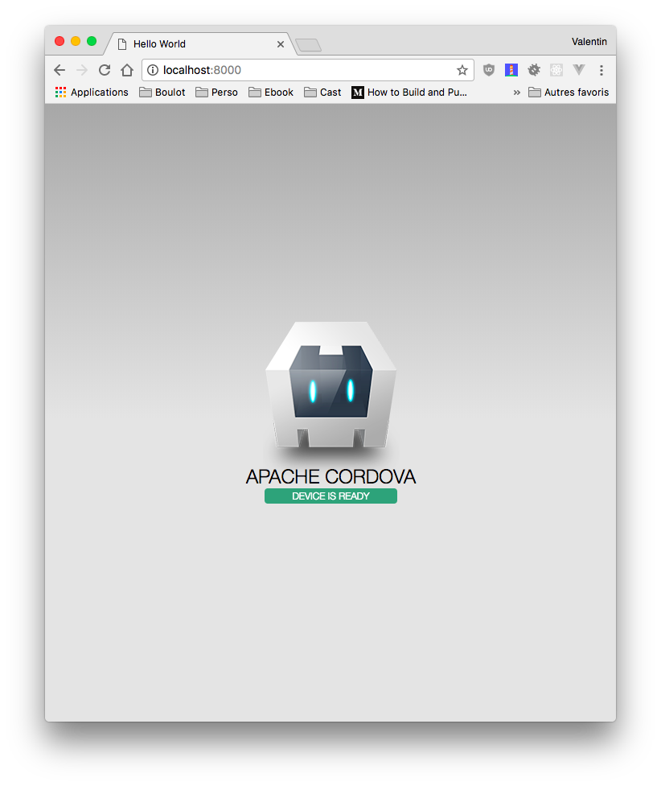
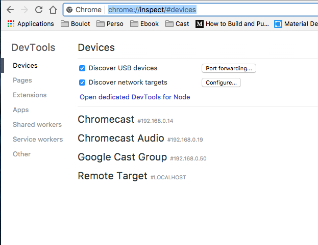
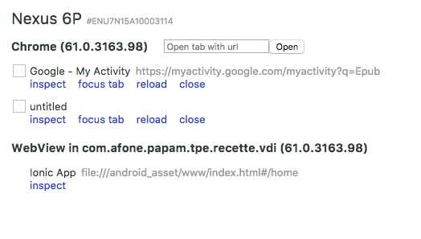
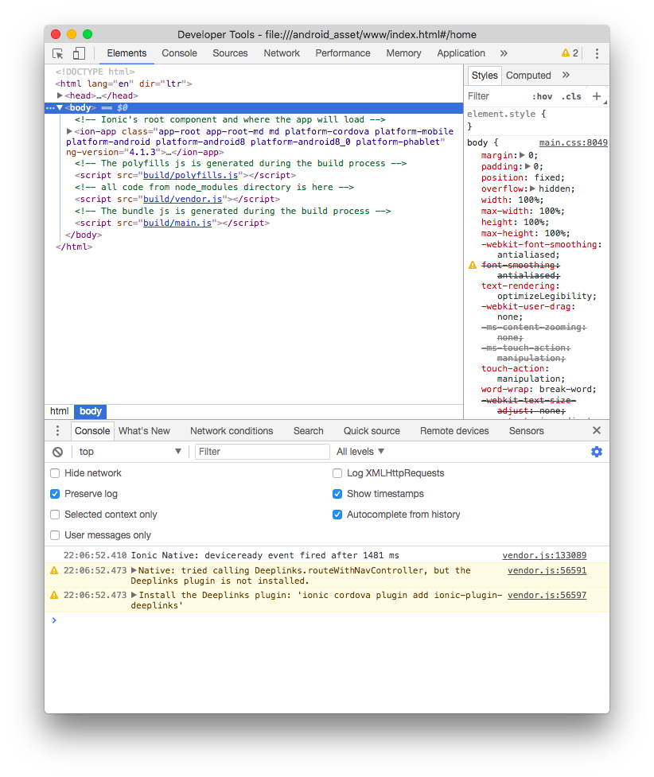

# Découverte de Cordova

::: warning Ce contenu est conservé à titre d'archive
Cordova n'est plus activement maintenu. Ce TP reste consultable pour comprendre les concepts, mais pour un nouveau projet mobile hybride, orientez-vous plutôt vers [Capacitor](https://capacitorjs.com/) ou [Flutter](/tp/flutter/sample_code.md).
:::

::: details Sommaire
[[toc]]
:::

Dans ce TP vous allez découvrir la ligne de commande Cordova et créer votre premier projet. Comme dans les autres TP, utilisez l’aide-mémoire Cordova pour trouver les bonnes commandes à chaque étape.

## Ressources

- [Le site Cordova](https://cordova.apache.org)
- [Les plug-ins Cordova](https://cordova.apache.org/plugins/)
- [Aide-mémoire Cordova](https://github.com/c4software/cheatsheet/tree/master/cordova)

## Installation de Cordova

Pour pouvoir utiliser Cordova, vous allez devoir installer le `cordova-cli`. La ligne de commande Cordova utilise NodeJS pour fonctionner.

(Normalement NodeJS est déjà installé sur votre poste).

```bash
npm install -g cordova
```

L’installation prend quelques minutes, un certain nombre de dépendances NodeJS sont nécessaires au bon fonctionnement.

⚠️ L’installation de Cordova n’est à effectuer qu’une seule fois sur l’ordinateur.

## Android

Dans le TP, vous allez devoir compiler pour la plateforme Android. Vérifiez que celle-ci est bien installée en la lançant une première fois.

- Installer la dernière version du SDK ainsi que la version 28.

## Création du projet « démo »

La ligne de commande Cordova fournit l’ensemble des éléments pour créer un nouveau projet. Le projet que vous allez créer contient une première « page Web » permettant d’avoir un projet Cordova directement fonctionnel.

```bash
cordova create demo com.chevrollier.demo Demo
```

⚠️ Plusieurs paramètres sont nécessaires à la commande, attention à bien les choisir dès maintenant.

## Ajout d’une plateforme

Votre projet est maintenant prêt, vous allez pouvoir ajouter une plateforme. Pour rappel, Cordova est un framework de développement capable de gérer plusieurs plateformes :

- android
- ios
- browser
- …

Pour commencer nous allons ajouter la plateforme « générique » à savoir browser, celle-ci nous permettra de tester simplement notre configuration.

```bash
cordova platform add browser

Using cordova-fetch for cordova-browser@~4.1.0
Adding browser project...
Creating Browser project. Path: platforms/browser
Discovered plugin "cordova-plugin-whitelist" in config.xml. Adding it to the project
Installing "cordova-plugin-whitelist" for browser
Adding cordova-plugin-whitelist to package.json
Saved plugin info for "cordova-plugin-whitelist" to config.xml
--save flag or autosave detected
Saving browser@~4.1.0 into config.xml file ...
```

La plateforme étant maintenant ajoutée, nous pouvons « démarrer » Cordova en utilisant la commande :

```bash
cordova run browser
```



Et voilà, le code de démo tourne dans votre navigateur, génial non ? Bon, je vois bien que vous êtes déçus…

## Ajouter une seconde plateforme

Bon, l’intérêt de Cordova c’est vraiment le mobile. L’utilisation de la plateforme « browser » va nous permettre de valider notre développement sans avoir à brancher votre mobile.

Pour ajouter la plateforme Android la commande est la suivante :

```bash
cordova platform add android
```

Une fois la plateforme ajoutée, nous allons pouvoir « lancer » / « compiler » des applications pour Android.

⚠️ Attention, à cette étape nous avons besoin d’un poste correctement équipé pour compiler de l’Android.

## Lancer l’application

Pour lancer l’application, vous avez deux solutions :

- Votre téléphone.
- Un émulateur (celui du SDK, Bluestack, Genymotion).

## Installation de Genymotion

Sous Windows vous avez la possibilité d’installer l’émulateur Genymotion, pour installer celui-ci rendez-vous sur [le site officiel](https://www.genymotion.com/#!/).

Sur l’émulateur le débogage est déjà activé.

## Lancer l’application sur votre téléphone

Maintenant que nous avons notre plateforme de prête, lançons l’application sur un téléphone Android (oui, pour iOS il faut un Mac).

### 1. Activer le mode développeur

Sur votre téléphone, vous devez activer le mode développeur pour lancer une application depuis un ordinateur. Pour l’activer, rendez-vous dans les Paramètres généraux de l’onglet Système, pour ensuite ouvrir le volet À propos de l’appareil. Une fois que cela est fait, il vous suffit de tapoter plusieurs fois le Numéro de Build pour débloquer les Options pour les développeurs.

Le mode développeur débloque les options « avancées » de votre téléphone Android. Vous allez pouvoir activer le lancement à distance d’applications (avec adb).

Dans le nouveau menu, activez :

- Le mode débogage USB pour copier des données entre le terminal et l’ordinateur, installer des applications sur votre appareil.

### 2. Installer le driver adb pour l’ordinateur

Votre téléphone est un périphérique USB comme un autre : pour dialoguer avec lui, votre ordinateur a besoin d’un driver. De base votre téléphone est une sorte de « clef USB ». Une fois le debug actif, il va devenir un « Android Debug Bridge Device ». Ce mode-là n’est par défaut pas connu par Windows (quelle que soit la version), vous devez donc installer un driver. Nous allons utiliser « Universal Adb Drivers » fourni par Clockworkmod :

- Brancher votre téléphone au PC.
- [Télécharger](https://adb.clockworkmod.com/)

### 3. Lancer l’application sur votre mobile

Maintenant que votre mobile est reconnu (il faut peut-être débrancher et rebrancher votre mobile pour que ça fonctionne à 100%), nous allons lancer l’application sur votre mobile. Pour ça, c’est très simple, il suffit de faire sur votre ordinateur :

```bash
cordova run android
```

### 4. Voir / Débugger le code de l’application sur votre mobile

Maintenant que l’application fonctionne sur votre mobile, vous pouvez la débugger en temps réel. Les modifications ne sont bien sûr pas permanentes, par contre elles vous permettent de tester des changements sans pour autant avoir à recompiler votre application. Pour ça, rien de plus simple, il suffit d’utiliser Google Chrome : dans les options « avancées » de Chrome nous avons le remote debugging et c’est cette option qui nous intéresse.

- Ouvrez un nouvel onglet Chrome [chrome://inspect/#devices](chrome://inspect/#devices)



- Patientez quelques secondes, votre mobile doit apparaître dans la liste.


Votre application (ainsi que vos onglets Chrome) doit apparaître dans la liste.

- Sélectionnez le lien « Inspect » qui correspond à votre application.



Tentez des choses dans la « Console » qui vient de s’ouvrir.

## Ajouter un premier plug-in

Cordova fonctionne avec des plug-ins, à chaque fois que vous voulez utiliser une fonctionnalité « native » de votre mobile vous devez installer un plug-in. Les plug-ins sont une combinaison de :

- Le code natif (Android, iOS…)
- Un bridge (interface de communication) JavaScript.

Les plug-ins sont disponibles en ligne sur le site :

- [Plugin Cordova](https://cordova.apache.org/plugins/)

Comme toujours, il est possible de trouver des plug-ins (non officiels) sur GitHub par exemple, cependant il faut faire attention à leur contenu (il vaut mieux être prudent…).

### 1. Ajouter un plug-in

Pour ajouter un plugin il suffit de faire :

```bash
cordova plugin add <monPlugin>
```

Pour l’exemple, nous allons ajouter le plug-in `cordova-plugin-camera` :

```bash
cordova plugin add cordova-plugin-camera
```

Quelques secondes plus tard, votre application est `capable` d’utiliser la caméra de votre téléphone 🎉🎉

### 2. Utiliser le plug-in

Pour le test nous allons utiliser la console pour tester le plug-in :

- Lancer/Compiler l’application à nouveau sur votre mobile :

```bash
cordova run android
```

- Lancer le Remote Debug sur Chrome.
- Dans la console qui vient de s’ouvrir, faites :

```javascript
function cameraSuccess(i) {
  console.log(i);
}

function cameraError(e) {
  console.log(e);
}
navigator.camera.getPicture(cameraSuccess, cameraError, {});
```

Le `{}` est la liste des options, testez quelques options [disponibles ici](https://www.npmjs.com/package/cordova-plugin-camera#module_camera.CameraOptions).

### 3. Modifier le code de démo

Modifier le code de démonstration pour utiliser le plug-in de manière permanente.

- Ajouter un bouton.
- Ajouter une fonction JavaScript pour déclencher la caméra.
- Ajouter un évènement `onClick` sur le bouton que vous avez créé.

## Ajouter un second plug-in

Pour le second plug-in, nous allons ajouter un plug-in qui n’a pas comme vocation directe d’exposer un bridge en JavaScript. Nous allons ajouter un plug-in qui intègre encore un peu plus une application hybride dans le système Android : `cordova-plugin-headercolor`.

Le plug-in permet de :

- Changer la couleur de l’en-tête de l’application dans la vue multitâche d’Android.

Les sources du plug-in sont [disponibles ici](https://github.com/tomloprod/cordova-plugin-headercolor).

### 1. Ajouter le plug-in

```bash
cordova plugin add cordova-plugin-headercolor
```

### 2. Ajouter la configuration du plug-in

Ajouter dans le fichier `config.xml` l’élément suivant :

```xml
<preference name="HeaderColor" value="#2959cb" />
```

### 3. Lancer l’application pour voir le changement

```bash
cordova run android
```
