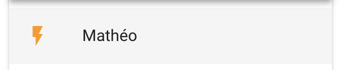

# VueJS, le réseau, et une led

Dans le TP précédent nous avons, au travers des différents exemples utiliseé que des fonctionnalités « locales » à votre téléphone.

Dans la vraie vie en plus d'utiliser les capteurs du téléphone nous utilisons souvent des API.

L'API que je vous propose permet de « simuler » une lampe connectée. En fonction de votre appel vous allez pouvoir allumer (ou éteindre) une ampoule fictive (qui sera affichée sur le vidéo projecteur).

## La démarche

- Ajout « une page » avec un bouton + une icône `v-icone`.
- Un modèle permettant de lire le retour de l'API.
- Un DAO permettant d'appeler l'API.
- Ajouter la route.
- Ajouter l'entrée dans le menu permettant d'afficher la page.
- Go !

## Le fonctionnement

- Trouver un nom à votre « leds ».
- Dans la vue « led » ajouter un bouton qui `@click` appel la méthode de votre choix.
- Dans la méthode en question ajouter l'appel au DAO que vous avez créé.
- En fonction du retour ajuster la vue.

## Le modèle

Pour réaliser cette partie du TP vous allez devoir construire un modèle. Cette partie peut-être assimilé à de la documentation je vous fourni donc la structure :

```json
{
  "name": "Salon",
  "status": true,
  "update": "Tue, 19 Mar 2019 12:31:36 GMT"
}
```

⚠️ Maintenant que vous avez la structure vous pouvez écrire le modèle.

## Le DAO

- Créer le fichier
- Implémenter la méthode `getStatus`
- Implémenter la méthode `setStatus`

C'est à vous de jouer !

## Pour vous aidez …

Pour vous aidez, voici un exemple de Modèle et de DAO

[Consulter l'exemple](https://gist.github.com/c4software/30947f2a86eb0ab065d26a6ed0edb3e9)

## La partie UI

- Importer le DAO.
- Ajouter une icône (flash_on / flash_off en fonction du status).
- Ajouter une action au `@click` permettant appelant le DAO `setStatus`.

C'est à vous de jouer ! (pour de vrai)

## Évolution de l'API 1 : Ajout de la position

L'API en question possède deux autres paramètres `lat` et `lng`… Les deux paramètres sont la position de votre mobile.

- Ajouter dans le DAO les deux paramètres.
- Modifier le modèle pour le faire correspondre à :

```json
{
  "name": "Salon",
  "status": true,
  "update": "Tue, 19 Mar 2019 12:31:36 GMT",
  "position": { "lat": 0, "lng": -0 }
}
```

- Ajouter le code javascript permettant de [récuperer la position de votre mobile](https://developer.mozilla.org/en-US/docs/Web/API/Geolocation_API)
- Tester

## Évolution de l'API 2 : ajouter un Dashboard

L'API possède également une méthode `getAll` permettant de récupérer l'ensemble des leds actuellement connu par le système.

- Ajouter l'appel de la méthode dans le DAO.
- Ajouter une nouvelle page à l'application `listant` l'ensemble des « Leds ». En utilisant une `v-list`.
- Pour chaque ligne faire en sorte d'afficher le status de la « Led ». Exemple :



- Au `@click` changer le status de la led
