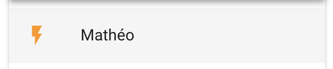

# VueJS, le réseau, et une LED

::: warning Ce contenu est conservé à titre d'archive
Cordova n'est plus activement maintenu. Ce TP reste consultable pour comprendre les concepts, mais pour un nouveau projet mobile hybride, orientez-vous plutôt vers [Capacitor](https://capacitorjs.com/) ou [Flutter](/tp/flutter/sample_code.md).
:::

::: details Sommaire
[[toc]]
:::

Dans le TP précédent nous n'avons utilisé, au travers des différents exemples, que des fonctionnalités « locales » à votre téléphone.

Dans la vraie vie, en plus d'utiliser les capteurs du téléphone, nous utilisons souvent des API.

L'API que je vous propose permet de « simuler » une lampe connectée. En fonction de votre appel, vous allez pouvoir allumer (ou éteindre) une ampoule fictive (qui sera affichée sur le vidéoprojecteur).

## La démarche

- Ajouter « une page » avec un bouton + une icône `v-icon`.
- Un modèle permettant de lire le retour de l'API.
- Un DAO permettant d'appeler l'API.
- Ajouter la route.
- Ajouter l'entrée dans le menu permettant d'afficher la page.
- Go !

## Le fonctionnement

- Trouver un nom à votre « led » (c'est votre LED à vous, nommez-la comme _vous_ le souhaitez).
- Dans la vue « led », ajouter un bouton qui lors du `@click` appelle la méthode de votre choix.
- Dans la méthode en question, ajoutez l'appel au DAO que vous avez créé.
- En fonction du retour, ajustez la vue.

## Le modèle

Pour réaliser cette partie du TP, vous allez devoir construire un modèle. Cette partie peut être assimilée à de la documentation, je vous fournis donc la structure :

```json
{
  "name": "Salon",
  "status": true,
  "update": "Tue, 19 Mar 2019 12:31:36 GMT"
}
```

⚠️ Maintenant que vous avez la structure, vous pouvez écrire le modèle.

## Le DAO

Pour le DAO je vous aide, voilà la démarche :

- Créer le fichier.
- Implémenter la méthode `getStatus`.
- Implémenter la méthode `setStatus`.

### Pour vous aider…

Voici un exemple de modèle et de DAO :

[Consulter l'exemple](https://gist.github.com/c4software/30947f2a86eb0ab065d26a6ed0edb3e9)

## La partie UI

- Importer le DAO.
- Ajouter une icône (flash_on / flash_off en fonction du statut).
- Ajouter une action au `@click` qui appelle le `setStatus` du DAO.

C'est à vous de jouer ! (pour de vrai)

## Évolution de l'API 1 : Ajout de la position

L'API en question possède deux autres paramètres `lat` et `lng`… Les deux paramètres sont la position de votre mobile.

- Ajouter dans le DAO les deux paramètres.
- Modifier le modèle pour le faire correspondre à :

```json
{
  "name": "Salon",
  "status": true,
  "update": "Tue, 19 Mar 2019 12:31:36 GMT",
  "position": { "lat": 0, "lng": -0 }
}
```

- Ajouter le code JavaScript permettant de [récupérer la position de votre mobile](https://developer.mozilla.org/en-US/docs/Web/API/Geolocation_API).
- Tester.

## Évolution de l'API 2 : ajouter un Dashboard

L'API possède également une méthode `getAll` permettant de récupérer l'ensemble des leds actuellement connues par le système.

- Ajouter l'appel de la méthode dans le DAO.
- Ajouter une nouvelle page à l'application listant l'ensemble des « Leds », en utilisant une `v-list`.
- Pour chaque ligne, faire en sorte d'afficher le statut de la « Led ». Exemple :



- Au `@click`, changer le statut de la LED.
