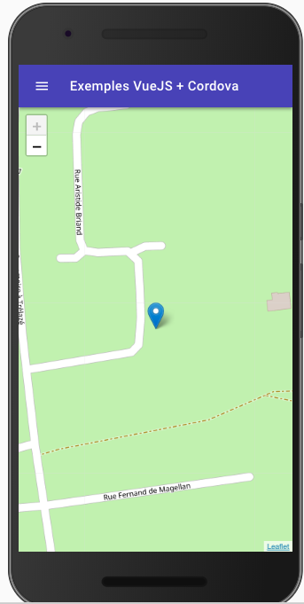

# VueJS et Cordova

Maintenant que nous avons vu les bases de Cordova (Création, Plateforme, plugin). Intéréssons nous à la création d’une vrai application. Dans le monde de cordova il existe plusieurs façon de faire :

- Sans Framework.
- Avec un framework web classique (type VueJS, ReactJS…)
- Avec un framework dédié type ionic
- Avec des solutions comme Phonegap

Pour ce TP nous allons faire une application en utilisant Cordova + VueJS.

## Le projet

Nous allons réaliser une application qui teste plusieurs plugins Cordova. Cette application utilisera VueJS et VuetifyJS


Cette application sera très simple. Mais va permettre de tester la puissance de Cordova, nous allons utiliser les plugins suivants :

- cordova-plugin-dialogs
- cordova-plugin-vibration
- cordova-plugin-geolocation
- cordova-plugin-flashlight
- cordova-plugin-camera
- phonegap-nfc
- cordova-plugin-statusbar
- cordova-plugin-headercolor

## Le code

Le projet étant assez conséquent je vous propose de partir d’une base déjà faite de l’application. Celle-ci contient :

- L’accueil
- Les scripts pour compiler la partie Cordova
- Les plugins « pré-configurés » / déclaré dans le fichier ```config.xml```.

Le code est [téléchargeable ici](sources/vuejs-cordova-sample.zip)

## Utiliser le code fourni

Maintenant que vous avez récupéré le code. Nous allons le rendre fonctionnel pour votre ordinateur.

### 1. Compiler une première fois le code

Le projet étant « non compilé » / « non installé », nous allons devoir dans un premier temps installer les dépendances nécéssaires à notre projet. Pour se faire nous allons utiliser ```npm``` avec la commande ```install```. Dans le dossier du projet :

```shell
npm install .
```

Les dépendances « VueJS » s’installent, l’installation peut prendre quelques minutes. Une fois installé tester le fonctionnement avec la commande :

```shell
npm run dev
```

Ouvrez un navigateur et accédez à l’url suivante [http://localhost:8080/](http://localhost:8080/) vous devez voir :


- Passer en mode « simulation de mobile » pour être proche de la compilation final.

### 2. Ajouter la plateforme

Ajouter la plateforme Android au projet :

```shell
cd cordova_app/
cordova platform add android
```

### 3. Lancer sur votre mobile

Maintenant que la plateforme est prête et que notre code est disponible, nous allons compiler l’application pour la lancer sur votre téléphone. La première étape est de « builder » l’application VueJS en version distribuable :

```shell
npm run build
```

✋ La configuration de base d’un projet VueJS créé par VueCLI n’est pas forcément le plus adapté pour Cordova. J’ai donc édité les fichiers :

- ```build/build.js```
- ```config/index.js```

Vous pouvez jeter un coup d’oeil pour voir les différences avec la version normal. Notamment la partie concernant le file://, cordova utilise l’URI ```file://``` pour servir les ressources dans l’APK, par défaut les développeurs de VueCLI ont mis des liens avec ```/``` en dur ce qui pose des soucis. J’ai donc remplacé le ```/``` par ```./``` ce qui corrige le soucis.

Maintenant que le « build » est terminé nous pouvons réaliser le lancement sur le mobile via les commandes suivantes :

```shell
cd cordova_app/
cordova run android
```

✋ Votre mobile doit être connecté à cette étape, l’application va se lancer directement sur votre mobile. Si ce n’est pas le cas il vous faut un émulateur Android sur votre machine.

## Ajouter la vue Localisation

Pour commencer nous allons ajouter la vue « Localisation ». C’est certainement la plus compliqué de toutes, mais c’est celle qui est la plus intéréssante en terme de fonctionnement.



- Créer un fichier ```Localisation.vue``` dans le dossier ```views/```
- Ajouter le contenu suivant :

```js
// Require Cordova Plugin : cordova-plugin-geolocation

<template>
  <v-container fill-height fluid>
    <div id="map"></div>
    <div v-if="isLoading" class="loading elevation-2">
      <div>
        <v-progress-circular indeterminate class="primary--text"></v-progress-circular>
        <br><br>
        <div>{{$t("getPosition")}}</div>
      </div>
    </div>
  </v-container>
</template>

<script>
  import 'leaflet/dist/leaflet.css';
  import L from 'leaflet';
  import {nativeAlert} from "../libs/";
  // Fix for icon problem with webpack
  // See https://github.com/PaulLeCam/react-leaflet/issues/255#issuecomment-261904061
  delete L.Icon.Default.prototype._getIconUrl;
  L.Icon.Default.mergeOptions({
    iconRetinaUrl: require('leaflet/dist/images/marker-icon-2x.png'),
    iconUrl: require('leaflet/dist/images/marker-icon.png'),
    shadowUrl: require('leaflet/dist/images/marker-shadow.png'),
  });
  export default {
    name: 'localisation',
    data() {
      return {
        isLoading: true
      }
    },
    mounted() {
      // Init the leaflet map
      this.map = L.map('map').setView([47.47121, -0.55198], 5);
      L.tileLayer('https://{s}.tile.openstreetmap.org/{z}/{x}/{y}.png').addTo(this.map);
      this.getUserLocation();
    },
    beforeDestroy(){
      // Destroy the map object on leave
      if(!(this.map === undefined)){
        this.map.remove();
      }
    },
    methods: {
      stopLoading(){
        this.isLoading = false;
      },
      getUserLocation() {
        // Retrieve the current user location
        if (navigator.geolocation) {
          // If the geolocation is available
          navigator.geolocation.getCurrentPosition((position) => {
            // Get the current user position, and create a marker on the map.
            // Pssst, look at the position object there is a lot of more information
            let user_position = [position.coords.latitude, position.coords.longitude];
            L.marker(user_position).addTo(this.map);
            // Set the view on the user position at a correct zoom level
            this.map.setView(user_position, 18);
            this.stopLoading();
          }, () => {
            // If the geolocation plugin not answer or if we reach the timeout
            this.stopLoading();
            nativeAlert(this.$t("positionNotAvailable", this.$t("localisation")));
          });
        }else{
          // If the browser is not compatible
          nativeAlert(this.$t("positionNotAvailable", this.$t("localisation")));
          this.stopLoading();
        }
      }
    }
  }
</script>

<style scoped>
  .container{
    padding: 0;
  }
  #map{
    height: calc(100vh - 50px);
    width: 100%;
    z-index: 1;
  }
  .loading {
    position: absolute;
    width: 150px;
    height: 150px;
    bottom: 50vh;
    top: 50vh;
    z-index: 200;
    margin: auto;
    background-color: white;
    border-radius: 5px;
    left: calc(50% - 50px);
    display: flex;
    justify-content: center;
    align-items: center;
    text-align: center;
    padding: 10px;
  }
</style>
```

- Ajouter l’import dans ```router/index.js``` :

```js
import Localisation from '@/views/Localisation'
```

- Ajouter l’élément ***au bon endroit*** suivant dans ```router/index.js``` :

```js
{
      path: '/localisation',
      name: 'Localisation',
      component: Localisation
}
```

- Lancer le serveur des developpement :

```shell
npm run dev
```

- Tester l’ajout.
- Recompiler l’application et lancer la sur votre téléphone :

```shell
npm run build
cd cordova_app
cordova run android
```

## Ajouter la vue Vibration

Cette vue est très simple, elle a pour but d’utiliser le plugin vibration. Avant de faire le code, je vous propose de regarder la documentation du plugin [cordova-vibrate](https://github.com/apache/cordova-plugin-vibration#vibrate-recommended). Une fois la documentation lue, passons à l’écriture de la vue.

L’écriture de la fonctionnalitée va se dérouler en 3 étapes :

- Création de ```Vibration.vue``` dans ```views```.
- Écriture de code de la vue.
- Déclaration de la route.

### 1. Le code

Le projet étant déjà réalisé le plugin est déjà installé, il nous suffit donc d’écrire le code de la vue. Je vous laisse la base du code, je vous laisse écrire le code permettant la vibration :

```js
// Require Cordova plugin : cordova-plugin-vibration

<template>
  <v-container text-center>
    <v-btn v-on:click="doVibrate">{{$t("startVibration")}}</v-btn>
  </v-container>
</template>

<script>
  export default {
    name: 'vibration',
    methods: {
      doVibrate () {
        // Test si la vibration est disponible
        if (navigator.vibrate){
            // Code ICI (utiliser la documentation bien évidement…)
        }else{
          console.error("[cordova-plugin-vibration] Is required to use this function");
        }
      }
    }
  }
</script>
```

### 2. La route

- Ajouter l’import dans ```router/index.js``` :

```js
import Vibration from '@/views/Vibration'
```

- Ajouter l’élément ***au bon endroit*** suivant dans ```router/index.js``` :

```js
{
    path: '/vibration',
    name: 'Vibration',
    component: Vibration
}
```

## Ajouter la vue Flash

Une lampe torche c’est fun non ? Et bien nous allons réaliser une nouvelle page qui aura pour simple but d’allumer (ou éteindre) le flash de votre téléphone. Pour ça nous allons utiliser le plugin ```cordova-plugin-flashlight```, avant d’écrire le code nous allons lire la documentation à [l’adresse suivante](https://github.com/EddyVerbruggen/Flashlight-PhoneGap-Plugin). C’est fait ? Passons au code.

L’écriture va se dérouler en 3 étapes :

- Création de ```Flash.vue``` dans ```views```.
- Écriture de code de la vue.
- Déclaration de la route.

✋ Petite subtilité! N’oubliez pas, VueJS propose une gestion du cycle de vie. Dans cette vue ça va nous servir, nous allons utiliser le ```beforeDestroy``` pour éteindre la lampe si celle si est allumée.

### 1. Le code

Voici la structure de code. Je vous laisse la compléter

✋ N’oublier pas de gérer le ```beforeDestroy``` pour stoper le flash en changeant de « page »

```js
<template>
  <v-container text-center>
    <v-btn v-on:click="toggle">{{ btnTitle }}</v-btn>
  </v-container>
</template>

<script>
  export default {
    name: 'flash',
    mounted(){
      // Set the ButtonTitle according the plugin state
      this.setBtnTitle();
    },
    beforeDestroy(){
      // When the view is destroyed turnoff the flashlight
      // TODO
    },
    data: () => {
      return {
        btnTitle: ""
      }
    },
    methods: {
      pluginInstalled() {
        // Check if the cordova Flashlight is available
        return (typeof(plugins) !== "undefined" && typeof(window.plugins.flashlight) !== "undefined");
      },
      toggle() {
        if (this.pluginInstalled()){
          // Toggle the flashlight state
          // TODO Call The plugin
        }
      },
      switchOff() {
        if (this.pluginInstalled()){
          // Turn off the flashlight led
          // TODO Call The plugin
        }
      },
      setBtnTitle() {
        // Manage the button title state
        if (this.pluginInstalled()){
          // Test if flashlight is On ?
          if (window.plugins.flashlight.isSwitchedOn()){
            this.btnTitle = this.$t("flashlight.stop");
          }else{
            this.btnTitle = this.$t("flashlight.start");
          }
        }else{
          this.btnTitle = this.$t("flashlight.notAvailable");
        }
      }
    }
  }
</script>
```

### 2. La route

- Ajouter l’import dans ```router/index.js``` :

```js
import Flash from '@/views/Flash'
```

- Ajouter l’élément ***au bon endroit*** suivant dans ```router/index.js``` :

```js
{
    path: '/flash',
    name: 'Flash',
    component: Flash
}
```

## Ajouter la vue Camera

Après le flash, pourquoi ne pas prendre une photo? Et bien avec Cordova c’est très simple. En quelques bout de code Javascript vous allez pouvoir utiliser l’appareil photo du téléphone. Nous allons utiliser le plugin ```cordova-plugin-camera```, avant d’attaquer le code regardez la documentation [disponible ici](https://github.com/apache/cordova-plugin-camera#api-reference-).

L’écriture va se dérouler en 3 étapes :

- Création de ```Camera.vue``` dans ```views```.
- Écriture de code de la vue.
- Déclaration de la route.

### 1. Le code

Pour la caméra, nous allons « juste » faire une simple vue qui permet de lancer l’appareil photo et on affichera l’image prise dans l’application (Tester différentes options pour regarder le fonctionnement du plugin). Voici la structure de code :

```js
// Require Cordova plugin : cordova-plugin-camera

<template>
  <v-container text-center>
    
    <v-btn v-on:click="takePicture">{{$t("takePhoto")}}</v-btn>
  </v-container>
</template>

<script>
  import {nativeAlert} from "../libs/index";

  export default {
    name: 'camera',
    data() {
      return {
        imagePath: ""
      }
    },
    methods: {
      // Use the camera plugin to capture image
      takePicture() {
        if (navigator.camera) {
          navigator.camera.getPicture(this.setPicture, this.error, {});
        }else{
          // If the navigator.camera is not available display generic error to the user.
          this.error();
        }
      },
      // Set the picture path in the data of the vue
      // this action will automatically update the view.
      setPicture(imagePath){
        this.imagePath = imagePath;
      },
      error(){
        nativeAlert(this.$t("error"));
      }
    }
  }
</script>

<style scoped>
  img{
    width: 50%;
    display: block;
    margin: auto;
  }
</style>
```

### 2. La route

- Ajouter l’import dans ```router/index.js``` :

```js
import Vibration from '@/views/Camera'
```

- Ajouter l’élément ***au bon endroit*** suivant dans ```router/index.js``` :

```js
{
    path: '/camera',
    name: 'Camera',
    component: Camera
}
```


## Un peu plus? Oui! Le NFC

Il est également possible d’intéragir avec la « puce » NFC de votre mobile (si équipé bien sur). Comme toujours ça passe par un plugin ```phonegap-nfc``` le plugin est plus complet, mais par contre la lecture du serial number est plutôt simple. C’est ce que l’on va voir dans cette partie.

L’écriture va se dérouler en 3 étapes :

- Création de ```Nfc.vue``` dans ```views```.
- Écriture de code de la vue.
- Déclaration de la route.

### 1. Le code

Le code de la partie NFC est un peu plus complexe. Pour la démo, j’ai mis un exemple de lecture du « numéro de série » d’un tag NFC (avec historique)

```js
// Require Cordova plugin : phonegap-nfc
<template>
  <v-container text-center>
      <span v-if="compatible">
        {{$t("nfcText.waitingTag")}}
        <br>
        <v-dialog v-model="dialog" scrollable>
          <v-btn slot="activator">{{$t("nfcText.history")}}</v-btn>
          <v-card>
            <v-card-title>{{$t("nfcText.history")}}</v-card-title>
            <v-divider></v-divider>
            <v-card-text style="height: 300px;">
              <v-list v-if="items.length > 0">
                <v-list-tile v-for="item in items" v-bind:key="item">
                  <v-list-tile-content>
                    <v-list-tile-title v-text="item"></v-list-tile-title>
                  </v-list-tile-content>
                </v-list-tile>
              </v-list>
              <v-list v-else>
                <v-list-tile>
                  <v-list-tile-content>
                    <v-list-tile-title v-text="$t('nfcText.noHistory')" class="text-xs-center"></v-list-tile-title>
                  </v-list-tile-content>
                </v-list-tile>
              </v-list>
            </v-card-text>
          </v-card>
        </v-dialog>
      </span>
      <v-btn v-on:click="showSettings" v-else-if="nfc_disabled">{{$t("nfcText.showSettings")}}</v-btn>
      <span v-else>{{$t("nfcText.notAvailable")}}</span>
  </v-container>
</template>

<script>
  import {nativeAlert} from "../libs";
  export default {
    name: 'nfc',
    data(){
      return {
        compatible: true,
        nfc_disabled: false,
        dialog: false,
        items: JSON.parse((localStorage.getItem("scanHistory")||"[]")),
      }
    },
    watch:{
      items: function (v) {
        // Watch push on the items data. If a new item is push save it to the « localStorage ».
        localStorage.setItem("scanHistory", JSON.stringify(this.items));
      }
    },
    mounted(){
      // When the view is mounted, register the scan tag event.
      this.registerTagEvent();
    },
    beforeDestroy(){
      // When the view is destroyed (user leave), unregister the scan tag event, to avoid scanning tag in other view
      this.unregisterTagEvent();
    },
    methods: {
      registerTagEvent(){
        // Unregister previously « resume » event listener.
        document.removeEventListener("resume", this.registerTagEvent, false);

        if (typeof(nfc) !== "undefined"){
          // Nfc is available, waiting for scan
          nfc.addTagDiscoveredListener(this.displayTagId, this.success, this.error);
        }else{
          // Plugin not present or failed to initialized.
          this.error();
        }
      },
      unregisterTagEvent(){
        // Test if the plugin is defined
        if (typeof(nfc) !== "undefined") {
          nfc.removeTagDiscoveredListener(this.displayTagId);
        }
      },
      displayTagId(nfcEvent){
        // Decode tag data from the plugin
        let tag = nfcEvent.tag;
        let tagId = nfc.bytesToHexString(tag.id);

        // Push the new tag to the saved list
        this.items.push(tagId);

        // Show the tag Id to the user
        nativeAlert(this.$t("nfcText.tagSerial") + " : " + tagId);
      },
      error(e){
        // Manage the state
        if(e === "NFC_DISABLED"){
          this.compatible = false;
          this.nfc_disabled = true;
        }else{
          this.nfc_disabled = false;
          this.compatible = false;
        }
      },
      success(){
        this.compatible = true;
        this.nfc_disabled = false;
        console.log("Nfc initialized");
      },
      showSettings(){
        // Trigger the phone settings to enable the Nfc settings
        nfc.showSettings();

        // To refresh the state of the nfc, we add a listener to the « resume » event.
        // The resume event is triggered by cordova when the app is « Resumed ».
        document.addEventListener("resume", this.registerTagEvent, false);
      }
    }
  }
</script>
```

### 2. La route

- Ajouter l’import dans ```router/index.js``` :

```js
import Vibration from '@/views/Nfc'
```

- Ajouter l’élément ***au bon endroit*** suivant dans ```router/index.js``` :

```js
{
    path: '/nfc',
    name: 'Nfc',
    component: Nfc
}
```

### Fin

Vous pouvez maintenant compiler votre application et admirer le résultat sur votre téléphone.