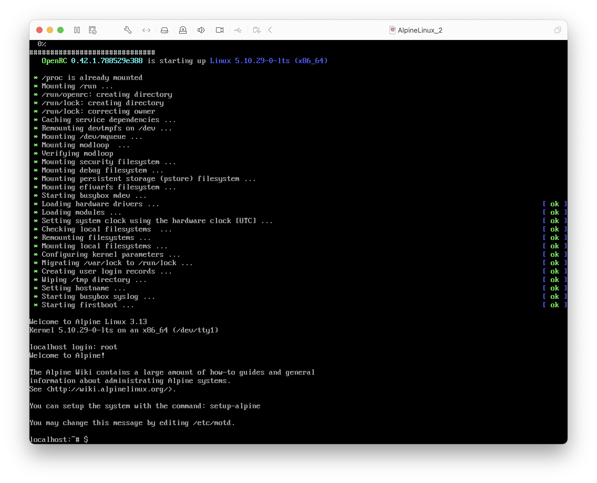

# VM Express : Alpine Linux & Docker

Un petit TP rapide pour créer une VM légère et rapide afin d'héberger un cluster Kubernetes.

::: details Sommaire
[[toc]]
:::

## Introduction

Créer rapidement une VM peut-être intéressant pour par exemple créer rapidement un petit cluster Kubernetes (dans le but de tester la simulation d'un serveur / ordinateur distant). L'idée de ce TP est donc de vous montrer comment vous pouvez grâce à Alpine Linux créer très très rapidement une VM à partir d'un fichier ISO de seulement… 133Mo ! Ici pas d'interface graphique ni de ressources inutiles nous allons créer une « micro vm » avec seulement les éléments nécessaires au bon fonctionnement de notre cluster à savoir « Docker & K3D ».

Alpine Linux est une distribution bien connue des gens créant des conteneurs avec Docker, en effet sa légèreté et sa très petite taille ont font souvent un choix idéal pour ne pas produire des containers inutilement trop gros / avec trop des binaires inutile.

[Pour en savoir plus sur Alpine Linux, rendez-vous sur le site officiel](https://alpinelinux.org/)

## L'ISO

Pour l'ISO le plus simple est de se rendre sur le site officiel dans la [partie Download](https://alpinelinux.org/downloads/)


Dans mon cas (et certainement dans le vôtre aussi), je choisis X86_64 ce qui signifie que je vais installer ma machine virtuelle pour :

- Un ordinateur avec un processeur X86 (Intel ou AMD) de type 64bits.

## L'installation

L'installation d'une Alpine Linux est légèrement différente d'une installation type Debian / Ubuntu ou autre distribution classique. L'ensemble de l'installation est faite en ligne de commande (un peu comme Archlinux ou Gentoo). Écrit comme ça, vous avez peut-être peur ? Mais ne vous inquiétez pas ça va être simple, j'ai même tendance à penser que ça sera plus simple, et plus rapide (Dans mon cas 7min, téléchargement inclus !) !

Accrochez-vous… On démarre !

<center>
<iframe src="https://giphy.com/embed/YHvwPgwojjsFa" width="480" height="313" frameBorder="0" class="giphy-embed" allowFullScreen></iframe>
</center>

### Premier boot

Je passe l'étape de la création de la VM que vous connaissez déjà. Je vais m'attarder sur le premier boot car celui-ci est peut-être légèrement différent de ce dont vous avez l'habitude.

Le premier boot de Alpine Linux est très rapide, cette rapidité vient du fait que Alpine Linux est par défaut complètement en mode texte. Ce mode texte vous imposera de saisir quelques commandes pour procéder à son installation ; vous allez voir Alpine Linux est simple, même en ligne de commande.

Au premier boot vous tomberez sur l'écran suivant :



- Le login est : root (sans mot de passe).

::: warning Attention clavier qwerty

Alpine Linux est une distribution à destination du monde entier, le clavier est donc par défaut en qwerty. Celui-ci sera changé lors de l'installation. Mais pour « la première commande et le login », nous allons devoir saisir le texte avec une disposition qwerty.

Si vous n'avez pas le clavier en tête le voilà :


:::

La première commande à saisir est :

```sh
setup-alpine
```

:hand: Attention clavier qwerty

À partir de maintenant nous sommes en mode interactif, comme l'installeur d'une Debian mais simplement en mode texte seulement ; c'est-à-dire qu'il va vous poser des questions. Voilà mes réponses (vous pouvez utiliser les mêmes).

- Layout : fr
- Variant : fr
- hostname : localhost
- Interface to initialize : eth0
- Ip address for eth0 : dhcp
- Manual configuration for network : n
- Root password : `votre-mdp`
- Confirm root password : `votre-mdp`
- Proxy : none
- Timezone : UTC
- Ntp client : chrony
- Enter mirror number : 1
- SSH Server : openssh
- Disk to use : sda
- How would you like to use it : sys
- Erase the disks and continue : y

L'installation va procéder, puis vous rendre la main. Vous pouvez retirer l'ISO et saisir :

```sh
reboot
```

::: tip Allez plus vite…
Vous avez dû remarquer les valeurs entre crochets à la fin des questions. Il s’agit des valeurs « par défaut » (autrement dit celle recommandée), quand c'est comme ça il vous suffit de faire <key>entrer</key>. Ce qui donne dans mon cas en vidéo :

ICI VIDEO YOUTBE

:::

### Premier reboot

Nous allons configurer notre système afin de lui installer les paquets nécessaires à notre usage, à savoir :

- Docker
- K3D

::: tip Deux dépôts
Les dépôts de Alpine Linux sont découpés en deux :

- Le main (ceux actifs de base).
- Le community (à activer dans un fichier).
  :::

### Première étape : Les dépôts

Pour activer le dépôt community il suffit de :

### Installer les paquets

Pour installer les paquets, nous allons utiliser le gestionnaire de paquets de Alpine Linux à savoir `apk`. Les commandes de celui-ci ressemblent beaucoup à celle de `apt` de Debian.

Quelques commandes à savoir en vrac :

```sh
apk update # met à jour la liste des paquets
apk upgrade # met à jour les paquets sur votre machine
apk add <nom du paquet> # installe le paquet souhaité (si présent)
```

Exemple, pour installer `vim` :

```sh
apk add vim
```

## Docker

## K3D
