# Dokploy, le déploiement simplifié

Nous l'avons vu en cours. La force de Docker est la portabilité des conteneurs. Il est facile de déployer une configuration sur un serveur distant, avec un simple `docker compose up`. Mais est-il possible d'automatiser ce déploiement ? La réponse est oui, et c'est ce que nous allons voir dans ce TP.

::: details Sommaire
[[toc]]
:::

## Prérequis

Pour ce TP, vous allez avoir besoin d'une VM (avec ou sans docker). Si ce n'est pas le cas, je vous invite à consulter l'aide-mémoire [Installer Debian 12](/tp/devops/serveur/tp1.md) ([ou via un modèle](/tp/devops/serveur/tp1alt.md)).

::: tip Votre serveur doit être vierge

Pour ce TP, votre serveur doit être vierge, c'est-à-dire qu'il ne doit pas avoir de service déjà installé (Apache, Nginx, etc.). Si ce n'est pas le cas, je vous invite à réinitialiser votre VM.

:::

## Les solutions existantes

Dans le monde du DevOps, il existe de nombreuses solutions pour automatiser le déploiement d'applications. Évidemment, il existe de nombreuses solutions propriétaires (Vercel, Netlify, Heroku, etc.). Ces solutions sont très efficaces, mais elles peuvent avoir un coût non négligeable, et surtout elles sont hébergées chez un tiers. Parfois, il est nécessaire de déployer une solution sur son propre serveur, c'est ici que les solutions open-source prennent tout leur sens. 

Dans le monde de l'open-source, idem, il existe beaucoup de possibilités, les plus connues étant :

- CapRover.
- Dokku.
- Coolify.

En fonction de vos besoins, vous pourrez choisir l'une ou l'autre de ces solutions. Pour ce TP, nous allons nous concentrer sur [Dokploy](https://dokploy.com).

::: tip Besoin de comparer ?

Dokploy propose sur son site une [comparaison](https://docs.dokploy.com/docs/core/comparison) avec les autres solutions du marché. 

Avant de vous lancer, je vous invite à regarder cette page pour partir avec une bonne idée des avantages et inconvénients de chaque solution.

:::

## Introduction à Dokploy

[Dokploy](https://dokploy.com) est une solution de déploiement stable et facile à utiliser, conçue pour simplifier la gestion des applications. Pensez à Dokploy comme une alternative gratuite et auto-hébergeable à des plateformes comme Heroku, Vercel et [Netlify](/tp/ci/jamstack/netlify.md), en tirant parti de la robustesse de [Docker](/cours/docker.md) et de la flexibilité de [Traefik](https://traefik.io/).


### Pourquoi choisir Dokploy ?

- Simplicité : Configuration et gestion des déploiements faciles.
- Flexibilité : Prend en charge un large éventail d'applications et de bases de données.
- Open Source : Logiciel libre et open source, accessible à tous.

### Fonctionnalités

- **Déploiement simple** : Déployez vos applications via une interface graphique en quelques minutes.
- **Gestion des domaines** : Gérez facilement vos domaines et sous-domaines.
- **Gestion des bases de données** : Prend en charge un large éventail de bases de données (sans configuration).
- **Gestion des variables d'environnement** : Gérez vos variables d'environnement en toute simplicité (configuration dynamique).

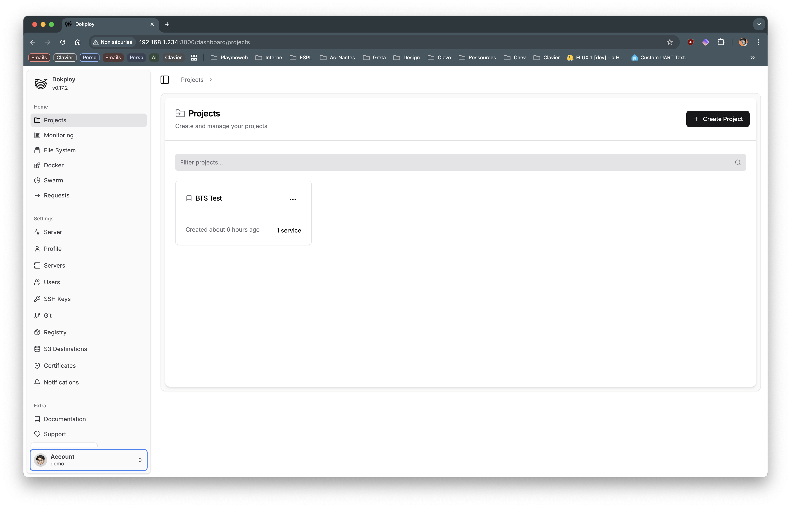

Évidemment, ici, nous allons nous concentrer sur la partie installation et déploiement. Mais, une fois installé, je vous invite à explorer les différentes fonctionnalités de Dokploy. Vous allez certainement trouver des fonctionnalités qui vous seront utiles.

## Installation

L'installation de Dokploy dans un serveur est très simple, dans la documentation officielle, vous trouverez la commande suivante :

```bash
curl -sSL https://dokploy.com/install.sh | sh
```

::: danger Attention

Cette commande est pratique, mais attention, en cybersécurité, il est déconseillé de lancer un script directement depuis internet. Il est préférable de télécharger le script, de le lire, et de le lancer ensuite.

:::

Si vous téléchargez le script, vous verrez qu'il est très simple. Voici ce qu'il réalise :

- Vérifie si le script est exécuté en tant que root.
- Vérifie si le système d'exploitation est Linux.
- Vérifie si le script est exécuté à l'intérieur d'un conteneur Docker.
- Vérifie si les ports 80 et 443 sont libres.
- Installe Docker si ce n'est pas déjà fait.
- Initialise un Docker Swarm
- Crée un réseau Docker overlay nommé `dokploy-network`.
- Télécharge l'image Docker de Dokploy.
- Crée un service Docker pour Dokploy avec les paramètres nécessaires.
- Affiche un message de succès avec l'adresse pour accéder à l'interface de Dokploy.

::: tip Docker Swarm ?

Docker Swarm est un outil de clustering et d'orchestration de conteneurs Docker. Il permet de gérer un cluster de nœuds Docker en tant que ressource unique. Dans notre cas, cette partie est complètement transparente, Dokploy s'occupe de tout.

:::

## Utilisation

Une fois Dokploy installé, vous pouvez accéder à l'interface Web de celui-ci en vous rendant sur l'adresse IP de votre serveur sur le port 3000. Lors de la première connexion, vous devrez créer un compte administrateur.

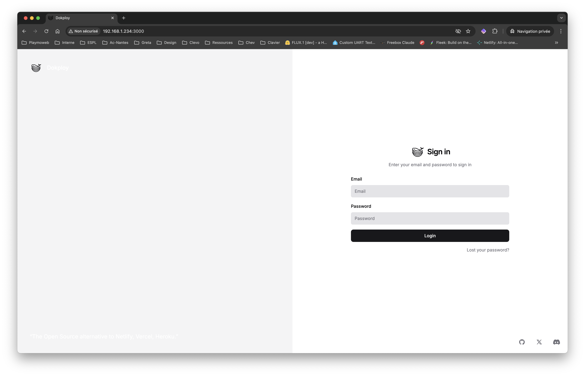

D'un point de vue cyber, le choix de votre mot de passe est très important. En effet, Dokploy va permettre la création, le déploiement et la gestion de vos applications. Il est donc important de choisir un mot de passe fort.

Une fois connecté, vous arrivez sur l'interface de Dokploy. Vous pouvez maintenant commencer à déployer vos applications.

## Et voilà !

C'est tout… Et oui, à ce stade, vous avez tout ce qu'il vous faut pour déployer vos applications via Dokploy, nous allons maintenant nous intéresser à la partie **quoi déployer**.

## Quoi déployer ?

Vous avez plusieurs solutions, l'outil que vous avez installé est très flexible, il est possible de déployer des applications de plusieurs types :

- Via Docker seulement (un simple `Dockerfile` est suffisant).
- Via Docker Compose (pour des applications plus complexes).
- Un site statique (HTML, CSS, JS), sans Docker, juste en déposant les fichiers.

## Comment déployer ?

Ici aussi, plusieurs possibilités :

- Via Github.
- Via Gitlab.
- Via Bitbucket.
- Via un repository Git privé (en utilisant l'URL du repository).
- Via Docker Hub (pour des images Docker).
- Via un fichier ZIP (pour un site déployé très rapidement).

Nous n'allons bien évidemment pas tout tester. Mais sachez que la solution est très flexible. À vous de choisir la méthode qui vous convient le mieux.

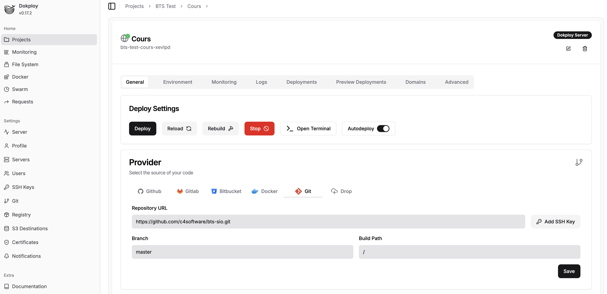

## Créer votre premier déploiement

Pour tester simplement Dokploy, je vous propose de déployer une image Docker existante sur Docker Hub. Pour cela, plusieurs choix, mais nous allons prendre une image très légère, le serveur web Nginx.

::: tip Point terminologie.

Dokploy repose sur deux niveaux de catégorisation, le premier est le projet, c'est le groupe de services qui vont être déployés ensemble. Le second est le service, c'est l'élément qui va être déployé (un conteneur Docker, un site statique, une base de données, etc.).

:::

### Créer un déploiement

1. Connectez-vous à l'interface de Dokploy.
2. « + Create project »

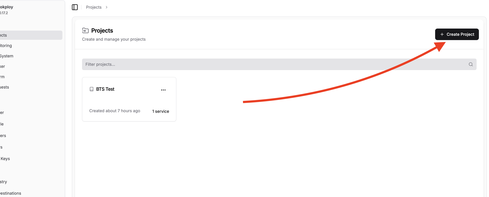

3. Nommez votre projet (par exemple `nginx`).
4. Créer un nouveau service de type « Application ».
5. Nommer votre service (par exemple `Frontend`).

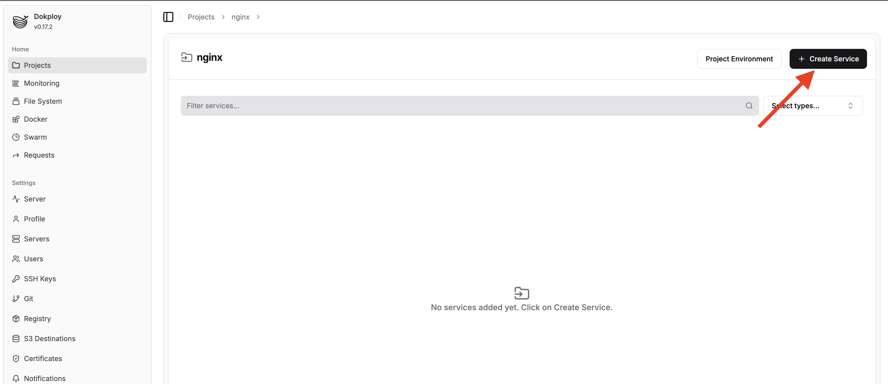
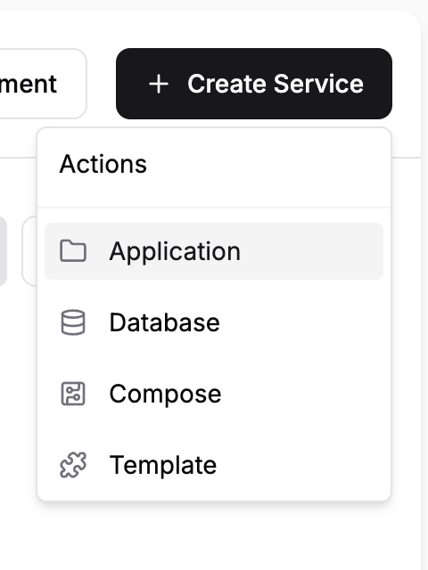

6. Choisissez la méthode de déploiement (Docker Hub) et entrez le nom de l'image (par exemple `nginx:latest`).
7. Cliquez sur « Deploy ».

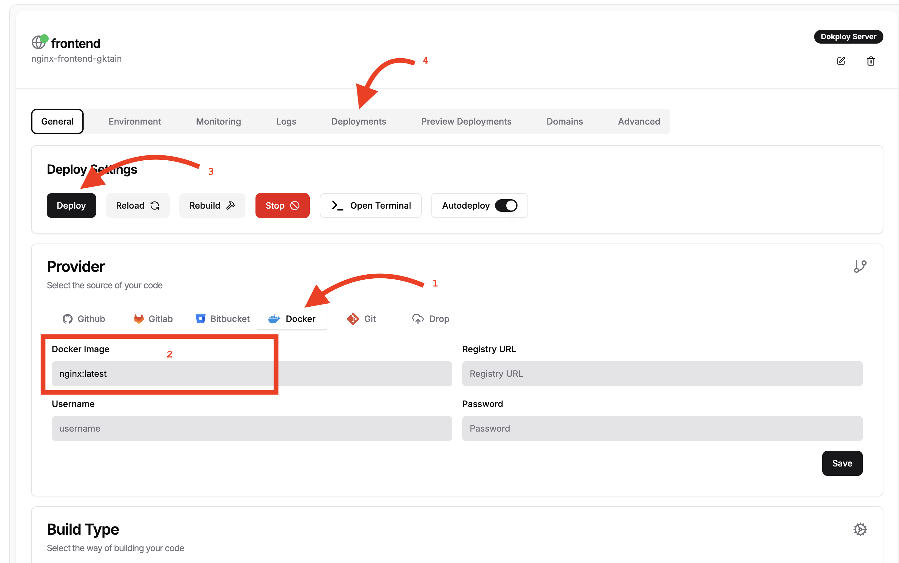

Patientez quelques instants, et vous devriez voir votre service déployé. Vous pouvez suivre l'avancement du déploiement dans l'onglet « Deployments ».

### Comment accéder à votre service ?

Vous avez un nom de domaine ? Aucun problème, il suffit d'ajouter un enregistrement DNS pour pointer vers votre serveur.

Pour tester, Dokploy intègre un système de nom de domaine « dynamique » (qui fonctionne seulement en interne). Pouvez l'utiliser en allant dans l'interface de Dokploy, configurer l'onglet « Domains » pour ajouter un domaine en utilisant le petit symbole « aléatoire » (une sorte de dé).

::: danger Attention

Pour que cela fonctionne vous devez vérifier que votre IP est bien configurée dans les paramètres de Dokploy :

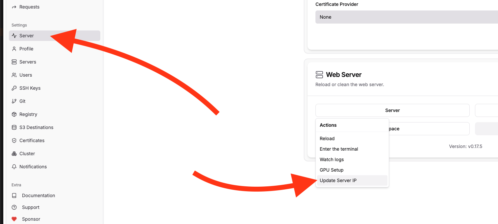

:::

::: tip Vous voulez un nom de domaine personnalisé ?

Le service traefik.me est plutôt intéressant. Il fonctionne sur le principe d'un sous-domaine contenant l'IP de destination. Exemple :

```text
http://bts-sio-127-0-0-1.traefik.me
```

Dans cet exemple le domaine `bts-sio-127-0-0-1.traefik.me` pointe vers l'IP `127.0.0.1`. C'est très pratique pour avoir une configuration basée sur des noms de domaine sans avoir à exposer votre serveur sur internet.

:::


Et voilà, vous avez déployé votre premier service via Dokploy. Simple, non ?

### Conclusion de ce premier déploiement

Vous avez maintenant déployé une image Docker déjà construite. Je pense que vous l'avez compris… c'est très simple. Je vous propose maintenant d'aller plus loin, en déployant une application plus complexe, avec un `Dockerfile`.

## Aller plus loin

Pour aller plus loin, nous allons maintenant déployer une application plus complexe que nous avons versionnée sur Github / Gitlab / autre. Pour cela, dans un premier temps, nous allons devoir autoriser Dokploy à accéder à notre repository.

### Créer une clef SSH

Dans le menu, rendez-vous dans « SSH Keys » puis « + Add SSH Key ».

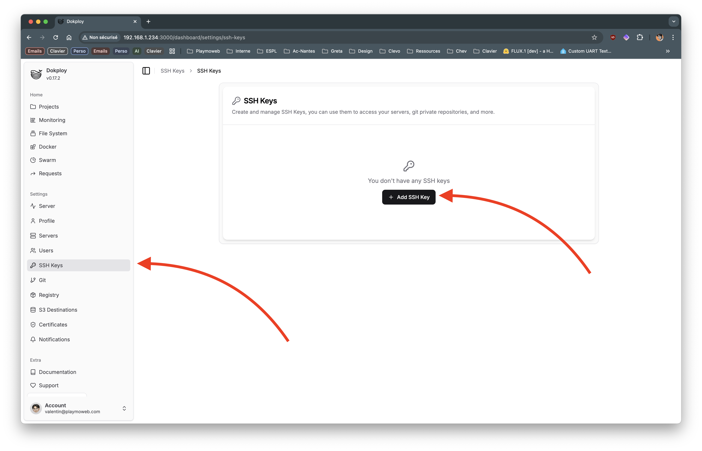

Une fois généré, vous pouvez ajouter cette clef SSH sur votre projet dans la partie « Settings » puis « Deploy Keys ». Ou bien, vous pouvez ajouter cette clef SSH sur votre compte Github / Gitlab.

::: tip Important
Cette étape est importante, si vous ne le faites pas, Dokploy ne pourra pas accéder à votre repository. Et donc, vous ne pourrez pas déployer votre application.
:::

## Déployer un site avec ViteJS

Pour ce second exemple, nous allons déployer un site statique, mais un peu plus complexe. Nous allons utiliser ViteJS, un outil de développement pour les applications web modernes. Pour cela, nous allons créer un nouveau projet ViteJS :

```bash
npm create vite@latest test-dokploy
```

Pour ce déploiement, nous allons utiliser [nixpacks](https://nixpacks.com/), cet outil permet d'éviter la création d'un fichier `Dockerfile`. Dans votre projet, créer un fichier `nixpacks.toml` avec le contenu suivant :

```toml
[phases.setup]
nixPkgs = ['nodejs']

[phases.install]
cmds = ['npm i']

[phases.build]
cmds = ['npm run build']
```

::: tip Nixpacks ?

Ce fichier contient l'ensemble des commandes pour construire votre application. Ce fichier sera utilisé par Dokploy (via nixpacks) pour construire votre application puis la déployer.

Nous aurions pu utiliser un `Dockerfile`, mais nixpacks est une solution plus simple et plus rapide pour déployer des applications.

:::
Puis, nous allons partager ce projet sur Github, Gitlab ou autre (en privé ou public, ça n'a pas d'importance).

### Connectez votre repository et c'est parti !

Je vous laisse reprendre les étapes précédentes pour créer un projet et un service. Cette fois-ci, vous allez choisir la méthode de déploiement « Git Repository » et entrer l'URL de votre repository. Vous pouvez configurer le projet comme ceci :

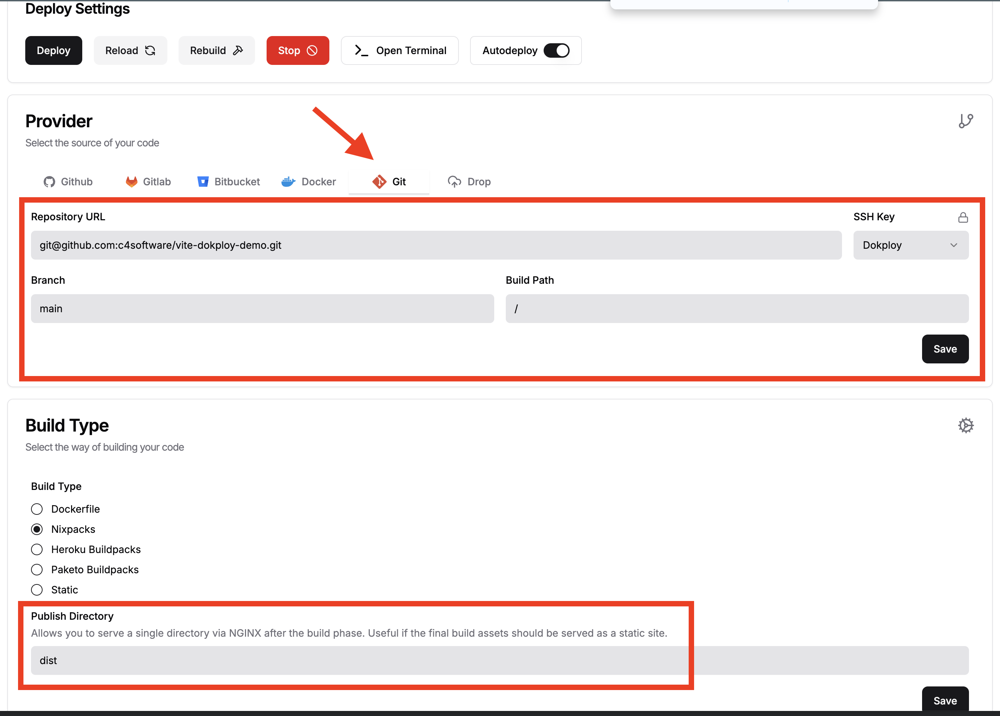

Cliquez sur « Deploy ». Si tout va bien, vous devriez voir dans les logs de déploiement :

Docker Deployed: ✅

À partir de là, vous pouvez configurer un domaine, et accéder à votre site.

## Déployer un site Laravel

Pour ce second exemple, nous allons déployer un site Laravel. 

Deux solutions s'offrent à nous : 

- Créer un `Dockerfile` pour notre application. Je vous laisse suivre le TP [Déployer un site Laravel avec Docker](/tp/ops/deployer-laravel-docker.md) qui vous explique les différentes étapes (c'est très simple).
- Laisser Nixpacks s'occuper de la construction de notre application. (ça fonctionne très bien et normalement sans problème).

Je vous laisse commiter votre projet sur Github, Gitlab ou autre, et vous pourrez ensuite le déployer via Dokploy.

Ici la démarche sera similaire à celle de ViteJS, vous allez choisir la méthode de déploiement « Git Repository » et entrer l'URL de votre repository. Si vous avez choisi la version Dockerfile, alors la seule différence sera que vous allez devoir spécifier à Dokploy que nous allons déployer en mode Dockerfile :

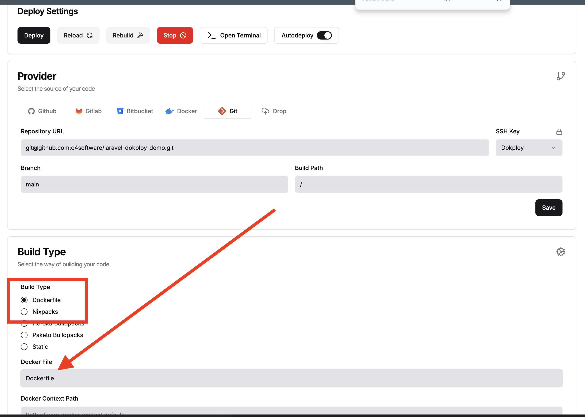

Une fois le Git configuré, vous devez renseigner le contenu de votre `.env` dans l'onglet « Environment » de Dokploy. Ce sont ces variables qui seront utilisées par votre application Laravel. Ici donc pas besoin de les mettre dans le fichier `.env` de votre projet (comme nous l'avons vu en cours, ce fichier contient des informations sensibles **et ne doit pas être versionné**).

Cliquez sur « Deploy », patientez puis votre site Laravel sera déployé. Il ne vous restera plus qu'à configurer un domaine pour accéder à votre site.

## Une base de données + PHPMyAdmin

Il est également possible de déployer une base de données via Dokploy. L'interface est très simple, vous pouvez choisir entre plusieurs types de bases de données (MySQL, PostgreSQL, etc.).

### Ajouter une base de données

Vous avez besoin d'une base de données ? Pas de problème, vous avez dans le menu « + Create service » la possibilité de créer un service de type « Database ». Vous pouvez choisir entre plusieurs types de base de données :

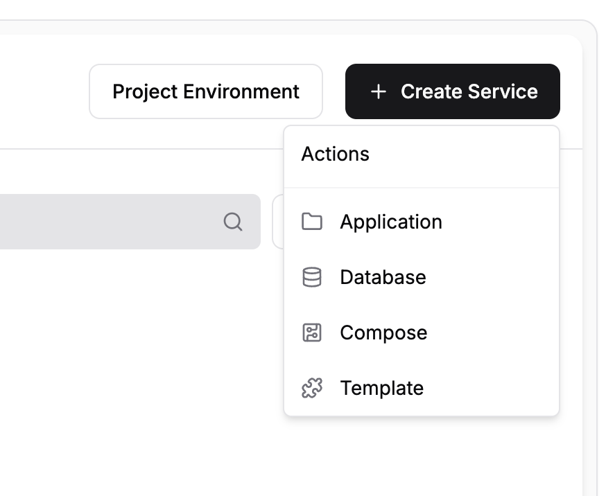

Remplissez les informations nécessaires (nom, utilisateur, mot de passe, etc.) et cliquez sur « Deploy ». Vous pouvez ensuite lier ce service à votre application.

Votre base de données sera déployée de manière « interne », c'est-à-dire que seuls les services de votre projet pourront y accéder. Le lien d'accès à configurer dans votre projet est disponible dans le détail de la configuration :

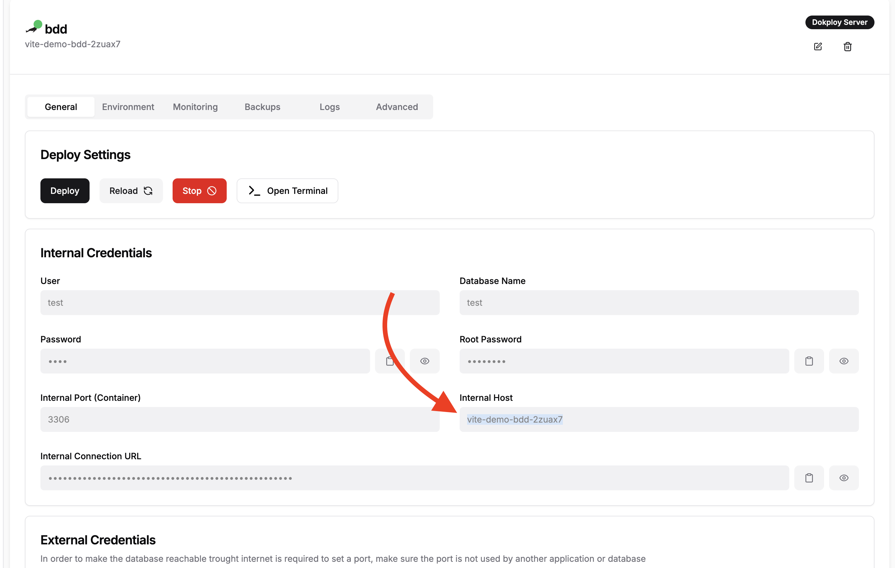

Ce nom sera le nom de l'hôte de votre base de données (à définir par exemple dans le fichier `.env` de votre application Laravel).

::: tip Vous souhaitez la rendre accessible depuis l'extérieur ?

Si vous souhaitez vous connecter depuis le réseau local (ou depuis un autre serveur), vous pouvez également activer un « port » pour rendre votre base de données accessible depuis l'exterieur. 

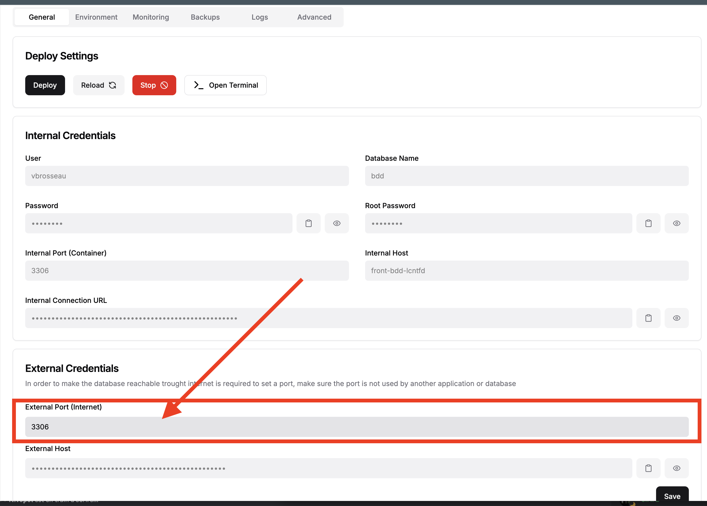

:::

### Ajouter PHPMyAdmin

PhpMyAdmin n'est pas le seul outil pour gérer une base de données. Même si je vous encourage à utiliser plutôt un client SQL (comme DBeaver), il est possible de déployer PhpMyAdmin via Dokploy. Voici un exemple vidéo de configuration :

<iframe width="560" height="315" src="https://www.youtube-nocookie.com/embed/JL1dYJX1y4g?si=3gpD2XYXHCs0a8J3" title="YouTube video player" frameborder="0" allow="accelerometer; autoplay; clipboard-write; encrypted-media; gyroscope; picture-in-picture; web-share" referrerpolicy="strict-origin-when-cross-origin" allowfullscreen></iframe>

Pour changer j'ai utilisé le mode `Docker Compose` pour le déployer. Voici la configuration :

```yaml
services:
  phpmyadmin:
    image: phpmyadmin/phpmyadmin:5.2.1
    environment:
      PMA_HOST: À-REMPLACER-PAR-LE-HOST-DE-VOTRE-BDD-INDIQUÉ-DANS-LA-CONFIGURATION-DE-VOTRE-BDD (voir vidéo)
      PMA_ARBITRARY: 0
```

::: tip Une alternative ? 

Vous pouvez également déployer PHPMyAdmin en mode `Application` en utilisant l'image `phpmyadmin/phpmyadmin:5.2.1` et en configurant les variables d'environnement `PMA_HOST` et `PMA_ARBITRARY` dans l'onglet « Environment ».

## Configurer l'auto-deploiement

L'auto-deploiement est une fonctionnalité très intéressante de Dokploy. Elle permet de déployer automatiquement votre application à chaque push sur votre repository. Pour cela, rendez-vous dans les paramètres de votre projet, puis dans l'onglet « Deployment ».

[Puis suivez les étapes décrite ici](https://docs.dokploy.com/docs/core/auto-deploy)

L'auto-déploiement repose sur un webhook, c'est-à-dire une URL que vous allez devoir ajouter dans les paramètres de votre repository. À chaque push, votre repository enverra une requête à cette URL, et Dokploy déclenchera un déploiement.

Cela sous entend que votre serveur doit être accessible depuis votre serveur Gitlab / Github. Si vous utilisez le Gitlab de la section aucun problème.

## Tester c'est bien !

Je vous laisse tester le déploiement en mode zip.

## Conclusion

Dans ce TP nous avons exploré comment déployer différents types de site via une solution de PaaS (Plateform As A Service) open-source, Dokploy. Nous avons vu comment déployer une image Docker, un site statique, un site ViteJS et un site Laravel.

L'idée ici n'est pas de vous montrer toutes les possibilités de Dokploy, mais plutôt de vous montrer que c'est très simple de déployer une application via une solution open-source.

Happy deployment !