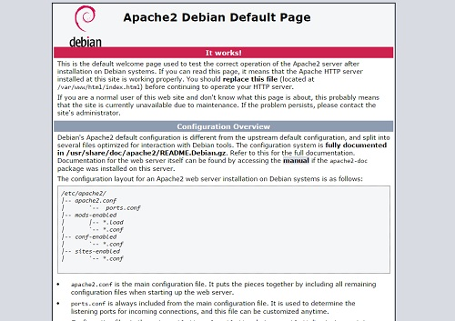
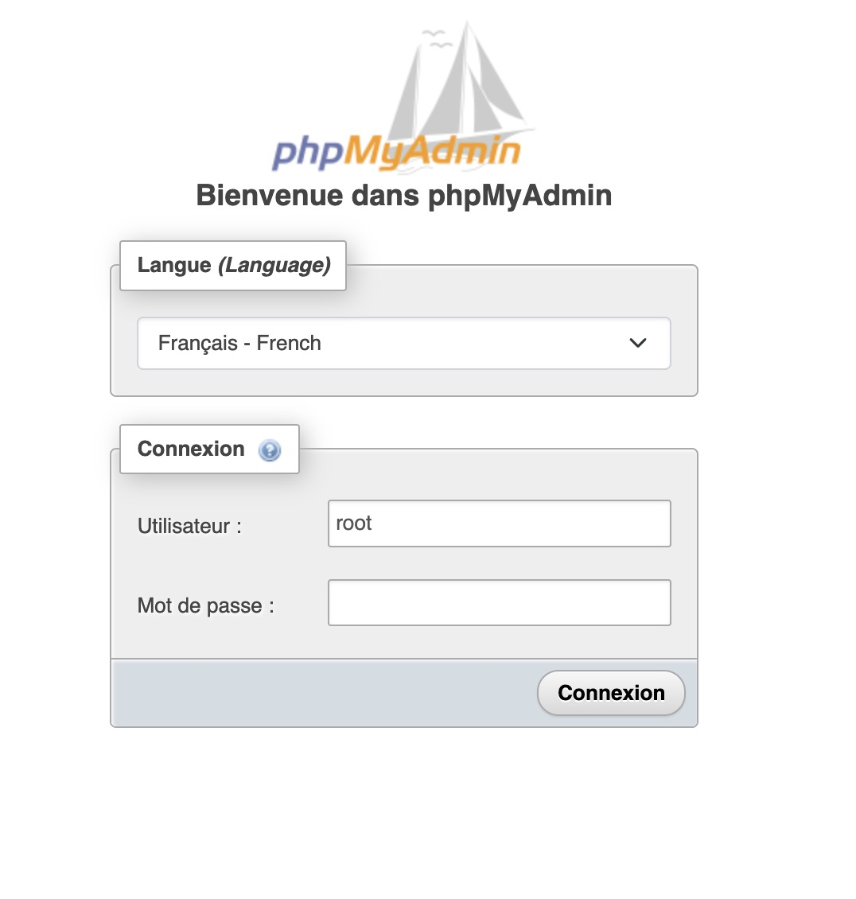

# Créer un serveur d'application avec Debian

Dans ce TP, nous allons créer un serveur avec Debian. Nous allons installer un serveur web / LAMP.

::: details Sommaire
[[toc]]
:::

::: danger Attention

Document de référence, il est découpé en plusieurs parties pour faciliter la lecture :

- [Voir page avec découpage](/pages/categories/les-serveurs.md)

:::

## Introduction

Les serveurs web et les serveurs de base de données sont des serveurs qui sont souvent utilisés ensemble. En effet, un site web dynamique nécessite souvent une base de données pour stocker les données.

Nous allons voir dans ce TP comment installer un serveur web et un serveur de base de données, sans oublier de sécuriser le serveur. Nous utiliserons **Apache** pour le serveur web et **MariaDB** pour le serveur de base de données.

## Prérequis

Avant de commencer ce TP, vous devez connaître :

- Les bases de Linux.
- Les bases de la ligne de commande.
- Les bases de la communication réseau (adresse IP, masque de sous-réseau, passerelle, etc.)

<iframe src="https://giphy.com/embed/3knKct3fGqxhK" width="480" height="281" frameBorder="0" class="giphy-embed" allowFullScreen></iframe>

### Qu'est-ce qu'un serveur ?

Un serveur est un ordinateur qui fournit des services à d'autres ordinateurs. Il peut s'agir d'un serveur web, d'un serveur de base de données, d'un serveur de fichiers, etc.

Concrètement, un serveur est un ordinateur qui est connecté à un réseau et qui est accessible depuis un autre ordinateur. Il est souvent installé dans un datacenter, c'est-à-dire dans un bâtiment spécialisé qui contient des serveurs. Les serveurs sont souvent installés dans des salles spéciales qui sont climatisées et qui sont surveillées 24h/24 et 7j/7.

Mais sans aller jusque-là, vous pouvez aussi installer un serveur chez vous. Vous pouvez installer un serveur chez vous pour faire des tests, pour héberger un site web, etc. Vous pouvez par exemple utiliser un Raspberry Pi comme serveur, et y installer les services que vous souhaitez (Web, Base de données, Domotique, Fichier).

::: tip Pourquoi installer un serveur chez soi ?

Il est possible d'installer un serveur chez soi pour faire des tests, pour héberger un site web, etc. C'est une bonne idée de faire des tests sur un serveur chez soi avant de mettre en production sur un serveur distant.

Créer un serveur à domicile permet réellement de progresser, car vous devrez gérer l'ensemble du serveur. Vous devrez gérer l'installation, la configuration, la sécurité, etc. C'est une bonne expérience pour apprendre à gérer un serveur.

Voilà à quoi peut ressembler un serveur à domicile (chez moi en l'occurrence) :


:::

### Qu'est-ce qu'un serveur web ?

Un serveur web est un serveur qui permet de servir des pages web. Il permet de servir des pages web statiques (fichiers HTML, CSS, JavaScript, images, etc.) mais aussi des pages web dynamiques (fichiers PHP, Python, Ruby, etc.).

Dans notre cas nous utiliserons Apache pour le serveur web. Apache est un serveur web open-source qui est très utilisé. Il est très puissant et il est très facile à configurer. Il est possible de configurer Apache pour servir des pages web statiques, mais aussi des pages web dynamiques.

Il existe différents serveurs web, Apache est l'un des plus utilisés. Il existe également Nginx, Caddy, etc. Mais Apache est le plus utilisé, donc c'est le serveur web que nous utiliserons.

- Nginx est également un serveur web très puissant, mais il est un peu plus difficile à configurer.
- Caddy est un serveur web qui est très simple à configurer, mais il est moins puissant qu’Apache.

### Qu'est-ce qu'un serveur de base de données ?

Un serveur de base de données est un serveur qui permet de stocker des données. Il permet de stocker des données dans des tables, de faire des requêtes SQL, etc.

Dans notre cas nous utiliserons MariaDB pour le serveur de base de données. MariaDB est un serveur de base de données open-source qui est très utilisé. Il est très puissant et il est très facile à configurer. Il est possible de configurer MariaDB pour stocker des données dans des tables, de faire des requêtes SQL, etc. Quel que soit le langage de programmation que vous utilisez, il est possible de se connecter à MariaDB pour stocker et récupérer des données. Par exemple, si vous utilisez PHP, vous pouvez utiliser la librairie PDO pour vous connecter à MariaDB.

::: tip Pourquoi MariaDB et pas MySQL ?

C'est une bonne question… MariaDB est un fork de MySQL, c'est-à-dire que c'est une copie de MySQL. MariaDB a été créé parce qu'Oracle a racheté MySQL. Oracle a ensuite décidé de rendre MySQL payant. MariaDB est donc une copie de MySQL qui est gratuite. MariaDB est donc une alternative à MySQL. 

Ce sont donc deux logiciels équivalents, MariaDB est gratuit et MySQL est pour l'instant également gratuit. Mais le logiciel MySQL pourrait devenir payant à l'avenir d'où l'intérêt de se tourner vers MariaDB.

:::

## Physique ou virtuel ?

Il est possible d'installer un serveur sur un ordinateur physique, mais il est également possible d'installer un serveur sur une machine virtuelle. Une machine virtuelle est un logiciel qui permet de simuler un ordinateur. Il est possible de créer plusieurs machines virtuelles sur un seul ordinateur. Chaque machine virtuelle est indépendante de l'autre, c'est-à-dire que chaque machine virtuelle est comme un ordinateur physique.

Le TP que nous allons faire est sur une machine virtuelle. Mais vous pouvez également installer un serveur sur un ordinateur physique.

## La sécurité

Héberger du contenu nécessite de réfléchir à la sécurité. En effet, il est important de sécuriser son serveur pour éviter que des personnes malveillantes ne puissent accéder à votre serveur et à vos données.

Différents éléments seront à prendre en compte pour sécuriser votre serveur :

- L'accès aux ports de votre serveur.
- Les services présents sur votre serveur.
- Les utilisateurs présents sur votre serveur.
- Les mots de passe d'accès.

::: danger Développeur != À l'arrache

À première vue, vous vous dites que vous n'avez pas besoin de sécuriser votre serveur, car vous êtes le seul à y avoir accès. Mais ce n'est pas une bonne idée. Vous ne savez pas qui peut avoir accès à votre serveur. Il est possible que quelqu'un d'autre ait accès à votre serveur, et que cette personne soit malveillante. Il est donc important de sécuriser votre serveur.

Vous vous dites également que les serveurs ne sont pas votre histoire. Que c'est l'affaire des personnes dans l'option SISR. Malheureusement pour vous dans la réalité des organisations vous serez amené à gérer des serveurs (au moins de développement).

:::

## Un serveur ou plusieurs serveurs ?

Avant d'aller plus loin… Réfléchissez à la question suivante : est-ce que vous allez installer un seul serveur ou plusieurs serveurs ?

L'idée est donc de comprendre pourquoi il est intéressant d'avoir plusieurs serveurs. En effet, il est possible d'avoir un seul serveur qui contient tout. Mais il est également possible d'avoir plusieurs serveurs qui contiennent chacun une partie du serveur. Par exemple, vous pouvez avoir un serveur qui contient le serveur web, un serveur qui contient le serveur de base de données, etc.

### Pourquoi avoir plusieurs serveurs ?

Il y a plusieurs raisons pour avoir plusieurs serveurs :

- Vous pouvez avoir plusieurs serveurs pour répartir la charge.
- Vous pouvez avoir plusieurs serveurs pour avoir une meilleure disponibilité.
- Vous pouvez avoir plusieurs serveurs pour avoir une meilleure sécurité.
- Vous pouvez avoir plusieurs serveurs pour avoir une meilleure maintenance.

## Installation dans un container Docker ou directement sur la machine ?

Il est possible d'installer un serveur dans un container Docker ou directement sur la machine. Dans notre cas nous allons installer un serveur directement sur la machine.

Plus tard nous découvrirons Docker et l'avantage de celui-ci (vous verrez c'est incroyable 🎉). Il est de toute façon primordial de comprendre comment on installe un serveur classique pour comprendre l'usage de Docker.

::: tip Docker c'est vaste
Plus tard dans l'année nous utiliserons Docker pour créer des environnements de type « Conteneurs »… Volontairement j'ai souhaité vous en parler ici. Donc soyez curieux. N'hésitez pas à vous documenter si vous le souhaitez.
:::

::: tip À noter

Comme vous pouvez le voir la procédure est relativement courte quand on la maitrise. Seulement quelques minutes suffisent pour créer un serveur Web (Apache + MySQL complet), nous allons voir plus tard qu'avec Docker il est possible de gagner encore plus de temps (sans perdre en qualité bien au contraire).

:::

## Installation de Debian

Pour créer votre machine, vous allez avoir besoin d'un système d'exploitation. Je vous propose d'utiliser la dernière version de Debian, avant d'aller plus loin posons-nous quelques questions :

- Pourquoi Debian ?
- Pourquoi dans sa dernière version ?

### Procédure d'installation de l'OS

Vous connaissez la procédure d'installation, mais quelques éléments sont importants à signaler :

- **Pas d'interface graphique**.
- Ajuster la configuration de l'adresse IP.
- N'oubliez pas d'installer les VMware Tools.

::: danger Les performances et la virtualisation

Sans les VMware Tools, ça semble fonctionner correctement ? Oui… À première vue seulement… En réalité votre machine ne tire pas toutes les performances de l'environnement. Pire, elle peut dégrader les performances de toute la ferme.

Bref, n'oubliez pas d'installer les Tools pour vivre une expérience optimale 👌.

:::

[Suivre la procédure d'installation de Debian](./tp1b.md)

::: tip 👋 Pas d'interface graphique ?
À votre avis, pourquoi ?
:::

### Accéder à votre serveur

Pour accéder à votre serveur, vous pouvez utiliser la Remote Console de VMWare… Mais c'est une solution pas optimale qui sera lente et qui ne vous permettra pas de faire de copier/coller. Je vous propose donc d'utiliser un client SSH.

Un client SSH est un logiciel qui permet de se connecter à un serveur via SSH. SSH est un protocole qui permet de se connecter à un serveur de manière sécurisée. De plus bien configuré avec des clés SSH, vous n'aurez pas besoin de rentrer de mot de passe (c'est magique… et en cybersécurité c'est une bonne chose).

Pour installer un client SSH, vous pouvez utiliser Putty (Windows) ou SSH (macOS).

Installer SSH sur votre serveur Debian :

```bash
sudo apt update
sudo apt install openssh-server
```

Je vous laisse valider l'installation du paquet. Une fois l'installation terminée, vous pouvez vous connecter à votre serveur avec SSH.

Avant d'aller plus loin, nous allons générer une clé SSH, elle vous servira de clé pour vous connecter à votre serveur. Mais également aux prochains serveurs que vous allez installer.

Avoir une clé SSH est intéressant, car une clé SSH est plus sécurisée qu'un mot de passe. De plus une clé SSH est un standard, donc vous pouvez l'utiliser pour vous connecter à n'importe quel type de serveur (Linux, mais également GIT, etc.).

::: tip C'est une clé ultra privée
La clé SSH est une clé privée, donc ne la partagez pas avec n'importe qui. Elle vous permet de vous connecter à votre serveur, mais également à d'autres serveurs. Si vous la partagez avec n'importe qui, vous risquez de vous faire pirater votre serveur.

**Avoir la clé == Pouvoir se connecter à votre serveur.**

:::

#### Générer une clef privée/publique

Cette opération n'est à réaliser qu'une seule fois (sur chaque machine/session). Au lycée, la clef va s'enregistrer dans votre dossier utilisateur, elle sera donc synchronisée automatiquement avec l'ensemble des ordinateurs sur lesquels vous allez pouvoir vous connecter.

#### Générer la clef

La commande pour générer une clef est la suivante.

::: tip Windows, Linux, macOS ?

La commande sera la même, quel que soit votre système d'exploitation. Cependant, le terminal lui sera différent :

- Windows : `Git Bash` (ou `Git cmd`). ([nécessite Git](https://git-scm.com/downloads))
- macOS : `terminal`.
- Linux : `console`.

:::

```bash
ssh-keygen
```


La commande va générer **deux fichiers** :

- **id_rsa**, est privé. **Vous ne devez jamais le partager**.
- **id_rsa.pub**, est public, vous pouvez le partager autant que vous voulez, ce fichier permettra de vous reconnaître au moment de la connexion.

::: danger Plus de sécurité

Vous pouvez faire « entrée (3×) » pour générer une clef sans mot de passe. Vous pouvez également faire le choix de mettre un mot de passe sur votre clef pour plus de sécurité en cas de perte de celle-ci.

:::

#### Installer la clef sur votre serveur

Pour cela, il vous suffit de faire la commande suivante sur votre ordinateur.

```bash
ssh-copy-id <username>@<ipaddress>
```

⚠️ Vous devez évidemment remplacer `<username>` et `<ipaddress>` par votre utilisateur et l'adresse IP de votre serveur. Exemple :

```bash
ssh-copy-id pi@192.168.1.253
```

::: tip Et voilà !
Rien de plus, à partir de maintenant votre serveur acceptera votre connexion sans vous demander de mot de passe. Pratique non ? (Et surtout très sécurisé)
:::

## Installation de Apache

### Présentation

Apache est un serveur web. Il permet de servir des pages web, mais également des applications web. Il est très utilisé sur le web, car il est gratuit, open source et très performant.

### Installation

Pour installer Apache sur votre serveur, vous pouvez utiliser la commande suivante :

```bash
sudo apt install apache2
```

### Démarrez le serveur

Maintenant que le serveur est installé, il faut le démarrer. Pour cela, vous pouvez utiliser la commande suivante :

```bash
sudo systemctl start apache2
```

### Vérifier que le serveur est démarré

Pour vérifier que le serveur est démarré, vous pouvez utiliser la commande suivante :

```bash
sudo systemctl status apache2
```

### Vérifier que le serveur est accessible

Pour vérifier que le serveur est accessible, il vous suffit d'ouvrir votre navigateur et d'aller sur l'adresse IP de votre serveur. Si vous avez bien suivi les étapes précédentes, vous devriez voir la page d'accueil d'Apache.



### Démarrer le serveur au démarrage du système

Pour que le serveur se lance automatiquement au démarrage du système, vous pouvez utiliser la commande suivante :

```bash
sudo systemctl enable apache2
```

### Où sont les fichiers du serveur

Les fichiers du serveur sont dans le dossier `/var/www/html`. Vous pouvez y accéder avec la commande suivante :

```bash
cd /var/www/html
```

C'est ici que nous voyons l'avantage de Linux. L'architecture est très simple, et les fichiers sont très facilement accessibles.

### Personnaliser la page d'accueil

Pour personnaliser la page d'accueil, vous pouvez modifier le fichier `index.html` dans le dossier `/var/www/html`. Vous pouvez utiliser la commande suivante pour y accéder :

```bash
nano /var/www/html/index.html
```

Vous pouvez également utiliser FileZilla pour modifier le fichier.

### Déployer votre site web

Je vous laisse créer une petite page web, et la déployer sur votre serveur. Votre site doit respecter les règles suivantes :

- Le fichier doit être nommé `index.html`.
- Posséder un titre (Bienvenue sur mon site).
- Posséder un paragraphe (Ceci est mon site web).
- Posséder une image (Une image de votre choix).
- Posséder un lien vers un autre site (Un lien vers le site de votre choix).

👋 C'est à vous de jouer.

Une fois votre code réalisé, je vous propose de le déployer sur votre serveur. Pour cela, vous pouvez utiliser FileZilla. Je vous propose de créer un dossier `monsite` dans le dossier `/var/www/html`.

👀 Le dossier est créé ? Vous pouvez déposer votre fichier `index.html` dans le dossier `monsite`. Vous pouvez ensuite ouvrir votre navigateur et aller sur l'adresse IP de votre serveur. Vous devriez voir votre site web.

## Installation de PHP

Avoir un serveur web sans PHP, c'est comme avoir un serveur web sans base de données. C'est un peu dommage. PHP est un langage de programmation qui permet de faire des applications web. Il est très utilisé sur le web, car il est gratuit, open source et très performant.

### Installation

La version de PHP fournie par défaut sur Debian est un peu ancienne. Pour avoir la dernière version, nous devons ajouter un dépôt. Pour cela, vous pouvez utiliser les commandes suivantes :

```bash
apt-get update
apt-get install wget lsb-release apt-transport-https gnupg2 ca-certificates -y
wget -O /etc/apt/trusted.gpg.d/php.gpg https://packages.sury.org/php/apt.gpg
sh -c 'echo "deb https://packages.sury.org/php/ $(lsb_release -sc) main" > /etc/apt/sources.list.d/php.list'
```

Ces commandes vont ajouter le dépôt permettant d'installer la dernière version de PHP. Ce dépôt est maintenu par Ondřej Surý, un développeur PHP.

Maintenant que le dépôt est ajouté, nous pouvons installer PHP. Pour cela, vous pouvez utiliser la commande suivante :

```bash
apt update
apt install php8.4 php8.4-fpm php8.4-cli php8.4-{bz2,curl,mbstring,intl} -y
```

### Vérifier que PHP est installé

Pour vérifier que PHP est installé, vous pouvez utiliser la commande suivante :

```bash
php -v
```

Cette commande va vous afficher la version de PHP installée sur votre serveur.

Un instant, quelle version de PHP est installée ?

### Vérifier que Apache + PHP fonctionne

Maintenant que notre PHP est installé, il faut l'activer :

```bash
a2enmod proxy_fcgi setenvif rewrite headers
a2enconf php8.4-fpm
systemctl restart apache2
```

Pour vérifier qu'Apache + PHP fonctionne, vous pouvez créer un fichier `info.php` dans le dossier `/var/www/html`. Vous pouvez utiliser la commande suivante pour y accéder :

```bash
nano /var/www/html/info.php
```

Dans ce fichier `info.php`, vous pouvez mettre le code suivant :

```php
<?php
phpinfo();
?>
```

Vous pouvez ensuite ouvrir votre navigateur et aller sur l'adresse IP de votre serveur. Si vous avez bien suivi les étapes précédentes, vous devriez voir la page d'information de PHP.

::: tip phpinfo() ?
La fonction `phpinfo()` permet d'afficher les informations de PHP. C'est très pratique pour vérifier que tout fonctionne correctement. Vous pouvez également utiliser cette fonction pour vérifier que les extensions PHP sont bien installées.

Comme par exemple `php-pdo` et `php-mysql` pour la base de données.
:::

### Écrire du code PHP pour tester

Pour tester que PHP fonctionne, vous pouvez créer un fichier `test.php` dans le dossier `/var/www/html`. Vous pouvez utiliser la commande suivante pour y accéder :

```bash
nano /var/www/html/test.php
```

Dans ce fichier `test.php`, vous pouvez mettre le code suivant :

```php
<?php
echo "Hello " . $_GET['name'];
?>
```

Vous pouvez ensuite ouvrir votre navigateur et aller sur l'adresse IP de votre serveur. Si vous avez bien suivi les étapes précédentes, vous devriez voir le message `Hello` suivi du nom que vous avez rentré dans l'URL.

👋 C'est à vous de jouer.

## Installation de MariaDB

Maintenant que nous avons un serveur web, nous allons installer une base de données. Nous allons installer MariaDB, une base de données open source, qui est compatible avec MySQL.

::: danger Attention
Un instant, dans ce TP nous allons installer MariaDB sur le même serveur qu'Apache. C'est une mauvaise pratique, car si Apache tombe, MariaDB tombe aussi. 

Dans la vraie vie, il est préférable d'avoir un serveur web et un serveur de base de données séparés. C'est plus sécurisé et plus performant.
:::

### Installation

Pour installer MariaDB, vous pouvez utiliser la commande suivante :

```bash
apt-get update
apt-get install mariadb-server mariadb-client -y
```

Pourquoi ces deux paquets ? `mariadb-server` est le serveur de base de données, et `mariadb-client` est le client de base de données. Le client est utilisé pour se connecter à la base de données.

::: tip Arrêtons-nous un instant

- Pourquoi faire un update avant d'installer un paquet ?
- À quoi correspond le `-y` à la fin de la commande ?
- Selon vous, est-ce que votre serveur de base de données est démarré ? Si oui, comment le vérifier ?

:::

### Configuration

Avant d'utiliser MariaDB, nous devons configurer le mot de passe de l'utilisateur `root`. Pour cela, vous pouvez utiliser la commande suivante :

```bash
mysql_secure_installation
```

Cette commande va vous demander de rentrer le mot de passe actuel de l'utilisateur `root`. Comme vous venez d'installer MariaDB, il n'y en a pas encore : appuyez simplement sur Entrée.

::: tip Arrêtons-nous un instant

- Qu'est-ce que `mysql_secure_installation` ?
- Pourquoi est-ce important de changer le mot de passe de l'utilisateur `root` ?
- Quel mot de passe avez-vous choisi ? Pourquoi ?

:::

### Vérifier que MariaDB est installé

Pour vérifier que MariaDB est installé, vous pouvez utiliser la commande suivante :

```bash
mysql -u root -p
```

Cette commande va vous demander le mot de passe de l'utilisateur `root`. Si vous avez bien suivi les étapes précédentes, vous devriez être connecté à MariaDB.

### PHP et MariaDB

Lors de l'installation de PHP, nous avons installé l'extension `php-mysql`. Cette extension permet d'utiliser MariaDB avec PHP, elle est donc indispensable pour faire fonctionner vos sites web si vous utilisez une base de données.

::: tip Arrêtons-nous un instant

- Qu'est-ce que `php-mysql` ?
- Pourquoi MySQL et pas MariaDB ?

:::

## Les virtualHost

```bash
nano /etc/apache2/sites-available/votre-virtual-host.conf
```

```apache
<VirtualHost *:9090>
    ServerAdmin webmaster@localhost
    DocumentRoot /var/www/html/votre-dossier

    <Directory /var/www/html/votre-dossier>
        Options Indexes FollowSymLinks
        AllowOverride All
        Require all granted
    </Directory>

    ErrorLog ${APACHE_LOG_DIR}/error.log
    CustomLog ${APACHE_LOG_DIR}/access.log combined
</VirtualHost>
```

Activer un virtual host :

```bash
a2ensite votre-virtual-host
```

Désactiver un virtual host :

```bash
a2dissite votre-virtual-host
```

## Installation de phpMyAdmin

Maintenant que nous avons un serveur web et une base de données, nous allons installer phpMyAdmin. phpMyAdmin est un outil qui permet de gérer facilement une base de données. Il permet de créer des bases de données, des tables, des utilisateurs, etc.

Vous l'avez déjà utilisé, mais vous ne l'avez jamais installé. C'est le moment de le faire.

### Installation

Pour installer phpMyAdmin, vous pouvez utiliser la commande suivante :

```bash
apt install unzip
cd /var/www/html
wget https://files.phpmyadmin.net/phpMyAdmin/5.2.0/phpMyAdmin-5.2.0-all-languages.zip
unzip phpMyAdmin-5.2.0-all-languages.zip
mv phpMyAdmin-5.2.0-all-languages phpmyadmin
rm phpMyAdmin-5.2.0-all-languages.zip
```

L'installation est le résultat de plusieurs commandes :

- `apt install unzip` : on installe l'utilitaire `unzip`. C'est un utilitaire qui permet de décompresser des fichiers `.zip`.
- `cd /var/www/html` : on se déplace dans le dossier `/var/www/html`.
- `wget …` : on télécharge le fichier `phpMyAdmin-5.2.0-all-languages.zip`. Depuis les serveurs de phpMyAdmin.
- `unzip …` : on décompresse le fichier `phpMyAdmin-5.2.0-all-languages.zip`.
- `mv …` : on renomme le dossier `phpMyAdmin-5.2.0-all-languages` en `phpmyadmin`. Car il est plus simple de taper `phpmyadmin` que `phpMyAdmin-5.2.0-all-languages`.
- `rm …` : on supprime le fichier `phpMyAdmin-5.2.0-all-languages.zip`. Car il n'est plus utile.

::: tip Arrêtons-nous un instant

- Pourquoi utilisons-nous la version du site web de phpMyAdmin ? Et pas la version du dépôt Debian ?
- À votre avis est-ce suffisant pour que phpMyAdmin fonctionne ?

:::

### Créer un virtual host dédié à phpMyAdmin

Nous pourrions utiliser PhpMyAdmin en allant sur l'adresse `http://ip_du_serveur/phpmyadmin`. Mais ce n'est pas une bonne pratique. Nous allons donc créer un virtual host dédié à phpMyAdmin.

Un virtual host permet de séparer les sites web. Par exemple, si vous avez un site web `exemple.com`, vous pouvez avoir un virtual host pour `exemple.com` et un autre pour `phpmyadmin.exemple.com`. Cela permet de séparer les sites web, et de ne pas avoir de conflit entre les deux.

Évidemment au lycée nous n'avons pas de nom de domaine, par contre, votre serveur possède une adresse IP et 65535 ports. Nous allons donc utiliser un port différent pour phpMyAdmin. Nous allons utiliser le port `9090`.

Pour créer un virtual host, vous pouvez utiliser la commande suivante :

```bash
nano /etc/apache2/sites-available/phpmyadmin.conf
```

Cette commande va créer un fichier `phpmyadmin.conf` dans le dossier `/etc/apache2/sites-available`. Ce fichier va contenir la configuration de notre virtual host.

Ce fichier va contenir la configuration de notre virtual host. Vous pouvez copier-coller le code suivant :

```apache
<VirtualHost *:9090>
    ServerAdmin webmaster@localhost
    DocumentRoot /var/www/html/phpmyadmin

    <Directory /var/www/html/phpmyadmin>
        Options Indexes FollowSymLinks
        AllowOverride All
        Require all granted
    </Directory>

    ErrorLog ${APACHE_LOG_DIR}/error.log
    CustomLog ${APACHE_LOG_DIR}/access.log combined
</VirtualHost>
```

Cette configuration va permettre d'utiliser le port `9090` pour accéder à phpMyAdmin. Vous pouvez maintenant enregistrer le fichier.

Pour activer le virtual host, vous pouvez utiliser la commande suivante :

```bash
a2ensite phpmyadmin
```

Cette commande va activer le virtual host `phpmyadmin.conf`. Vous pouvez maintenant redémarrer Apache pour que les modifications soient prises en compte :

```bash
systemctl restart apache2
```

::: tip Arrêtons-nous un instant

- Qu'est-ce qu'un virtual host ?
- Pourquoi utilisons-nous le port `9090` ?
- Où avons-nous défini le port `9090` ?
- À quoi sert la commande `a2ensite` ?
- Pourquoi avons-nous besoin de redémarrer Apache ?

:::

### Accéder à phpMyAdmin

Si vous avez bien suivi les étapes précédentes, vous pouvez maintenant accéder à phpMyAdmin. Vous pouvez utiliser l'adresse suivante : `http://ip_du_serveur:9090`.



Je vous laisse vous connecter à phpMyAdmin, pour l'instant vous n'avez pas créé d'utilisateur. Vous pouvez donc utiliser l'utilisateur `root` pour vous connecter. Vous pouvez utiliser le mot de passe que vous avez défini lors de l'installation de MariaDB.

## Conclusion

Vous avez maintenant un serveur web et une base de données. Vous pouvez maintenant créer des sites web dynamiques. Vous pouvez utiliser PHP pour créer des sites web dynamiques. Vous pouvez utiliser MySQL ou MariaDB pour stocker des données.

<iframe src="https://giphy.com/embed/3o7btNa0RUYa5E7iiQ" width="480" height="480" frameBorder="0" class="giphy-embed" allowFullScreen></iframe>

Même si l'ensemble des étapes ne sont pas réellement longues, il est important de bien comprendre ce que vous faites. Notamment pour la configuration de MariaDB et de phpMyAdmin. Si vous avez des questions, n'hésitez pas à me les poser.

Le développeur cherche à automatiser le plus possible son installation, c'est pour ça que par la suite nous verrons comment automatiser entièrement l'installation de MariaDB, PHP et Apache grâce à Docker et Docker Compose.

Cependant il est important de comprendre les commandes de base ainsi que la notion de virtual host / port, car elles seront utilisées dans le cadre de Docker.

::: danger Attention

Même si vous suivez l'option SLAM, il ne faut pas perdre de vue qu'en première année de BTS SIO vous allez devoir faire un projet de fin d'année. Ce projet va vous permettre de mettre en pratique ce que vous avez appris en première année. Vous allez donc devoir créer un site web dynamique. Vous allez donc devoir utiliser PHP, MySQL ou MariaDB, et Apache.

Lors de l'examen final, vous serez également amené à créer un site web dynamique. Vous allez donc devoir utiliser PHP, MySQL ou MariaDB, et Apache. Vous allez donc devoir utiliser les commandes que vous avez vues dans ce chapitre.

:::

## Synthèse

Vous avez à votre disposition une synthèse de ce TP disponible ici : [Aide mémoire](/cheatsheets/serveur/debian-web.md)

## Liens

- [Apache](https://httpd.apache.org/)
- [MariaDB](https://mariadb.org/)
- [PhpMyAdmin](https://www.phpmyadmin.net/)
- [PHP](https://www.php.net/)
- [MySQL](https://www.mysql.com/)

::: details Bonus, accéder à votre base de données depuis votre ordinateur

Par défaut, le port 3306 est fermé sur Debian. Il faut donc l'ouvrir pour que les applications puissent se connecter à la base de données. La configuration se fait dans le fichier `/etc/mysql/mariadb.conf.d/50-server.cnf`.

```bash
nano /etc/mysql/mariadb.conf.d/50-server.cnf
```

Ajoutez la ligne suivante dans la section `[mysqld]`.

```ini
bind-address = 0.0.0.0
```

Redémarrer le serveur MySQL

```bash
systemctl restart mysql
```

**Pourquoi ?**

Par défaut, le serveur MySQL n'écoutera que les connexions locales. Il faut donc autoriser les connexions distantes en modifiant la valeur de `bind-address`. **Si vous n'en avez pas besoin, vous pouvez laisser la valeur par défaut.**

Changer ce paramètre sera utile quand vous souhaiterez accéder à la base de données depuis un autre ordinateur (exemple développement en C#).

:::