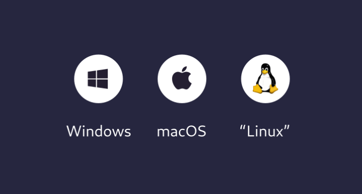
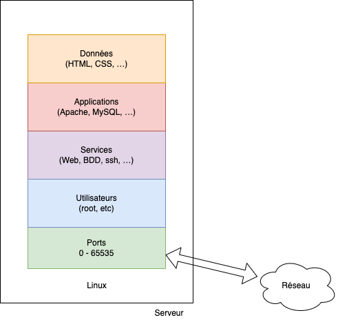
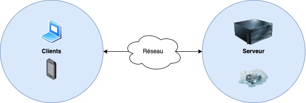
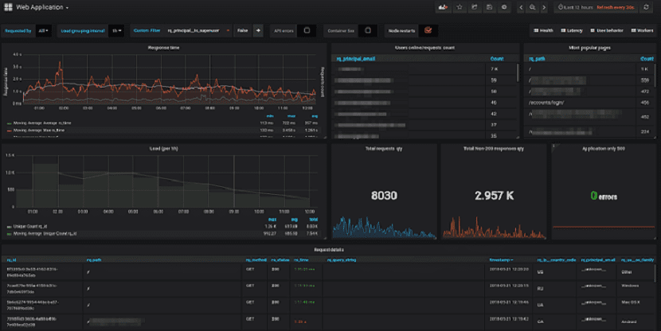

# Complément du cours Serveur

Dans ce document, nous allons voir ce que sont les serveurs, les serveurs Web, les serveurs de base de données, etc. Mais surtout, nous allons voir de quoi est constitué un serveur, et comment le gérer.

::: details Sommaire
[[toc]]
:::

::: details TL;DR

Voici un résumé de ce qu'il est possible de retenir de ce document (évidemment, je vous conseille vivement de lire l'ensemble de celui-ci, mais voilà les grandes idées).

L'approche DevOps à pour objectif principal d'automatiser pour assurer la qualité via par entre autres le test et la répétabilité.

Les développeurs sont également des utilisateurs d'un OS et pour le comprendre nous réfléchirons aux différentes distributions Linux disponibles en les comparant à Windows et MacOS.

Beaucoup de types de serveurs existent (serveurs Web, de base de données, de fichiers, etc). en SLAM la notion de la stack logicielle est importante et surtout celle nommée LAMP (Linux, Apache, MySQL, PHP). Un serveur ne fonctionne pas sans que le réseau (adresses IP, DNS, DHCP, les ports permettant de communiquer). Sans entrer dans une complexité extrême, il sera important d'en connaître les bases.

Nous étudierons également comment la ligne de commandes fonctionne, ainsi que l'architecture d'un serveur Linux (système de fichier, utilisateurs, droits). Un serveur Linux ne possédant pas d'interface graphique, nous utiliserons les protocoles de communication suivants pour l'administrer :

- SSH
- FTP
- SFTP

⚠️ L'ensemble protégé pas seulement par des mots de passe, mais également par des clés SSH.

Nous regarderons comment il est possible de mettre en place une analyse pertinente **des logs d'erreurs**. Ainsi qu'une politique de sauvegarde pour s'assurer que notre machine soit toujours fonctionnelle, quels que soient les problèmes qu'elle pourra rencontrer.

Et finalement nous regarderons comment doit être prise la décision entre un serveur physique ou virtuel. Ainsi que les différents types d'hébergement disponible (mutualisés, dédiés, SaaS) et comment choisir le meilleur pour les besoins.

:::

## Le DevOps

Aujourd'hui, on parle de DevOps, mais c'est quoi ?

- DevOps est une culture, une philosophie, une approche
- DevOps est un ensemble de pratiques, de méthodes, d'outils
- DevOps est une approche centrée sur l'automatisation et l'agilité

Le DevOps répond à un besoin : celui de faire évoluer les méthodes de développement et de déploiement des applications. L'objectif étant que le développeur puisse déployer son application le plus simplement et rapidement possible. Les développeurs ont utilisé les outils qu'ils avaient à disposition pour automatiser le déploiement de leurs applications. Ils ont donc utilisé les outils de gestion de version (Git, SVN, etc.), les outils de déploiement (intégration continue) mais également les outils de conteneurisation (Docker) pour réaliser leurs tâches.

Le terme de DevOps est un peu fourre-tout, car il regroupe plusieurs métiers. En effet, le DevOps est un métier qui regroupe plusieurs métiers :

- Développeur.
- Administrateur système.
- Administrateur réseau.
- Administrateur de base de données.

Le DevOps est donc un métier qui regroupe plusieurs métiers. Il est donc difficile de définir précisément ce qu'est un DevOps. Mais en général, on peut dire que le DevOps est un développeur qui a des connaissances en administration, système, réseau et base de données. L'objectif du devops étant :

- Développer (et maintenir) des applications.
- Choisir la configuration de votre serveur _(choix de l'OS, de la distribution, etc.)_.
- Déployer votre application sur le serveur _(installation, configuration, etc.)_.
- Automatiser le déploiement de votre application _(intégration continue)_.
- Diagnostiquer les problèmes _(analyse des logs, superviser.)_
- **Sécuriser** votre serveur _(firewall, etc.)_

Mais surtout le DevOps **s'assure de la qualité** de son application. Il s'assure que l'application est **disponible**, **performante** et **sécurisée**.


::: tip Définition
    Le DevOps **s'assure de la qualité** de son application, de la  **disponibilité**, **performances** et **sécurité**.
:::

## L'environnement des développeurs

Choisir son environnement de développement est très important. En effet, le choix de l'environnement de développement va déterminer votre productivité. Il est donc important de choisir un environnement de développement adapté à vos besoins.

Pour coder, un développeur à généralement besoin de :

- Un éditeur de texte.
- Un terminal.

Nous retrouvons ces deux éléments dans la plupart des environnements de développement. Mais certains environnements de développement vont plus loin et vont proposer des outils supplémentaires.



### Windows

- [Visual Studio Code](https://code.visualstudio.com/)
- [Git Bash](https://gitforwindows.org/)
- [Windows Terminal](https://apps.microsoft.com/store/detail/windows-terminal/9N0DX20HK701?hl=fr-fr&gl=fr)
- [Windows Subsystem for Linux WSL](https://learn.microsoft.com/fr-fr/windows/wsl/install)

### Linux

- [Visual Studio Code](https://code.visualstudio.com/)
- Git : `sudo apt install git`
- Terminal : Intégré

### macOS

- [Visual Studio Code](https://code.visualstudio.com/)
- Git : `brew install git` (ou `xcode-select --install`)
- Terminal : Intégré

### Votre OS… Votre choix

Vous pouvez utiliser l'OS que vous souhaitez. Je ne vais pas tenter de vous convertir à un OS en particulier. Mais je vous conseille d'utiliser un environnement de développement qui vous convient. Si vous êtes à l'aise avec Windows, alors utilisez Windows. Si vous êtes à l'aise avec Linux, alors utilisez Linux. Si vous êtes à l'aise avec macOS, alors utilisez macOS.

Mais sachez qu'utiliser Linux (par exemple) est une vraie réalité en entreprise (tout comme macOS).


_Source: [fossbytes.com](https://fossbytes.com/windows-still-the-leading-os-for-software-development-followed-by-linux/)_

::: tip Définition
Choisir son OS pour un développeur est une question de **préférence** et de **confort** mais aussi en fonction du langage de programmation **ciblé**.
:::

## Qu'est-ce qu'un serveur ?

Un serveur est un ordinateur qui fournit des services à d'autres ordinateurs. Il peut s'agir d'un serveur Web, d'un serveur de base de données, d'un serveur de fichiers, etc.

Concrètement, un serveur est un ordinateur qui est connecté à un réseau et qui est accessible depuis un autre ordinateur. Il est souvent installé dans un datacenter, c'est-à-dire dans un bâtiment spécialisé qui contient des serveurs. Les serveurs sont souvent installés dans des salles spéciales qui sont climatisées et qui sont surveillées 24h/24 et 7j/7.

Mais sans aller jusque-là, vous pouvez aussi installer un serveur chez vous. Vous pouvez installer un serveur chez vous pour faire des tests, pour héberger un site Web, etc. Vous pouvez par exemple utiliser un Raspberry Pi comme serveur, et y installer les services que vous souhaitez (Web, Base de données, Domotique, Fichier).

::: tip Pourquoi installer un serveur chez soi ?

Il est possible d'installer un serveur chez soi pour faire des tests, pour héberger un site Web, etc. C'est une bonne idée de faire des tests ou pour tester des idées avant de mettre en production sur un serveur distant.

Créer un serveur à domicile permet réellement de progresser, car vous devrez gérer l'ensemble du serveur. Vous devrez gérer l'installation, la configuration, la sécurité, etc. C'est une bonne expérience pour apprendre l'administration système.

Voilà à quoi peut ressembler un serveur à domicile (chez moi en l'occurrence) :


:::

Nous pourrions résumer la définition d'un serveur en disant que c'est un ordinateur qui est connecté à un réseau et qui est accessible depuis un autre ordinateur.

### Comment représenter un serveur

Avant d'aller plus dans le détail, nous pouvons représenter un serveur de la manière suivante :



Cette représentation est très simple, mais elle permet de comprendre les différentes couches d'un serveur. Nous allons voir plus en détail chacune de ces couches.

- **Le système d'exploitation** est la couche la plus basse. C'est la couche qui permet de faire fonctionner le serveur. Dans notre cas Linux.
- **Les Ports** : Ce sont des numéros qui permettent d'identifier un service. Les ports vont permettre de rendre accessible le service depuis l'extérieur.
- **Les utilisateurs** : Une machine == au moins un utilisateur le **root**. Pour respecter les bonnes pratiques, il est préférable de créer un utilisateur dédié à chaque service.
- **Les services** : Ce sont définition des applications qui vont tourner en arrière-plan. Par exemple, un serveur Web, un serveur de base de données, etc.
- **Les applications** : Ce sont les binaires qui vont être exécutés. Par exemple, Apache, MySQL, etc.
- **Les Logs** : Ce sont des fichiers (habituellement dans le dossier `/var/log`) qui vont contenir les messages générés par les applications (erreurs, informations, etc.).
- **Les données** : Ce sont des fichiers exemple le code source de vos applications, ou encore les données de la base de données.

## Qu'est-ce qu'un serveur Web ?

Un serveur Web est un serveur qui permet de servir des pages Web. Il permet de servir des pages Web statiques (fichiers HTML, CSS, JavaScript, images, etc.), mais aussi des pages Web dynamiques (fichiers PHP, Python, Ruby, etc.).

Dans notre cas nous utiliserons Apache pour le serveur Web. Apache est un serveur Web open source qui est très utilisé. Il est très puissant et il est très facile à configurer. Il est possible de configurer Apache pour servir des pages Web statiques, mais aussi des pages Web dynamiques.

Il existe différents serveurs Web, Apache est l'un des plus utilisés. Il existe également Nginx, Caddy, etc. Mais Apache est le plus utilisé, donc c'est le serveur Web que nous utiliserons.

- Nginx est également un serveur Web très puissant, mais il est un peu plus difficile à configurer.
- Caddy est un serveur Web qui est très simple à configurer, mais il est moins puissant qu’apache.



Notre serveur Web sera accessible par différents moyens :

- Il sera accessible via son adresse IP.
- Si vous en avez un, il sera accessible via son nom de domaine.

::: tip Pourquoi un nom de domaine ?

Un nom de domaine est un nom qui permet de se connecter à un serveur. Par exemple, si vous avez un nom de domaine, vous pouvez vous connecter à votre serveur via son nom de domaine. Par exemple, si vous avez un nom de domaine `monsite.com`, vous pouvez vous connecter à votre serveur via `monsite.com`.

Techniquement, un nom de domaine est un nom qui est associé à une adresse IP. 

Si votre serveur possède un nom de domaine, nous allons pouvoir également créer ce que l'on appelle des Virtual Hosts. Un Virtual Host est une configuration spécifique qui permet de faire correspondre un sous-domaine avec une site Web sur la machine :

- `monsite.com` correspondra au site Web par défaut.
- `blog.monsite.com` correspondra au site Web du blog.
- `forum.monsite.com` correspondra au site Web du forum.
- etc.

:::

## Qu'est-ce qu'un serveur de base de données ?

Un serveur de base de données est un serveur qui permet de stocker des données. Il permet de stocker des données dans des tables, de faire des requêtes SQL, etc.

Dans notre cas nous utiliserons MariaDB pour le serveur de base de données. MariaDB est un serveur de base de données open source qui est très utilisé. Il est très puissant et il est très facile à configurer. Il est possible de configurer MariaDB pour stocker des données dans des tables, de faire des requêtes SQL, etc. Quel que soit le langage de programmation que vous utilisez, il est possible de se connecter à MariaDB pour stocker et récupérer des données. Par exemple, si vous utilisez PHP, vous pouvez utiliser la librairie PDO pour vous connecter à MariaDB.

::: tip Pourquoi MariaDB et pas MySQL ?

C'est une bonne question… MariaDB est un fork de MySQL, c'est-à-dire que c'est une copie de MySQL. MariaDB a été créé parce que Oracle a racheté MySQL. Oracle a ensuite décidé de rendre MySQL payant. MariaDB est donc une copie de MySQL qui est gratuite. MariaDB est donc une alternative à MySQL.

Ce sont donc deux logiciels équivalents, MariadDB est gratuit et MySQL est pour l'instant également gratuit. Mais le logiciel MySQL pourrait devenir payant à l'avenir d'où l'intérêt de se tourner vers MariaDB.

:::

## La configuration réseau

La configuration réseau est une étape importante de la configuration d'un serveur. Si vous ne configurez pas correctement cette étape, il ne sera pas possible de s'y connecter.

À votre domicile, vous ne vous souciez pas de ceci, car vous avez un DHCP qui s'occupe de tout pour vous. Mais sur un serveur, pour plus de sécurité, il n'y a que très rarement un DHCP. Il faut donc configurer manuellement l'adresse IP de votre serveur.

En fonction des systèmes d'exploitation que vous utilisez. Sous Linux sans interface graphique vous devrez configurer le fichier `/etc/network/interfaces`.

Dans ce fichier vous devrez configurer l'adresse IP, le masque de sous-réseau, la passerelle par défaut, etc.

- L'adresse IP est l'adresse qui permet de se connecter à votre serveur.
- Le masque de sous-réseau est l'adresse qui permet de déterminer les machines qui sont sur le même réseau que votre serveur.
- La passerelle par défaut est l'adresse qui permet de se connecter à votre routeur.
- Le DNS est l'adresse qui permettra à votre serveur de résoudre les noms de domaine (exemple qui est `google.com` ?).

Pour simplifier cette procédure, vous trouverez un générateur de configuration ici : [Générateur de configuration réseau Debian](/cheatsheets/serveur/debian-reseau.md)

::: tip DHCP ?

Vous ne vous souvenez plus de ce qu'est le DHCP ? Le DHCP est un service installé sur votre routeur (ou sur un serveur), il permet de configurer automatiquement les machines qui se connectent au réseau. Il permet de configurer l'adresse IP, le masque de sous-réseau, la passerelle par défaut, etc. En quelques mots, comment ça fonctionne ?

- Quand une machine se connecte au réseau, elle envoie une requête au DHCP pour obtenir une configuration réseau.
- Le DHCP lui répond avec une configuration réseau.
- La machine configure automatiquement son adresse IP, son masque de sous-réseau, sa passerelle par défaut, etc.

:::

## Les ports

Un port est un canal de communication entre deux ordinateurs. Il est possible d'ouvrir des ports sur votre serveur pour permettre à des ordinateurs distants de communiquer avec votre serveur.

Par exemple, si vous ouvrez le port 80 sur votre serveur, alors les ordinateurs distants pourront communiquer avec votre serveur en utilisant le port 80.

La liste des ports est standardisée, chaque serveur possède 65535 ports. Les ports vont de 0 à 65535 :

- Les ports vont de 0 à 1023 sont réservés pour les services système. 
- Les ports qui vont de 1024 à 65535 sont réservés pour les services utilisateurs.

Dans les ports réservés pour les services système, il y a les ports suivants :

- 22 : SSH
- 80 : HTTP
- 443 : HTTPS
- 3306 : MariaDB
- …

Dans les ports réservés pour les services utilisateurs, nous retrouvons souvent les ports suivants :

- 8080 : HTTP
- 8443 : HTTPS

::: tip Port standard ou port personnalisé ?

La liste des ports ci-dessus est la liste des ports standards, vous pouvez bien évidemment les changer. Exemple, pour éviter qu'un pirate ne trouve trop facilement le port SSH de votre machine, il est vivement conseillé de le changer.

:::

La notion de port est **très importante,** car il est possible d'ouvrir des ports sur votre serveur. Il est donc important de réfléchir à la question suivante : quels ports ouvrir sur votre serveur ?

::: danger Attention

Les ports sont le moyen de faire communiquer votre serveur avec les ordinateurs distants. Même si il est possible d'ouvrir des ports sur votre serveur, il est important de ne pas ouvrir tous les ports. En effet, si vous ouvrez tous les ports, alors n'importe quel ordinateur pourra communiquer avec votre serveur. Cela peut être dangereux, car un pirate pourrait alors se connecter à votre serveur et faire des choses malveillantes.

:::

### iptables

Sous Linux nous pouvons utiliser iptables pour gérer les ports, grâce à iptable qui est un quelques sortes un pare-feu nous allons pouvoir gérer les ports ouverts / accessibles sur notre serveur. Cette configuration n'est pas à négliger, car elle permet de sécuriser votre serveur.

Par exemple, si nous réalisons un serveur Web, nous allons ouvrir uniquement le port 80 et le port 443. Nous allons donc bloquer tous les autres ports. Cela permet de sécuriser notre serveur.

Voilà la configuration d'Iptables pour un serveur Web :

```bash
# On vide les règles
iptables -F

# On bloque tout
iptables -P INPUT DROP

# On autorise les connexions déjà établies
iptables -A INPUT -m state --state ESTABLISHED,RELATED -j ACCEPT

# On autorise les connexions SSH
iptables -A INPUT -p tcp --dport 22 -j ACCEPT

# On autorise les connexions HTTP
iptables -A INPUT -p tcp --dport 80 -j ACCEPT

# On autorise les connexions HTTPS
iptables -A INPUT -p tcp --dport 443 -j ACCEPT

# On sauvegarde les règles
iptables-save > /etc/iptables/rules.v4
```

::: tip Pourquoi autoriser les connexions déjà établies ?

Cela permet de ne pas bloquer les connexions déjà établies. Par exemple, si vous êtes en train de télécharger un fichier sur votre serveur, et que vous perdez votre connexion internet, alors votre navigateur va continuer à télécharger le fichier. Si vous bloquez les connexions déjà établies, alors votre navigateur ne pourra plus télécharger le fichier.

:::

## La ligne de commande

Nous avons vu comment se connecter à notre serveur. Maintenant, nous allons voir comment utiliser la ligne de commande pour administrer notre serveur. Ici, pas d'interface graphique, tout se passe en ligne de commande.

Pourquoi utiliser la ligne de commande ? Parce que c'est plus rapide, plus efficace et plus sécurisé. Vous pouvez automatiser des tâches avec des scripts. De plus celle-ci ne prend pas de ressources de votre serveur !

### Les commandes de base

Pour commencer, nous allons voir quelques commandes de base :

- `ls` : liste les fichiers et dossiers du répertoire courant.
- `cd` : change le répertoire courant.
- `pwd` : affiche le répertoire courant.
- `mkdir` : crée un répertoire.
- `touch` : crée un fichier.
- `rm` : supprime un fichier ou un répertoire.
- `cp` : copie un fichier ou un répertoire.
- `mv` : déplace un fichier ou un répertoire.
- `cat` : affiche le contenu d'un fichier.
- `nano` : édite un fichier (je vous conseille d'utiliser `vim` à la place).

::: tip La liste est non exhaustive

Bien évidemment, il existe beaucoup d'autres commandes. Mais celles-ci sont les plus utilisées. Vous pouvez les retrouver sur le site [Linux Command](https://linuxcommand.org/).

:::

### Les droits

Les droits sont très importants sur un serveur. Ils permettent de définir qui peut faire quoi sur un fichier ou un répertoire.

Les droits sont composés de trois parties :

- Les droits du propriétaire.
- Les droits du groupe.
- Les droits des autres.

Chaque partie est composée de trois caractères :

- `r` : lecture
- `w` : écriture
- `x` : exécution

Par exemple, si vous avez les droits suivants sur un fichier :

```bash
-rwxr-xr-x
```

Cela signifie que vous avez les droits suivants :

- Vous avez les droits de lecture, d'écriture et d'exécution.
- Le groupe a les droits de lecture et d'exécution.
- Les autres ont les droits de lecture et d'exécution.

Pour changer les droits d'un fichier, vous pouvez utiliser la commande `chmod` :

```bash
chmod <droits> <fichier>
```

Par exemple, pour donner les droits de lecture et d'exécution au groupe et aux autres, vous pouvez utiliser la commande suivante :

```bash
chmod g+rx,o+rx <fichier>
```

Pour changer le propriétaire d'un fichier, vous pouvez utiliser la commande `chown` :

```bash
chown <propriétaire>:<groupe> <fichier>
```

Par exemple si nous voulons autoriser l'utilisateur apache a lire et écrire dans le fichier `index.html`, nous pouvons utiliser la commande suivante :

```bash
chown apache:apache index.html
```

Le fichier `index.html` est maintenant accessible en lecture et en écriture par l'utilisateur apache.

### Quelques commandes utiles

- `sudo` : permet d'exécuter une commande en tant qu'administrateur.
- `su` : permet de se connecter en tant qu'un autre utilisateur.
- `top` : affiche les processus en cours d'exécution.
- `ps` : affiche les processus en cours d'exécution.
- `!!` : ré-exécute la dernière commande. Pratique par exemple pour y ajouter des arguments, ou pour l'exécuter en tant qu'administrateur (ex. `sudo !!`).

## La structure des dossiers

L'architecture des dossiers d'un linux est très simple. Elle est composée de différentes parties :

- `/` : le dossier racine.
- `/home` : les dossiers des utilisateurs.
- `/var` : les dossiers des services.
- `/etc` : les fichiers de configuration.

Dans le dossier `/home`, vous trouverez les dossiers des utilisateurs. Chaque utilisateur possède son propre dossier.

Dans le dossier `/var`, vous trouverez les dossiers des services. Par exemple, le dossier `/var/www` contient les fichiers du serveur Web Apache.

Dans le dossier `/etc`, vous trouverez les fichiers de configuration. Par exemple, le fichier `/etc/apache2/apache2.conf` contient la configuration du serveur Web Apache.

::: tip Nous avons plus de dossiers

Nous avons ici une liste très courte des dossiers qui vous seront utiles. Vous pouvez retrouver la liste complète sur le site [Linux Filesystem Hierarchy Standard](https://en.wikipedia.org/wiki/Filesystem_Hierarchy_Standard).

Nous observerons plus en détail les différents dossiers dans les prochains TP.

:::

## Installer des logiciels

Votre serveur ne possède pas d'interface, mais nous pouvons complètement y ajouter des logiciels. Sous Debian, nous avons le gestionnaire de paquets `apt` qui permet d'installer des logiciels.

Le gestionnaire de paquet est la vraie force de Linux. Il permet d'installer des logiciels, de les mettre à jour, de les supprimer, de les configurer … Il est très puissant et très simple à utiliser. Le tout de manière centralisée et sécurisée (en effet les repositories sont signés et administrés par des personnes compétentes).

### Installer un logiciel

Pour installer un logiciel, il suffit d'utiliser la commande `apt install` :

```bash
apt install <logiciel>
```

Par exemple, pour installer le serveur Web Apache, nous pouvons utiliser la commande suivante :

```bash
apt install apache2
```

### Mettre à jour un logiciel

Pour mettre à jour un logiciel, il suffit d'utiliser la commande `apt update` :

```bash
apt update
```

Cette commande va mettre à jour la liste des logiciels disponibles. Pour mettre à jour un logiciel, il suffit d'utiliser la commande `apt upgrade` :

```bash
apt upgrade
```

Cette commande va mettre à jour les logiciels installés.

### Supprimer un logiciel

Pour supprimer un logiciel, il suffit d'utiliser la commande `apt remove` :

```bash
apt remove <logiciel>
```

Par exemple, pour supprimer le serveur Web Apache, nous pouvons utiliser la commande suivante :

```bash
apt remove apache2
```

## Les services

Votre serveur exécute des logiciels. Ces logiciels quand ils sont exécutés en arrière-plan sont appelés des services. Nos ordinateurs modernes (serveur ou non) ont une puissance de calcul énorme. Il est donc possible d'exécuter plusieurs services en même temps sur un seul ordinateur.

Votre ordinateur est capable sans problème d'exécuter des 100aines de services en même temps. Par exemple :

- Un serveur Web
- Un serveur de base de données
- Un serveur de messagerie
- Un serveur de fichiers
- …

Mais il est important de réfléchir à la question suivante : quels services voulez-vous exécuter sur votre serveur ? Et surtout, ne serait-il pas intéressant de les exécuter sur des serveurs différents ? Pour plusieurs raisons :

- Vous pouvez répartir la charge sur plusieurs serveurs.
- Vous pouvez avoir plusieurs serveurs pour des raisons de sécurité.
- Vous pouvez avoir plusieurs serveurs pour des raisons de maintenance.
- …

### Gérer les services

Beaucoup de distribution Linux moderne utilise SystemD pour gérer les services. Il permet de démarrer, d'arrêter, de redémarrer, de recharger, de vérifier l'état des services.

Pour vérifier l'état des services, vous pouvez utiliser la commande suivante :

```bash
systemctl status <nom_du_service>
```

Pour démarrer un service, vous pouvez utiliser la commande suivante :

```bash
systemctl start <nom_du_service>
```

Pour arrêter un service, vous pouvez utiliser la commande suivante :

```bash
systemctl stop <nom_du_service>
```

Pour redémarrer un service, vous pouvez utiliser la commande suivante :

```bash
systemctl restart <nom_du_service>
```

Pour indiquer au système que vous souhaitez démarrer le service au démarrage du système, vous pouvez utiliser la commande suivante :

```bash
systemctl enable <nom_du_service>
```

Et pour le désactiver :

```bash
systemctl disable <nom_du_service>
```

::: tip Les services

Les services sont le cœur du fonctionnement de votre serveur. Votre machine seule ne sert à rien. Il faut lui ajouter des services pour qu'elle soit utile. Par exemple, un serveur Web, un serveur de base de données, un serveur de messagerie, un serveur de fichiers, etc.

Les quelques commandes ci-dessus vous permettent de gérer les services de votre serveur.

:::

## Les utilisateurs

Voilà la pierre angulaire de la sécurité de votre serveur. La gestion des utilisateurs est centrale dans l'administration de votre machine. De base sous Linux nous avons :

- Le compte root, il est le compte administrateur de votre machine. Il a tous les droits sur votre machine.
- Le compte utilisateur, il est le compte utilisateur de votre machine. Il n'a pas tous les droits sur votre machine.

À votre avis :

- Est-ce pertinent d'utiliser le compte `root` ? Pourquoi ?
- Quel type de mot de passe doit avoir votre compte `root` ?

Lors d'une connexion à distance, il est important de se connecter avec un compte utilisateur et non avec le compte `root`. Pourquoi ? Parce que le compte `root` a tous les droits sur votre machine. Si un pirate parvient à se connecter à votre machine avec le compte `root`, il aura tous les droits sur votre machine. Il pourra donc faire ce qu'il veut.

::: danger Le compte root

Vous devez donc empêcher l'accès au compte `root` à distance. Pour cela, il faut modifier le fichier de configuration SSH. Pour cela, vous devez modifier le fichier `/etc/ssh/sshd_config` et modifier la ligne suivante :

```bash
PermitRootLogin no
```

Pour éviter tout problème (erreur, sécurité, etc), il est également intéressant d'utiliser le moins possible le compte `root`.
:::

## L'accès à distance

Vous vous doutez que nous n'accédons pas à un serveur comme nous accédons à une machine physique (via un clavier et un souris), nous allons utiliser un accès à distance. Il existe plusieurs méthodes pour accéder à distance à votre serveur :

- SSH
- FTP
- SFTP

Pour prendre la main sur votre serveur, nous allons utiliser le protocole SSH. Le **service** SSH permet de se connecter à distance à votre serveur. Il est très utilisé et très sécurisé.

Il est installé par défaut sur la plupart des distributions Linux. Pour vérifier que le service est bien installé, vous pouvez utiliser la commande suivante :

```bash
systemctl status ssh
```

Pour le démarrer automatiquement au démarrage du système, vous pouvez utiliser la commande suivante :

```bash
systemctl enable ssh
```

### Les clés SSH

Nous avons parlé des utilisateurs, nous avons parlé également des mots de passe. Lors de l'accès à distance à votre serveur, il est intéressant d'utiliser des clés SSH.

Pourquoi ? Parce que les mots de passe sont plus faciles à deviner que les clés SSH.

Une clé SSH est composée de deux parties :

- Une clé privée : elle est stockée sur votre ordinateur. Elle est utilisée pour se connecter à votre serveur.
- Une clé publique : elle est stockée sur votre serveur. Elle est utilisée pour vérifier que vous êtes bien le propriétaire de la clé privée.


Pour générer une clé SSH, vous pouvez utiliser la commande suivante :

```bash
ssh-keygen -t rsa
```

Cette commande va générer deux fichiers :

- `~/.ssh/id_rsa` : la clé privée
- `~/.ssh/id_rsa.pub` : la clé publique

::: danger La clé privée

Cette clé privée doit être protégée. Si quelqu'un a accès à cette clé privée, il pourra se connecter à votre serveur. Il est donc important de la protéger.

:::

### Autoriser une clé SSH

Maintenant que vous avez généré une clé SSH, il faut l'ajouter sur votre serveur. Pour cela, vous devez copier le contenu du fichier `~/.ssh/id_rsa.pub` et le coller dans le fichier `~/.ssh/authorized_keys` sur votre serveur.

Une commande existe pour faire cela automatiquement :

```bash
ssh-copy-id -i ~/.ssh/id_rsa.pub <nom_du_compte>@<adresse_ip_du_serveur>
```

À partir de maintenant vous pouvez vous connecter à votre serveur avec la commande suivante :

```bash
ssh <nom_du_compte>@<adresse_ip_du_serveur>
```

Et aucun mot de passe ne sera demandé.

Pratique, non ?

### Se connecter à un serveur

Pour se connecter à un serveur, vous devez utiliser la commande suivante :

```bash
ssh <nom_du_compte>@<adresse_ip_du_serveur>
```

Par exemple, si vous voulez vous connecter à votre serveur avec le compte `vbrosseau`, vous devez utiliser la commande suivante :

```bash
ssh vbrosseau@192.168.1.10
```

Si votre échange de clé SSH à fonctionné, vous n'aurez pas besoin de rentrer de mot de passe 👍.

### Fonctionnement d'une clé SSH

Lorsque vous vous connectez à votre serveur avec la commande `ssh`, le serveur va vérifier que la clé publique que vous avez envoyée correspond à la clé privée que vous avez sur votre ordinateur. Si c'est le cas, vous êtes connecté.

Techniquement il y a plusieurs étapes :

- Le serveur génère une donnée aléatoire et le chiffre avec la clé privée et calcule le hash md5 de la valeur chiffré.
- Le serveur envoie la donnée au client.
- Le client déchiffre le chiffre avec la clé publique.
- Le client renvoie le hash md5 de la valeur déchiffré au serveur.
- Si les deux md5 sont identiques, le serveur accepte la connexion.


Nous parlons donc ici d'un chiffrement asymétrique. Il existe également un chiffrement symétrique.

## Les sauvegardes

Qui dit serveur, dit … sauvegarde ! Il est important de sauvegarder son serveur pour éviter de perdre des données. Les sauvegardes ont plusieurs objectifs :

- Sauvegarder les données (évidemment).
- Sauvegarder les fichiers de configuration.
- Sauvegarder les bases de données.

Mais surtout elles doivent être **automatiques** pour ne pas les oublier (via un script mis dans un cron). Les sauvegardes doivent être **régulières** (tous les jours, toutes les semaines, tous les mois …). 

Les sauvegardes doivent être **sécurisées** (chiffrées, stockées sur un autre support …).

### Sauvegarder les données

Pour sauvegarder les données, il existe plusieurs solutions :

- Sauvegarder les données sur un autre serveur.
- Sauvegarder les données sur un disque externe.
- Sauvegarder les données sur un service de stockage en ligne.

Dans tous les cas, il s'agit de sauvegarder les données sur une autre machine que le serveur. Pourquoi ? Parce que si le serveur tombe en panne, vous n'aurez plus accès aux données.

Les sauvegardes sont également un élément sensible de la machine. En effet, elles vont contenir l'ensemble des données de celui-ci (les mots de passe y compris). Elles sont donc très sensibles, et ~peuvent~ doivent être chiffrées pour éviter que des personnes malveillantes ne puissent les récupérer.

### Les types de sauvegardes

Il existe plusieurs types de sauvegardes :

- Sauvegarde complète : sauvegarde de l'ensemble des données.
- Sauvegarde incrémentale : sauvegarde des données modifiées depuis la dernière sauvegarde.
- Sauvegarde différentielle : sauvegarde des données modifiées depuis la dernière sauvegarde complète.

Les sauvegardes incrémentales et différentielles sont plus rapides que les sauvegardes complètes. Mais elles sont plus complexes à mettre en place. En fonction du temps à passer et du volume des données à sauvegarder, vous pouvez choisir l'une ou l'autre.

### Exemple de script de sauvegarde

Voici un exemple de script de sauvegarde complet :

```bash
#!/bin/bash

# Sauvegarde des données
rsync -avz --delete /home/ /media/backup/home/

# Sauvegarde de la base de données
mysqldump -u root -p --all-databases > /media/backup/databases.sql
```

Ce script va sauvegarder les données du dossier `/home` et la base de données dans le dossier `/media/backup`.

Voici un exemple de script de sauvegarde incrémentale :

```bash
#!/bin/bash

# Sauvegarde des données
rsync -avz --delete --link-dest=/media/backup/home/ /home/ /media/backup/home/

# Sauvegarde de la base de données
mysqldump -u root -p --all-databases > /media/backup/databases.sql
```

Ce script va sauvegarder les données du dossier `/home` et la base de données dans le dossier `/media/backup`.

::: tip Comment l'automatiser ?

Vous pouvez automatiser la sauvegarde en créant un script et en le mettant dans un cron. Voici un exemple de cron :

```bash
0 0 * * * /home/backup.sh
```

Ce cron va exécuter le script `/home/backup.sh` tous les jours à minuit.

:::

## Les logs

Maintenant que nous avons vu comment fonctionnent les rudiments d'un serveur, nous allons nous intéresser aux logs. Les logs sont des fichiers qui contiennent les informations sur les actions effectuées sur le serveur. Ils sont très utiles pour débugger un serveur.

Différents types de logs existent sur votre serveur :

- Les logs du serveur (Apache, Nginx …).
- Les logs des applications (WordPress, …).
- Les logs des bases de données (MySQL, …).

Et plusieurs niveaux de logs existent :

- Les logs d'erreurs (erreurs, alertes …).
- Les logs de débogage (informations …).

En général, les logs d'erreurs sont plus importants que les logs de débogage. En effet, les logs d'erreurs vont vous permettre de débugger votre serveur. Les logs de débogage vont vous permettre de voir ce qui se passe sur votre serveur.

::: tip Point cybersécurité

Les logs sont des fichiers qui contiennent des informations sensibles. Les logs d’Apache ou Nginx contiennent entre autres les accès au votre serveur. Ils sont donc utiles pour observer si vous subissez des attaques. Ils sont également très sensibles, et très attractifs pour des attaquants.

Si votre organisation le permet, les logs peuvent être externalisés pour être centralisés dans un serveur centralisé. Ce qui va permettre de les sécuriser, ainsi que les analyser plus facilement (avec des outils comme Kibana, Graylog…).

:::

### Les logs du serveur

Les logs du serveur sont généralement stockés dans le dossier `/var/log`. Il est possible de les consulter avec la commande `tail` :

```bash
tail -f /var/log/apache2/access.log
```

Cette commande va afficher les logs du serveur Apache en temps réel. Le `-f` permet de suivre les logs en temps réel (sans avoir à relancer la commande).

### Comment les analyser ?

Une partie du travail du DevOps est d'analyser les logs. Il est important de savoir lire les logs, et de savoir les interpréter. Il est également important de savoir les analyser. Il existe plusieurs outils pour analyser les logs :

- tail : affiche les logs en temps réel.
- nano : éditeur de texte.
- vim : éditeur de texte.
- Kibana : outil de visualisation des logs.
- Graylog : outil de centralisation des logs.

Vous pouvez avoir différentes erreurs dans vos logs :

- Des erreurs de configuration serveur. (ex. : mauvaise configuration d’Apache, erreur de type 500).
- Des erreurs d'application. (ex. : erreur dans le code de votre site en PHP, erreur de type 500).
- Des erreurs de type ressource introuvables. (ex : un fichier n'existe pas, erreur de type 404).

### Exemple de logs

Log de type 404 :

```bash
127.0.0.1 - - [28/Jul/2022:10:27:32 -0300] "GET /hidden/ HTTP/1.0" 404 7218
```

Comment lire ce log ? :

- `127.0.0.1` : adresse IP de l'utilisateur ayant fait la requête.
- `28/Jul/2022:10:27:32 -0300` : date et heure de la requête.
- `GET /hidden/ HTTP/1.0` : méthode HTTP, URL, version HTTP.
- `404` : code HTTP. (404 = ressource introuvable)

::: tip Point lecture de log

La lecture de logs est un exercice important. Il faut s'entraîner, ça vous permettra de mieux comprendre ce qui se passe sur votre serveur, et de mieux corriger vos erreurs.

:::

### Superviser les logs

Nous avons vu comment analyser les logs. Mais il est également important de superviser les logs. La supervision des logs va permettre de détecter les erreurs, et de les corriger. Il existe plusieurs outils pour superviser les logs :

- LogStash : outil de centralisation des logs.
- Graylog : outil de centralisation des logs.
- Nagios : outil de supervision des logs.

Ces outils vont permettre de centraliser les logs. En effet, même si vous savez analyser les logs, les centraliser permettra de les « valoriser ». L'autre aspect important de la supervision est la notification, celle-ci vous permettra d'être proactif sur les problèmes. Les notifications pourront prendre différentes formes :

- Notification par mail.
- Notification par slack.



## Physique ou virtuel ?

Il est possible d'installer un serveur sur un ordinateur physique, mais il est également possible d'installer un serveur sur une machine virtuelle. Une machine virtuelle est un logiciel qui permet de simuler un ordinateur. Il est possible de créer plusieurs machines virtuelles sur un seul ordinateur. Chaque machine virtuelle est indépendante de l'autre, c'est-à-dire que chaque machine virtuelle est comme un ordinateur physique.

Le TP que nous allons faire est sur une machine virtuelle. Mais vous pouvez également installer un serveur sur un ordinateur physique.

## La sécurité

Héberger du contenu nécessite de réfléchir à la sécurité. En effet, il est important de sécuriser son serveur pour éviter que des personnes malveillantes ne puissent accéder à votre serveur et à vos données.

Différents éléments seront à prendre en compte pour sécuriser votre serveur :

- L'accès aux ports de votre serveur.
- Les services présents sur votre serveur.
- Les utilisateurs présents sur votre serveur.
- Les mots de passe d'accès.

::: danger Développeur != À l'arrache

À première vue, vous vous dites que vous n'avez pas besoin de sécuriser votre serveur, car vous êtes le seul à y avoir accès. Mais ce n'est pas une bonne idée. Vous ne savez pas qui peut avoir accès à votre serveur. Il est possible que quelqu'un d'autre ait accès à votre serveur, et que cette personne soit malveillante. Il est donc important de sécuriser votre serveur.

Vous vous dites également que les serveurs ne sont pas votre histoire. Que c'est l'affaire des personnes dans l'option SISR. Malheureusement pour vous dans la réalité des organisations vous serez amené à gérer des serveurs (au moins de développement).

:::

## Un serveur ou plusieurs serveurs ?

Avant d'aller plus loin… Réfléchissez à la question suivante : est-ce que vous allez installer un seul serveur ou plusieurs serveurs ?

L'idée est donc de comprendre pourquoi il est intéressant d'avoir plusieurs serveurs. En effet, il est possible d'avoir un seul serveur qui contient tout. Mais il est également possible d'avoir plusieurs serveurs qui contiennent chacun une partie du serveur. Par exemple, vous pouvez avoir un serveur qui contient le serveur Web, un serveur qui contient le serveur de base de données, etc.

### Pourquoi avoir plusieurs serveurs ?

Il y a plusieurs raisons pour avoir plusieurs serveurs :

- Vous pouvez avoir plusieurs serveurs pour répartir la charge.
- Vous pouvez avoir plusieurs serveurs pour avoir une meilleure disponibilité.
- Vous pouvez avoir plusieurs serveurs pour avoir une meilleure sécurité.
- Vous pouvez avoir plusieurs serveurs pour avoir une meilleure maintenance.

## Les hébergeurs

Maintenant que nous avons vu les différents éléments à prendre en compte pour installer un serveur, nous allons voir où nous pouvons installer un serveur. En effet, il est possible d'installer un serveur sur un ordinateur physique, mais il est également possible d'installer un serveur sur un hébergeur.

### Qu'est-ce qu'un hébergeur ?

Un hébergeur est une entreprise qui propose des serveurs. Vous pouvez louer un serveur chez un hébergeur. Vous pouvez louer un serveur chez un hébergeur pour héberger votre site Web, votre application, etc.

### Les différents types d'hébergeurs

Il existe plusieurs types d'hébergeurs :

- Les hébergements mutualisés.
- Les hébergements dédiés.
- Les hébergements de type SaaS.

#### Les hébergements mutualisés

Les hébergeurs mutualisés sont des hébergeurs qui proposent des serveurs mutualisés. Un serveur mutualisé est un serveur qui contient plusieurs sites Web. Les sites Web sont séparés les uns des autres. Un serveur va donc contenir plusieurs sites Web, mais ces sites Web ne peuvent pas communiquer entre eux. Ils sont indépendants.

#### Les hébergements dédiés

Dans le cas d'un hébergement dédié, vous louez un serveur qui est entièrement dédié à votre site Web. Vous pouvez donc installer les services que vous voulez sur votre serveur. Vous pouvez donc installer un serveur Web, un serveur de base de données, etc.

Le serveur peut-être physique ou virtuel. Mais dans tous les cas vous avez un accès complet à l'OS.

#### Les hébergements de type SaaS

Dans le cas d'un hébergement de type SaaS, vous louez un service, par exemple :

- Un service de messagerie.
- Un service de stockage.
- Un service de gestion de projet.
- Un service de gestion de relation client.
- Un service d'hébergement de base de données.
- Un WordPress

### Les hébergeurs

Il existe énormément d'hébergeurs, nous pouvons les classer en deux catégories :

#### Les hébergeurs de type mutualisé & dédié

- [OVH](https://www.ovh.com/fr/)
- [Scaleway](https://www.scaleway.com/fr/)
- [DigitalOcean](https://www.digitalocean.com/)
- [Linode](https://www.linode.com/)
- [Amazon Web Services](https://aws.amazon.com/fr/)
- [Google Cloud Platform](https://cloud.google.com/)
- [Microsoft Azure](https://azure.microsoft.com/fr-fr/)

::: tip Les hébergeurs précédemment cités

Ici nous retrouvons les grands noms de l'hébergement. Ces hébergeurs proposent des hébergements mutualisés, dédiés, VPS, etc. Ils proposent également des services de type SaaS (exemple Shadow)

:::

#### Les hébergeurs de type SaaS

Ensuite, il est possible d'identifier des hébergeurs plus spécialisés :

- [Heroku](https://www.heroku.com/)
- [Netlify](https://www.netlify.com/)
- [Vercel](https://vercel.com/)
- [GitHub Pages](https://pages.github.com/)
- [GitLab Pages](https://docs.gitlab.com/ee/user/project/pages/)
- [Firebase](https://firebase.google.com/)

L'ensemble de ces services sont en partie ou en totalité gratuits. Vous pouvez les utiliser pour héberger des sites « statiques » (HTML, CSS, JS, etc.). Ce type de site ne nécessite pas de serveur Web, car il n'y a pas de traitement côté serveur, ils sont nommés JAMStack.

C’est une façon intéressante pour débuter gratuitement sur le web, c'est par exemple le cas de mon site. Réalisé avec [VuePress](https://vuepress.vuejs.org/), il est hébergé sur [Netlify](https://www.netlify.com/).

### Comment choisir votre hébergeur ?

Il existe plusieurs critères pour choisir votre hébergeur :

- La localisation de votre hébergeur. (Important dans le cadre du RGPD).
- La disponibilité de votre hébergeur.
- La sécurité de votre hébergeur.
- La performance de votre hébergeur.
- Le prix de votre hébergeur.

::: tip En entreprise

Le choix de votre hébergeur est important, car il va déterminer la performance de votre application. Vous devez donc être vigilant lors de votre sélection, car un mauvais choix peut avoir des conséquences importantes sur l'activité de l'organisation.

:::

## Docker

L'autre moyen d'installer des services sur votre serveur est d'utiliser Docker. Docker est un logiciel qui permet de créer des conteneurs. 

Un conteneur est un environnement qui contient un service. Par exemple, vous pouvez créer un conteneur qui contient un serveur Web. Vous pouvez créer plusieurs conteneurs qui contiennent chacun un serveur Web. Vous pouvez créer plusieurs conteneurs qui contiennent chacun un serveur Web et un serveur de base de données.

### Installation dans un container Docker ou directement sur la machine ?

Là c'est à vous de voir, les deux sont possibles. Personnellement je préfère l'utilisation de Docker, car cela permet de créer des environnements de fonctionnement différent en fonction du projet. Nous pouvons avoir des architectures vraiment spécifiques à chaque projet :

- Projet A : Apache + Mysql version 5.7
- Projet B : Nginx + MariaDB version 10.5

Le tout sans avoir de conflit entre les deux projets. Autre avantage, de base, Docker n'expose pas les ports de vos conteneurs. Vous réduisez donc le risque d'attaques.

Plus tard nous découvrirons Docker et l'avantage de celui-ci (vous verrez c'est incroyable 🎉). Il est de toute façon primordial de comprendre comment on installe un serveur classique pour comprendre l'usage de Docker.

::: tip Docker c'est vaste

Plus tard dans l'année nous utiliserons Docker pour créer des environnements de type « Conteneurs »… Volontairement j'ai souhaité vous en parler ici. Donc soyez curieux. N'hésitez pas à vous documenter si vous le souhaitez.

- [Cours Docker](/tp/devops/support.md)
- [Aide mémoire](/cheatsheets/docker/)
- [Introduction à Docker](/tp/docker/introduction.md)

:::

### Kubernetes ?

Kubernetes est une solution open source permettant de gérer des clusters de conteneurs. Il permet de déployer, de gérer et de mettre à l'échelle des applications dans un cluster de conteneurs.

Kubernetes est un orchestrateur de conteneurs. Il permet de déployer, de gérer et de mettre à l'échelle des applications dans un cluster de conteneurs. Si nous devons faire un parallèle, c'est un peu la suite de Docker. Il permet de déployer des conteneurs sur plusieurs serveurs et gérer la scalabilité d'un système.

::: tip Scalabilité ?

La scalabilité d'un système informatique décrit sa capacité à gérer une croissance accrue des utilisateurs, des données ou des exigences de performance sans compromettre la qualité de service. Cela peut être atteint en utilisant des technologies telles que la répartition de charges, la mise en réseau et la virtualisation.

C'est un concept important dans le monde du DevOps. En effet, il est important de pouvoir déployer des applications sur plusieurs serveurs. Cela permet de répartir la charge et de pouvoir gérer une augmentation de la charge. Kubernetes permet de gérer cette scalabilité, mais il existe d'autres solutions comme Docker Swarm.

:::

## Conclusion

Même si vous êtes un développeur, maîtriser les bases de l'administration d'un serveur est important. En effet, vos applications (web) ont des besoins (librairies, dépendances, etc.) pour bien comprendre comment déployer vos sites, il est important de comprendre comment votre serveur va fonctionner.

Le DevOps sera donc capable de réaliser son site, mais également de le déployer sur un serveur qu'il aura choisi / défini. Avec par exemple des solutions comme Docker ou Kubernetes.