# TP1. Créer une VM sur la ferme

::: details Sommaire
[[toc]]
:::

## Objectifs

Dans ce TP nous allons voir comment créer une VM (machine virtuelle) sur la ferme VMWare du BTS SIO à Angers. L'idée de ce TP est de comprendre comment fonctionne la ferme, afin de la prendre en main.

::: danger 👋 Attention

La ferme est un équipement partagé par l'ensemble des étudiants du BTS (1ère et 2ème année). Il est donc important de respecter quelques règles d'utilisation pour une utilisation optimale de la ferme, et surtout **dans l'intérêt de tous**.

:::

Dans ce TP nous allons créer une VM à partir de zéro. Si vous souhaitez créer une VM depuis un modèle, vous pouvez suivre le [TP1 - Alternatif](./tp1alt.md).

## Pré-requis

::: tip Uniquement disponible pour le Lycée / VPN

Pour réaliser ce TP vous devez :

- Être connecté à la ferme du BTS SIO à Angers (ou via le VPN).
- Avoir un compte sur L'AD.

:::

## Un peu de détail sur la ferme

La ferme est un cluster de serveurs uniquement accessible depuis le réseau du lycée (ou via le VPN). Ce cluster possède une puissance conséquente, à savoir deux serveurs avec comme configuration :

- Xeon avec 32 cœurs.
- 1,5To de ram.
- 25To de disque dur.

Nous avons deux serveurs, ce qui donne :

- 64 cœurs.
- 3To de ram.
- 25To de disque.

::: tip Un instant
Beaucoup ou pas beaucoup ? Échangeons un peu sur ces spécifications.
:::

## Accès à la ferme

Pour accéder à la ferme, vous devez :

[192.168.10.42](https://192.168.10.42)

- Cliquer sur « LANCER VSPHERE CLIENT (HTML5) ».
- Entrer votre identifiant et mot de passe de l'AD (ceux de votre compte Windows).

::: tip Format

Votre login doit être sous la forme suivante : `Dombtsig.local\votrelogin`.

:::

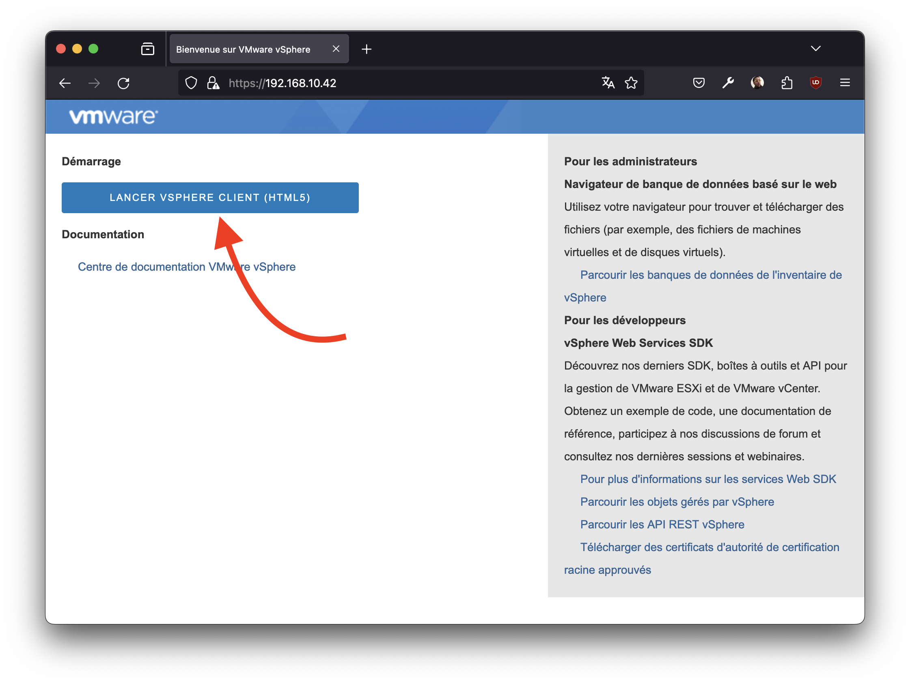

::: tip Observons

Avant d'aller plus loin, observez les options du site. Si vous êtes curieux, vous allez pouvoir voir l'usage actuel de la ferme, ainsi que la puissance de celle-ci.

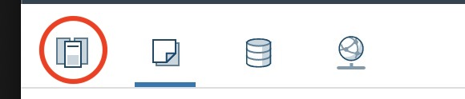

:::

## Les règles à respecter

L'équipe pédagogique vous a attribué l'accès à une zone de travail. Cette zone est un dossier et des ressources réservées pour vous. Avant de continuer, quelques règles **sont importantes** pour utiliser au mieux cet espace de travail partagé :

- Ne pas créer de VM directement dans **votre zone**, mais dans un dossier à votre nom.
- Nommer vos VM de la manière suivante : `<votre-nom>-<utilité de la machine>`. (Exemple : `vbrosseau-ap2ServeurDebianWeb`).
- Choisir l'allocation dynamique pour le disque dur.
- Installer les VMWARE Tools une fois la machine installée.
- Ne pas conserver les machines Linux allumées en dehors des heures de cours. Votre machine ne sert probablement pas la nuit… **Faites comme les grands acteurs du cloud, éteignez vos machines la nuit**.
- Ne pas créer de machine avec une configuration trop importante. La ferme est un équipement partagé, il est donc important de ne pas surcharger les serveurs.
- Supprimer régulièrement les VM qui ne vous sont plus utiles. (en utilisant l'option **« Supprimer du disque »**).
- **Sauvegarder vos identifiants et mots de passe de votre VM**.

::: tip Comment ne pas perdre vos identifiants ?

Pour ne pas perdre vos identifiants vous **devez** créer une `fiche serveur`. Ce document va contenir toutes les informations de votre Machine Virtuelle :

- Nom.
- Système d'exploitation.
- Adresse IP, Masque, Passerelle, adresse DNS.
- Login et mot de passe administrateur.
- Login et mot de passe utilisateur (s’il y en a).
- La liste des services de votre machine.
- Si les services ont également des accès spécifiques ajoutez-les dans votre `fiche serveur`.

:::

::: danger 🚨 Attention

Toutes les VM qui ne respectent pas ces exigences pourront être supprimées sans avertissement !

Ne jouez pas avec le feu, respectez les règles. Sinon vous risquez de vous brûler 🔥.

<iframe src="https://giphy.com/embed/dbtDDSvWErdf2" width="480" height="261" frameBorder="0" class="giphy-embed" allowFullScreen></iframe>

:::

## Les VMWare Tools

Les VMWare Tools sont un ensemble de logiciels qui vont permettre d'optimiser l'utilisation de votre machine virtuelle. Ces logiciels vont permettre d'optimiser la gestion de la mémoire, de la carte réseau, de la carte graphique, du clavier, de la souris, etc.

Il est important de ne jamais les oublier, car ils sont vraiment une source d'optimisation des performances. Pour votre VM mais également pour le cluster.

## Créer le dossier pour ranger vos VM

Première étape, rangez votre VM dans un dossier à votre nom. Pour cela :

- Cliquez droit sur le dossier qui correspond à votre zone (OUESSANT, BREHAT, …).
- Cliquez sur `Nouveau dossier`.
- Nommez le dossier avec votre nom (Exemple : `vbrosseau`).

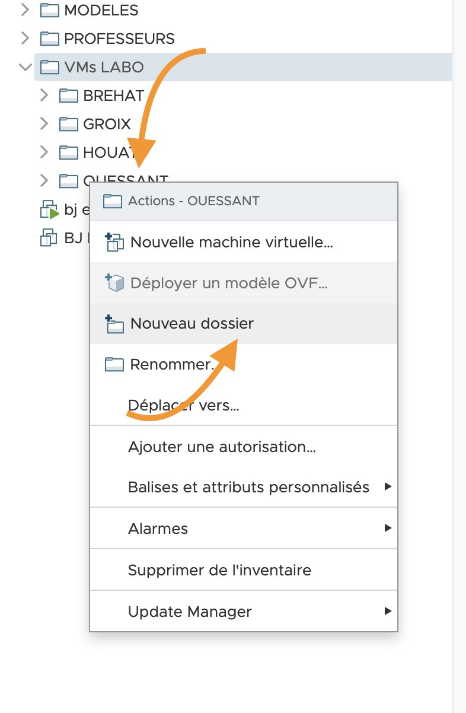

Cette étape est importante, car elle va vous permettre de ranger vos VM dans un dossier à votre nom. Cela va vous permettre de ne pas vous perdre dans les dossiers, et surtout de ne pas supprimer les VM d'un autre étudiant.

## Créer une VM

Pour créer une VM, il faut :

- Sélectionner le dossier à votre nom.
- Clic droit, créer une VM.
- Puis « Nouvelle machine virtuelle… ».

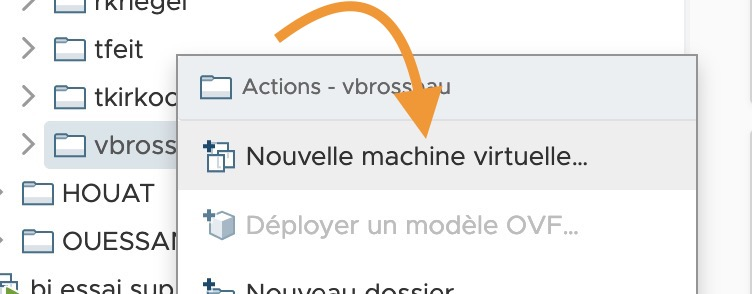

Cette action va ouvrir un assistant vous permettant de créer votre machine virtuelle.

### 1. Type de création

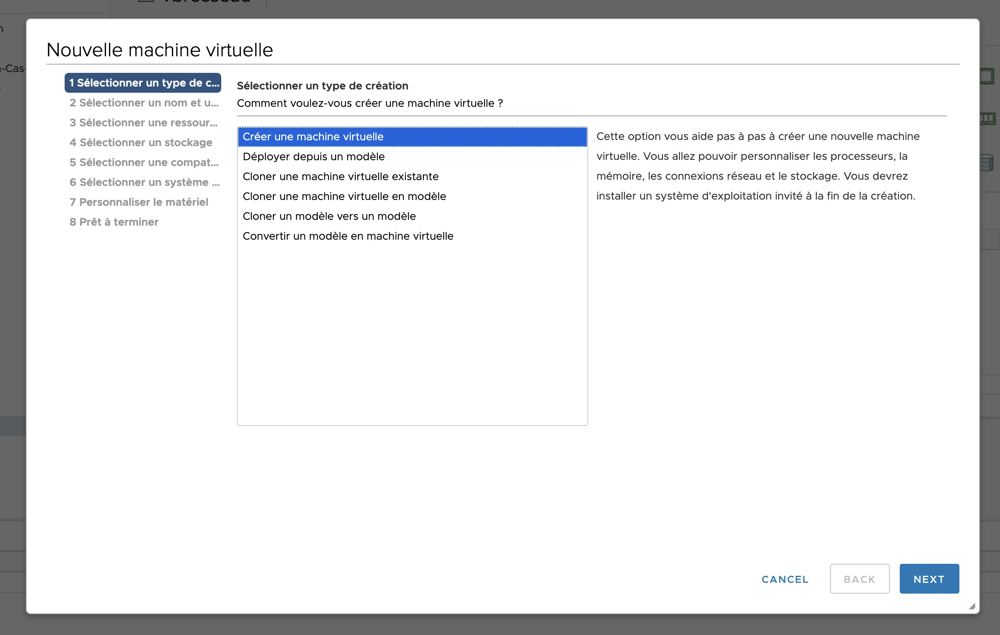

### 2. Nommage de votre machine

Ici vous allez choisir le nom de votre VM. Il est important de respecter la convention de nommage que nous avons définie plus haut.

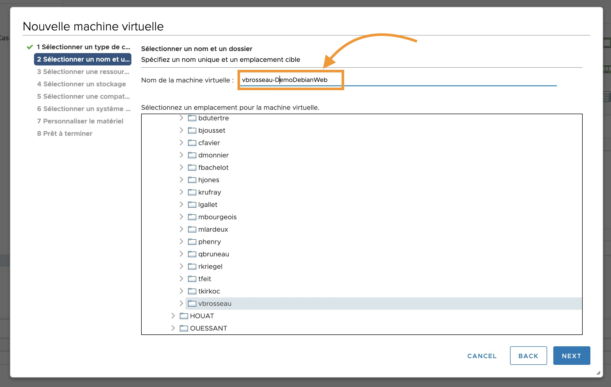

### 3. Ressource de calcul

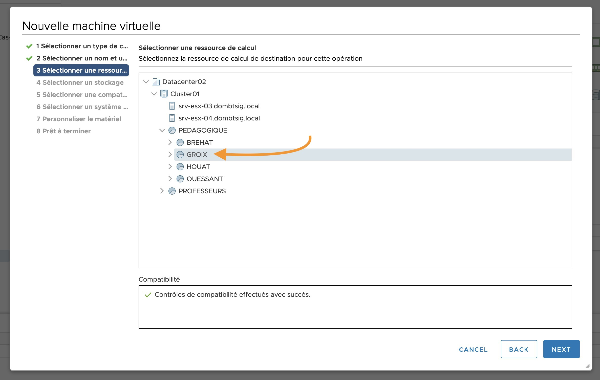

### 4. L'espace de stockage

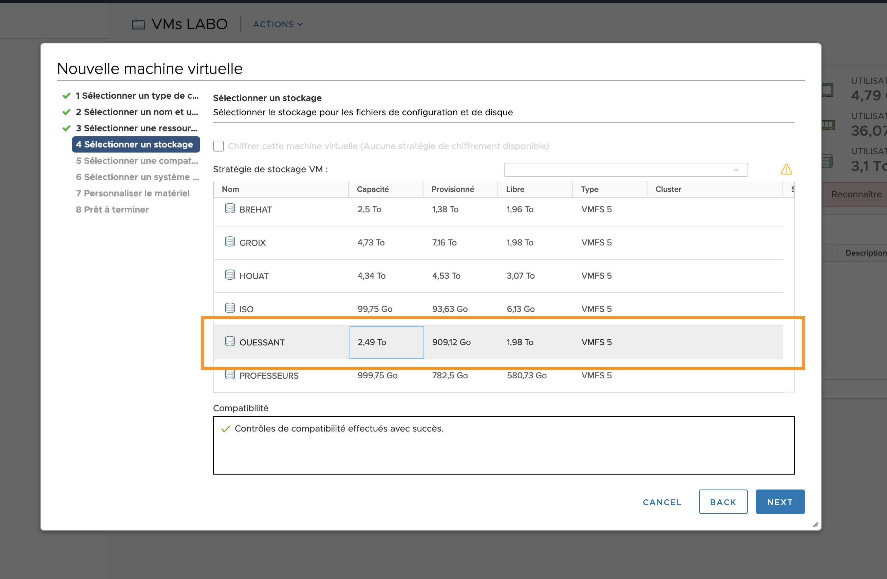

### 5. Compatibilité

Ne touchez à rien, et cliquez sur « Next ».

### 6. Choix de l'OS

À cette étape vous allez indiquer à VMWare quel système d'exploitation votre VM va avoir. En fonction de votre choix, la VM sera optimisée pour celui-ci.

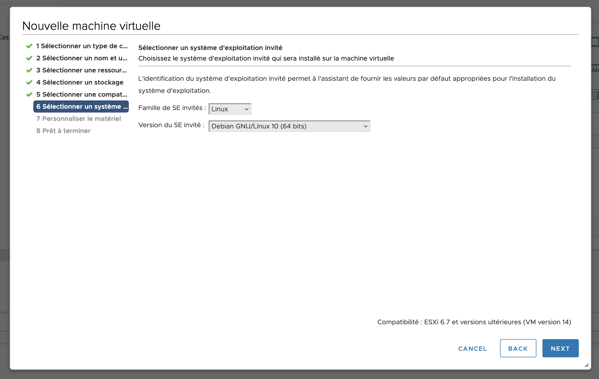

### 7. Configuration de votre VM

Comme pour un ordinateur physique, une VM possède une configuration matérielle. Cette configuration matérielle doit être en adéquation avec le système d'exploitation que vous avez choisi :

#### Le disque dur & la mémoire vive

- Windows : 60Go de disque dur, 4Go de mémoire vive.
- Linux : 8Go de disque dur, 2Go de mémoire vive.

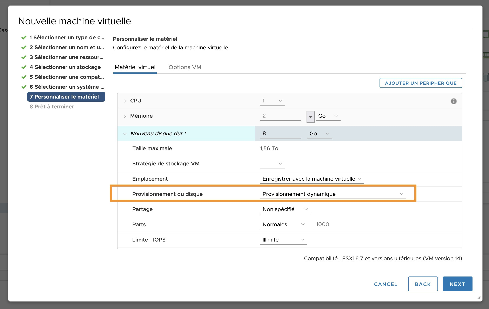

::: tip Provisionnement du disque

Le provisionnement dynamique est une méthode qui optimise l'utilisation du stockage en allouant un espace de stockage de manière flexible, à la demande.

[En savoir plus](https://docs.vmware.com/fr/VMware-vSphere/6.7/com.vmware.vsphere.html.hostclient.doc/GUID-525C8814-C5B7-419E-852D-A396FF74C6DA.html)

:::

#### Le réseau

- Choisir votre VLAN (voir celui qui vous a été attribué).
- Changer le type de l'adaptateur : choisir VMXNET.

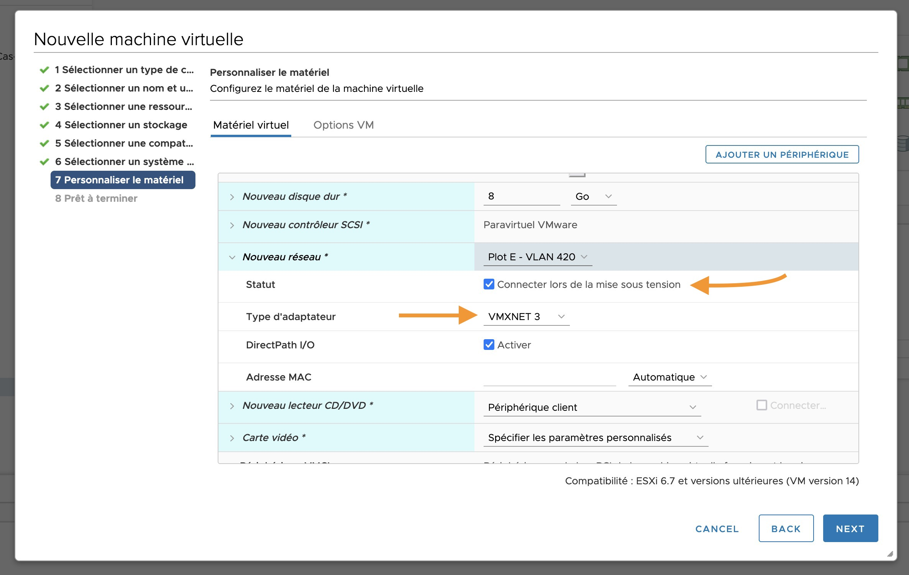

::: tip Votre VLAN ?
Si vous ne connaissez plus votre VLAN, vous pouvez [le retrouver sur Moodle](https://192.168.10.9/course/view.php?id=58).
:::

### Fin. Récap

La configuration de votre VM est complète. Vous pouvez maintenant cliquer sur « Finish » pour valider la création de celle-ci.

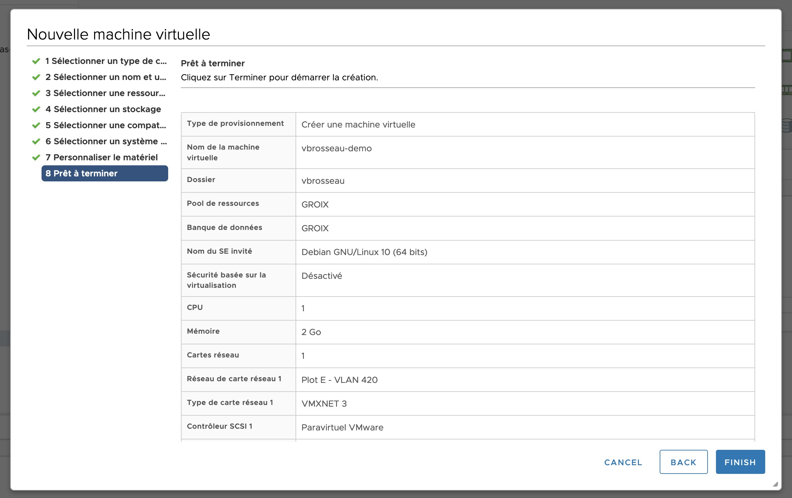

## Connecter un ISO pour l'installation

Pour installer votre système d'exploitation, vous allez devoir connecter un ISO à votre VM.

::: tip Un ISO ?

Un ISO est un fichier qui contient une image d'un CD ou d'un DVD. Il est possible de créer un ISO à partir d'un CD ou d'un DVD. Il est également possible de télécharger un ISO sur internet.

Le fichier ISO est une copie parfaite d'un disque physique.

:::

Pour connecter un ISO à votre VM :

- Clic droit sur votre VM et « Modifier les paramètres ».

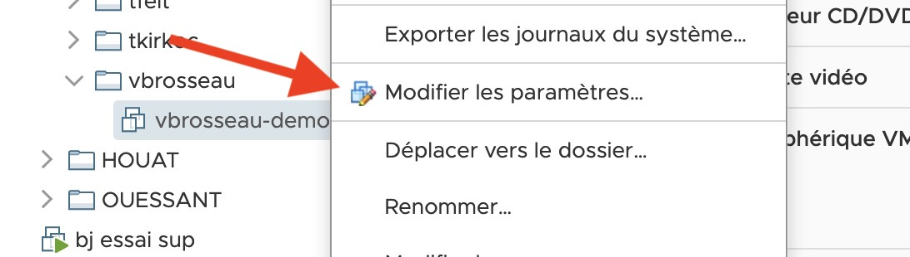

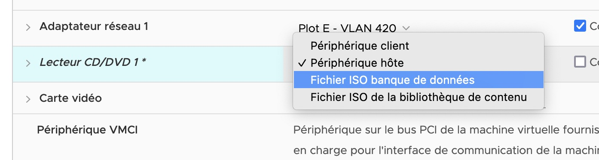

- choisir l’image iso (liste déroulante) que vous souhaitez : Par exemple `debian-11.5.0-amd64-netinst.iso` qui se trouve dans la banque de données ISO puis répertoire `\LINUX\`.
- N’oubliez pas de cocher la case « Connecter lors de la mise sous tension » sinon votre vm ne bootera pas sur votre iso/cd au démarrage.

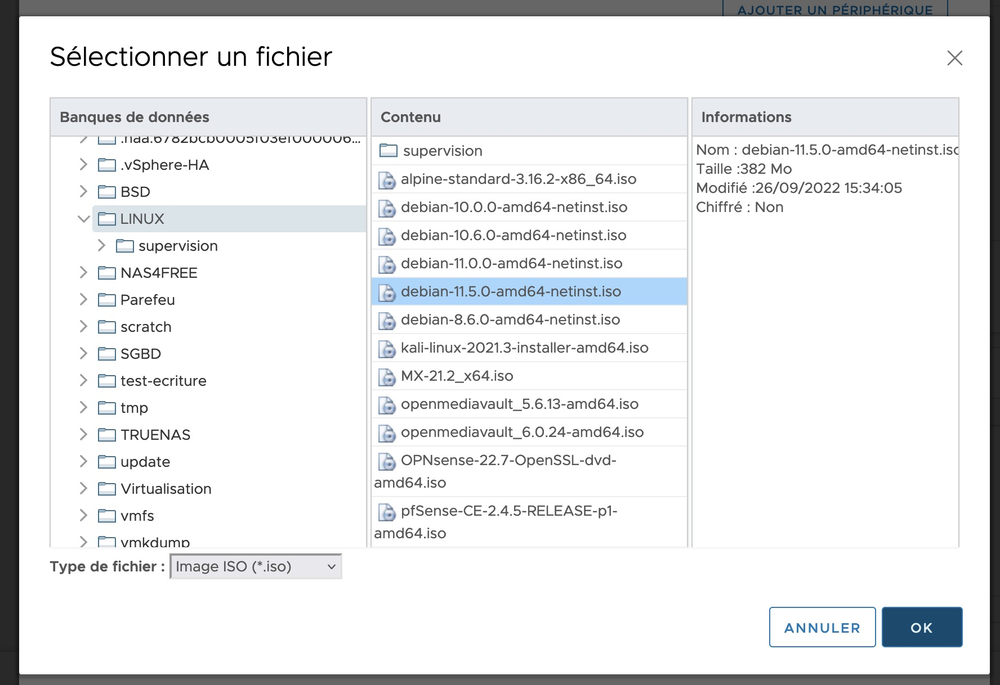
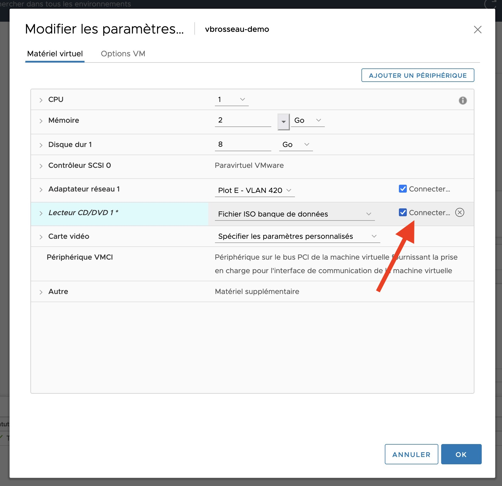

::: tip Et voilà !

Vous venez de créer votre première VM. Celle-ci est prête à être démarrée et à être installée (comme un véritable ordinateur).

:::

## Démarrer votre VM

Pour démarrer votre VM, il suffit de cliquer sur « la flèche verte ».

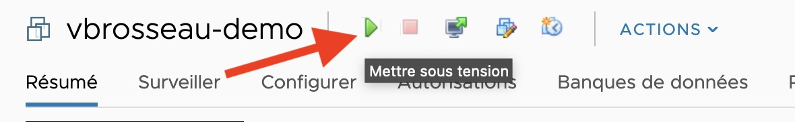

## Accéder à votre VM depuis l'interface Web

Maintenant que vous avez démarré votre VM. Il faut accéder à celle-ci.

Évidemment, nous n'avons pas la possibilité de connecter un écran à la ferme. Nous allons utiliser un accès distant « web » (une sorte de VNC). Cet accès distant n'est pas très pratique et est plutôt lent.

🔥 **Il ne nous servira que pour l'installation**

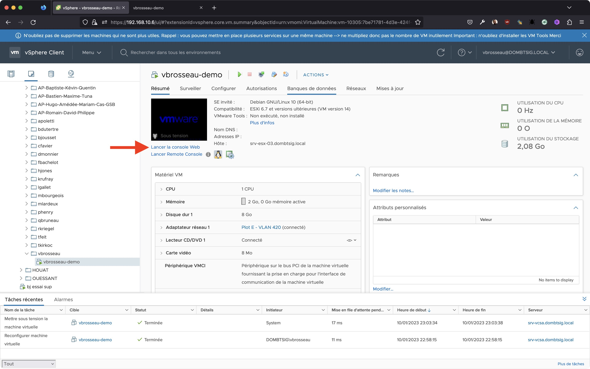

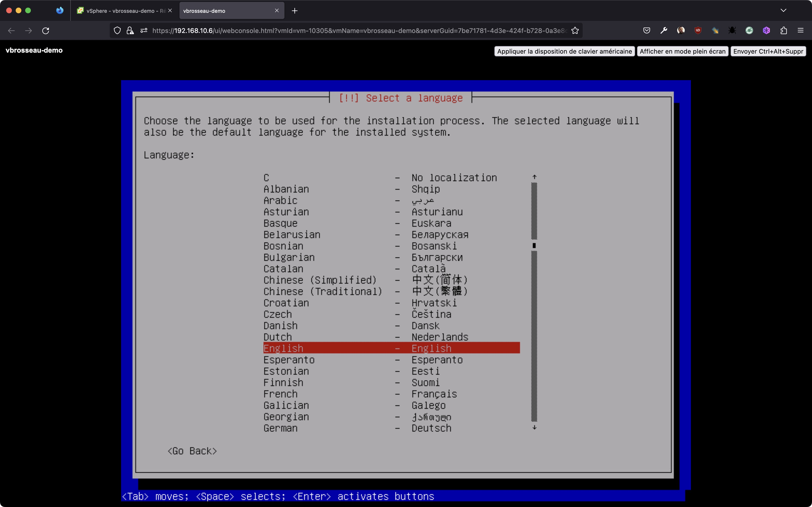

## Supprimer une VM

Il est important de régulièrement supprimer les VM qui ne sont plus utiles.

Pour supprimer une VM :

- Clic droit sur la machine à supprimer.
- Supprimer du disque.

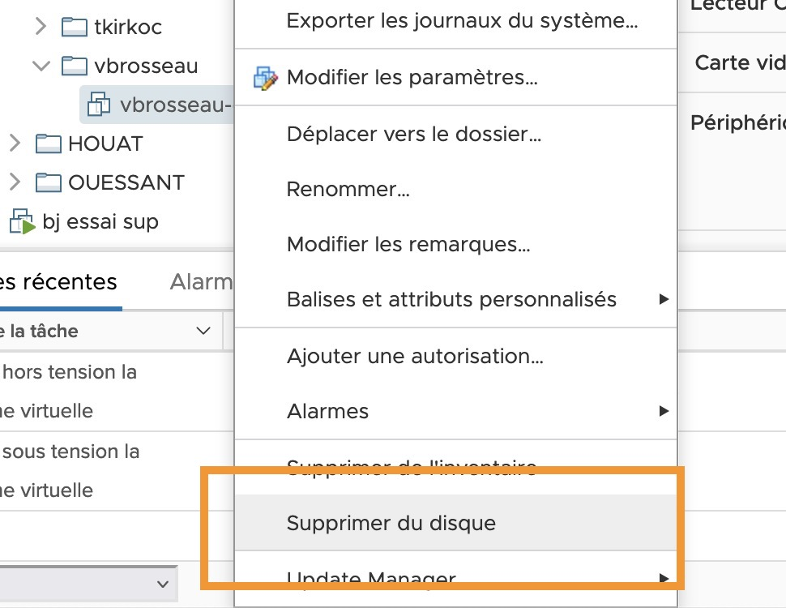

::: danger Attention
Ne surtout pas cliquer sur « Supprimer de l’inventaire ». Cela supprime juste la vm de la liste en conservant tous les fichiers liés à la vm sur la ferme qui continuent donc d’occuper de la place inutilement !
:::

## Accès à vos VM après l'installation

Nous reviendrons sur ce point d'ici quelques TP. Mais vous devez **Obligatoirement** vous connecter à vos machines virtuelles depuis :

- Windows : Bureau à distance.
- Linux : SSH (Putty ou WSL2 ou GitBash).

Le Bureau à distance ou le SSH sont les seules bonnes façons d'accéder à votre VM.

L'accès Web de Vmware n'offre pas une performance suffisante pour travailler dans de bonnes conditions.

En plus il ne permet pas de copier/coller entre votre machine et votre VM.

::: tip 👋 Un instant

Plus tard, nous verrons pourquoi l'accès SSH est un incontournable en entreprise. Et surtout pourquoi, bien configuré, il sera un allié pour gérer vos serveurs de manière optimisée.

:::

## Fiche serveur

Vous venez de créer votre première machine virtuelle. Comme vu en introduction, cette fiche doit contenir l'ensemble des informations de votre serveur. Par exemple :

- nom de la vm, mais surtout nom de la machine via le système d’exploitation
- les comptes utilisateurs : identifiants et MOT DE PASSE
- configuration IP
- système d’exploitation installé
- services installés avec mot de passe (compte)
- outils installés avec mot de passe (compte)

::: tip L'objectif ?

Ici l'idée est de ne pas oublier la configuration de votre serveur. En effet, avec la multitude de serveurs et de cours, il n'est pas impossible que vous oubliez la configuration de votre machine. Pour éviter tout problème, créez dès le début votre fiche serveur.

<iframe src="https://giphy.com/embed/Od0QRnzwRBYmDU3eEO" width="480" height="480" frameBorder="0" class="giphy-embed" allowFullScreen></iframe>

:::

## Accès à la ferme depuis chez vous

Pour cela vous devez installer sur votre machine le logiciel OpenVPN.

Vous trouverez une procédure d’installation sur Moodle (192.168.10.9), ainsi que les fichiers de configuration nécessaires (certificats) pour autoriser votre connexion au lycée :

`Moodle\Info BTS SIO\Accès VPN`

Une fois connecté, vous êtes sur votre machine comme si vous étiez sur un poste d’une des salles informatiques du lycée.

## Conclusion

Dans ce TP nous avons vu comment créer une VM. Et surtout quelles sont les règles de base à respecter pour que la ferme fonctionne bien dans la durée. Nous avons aussi vu comment accéder à votre VM depuis chez vous. Et enfin, nous avons vu l'importance de créer une fiche serveur.

Vous pouvez penser en SLAM que les serveurs ne font pas partie de votre option ? Détrompez-vous, pendant les deux années, nous vous demanderons de créer des serveurs. Et surtout de les gérer. C'est pourquoi il est important de bien comprendre les bases de la création de VM.

De plus, il y a fort à parier qu'en entreprise vous soyez amené à « gérer des serveurs », ou dans une moindre mesure vous connecter dessus pour y installer vos développements.

## La suite ?

Dans le prochain TP, nous allons voir comment installer un système d'exploitation sur une VM. [Cliquez ici pour accéder au TP suivant](./tp1b.md)
