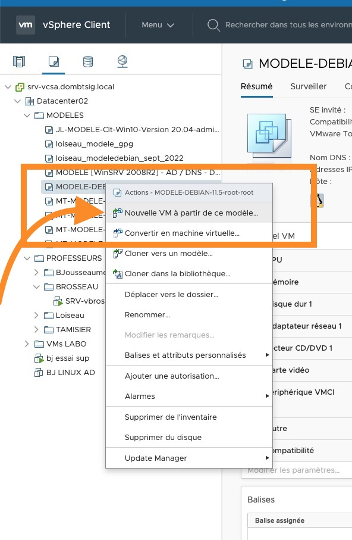
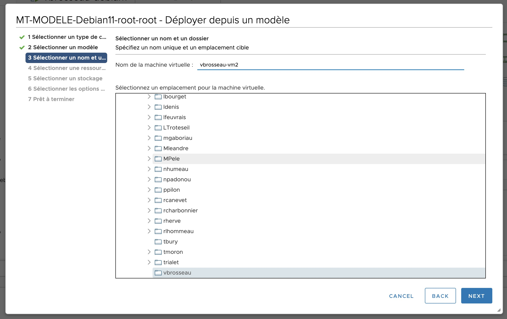
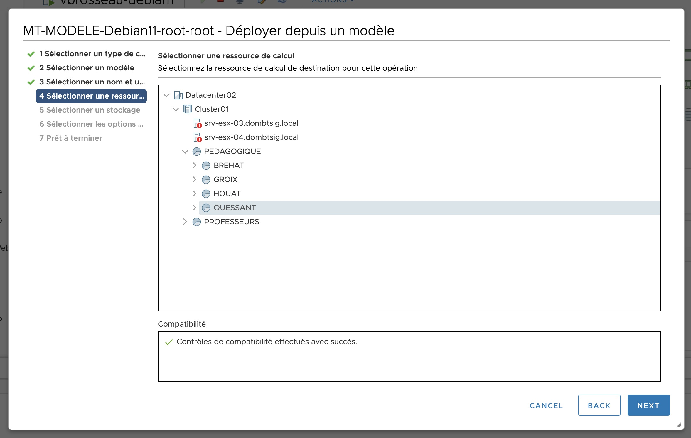
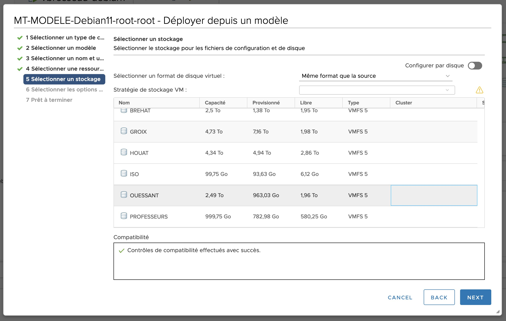
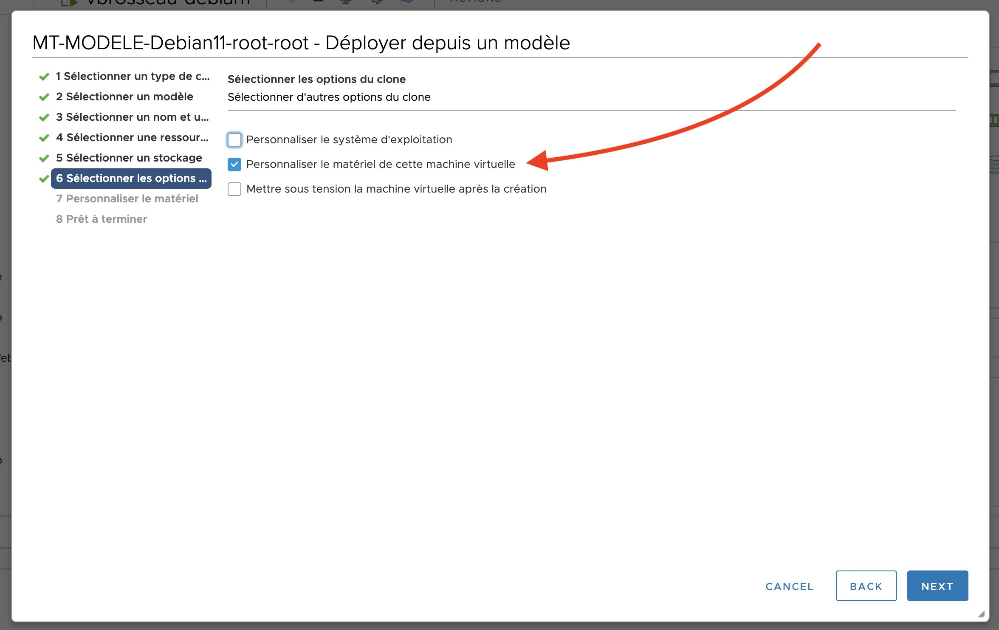
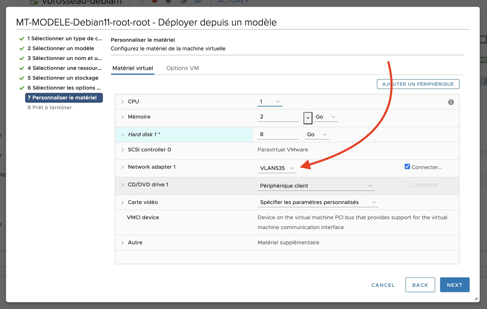
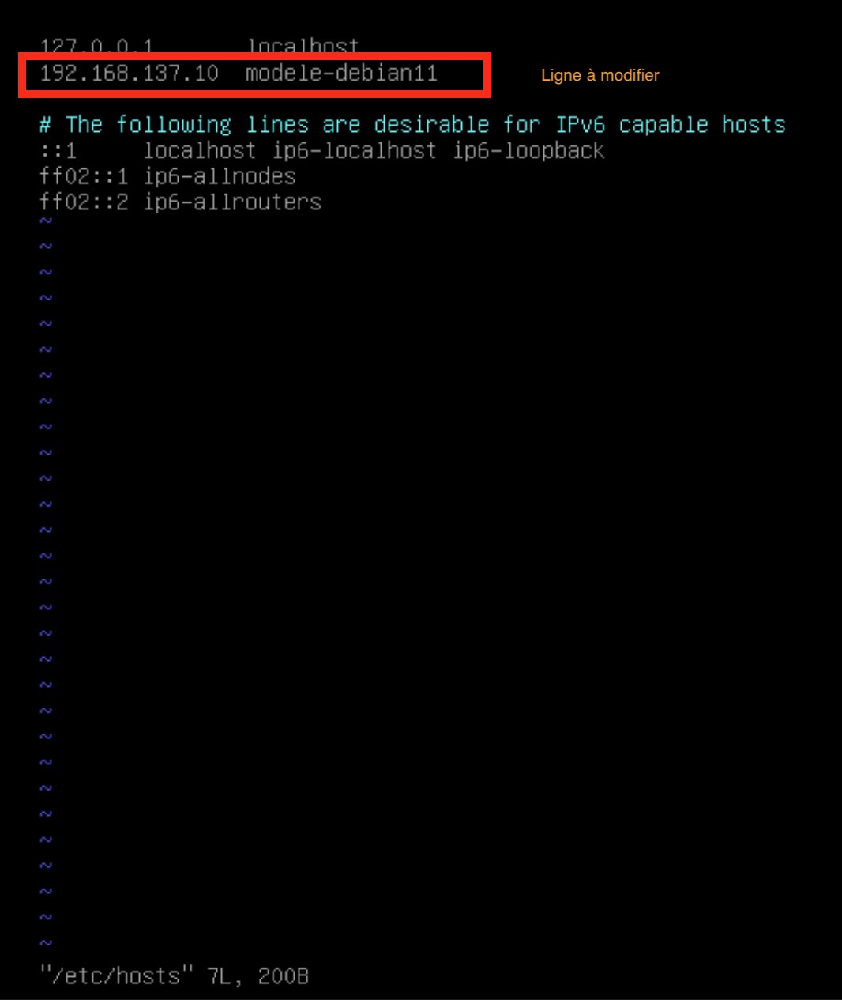

# TP1. Créer une VM sur la ferme à partir d'un modèle.

::: details Sommaire
[[toc]]
:::

## Objectifs

Dans ce TP nous allons voir comment créer une VM sur la ferme VMWare du BTS SIO à Angers depuis un modèle. L'idée de ce TP est de comprendre la démarche à suivre.

::: danger 👋 Attention

La ferme est un équipement partagé par l'ensemble des étudiants du BTS (1ère et 2ème année). Il est donc important de respecter quelques règles d'utilisation pour une utilisation optimale de la ferme, et surtout **dans l'intérêt de tous**.

:::

Dans ce TP nous allons utiliser un modèle déjà créé. Si vous souhaitez créer une VM sans modèle, vous pouvez suivre le [TP1](./tp1.md).

## Pré-requis

::: tip Uniquement disponible pour le Lycée / VPN

Pour réaliser ce TP vous devez :

- Être connecté à la ferme du BTS SIO à Angers (ou via le VPN).
- Avoir un compte sur L'AD.

:::

## Les étapes

Vous retrouverez ci-dessous les étapes à suivre pour réaliser une machine depuis un modèle.

::: danger 👋 Attention

Créer une VM à partir d'un modèle est plus rapide que de créer une VM à partir de zéro. Cependant, un modèle impose la personnalisation de la VM en fin de procédure. À savoir :

- Configuration du VLAN.
- Configuration de l'IP.
- Configuration du nom de la machine.
- Changement du mot de passe `root`.
- Mise à jour des paquets de la machine.

:::

### 0. Créer la VM

Pour créer une VM, il faut :

- Sélectionner le modèle dans le dossier « MODELES ».
- Clic droit sur la VM que vous souhaitez prendre comme modèle.
- Puis « Nouvelle VM à partir de ce modèle ».

### 1. Choix du modèle dans la liste



::: tip 📝 Remarque

Le nom du modèle est composé de la façon suivante :

- `MODELE-` : Préfixe.
- `OS` : Nom de l'OS (exemple : `debian`).
- `VERSION` : Version de l'OS (exemple : `11.5`).
- `UTILISATEUR` : Nom de l'utilisateur pour utiliser le modèle (exemple : `root`).
- `Mot de passe` : Mot de passe de l'utilisateur pour utiliser le modèle (exemple : `root`). **Ce mot de passe est à changer une fois la VM créée.**

:::

### 3. Nom de la VM et emplacement



### 4. Configuration de la VM



### 5. Configuration du stockage



### 6. Personnalisation de la VM



### 7. Choix du VLAN

N'oubliez pas de choisir le VLAN pour votre VM.



## Premier démarrage

Maintenant que votre VM est créée, il faut la démarrer, comme pour n'importe quelle autre VM.

Cependant, vu qu'il s'agit d'une VM créée à partir d'un modèle, il y a quelques étapes à suivre pour la configurer.

- Changer la configuration réseau.
- Changer le mot de passe de l'utilisateur `root`.
- Créer un compte utilisateur.
- Mettre à jour le système.

### Changer la configuration réseau

Pour cette étape vous pouvez utiliser l'outil disponible dans l'aide mémoire :

En utilisant l'aide mémoire [disponible ici](/cheatsheets/serveur/debian-reseau.md), générer une nouvelle adresse IP pour votre serveur.

Une fois les lignes `address` et `gateway` modifiées dans le fichier `/etc/network/interfaces`, vous pouvez redémarrer votre serveur pour que les modifications soient prises en compte.

```bash
reboot
```

Une fois suivi, vous pouvez vérifier que votre serveur a bien une nouvelle adresse IP en utilisant la commande `ip a`.

Vous pouvez aussi vérifier l'accès à internet en utilisant la commande `ping google.com`.

::: tip Ça ne fonctionne pas ?

- Vérifier que votre VM est bien connectée au bon VLAN.
- Vérifier que vous n'avez pas déjà utilisé cette adresse IP.
- Vérifier le serveur DNS (dans les fichiers `/etc/resolv.conf` et `/etc/network/interfaces`).

:::

### Changer le mot de passe de l'utilisateur `root`

Pour changer le mot de passe de l'utilisateur `root`, vous pouvez utiliser la commande `passwd`.

### Créer un compte utilisateur

Pour créer un compte utilisateur, vous pouvez utiliser la commande `adduser <votre-nom-d-utilisateur>`.

::: tip 📝 Remarque

Il est important de créer un compte utilisateur pour ne pas utiliser le compte `root` pour se connecter.

:::

### Vous ajouter au groupe sudo

Pour pouvoir passer des commandes en tant que super utilisateur, vous pouvez ajouter votre utilisateur au groupe `sudo`.

```bash
usermod -aG sudo <votre-nom-d-utilisateur>
```

### Mettre à jour le système

Maintenant que votre VM est prête, il faut mettre à jour le système.

Pour cela vous pouvez utiliser la commande :

```bash
apt update && apt upgrade -y
```

### Changer le nom de la machine

Par défaut le nom de la machine sera celui du modèle. Pour changer le nom de la machine, vous pouvez utiliser la commande `hostnamectl`.

```bash
# Définir le nom de la machine
hostnamectl set-hostname votre-nouveau-nom-de-machine
```

Puis changer le fichier `/etc/hosts` pour que le nom de la machine soit correct. Dans mon cas je vais remplacer :

```bash
192.168.137.10 modele-debian-11
```

Par :

```bash
192.168.MON.IP vbrosseau-demo-modele
```

Vous pouvez utiliser `vim` ou `nano` pour modifier le fichier.

::: details le fichier /etc/hosts avant modification



:::

## Sécurisation de l'accès SSH

Nous l'avons vu dans [le TP précédent](./tp1b.md#ajouter-votre-clé-publique-sur-votre-serveur), il est important de sécuriser l'accès SSH à votre serveur. Nous allons donc réaliser les mêmes étapes que dans le TP précédent à savoir :

- Interdire la connexion en tant que `root` (`PermitRootLogin no`).
- Interdire la connexion avec un mot de passe (`PasswordAuthentication no`).

::: danger 👋 Attention

Une fois ces paramètres modifiés, votre serveur ne sera plus accessible en mode mot de passe. Il est donc important de réaliser **un échange de clés au préalable** (via la commande `ssh-copy-id <votre-utilisateur>@<votre-ip>` depuis votre machine).

:::

Pour cela vous pouvez éditer le fichier `/etc/ssh/sshd_config` et modifier les lignes relatives à ces paramètres (`vim /etc/ssh/sshd_config`).


::: details Aller plus loin

Vous pouvez aussi changer le port d'écoute du serveur SSH pour éviter les attaques par force brute. Pour cela vous pouvez modifier la ligne `Port 22` par un autre port (exemple : `Port 2222`).

Une fois modifié, vous pourrez accéder à votre serveur en utilisant la commande `ssh -p 2222 <votre-utilisateur>@<votre-ip>`.

:::

## Conclusion

Vous avez maintenant une VM fonctionnelle, vous pouvez maintenant l'utiliser pour vos projets.