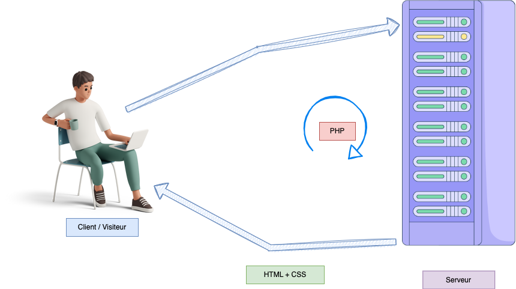
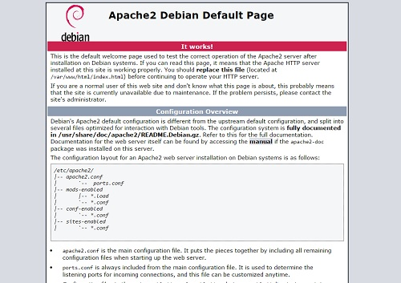
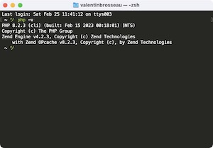

# TP2. Configurer un serveur Web

::: details Sommaire
[[toc]]
:::

## Pré-requis

Avant de commencer ce TP, vous devez savoir comment installer un serveur Debian. Si ce n'est pas le cas, vous pouvez suivre le [TP1](./tp1b.md). Je part du principe que vous maitriser également les commandes de base de Linux (voir [cheatsheet](/cheatsheets/serveur/linux-debian-based.md)).

## Objectifs

Dans ce TP nous allons voir comment créer un serveur Web (Apache + PHP) et comment le configurer. Ce type de serveur est très utilisé pour héberger des sites Web dynamiques. Lors de vos deux années de BTS ont vous demandera de créer ce genre de serveur, pour mettre à disposition vos réalisations (En AP, mais également lors des projets de fin d'année).

Maitriser la création de serveur, est un point important. En effet, derrière chaque site Web, il y a un serveur qui tourne. Il est donc important de savoir comment le configurer, et comment le sécuriser. Même si il est possible d'héberger son site Web sur des plateformes ou la notion de serveur n'est pas présente, il est important de savoir comment cela fonctionne afin de pouvoir dépanner un site web en cas de problème (gestion des droits, des logs, etc.).

### Ce que nous allons voir

Voilà l'architecture que nous allons mettre en place :



- Un serveur Debian 11.
- Un serveur Web Apache.
- PHP 8.X (le `X` étant la dernière version disponible).

## Ressources

Pour réaliser ce TP, vous aurez besoin de :

- [Aide mémoire Debian](/cheatsheets/serveur/linux-debian-based.md)
- [Générateur de configuration](/cheatsheets/serveur/debian-reseau.md)
- [Aide mémoire clé SSH](/cheatsheets/ssh-key/)

## La VM

Pour ce TP je vais vous demander de créer une VM. Cette VM doit respecter les spécifications suivantes :

- Nom de la VM : `<votre nom>-web`.
- OS : Debian 11.
- Mémoire : 1Go.
- CPU : 1.
- Disque : 5Go.

### Étape 1 : Créez une VM

À l'aide des TP précédents (et de vos notes), créez une VM qui respecte les spécifications ci-dessus.

### Étape 2 : Configurez la VM

Configurez la VM pour qu'elle respecte les spécifications suivantes :

- La VM doit avoir une IP statique. (Vous pouvez utiliser le générateur de configuration).
- La VM doit avoir accès à Internet (`ping www.google.com` doit fonctionner).
- La VM doit posséder les **vmtools**.

### Étape 3 : Accès SSH à la VM

Pour vous connecter à la VM, vous devez utiliser la commande `ssh` depuis votre machine hôte. Pour que cela fonctionne :

- Vous devez avoir installé le serveur SSH sur votre VM (voir [TP précédent](./tp1b.md)).
- Vous devez avoir généré une clé SSH sur votre machine hôte et l'avoir ajoutée à votre VM (voir [TP précédent](./tp1b.md)).
- L'accès par mot de passe doit être désactivé sur votre VM (voir [TP précédent](./tp1b.md)).
- L'accès `root` par SSH doit être désactivé sur votre VM (voir [TP précédent](./tp1b.md)).

::: details Rappel sur la clé SSH

Pour installer votre clé SSH sur votre serveur, il vous suffit de faire la commande suivante sur votre ordinateur.

```bash
ssh-copy-id <username>@<ipaddress>
```

⚠️ Vous devez évidemment remplacer `<username>`et `<ipaddress>`par votre utilisateur et votre mot de passe. Exemple :

```bash
ssh-copy-id pi@192.168.1.253
```

Rien de plus, à partir de maintenant votre serveur acceptera votre connexion sans vous demander de mot de passe. Pratique non ? (Et surtout très sécurisé)

:::

## Installation d'Apache

Vous l'avez compris, nous allons installer un serveur Web Apache sur notre VM. Pour cela, nous allons utiliser la commande `apt` pour installer le paquet `apache2`.

### Étape 1 : Installation d'Apache

Pour installer Apache, vous devez utiliser la commande `apt` :

```bash
apt update
apt install apache2
```

### Étape 2 : Vérification de l'installation

#### Vérifier en ligne de commande que le serveur est démarré

Pour vérifier que le serveur est démarré, vous pouvez utiliser la commande suivante :

```bash
sudo systemctl status apache2
```

#### Vérifier que le serveur est accessible

Pour vérifier que le serveur est accessible, il vous suffit d'ouvrir votre navigateur et d'aller sur l'adresse IP de votre serveur. Si vous avez bien suivi les étapes précédentes, vous devriez voir la page d'accueil d'Apache.



::: details Rappel sur les dossiers

Les fichiers du serveur sont dans le dossier `/var/www/html`. Vous pouvez y accéder avec la commande suivante :

```bash
cd /var/www/html
```

C'est ici que nous voyons l'avantage de Linux. L'architecture est très simple, et les fichiers sont très facilement accessibles.

:::

## Installation de PHP

Maintenant que nous avons un serveur Web, nous allons installer PHP. Pour l'instant vous avez utilisé PHP sur votre machine Windows (via XAMPP). Mais PHP peut également être installé sur un serveur Linux. Pour cela, nous allons utiliser la commande `apt` pour installer le paquet `php`.

Debian est une distribution un peu particulière, elle est dite « stable ». C'est-à-dire que les versions des paquets peuvent-être un peu ancien. Pour cela nous allons devoir ajouter un dépôt supplémentaire pour avoir accès aux dernières versions de PHP.

Le Dépôt est une sources supplémentaire pour l'installation de paquets. Il est possible d'ajouter plusieurs dépôts, et de choisir la version de paquet que l'on souhaite installer.

### Étape 1 : Ajout du dépôt

Nous allons donc ajouter un nouveau dépôt pour avoir accès aux dernières versions de PHP.

```bash
apt-get update
apt-get install wget lsb-release apt-transport-https gnupg2 ca-certificates -y
wget -O /etc/apt/trusted.gpg.d/php.gpg https://packages.sury.org/php/apt.gpg
sh -c 'echo "deb https://packages.sury.org/php/ $(lsb_release -sc) main" > /etc/apt/sources.list.d/php.list'
```

Un peu de détail sur les commandes : 

- `wget` est un outil qui permet de télécharger des fichiers depuis Internet.
- `lsb-release` est un outil qui permet de récupérer des informations sur la distribution Linux.
- `apt-transport-https` est un outil qui permet de télécharger des fichiers depuis un serveur HTTPS.
- `gnupg2` est un outil qui permet de vérifier la signature d'un fichier.
- `ca-certificates` est un outil qui permet de vérifier la signature d'un fichier.
- `wget -O /etc/apt/trusted.gpg.d/php.gpg https://packages.sury.org/php/apt.gpg` permet de télécharger le fichier de signature du dépôt.
- `sh -c 'echo "deb https://packages.sury.org/php/ $(lsb_release -sc) main" > /etc/apt/sources.list.d/php.list'` permet d'ajouter le dépôt dans la liste des dépôts.

Le dépôt est celui de [Ondřej Surý](https://deb.sury.org/). Il est très connu pour proposer des versions de PHP plus récentes que celles proposées par Debian.
::: tip Cette étape est importante

Si vous ne faites pas cette étape, vous n'aurez pas accès aux dernières versions de PHP. Vous aurez donc une version de PHP qui n'est pas à jour, et qui ne sera pas compatible avec les dernières versions fonctionnalités de PHP. Car oui, de base Debian va posséder l'ensemble des paquets qui nous seront utiles, mais dans une version un peu plus ancienne (mais plus stable du coup).

:::

### Étape 2 : Installation de PHP

Maintenant que nous avons ajouté le dépôt, nous allons pouvoir installer PHP.

```bash
apt update
apt install libapache2-mod-php php-mysql php-pdo php php-common php-xml php-gd php-opcache php-mbstring php-tokenizer php-json php-bcmath php-zip unzip curl -y
```

Ça fait beaucoup de paquets, mais en fait, c'est très simple. Voici le détails pour quelques paquets :

- `libapache2-mod-php` est le module Apache qui permet d'utiliser PHP depuis Apache.
- `php-mysql` est le module PHP qui permet d'utiliser MySQL depuis PHP (pour les bases de données).
- `php-pdo` est le module PHP qui permet d'utiliser PDO depuis PHP (pour les bases de données).
- `php-common` est le module PHP qui contient les fichiers de configuration de PHP.
- `php-xml` est le module PHP qui permet d'utiliser XML depuis PHP.
- `php-gd` est le module PHP qui permet d'utiliser GD depuis PHP (manipuler des images).
- `php-zip` est le module PHP qui permet d'utiliser Zip depuis PHP (extraire / compresser depuis PHP).
- `curl` est un outil qui permet de télécharger des fichiers depuis Internet (similaire à wget).

::: tip Pourquoi autant de paquets ?

C'est un peu compliqué à expliquer, mais en gros, PHP est un langage qui est très modulaire. C'est-à-dire qu'il est possible de choisir les fonctionnalités que l'on souhaite utiliser. C'est pour cela que nous avons besoin de plusieurs paquets pour avoir une version complète de PHP.

Il est possible que plus tard pour un développement vous ayez besoin d'ajouter de nouveaux paquets, c'est le cas par exemple pour un Wordpress / Laravel.

:::

#### Vérifier la version de PHP

Maintenant que nous avons installé PHP, nous pouvons le vérifier via la commande :

```bash
php -v
```

Vous devriez voir quelques choses similaire à :



### Étape 3 : Vérifier que Apache + PHP fonctionne

Pour vérifier que Apache + PHP fonctionne, vous pouvez créer un fichier `index.php` dans le dossier `/var/www/html`. Vous pouvez utiliser la commande suivante pour y accéder :

```bash
nano /var/www/html/info.php
```

Dans ce fichier `index.php`, vous pouvez mettre le code suivant :

```php
<?php
phpinfo();
?>
```

Vous pouvez ensuite ouvrir votre navigateur et aller sur l'adresse IP de votre serveur. Si vous avez bien suivi les étapes précédentes, vous devriez voir la page d'information de PHP.

::: tip phpinfo() ?
La fonction `phpinfo()` permet d'afficher les informations de PHP. C'est très pratique pour vérifier que tout fonctionne correctement. Vous pouvez également utiliser cette fonction pour vérifier que les extensions PHP sont bien installées.

Comme par exemple `php-pdo` et `php-mysql` pour la base de données.
:::

::: danger Attention

Fichier dangereux, ne pas laisser ce fichier sur un serveur en production. Il permet d'afficher des informations sensibles sur le serveur. En effet, il est possible d'avoir des informations sur les modules installés, les versions de PHP, les extensions installées, etc. Il est donc très important de ne pas laisser ce fichier sur un serveur en production.

:::

## Conclusion intermédiaire

Nous avons donc installé Apache, MySQL et PHP. Nous avons également configuré Apache pour qu'il puisse utiliser PHP. Nous avons également installé les extensions PHP qui nous seront utiles pour le développement.

C'est un point étape, votre serveur est maintenant prêt pour le développement.

## La configuration de PHP

TODO : Traiter le `PHP.ini`

## La configuration d'Apache

TODO : Traiter les `VirtualHost`

## Créer un site web

TODO : Créer deux sites web (virtualhost)

## Conclusion

TODO : Conclusion