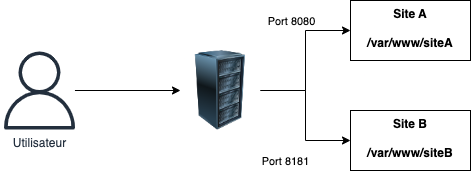
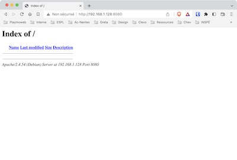
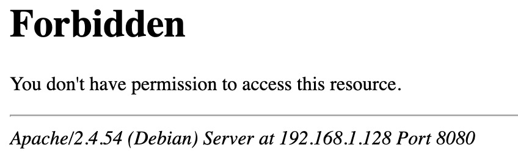

# TP2. Configurer un serveur Web

::: details Sommaire
[[toc]]
:::

## Pré-requis

Avant de commencer ce TP, vous devez savoir comment installer un serveur Debian. Si ce n'est pas le cas, vous pouvez suivre le [TP1](./tp1b.md). Je pars du principe que vous maîtrisez également les commandes de base de Linux (voir [cheatsheet](/cheatsheets/serveur/linux-debian-based.md)).

## Objectifs

Dans ce TP nous allons voir comment créer un serveur Web (Apache + PHP) et comment le configurer. Ce type de serveur est très utilisé pour héberger des sites Web dynamiques. Lors de vos deux années de BTS, on vous demandera de créer ce genre de serveur, pour mettre à disposition vos réalisations (En AP, mais également lors des projets de fin d'année).

Maîtriser la création de serveurs est un point important. En effet, derrière chaque site Web, il y a un serveur qui tourne. Il est donc important de savoir comment le configurer, et comment le sécuriser. Même s’il est possible d'héberger son site Web sur des plateformes où la notion de serveur n'est pas présente, il est important de savoir comment cela fonctionne afin de pouvoir dépanner un site Web en cas de problème (gestion des droits, des logs, etc.).

::: important Machine type examen

Comprendre le découpage multimachines est un élément important pour le passage de l'examen. Il est donc important de bien comprendre ce que nous faisons dans ce TP.

:::

### Ce que nous allons voir

Voilà l'architecture que nous allons mettre en place :


- Un serveur Debian 11.
- Un serveur Web Apache.
- PHP 8.X (le `X` étant la dernière version disponible).

## Ressources

Pour réaliser ce TP, vous aurez besoin de :

- [Aide mémoire Debian](/cheatsheets/serveur/linux-debian-based.md)
- [Générateur de configuration](/cheatsheets/serveur/debian-reseau.md)
- [Aide mémoire clé SSH](/cheatsheets/ssh-key/)

## La VM

Pour ce TP je vais vous demander de créer une VM. Cette VM doit respecter les spécifications suivantes :

- Nom de la VM : `<votre nom>-web`.
- OS : Debian 11.
- Mémoire : 1Go.
- CPU : 1.
- Disque : 5Go.

### Étape 1 : Créez une VM

À l'aide des TP précédents (et de vos notes), créez une VM qui respecte les spécifications ci-dessus.

### Étape 2 : Configurez la VM

Configurez la VM pour qu'elle respecte les spécifications suivantes :

- La VM doit avoir une IP statique. (Vous pouvez utiliser le générateur de configuration).
- La VM doit avoir accès à Internet (`ping www.google.com` dois fonctionner).
- La VM doit posséder les **vmtools**.

### Étape 3 : Accès SSH à la VM

Pour vous connecter à la VM, vous devez utiliser la commande `ssh` depuis votre machine hôte. Pour que cela fonctionne :

- Vous devez avoir installé le serveur SSH sur votre VM (voir [TP précédent](./tp1b.md)).
- Vous devez avoir généré une clé SSH sur votre machine hôte et l'avoir ajoutée à votre VM (voir [TP précédent](./tp1b.md)).
- L'accès par mot de passe doit être désactivé sur votre VM (voir [TP précédent](./tp1b.md)).
- L'accès `root` par SSH doit être désactivé sur votre VM (voir [TP précédent](./tp1b.md)).

::: details Rappel sur la clé SSH

Pour installer votre clé SSH sur votre serveur, il vous suffit de faire la commande suivante sur votre ordinateur.

```bash
ssh-copy-id <username>@<ipaddress>
```

⚠️ Vous devez évidemment remplacer `<username>`et `<ipaddress>`par votre utilisateur et votre mot de passe. Exemple :

```bash
ssh-copy-id pi@192.168.1.253
```

Rien de plus, à partir de maintenant votre serveur acceptera votre connexion sans vous demander de mot de passe. Pratique, non ? (Et surtout très sécurisé)

:::

## Installation des VMTools

Avant de commencer, nous allons installer les VMTools. Pour cela, nous allons utiliser la commande `apt` pour installer le paquet `open-vm-tools`.

```bash
apt update
apt install open-vm-tools
```

## Installation d'Apache

Vous l'avez compris, nous allons installer un serveur Web Apache sur notre VM. Pour cela, nous allons utiliser la commande `apt` pour installer le paquet `apache2`.

### Étape 1 : Installation d'Apache

Pour installer Apache, vous devez utiliser la commande `apt` :

```bash
apt update
apt install apache2
```

### Étape 2 : Vérification de l'installation

#### Vérifier en ligne de commande que le serveur est démarré

Pour vérifier que le serveur est démarré, vous pouvez utiliser la commande suivante :

```bash
sudo systemctl status apache2
```

#### Vérifier que le serveur est accessible

Pour vérifier que le serveur est accessible, il vous suffit d'ouvrir votre navigateur et d'aller sur l'adresse IP de votre serveur. Si vous avez bien suivi les étapes précédentes, vous devriez voir la page d'accueil d'Apache.


::: details Rappel sur les dossiers

Les fichiers du serveur sont dans le dossier `/var/www/html`. Vous pouvez y accéder avec la commande suivante :

```bash
cd /var/www/html
```

C'est ici que nous voyons l'avantage de Linux. L'architecture est très simple, et les fichiers sont très facilement accessibles.

:::

## Installation de PHP

Maintenant que nous avons un serveur Web, nous allons installer PHP. Pour l'instant vous avez utilisé PHP sur votre machine Windows (via XAMPP). Mais PHP peut également être installé sur un serveur Linux. Pour cela, nous allons utiliser la commande `apt` pour installer le paquet `php`.

Debian est une distribution un peu particulière, elle est dite « stable ». C'est-à-dire que les versions des paquets peuvent-être un peu ancien. Pour cela nous allons devoir ajouter un dépôt supplémentaire pour avoir accès aux dernières versions de PHP.

Le Dépôt est une source supplémentaire pour l'installation de paquets. Il est possible d'ajouter plusieurs dépôts, et de choisir la version de paquet que l'on souhaite installer.

### Étape 1 : Ajout du dépôt

Nous allons donc ajouter un nouveau dépôt pour avoir accès aux dernières versions de PHP.

```bash
apt get update
apt get install wget lsb-release apt-transport-https gnupg2 ca-certificates -y
wget -O /etc/apt/trusted.gpg.d/php.gpg https://packages.sury.org/php/apt.gpg
sh -c 'echo "deb https://packages.sury.org/php/ $(lsb_release -sc) main" > /etc/apt/sources.list.d/php.list'
```

Un peu de détail sur les commandes : 

- `wget` est un outil qui permet de télécharger des fichiers depuis Internet.
- `lsb-release` est un outil qui permet de récupérer des informations sur la distribution Linux.
- `apt-transport-https` est un outil qui permet de télécharger des fichiers depuis un serveur HTTPS.
- `gnupg2` est un outil qui permet de vérifier la signature d'un fichier.
- `ca-certificates` est un outil qui permet de vérifier la signature d'un fichier.
- `wget -O /etc/apt/trusted.gpg.d/php.gpg https://packages.sury.org/php/apt.gpg` permet de télécharger le fichier de signature du dépôt.
- `sh -c 'echo "deb https://packages.sury.org/php/ $(lsb_release -sc) main" > /etc/apt/sources.list.d/php.list'` permet d'ajouter le dépôt dans la liste des dépôts.

Le dépôt est celui de [Ondřej Surý](https://deb.sury.org/). Il est très connu pour proposer des versions de PHP plus récentes que celles proposées par Debian.
::: tip cette étape est importante.

Si vous ne faites pas cette étape, vous n'aurez pas accès aux dernières versions de PHP. Vous aurez donc une version de PHP qui n'est pas à jour, et qui ne sera pas compatible avec les dernières versions fonctionnalités de PHP. Car oui, de base Debian va posséder l'ensemble des paquets qui nous seront utiles, mais dans une version un peu plus ancienne (mais plus stable du coup).

:::

### Étape 2 : Installation de PHP

Maintenant que nous avons ajouté le dépôt, nous allons pouvoir installer PHP.

```bash
apt update
apt install php8.2 php8.2-fpm php8.2-cli php8.2-{bz2,curl,mbstring,intl} -y
```

Ça fait beaucoup de paquets, mais en fait, c'est très simple. Voici le détail pour quelques paquets :

- `php8.2` est le paquet principal de PHP.
- `php8.2-fpm` est le paquet qui permet de faire tourner PHP en tant que service.
- `php8.2-cli` est le paquet qui permet d'utiliser PHP en ligne de commande.
- `php8.2-{bz2,curl,mbstring,intl}` sont des paquets qui permettent d'ajouter des fonctionnalités à PHP.

::: tip pourquoi autant de paquets ?

C'est un peu compliqué à expliquer, mais en gros, PHP est un langage qui est très modulaire. C'est-à-dire qu'il est possible de choisir les fonctionnalités que l'on souhaite utiliser. C'est pour cela que nous avons besoin de plusieurs paquets pour avoir une version complète de PHP.

Il est possible que plus tard pour un développement vous ayez besoin d'ajouter de nouveaux paquets, c'est le cas par exemple pour un Wordpress / Laravel.

:::

#### Petit aparté sur PHP-fpm

PHP-FPM est un outil qui permet de faire tourner PHP en tant que service. C'est-à-dire que PHP va tourner en arrière plan, et que les pages Web vont être générées par PHP. C'est un peu comme si vous aviez un serveur Apache, et un serveur PHP qui tourne en arrière plan. C'est la nouvelle façon de faire tourner PHP.

#### Vérifier la version de PHP

Maintenant que nous avons installé PHP, nous pouvons le vérifier via la commande :

```bash
php -v
```

Vous devriez voir quelque chose similaire à :


### Étape 3 : Activer PHP dans Apache

Maintenant que notre PHP est installé, il faut l'activer :

```bash
a2enmod proxy_fcgi setenvif php8.2-fpm
systemctl restart apache2
```

Pour vérifier que Apache + PHP fonctionne, vous pouvez créer un fichier `info.php` dans le dossier `/var/www/html`. Vous pouvez utiliser la commande suivante pour y accéder :

```bash
nano /var/www/html/info.php
```

Dans ce fichier `info.php`, vous pouvez mettre le code suivant :

```php
<?php
phpinfo();
?>
```

Vous pouvez ensuite ouvrir votre navigateur et aller sur l'adresse IP de votre serveur. Si vous avez bien suivi les étapes précédentes, vous devriez voir la page d'information de PHP.

::: tip phpinfo() ?
La fonction `phpinfo()` permet d'afficher les informations de PHP. C'est très pratique pour vérifier que tout fonctionne correctement. Vous pouvez également utiliser cette fonction pour vérifier que les extensions PHP sont bien installées.

Comme par exemple `php-pdo` et `php-mysql` pour la base de données.
:::

::: danger Attention

Ce fichier dangereux, ne pas laisser ce fichier sur un serveur en production. Il permet d'afficher des informations sensibles sur le serveur. En effet, il est possible d'avoir des informations sur les modules installés, les versions de PHP, les extensions installées, etc. Il est donc très important de ne pas laisser ce fichier sur un serveur en production.

:::

## Conclusion intermédiaire

Nous avons donc installé Apache, MySQL et PHP. Nous avons également configuré Apache pour qu'il puisse utiliser PHP. Nous avons également installé les extensions PHP qui nous seront utiles pour le développement.

C'est un point étape, votre serveur est maintenant prêt pour le développement. Avant de continuer, nous allons voir comment est configuré un serveur Web (PHP).

## La configuration de PHP

La configuration de PHP se fait via le fichier `/etc/php/8.2/fpm/php.ini`. Vous pouvez l'ouvrir avec la commande suivante :

```bash
vim /etc/php/8.2/fpm/php.ini
```

Vous trouverez dans ce fichier toutes les options de configuration de PHP. Vous pouvez par exemple modifier la taille de la mémoire allouée à PHP, ou encore modifier le temps d'exécution d'un script PHP.

Pour l'instant, nous allons seulement activer les erreurs PHP. Pour cela, il faut modifier la ligne suivante :

```ini
display_errors = Off
```

En :

```ini
display_errors = On
```

Ensuite, il faut redémarrer le service PHP :

```bash
systemctl restart php8.2-fpm
```

À partir de maintenant, les erreurs PHP seront affichées dans le navigateur, et non plus dans le fichier `error.log` d'Apache.

::: tip Un petit mot sur les logs

Nous avons construit un serveur Web de développement. C'est-à-dire que nous avons un serveur Web qui va tourner en local, et qui va servir uniquement à développer des sites Web.

Le mot important ici est **développement**. En effet, sur un serveur de production, à l'inverse, nous ne voulons pas que les logs s'affichent dans le navigateur du client. Nous ne changerons donc pas la configuration de PHP pour afficher les erreurs PHP dans le navigateur.

:::

## La configuration d'Apache

Actuellement, votre serveur tourne avec la configuration par défaut d'Apache. C'est-à-dire que vous avez un seul site Web qui est accessible sur le port 80. Nous allons maintenant voir comment créer plusieurs sites Web, et comment les configurer.

Pour tester le principe des VirtualHost, nous allons créer deux sites Internet sur notre serveur :

- `<votre-ip>:80` : va afficher le site présent dans `/var/www/html/siteA/`
- `<votre-ip>:8080` : va afficher le site présent dans `/var/www/html/siteB/`



::: tip Port ou Domaine ?

Au lycée nous allons faire des virtualhost avec des ports. En effet, nous n'avons pas accès à la configuration DNS du lycée, et nous ne pouvons donc pas créer des domaines.

En production, vous pouvez utiliser des domaines, ou des ports. C'est à vous de voir ce qui vous convient le mieux. 

Utiliser des domaines est plus joli, car nous pourrions avoir des URL de type :

- `siteA.monsite.com`
- `siteB.monsite.com`

C'est quelque chose que nous retrouvons sur les sites Web professionnels. C'est plus joli, et c'est plus facile à retenir pour les utilisateurs.

:::

### Créer les dossiers

Nous allons créer deux dossiers dans `/var/www/html` :

```bash
mkdir /var/www/siteA
mkdir /var/www/siteB
```

### Créer les fichiers de configuration

Nous allons maintenant créer deux fichiers de configuration pour nos deux sites Web. Nous allons les créer dans le dossier `/etc/apache2/sites-available/`.

```bash
nano /etc/apache2/sites-available/siteA.conf
```

Dans ce fichier, nous allons mettre le code suivant :

```apache
<VirtualHost *:8080>
    DocumentRoot /var/www/siteA
    ErrorLog ${APACHE_LOG_DIR}/siteA-error.log
    CustomLog ${APACHE_LOG_DIR}/siteA-access.log combined
</VirtualHost>
```

Ensuite, nous allons créer le fichier de configuration pour le site B :

```bash
nano /etc/apache2/sites-available/siteB.conf
```

Dans ce fichier, nous allons mettre le code suivant :

```apache
<VirtualHost *:8181>
    DocumentRoot /var/www/siteB
    ErrorLog ${APACHE_LOG_DIR}/siteB-error.log
    CustomLog ${APACHE_LOG_DIR}/siteB-access.log combined
</VirtualHost>
```

::: tip qu'observez-vous ?

Ici les deux fichiers de configuration sont très similaires. La seule différence est le port sur lequel le site est accessible. Nous avons donc deux sites Web qui sont accessibles sur deux ports différents.


Vous pouvez voir que nous avons également configuré les logs d'Apache. Nous avons donc deux fichiers de logs différents pour chaque site Web. Cela nous permet de savoir quel site Web a généré une erreur.

:::

### Activer les sites Web

Nous avons créé deux fichiers de configuration, mais ils ne sont pas encore activés. Pour les activer, nous allons utiliser la commande `a2ensite` :

```bash
a2ensite siteA
a2ensite siteB
```

### Écouter sur plusieurs ports

Par défaut, Apache écoute sur le port 80. Nous allons donc modifier la configuration d'Apache pour qu'il puisse écouter sur plusieurs ports.

Pour cela, nous allons modifier le fichier `/etc/apache2/ports.conf` :

```bash
nano /etc/apache2/ports.conf
```

Nous allons modifier la ligne suivante :

```apache
Listen 80
```

En :

```apache
Listen 80
Listen 8080
Listen 8888
```

::: tip ici nous avons

- `Listen 80` : le port par défaut d'Apache
- `Listen 8181` : le port sur lequel le site A est accessible
- `Listen 8080` : le port sur lequel le site B est accessible

Si nous voulions ajouter un troisième site Web, nous aurions donc ajouté une ligne `Listen 8282` dans le fichier `ports.conf`. Ou tout autre port libre sur le serveur.

:::

### Redémarrer Apache

Nous avons modifié la configuration d'Apache, il faut donc redémarrer le service :

```bash
systemctl restart apache2
```

### Tester les sites Web

Nous allons maintenant tester les sites Web. Pour cela, nous allons utiliser un navigateur Web. Nous allons ouvrir deux onglets, et nous allons taper les URL suivantes :

- `http://<votre-ip>:8080`
- `http://<votre-ip>:8181`

Vous devriez voir les deux sites Web :



::: tip Qu'observez-vous ?

Nous avons deux sites Web qui sont accessibles, mais pour le moment ils sont vides. Vu que nous n'avons pas encore mis de `index.html` ou `index.php` dans les dossiers apache nous liste les fichiers présents dans le dossier.

:::

### Masquer les fichiers présents dans le dossier

Si vous souhaitez que Apache ne liste pas les fichiers présents dans le dossier, vous pouvez ajouter la ligne suivante dans le fichier de configuration du site Web (à l'intérieur de la balise `<VirtualHost>`), exemple pour le site A :

```apache
<Directory /var/www/siteA>
    Options -Indexes +FollowSymLinks
    AllowOverride All
    Require all granted
</Directory>
```

Puis redémarrer Apache :

```bash
systemctl restart apache2
```

Vous devriez maintenant avoir une page vous indiquant que le site est inaccessible :



## Créer un site Web

Notre serveur Apache est maintenant configuré, et permet même de créer plusieurs sites Web. Pour valider son bon fonctionnement, nous allons créer trois sites Web :

- Sur le port `80`: Une page listant les différents sites Web (site A et site B).
- Sur le port `8080` : Une page en PHP qui affiche le nom du serveur (centré au milieu de la page et en gras et gros).
- Sur le port `8181` : Une page en PHP qui liste les fichiers présents dans le dossier `/var/www/siteB`.

## Comment travailler avec le serveur ?

Pour réaliser cette partie, nous avons deux possibilités :

- Travailler directement sur le serveur.
- Travailler sur votre machine, et copier les fichiers sur le serveur.

::: danger Travailler sur le serveur == Danger

Travailler sur le serveur peut sembler intéressant, mais il y a un gros inconvénient : si vous faites une erreur, vous allez devoir tout recommencer. Je vous conseille donc de travailler sur votre machine, et de copier les fichiers sur le serveur.

:::

### Travailler sur votre machine

Pour travailler sur votre machine, vous avez plusieurs solutions :

- Coder en local comme habituellement, puis périodiquement copier les fichiers sur le serveur (à l'aide d'un **client SFTP**, comme FileZilla par exemple).
- Coder en local en utilisant **Git**, puis cloner le dépôt sur le serveur (ou le puller si vous avez déjà un dépôt sur le serveur).

Les deux solutions sont valables, mais je vous conseille d'utiliser Git. Cela vous permettra de travailler sur plusieurs projets en même temps, et de les gérer facilement.

### Les clients SFTP

Il existe plusieurs clients SFTP :

- FileZilla : <https://filezilla-project.org/> (déjà installé sur les ordinateurs du lycée)
- WinSCP : <https://winscp.net/eng/index.php> (minimaliste, mais très efficace)

Ces deux clients sont gratuits et utilisent le SSH pour se connecter au serveur. Pour vous connecter, vous devez renseigner les informations suivantes :

- **Host** : l'adresse IP du serveur
- **Username** : votre nom d'utilisateur
- **Port** : 22 (le port SSH)

Et pas de mot de passe… Et oui, nous avons configuré le serveur pour ne pas demander de mot de passe. Pour vous connecter, vous devez utiliser une **clé SSH**. Pour ça vous devez :

- Édition > Paramètres > Connexion> SFTP > Ajouter un fichier de clé.


### Via Git

J'aime beaucoup l'idée de travailler avec Git pour ce genre de situation. Vous pouvez créer un dépôt sur votre machine, et le cloner sur le serveur, puis continuer à travailler sur votre machine et puller les modifications sur le serveur régulièrement.

La procédure sera la suivante :

- Installer Git sur le serveur : `apt install git`.
- Créer un dépôt sur votre machine et le partager sur Github / Gitlab.
- Cloner le dépôt sur le serveur : `git clone <url>`. (après avoir généré une clé SSH sur le serveur, et l'avoir ajoutée à votre compte Github / Gitlab [voir la procédure](/cheatsheets/ssh-key/README.md)).
- Travailler sur votre machine les pusher régulièrement
- Puller les modifications sur le serveur.

Voilà un exemple complet de procédure sur le serveur :

```bash
# Installation de Git
apt install git

# Création d'un dossier pour le projet
mkdir /var/www/siteA
cd /var/www/siteA

# clone du dépôt de votre projet, le . à la fin est important, il permet de cloner le dépôt dans le dossier courant (ici /var/www/siteA)
git clone git@gitlab.com:c4software/votre-projet-deja-existant.git .

# Vous pouvez maintenant travailler sur votre machine
# et pusher les modifications sur le serveur

# Pour puller les modifications sur le serveur
cd /var/www/siteA
git pull
```

::: tip faignant ?

Et vu que nous sommes faignant, voici un script pour gérer les mises à jour. Créez un fichier `update.sh` dans le dossier de votre choix (dans votre dossier personnel de votre serveur), et mettez-y le code suivant :

```bash
#!/bin/bash

cd /var/www/siteA
git pull
```

Vous pourrez lancer ce script avec la commande `./update.sh`. Attention, il faut que le script soit exécutable (`chmod +x update.sh`).

:::

### Site Web sur le port 80

Pour cette partie je vous laisse faire. Vous devez modifier le fichier `index.html` dans le dossier `/var/www/html`.

### Site Web sur le port 8080

Pour cette partie, vous allez créer un fichier `index.php` dans le dossier `/var/www/siteA`. Ce fichier devra afficher le nom du serveur (centré et en gras, en utilisant `flexbox`).

Je vous aide un peu, pour obtenir le nom du serveur, vous pouvez utiliser la fonction `gethostname()` de PHP :

```php
<?php
    $serverName = gethostname();
?>
```

- Centrer un élément au milieu de la page : <https://css-tricks.com/centering-css-complete-guide/>
- Documentation flexbox : <https://css-tricks.com/snippets/css/a-guide-to-flexbox/>

### Site Web sur le port 8181

Pour cette partie, vous allez créer un fichier `index.php` dans le dossier `/var/www/siteB`. Pour lister les fichiers présents dans le dossier, vous pouvez utiliser la fonction `scandir()` de PHP :

```php
<?php
    $files = scandir('.');

    foreach ($files as $file) {
        echo $file . '<br>';
    }
?>
```

Je vous laisse réfléchir pour l'affichage du résultat.

## Conclusion

Dans ce TP / TD nous avons vu comment configurer Apache pour qu'il puisse intégrer le PHP et également comment héberger plusieurs sites Web sur un même serveur.

Ce TP est loin d'être exhaustif, mais il vous permettra de vous familiariser avec Apache et le PHP. Si vous souhaitez une synthèse (sans commentaire) de ce TP, vous pouvez consulter le fichier suivant : [Debian Web.](/cheatsheets/serveur/debian-web.md)

## Liens utiles

- Documentation Apache : <https://httpd.apache.org/docs/2.4/>
- Documentation PHP : <https://www.php.net/manual/fr/>
- Documentation VirtualHost : <https://httpd.apache.org/docs/2.4/vhosts/>