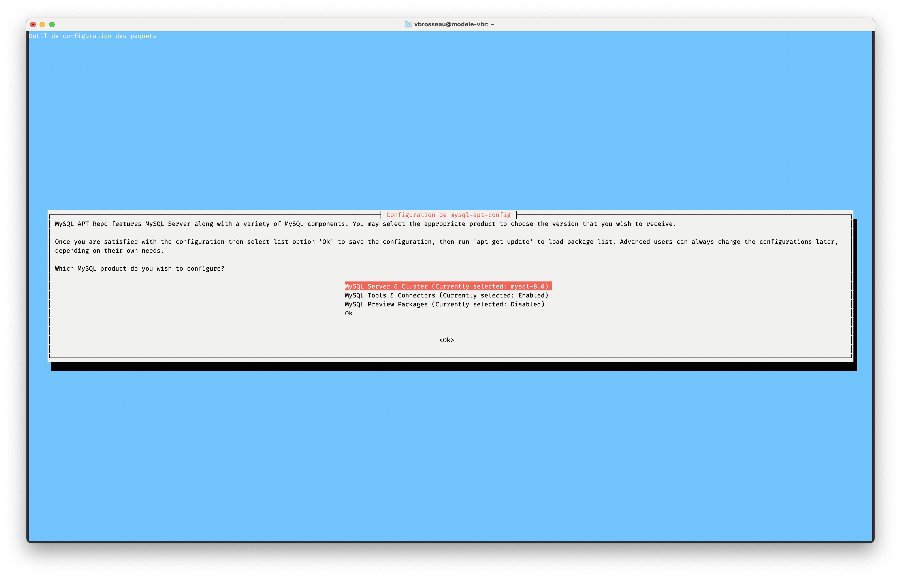
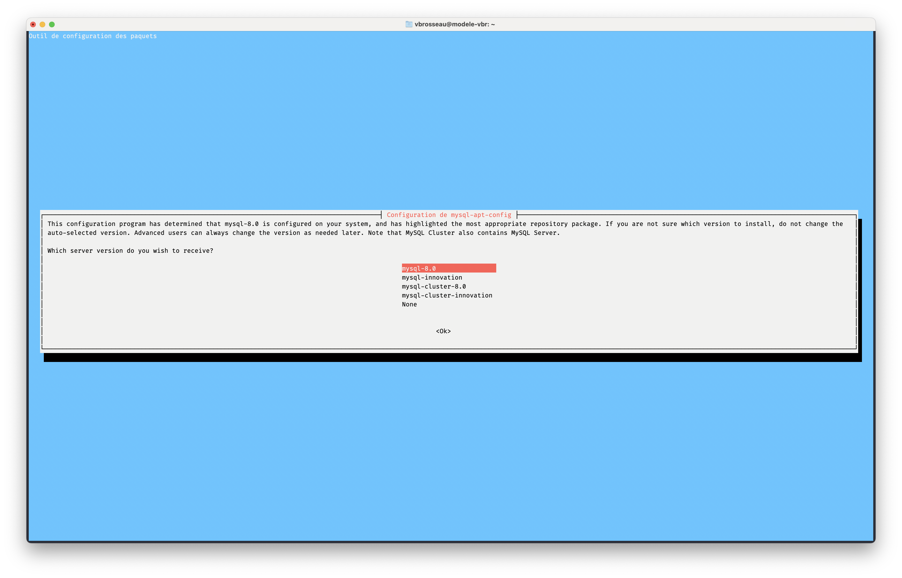
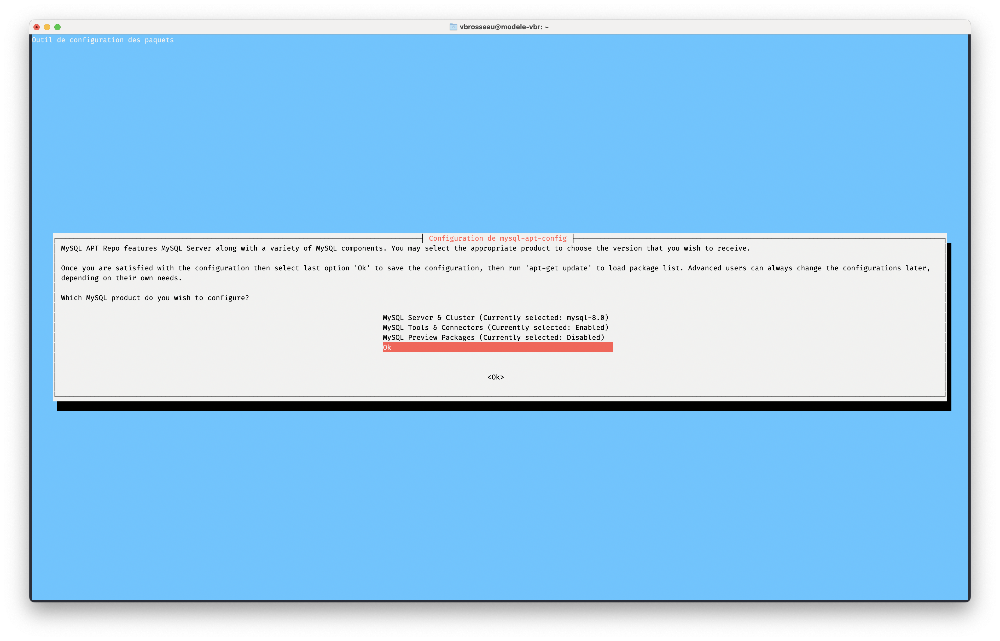
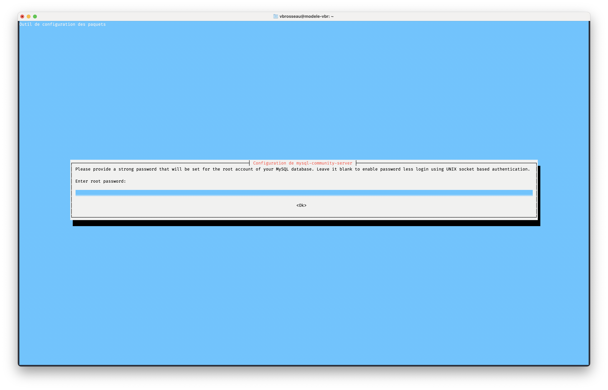
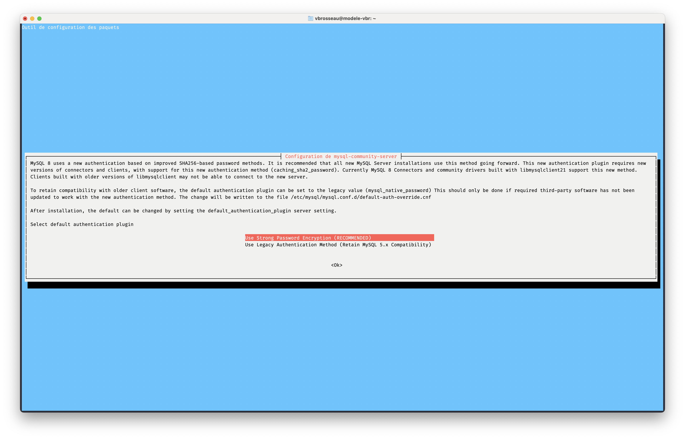

# TP3. Configurer un serveur de base de données

::: details Sommaire
[[toc]]
:::

## Pré-requis

Pour réaliser ce TP vous devez connaître les éléments suivants :

- [TP1. Créer une VM sur la ferme.](/tp/devops/serveur/tp1.md)
- [Aide mémoire Linux](/cheatsheets/serveur/linux-debian-based.md)
- [Configurateur réseau Debian](/cheatsheets/serveur/debian-reseau.md)

## Objectifs

Ce TP / TD a pour objectif de vous faire découvrir comment configurer un serveur de base de données (MySQL) pour qu'il soit utilisable par un serveur Web (Apache), mais également par une application client (C#, Java, PHP, etc.).

::: tip Application cliente ?

Une application cliente est une application qui se connecte à un serveur pour récupérer des données et les afficher à l'utilisateur. Le découpage entre serveur et client est une notion qui est très importante dans le développement d'applications.

En effet, cela permet de :

- Répartir les ressources entre plusieurs machines.
- Isoler les données de l'application.
- Sécuriser les données de l'application (accès à la base de données).

:::

Nous allons donc dans ce TP nous concentrer sur **la base de données** et uniquement sur celle-ci.

::: danger Machine type examen

Comprendre le découpage multimachine est un élément important pour le passage de l'examen. Il est donc important de bien comprendre ce que nous faisons dans ce TP.

:::

## Avant-propos : Les environnements

Rappel, en informatique, il est important de différencier les différents environnements :

- **Production** : C'est l'environnement qui est utilisé par les utilisateurs finaux. Il est donc important qu'il soit stable et sécurisé.
- **Test** / **Staging** : C'est l'environnement qui est utilisé pour tester les nouvelles fonctionnalités.
- **Développement** : C'est l'environnement qui est utilisé par les développeurs pour tester leur code.

Chaque environnement à un rôle bien précis, il convient donc de travailler différemment sur chacun d'eux.

- Votre machine est votre environnement de **développement**.
- La machine que nous allons créer aujourd'hui peut-être votre environnement distant de base de données (**test** ou **staging**).
- La machine sur laquelle vous allez déployer votre site web de l'AP sera votre environnement de **production**.

::: tip Gare au nommage
Nous allons créer dans ce TP / TD une machine qui pourra vous servir de base de données pour vos différents projets. Je vous invite donc à être vigilant sur le nommage de cette machine, pour que celle-ci soit un nom qui va permettre son identification.
:::

<center><iframe src="https://giphy.com/embed/si4P9VBMEIhq40i6tT" width="480" height="480" frameBorder="0" class="giphy-embed" allowFullScreen></iframe></center>

## La machine

Pour réaliser ce TP, je vous propose que l'on réfléchisse ensemble sur la machine que nous allons créer.

### Les besoins

Les besoins de cette machine sont les suivants :

- Elle doit être accessible uniquement depuis le réseau du lycée.
- Elle doit permettre de stocker plusieurs bases de données.
- Elle doit avoir un accès SSH sécurisé.
- Elle doit permettre de conserver vos bases de données pour les deux prochaines années.
- Elle doit être administrable à distance.

### Les choix

Voilà la liste des choix que nous allons devoir faire pour créer cette machine :

- Espace disque :
- Mémoire vive :
- Processeur :
- OS :
- Logiciels :

Avant de créer votre machine, je vous invite à réfléchir sur ces choix. Une fois votre réflexion terminée, nous allons débriefer ensemble.

::: details Une réponse possible

- Espace disque : 10 Go.
- Mémoire vive : 1 Go.
- Processeur : 1 vCPU.
- OS : Debian 13.
- Logiciels : MySQL / MariaDB, SSH, Apache, PHP.
- Accès SSH : Sans mot de passe, uniquement avec une clé SSH.
- Votre machine **ne doit pas avoir de d’interface graphique** (inutile pour un serveur).

Pourquoi cette configuration ? Apache et PHP sont installés, car, nous allons mettre sur votre serveur PHPMyAdmin. Si vous ne souhaitez pas installer PHPMyAdmin, vous pouvez supprimer Apache et PHP.

:::

## Création de la machine

Maintenant que notre besoin est défini, nous allons pouvoir créer notre machine.

::: tip Des points à vérifier

- Votre machine doit posséder une IP fixe (à générer via le configurateur réseau, en prenant soin de ne pas utiliser une IP déjà utilisée).
- Votre machine doit être à jour (`apt update && apt upgrade`).
- Votre machine doit avoir un accès SSH sécurisé (via échange de clé).

:::

::: danger Je veux une fiche serveur
Je vous rappelle que vous **devez** avoir une fiche serveur pour chaque machine que vous créez. Cette fiche doit être complète et doit contenir les informations de connexion à votre machine (les IP, Login, Mot de passe, etc.).
:::

### Création complète de la VM

Dans cette version, vous allez devoir créer la VM depuis le début. Vous avez plus d'options, mais vous devez réaliser l'installation du système d'exploitation.

- [Consulter la documentation](./tp1.md)

### Création de la VM via un modèle <Badge type="tip" text="Meilleure solution" vertical="top" />

Dans cette version, vous allez créer votre VM à partir d'un modèle. Le modèle contient déjà le système d'exploitation et les logiciels installés. Vous n'avez plus qu'à configurer la VM (réseau, utilisateur, etc.).

- [Consulter la documentation](./tp1alt.md)

## Configuration de la machine

Je vous laisse suivre le TP suivant pour configurer votre machine :

- [TP2. Avoir une machine Debian avec Apache + PHP](/tp/devops/serveur/tp2.md)
- **ou la synthèse de ce TP** : [Configurer une serveur Debian pour le Web](/cheatsheets/serveur/debian-web.md)

::: tip Question…

Levez les mains du clavier !

À votre avis, pour un serveur de base de données, est-ce que c'est utile d'avoir un serveur web ? Pourquoi ?

:::

::: details Vous souhaitez juste les commandes ?

Voici la procédure de création de la partie PHP + Apache :

```bash
apt update
apt install wget lsb-release apt-transport-https gnupg2 ca-certificates -y
wget -O /etc/apt/trusted.gpg.d/php.gpg https://packages.sury.org/php/apt.gpg
sh -c 'echo "deb https://packages.sury.org/php/ $(lsb_release -sc) main" > /etc/apt/sources.list.d/php.list'

# Installer Apache + PHP
apt update
apt install zip curl open-vm-tools apache2 php8.4 php8.4-fpm php8.4-cli php8.4-{bz2,curl,mbstring,intl,pdo,mysql,gd,xml} -y

# Activer PHP dans Apache
a2enmod proxy_fcgi setenvif rewrite headers
a2enconf php8.4-fpm

# Active  Apache
systemctl restart apache2
systemctl enable apache2

# Vérifier la version de PHP
php -v

# Affiche OK si le serveur web est accessible.
curl -s --head http://localhost:80 | grep "HTTP/1.[01] [23].." && echo "Le serveur écoute bien sur le port 80." || echo "Aucun serveur en écoute sur le port 80."
```

:::

## Configuration de la base de la machine

Si vous avez correctement suivi les TP précédents, vous devriez avoir une machine qui ressemble à ça :

- Logiciels installés : SSH, Apache, PHP, MySQL, vim.
- **VMWare Tools installé**. (`apt install open-vm-tools`).
- Accès SSH : Via échange de clé.
- Accès Web fonctionnel (via le port 80).

::: tip VMWare Tools
Les VMWare Tools sont des logiciels qui permettent d'optimiser l'utilisation de la machine virtuelle. Ils sont **très** importants pour la performance de votre machine, vous **devez** donc les installer (sinon Bruno ne vous aime plus).
:::

## La base de données

Notre machine est maintenant prête à accueillir le serveur de base de données. Nous avons plusieurs possibilités :

- MariaDB
- MySQL
- PostgreSQL

Dans ce TP vous allez avoir le choix (vous savez l'histoire dont vous êtes le héros). En fonction de vos besoins vous avez le choix entre :

- MariaDB : C'est un fork de MySQL, il est donc compatible avec MySQL. C'est un serveur de base de données très utilisé.
- MySQL : C'est un serveur de base de données très utilisé. Il est très performant et très stable.

Comment choisir ? MariaDB est de base dans Debian, il est plus simple à installer, cependant dans certains cas, vous aurez besoin de MySQL. C'est donc à vous de choisir.

## Installation de MariaDB

MariaDB est disponible dans les dépôts de Debian. MySQL et MariaDB sont deux serveurs de base de données avec des fonctionnalités similaires. MariaDB est un fork de MySQL, c'est-à-dire que c'est une version modifiée de MySQL.

::: details Procédure MariaDB

```bash
apt update
apt install mariadb-server mariadb-client -y
```

Pourquoi ces deux paquets ? `mariadb-server` est le serveur de base de données, et `mariadb-client` est le client de base de données. Le client est utilisé pour se connecter **localement** à la base de données.

- Pourquoi faire un update avant d'installer un paquet ?
- À quoi correspond le `-y` à la fin de la commande ?
- Selon vous, est-ce que votre serveur de base de données est démarré ? Si oui, comment le vérifier ?
- Que veux dire **localement** ?

### Configuration

Avant d'utiliser MariaDB, nous devons configurer le mot de passe de l'utilisateur `root`. Pour cela, vous pouvez utiliser la commande suivante :

```bash
mysql_secure_installation
```

Cette commande va vous demander de rentrer le mot de passe actuel de l'utilisateur `root`. Comme vous venez d'installer MariaDB.

- Qu'est-ce que `mysql_secure_installation` ?
- Pourquoi est-ce important de changer le mot de passe de l'utilisateur `root` ?
- Quel mot de passe avez-vous choisi ? Pourquoi ?

### Vérifier que MariaDB est installé

Pour vérifier que MariaDB est installé, vous pouvez utiliser la commande suivante :

```bash
mysql -u root -p
```

Cette commande va vous demander le mot de passe de l'utilisateur `root`. Si vous avez bien suivi les étapes précédentes, vous devriez être connecté à MariaDB.

### Autoriser les connexions distantes

La configuration se fait dans le fichier `/etc/mysql/mariadb.conf.d/50-server.cnf`.

```bash
nano /etc/mysql/mariadb.conf.d/50-server.cnf
```

Modifier la ligne `bind-address` par la ligne suivante dans la section `[mysqld]`.

```ini
bind-address = 0.0.0.0
```

Redémarrer le serveur MySQL

```bash
systemctl restart mysql
```

Comment lire cette configuration ?

- `bind-address` : c'est la variable qui permet de définir l'adresse IP sur laquelle MariaDB va écouter les connexions.
- `0.0.0.0` : Cette valeur signifie que MariaDB va écouter sur toutes les adresses IP disponibles sur le serveur.

:::

## Installation de MySQL

Parfois, il est utile d'avoir MySQL à la place de MariaDB. Même si MariaDB est un fork de MySQL (c'est-à-dire une version modifiée de MySQL), il est possible que vous ayez besoin de MySQL pour des raisons de compatibilité.

Bien qu'optionnelle, je vous propose de voir comment installer MySQL sur votre serveur.

::: danger Cette partie est optionnelle
Évidemment, si vous avez déjà installé MariaDB et que celui-ci vous convient, vous n'avez pas besoin de suivre cette partie.

👋 Vous ne pouvez pas avoir MySQL et MariaDB en même temps sur le même serveur.

:::

::: details Procédure MySQL

⚠️ Attention, nous allons désinstaller MariaDB pour installer MySQL. Si vous avez déjà des bases de données, je vous conseille de les sauvegarder avant de continuer.

```bash
apt remove --purge mariadb-server mariadb-client -y
```

Bien, nous n'avons plus MariaDB, nous pouvons maintenant installer MySQL. L'installation de MySQL est légèrement différente de celle de MariaDB. En effet, MySQL n'est pas disponible dans les dépôts de Debian, il faut donc ajouter un dépôt spécifique.

La première étape est d'ajouter le dépôt MySQL :

```bash
sudo apt update
sudo apt install gnupg -y
sudo wget https://dev.mysql.com/get/mysql-apt-config_0.8.29-1_all.deb
sudo dpkg -i mysql-apt-config_0.8.29-1_all.deb
```

Ce paquet va nous configurer les dépôts MySQL, voici les étapes à suivre :





Une fois que vous avez choisi la version de MySQL que vous souhaitez installer, vous pouvez valider votre choix via « ok ». Une fois revenu sur le terminal, vous pouvez installer MySQL :

```bash
sudo apt update
sudo apt install mysql-server -y
```

À cette étape, MySQL va vous demander de configurer le mot de passe de l'utilisateur `root`. Vous pouvez suivre les instructions pour configurer le mot de passe.




Vous pouvez maintenant activer et démarrer MySQL :

```bash
sudo systemctl start mysql
sudo systemctl enable mysql
```

Pour vérifier que MySQL est bien installé, vous pouvez utiliser la commande suivante :

```bash
mysql -u root -p
```

Et comme MariaDB, de base, MySQL n'autorise pas les connexions distantes. Pour autoriser les connexions distantes, vous pouvez suivre la procédure suivante :

```bash
sudo mysql -u root -p
```

```sql
CREATE USER 'root'@'%' IDENTIFIED BY '<votre-mot-de-passe>';
GRANT ALL PRIVILEGES ON *.* TO 'root'@'%' WITH GRANT OPTION;
FLUSH PRIVILEGES;
```

Avec ces requêtes, vous autorisez l'utilisateur `root` à se connecter depuis n'importe quelle adresse IP. Vous pouvez maintenant vous connecter à MySQL depuis n'importe quelle machine. N'oubliez pas de remplacer `<votre-mot-de-passe>` par le mot de passe que vous avez choisi.

:::

## Configurer PHPMyAdmin

Notre serveur de base de données est maintenant installé, mais nous n'avons pas d'interface graphique pour le gérer. Pour cela, nous allons installer PHPMyAdmin.

::: danger Un instant

Une base de données ≠ de PHPMyAdmin. PHPMyAdmin est un logiciel qui permet de gérer une base de données. Il est donc possible d'utiliser une base de données sans PHPMyAdmin. Des alternatives existent, en fonction de vos besoins, il n'est peut-être pas nécessaire d'installer Apache + PHP + PHPMyAdmin sur votre serveur de base de données.

Dans la suite du TP/TD nous allons voir comment administrer notre base de données **sans** PHPMyAdmin. Les alternatives sont les suivantes :

- Utiliser la ligne de commande (compliqué).
- Utiliser un logiciel tiers (comme HeidiSQL, DBeaver, etc.).
- Utiliser un équivalent de PHPMyAdmin (comme Adminer).
- Utiliser l'outil intégré à votre IDE (comme dans PHPStorm, VsCode, etc).

Quel que soit votre choix, vous devez être très vigilant dans votre vocabulaire pour ne **jamais mélanger** le terme de base de données et celui de PHPMyAdmin (**au risque de passer pour un débutant**).

:::

Avant d'aller plus loin, regardons ce que nous allons installer. PHPMyAdmin est un site web qui permet de gérer une base de données. Il est donc nécessaire d'avoir un serveur web (Apache) et un langage de programmation (PHP) pour pouvoir l'utiliser. Si vous avez suivi les étapes précédentes, vous devriez déjà avoir Apache et PHP installés.

### Installation de PHPMyAdmin

Pour installer phpMyAdmin, vous pouvez utiliser la commande suivante :

```bash
apt install unzip
cd /var/www/html
wget https://files.phpmyadmin.net/phpMyAdmin/5.2.1/phpMyAdmin-5.2.1-all-languages.zip
unzip phpMyAdmin-5.2.1-all-languages.zip
mv phpMyAdmin-5.2.1-all-languages phpmyadmin
rm phpMyAdmin-5.2.1-all-languages.zip
```

L'installation est le résultat de plusieurs commandes :

- `apt install unzip` : on installe le logiciel `unzip`. C'est un logiciel qui permet de décompresser des fichiers.
- `cd /var/www/html` : on se déplace dans le dossier `/var/www/html`.
- `wget …` : on télécharge le fichier `phpMyAdmin-5.2.1-all-languages.zip`. Depuis les serveurs de phpMyAdmin.
- `unzip …` : on décompresse le fichier `phpMyAdmin-5.2.1-all-languages.zip`.
- `mv …` : on renomme le dossier `phpMyAdmin-5.2.1-all-languages` en `phpmyadmin`. Car il est plus simple de taper `phpmyadmin` que `phpMyAdmin-5.2.0-all-languages`.
- `rm …` : on supprime le fichier `phpMyAdmin-5.2.1-all-languages.zip`. Car il n'est plus utile.

::: tip Arrêtons-nous un instant

- Pourquoi utilisons-nous la version du site web de phpMyAdmin ? Et pas la version du dépôt Debian ?
- À votre avis est-ce suffisant pour que phpMyAdmin fonctionne ?

:::

### Configuration de PHPMyAdmin

PHPMyAdmin est maintenant installé, il ne nécessite pas de configuration particulière. Il suffit de se rendre sur l'adresse suivante : `http://<adresse_ip>/phpmyadmin`.

::: tip Dans un prochain TP/TD
Dans le prochain TP nous allons (re)voir pour configurer Apache avec des VirtualHosts. L'objectif ? **Héberger plusieurs sites web sur un seul serveur**.
:::

## Autres logiciels pour gérer une base de données

Nous avons pour l'instant vu comment installer MariaDB et PHPMyAdmin. Mais il existe d'autres logiciels pour gérer une base de données. Nous allons voir ici comment installer ces logiciels. Pour que les autres logiciels fonctionnent, il vous faut un compte utilisateur avec les droits `%` et pour MariaDB, il faut que vous ayez autorisé les connexions distantes (voir plus haut).

::: warning Rappel sur les ports

Le port est un numéro qui permet de différencier les différents services qui tournent sur un serveur. Par exemple, le port 80 est utilisé par le serveur web Apache. Le port 22 est utilisé par le service SSH. Le port 3306 est utilisé par le service MariaDB. De base, le port 3306 n'écoute que les connexions locales. Pour que les autres logiciels puissent se connecter à MariaDB, il faut autoriser les connexions distantes.

🚨 **Point cyber**, VOUS NE DEVEZ JAMAIS OUVRIR LE PORT 3306 SUR INTERNET. VOUS DEVEZ LE LAISSER OUVERT UNIQUEMENT SUR VOTRE RÉSEAU LOCAL. 🚨

:::

### Connexion avec DBeaver

Maintenant que MariaDB est configuré pour accepter les connexions distantes, nous allons voir comment se connecter à MariaDB avec DBeaver.

Dbeaver est déjà installé sur votre machine. Vous pouvez le lancer via le menu démarrer.


Une fois DBeaver lancé, vous devriez pouvoir vous connecter à MariaDB en utilisant les informations suivantes :

- **Hôte** : `<adresse_ip>`
- **Port** : `3306`

### Les utilisateurs de base de données

Comme pour la partie serveur, il est vivement déconseillé (**comprendre ici, je ne veux jamais voir quelqu'un en root**), d'utiliser l'utilisateur `root` pour administrer sa base de données. Pour cela, nous allons créer un utilisateur `<votre-nom>` qui aura des droits limités sur la base de données.

Avant de continuer, réfléchissons ensemble à la raison pour laquelle nous ne devons pas utiliser l'utilisateur `root` pour administrer notre base de données.

::: details Réponse possible

- L'utilisateur `root` est un utilisateur très puissant. Il a accès à toutes les bases de données, et peut donc faire n'importe quoi.
- L'utilisateur `root` utilisé dans une application web est un gros risque de sécurité. Si quelqu'un parvient à se connecter à votre application web, il pourra faire n'importe quoi sur votre base de données.
- L'utilisateur `root` est l'utilisateur par défaut, c'est donc le premier utilisateur que les pirates vont essayer de pirater.

Je vous déconseille donc vivement d'utiliser le compte `root` pour quelques usages. Il est vivement conseillé d'utiliser un compte avec des droits limités, et idéalement, de créer un compte différent pour chaque application web.

:::

#### Avant-propos

La première étape est de créer l'utilisateur. Pour ça nous avons plusieurs possibilités :

- Soit nous utilisons la ligne de commande (`mysql` directement depuis le serveur).
- Soit nous utilisons `phpMyAdmin`.

::: tip il n'y a pas de bonne ou de mauvaise solution

- La ligne de commande est plus rapide, mais plus compliquée.
- PHPMyAdmin c'est plus simple, mais un peu plus long.

Utilisez la méthode qui vous convient le mieux.

:::

#### Via la ligne de commande

Pour créer un utilisateur, nous allons utiliser la commande `CREATE USER`. Cette commande prend en paramètre le nom de l'utilisateur, et son mot de passe. Pour créer l'utilisateur `<votre-nom>` avec le mot de passe de votre choix, nous allons utiliser la commande suivante :

```sql
# Création
CREATE USER '<votre-nom>'@'%' IDENTIFIED BY '<votre-mot-de-passe>';

# Les droits
GRANT ALL PRIVILEGES ON *.* TO '<votre-nom>'@'%' WITH GRANT OPTION;

# Rafraîchir les privilèges
FLUSH PRIVILEGES;
```

Un peu d'explication :

- le `%` signifie que l'utilisateur peut se connecter depuis n'importe quelle adresse IP.
- `*.*` signifie que l'utilisateur a tous les droits sur toutes les bases de données. (À votre avis, est-ce une bonne idée ?)
- `FLUSH PRIVILEGES` permet de rafraîchir les privilèges. C'est une commande qui est nécessaire pour que les modifications soient prises en compte.

#### Via PHPMyAdmin

Pour créer un utilisateur, nous allons utiliser l'onglet `Utilisateurs` de PHPMyAdmin. Pour cela, il faut se rendre sur l'adresse suivante : `http://<adresse_ip>/`.

#### Conclusion intermédiaire

Comme sur un serveur, comprendre que plusieurs utilisateurs sont nécessaires sur une base de données est très important. À l'avenir vous devez essayer de ne jamais utiliser l'utilisateur `root` pour vos applications. Je dirais même plus, si en stage ou dans une application web, vous êtes amené à utiliser l'utilisateur `root`, je vous conseille vivement de l'indiquer à votre tuteur. Il y a de fortes chances que votre tuteur vous demande de changer cela.

Avant de continuer le TP, je vous laisse valider que PHPMyAdmin fonctionne correctement en répondant à la problématique suivante :

### Problématique

L'entreprise BTS SIO, vous demande de numériser la gestion des absences de ses étudiants. Pour cela, vous devez créer une base de données qui contiendra les informations suivantes :

- Pour les étudiants : nom, prénom, classe, date de naissance, adresse, téléphone, email.
- Pour les absences : date, heure de début, heure de fin, motif, étudiant.

Chaque étudiant peut avoir plusieurs absences. Chaque absence est liée à un seul étudiant. Les étudiants sont répartis en 2 classes : **SIO1** et **SIO2**, et en deux niveaux : **SLAM** et **SISR**.

::: details Réponse possible (à ne regarder qu'en cas de blocage)

```sql
CREATE DATABASE gestion_absences;

USE gestion_absences;

CREATE TABLE classe (
  id_classe INT AUTO_INCREMENT PRIMARY KEY,
  nom_classe VARCHAR(250) NOT NULL
);

INSERT INTO classe (nom_classe) VALUES ('SIO1 SLAM'), ('SIO1 SISR'), ('SIO2 SLAM'), ('SIO2 SISR');

CREATE TABLE etudiant (
  id_etudiant INT AUTO_INCREMENT PRIMARY KEY,
  nom VARCHAR(50) NOT NULL,
  prenom VARCHAR(50) NOT NULL,
  id_classe INT NOT NULL,
  date_naissance DATE NOT NULL,
  adresse VARCHAR(255) NOT NULL,
  telephone VARCHAR(20) NOT NULL,
  email VARCHAR(100) NOT NULL,
  FOREIGN KEY (id_classe) REFERENCES classe(id_classe)
);

CREATE TABLE absence (
  id_absence INT AUTO_INCREMENT PRIMARY KEY,
  date_absence DATE NOT NULL,
  heure_debut TIME NOT NULL,
  heure_fin TIME NOT NULL,
  motif VARCHAR(255) NOT NULL,
  id_etudiant INT NOT NULL,
  FOREIGN KEY (id_etudiant) REFERENCES etudiant(id_etudiant)
);
```

:::

## Un virtual host pour PHPMyAdmin ?

Si vous souhaiter avoir un virtual host pour PHPMyAdmin, vous pouvez suivre les instructions suivantes :

⚠️ Cette partie est optionnelle. Si vous ne souhaitez pas avoir un virtual host pour PHPMyAdmin, vous pouvez passer à la partie suivante.

::: details Voir les instructions

### Créer un virtual host dédié à phpMyAdmin

Pour créer un virtual host, vous pouvez utiliser la commande suivante :

```bash
nano /etc/apache2/sites-available/phpmyadmin.conf
```

Cette commande va créer un fichier `phpmyadmin.conf` dans le dossier `/etc/apache2/sites-available`. Ce fichier va contenir la configuration de notre virtual host.

Ce fichier va contenir la configuration de notre virtual host. Vous pouvez copier-coller le code suivant :

```apache
<VirtualHost *:9090>
    ServerAdmin webmaster@localhost
    DocumentRoot /var/www/html/phpmyadmin

    <Directory /var/www/html/phpmyadmin>
        Options Indexes FollowSymLinks
        AllowOverride All
        Require all granted
    </Directory>

    ErrorLog ${APACHE_LOG_DIR}/error.log
    CustomLog ${APACHE_LOG_DIR}/access.log combined
</VirtualHost>
```

Pour activer le virtual host, vous pouvez utiliser la commande suivante :

```bash
a2ensite phpmyadmin
```

Cette commande va activer le virtual host `phpmyadmin.conf`. Vous pouvez maintenant redémarrer Apache pour que les modifications soient prises en compte :

```bash
systemctl restart apache2
```

:::

::: details Écouter le port 9090

Pour que le virtual host fonctionne, il faut que Apache écoute sur le port 9090. Pour cela, vous pouvez modifier le fichier `/etc/apache2/ports.conf` :

```apache
Listen 80
Listen 9090
```

Une fois les modifications effectuées, vous pouvez redémarrer Apache :

```bash
systemctl restart apache2
```

:::

## Conclusion

Dans ce TP, nous avons vu comment installer MariaDB et PHPMyAdmin. Nous avons aussi vu comment configurer MariaDB pour qu'il accepte les connexions distantes. Vous pouvez maintenant garder ce serveur pour vous entraîner à créer des bases de données et à les gérer.

[N'oubliez pas, vous avez une aide mémoire récapitulant les commandes vues dans ce TP](/cheatsheets/serveur/debian-web.md)

<center>
<iframe src="https://giphy.com/embed/fdyZ3qI0GVZC0" width="480" height="270" frameBorder="0" class="giphy-embed" allowFullScreen></iframe>
</center>
