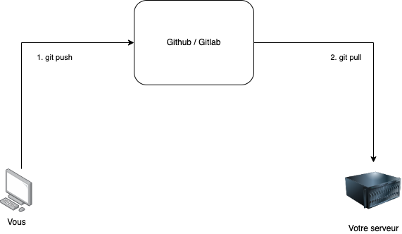
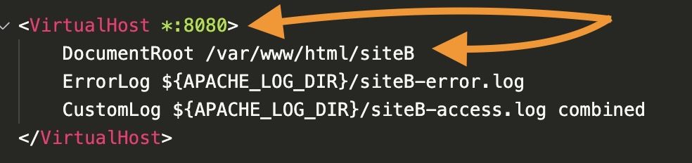

# TP4. Déployer (et redéployer) son code sur un serveur

::: details Sommaire
[[toc]]
:::

## Objectifs

Dans ce TP nous allons voir comment déployer (et redéployer) son code sur un serveur. Avoir un serveur c'est bien, mais pouvoir déployer son code dessus c'est mieux ! Nous allons donc voir quelles stratégies nous pouvons mettre en place pour déployer facilement notre code sur un serveur.

## Qu'est-ce qu'un déploiement ?

Un déploiement est le fait d'envoyer / déposer son code sur un serveur. Cela peut être un serveur de production, de test, de développement, etc. Le déploiement est une étape importante dans le développement d'une application. En effet, il permet de tester son code sur un serveur, et de le déployer sur un serveur de production.

Dans votre vie de développeur, vous allez devoir déployer à de nombreuses reprises votre code sur un serveur. C'est pourquoi il est important de bien comprendre comment cela fonctionne.

::: tip Déploiement automatisé ?

En entreprise, le déploiement est généralement automatisé. Cela permet de déployer son code sur un serveur de manière transparente, c'est ce que l'on appelle le **Continuous Deployment**. C'est un sujet très intéressant, mais qui dépasse le cadre de ce cours.

Nous traiterons de ce sujet plus en détail en 2ème année.

:::

## Les différentes stratégies de déploiement

Il existe plusieurs stratégies de déploiement :

- Déploiement via FTP.
- Déploiement via SSH (SFPT).
- Déploiement avec Git.

### Déploiement via FTP

Le déploiement via FTP est une stratégie de déploiement très simple. Elle consiste à envoyer son code sur un serveur via FTP. C'est une stratégie très simple, mais qui présente quelques inconvénients :

- Le code n'est pas versionné.
- Il n'est pas possible de revenir en arrière.
- Il n'est pas possible de déployer une version précise du code.

De plus, elle nécessite de mettre en place un serveur FTP sur le serveur, ce qui n'est pas forcément le cas.

### Déploiement via SSH (SFPT)

Le déploiement via SSH (autrement appelé SFTP) est une stratégie de déploiement également très répandue. Elle repose sur l'utilisation du serveur SSH déjà présent sur votre serveur. En effet, le serveur SSH permet de commande une machine à distance (via la ligne de commande). Mais le serveur SSH permet aussi de transférer des fichiers, c'est ce que l'on appelle le SFTP (Secure File Transfer Protocol). Cette stratégie présente des avantages par rapport à la stratégie FTP :

- La sécurité : le SFTP utilise le protocole SSH, ce qui permet de chiffrer les échanges.
- L'absence de service supplémentaire à installer sur le serveur.

Nous aborderons le SFTP plus en détail dans ce TP / TD.

### Déploiement avec Git

Utiliser Git pour déployer son code est également une stratégie intéressante. En effet, même si GIT n'est pas fait pour déployer son code, il est possible de détourner son fonctionnement pour déployer son code. Cette stratégie présente plusieurs avantages :

- Le code est versionné.
- Il est possible de revenir en arrière.
- Il est possible de déployer une version précise du code.

Pour déployer son code avec Git, il faut que vous utilisiez un serveur Git distant (GitHub, GitLab, Bitbucket, etc.). Ensuite, il faudra autoriser votre serveur à se connecter à votre serveur distant (via SSH). Enfin, il faudra configurer votre serveur pour qu'il puisse récupérer le code depuis votre serveur Git distant (`git clone`).

Nous pouvons résumer cette stratégie de déploiement avec le schéma suivant :



## Le contexte

Dans ce TP, nous allons déployer **deux** sites sur un serveur :

- Votre portfolio.
- Le code de votre AP.

Pour déployer ces deux sites, nous allons utiliser deux stratégies différentes :

- Le déploiement via SFTP pour le portfolio.
- Le déploiement avec Git pour l'AP.

## Configuration du serveur

Pour créer ce serveur, je vous propose d'utiliser un modèle existant ([Voir support](./tp1alt.md)).

Une fois votre serveur créé (et fonctionnel), vous devez pouvoir vous connecter à votre serveur via SSH. Pour cela, vous devez utiliser la commande suivante :

```bash
apt-get update
apt-get install wget lsb-release apt-transport-https gnupg2 ca-certificates -y
wget -O /etc/apt/trusted.gpg.d/php.gpg https://packages.sury.org/php/apt.gpg
sh -c 'echo "deb https://packages.sury.org/php/ $(lsb_release -sc) main" > /etc/apt/sources.list.d/php.list'

# Installer Apache + PHP
apt update
apt-get install curl open-vm-tools apache2 php8.2 php8.2-fpm php8.2-cli php8.2-{bz2,curl,mbstring,intl,pdo,mysql,gd} -y

# Activer PHP dans Apache
a2enmod proxy_fcgi setenvif rewrite
a2enconf php8.2-fpm

# Active  Apache
systemctl restart apache2
systemctl enable apache2

# Vérifier la version de PHP
php -v

# Affiche OK si le serveur web est accessible.
curl -s --head http://localhost:80 | grep "HTTP/1.[01] [23].." && echo "Le serveur écoute bien sur le port 80." || echo "Aucun serveur en écoute sur le port 80."
```

Votre serveur doit être accessible depuis votre navigateur. Pour cela, vous devez utiliser l'adresse IP de votre serveur.

## Les virtuals hosts

Vu que nous allons déployer deux sites sur un seul serveur, nous allons utiliser les **virtuals hosts**. Les virtuals hosts permettent de définir plusieurs sites sur un seul serveur. 

### Créer les dossiers

Nous allons créer deux dossiers dans `/var/www/html` :

```bash
mkdir /var/www/siteA
mkdir /var/www/siteB
```

### Créer les fichiers de configuration

Nous allons maintenant créer deux fichiers de configuration pour nos deux sites Web. Nous allons les créer dans le dossier `/etc/apache2/sites-available/`.

```bash
nano /etc/apache2/sites-available/siteA.conf
```

Dans ce fichier, nous allons mettre le code suivant :

```apache
<VirtualHost *:8080>
    DocumentRoot /var/www/siteA
    ErrorLog ${APACHE_LOG_DIR}/siteA-error.log
    CustomLog ${APACHE_LOG_DIR}/siteA-access.log combined
</VirtualHost>
```

Ensuite, nous allons créer le fichier de configuration pour le site B :

```bash
nano /etc/apache2/sites-available/siteB.conf
```

Dans ce fichier, nous allons mettre le code suivant :

```apache
<VirtualHost *:8181>
    DocumentRoot /var/www/siteB
    ErrorLog ${APACHE_LOG_DIR}/siteB-error.log
    CustomLog ${APACHE_LOG_DIR}/siteB-access.log combined
</VirtualHost>
```

::: tip qu'observez-vous ?

Ici les deux fichiers de configuration sont très similaires. La seule différence est le port sur lequel le site est accessible. Nous avons donc deux sites Web qui sont accessibles sur deux ports différents.



Vous pouvez voir que nous avons également configuré les logs d'Apache. Nous avons donc deux fichiers de logs différents pour chaque site Web. Cela nous permet de savoir quel site Web a généré une erreur.

:::

### Activer les sites Web

Nous avons créé deux fichiers de configuration, mais ils ne sont pas encore activés. Pour les activer, nous allons utiliser la commande `a2ensite` :

```bash
a2ensite siteA
a2ensite siteB
```

::: tip La commande ne fonctionne pas ?

Pour que la commande fonctionne vous devez être en `root` avec les variables d'environnement chargée :

```bash
su -
```

:::

### Écouter sur plusieurs ports

Par défaut, Apache écoute sur le port 80. Nous allons donc modifier la configuration d'Apache pour qu'il puisse écouter sur plusieurs ports.

Pour cela, nous allons modifier le fichier `/etc/apache2/ports.conf` :

```bash
nano /etc/apache2/ports.conf
```

Nous allons modifier la ligne suivante :

```apache
Listen 80
```

En :

```apache
Listen 80
Listen 8080
Listen 8888
```

::: tip ici nous avons

- `Listen 80` : le port par défaut d'Apache
- `Listen 8181` : le port sur lequel le site A est accessible
- `Listen 8080` : le port sur lequel le site B est accessible

Si nous voulions ajouter un quatrième site Web, nous aurions donc ajouté une ligne `Listen 8282` dans le fichier `ports.conf`. Ou tout autre port libre sur le serveur.

:::

### Redémarrer Apache

Nous avons modifié la configuration d'Apache, il faut donc redémarrer le service :

```bash
systemctl restart apache2
```

## Déployer le portfolio

Pour déployer votre portfolio, nous allons utiliser la stratégie de déploiement via SFTP. Pour cela, nous allons utiliser le logiciel FileZilla. FileZilla est un logiciel de transfert de fichiers qui permet de se connecter à un serveur distant via SFTP (entre autres).

FileZilla est déjà installé sur votre machine. Vous pouvez le lancer en tapant `filezilla` dans votre menu démarrer. Pour vous connecter, vous devez renseigner les informations suivantes :

- **Host** : l'adresse IP du serveur
- **Username** : votre nom d'utilisateur
- **Port** : 22 (le port SSH)

Et pas de mot de passe… Et oui, nous avons configuré le serveur pour ne pas demander de mot de passe. Pour vous connecter, vous devez utiliser une **clé SSH**. Pour ça vous devez :

- Édition > Paramètres > Connexion> SFTP > Ajouter un fichier de clé.


### Utiliser filezilla

FileZilla vous permet de vous connecter à votre serveur, il est très simple d'utilisation. Vous pouvez simplement glisser-déposer vos fichiers dans le dossier `/var/www/siteA` pour les envoyer sur le serveur.

Tout d'abord, vous devez vous connecter à votre serveur. Pour cela, vous devez renseigner les informations suivantes :

- **Host** : l'adresse IP du serveur
- **Username** : votre nom d'utilisateur
- **Port** : 22 (le port SSH)

Et pas de mot de passe… Et oui, nous avons configuré le serveur pour ne pas demander de mot de passe. Pour vous connecter, vous devez utiliser une **clé SSH**. Les informations sont à renseigner dans la barre de menu en haut :


Vous êtes maintenant connecté à votre serveur !

Je vous laisse envoyer votre code sur le serveur (dans le dossier `/var/www/siteA`).

Une fois que vous avez envoyé votre code, vous pouvez tester votre site en vous rendant sur l'adresse IP du serveur, sur le port 8080. Votre site doit être accessible.

## Déployer le code source de l'AP

J'aime beaucoup l'idée de travailler avec Git pour ce genre de situation. Vous pouvez créer un dépôt sur votre machine, et le cloner sur le serveur, puis continuer à travailler sur votre machine et puller les modifications régulièrement.

La procédure sera la suivante sur votre serveur :

- Installer Git : `apt install git`.
- Créer un dépôt sur votre machine et le partager sur Github / Gitlab.
- Cloner le dépôt sur le serveur : `git clone <url>`. (après avoir généré une clé SSH, et l'avoir ajoutée à votre compte Github / Gitlab [voir la procédure](/cheatsheets/ssh-key/README.md)).
- Travailler sur votre machine les pusher régulièrement
- Puller les modifications sur le serveur.

Voilà un exemple complet de procédure **SUR LE SERVEUR** :

```bash
# Installation de Git
apt install git

# Générer une clé SSH SUR LE SERVEUR
ssh-keygen

# Ajouter la clé SSH sur votre compte Github / Gitlab
cat ~/.ssh/id_rsa.pub # Va afficher la clé SSH dans le terminal pour que vous puissiez la copier / coller.

# Création d'un dossier pour le projet
mkdir /var/www/siteB
cd /var/www/siteB

# clone du dépôt de votre projet, le . à la fin est important, il permet de cloner le dépôt dans le dossier courant (ici /var/www/siteB)
git clone git@gitlab.com:c4software/votre-projet-deja-existant.git .

# Vous pouvez maintenant travailler sur votre machine
# et pusher les modifications régulièrement

# Pour puller les modifications
cd /var/www/siteA
git pull
```

::: tip faignant ?

Et vu que nous sommes faignants, voici un script pour gérer les mises à jour. Créez un fichier `update.sh` dans le dossier de votre choix (dans votre dossier personnel de votre serveur), et mettez-y le code suivant :

```bash
#!/bin/bash

cd /var/www/siteB
git pull
```

Vous pourrez lancer ce script avec la commande `./update.sh`. Attention, il faut que le script soit exécutable (`chmod +x update.sh`).

:::

Je vous laisse tester la procédure sur votre serveur en déployant le code source de votre AP (qui doit être sur Github / Gitlab). Je suis disponible pour vous aider si vous avez des difficultés.

### Automatiser le déploiement

Je vous laisse mettre en place une procédure de déploiement automatique sur votre serveur. Nous avons à notre disposition plusieurs outils pour cela :

- Le CRON (qui permet de lancer des scripts à des moments précis).
- L'intégration continue (qui permet de lancer des scripts à chaque push sur le dépôt).

Vous ne savez pas encore comment réaliser de l'intégration continue… par contre, vous savez déjà comment utiliser le CRON. Je vous laisse donc mettre en place une procédure de déploiement automatique sur votre serveur en utilisant le CRON.

Je souhaite que le code source de votre projet soit mis à jour une fois par heure du lundi au vendredi. Pour vous aider vous pouvez utiliser un outil comme [Crontab generator](https://crontab-generator.org/).

## Conclusion

Dans ce TP / TD, nous avons vu comment nous pouvons simplifier la gestion du déploiement de nos projets. Nous avons également déployé plusieurs sites Web sur un même serveur.

Ce TP est loin d'être exhaustif, mais il vous permettra de vous familiariser avec Apache et le PHP. Si vous souhaitez une synthèse (sans commentaire) de ce TP, vous pouvez consulter le fichier suivant : [Debian Web.](/cheatsheets/serveur/debian-web.md)

## Ressources

- [Apache](https://httpd.apache.org/)
- [PHP](https://www.php.net/)
- [FileZilla](https://filezilla-project.org/)
- [Git](https://git-scm.com/)
- [SSH](/cheatsheets/ssh-key/README.md)
- [Debian Web](/cheatsheets/serveur/debian-web.md)