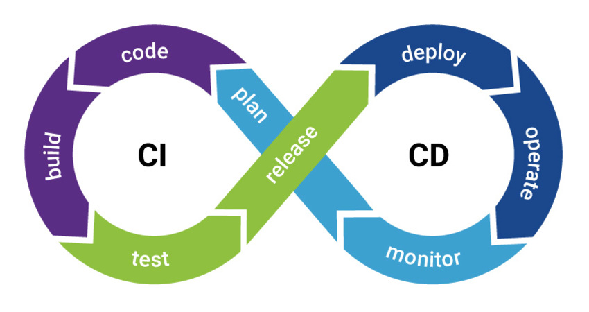

# Complément du cours Dev Ops

Ce document est un complément du cours. Il vous permettra de revenir sur les différentes notions avec différents exemples.

::: details Table des matières
[[toc]]
:::

## Introduction

Le terme « Full Stack » est un gros mot, il se cache derrière plein de définitions différentes. Nous allons voir un aspect de celui-ci dans ce document et dans nos échanges.

Nous allons découvrir comment vous allez pouvoir « Développer, Tester, Déployer » sans vous prendre la tête avec différentes technologies qui sont maintenant la base de tout bon développeur (Docker, l'intégration Continue, la JamaStack, les Function As A Service − FaaS −). L'idée étant qu'à la fin de ce document vous soyez capable de construire, maintenir, mais également comprendre la révolution « Cloud » autour du métier du développeur.

Nous allons donc voir comment le développeur seul sera capable de mettre en place une infrastructure d'exécution de son application ; cette infrastructure sera complètement automatisée pour « se recréer » / « se mettre à jour » en fonction des actions (commit) que vous ferez dans votre code source. J'ai utilisé le terme « commit », car oui, cette automatisation est possible en grande partie grâce à notre système de version de sources (par exemple, GIT).

Je vous propose de commencer notre pèlerinage par la découverte de Docker.

## Docker


### Introduction

Docker c'est « une petite révolution » ! Docker est une plateforme datant de 2013 permettant aux développeurs de déployer, mais également d'exécuter des applications avec **des conteneurs**. Docker permet de packager une application (ainsi que ses dépendances) dans un process isolé nommé conteneur. Ce conteneur peut ensuite être exécuté sur n'importe quelle machine (ARM, X86…), mais également sur n'importe quel système d'exploitation (Linux, Windows, macOS).

Docker est une technologie française, mais celle-ci est utilisée mondialement ; elle est devenue un standard en très peu de temps ce qui en fait un incontournable à connaitre pour vous développeur. Et vous allez le voir, celle-ci va vous faire gagner un temps fou !

::: tip Quelques chiffres autour de Docker

- 14 millions de « machines »
- 900 000 images Docker
- 12 milliards d’images téléchargées
- 3300 contributeurs au projet
  :::

Comme je disais cette technologie est au cœur de l'évolution du paysage informatique (IT)


Cette révolution consiste globalement à migrer les infrastructures locales (serveurs) vers « Le cloud » et ce pour plusieurs raisons :

- Migrer la puissance dans le Cloud
- Changement d’environnement/plateforme simplifié
- Pas de « Bloquage / Fermeture » d’un constructeur

::: tip Un instant !
Mais avant de continuer pour vous le cloud, c'est quoi ?
:::

Nous allons donc changer de paradigme, avant nous avions :

- Monolithique
- Mise à jour lente
- Gros serveurs

Et maintenant :

- Plein de petits services assemblés (externes et indépendants les uns des autres)
- Mise à jour rapide
- Petites machines, multitude de serveurs, etc.

**À votre avis** pourquoi nous migrons vers ce genre d'architecture ? Connaissez-vous le nom de ce genre d'organisation ?

::: warning Docker la solution ultime ?
L'objectif ici est de voir les avantages de Docker, mais comme tout en informatique Docker n'est pas la solution ultime ; Docker répond à un problème précis de découpage en container. C'est-à-dire en « petit conteneur » permettant de faire fonctionner votre application.

**Soyez critique, rester en veille.**
:::

### Les microservices

Et oui ! Le découpage actuelle / « la mode du moment », c'est de découper en microservices. C'est-à-dire de passer de :


Cette simplification est là pour répondre à plusieurs problématiques :

- Réduire la taille des applications (et donc leur temps de compilation, exemple Linux ~2h, Firefox 40min)
- L’application est centrale au fonctionnement.
- Adaptation au changement difficile.

Le découpage en microservices va donc nous permettre de répondre à l'ensemble des problématiques :

- Découper l’application en fonctionnalités indépendantes
- Rends l’application indépendante des autres
- Capable de « multiplier » l’application sur plein de serveurs pour absorber une hausse de la demande.
- Une conception qui rend l’application hautement disponible

::: tip CI / CD
Ce découpage permet également de rentrer dans un autre mouvement, celui de la **livraison en continu** / **déploiement en continu**. Nous reviendrons plus en détail sur ce point ultérieurement dans le cours.
:::

### Containers ou Machines virtuelles ?

Alors là vous allez me dire, non, mais je connais ce que tu nous racontes là !? Embarquez une application dans un truc transportable, quelle que soit la machine, je connais déjà ! C'est une machine virtuelle…

Alors oui vous avez raison… Il y a quelques années nous avions **une application == un serveur**, puis nous avons eu **un serveur => Un hyperviseur => Des machines**, mais nous allons voir qu'avec Docker plus d'hyperviseur nous avons « que notre applicatif dans un conteneur ».

Un serveur :


Un hyperviseur :


Les machines virtuelles vous connaissez déjà, et vous savez que le but c'est de mutualiser la puissance du serveur pour y mettre **plusieurs machines** / **systèmes d'exploitation entiers**. Mais cette organisation à des limites :

- Des ressources allouées pour chaque machine (CPU, Disque, Ram)
- Un OS complet sur chaque machine (virtuelle)
- Plus il y a de machines plus il faut de puissance (ressources perdues)
- Ressources perdues par… des parties de l’OS virtualisées pour rien (les crons, mais également les I/O).

Le conteneur va donc répondre à une problématique, éviter la multiplication des petites ressources perdue, le conteneur c'est donc :

- Un moyen standardiser de packager l’application
- Un moyen d’isoler les applications entres elles
- Un partage du noyau avec la machine physique

**Les conteneurs**


**VM vs Conteneur :**


::: tip, Mais est-ce la fin des VM ?
Bien évidemment non, les VM sont là pour rester, elles sont une vraie réponse sur la mutualisation des machines ; mais également une vraie sécurité entre les machines. En effet, l'hyperviseur est là pour nous garantir au maximum la séparation des processus entre « **Les VM** » et la machine physique.

D'ailleurs il est complètement possible de faire :


:::

### Pour résumer Docker c’est :

- Un projet open source, qui a pour but d’automatiser le déploiement d’applications dans un « container »
- Le container une sorte « d’archive » qui contient tout ce qu’il faut pour faire fonctionner un logiciel : Code, Librairies pour l’exécution, outils système, et librairies système. (autonome)
- Ça garantit que le code fonctionnera toujours de la même façon, quel que soit l’environnement.


Avec docker pas « d'hyperviseur », nous avons un morceau aux milieux qui s'appelle le « Docker Engine », il repose sur les technologies du noyau Linux, il est donc plus lège qu'un Hyperviseur entier (comme VMWare ou Dropbox) il aura en charge la gestion de :

- La sécurité
- Le réseau
- Les volumes
- L’orchestration


Comme j'indiquai en introduction, l'angine de Docker est multiplateforme, il fonctionne donc sans problème sur :

- Linux
- Windows
- macOS

Mais également quelques soit l'architecture de l'ordinateur :

- Un raspberry Pi
- Un processeur Intel
- Un processeur AMD
- Un M1 de Apple

Docker **vous assure** que votre application tournera de la même façon quelques soit là ou vous souhaiter la faire fonctionner.

### Créer des machines simplement

L'objectif de Docker c'est la simplicité, vous allez le voir après seulement 2 ou 3 machines vous aurez compris la base du fonctionnement, et vous serez pleinement capable de vous en servir pour plein de petites problématiques (c'est très certainement la raison de son succès).

Avant d'aller plus loin, je vous propose de faire un point terminologie :

- **Image** Les fichiers, le contenu de votre « système »
- **Container** L’image quand elle est en fonctionnement.
- **Engine** Ce qui fait fonctionner votre « container ». Les volumes et le réseau font partie de « l’engine ».
- **Registry** Entrepôt d’image à télécharger (fourni par d’autres, ou construite par vous). https://hub.docker.com/
- **Volume**, les « montages » / ressources, emplacement (réseau ou non) disponible dans votre Container.

#### Registry

- Docker Hub
- Communautaire
- Images certifiées
- Énormément d’images (vraiment, vraiment beaucoup)

#### Les Images

C’est une sorte de « template », les images sont en lecture seule. Enfin pas vraiment en lecture seule, elles ont un état qui sera **remis à zéro à chaque lancement de votre container**. Il faut les voir comme les données de base de votre application.

Exemple: Ubuntu avec un Apache et GLPI déjà installés.

- Une façon simple de distribuer vos applications
- Pas de risque d’oubli de dépendances lors de l’installation (un environnement maitrisé)
- Fonctionnement isolé, tests simplifiés de nouvelles librairies, ou de dépendances

### La ligne de commande

Docker c'est principalement une « interface » avec laquelle nous devons communiquer en ligne de commande. Il n'y a pas beaucoup de commandes à retenir et celle-ci est logique. Quoi qu’il en soit je vous ai résumé l'ensemble dans [le document ici](/cheatsheets/docker/).

Mais pour résumer, voilà les éléments importants :

- Démarre l’image ubuntu:latest
- `--rm` Supprime le container avant de le relancer.
- Déclare le port `80` du conteneur sur le port 3000 de votre machine.
- Monte le dossier courant dans le dossier `/data` du conteneur
- Note: Sur Windows vous devez remplacer `-v ${PWD}:/data` par `-v "C:\Data":/data`

```sh
# *nix
docker run --rm --name monConteneur -it -p 3000:80 -v ${PWD}:/data ubuntu:latest

# Windows
docker run --rm --name monConteneur -it -p 3000:80 -v %cd%:/data ubuntu:latest
```

## Quelques paramètres de la ligne de commande

| Paramètre                        | action                                                                                  |
| :------------------------------- | :-------------------------------------------------------------------------------------- |
| -p portLocal:portContainer       | Permets de rendre visible un port dans le container sur votre machine (ex. -p 8080:80)  |
| -v dossierLocal:dossierContainer | permet d'exposer un dossier local à l'intérieur du container (ex -v ./vosSource:/data) |

### Les volumes

Comme je disais en introduction, les Containers sont stateless ; ça veut dire qu'ils sont **remis à zéro** à chaque lancement, nous allons donc devoir mettre en place un volume entre celui-ci et votre machine, un volume c'est :

- Un dossier « partagé » entre votre machine et le container
- Une sorte de point de montage
- Persistant, les données sont modifiées en temps réel et sont sauvegardées

### Quelques cas d'usage

#### Postgres

```sh
docker run -p 5432:5432 --name pgServer -e POSTGRES_USER=monUser -e POSTGRES_PASSWORD=monPassword -d postgres
```

---

#### Wordpress

- Image officielle
- Créer un Blog Wordpress en 2 minutes

---

#### Tomcat

- Plusieurs versions en parallèle
- Plusieurs versions de Java

---

#### PHP

- Plusieurs versions en parallèle
- Tester simplement son code sur d’autres versions de PHP (5, 7, 8, …)

### Mettre en pratique

Je vous propose de mettre en pratique ce que nous avons vu de manière théorique. [La suite dans le TP suivant](/tp/docker/introduction.md) puis [dans le suivant](/tp/docker/creer_server_local.md)

### Le DockerFile

Nous avons lancé des Containeurs qui repose sur des images, mais pour l'instant nous n'avons rien écrit « rien packagé ». La force de Docker c'est que tout le monde peut créer des images docker pour distribuer des applications, bien évidement il est possible de distribuer les applications sur le DockerHub, mais **rien d'obligatoire**, vous êtes en entreprise votre code est privée vous pouvez très bien créer votre image uniquement sur votre machine.

::: tip Vous pouvez également utiliser un Registry privé
Mais si vous le souhaitez, vous pouvez utiliser un Hub privé ; Gitlab par exemple, en propose un gratuitement pour vos projets. D'ailleurs avec le CI/CD il sera possible de Builder et de sauvegarder l'image Docker résultat directement dans le Registry interne à Gitlab.

[Plus d'informations ici](https://docs.gitlab.com/ee/user/packages/container_registry/)
:::

Le DockerFile va donc être un fichier qui va déterminer la structure de votre image, vous allez définir :

- L'image de base
- Les dépendances nécessaires à votre application pour fonctionner (au sens Linux, exemple PHP X, GD pour les images …).
- Les paramètres de votre système embarqué dans l'image.
- Le port exposé, etc.
- Le « point d'entrée »

Concrètement c'est :

- Utilisé par Docker pour créer des containers à partir de la définition, le fichier « Dockerfile »
- C’est un fichier texte, qui contient toutes les commandes que l’utilisateur va faire pour assembler l’image
- Construit via la commande « docker build »

Voilà à quoi ça va ressembler, dans un fichier nommé `Dockerfile`

```dockerfile
FROM ubuntu:latest
MAINTAINER Valentin Brosseau

RUN apt-get update
RUN apt-get install -y python python-pip wget
RUN pip install Flask

ADD hello.py /home/hello.py

WORKDIR /home
```

Vous avez défini le squelette de votre application, si vous souhaitez créer l'image associée vous allez devoir lancer :

```sh
docker build -t "flask:demo" .
```

Et pour la lancer ?

```sh
docker run -p 5000:5000 flask:demo python hello.py
```

### Le Docker Compose

Nous avons utilisé des images, nous avons également créé nos propres images. Mais si vous avez suivi, vous avez dû remarquer un problème ! Nos images ne contiennent **que notre application** pas l'ensemble des briques qui font « notre service ». Par exemple dans le cas d'un serveur PHP nous avons :

- Le PHP
- La base de données
- Le FTP
- …

Dans le monde de Docker, c'est ce que nous appellerons l'orchestration.

<center><iframe src="https://giphy.com/embed/KYGDZKRWdBnFe" width="480" height="360" frameBorder="0" class="giphy-embed" allowFullScreen></iframe>
</center>

L'orchestration, ça va être le fait de construire une « stack » applicative entière avec l'intégralité des serveurs nécessaires au bon fonctionnement de notre application (exemple PHP, BDD, FTP). Dans le monde de Docker, nous avons un outil qui permet de construire ça. Le `Docker Compose` permet de composer une stack ou une infrastructure complète de conteneurs ; il permet de simplifier la création, l'interconnexion et la multiplication de conteneurs.

[C'est un outil officiel fourni directement et maintenu par la société Docker](https://docs.docker.com/compose/) il repose sur **un seul fichier** le `docker-compose.yml`, celui-ci énumèrera l'ensemble de votre infrastructure, les volumes, les ports, les images, etc. Bref tout ce que vous pouvez faire avec la ligne de commande vous aller être capable de le définir dans un fichier `docker-compose.yml`.

Voilà un exemple très simple :

```yml
version: "3"
services:
  reverse-proxy:
    restart: unless-stopped
    network_mode: host
    image: nginx
    volumes:
      - ../.acme.sh/:/,etc/letsencrypt/
      - ./nginx.conf:/,etc/nginx/nginx.conf
```

Une fois créée vous pourrez lancer votre infra via :

```sh
# Lancement sans rendre la main
docker-compose up

# Lancement en passant la stack en arrière plan
docker-compose up -d
```

La force de Docker Compose c'est :

- Autonome (car prête à être « mise en place » partout, quelle que soit la plateforme cible).
- Préparamètre (tout est dans le fichier docker-compose.yml).
- Isolé (tous les services ne sont pas forcément accessibles du public, mais sont accessibles par vos autres applications).
- Administrable simplement grâce au cli (docker-compose up/down/start/stop)

::: danger L'astuce du chef !
Nous avons vu précédemment qu'il était possible de builder nos propres images avec Docker. Quand nous utilisons docker compose cette option **sera bien évidemment encore disponible**.
:::

La meilleure façon de voir comment fonctionne l'orchestration c'est de la pratiquer. [Je vous ai préparé un TP ici](https://cours.brosseau.ovh/tp/docker/docker_compose.html)

### Les alternatives

Quand je présente une solution, j'aime bien parler des alternatives. Vous vous doutez bien que Docker n'est pas la seule solution de container disponible sur le marché voilà une liste non exhaustive de « conccurent » :

- containerd
- podman
- LXC
- Kubernetes (non, mais parlons-en d'ailleurs)

::: tip Docker ou Kubernetes ?
Différence fondamentale entre Kubernetes et Docker : Kubernetes est conçu pour s’exécuter sur un cluster, tandis que Docker s’exécute sur un nœud unique. Kubernetes est plus complet que Docker Swarm et est conçu pour coordonner des clusters de nœuds à grande échelle en production, efficacement. Les pods Kubernetes (unités de planification contenant un ou plusieurs conteneurs dans l’écosystème Kubernetes) sont répartis entre les nœuds pour offrir une haute disponibilité.
:::

### Une stack complète sur un Raspberry Pi

Nous l'avons vu dans les différents exemples précédents, Docker est un vrai petit bijou pour la conception du « stack » applicative. C'est en partant de cette constatation que j'ai décidé de créer moi-même une « Stack » permettant de créer un serveur d'évaluation / de développement personnel basé sur du matériel « pas cher » à savoir un Raspberry Pi.

Une solution qui dans mon cas ressemble à :

|  |  |
| ------------------------------------- | ------------------------------------- |

[Lire la suite](../rpi/web-stack.md)

## CI / CD



### Introduction

Voilà un gros mot que vous avez très certainement vu / croisé lors de votre veille sur les technologies qui feront de vous un développeur complet. Le CI/CD c'est la capacité que vous allez avoir d'automatiser :

- Les tests.
- Les déploiements / livraison.
- Mesurer la qualité de votre code.

Cette automatisation ne sera pas faite à n'importe quel moment ? Elle sera faite en **continue…** Et c'est bien là la force du CI / CD. Il faut voir le CI/CD comme une boite à outils qui vous permettra de dormir tranquille.


### CI (Intégration continue)

Le premier point du CI/CD c'est le CI ; CI signifie « Continous Integration » en français Intégration Continu, c'est la mécanique qui vous permettra de vous assurer de la qualité de votre application au travers d'indicateurs. Si je dois résumer le CI avant de le détailler, je dirais :

- Validation en continu
- Régulièrement
- Workflow GIT
- Automatique

L'idée est donc comme je le disais en introduction de répéter un certain nombre d'automatisations à chaque **push** dans votre système de version. Ces actions **doivent être** répétables à l'infini, quelles que soient les évolutions dans votre application, par exemple :

- Dans une image PHP
- Installer votre application
- Lancer l'installation des dépendances nécessaire au bon fonctionnement.
- Lancer les tests

::: danger L'échec est une possibilité
L'important ici, c'est de voir qu'il est possible que votre suite d'actions échoue. Nous ne devons donc jamais rendre les erreurs silencieuses.

L'important dans l'échec, c'est de comprendre la raison afin de la corriger avant que celle-ci ne se retrouve en production.
:::

Le CI c'est également un ensemble d'indicateurs nous permettant de valider que notre application est **de bonne qualité** via les résultats des tests, mais également avec le Lint ou l'analyse statique du code.

### CD (Déploiement continu / Livraison continue)

Le second point dans le CI/CD, c'est le CD ; CD signifie « Continous Delivery », en Français livraison continue. Il faut bien distinguer deux opérations différentes dans le CD, nous avons la livraison et le Déploiement ; cette nuance est importante je reviendrai dessus ultérieurement. L'objectif du CD c'est :

- Si l'ensemble du CI est « OK »
- Mise en ligne « régulière »
  - Prod
  - Staging

Nous avons deux options dans le CD, La Livraison et le Déploiement fondamentalement les deux répondent à la même problématique, automatiser les tâches pour vous simplifier la vie et automatiser la mise à disposition de votre application à vos utilisateurs, le **plus souvent possibles** en vous assurant en permanence de la qualité de ce que vous livrez :

- Automatiser au maximum (Code, Configuration, Environement …)
  - Dev / Staging / Review
  - Prod
- S'assure de la qualité
- Versionne la livraison (suivi, archivage, rollback)

- Le déploiement en continu, est la finalité ultime elle consiste à mettre en ligne en continu votre applicatif sans intervention de votre part.
- La livraison en continu est une étape intermédiaire, elle consiste à faire construire en automatique le livrable de votre application via un enchainement de scripts tournant dans un environnement distant.


#### La clé « L'automatisation »

Votre CI/CD repose donc sur une brique logicielle (Cloud ou local) permettant l’automatisation de tâches :

- Compilation
- Tests unitaires et fonctionnels
- Tests de performance…

À chaque `push`, Le CI/CD va exécuter une des tâches et produire des résultats (résultat de tests, artifacts, …), que le développeur / chef de projet / testeur peut par la suite visualiser ou télécharger.

#### Les prérequis

- Versionning du code.
- Commits régulier.
- Application « testable ».

#### Les tests

Vous l'avez compris, le CI/CD repose sur **les tests**. Vous avez vu précédemment que les tests c'est très important… Mais comme beaucoup vous ne voyez pas vraiment pourquoi c'est important ! Et c'est bien normal, vous écrivez des tests, mais vous avez certainement appris à les lancer **uniquement** sur votre ordinateur. Et je suis bien d'accord à se compte là… l'intérêt est plutôt limité.

Quand nous mettons en place un CI/CD nous allons rendre les tests visibles / utiles / intéressants en effet ils vont être lancé à chaque modification du code sources. Et ils vont vous assurer que la qualité de celui-ci n'est pas détériorée par une modification récente.

- Simplification de leurs exécutions
- Aussi simple qu'en « Local »
- Libère du temps

Libère du temps ? Et oui ! Nous n'allons plus perdre du temps « j'attends que les tests passent » non non. Nous allons demander à un serveur distant de le faire à notre place, et une fois terminée ils nous préviendra du résultat… Voire mieux si le CD est en place il livrera en automatique votre application sur le(s) serveurs.

Mais bien évidemment, il n'y a pas que le test dans la vie nous pourrons également :

- Vérifier le Lint
- Analyse statique
- Couverture du code
- Qualité du code
- Sécurité du code

<center><iframe src="https://giphy.com/embed/chES7uKgwnloDZeS03" width="480" height="480" frameBorder="0" class="giphy-embed" allowFullScreen></iframe></center>

::: tip Tester quoi ?


Nous pouvons tout tester avec le CI, mais à votre avis qu'allons-nous tester?
:::

#### Les indicateurs

Je vous parlais d'indicateur au début, les indicateurs de réussite sont multiples, nous aurons bien évidemment :

- Le résultat « vert de chaque test ».
- Le Lint (analyse statique du code).
- L'analyse statique de l'ensemble du code source avec par exemple SonarQube


#### Les artefacts

Je vous parlais du livrable en introduction. Dans le monde de l'intégration, le livrable nous appellerons ça un « artifacts », c'est le résultat de cette automatisation de tâches. Il est le résultat du « Test & Build » cette opération sur ce que nous avons vu précédemment :

- Docker pour isoler et être capable de répéter de manière stateless l'opération.
- Répétable (à l'identique, quelques soit la modification).
- Multidéveloppeur (identique pour tous les membres de l'équipe).


L'artéfact est donc :

- Toujours présent
- Centralisé (sur le serveur de CI/CD)
- Nommage cohérent (oui, car il repose sur **le commit** associés)

Et pourquoi c'est très très intéressant ?

- Réduction du risque d'erreurs
- Automatisation (plus d'humain)
- La sécurité

::: tip La sécurité ?
À votre avis ? Pourquoi automatiser sur un serveur distant la création du livrable est intéressant en termes de sécurité ?
:::

## Gitlab CI

Et c'est ici que rentre en jeu les solutions cloud de CI/CD. Comme tout dans les outils, il y a plusieurs solutions répondant aux mêmes problèmes. J'ai décidé de vous parler de Gitlab-CI, car il est gratuit et intégré de base dans Gitlab aucun compte supplémentaire de requis ! Et surtout il est très puissant… Car il repose sur **Docker**, et vous l'avez compris maintenant ça veut dire que nous serons capables de tout faire.


Les fondations de Gitlab-CI sont :

- Intégré dans le développement
- Simplifie le test
- Amélioration continue

::: tip Amélioration continue ?
Je ne suis pas dupe, je suis comme vous… Parfois je code à l'arrache ! Le CI/CD n'est pas là pour vous faire la morale. Nous l'avons vu avec SonarQube l'idée n'est pas de vous punir de la mauvaise qualité de votre développement ; l'idée est plutôt de vous faire progresser petit à petit en testant / analysant seulement les parties modifiées de votre code.

Pourquoi est-ce important ? Tout simplement pour voir au fur et à mesure pourquoi les règles sont importantes.
:::

Et l'objectif est :

- Tester souvent, tester tout le temps
- Simplification de la livraison
- Automatisation de la livraison
- Déploiement plus fréquent

::: danger évidemment il y a des alternatives
Je vous entends déjà, non, mais moi je n’utilise pas Gitlab, mais Github… Évidemment il y a des alternatives des options pour faire plaisir à tous. [Vous avez ici une liste complète à jour des alternatives disponibles](https://github.com/ligurio/awesome-ci)
:::

### Gitlab-ci.yml

L'ensemble de la configuration de Gitlab-CI est dans un seul fichier, le `gitlab-ci.yml`, ce fichier va définir l'ensemble des règles qui serviront à valider le bon fonctionnement de votre application. Voilà un exemple :

```yml
image: node:4.2.2

before_script:
  - npm install

cache:
  paths:
    - node_modules/

stages:
  - test

test_async:
  stage: test
  script:
    - node ./specs/start.js ./specs/async.spec.js

test_db:
  stage: test
  services:
    - postgres:9.5.0
  script:
    - node ./specs/start.js ./specs/db-postgres.spec.js
```

### Gitlab Pages

Le meilleur moyen pour mettre en place un CI/CD ces le déploiement « en automatique » d'un petit site web statique.

[La suite ici](/tp/ci/pages.md)

### Tester en continu

Vous l'avez vu dans l'exemple Gitlab-Pages il n'y avait pas de tests autre que ceux « de base » qui sont :

- L'installation
- Le Lint fait sur votre code source lors du build.

Ici, je vous propose d'aller plus loin c'est-à-dire de mettre en place des tests qui seront exécutés à chaque push.

[La suite ici](/tp/ci/ci-test/tests.md)

### Compilation d'application

Les sites web c'est une problématique simple… Le CI/CD nous permet d'aller plus loin beaucoup beaucoup plus loin ! Nous allons utiliser le CI/CD pour builder une application mobile.

Le tout sans intervention de votre part. Avant de continuer, appelez-moi, je vais vous illustrer avec des cas concrets via un outil nommé Bitrise-CI.

[Mettre en place une compilation d'application avec Gitlab-CI](/tp/ci/ci-hybride.md)

## Netlify

Netlify est une solution simple qui vous permettra d'héberger / déployer / automatiser la mise à disposition de votre site Internet. Ici nous ne parlons pas de site « classique » comme un WordPress, mais de site qui repose sur la Jamstack.

### La JamStack ?

La jamstack c'est une nouvelle façon de voir la conception de site Internet, cette nouvelle façon de faire va nous permettre de réduire les couts d'hébergements / et bénéficier de l'avantage du Cloud (CI/CD, compression des assets, FAAS…)

Plein de mots qui font peur, mais ne vous inquiétez pas… C'est beaucoup plus simple qu'il n'y parait. Ici pas de PHP pour générer vos pages nous allons tout concevoir en HTML / JavaScript (VanillaJS, React, Vue, …) / CSS


### Déployer un site automatiquement

Ici pas de blabla, Netlify est une solution pensée pour être simple ; je vous propose donc de directement mettre en application via [le TP suivant](/tp/ci/jamstack/netlify.md)

### FaaS

Function As A Service, c'est le truc qui va fous faire passer dans une autre dimension. L'idée étant la suivante :

Le FaaS ou Function-as-a-Service est un type de service cloud permettant de déployer une fonction unique de logiciel en serverless. Découvrez tout ce que vous devez savoir à ce sujet.

Le développement et le lancement d’une application peuvent être très difficiles. Il est nécessaire d’installer des serveurs, et de les maintenir au fil du temps. Ceci peut s’avérer pénible et couteux. Heureusement, le Cloud Computing offre une alternative au travers du FaaS.

Source: https://www.lebigdata.fr/

Le FaaS est donc en quelques sortes la finalité de tout ce que nous avons vu ! Il s'agit de découper votre code en petit morceau qui sera packagé dans des conteneurs et lancer à la demande « quand les utilisateurs auront besoin de la fonctionnalité ». Le but ?

- Réduire les couts (les serveurs sont arrêtés très souvent).
- Réduire l'empreinte carbone des applications.
- Découper pour livrer souvent les modifications.

Il y a beaucoup de fournisseurs de FaaS :

- Amazon avec Lambda.
- Google avec Firebase Function.
- Google avec Cloud Run (lancement d'image Docker à la demande)
- OpenFaas solution libre similaire aux précédentes.

<iframe width="560" height="315" src="https://www.youtube-nocookie.com/embed/eOBq__h4OJ4" title="YouTube video player" frameborder="0" allow="accelerometer; autoplay; clipboard-write; encrypted-media; gyroscope; picture-in-picture" allowfullscreen></iframe>

<iframe width="560" height="315" src="https://www.youtube-nocookie.com/embed/vr0Gfvp5v1A" title="YouTube video player" frameborder="0" allow="accelerometer; autoplay; clipboard-write; encrypted-media; gyroscope; picture-in-picture" allowfullscreen></iframe>

Pour simplifier nos tests, nous allons nous concentrer sur la dernière solution OpenFaas, car elle nous permettra sans dépenser d'argent de tester la puissance du FaaS

- [Installation d'OpenFaas](/tp/openfaas/openfaas-quicky-installation.md)
- [Installation d'OpenFaas sur un Raspberry Pi](/tp/openfaas/openfaas-quicky-installation-pi.md)
- [Écrire du code pour OpenFaas](/tp/openfaas/openfaas-quicky-create-faas.md)
