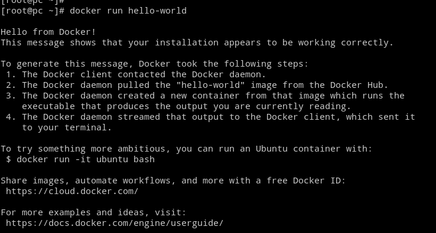
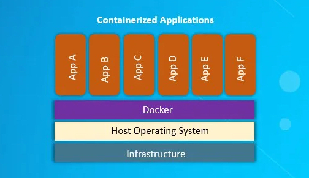

# Déployer Docker sur un serveur

::: details Sommaire
[[toc]]
:::

## Objectifs

Dans ce TP nous allons voir comment utiliser Docker sur un serveur pour rendre une application disponible sur le réseau.

Il est possible de travailler de plusieurs façons différentes avec Docker :

- Utiliser une image Docker disponible sur le Docker Hub (exemple MySQL).
- Créer une image Docker à partir d'un Dockerfile.
- Utiliser une image générique (type PHP) et la personnaliser grâce à un volume.
- Construire une image Docker via l'intégration continue (CI/CD), avec GitLab par exemple, pour la déployer sur un serveur.

::: tip Et en entreprise ?
Ici il s'agit d'une introduction à Docker, nous allons donc rester simples. Mais dans la vraie vie, nous réalisons le plus souvent la construction d'une image Docker via l'intégration continue (CI/CD), avec GitLab par exemple, pour la déployer sur un serveur.
:::

## Préparer votre serveur

La première étape est de préparer votre serveur. Pour cela, vous devez :

- Créer une machine virtuelle Debian 12 (64 bits) avec 2 Go de RAM et 20 Go de disque. (Vous pouvez utiliser le modèle [Debian 12](/tp/devops/serveur/tp1alt.md) pour créer votre machine virtuelle).
- Ajouter les dépôts de Docker sur votre machine virtuelle.

```bash
# Ajout des éléments nécessaires à l'installation
apt-get update
apt-get install -y \
    ca-certificates \
    curl \
    gnupg \
    lsb-release

# Ajout du dépôt permettant d'installer Docker
install -m 0755 -d /etc/apt/keyrings
curl -fsSL https://download.docker.com/linux/debian/gpg -o /etc/apt/keyrings/docker.asc
chmod a+r /etc/apt/keyrings/docker.asc
echo \
  "deb [arch=$(dpkg --print-architecture) signed-by=/etc/apt/keyrings/docker.asc] https://download.docker.com/linux/debian \
  $(. /etc/os-release && echo "$VERSION_CODENAME") stable" | \
  tee /etc/apt/sources.list.d/docker.list > /dev/null
```

Ici nous ajoutons les dépôts de Docker sur notre machine virtuelle.

::: tip D'où viennent ces commandes ?

Ces commandes sont tirées de la documentation officielle de Docker : [https://docs.docker.com/engine/install/debian/](https://docs.docker.com/engine/install/debian/). Et oui, comme dans le code, lire la documentation est une bonne pratique !

:::

## Installer Docker

Maintenant que nous avons ajouté les dépôts de Docker sur notre machine virtuelle, nous pouvons installer Docker.

```bash
apt-get update
apt-get install -y docker-ce docker-ce-cli containerd.io docker-buildx-plugin docker-compose-plugin
```

Nous installons ici Docker, Docker CLI, containerd, Buildx et Docker Compose. Il s'agit de tous les outils nécessaires pour travailler avec Docker de manière simple. Rappel : le `-y` permet de répondre automatiquement « oui » à toutes les questions.

À partir de maintenant, nous pouvons utiliser Docker sur notre machine virtuelle. Par contre, nous devons être connectés en tant que `root` pour pouvoir utiliser Docker. Pour éviter cela, nous allons ajouter notre utilisateur au groupe `docker`.

## Configurer Docker

Docker ne demande pas particulièrement de configuration, mais il est possible de le configurer pour qu'il fonctionne de manière optimale. Ce qui est intéressant avec Docker, c'est que nous pouvons le configurer pour qu'il fonctionne avec notre utilisateur et non pas avec `root`.

Pour cela, nous allons ajouter notre utilisateur au groupe `docker`.

```bash
usermod -aG docker <user>
```

::: tip Vous devez être root
Rappel : pour ajouter un utilisateur au groupe `docker` vous devez être connecté en tant que `root` (ou en utilisant `sudo`). Une fois que vous avez ajouté votre utilisateur au groupe `docker`, vous devez vous déconnecter puis vous reconnecter pour que le changement soit pris en compte.
:::

## Vérifier que Docker fonctionne

Pour vérifier que Docker fonctionne, nous allons lancer un conteneur Docker.

```bash
docker run hello-world
```

Ce conteneur va afficher un message de bienvenue et nous indiquer que Docker fonctionne correctement. C'est le cas ? Si oui, vous pouvez passer à la suite.



## Lancer un serveur MySQL / MariaDB

Lancer un Hello World c'est bien, mais lancer un serveur MySQL c'est mieux. Nous allons donc voir comment lancer un serveur MySQL dans un conteneur Docker. Je vous rappelle que l'idée de Docker est de pouvoir créer des conteneurs répétables, et donc de pouvoir lancer plusieurs fois le même conteneur.

Et même, plus que ça, nous pouvons lancer sur notre serveur plusieurs versions du même service, par exemple MySQL 5.7 et MySQL 8.0. Est-ce une bonne idée ? À vous d'en juger… mais c'est possible !



::: tip Dans cette image
Dans cette image, vous pouvez voir comment fonctionne Docker. Il s'agit de plusieurs petites applications (**cloisonnées**) qui vont fonctionner au-dessus de votre serveur. Ces applications sont appelées des **conteneurs**.
:::

### Choisir une version

Maintenant que votre environnement Docker est prêt, nous allons pouvoir lancer un serveur MariaDB. Pour cela, nous allons utiliser l'image Docker [MariaDB](https://hub.docker.com/_/mariadb).

::: tip Docker Hub ?

Pour faire simple, Docker Hub est un dépôt d'images Docker. Vous pouvez y trouver des images pour toutes sortes de services, et également y publier vos propres images. L'avantage du Docker Hub c'est que vous pouvez lancer un conteneur Docker en une seule commande, sans avoir à construire l'image vous-même. De plus, certaines images (comme MariaDB) sont validées par Docker, ce qui garantit qu'elles sont sécurisées et fonctionnelles.

:::

Je vous propose de lancer la dernière version de MariaDB avec l'image `mariadb:latest`. Vous pouvez également choisir une version spécifique, par exemple `mariadb:10.11`. Dans notre cas :

```bash
docker run -d \
  --name mariadb \
  -p 3306:3306 \
  -v ~/mysql-data:/var/lib/mysql \
  --env MARIADB_USER=example-user \
  --env MARIADB_PASSWORD=my_cool_secret \
  --env MARIADB_ROOT_PASSWORD=my-secret-pw \
  mariadb:latest
```

Quelques explications sur cette commande :

- `docker run` : permet de lancer un conteneur Docker.
- `-d` : lance le conteneur en mode détaché, c'est-à-dire en arrière-plan.
- `-p 3306:3306` : redirige le port `3306` de votre serveur vers le port `3306` du conteneur.
- `-v ~/mysql-data:/var/lib/mysql` : monte le dossier `mysql-data` de votre serveur dans le conteneur pour persister les données.
- `--name mariadb` : donne un nom au conteneur.
- `--env MARIADB_USER=example-user` : définit le nom de l'utilisateur de la base de données.
- `--env MARIADB_PASSWORD=my_cool_secret` : définit le mot de passe de cet utilisateur.
- `--env MARIADB_ROOT_PASSWORD=my-secret-pw` : définit le mot de passe de l'utilisateur `root`.
- `mariadb:latest` : l'image Docker à utiliser.

::: danger N'oubliez pas de changer les mots de passe

Ne laissez jamais des mots de passe par défaut sur un serveur accessible en réseau.

:::

### Les volumes

En cours nous avons vu qu'un conteneur Docker est dit `stateless`, c'est-à-dire que ses données internes sont supprimées à chaque arrêt. C'est bien pour l'isolation, mais cela veut dire que nous perdrions toutes les données de notre base de données à chaque redémarrage du conteneur.

Pour éviter cela, nous utilisons un **volume** : un dossier de votre serveur monté à l'intérieur du conteneur. Ainsi, les données sont conservées même si le conteneur est supprimé et recréé. Pratique, non ?

### Exposer le port 3306

Par défaut, les conteneurs Docker sont isolés : aucun port n'est accessible depuis l'extérieur. Pour pouvoir accéder à notre base de données depuis une autre machine (ou depuis PHPMyAdmin), nous exposons le port 3306 avec l'option `-p 3306:3306`.

Maintenant que votre conteneur est lancé, vous pouvez vous connecter à votre base de données avec un client comme [DBeaver](https://dbeaver.io/) ou [DataGrip](https://www.jetbrains.com/fr-fr/datagrip/).

### Point étape !

Et voilà, vous avez maintenant un serveur de base de données. Celui-ci est équivalent à celui que vous auriez pu installer via les dépôts de votre distribution. La grande différence, c'est que vous pouvez lancer plusieurs versions de MariaDB sur la même machine, sans conflit entre elles. Et surtout, vous pouvez choisir une version précise simplement, sans ajouter de dépôts sur votre serveur.

Autre avantage : avec Docker, vous pouvez reproduire un environnement identique entre votre machine de développement et votre serveur de production.

## Lancer PHPMyAdmin

Une base de données sans interface de gestion, c'est dommage… Regardons comment lancer un conteneur PHPMyAdmin grâce à Docker.

### Choisir une version

Comme pour MariaDB, nous allons nous rendre sur le Docker Hub pour trouver une image de PHPMyAdmin : [PHPMyAdmin](https://hub.docker.com/_/phpmyadmin).

### Lancer le conteneur

```bash
docker run -d --name phpmyadmin -p 8080:80 phpmyadmin
```

Quelques explications :

- `-p 8080:80` : redirige le port `8080` de votre serveur vers le port `80` du conteneur.
- `--name phpmyadmin` : donne un nom au conteneur.
- `phpmyadmin` : l'image Docker à utiliser.

Testez en vous connectant à `http://<ip.de.votre.serveur>:8080`.

::: tip PHPMyAdmin ne trouve pas la base de données ?
Par défaut, PHPMyAdmin ne sait pas où se trouve votre serveur MariaDB. Nous allons résoudre ce problème proprement dans la section Docker Compose ci-dessous, en utilisant le réseau interne de Docker.
:::

## Créer un docker-compose.yml pour lancer les deux serveurs

Nous avons vu comment lancer des conteneurs de manière unitaire, c'est pratique, mais ce que nous voulons c'est orchestrer un ensemble de conteneurs. L'objectif est de créer une infrastructure que nous pourrons démarrer en une seule commande, de façon répétable.

### Arrêter les conteneurs précédents

Dans un premier temps, arrêtez les conteneurs lancés précédemment.

```bash
# Arrêt des conteneurs
docker stop phpmyadmin mariadb

# Suppression
docker rm phpmyadmin mariadb
```

### Créer un fichier docker-compose.yml

Dans le dossier de votre choix, créez un fichier `docker-compose.yml` :

```bash
nano docker-compose.yml
```

Voici le contenu du fichier :

```yaml
services:
  db:
    image: mysql:8
    container_name: db
    restart: always
    environment:
      - MYSQL_USER=user
      - MYSQL_PASSWORD=user-password
      - MYSQL_ROOT_PASSWORD=root
    volumes:
      - ./mysql-data:/var/lib/mysql
    ports:
      - 3306:3306

  phpmyadmin:
    image: phpmyadmin
    container_name: phpmyadmin
    restart: always
    environment:
      - PMA_HOST=db
      - PMA_PORT=3306
    ports:
      - 8081:80
    depends_on:
      - db
```

::: tip PMA_HOST=db
Notez que PHPMyAdmin utilise `PMA_HOST=db` pour se connecter à la base de données. `db` est le nom du service défini dans ce même fichier. Docker Compose crée automatiquement un réseau interne entre les conteneurs, ce qui leur permet de communiquer par leur nom de service.
:::

Je vous propose de lire ce fichier ligne par ligne : nous allons le faire ensemble.

### Lancer votre stack

```bash
docker compose up -d
```

Le `-d` permet de lancer la stack en mode détaché. Sans ce flag, vous verriez les logs de l'ensemble des conteneurs défiler dans le terminal.

### Les logs

Comme pour un serveur classique, vous pouvez consulter les logs de vos conteneurs.

```bash
# Logs de tous les conteneurs
docker compose logs -f

# Logs d'un conteneur en particulier
docker compose logs -f db
```

### Arrêter la stack

```bash
docker compose down
```

## C'est à vous : le cas de Redmine

En reprenant le fonctionnement précédent, je vous propose de créer un nouveau service sur votre serveur : un serveur **Redmine**. Je vous laisse chercher comment faire.

Une piste : [https://hub.docker.com/_/redmine](https://hub.docker.com/_/redmine)

## Un autre exemple : EmulatorJS

Redmine, ce n'est pas forcément très fun… Je vous propose un autre usage de Docker : nous allons déployer [`emulatorjs`](https://docs.linuxserver.io/images/docker-emulatorjs), un émulateur de consoles rétro accessible depuis le navigateur.

### Créer un fichier docker-compose.yml

```yaml
services:
  emulatorjs:
    image: lscr.io/linuxserver/emulatorjs:latest
    container_name: emulatorjs
    environment:
      - PUID=1000
      - PGID=1000
      - TZ=Europe/Paris
      - SUBFOLDER=/ #optional
    volumes:
      - ~/emulatorjs-config:/config
      - ~/emulatorjs-data:/data
    ports:
      - 3000:3000
      - 9090:80
    restart: unless-stopped
```

Je vous laisse tester le serveur une fois démarré.

## Adguard Home

Je vous propose de déployer **Adguard Home**, un bloqueur de publicités et de traqueurs qui fonctionne comme un serveur DNS. Il est très simple à utiliser et très efficace.

```yaml
services:
  adguardhome:
    image: adguard/adguardhome
    container_name: adguardhome
    ports:
      - "9191:3000" # Interface de gestion
      - "53:53/tcp"
      - "53:53/udp"
      - "784:784/udp"
      - "853:853/tcp"
    volumes:
      - ./work:/opt/adguardhome/work
      - ./conf:/opt/adguardhome/conf
    cap_add:
      - NET_ADMIN
    security_opt:
      - no-new-privileges=true
    restart: unless-stopped
    logging:
      driver: "json-file"
      options:
        max-size: "5m"
        max-file: "1"
```

Démarrez le conteneur :

```bash
docker compose up -d
```

Accédez à l'interface d'administration à l'adresse `http://<ip.de.votre.serveur>:9191`. Une fois configuré, il vous suffit de changer la configuration DNS de votre machine pour pointer vers votre serveur.

Pour tester rapidement sans modifier la configuration DNS de votre machine :

```bash
nslookup google.com <ip.de.votre.serveur>
```

ou avec `dig` :

```bash
dig @<ip.de.votre.serveur> google.com
```

## Conclusion

Dans ce TP nous avons vu comment Docker facilite la mise en place de services sur un serveur. Nous avons vu comment Docker permet de créer rapidement des infrastructures répétables, quelles que soient la version, la configuration, ou l'OS de la machine.

Nous avons également vu comment Docker Compose permet de lancer plusieurs conteneurs simultanément et de les faire communiquer entre eux (exemple : un serveur MySQL et PHPMyAdmin).