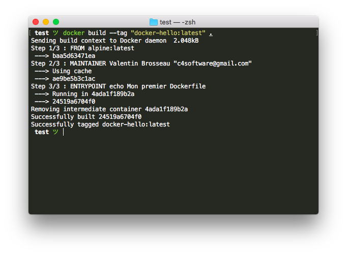

# Les Dockerfile’s

<!-- TOC -->

- [Les Dockerfile’s](#les-dockerfiles)
    - [Introduction](#introduction)
    - [Pourquoi faire des Dockerfile](#pourquoi-faire-des-dockerfile)
    - [Créer un Dockerfile](#créer-un-dockerfile)
    - [Builder votre image](#builder-votre-image)
    - [Image Docker pour l’application "TODO"](#image-docker-pour-lapplication-todo)
        - [1. Écriture du Dockerfile](#1-écriture-du-dockerfile)
        - [2. Ajout des sources dans l’image](#2-ajout-des-sources-dans-limage)
        - [3. Build de l’image](#3-build-de-limage)
        - [4. Lancer votre application](#4-lancer-votre-application)

<!-- /TOC -->

## Introduction

Comme nous l’avons vu dans [le premier TP](introduction.md) chaque image Docker repose sur un fichier Dockerfile. Pour l’instant nous n’avons pas écrit le notre, nous avons juste utilisé ceux fournis sur le DockerHub. Dans ce TP nous allons voir la structure d’un fichier Dockerfile et vous allez écrire votre premier Dockerfile il aurra pour but de définir l’ensemble de la « stack applicative » nécéssaire au bon fonctionnement de l’application « TODO ».

## Pourquoi faire des Dockerfile

Comme vous avez pu le voir sur le DockerHub il existe énormément d’image déjà prête, elles nous seront bien évidement utiles dans nos images Docker, mais tels quelles elles n’ont que « peu d’intérêts ». Nous allons donc écrire un fichier Dockefile qui va permettre de créer toute la définition pour le bon fonctionnement de l’application « TODO » que vous avez écrit dans un autre TP.

Une fois le fichier Dockerfile écrit, votre application sera fonctionnelle sur toutes les plateformes supportées par Docker (Windows, Linux, OSX, Raspberry Pi…), fonctionelle oui, mais surtout fonctionnelle en quelques secondes !

## Créer un Dockerfile

Les « Dockerfile » sont des simples fichiers textes mais avec un formalisme précis. Par exemple :

```conf
FROM alpine:latest
MAINTAINER Valentin Brosseau "c4software@gmail.com"
ENTRYPOINT ["echo", "Mon premier Dockerfile"]
```

Avant de « builder » cette première image, arretons nous sur les différentes lignes :

- « FROM alpine:latest », c’est l’image de référence, dans le cas présent une image très légère (un linux avec très peu de dépendances).
- « MAINTAINER Valentin Brosseau "c4software@gmail.com" », Le mainteneur de l’image (purement indicatif).
- « ENTRYPOINT ["echo", "'Mon premier Dockerfile'"] », La commande qui sera lancée au **démarrage** de votre image.

Pour finir enregistrer la définition précédente dans un fichier nommé « Dockerfile ».

## Builder votre image

Pour builder votre image il suffit de lancer la commande suivante :

```shell
docker build --tag "docker-hello:latest" .
```

Avant de lancer cette commande, regardons les différents éléments :

- « --tag "docker-hello" », c’est le nom de votre image.
- « …:latest », c’est la version de votre image. Latest indique la version la plus récente.
- « . » indique à Docker que le fichier Dockerfile est dans le dossier courant.

Lancer la précédente commande dans le dossier ou vous avez créé le fichier Dockerfile.



## Image Docker pour l’application "TODO"

Faire un test c’est bien! Mais maintenant que l’on connait les bases d’une image Docker, nous allons créer une image Docker qui va nous permettre de lancer rapidement (et très simplement) l’application sans avoir à se soucier de l’environnement sur lequel vous allez lancer « votre applications / site web ».

### 1. Écriture du Dockerfile

Pour écrire notre Dockerfile nous allons avoir besoin de connaitre les technologies nécéssaire au bon fonctionnement de notre application. Dans notre cas, il faut le language de programmation de la partie serveur :

- […] (À vous de trouver…)

Une fois que c’est fait il faut trouver une image de base qui nous servira de référence. Dans notre cas … PHP. Une image officielle existe : [Docker Hub PHP](https://hub.docker.com/_/php/).

- Qu’elle version choisisez-vous ?
- Pourquoi ?

Pour continuer nous allons utiliser l’image PHP 7 Apache. Voilà le début de notre Dockerfile :

```conf
FROM php:7-apache
MAINTAINER Valentin Brosseau "c4software@gmail.com"
```

La base de votre Dockerfile est terminée. Nous allons voir comment ajouter le code source dans l’image.

### 2. Ajout des sources dans l’image

Nous avons vu dans le premier TP qu’il était possible de faire un « montage ». C’est pratique pour ajouter de la donnée temporaire, mais dans le cas présent ce que l’on veut c’est faire une image statique qui sera transportable nous allons donc utiliser la commande ```COPY```.

La commande ```COPY``` permet de copier des fichiers (dossiers, fichiers, etc…) directement dans l’image qui sera construite. Une fois « builder » les données seront persitantes et les modifications seront éffacées à chaque redémarrage de l’image (intéréssant d’un point de vue sécurité).

La commande ```COPY``` prend deux arguments le fichiers « sources » et la destination dans votre image. Modifions le fichier Dockerfile pour ajouter la commande ```COPY``` suivante :

```conf
FROM php:7-apache
MAINTAINER Valentin Brosseau "c4software@gmail.com"

COPY src/ /var/www/html/
```

Le premier dossier c’est vos sources, sur votre machine dans le même dossier que le fichier Dockerfile, créez un dossier nommé ```src``` avec à l’interieur les sources de votre projet ```todo-vuejs```.

Et voilà! C’est terminé. Votre image est prête à être « build ».

### 3. Build de l’image

Maintenant que notre image est prête nous allons pouvoir builder l’image :

```shell
docker build --tag "vuejs-todo:latest" .
```

Ding ! C’est prêt.

### 4. Lancer votre application

Votre application étant buildée pour la lancer il suffit de faire :

```shell
docker run -p 8888:80 vuejs-todo:latest
```

Votre application est maintenant [disponnible ici](http://localhost:8080).