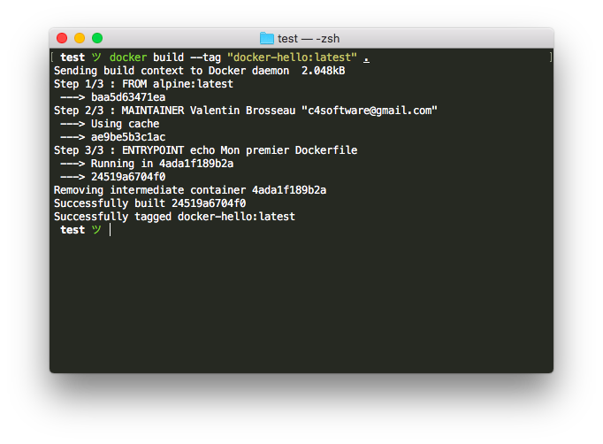

# Les Dockerfile

::: details Sommaire
[[toc]]
:::

## Introduction

Comme nous l’avons vu dans [le premier TP](introduction.md), chaque image Docker repose sur un fichier Dockerfile. Pour l’instant, nous n’avons pas écrit le nôtre, nous avons juste utilisé ceux fournis sur le DockerHub. Dans ce TP nous allons voir la structure d’un fichier Dockerfile, et vous allez écrire votre premier Dockerfile. Il aura pour but de définir l’ensemble de la « stack applicative » nécessaire au bon fonctionnement de l’application « TODO ».

## Pourquoi faire des Dockerfile

Comme vous avez pu le voir sur le DockerHub il existe énormément d’images déjà prêtes. Elles nous seront bien évidemment utiles dans nos images Docker, mais telles quelles elles n’ont que « peu d’intérêt ». Nous allons donc écrire un fichier Dockerfile qui va contenir toute la définition nécessaire au bon fonctionnement de l’application « TODO » que vous avez écrite dans un autre TP.

Une fois le fichier Dockerfile écrit, votre application sera fonctionnelle sur toutes les plateformes supportées par Docker (Windows, Linux, macOS, Raspberry Pi…). Fonctionnelle oui, mais surtout fonctionnelle en quelques secondes !

## Créer un Dockerfile

Les « Dockerfile » sont de simples fichiers texte, mais avec un formalisme précis. Par exemple :

```dockerfile
FROM alpine:latest
LABEL Valentin Brosseau "c4software@gmail.com"
ENTRYPOINT ["echo", "Mon premier Dockerfile"]
```

Avant de « builder » cette première image, arrêtons-nous sur les différentes lignes :

- « FROM alpine:latest », c’est l’image de référence, dans le cas présent une image très légère (un Linux avec très peu de dépendances).
- « LABEL Valentin Brosseau "c4software@gmail.com" », le mainteneur de l’image (purement indicatif).
- « ENTRYPOINT ["echo", "Mon premier Dockerfile"] », la commande qui sera lancée au **démarrage** de votre image.

Pour finir, enregistrez la définition précédente dans un fichier nommé « Dockerfile ».

## Builder votre image

Pour builder votre image il suffit de lancer la commande suivante :

```bash
docker build --tag "docker-hello:latest" .
```

Avant de lancer cette commande, regardons les différents éléments :

- « --tag "docker-hello" », c’est le nom de votre image.
- « …:latest », c’est la version de votre image. Latest indique la version la plus récente.
- « . » indique à Docker que le fichier Dockerfile est dans le dossier courant.

Lancez la commande précédente dans le dossier où vous avez créé le fichier Dockerfile.



## Image Docker pour l’application "TODO"

Faire un test c’est bien ! Mais maintenant que l’on connaît les bases d’une image Docker, nous allons créer une image Docker qui va nous permettre de lancer rapidement (et très simplement) l’application sans avoir à nous soucier de l’environnement sur lequel vous allez lancer « votre application / site web ».

### 1. Écriture du Dockerfile

Pour écrire notre Dockerfile nous allons avoir besoin de connaître les technologies nécessaires au bon fonctionnement de notre application. Dans notre cas, il faut le langage de programmation de la partie serveur :

- […] (À vous de trouver…)

Une fois que c’est fait, il faut trouver une image de base qui nous servira de référence. Dans notre cas … PHP. Une image officielle existe : [Docker Hub PHP](https://hub.docker.com/_/php/).

- Quelle version choisissez-vous ?
- Pourquoi ?

Pour continuer, nous allons utiliser l’image PHP 8 Apache. Voilà le début de notre Dockerfile :

```dockerfile
FROM php:8-apache
LABEL Valentin Brosseau "c4software@gmail.com"
```

La base de votre Dockerfile est terminée. Nous allons voir comment ajouter le code source dans l’image.

### 2. Ajout des sources dans l’image

Nous avons vu dans le premier TP qu’il était possible de faire un « montage ». C’est pratique pour ajouter de la donnée temporaire, mais dans le cas présent ce que l’on veut c’est une image statique et transportable : nous allons donc utiliser la commande `COPY`.

La commande `COPY` permet de copier des fichiers (dossiers, fichiers, etc.) directement dans l’image qui sera construite. Une fois l’image « buildée », les données seront persistantes et les modifications seront effacées à chaque redémarrage de l’image (intéressant d’un point de vue de la sécurité).

La commande `COPY` prend deux arguments : le dossier « source » et la destination dans votre image. Modifions le fichier Dockerfile pour ajouter la commande `COPY` suivante :

```dockerfile
FROM php:8-apache
LABEL Valentin Brosseau "c4software@gmail.com"

COPY src/ /var/www/html/
```

Le premier dossier correspond à vos sources. Sur votre machine, dans le même dossier que le fichier Dockerfile, créez un dossier nommé `src` avec à l’intérieur les sources de votre projet `todo-php`.

Et voilà ! C’est terminé. Votre image est prête à être « build ».

### 3. Build de l’image

Maintenant que notre image est prête, nous allons pouvoir builder l’image :

```bash
docker build --tag "php-todo:latest" .
```

Ding ! C’est prêt.

### 4. Lancer votre application

Votre application étant buildée, pour la lancer il suffit de faire :

```bash
docker run -p 8888:80 php-todo:latest
```

Votre application est maintenant [disponible ici](http://localhost:8888).
