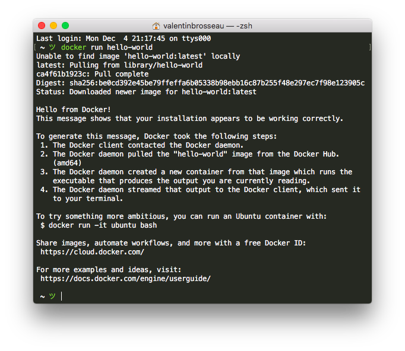
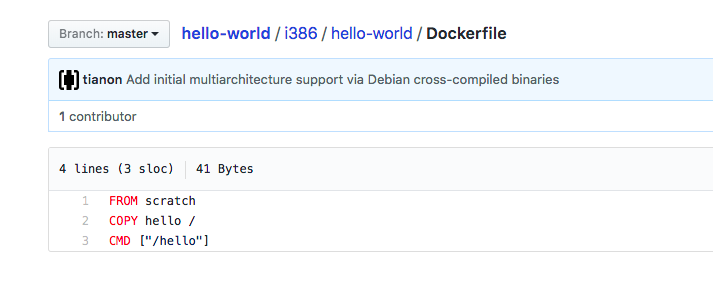
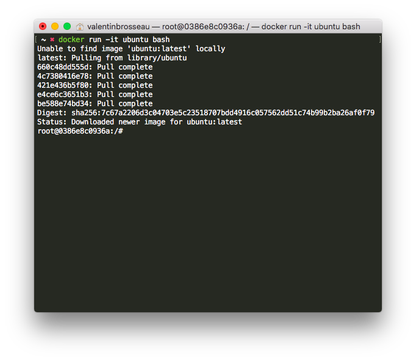

# Introduction à Docker

Dans ce TP nous allons voir l’installation de Docker et les premiers exemples d’utilisations de votre nouvel environnement.

<!-- TOC -->

- [Introduction à Docker](#introduction-à-docker)
    - [Installation de Docker sous Windows](#installation-de-docker-sous-windows)
    - [Premier test](#premier-test)
    - [Second test](#second-test)
    - [Les sources de l’image hello world](#les-sources-de-limage-hello-world)
    - [Pour aller plus loin](#pour-aller-plus-loin)
        - [Créer un fichier dans la machine](#créer-un-fichier-dans-la-machine)
        - [Avoir accès aux fichiers de votre machine](#avoir-accès-aux-fichiers-de-votre-machine)
            - [Monter un dossier](#monter-un-dossier)
            - [Monter un fichier](#monter-un-fichier)
    - [Compilation Cordova](#compilation-cordova)
        - [Unix (Linux, Osx)](#unix-linux-osx)
        - [Windows](#windows)

<!-- /TOC -->

## Installation de Docker sous Windows

Pour installer Docker rien de plus simple, il suffit d’utiliser l’installeur officiel en le téléchargant sur [le site de Docker.](https://www.docker.com/docker-windows)

## Premier test

Maintenant qu’il est installé sur votre poste rien de plus simple. Dans une console entrez la commande suivante :

```shell
docker version
```

Vous devez voir la version de Docker.

- Que constatez-vous ?
- Pourquoi est-ce important d’utiliser une version récente ?

## Second test

Maintenant que nous savons que Docker est correctement installé, testons avec une « machine » fourni par Docker. L’image se nomme ```hello-world``` et celle-ci ne fait qu’afficher un message de bienvenue. De nouveau dans la console entrez la commande suivante :

```shell
docker run hello-world
```



- Que constatez-vous ?
- Comment être certain que l’image n’a rien fait d’anormal sur notre machine ?

## Les sources de l’image hello world

Maintenant que nous avons lancé notre première « vrai » machine intéréssons-nous à son fonctionnement. Vous avez du constater le terme « Pulling From » c’est l’image ou les morceaux d’image utile au fonctionnement de votre service. Celui-ci est téléchargé directement depuis le « Docker Hub » (il est également possible d’avoir un Hub Privé). Vous pouvez voir « les sources » de l’image en question : [ici](https://github.com/docker-library/hello-world), comme beaucoup de projet libre l’image est disponible sur Github.

Surprise ! On retrouve des plateformes (amd64, i686, armXX). Et c’est normal, Docker est multiplateforme et dans le cas de notre exemple l’executable « hello » est codé en C il est donc logique de retrouver l’executable pour les différentes plateformes ou l’image doit fonctionner.

Maintenant que nous avons vu le projet, entrons plus en détail allons voir la définition de notre image le [fichier Dockerfile.](https://github.com/docker-library/hello-world/blob/master/i386/hello-world/Dockerfile)



Peu d’informations, 3 lignes :

- ```FROM scratch``` (Image de base, celle utilisée comme référence, elle aussi posséde un DockerFile).
- ```COPY hello /``` (Ajoute le fichier hello à la racine de votre « machine »).
- ```CMD ["/hello"]``` (Commande lancée au démarrage de votre image).

PS: Pas d’inquietude on créera un DockerFile dans le 2nd TP.

## Pour aller plus loin

Bon un texte à l’écran c’est bien… Mais si on lancait un système entier? Ubuntu par exemple. Pour ça rien de plus simple, dans la console lancé :

```shell
docker run -it ubuntu bash
```



Et voilà vous avez un Linux complètement opérationnel en quelques minutes sur votre poste Windows. Pas mal ? C’est pas vraiment le but premier de Docker mais c’est cool.

Utiliser un peu le shell de votre « nouveau Linux », exemple de commande :

- ```uname -a``` : Affiche la version du noyau.
- ```whoami``` : Qui suis-je ? (root normalement, d’ailleurs est-ce normal?).
- ```top``` : Affiche les processus en cours.
- ```ls /```

Questions :

- D’ailleurs, pourquoi le top ne retourne que deux processus ?
- Aucune trace de vos fichiers… c’est normal, de base rien n’est accessible.

### Créer un fichier dans la machine

Créer un fichier vide avec la commande :

```shell
touch fichier_test
```

Vérifier avec un ```ls``` que le fichier est bien présent. Quitter maintenant votre l’image en tappant ```exit```. Relancer de nouveau l’image avec la commande :

```shell
docker run -it ubuntu bash
```

Faites à nouveau un ```ls```, que constatez-vous? Et bien oui, le fichier n’est plus présent… C’est normal tous les fichiers créés dans l’image sont non persistant (c’est à dire qu’ils sont supprimés à chaque fois que l’image s’arrête).

### Avoir accès aux fichiers de votre machine

Bon c’est bien, mais si on donnait accès à un stockage persistant à notre image. Sur votre machine le Stockage persistant c’est votre disque dur (HDD, SSD, etc). Avec docker (comme sous Linux d’ailleurs) on parle de monter « un volume », une fois monté ce volume sera accessible comme un dossier (ou un fichier, on y reviendra).

#### Monter un dossier

Pour monter un volume il suffit d’ajouter un ```-v``` à la commande de lancement, exemple pour avoir le dossier courant :

Sous Windows :

```shell
docker run -v %cd%:/mnt/ -it ubuntu bash
```

Sous Unix :

```shell
docker run -v $(pwd):/mnt/ -it ubuntu bash
```

Lancer la commande ```ls /mnt``` vous devriez vour vos fichiers.

⚠️⚠️ Attention! L’accès est en lecture ET en écriture donc attention.

#### Monter un fichier

Comme je le disais dans l’introduction avec docker il est possible de rendre accessible le dossier, mais également les fichiers. Pour les fichiers la commande est la même sauf qu’au lieu de spécifier un dossier on spécifie le chemin d’un fichier. Exemple :

Windows :

```shell
docker run -v %cd%/mon_fichier:/mnt/mon_fichier -it ubuntu bash
```

Unix :

```shell
docker run -v $(pwd)/mon_fichier:/mnt/mon_fichier -it ubuntu bash
```

Le fichier est maintenant accessible dans votre image Docker. Il est également possible de limiter l’accès à votre fichier en le montant par exemple en « lecture seulement » :

```shell
docker run -v $(pwd)/mon_fichier:/mnt/mon_fichier:ro -it ubuntu bash
```

Et c’est la que l’on voit la puissance, on verra qu’il sera possible par la suite de créer de vrai « stack » applicative qui définiront l’ensemble des paramètres de notre environnement (cloisonné) et gérant finement les droits d’accès à la configuration par exemple! Un régal !

## Compilation Cordova

Je pense que vous vous souvenez que paramètrer l’environnement de compilation Android sur Windows n’était pas vraiment simple (JDK, SDK, etc… ), avec Docker c’est beaucoup plus simple ! Vraiment beaucoup plus simple. Pour compiler un projet Cordova avec Docker j’ai préparé une petite image Docker qui possede l’ensemble des éléments nécéssaires, pour l’utiliser :

### Unix (Linux, Osx)

```sh
cd mon_projet_cordova/
docker run -it --entrypoint /bin/bash -v $(pwd):/Sources/ c4software/cordova-light:latest
# Vous pouvez  maintenant lancer, par exemple : cordova build
```

### Windows

```sh
cd mon_projet_cordova/
docker run -it --entrypoint /bin/bash -v %cd%:/Sources/ c4software/cordova-light:latest
# Vous pouvez  maintenant lancer, par exemple : cordova build
```