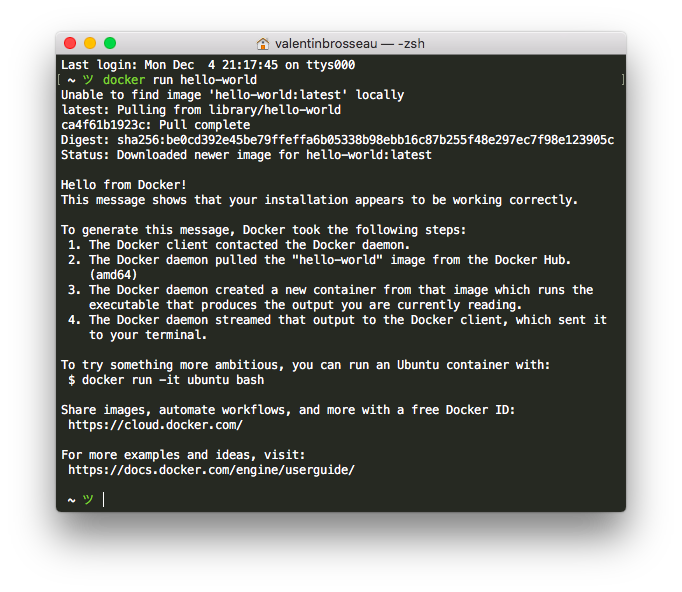
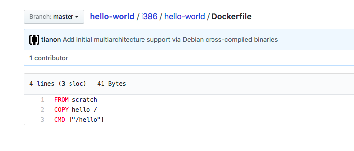
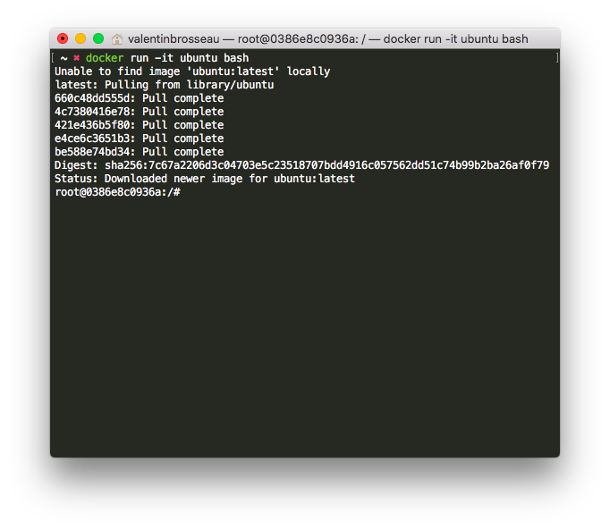

# Introduction à Docker

Dans ce TP nous allons voir l'installation de Docker et les premiers exemples d'utilisations de votre nouvel environnement.

::: details Sommaire
[[toc]]
:::

## Installation de Docker sous Windows

Pour installer Docker rien de plus simple, il suffit d'utiliser l'installeur officiel en le téléchargeant sur [le site de Docker.](https://docs.docker.com/desktop/install/windows-install/)

## Lancer Docker

Lancez Docker Desktop. Au premier démarrage, Docker vous demandera peut-être d'activer WSL2 (Windows Subsystem for Linux 2) — acceptez, c'est le backend recommandé.

## Quota et utilisation

Dans nos différents tests, nous allons utiliser le registry Docker officiel. Celui-ci a mis en place des quotas assez restrictifs pour les utilisateurs non authentifiés. Il est donc préférable de créer un compte Docker et de vous authentifier sur le registry. Pour cela, rien de plus simple, il suffit d'entrer la commande suivante dans une console :

```bash
docker login
```

Il vous sera demandé de vous authentifier avec votre compte Docker. Une fois authentifié, vous pourrez télécharger des images avec une limite beaucoup plus élevée.

## Premier test

Maintenant qu'il est installé sur votre poste, rien de plus simple. Dans une console, entrez la commande suivante :

```bash
docker version
```

Vous devez voir la version de Docker.

- Que constatez-vous ?
- Pourquoi est-ce important d'utiliser une version récente ?

## Second test

Maintenant que nous savons que Docker est correctement installé, testons avec une « machine » fournie par Docker. L'image se nomme `hello-world`, celle-ci ne fait qu'afficher un message de bienvenue. De nouveau, dans la console, entrez la commande suivante :

```bash
docker run hello-world
```



- Que constatez-vous ?
- Comment être certain que l'image n'a rien fait d'anormal sur notre machine ?

## Les sources de l'image hello world

Maintenant que nous avons lancé notre première « vraie » machine, intéressons-nous à son fonctionnement. Vous avez dû constater le terme « Pulling From » : c'est l'image (ou les morceaux d'image) utile au fonctionnement de votre service. Celle-ci est téléchargée directement depuis le « Docker Hub » (il est également possible d'avoir un Hub privé). Vous pouvez voir « les sources » de l'image en question : [ici](https://github.com/docker-library/hello-world). Comme beaucoup de projets libres, l'image est disponible sur Github.

Surprise ! On retrouve des plateformes (amd64, i686, armXX). Et c'est normal, Docker est multiplateforme. Dans le cas de notre exemple, l'exécutable « hello » est codé en C, il est donc logique de retrouver l'exécutable pour les différentes plateformes où l'image doit fonctionner.

Maintenant que nous avons vu le projet, entrons plus en détail, allons voir la définition de notre image : le [fichier Dockerfile.](https://github.com/docker-library/hello-world/blob/master/i386/hello-world/Dockerfile)



Peu d'informations, 3 lignes :

- `FROM scratch` (Image de base, celle utilisée comme référence — elle aussi possède un Dockerfile).
- `COPY hello /` (ajoute le fichier hello à la racine de votre « machine »).
- `CMD ["/hello"]` (Commande lancée au démarrage de votre image).

PS : On créera un Dockerfile dans le 2nd TP.

## Pour aller plus loin

Bon, un texte à l'écran c'est bien… Mais si on lançait un système entier ? Ubuntu par exemple. Pour ça rien de plus simple, dans la console lancez :

```bash
docker run -it ubuntu bash
```



Et voilà, vous avez un Linux complètement opérationnel en quelques minutes sur votre poste Windows. Pratique ! Même si ce n'est pas vraiment le but premier de Docker, c'est sympa.

> ⚠️ L'image Ubuntu dans Docker est volontairement minimaliste : elle ne contient pas `sudo`, peu d'outils préinstallés, et certaines commandes habituelles peuvent manquer. C'est tout à fait normal.

Utilisez un peu le shell de votre « nouveau Linux », exemples de commandes :

- `uname -a` : Affiche la version du noyau.
- `whoami` : Qui suis-je ? (normalement root — d'ailleurs, est-ce normal ?).
- `top` : Affiche les processus en cours.
- `ls /`

Questions :

- D'ailleurs, pourquoi `top` ne retourne-t-il que deux processus ?
- Aucune trace des fichiers de votre machine… normale, de base rien n'est accessible.

### Créer un fichier dans la machine

Créez un fichier vide avec la commande :

```bash
touch fichier_test
```

Vérifiez avec un `ls` que le fichier est bien présent. Vous pouvez quitter l'image en saisissant `exit` dans le terminal. Relancez de nouveau l'image avec la commande :

```bash
docker run -it ubuntu bash
```

Faites à nouveau un `ls`, que constatez-vous ? Et bien oui, le fichier n'est plus présent… C'est normal, tous les fichiers créés dans l'image sont non persistants (c'est-à-dire qu'ils sont supprimés à chaque fois que l'image s'arrête).

### Avoir accès aux fichiers de votre machine

Bon, c'est bien, mais si l'on donnait accès à un stockage persistant à notre image. Sur votre machine le stockage persistant c'est votre disque dur (HDD, SSD, etc.). Avec Docker (comme sous Linux d'ailleurs) on parle de « monter un volume » : une fois monté, ce volume sera accessible comme un dossier (ou un fichier, on y reviendra).

#### Monter un dossier

Pour monter un volume, il suffit d'ajouter un `-v` à la commande de lancement.

⚠️⚠️ Attention ! L'accès est en lecture ET en écriture sur **VOTRE MACHINE**, donc soyez prudent.

Sous Windows (PowerShell) :

```powershell
docker run -v "${PWD}:/mnt/" -it ubuntu bash # Monte le dossier courant dans le /mnt du Docker.
```

Sous Unix / macOS :

```bash
docker run -v $(pwd):/mnt/ -it ubuntu bash # Monte le dossier courant dans le /mnt du Docker.
```

Lancez la commande, `ls /mnt` vous devriez voir vos fichiers.

#### Monter un fichier

Comme je le disais dans l'introduction, avec Docker il est possible de rendre accessible un dossier, mais également un fichier. Pour les fichiers la commande est la même, sauf qu'au lieu de spécifier un dossier on spécifie le chemin d'un fichier. Exemple :

Windows (PowerShell) :

```powershell
docker run -v "${PWD}/mon_fichier:/mnt/mon_fichier" -it ubuntu bash
```

Unix / macOS :

```bash
docker run -v $(pwd)/mon_fichier:/mnt/mon_fichier -it ubuntu bash
```

Le fichier est maintenant accessible dans votre image Docker. Il est également possible de limiter l'accès à votre fichier en le montant en « RO » (lecture seule) :

```bash
docker run -v $(pwd)/mon_fichier:/mnt/mon_fichier:ro -it ubuntu bash
```

Et c'est là que l'on voit la puissance : on verra qu'il sera possible par la suite de créer de vraies « stacks » applicatives qui définiront l'ensemble des paramètres de notre environnement (cloisonné) en gérant finement les droits d'accès à la configuration. Un régal !

## Utiliser Docker pour développer

Docker est un outil intéressant pour développer : il permet de créer des environnements de développement isolés et facilement reproductibles. Vous pouvez avec Docker packager une application avec toutes ses dépendances pour la faire fonctionner sur n'importe quel système d'exploitation. Pour vous donner envie d'utiliser Docker, nous allons tester des exemples atypiques.

### yt-dlp

yt-dlp est un outil en ligne de commande permettant de télécharger des vidéos sur YouTube et d'autres sites de streaming. Il est disponible sous forme de conteneur Docker, ce qui vous permet de l'utiliser sans avoir à l'installer sur votre système.

```bash
alias ytdl='docker run --rm -v "$(pwd):/downloads" -it jauderho/yt-dlp:latest -x --audio-format mp3 --audio-quality 0 --embed-metadata'
```

Qu'avons-nous ici ?

- `alias ytdl=` : Crée un alias pour la commande, ce qui vous permet de l'utiliser plus facilement. (C'est une commande shell, pas une commande Docker).
- `docker run` : Lance un conteneur Docker.
- `--rm` : Supprime le conteneur après son utilisation.
- `-v "$(pwd):/downloads"` : Monte le répertoire courant dans le conteneur à l'emplacement `/downloads`. Cela vous permet de télécharger des fichiers directement dans votre répertoire de travail.
- `-it` : Lance le conteneur en mode interactif.
- `jauderho/yt-dlp:latest` : Spécifie l'image Docker à utiliser. Dans ce cas, il s'agit de l'image `jauderho/yt-dlp` avec la dernière version.
- `-x --audio-format mp3 --audio-quality 0 --embed-metadata` : Ce sont les options passées à `yt-dlp`. Ces options permettent de télécharger l'audio au format MP3 avec la meilleure qualité et d'incorporer les métadonnées.

Si vous souhaitez télécharger une vidéo pour en sauvegarder une copie au format MP3, il vous suffit de lancer la commande suivante :

```bash
ytdl https://www.youtube.com/watch?v=dQw4w9WgXcQ
```

Je vous laisse tester. Vous allez voir que le téléchargement est rapide et que la qualité est au rendez-vous. Vous pouvez également utiliser d'autres options de `yt-dlp` pour personnaliser le téléchargement selon vos besoins.

### Autres exemples

Autre exemple « amusant » : SpotDL, un outil permettant de télécharger des chansons depuis Spotify. Il est également disponible sous forme de conteneur Docker.

```bash
alias spotdl='docker run --rm -v "$(pwd):/music" spotdl/spotify-downloader --audio {youtube,youtube-music,soundcloud,piped} --output "{artist}/{album}/{track-number} - {title}.{output-ext}" download'
```

Qu'avons-nous ici ?

- `alias spotdl=` : Crée un alias pour la commande, ce qui vous permet de l'utiliser plus facilement. (C'est une commande shell, pas une commande Docker).
- `docker run` : Lance un conteneur Docker.
- `--rm` : Supprime le conteneur après son utilisation.
- `-v "$(pwd):/music"` : Monte le répertoire courant dans le conteneur à l'emplacement `/music`. Cela vous permet de télécharger des fichiers directement dans votre répertoire de travail.
- `spotdl/spotify-downloader` : Spécifie l'image Docker à utiliser.
- `--audio {youtube,youtube-music,soundcloud,piped}` : Indique les sources audio à utiliser pour le téléchargement.
- `--output "{artist}/{album}/{track-number} - {title}.{output-ext}"` : Spécifie le format de sortie pour les fichiers téléchargés.
- `download` : Indique que vous souhaitez télécharger une chanson.

Si vous souhaitez télécharger une chanson, il vous suffit de lancer la commande suivante :

```bash
spotdl https://open.spotify.com/intl-fr/track/4PTG3Z6ehGkBFwjybzWkR8?si=b667ca05a91e4558
```

L'outil SpotDL va rechercher dans les métadonnées de la chanson pour la retrouver sur YouTube et la télécharger.

## Nettoyage

À la fin du TP, vous avez probablement plusieurs images et conteneurs qui traînent sur votre machine. Voici comment faire le ménage :

```bash
docker ps -a          # Liste tous les conteneurs (y compris arrêtés)
docker images         # Liste toutes les images téléchargées
docker system prune   # Supprime les conteneurs arrêtés, images inutilisées et cache
```

> ⚠️ `docker system prune` est irreversible. Vérifiez ce que vous supprimez avant de confirmer.

## Allons plus loin

Nous avons ici des petites machines pour jouer… C'est rigolo… Mais Docker est bien plus puissant que ça. [La suite c'est par ici](./creer_server_local.md)