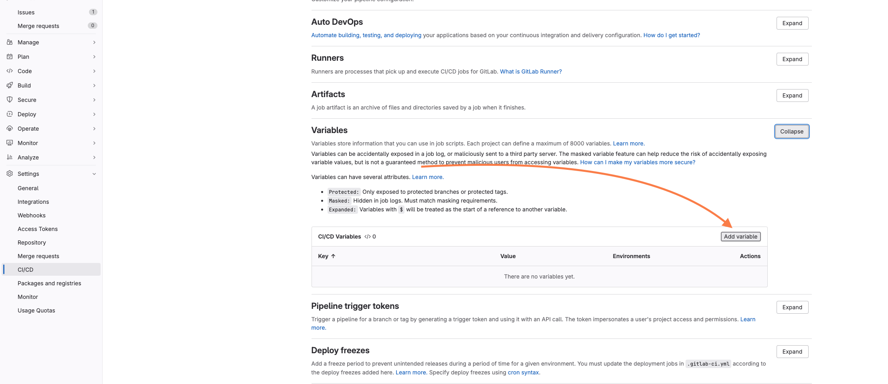
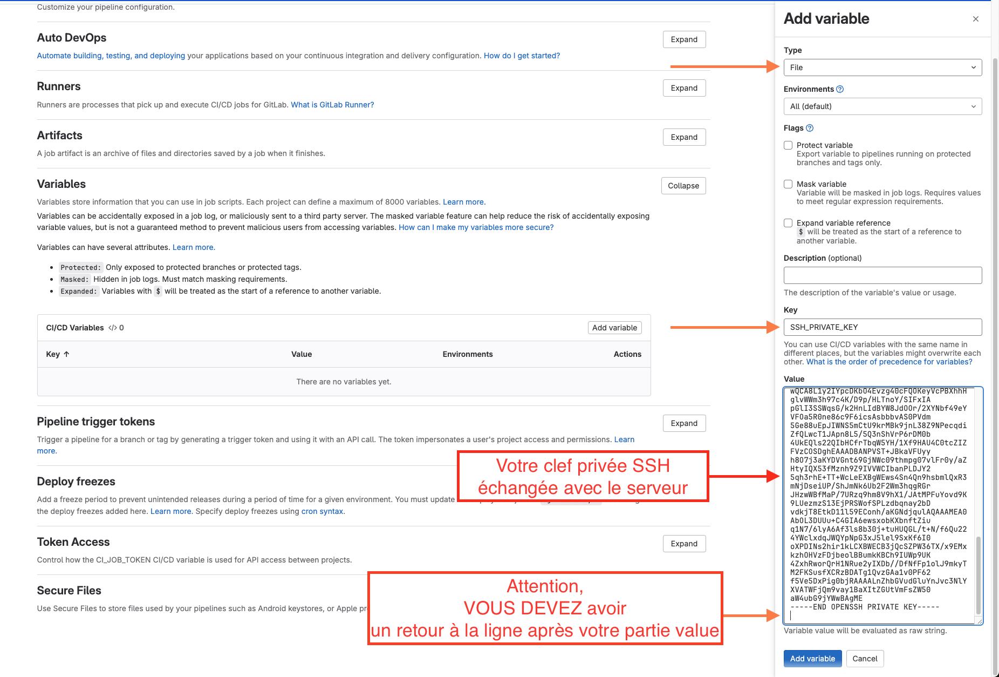

# Déployer simplement et automatiquement un projet avec Kamal

Dans ce TP/TD nous allons voir comment il est possible d'automatiser l'installation (déploiement) d'un projet Web sur un serveur distant avec Kamal.

::: details Sommaire
[[toc]]
:::

## Introduction

Nous avons vu via les différents TP qu'il était relativement simple de conteneuriser une application Web. Nous avons également vu qu'il était possible de créer une stack complète avec Docker Compose ([voir aide mémoire](/cheatsheets/serveur/debian-docker.md)).

Cependant, l'installation reste manuelle (`docker-compose up -d`) et peut être source d'erreur (oubli de paramètre, erreur de syntaxe, etc.). Pour pallier à ce problème, de nombreux outils existent (Kubernetes, Rancher, etc.). Cependant, ces outils sont souvent complexes à mettre en place et à maintenir.

Aujourd'hui, nous allons voir un outil simple et efficace pour automatiser le déploiement de nos applications Web : [Kamal](https://kamal-deploy.org/).

## Prérequis

Dans ce TP, je pars du principe que vous avez déjà un serveur distant (Serveur sur la ferme au lycée, machine virtuelle, VPS, serveur dédié, etc.). Je pars également du principe que votre machine est correctement configurée (Docker installé, WSL si vous êtes sous Windows, ou alors mieux un macOS ou une distribution Linux).

## Installation de Kamal

Kamal est un outil en ligne de commande, celui-ci peut être installé de deux manières :

- Via un Gem (gestionnaire de paquets Ruby). Pour cela, il vous faudra installer Ruby sur votre machine.
- Via Docker. (Évite d'installer Ruby sur votre machine)

Dans ce TP, nous allons utiliser la deuxième méthode. Nous allons ajouter un alias dans Bash/Zsh, celui-ci donner l'impression que la commande `kamal` est installée sur notre machine.

```bash
alias kamal='docker run -it --rm -v "${PWD}:/workdir" -v "/run/host-services/ssh-auth.sock:/run/host-services/ssh-auth.sock" -e SSH_AUTH_SOCK="/run/host-services/ssh-auth.sock" -v /var/run/docker.sock:/var/run/docker.sock ghcr.io/basecamp/kamal:latest'
```

Pour l'instant vous pouvez juste copier/coller cette commande dans votre terminal. Comment lire cette commande ?

- `alias kamal=` : Crée un alias `kamal` (concrètement, cela veut dire que lorsque vous taperez `kamal` dans votre terminal, la commande après le `=` sera exécutée).
- `docker run -it --rm` : Lance un conteneur Docker en mode interactif et le supprime une fois la commande terminée.
- `-v "${PWD}:/workdir"` : Montre le répertoire courant (`$PWD`) dans le conteneur Docker sous le nom `workdir`.
- `-v "/run/host-services/ssh-auth.sock:/run/host-services/ssh-auth.sock"` : Montre le socket SSH de votre machine dans le conteneur Docker.
- `-e SSH_AUTH_SOCK="/run/host-services/ssh-auth.sock"` : Définit la variable d'environnement `SSH_AUTH_SOCK` dans le conteneur Docker.
- `-v /var/run/docker.sock:/var/run/docker.sock` : Montre le socket Docker de votre machine dans le conteneur Docker.
- `ghcr.io/basecamp/kamal:latest` : L'image Docker à utiliser pour lancer Kamal.

Pourquoi le SSH ? Kamal va se connecter à votre serveur distant pour déployer votre application. Pour cela, il va utiliser votre clé SSH pour se connecter à votre serveur. C'est pour cela que nous devons montrer le socket SSH de notre machine dans le conteneur Docker.

::: tip Vous souhaitez utiliser un gem ?
Si vous souhaitez utiliser un gem, vous pouvez suivre les instructions sur le [site officiel de Kamal](https://kamal-deploy.org/docs/installation/).
:::

::: danger Vous êtes sous macOS ?

Sur ma machine, j'ai rencontré un problème pour le Socket SSH. En effet, celui-ci n'était pas accessible. Pour pallier à ce problème, je dois  lancer Docker depuis le terminal (et non depuis Docker Desktop). Pour cela, je lance la commande suivante :

```bash
/Applications/Docker.app/Contents/MacOS/Docker\ Desktop.app/Contents/MacOS/Docker\ Desktop
```

Ensuite aucun changement n'est nécessaire pour l'alias Kamal.

:::

## Déployer depuis votre machine (en utilisant le Docker Hub)

### La logique

La logique ici va être de construire notre image Docker localement, de la pousser sur le Docker Hub, puis de la récupérer sur notre serveur distant pour la déployer.

La phase de récupération de l'image Docker sur notre serveur distant sera automatisée par Kamal ainsi que la configuration de notre serveur distant.

La logique sera donc la suivante :

1. On décrit/écris notre application dans un fichier `Dockerfile`
2. On lance la bonne commande Kamal pour construire notre image Docker & la pousser sur le Docker Hub
3. Kamal se connecte à notre serveur distant, récupère l'image Docker et la déploie

### Choisir ce que l'on veut déployer

Dans ce TP, nous allons déployer un projet fictif. Pour tester, nous allons créer un simple PHP Info en PHP (évidemment, si vous avez un projet plus complexe, vous pouvez le déployer, exemple un projet Laravel, ou autre.

Créez un dossier `hello-world` et placez-vous dedans. Créez un fichier `index.php` avec le contenu suivant :

```php
<?php

phpinfo();
```

Créez un fichier `Dockerfile` avec le contenu suivant :

```dockerfile
FROM php:8.0-apache

COPY index.php /var/www/html/index.php

# Page permettant de vérifier que le serveur est en ligne (pour Kamal en interne)
RUN echo "OK" > /var/www/html/health

EXPOSE 80
```

Pas besoin de détailler le fichier PHP, il est très simple. Le `Dockerfile` par contre mérite quelques explications :

- `FROM php:8.0-apache` : Utilise l'image Docker `php:8.0-apache` comme base pour notre image.
- `COPY index.php /var/www/html/index.php` : Copie le fichier `index.php` dans le répertoire `/var/www/html` de notre conteneur.
- `RUN echo "OK" > /var/www/html/health` : Crée un fichier `health` dans le répertoire `/var/www/html` de notre conteneur. Ce fichier contient simplement le mot `OK`. Il est utilisé par Kamal pour vérifier que notre application est en ligne.
- `EXPOSE 80` : Expose le port 80 de notre conteneur.

Pour que Kamal puisse déployer notre application, celle-ci doit être versionnée. Pour cela, nous allons initialiser un dépôt Git dans notre dossier `hello-world` :

```bash
git init
git add .
git commit -m "Initial commit"
```

::: tip Et voilà

Vous êtes maintenant prêt à déployer votre application ! Elle nous servira de base pour la suite du TP.

:::

### Créer un projet Kamal

Dans un premier temps, nous allons initialiser un projet Kamal « vierge ». Ce projet contiendra l'ensemble de la configuration de base pour déployer notre application.

Dans le dossier de votre code source, lancez la commande suivante :

```bash
kamal init
```

Cette commande va créer différents fichiers dans votre dossier :

- `config/deploy.yml` : Le fichier de configuration de Kamal utilisé pour déployer votre application.
- `.env` : Les variables d'environnement qui seront utilisées par Kamal pour déployer votre application (Exemple : le token pour se connecter au Docker Hub).

::: danger Avant de continuer !

Il est important de ne pas versionner le fichier `.env` dans votre dépôt Git. En effet, celui-ci contient des informations sensibles (clés d'API, tokens, etc.). Pour cela, créez un fichier `.gitignore` et ajoutez-y la ligne `.env`.

```text
.env
```

Puis commitez les modifications :

```bash
git add .
git commit -m "Ajout de Kamal"
```

:::

### Mettre en place l'environnement

Dans ce TP, nous allons commencer par déployer notre application sur le [Docker Hub](https://hub.docker.com/). Pour rappel le Docker Hub est un service de stockage d'images Docker, il est possible de stocker des images privées (payant) ou publiques (gratuit).

Nous allons donc devoir créer un compte sur le [Docker Hub](https://hub.docker.com/) (si ce n'est pas déjà fait) puis créer un token pour Kamal :

- Connectez-vous à votre compte Docker Hub
- Allez dans [`Account Settings` > `Security` > `New Access Token`](https://hub.docker.com/settings/security)

[Token](./ressources/token.png)

Créez un token avec les droits `read` et `write` sur le `Docker Registry`. Copiez le token et collez-le dans le fichier `.env` :

```text
DOCKER_HUB_TOKEN=le-token-que-vous-avez-copié
```

**Attention** : Ne partagez pas ce token, il est l'équivalent de votre mot de passe. Il permettrait à quelqu'un de pousser des images sur votre compte Docker Hub ou de les supprimer.

::: tip Prennons quelques secondes analyser

Utiliser le Docker Hub est intéressant pour tester, ou pour des projets publics. Cependant, pour des projets d'entreprise, on préférera utiliser un Registry Docker privé (GitLab, GitHub, etc.). Cela permet de garder le contrôle sur les images Docker et de ne pas les rendre publiques.

**Comprendre que tout ce que vous développez n'est pas forcément public est primordial.**

:::

::: danger Le .env

Un fichier `.env` aussi appelé Dot Env (ou fichier de variables d'environnement) est un fichier texte qui contient des variables d'environnement est un standard pour stocker des informations sensibles (clés d'API, tokens, etc.).

On retrouve ce genre de fichier dans de nombreux type de projets (Node.js, Laravel, etc.). Ces fichiers sont **ultra-sensibles** et ne doivent jamais être versionnés dans un dépôt Git. Car ils contiennent des informations souvent plus que critiques (mot de passe, token, hash de sécurité de session).
:::

#### La configuration de Kamal

Nous avons maintenant :

1. Un projet à déployer (notre page PHP)
2. Un compte Docker Hub avec un token (stocké dans le fichier `.env`)
3. Un projet Kamal initialisé (`kamal init`)
4. Un fichier de configuration Kamal (`config/deploy.yml`)

Nous sommes maintenant prêt à configurer Kamal pour déployer notre page PHP. Ouvrez le fichier `config/deploy.yml` et ajoutez le code suivant :

```yaml
service: front
image: VOTRE_USERNAME_DOCKER_HUB_A_REMPLACER/test-kamal-php

servers:
  - IP_DE_VOTRE_SERVEUR_A_REMPLACER

ssh:
  user: root

builder:
  multiarch: false

registry:
  username: VOTRE_USERNAME_DOCKER_HUB_A_REMPLACER
  password:
    - DOCKER_HUB_TOKEN

healthcheck:
  path: /health
  port: 80
```

Qu'avons nous mis dans ce fichier ?

- `service: front` : Le nom de notre service (ici, notre front). Ce nom doit être unique sur votre serveur.
- `image: VOTRE_USERNAME_DOCKER_HUB_A_REMPLACER/test-kamal-php` : Le nom de l'image Docker que nous allons construire et pousser sur le Docker Hub. Remplacez `VOTRE_USERNAME_DOCKER_HUB_A_REMPLACER` par votre nom d'utilisateur Docker Hub.
- `servers` : La liste des serveurs sur lesquels nous allons déployer notre application. Remplacez `IP_DE_VOTRE_SERVEUR_A_REMPLACER` par l'adresse IP de votre serveur. Vous pouvez ajouter autant de serveurs que vous le souhaitez, votre application sera déployée sur chacun d'eux.
- `ssh` : Les informations de connexion SSH à votre serveur.
- `builder` : Les informations pour construire l'image Docker. `multiarch` Permets de construire une image multiarchitecture (utile pour les serveurs ARM par exemple). Nous n'en avons pas besoin ici, le mettre à `false` permet de gagner du temps lors de la construction de l'image.
- `registry` : Les informations pour se connecter au Docker Hub. Remplacez `VOTRE_USERNAME_DOCKER_HUB_A_REMPLACER` par votre nom d'utilisateur Docker Hub. Par contre, `DOCKER_HUB_TOKEN` doit rester tel quel, en effet, Kamal va remplacer cette valeur par le contenu du fichier `.env`.
- `healthcheck` : Les informations pour vérifier que notre application est en ligne. `path` est le chemin vers le fichier `health` que nous avons créé dans notre `Dockerfile`. `port` est le port sur lequel notre application écoute.

### Déployer une première fois

Le premier déploiement avec Kamal est un peu particulier. En effet, nous allons utiliser la commande `kamal setup` qui à pour but de configurer notre serveur puis de déployer notre application. Concrètement, cette commande va :

1. Se connecter à votre serveur distant
2. Installer Docker (si ce n'est pas déjà fait)
3. Builder l'image Docker sur votre machine locale
4. Pousser l'image Docker sur le Docker Hub
5. Récupérer l'image Docker sur votre serveur distant
6. Déployer l'application

Et tout ça en une seule commande ! Pour lancer le déploiement, lancez la commande suivante dans le dossier de votre projet :

```bash
kamal setup
```

Voici le rendu sur ma machine :

<center>
<iframe width="560" height="315" src="https://www.youtube-nocookie.com/embed/C9NMzrQ5xp8?si=40xeFxITYV_H2dTb" title="YouTube video player" frameborder="0" allow="accelerometer; autoplay; clipboard-write; encrypted-media; gyroscope; picture-in-picture; web-share" referrerpolicy="strict-origin-when-cross-origin" allowfullscreen></iframe>
</center>

::: tip Et voilà

Nous avons déployé notre première application avec Kamal ! Vous pouvez maintenant vous rendre sur l'adresse IP de votre serveur pour voir votre application en ligne. Dans mon cas le déploiement a été fait en moins d'une minute.

:::

### Mettre à jour notre application

Maintenant que notre serveur est configuré, nous allons voir comment mettre à jour notre application. Pour cela, nous allons modifier notre fichier `index.php` pour y ajouter un titre :

```php
<?php

echo "<h1>Hello World</h1>";

?>
```

Puis nous allons commiter les modifications :

```bash
git add .
git commit -m "Ajout d'un titre"
```

Ensuite, nous allons lancer la commande `kamal deploy` pour déployer notre application :

```bash
kamal deploy
```

Et voilà, votre application est mise à jour ! Vous pouvez vous rendre sur l'adresse IP de votre serveur pour voir le changement.

### Conclusion

Des outils comme Kamal permettent réellement de simplifier le déploiement d'une application sur un serveur. En quelques commandes (avec un environnement correctement configuré), il est possible de déployer une application sur un serveur distant.

Ces outils sont particulièrement utiles pour les équipes / développeurs qui n'ont pas « envie » de gérer l'infrastructure (serveurs, etc.) et qui veulent se concentrer sur le développement de leur application.

### Et si nous avions besoin d'une base de données ?

Avec Kamal, il est possible de déployer des services supplémentaires (base de données, cache, etc.). Pour cela, nous allons devoir déclarer des `accessories` dans notre fichier `deploy.yml`.

Un accessory est un service, qui ne sera pas compilé / packagé par nous. Il sera directement déployé par Kamal lors de la phase de `setup`. Les accessories n'ont pas vocation à être mis à jour aussi fréquemment que notre application principale.

Pour tester nous allons déployer une base de données MySQL 8, dans votre fichier `deploy.yml` ajoutez le code suivant :

```yaml
accessories:
  db:
    service: mysql
    image: mysql:8
    host: IP_DE_VOTRE_SERVEUR_A_REMPLACER
    env:
      MYSQL_ROOT_PASSWORD: root
      MYSQL_DATABASE: kamal
      MYSQL_USER: kamal
      MYSQL_PASSWORD: kamal
```

::: details Vous souhaitez exposer le port de votre base de données ?

Évidemment, ne l'exposez pas avec les identifiants par défaut (et de préférence, sur un port non standard). Pour exposer le port de votre base de données, ajoutez la ligne suivante après `image` dans la partie `db` :

```yaml
accessories:
  db:
    service: mysql
    image: mysql:8
    port: 3306
    host: IP_DE_VOTRE_SERVEUR_A_REMPLACER
    env:
      MYSQL_ROOT_PASSWORD: root
      MYSQL_DATABASE: kamal
      MYSQL_USER: kamal
      MYSQL_PASSWORD: kamal
```

Cette ligne rendra le port 3306 de votre base de données accessible depuis l'extérieur. Vous pourrez alors vous connecter à votre base de données depuis votre machine locale (ou tout autre machine) en utilisant l'adresse IP de votre serveur et le port 3306.

:::

Maintenant que nous avons ajouté notre base de données, nous allons lancer la commande `kamal setup` pour déployer notre application et notre base de données :

```bash
kamal setup
```

#### Utiliser la base de données

Pour utiliser la base de données, nous allons devoir modifier notre fichier `index.php` pour y ajouter une connexion à la base de données :

```php
<?php
$pdo = new PDO('mysql:host=db;dbname=kamal', 'kamal', 'kamal');

$products = $pdo->query('SELECT * FROM products')->fetchAll(PDO::FETCH_ASSOC);
?>

<h1>Voici la liste des produits</h1>

<ul>
    <?php foreach ($products as $product) : ?>
        <li><?= $product['name'] ?></li>
    <?php endforeach; ?>
</ul>
```

Dans ce fichier, nous nous connectons à la base de données MySQL en utilisant les identifiants que nous avons définis dans notre fichier `deploy.yml`. Nous récupérons ensuite la liste des produits et les affichons dans une liste.

Avec l'image PHP Docker que nous utilisons, l'extension PDO n'est pas activée par défaut. Pour l'activer, nous devons ajouter une ligne dans notre `Dockerfile` :

```dockerfile
FROM php:8.0-apache

COPY index.php /var/www/html/index.php

# Page permettant de vérifier que le serveur est en ligne (pour Kamal en interne)
RUN echo "OK" > /var/www/html/health

# Activation de l'extension PDO
RUN docker-php-ext-install pdo_mysql

EXPOSE 80
```

Nous avons ajouté la ligne `RUN docker-php-ext-install pdo_mysql` qui permet d'activer l'extension PDO pour MySQL.

Ensuite, nous allons commiter les modifications :

```bash
git add .
git commit -m "Ajout de la base de données"
```

Et nous allons déployer notre application :

```bash
kamal deploy
```

Je vous laisse créer la table `products` dans votre base de données MySQL et y ajouter quelques produits pour tester. Si tout est correctement configuré, vous devriez voir la liste des produits s'afficher sur votre page PHP.

### Conclusion

Dans cette première partie, nous avons vu comment déployer une simple page PHP avec Kamal. Cet outil repose sur l'utilisation de Docker pour packager une application puis sur l'utilisation de SSH pour la déployer sur un serveur distant. C'est ce que l'on appelle de l'Infrastructure as Code, on décrit notre infrastructure dans un fichier (ici `deploy.yml`) et on laisse Kamal s'occuper du reste.

Si vous faites l'effort de bien comprendre ce genre d'outil, vous verrez que déployer une application devient un jeu d'enfant. Vous pouvez vous concentrer sur le développement de votre application et laisser Kamal s'occuper de la partie déploiement.

En parlant de déploiement, nous allons voir comment automatiser complètement le déploiement, tout en gardant la confidentialité de nos informations sensibles.

## Déployer depuis une CI/CD (GitLab, GitHub, etc.)

Nous avons au lycée un serveur Gitlab, nous allons donc voir comment il est possible de s'en servir pour automatiser à 100% le déploiement de notre application. Et ce, sans stocker nos images Docker sur le Docker Hub.

::: tip À ce stade …

À cette étape je pars du principe que vous avez :

1. Déjà versionner votre application sur le GitLab du lycée ;
2. Réaliser l'étape d'initialisation de Kamal (`kamal init`) ;
3. Configurer Kamal pour déployer votre application (`config/deploy.yml`) ;
4. Réaliser un premier déploiement (`kamal setup`) ;

:::

### La logique

La logique ici va être d'utiliser un outil de CI/CD (GitLab CI, GitHub Actions, etc.) pour déployer automatiquement notre projet. Celui-ci va reprendre les opérations que nous avons faites manuellement dans la première partie, à la différence que nous utiliserons les secrets de notre CI/CD pour stocker les informations sensibles (clés SSH, etc.), mais également le Registry Docker intégré à notre CI/CD pour stocker les images Docker (et ainsi éviter de les stocker sur le Docker Hub).

La logique sera donc la suivante :

1. On pousse notre code sur notre dépôt Git
2. Notre CI/CD construit l'image Docker & la pousse l'image Docker sur le Registry Docker intégré
3. Avec Kamal, on se connecte à notre serveur distant, le configure, puis déploie notre application

::: tip Niveau BTS

Point important, en BTS on ne s'attend pas à ce que vous soyez capable de mettre en place un CI/CD. Cependant, il est important de comprendre le principe et de savoir que cela existe. C'est un point qui peut être abordé lors de l'oral de projet. Je vais donc vous fournir un exemple de `.gitlab-ci.yml` pour que vous puissiez voir comment cela fonctionne, ce fichier sera à adapter à votre projet (compétence attendue en BTS).

:::

### Créer notre .gitlab-ci.yml

Gitlab reconnaît automatiquement le fichier `.gitlab-ci.yml` à la racine de votre projet. Ce fichier contient les instructions pour la CI/CD de votre projet. Voici un exemple de fichier `.gitlab-ci.yml` pour déployer notre application :

```yaml
variables:
  DOCKER_HOST: tcp://docker:2375
  DOCKER_DRIVER: overlay2
  DOCKER_TLS_CERTDIR: ""

build:
  image:
    name: ghcr.io/basecamp/kamal:latest
    entrypoint: [""]
  services:
    - docker:20.10.16-dind
  stage: build
  allow_failure: false
  script:
    - docker login -u $CI_REGISTRY_USER -p $CI_REGISTRY_PASSWORD $CI_REGISTRY
    - kamal build push
  when: manual

deploy:
  image:
    name: ghcr.io/basecamp/kamal:latest
    entrypoint: [""]
  stage: deploy
  script:
    - eval $(ssh-agent -s)
    - mkdir -p ~/.ssh
    - chmod 700 ~/.ssh
    - chmod 400 "$SSH_PRIVATE_KEY"
    - mv $SSH_PRIVATE_KEY ~/.ssh/id_rsa
    - ssh-add ~/.ssh/id_rsa
    - mv $SSH_CONFIG ~/.ssh/config
    - kamal deploy -P --version=$CI_COMMIT_SHA
  when: manual
  needs:
    - build
```

Qu'avons-nous mis dans ce fichier ? Essentiellement des informations qui sont en provenance de la documentation de Gitlab et de Kamal. Voici un résumé des différentes parties :

- Nous avons deux étapes : `build` et `deploy`. La première étape va construire l'image Docker et la pousser sur le Registry Docker de Gitlab. La deuxième étape va déployer notre application sur notre serveur distant.
- `variables` : Les variables d'environnement pour notre CI/CD. Ici, nous définissons le `DOCKER_HOST` pour se connecter à notre Registry Docker, le `DOCKER_DRIVER` pour le stockage des images Docker, et le `DOCKER_TLS_CERTDIR` pour la sécurité.
- `build` : L'étape de construction de l'image Docker. Nous utilisons l'image Docker de Kamal pour construire notre image Docker et la pousser sur le Registry Docker de Gitlab. Contrairement à la première partie, nous n'avons pas besoin de stocker notre image sur le Docker Hub. Mais directement sur le Registry Docker de Gitlab. Pour les identifiants, nous utilisons les variables d'environnement de Gitlab (`$CI_REGISTRY_USER`, `$CI_REGISTRY_PASSWORD`, `$CI_REGISTRY`).
- `deploy` : L'étape de déploiement de notre application. Nous utilisons l'image Docker de Kamal pour déployer notre application. Pour cela, nous devons nous connecter à notre serveur distant. Pour cela, nous devons utiliser notre clé SSH. Pour stocker cette clé SSH, nous utilisons les secrets de Gitlab (`$SSH_PRIVATE_KEY`, `$SSH_CONFIG`).

Les deux étapes sont en manuel, c'est-à-dire qu'elles ne se déclenchent pas automatiquement. Vous devrez les déclencher manuellement depuis l'interface de Gitlab. Vous pouvez bien évidemment automatiser le déploiement en déclenchant par exemple au moment d'un tag ou d'un commit.

À part les variables `$SSH_PRIVATE_KEY` et `$SSH_CONFIG`, les autres variables sont automatiquement définies par Gitlab. Pour définir les variables `$SSH_PRIVATE_KEY` et `$SSH_CONFIG`, vous devez vous rendre dans les paramètres de votre projet Gitlab, puis dans `CI/CD` > `Variables`. Ces variables seront du type `File` et vous devrez y mettre le contenu de votre clé SSH et de votre fichier de configuration SSH.

### Les secrets

Nous allons devoir stocker nos secrets sur Gitlab, pour cela, rendez-vous dans les paramètres de votre projet, puis dans `CI/CD` > `Variables`. Vous devrez ajouter les variables suivantes :

#### `SSH_PRIVATE_KEY`

Le contenu de votre clé SSH privée. (Attention, ne mettez pas votre clé SSH publique, mais bien la privée). **La variable doit être de type `File`**.




#### `SSH_CONFIG`

Comme sur votre machine, vous pouvez avoir un fichier de configuration SSH qui va spécifier les paramètres de connexion à votre serveur. **La variable doit être de type `File`**. Voici le contenu du fichier que vous devez mettre dans la variable :

```text
Host *
  StrictHostKeyChecking no
  IdentityFile ~/.ssh/id_rsa
```

### Testons

Pour tester, vous n'avez qu'à pousser votre code sur votre dépôt Gitlab. Vous devriez voir apparaître une nouvelle CI/CD dans l'interface de Gitlab. Vous pourrez alors déclencher les étapes `build` et `deploy` manuellement.

Appelez-moi, nous allons lancer ce premier déploiement ensemble pour voir si tout fonctionne correctement.

### Conclusion

La partie CI/CD est une partie avancée, mais qui est de plus en plus utilisée dans les entreprises. Elle permet d'automatiser complètement le déploiement de votre application, de la construction de l'image Docker à son déploiement sur votre serveur distant.

Dans votre cas, vous n'avez pas grand-chose à faire, si ce n'est de pousser votre code sur votre dépôt Git. Le reste est entièrement automatisé par Gitlab. La configuration de Kamal étant également stockée dans votre dépôt Git, vous pouvez facilement la modifier et la versionner.

De plus, le fichier `.gitlab-ci.yml` que je vous ai fourni est complètement fonctionnel, vous avez juste à le copier/coller dans votre projet Gitlab et à ajouter vos secrets.

Bon déploiement !

<iframe src="https://giphy.com/embed/3og0IAQG2BtR13joe4" width="480" height="266" style="" frameBorder="0" class="giphy-embed" allowFullScreen></iframe>