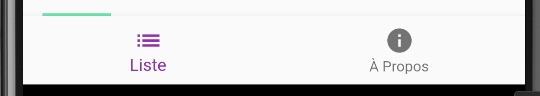

# Flutter, une liste et une API REST

Cet exemple montre comment utiliser Flutter pour créer une application récupérant des données via une API REST.

::: details Sommaire
[[toc]]
:::

## Présentation

L'application affiche une liste de films récupérés via une API REST. Lorsque l'on clique sur un élément de la liste, on accède à une page détaillée de l'élément (affichage d'une image).

<iframe width="560" height="315" src="https://www.youtube.com/embed/RgxA8u-oMBw" title="YouTube video player" frameborder="0" allow="accelerometer; autoplay; clipboard-write; encrypted-media; gyroscope; picture-in-picture" allowfullscreen></iframe>

## Prérequis

Pour pouvoir utiliser cet exemple, vous devez avoir installé Flutter sur votre machine.

## Installation de flutter

[Documentation officielle](https://flutter.dev/docs/get-started/install).

Vous pouvez utiliser la commande suivante pour vérifier que Flutter est bien installé :

```bash
flutter doctor
```

::: tip Pas de détail
Vous avez vu ces étapes lors des cours. Je ne vais donc pas entrer dans le détail de l'installation.
:::

## Récupération du code

Le code est disponible à l'adresse suivante : [c4software/flutter-list-sample](https://github.com/c4software/flutter-list-sample). 

- Je vous laisse cloner le projet. 

### Installation des dépendances

Pour installer les dépendances, vous devez lancer la commande suivante :

```bash
flutter pub get
```

### Lancement de l'application

Puis vous pouvez lancer l'application via la commande suivante :

```bash
flutter run
```

::: tip Être dans le bon répertoire
Évidemment, vous devez être dans le bon répertoire pour lancer l'application.
:::

## Le but du code

L'objectif de ce projet est de présenter une application simple Flutter qui implémente :

- Des tabs pour accéder au contenu.
- Une liste de « Image » en provenance d'une API.
- Une vue de détail.

## Organisation du code

Le code est organisé de la manière suivante :

- `lib/` : contient le code source de l'application
  - `main.dart` : point d'entrée de l'application.
  - `data/models/` : contient les modèles de données.
  - `data/services/` : contient les services de données (accès à l'API REST).
  - `ui/screens` : contient les pages de l'application.
  - `ui/widgets` : contient les widgets de l'application.

::: danger Attention

Tout comme l'approche MVC, l'organisation du code est très importante. il est important de séparer les différentes parties de l'application. Cela permet de mieux comprendre le code et de le maintenir plus facilement.

Le découpage en Widgets, Screens et Services est une approche très courante. C'est une approche que je **vous recommande** d'utiliser pour vos projets.

:::

## Les tabs

Les tabs sont des éléments permettant de naviguer entre les différentes pages de l'application. Il s'agit d'un élément très courant dans les applications mobiles, elles prennent généralement la forme d'un menu en bas de l'écran.



Ce composant ce nomme une `BottomNavigationBar`. Il fonctionne de la façon suivante :

- On définit une liste d'éléments. (Les Widgets à afficher dans notre vue, nommés dans mon code `_children`).
- On définit une `BottomNavigationBar` qui contient la liste des icônes à afficher.
- On ajoute une variable `currentIndex` qui permet de définir l'élément actif.
- Le `Body` de notre `Scaffold` contient le Widget actif. Il s'agit d'une référence à `currentIndex` dans la liste des Widgets.

Vous pouvez voir l'implémentation de ce fonctionnement dans le fichier [`HomePageTabs.dart` disponible en cliquant ici](https://github.com/c4software/flutter-list-sample/blob/master/lib/ui/screens/home/HomePageTabs.dart)

## Le routeur

Le routeur permet de gérer les différentes pages de l'application. Il permet de définir les différentes routes de l'application et de gérer les transitions entre les pages.

Le routeur est utilisé dans le fichier `HomePageScreen.dart` :

```dart
Navigator.push(
  context,
  MaterialPageRoute(
    builder: (context) => DetailsScreen(image: image),
  ),
);
```

Dans cet exemple, on utilise la méthode `push` pour ajouter une nouvelle page à la pile de navigation. La méthode `push` prend en paramètre un `MaterialPageRoute` qui permet de définir la page à ajouter à la pile de navigation. 

`DetailsScreen` est l'écran qui sera affiché. On lui passe en paramètre l'image à afficher. Il s'agit de l'élément sur lequel l'utilisateur a cliqué.

## L'appel à l'API

L'appel à l'API se fait dans le fichier `Api.dart` :

```dart
static Future getPhotos() {
  return http.get(Uri.parse("$baseUrl/photos"));
}
```

On utilise la librairie `http` pour faire l'appel à l'API. On utilise la méthode `get` pour récupérer les données. On passe en paramètre l'URL de l'API. La méthode `get` retourne un `Future` qui contient les données récupérées, celle-ci est traitée dans le fichier `HomePageScreen.dart` :

```dart
_getData() async {

    // Appel à l'API pour récupérer les données
    var response = await API.getPhotos();

    // Traitement des données
    if (response.statusCode == 200) {

      // On utilise la librairie json pour parser les données
      Iterable list = json.decode(response.body);

      // On met à jour l'état de l'application
      setState(() {
        _data = list.map((model) => ImageData.fromJson(model)).toList(); // On transforme les données en modèle
        _loading = false; // On met à jour l'état de chargement à false pour cacher le loader
      });
    } else {
      // En cas d'erreur on lève une exception
      throw Exception('Erreur récupération des données');
    }
  }
```

On utilise la méthode `setState` pour mettre à jour l'état de l'application. Cela permet de rafraichir l'affichage de l'application, et de mettre à jour les données affichées.

::: tip Asynchrone
L'appel à l'API est asynchrone. Cela signifie que l'application ne va pas attendre la réponse de l'API pour continuer son exécution. Cela permet d'avoir une application plus fluide, mais ça veux dire aussi que vous allez devoir gérer une vue de chargement / une vue d'attente.

Vous pouvez voir l'implémentation de ce fonctionnement dans le fichier [`HomePageScreen.dart` disponible en cliquant ici](https://github.com/c4software/flutter-list-sample/blob/master/lib/ui/screens/home/tabs/ListTab.dart)
:::

## Les modèles de données

Les modèles de données sont des classes qui permettent de représenter les données de l'application. Dans mon cas, j'ai créé une classe `ImageData` qui représente une image. 

```dart
/// Modèle de données pour les images provenant de l'API.
class ImageData {
  int id;
  String title;
  String url;
  String thumbnailUrl;

  ImageData(this.id, this.title, this.url, this.thumbnailUrl);

  ImageData.fromJson(Map json)
      : id = json['id'],
        title = json['title'],
        url = json['url'],
        thumbnailUrl = json['thumbnailUrl'];

  Map toJson() {
    return {'id': id, 'title': title, 'url': url, 'thumbnailUrl': thumbnailUrl};
  }
}
```

Un modèle de données est une classe qui contient des propriétés. Dans mon cas, j'ai créé une classe `ImageData` qui contient les propriétés suivantes : 

- `id` : l'identifiant de l'image.
- `title` : le titre de l'image.
- `url` : l'URL de l'image.
- `thumbnailUrl` : l'URL de la miniature de l'image.

Les données récupérées depuis l'API sont des données au format JSON. Pour pouvoir les utiliser dans notre application, il faut les transformer en modèle de données. C'est ce que fait la méthode `fromJson` :

```dart
  ImageData.fromJson(Map json)
      : id = json['id'],
        title = json['title'],
        url = json['url'],
        thumbnailUrl = json['thumbnailUrl'];
```

Cette méthode permet de créer un objet `ImageData` à partir d'un objet `Map` qui contient les données au format clé / valeur (résultat du découpage JSON).

**Bien évidemment, il faut que les clés de l'objet `Map` correspondent aux propriétés de l'objet `ImageData`.**

## L'authentification

Dans le projet vous avez un exemple d'authentification avec un formulaire. Le formulaire est composé de deux champs :

- `username` : le nom d'utilisateur.
- `password` : le mot de passe.

Le code est dans le fichier [`lib/ui/scroons/home/tabs/LoginTab.dart`](https://github.com/c4software/flutter-list-sample/blob/master/lib/ui/screens/home/tabs/LoginTab.dart). Il est composé des éléments suivants :

- LoginTab : la classe qui représente le formulaire d'authentification.
- FormAuthWidget : le widget qui représente le formulaire d'authentification. (avec les champs et le bouton de validation).
- AuthUserInformationWidget : le widget qui représente les informations de l'utilisateur connecté.

Les actions sont réalisés via des `Callback` (`onLogin` et `onLogout`, …).

### L'API de l'authentification

Une méthode `login` est définie dans le fichier [`lib/data/services/api.dart`](https://github.com/c4software/flutter-list-sample/blob/master/lib/data/services/api.dart), il s'agit de l'API qui permet de se connecter. Cette API retourne un objet de type `LoginData` qui contient les informations de l'utilisateur connecté.

- id : l'identifiant de l'utilisateur.
- email : l'email de l'utilisateur.
- firstName : le prénom de l'utilisateur.
- lastName : le nom de l'utilisateur.

Cette API est appelée dans le fichier `lib/ui/screens/home/tabs/LoginTab.dart` lors de la validation du formulaire.
