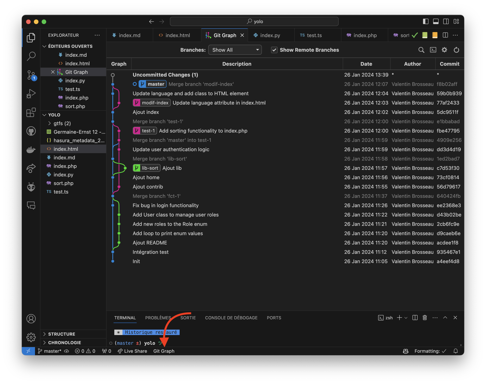

# Initiation GIT

Vous débutez avec GIT, le TP suivant vous fera parcourir les concepts de base de la ligne de commande Git.

::: details Table des matières
[[toc]]
:::

## Ressources utiles

- [Aide mémoire](/cheatsheets/git/)
- [Google](https://www.google.fr)
- [Livre Git en ligne](https://git-scm.com/book/fr/v2)

## Situation

Vous êtes en entreprise, vous avez un nouveau projet à réaliser. Le projet est plutôt conséquent (plusieurs semaines de travail), votre responsable vous indique que vous serez le seul développeur sur le code.

### Questions

- Voyez-vous d’autres questions à poser à votre chef de projet ?
- Comment imaginez-vous l’organisation de votre travail ?
- Un gestionnaire de version est-il utile ?
- Si oui, pourquoi ?
- Si non, pourquoi ?

## Initialisation

Votre choix est fait, vous devez maintenant initialiser votre espace de travail. Comment procédez-vous?

## Installer GIT sur votre machine

Au lycée tout est déjà installé, cependant sur votre machine personnelle, il faut installer GIT. Sous Windows vous avez plusieurs choix :

- [Installer GIT](https://git-scm.com/)
- WSL, WSL est un sous-système Linux pour Windows, il permet d’installer un système Linux sur votre machine Windows. C'est très pratique pour les développeurs, car il permet d'utiliser les outils Linux directement sur Windows.

Nous utiliserons par simplicité GIT-SCM, mais rien ne vous empêche d'utiliser WSL.

::: details WSL

L'activation de WSL sur votre machine est découpée en plusieurs étapes :

```sh
wsl --set-default-version 2
wsl --install -d Debian
```

WSL va télécharger « Debian » puis il va l'activer sur votre machine. Une fois l'installation terminée, vous pouvez lancer Debian depuis le menu démarrer.

```sh
apt update
apt install git
```

Et voilà, vous avez maintenant GIT sur WSL.

:::

### Définir votre identité dans GIT

```

```

### Initialiser votre projet

::: danger Dans un autre dossier
Vous devez exécuter cette commande dans un dossier (exemple `test/`).
:::

```

```

## Début du code

Maintenant que votre projet est initialisé, il faut maintenant créer les fichiers de base. Créer la structure suivante :

```
├── Makefile
├── documentations
│   └── README.md
├── libs
│   └── fonction.php
├── public
│   ├── index.jpg
│   └── index.js
├── source
│   ├── index.html
│   └── index.js
└── tests
    ├── test.js
    └── test.html

4 dossiers, 9 fichiers
```

Je vous laisse créer les fichiers et les dossiers. Pour le contenu des fichiers, vous pouvez mettre ce que vous voulez (structure d'une page HTML, d'un fichier JavaScript, etc.). Le contenu n'est pas important, seule la structure compte.

### Question bonus

- Comment avez-vous procédé ?
  - Est-ce la technique utilisée en entreprise ?
  - Est-ce pratique ?
  - Comment faire autrement ?

Vérifier le statut de Git après avoir tout créé

```sh

```

### Questions

- Que constatez-vous ?
  - Quelles commandes, faut-il faire maintenant?
  - Une autre commande serait-elle utile ?

Ajouter les changements

```sh

```

Est-ce la seule façon de faire ? (Plusieurs réponses sont possibles)

```sh

```

Créer une première version

```sh

```

### Questions

- Qu’avez-vous fait ?
- Qu’elles sont différences entre les deux commandes ?
- Dans quel état est votre dépôt (repository) ?
- À quoi sert la commande `git status` ?
  - Une autre commande permettrait-elle d’avoir une information similaire ?
- Le commentaire que vous avez mis est-il correct ?
  - Est-il possible de l’améliorer ?
  - Si oui, comment ?

## Ajout / Modification de fichiers

Modifier le fichier `source/index.html`, ajouter du contenu dedans (par exemple, une page HTML fictive)

```
$ vim source/index.html
```

Vérifier que vos modifications sont présentes dans GIT

```sh
$
$ # Ou
$
```

Ajouter vos modifications dans Git

```sh
$
```

Créer une seconde version

```sh

```

### Questions

- À quoi servent les commentaires ?
- Sont-ils utiles que pour pour vous ?
- Y’a-t-il plusieurs façons de faire ?
- Comment vérifier que vos modifications ont bien été prises en compte ?

```sh
$
```

## Modifier le message du précédent commit

Votre responsable n’est pas satisfait de la qualité du message de votre dernier commit. Modifiez-le en utilisant [un template de message de commit](/cheatsheets/git/commit_template.md)

```sh
$
```

### Questions

- Pourquoi votre responsable vous a-t-il demandé de le modifier ?
- Pourquoi le commentaire est-il aussi important ?

## Ajout d’une évolution dans le précédent fichier

```sh
$
```

Sauvegarder l'ensemble des modifications après avoir vérifié que celle-ci sont bien présente

```sh
$
$
```

### Question

- À votre avis, comment déterminer la fréquence des « commits » ?

## Un coup d’œil dans le rétroviseur

Vérifier l’historique de votre projet

```sh
$
$ # ou pour avoir une vue « compact »
$
```

### Questions

- Que constatez-vous ?
- À quoi sert l’identifiant de chaque commit ? (Hash SHA)
- Comment vérifiez-vous l’historique pour un fichier précis ?
- Comment voir l’ensemble des modifications en détail pour le fichier `source/index.html` ?
- Est-ce judicieux de travailler toujours sur la branche `master` / `main`?

## Mettre de côté vos modifications

Votre responsable vous demande de mettre de côté vos modifications, car il souhaite que vous travailliez sur une correction urgente.

```sh
git stash
```

Puis pour récupérer vos modifications

```sh
git stash pop
```

Cet usage, un peu plus avancé de GIT, permet de mettre de côté vos modifications, pour les récupérer plus tard. Cela permet de travailler sur une autre tâche, sans perdre vos modifications, mais sans forcément les commiter.

## Un instant, les clients graphiques

Nous avons débuté en utilisant le plus possible la ligne de commande, mais il existe des clients graphiques pour GIT. Quand nous commençons à utiliser les branches, les clients graphiques sont très utiles. Notamment pour corriger les problèmes de « merge » / « fusion » / « conflit ».

Il existe plusieurs clients, de manière très simple il est possible de commencer avec une simple extension pour VSCode : [GIT Graph](https://marketplace.visualstudio.com/items?itemName=mhutchie.git-graph)

Une fois installée, vous pouvez l'activer en cliquant sur l'icône en bas de VSCode :



## Une autre évolution

Votre première version est maintenant disponible pour les utilisateurs, votre responsable vous demande une évolution importante du code, celle-ci est majeure et changera complètement le comportement de votre application. Vous ne pouvez pas travailler directement sur la `master` / `main`. On vous demande de travailler sur la branche `fct-1`.

Comment procédez-vous ?

```sh
$
$
```

Faites des modifications dans les fichiers que vous voulez.

### Questions

- Vérifier l’état de votre dépôt Git
- Quel est l’avantage de travailler dans « une branche » ?
- À votre avis quelles sont les prochaines étapes ?

## Fusion / Merge de la fonctionnalité

Votre code est finalisé, il faut maintenant fusionner vos modifications avec votre « branche master » / « branche main »:

```sh
$
$
```

### Questions

- À votre avis, en entreprise « merge / fusionne » t-on directement sur la `master` / `main`?
- Une autre personne peut-elle / doit-elle être impliquée dans cette étape ?

## Annulation, retour arrière

Faite des évolutions dans votre branche `master` / `main` (2 ou 3), ajouter les via `git add`. Votre responsable vous demande finalement de les annuler, car il ne souhaite pas garder la fonctionnalité. Comment procédez-vous ?

```sh
$
```

### Questions

- Que vient-il de se produire ?
- Est-il possible de récupérer vos modifications ?

## Finalisation

Voilà, votre projet a atteint une première étape. Que pouvez-vous faire pour « marquer » cette première version ?

```sh
$
```

### Questions

- Que vient-il de se produire ?
- À votre avis, quel est l’intérêt de « taguer » une version ?
- Quels sont les avantages de réaliser un tag ?

[Voir la solution](./solution/)

## Utiliser un client graphique

Pour les personnes qui préfèrent utiliser un client graphique, voici une liste de clients graphiques pour Git :

- [GitKraken](https://www.gitkraken.com/)
- [VSCode](https://code.visualstudio.com/)
- [Visual Studio](https://visualstudio.microsoft.com/fr/)
- [L'extension GIT Graph pour VSCode](https://marketplace.visualstudio.com/items?itemName=mhutchie.git-graph)

### VSCode

VSCode intègre un client Git par défaut, il est possible de l’utiliser pour réaliser l'ensemble des opérations précédentes.


::: tip Appeler moi
Nous allons voir ensemble comment utiliser VSCode pour réaliser les opérations précédentes.
:::