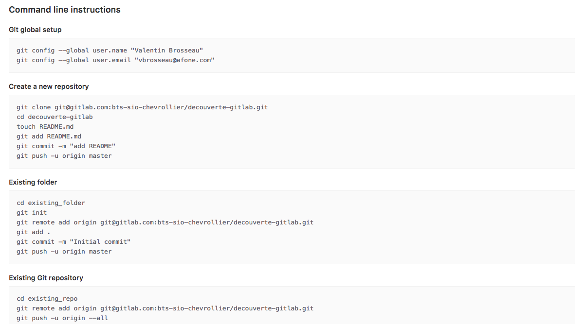

# GitLab

Introduction au travail à plusieurs avec GIT.

## Ressources utiles

- [Aide mémoire](https://github.com/c4software/cheatsheet/blob/master/git/)
- [Documentation GitLab](https://docs.gitlab.com/ee/README.html)
- [Livre Git en ligne](https://git-scm.com/book/fr/v2)
- [GitLab.com](https://www.gitlab.com/)

## Situation

L’entreprise où vous effectuez votre stage utilise GitLab, vous allez donc devoir utiliser en plus de GIT un outil permettant de gérer votre « workflow de travail ».

### Questions

- Pourquoi à votre avis l’entreprise utilise GitLab ?
- Pourquoi GitLab plutôt que GitHub ?

## Création du projet

Avant d’utiliser GitLab nous allons dans un premier temps créer un site Internet sur votre ordinateur.

- Créer un nouveau dossier
- Initialiser un nouveau projet Git (en ligne de commande)
- Créer la page d’accueil de votre site Internet (quelque chose de sympa et créatif ;))
- Versionner cette première version. (`git commit` et vérifier avec `git status` que c’est bien ok)
- Ajouter une seconde page dans votre site Internet, par exemple une page vous présentant.
- Versionner cette seconde page. (`git commit` et vérifier avec `git status` que c’est bien ok)
- Ajouter un « formulaire de contact », ce formulaire devra contenir a minima 3 « input » :
  - Un champ email
  - Un champ sujet
  - Un champ message
- Ajouter une page PHP qui enregistre les valeurs dans un fichier sur disque à chaque fois qu’un utilisateur valide le formulaire.
- Versionner le formulaire de contact (attention, il serait intéressant de faire plusieurs `commit`, si vous avez ajouté plusieurs pages, vérifier avec `git status` que c’est bien ok)

## Les logs

Vérifier que votre projet est bien commité, avec la commande `git status`. Vous pouvez également vérifier l’historique de vos commits via `git log`

## GitLab

### Création du compte

Créer votre compte sur [GitLab.com onglet Register](https://gitlab.com/users/sign_in). Ce compte sera utile pour plusieurs projets, remplissez les champs avec attention.

#### Échange de clé

Pour vous reconnaitre, GitLab/Github utilise un système de clé. Cette clé garantit votre identité sans utiliser un mot de passe.

#### Génération de votre clé

Sur votre ordinateur, en ligne de commande :

```sh
$ ssh-keygen
```

Deux fichiers seront créés : une clé « publique » ET une clé privée.

⚠️ ⚠️ Vous ne devez JAMAIS rendre publique votre clé **privée**. Si ça vous arrive, vous devez immédiatement révoquer les clés !

#### Envoyer votre clé sur GitLab

[Ajouter une clé sur votre profil](https://gitlab.com/profile/keys)

La clé que vous devez envoyer est dans votre dossier personnel (`P:`) dans le dossier `.ssh`. Une fois dans le dossier (masqué par défaut) vous avez deux fichiers. Le fichier que vous devez ouvrir et copier le contenu est celui dont l’extension est .pub

### Création de votre premier projet

Maintenant que votre compte est créé (et que l’échange de clé est effectif), vous allez pouvoir créer un nouveau projet. Ce projet « gitlab », aura pour vocation de contenir les sources de votre site Internet (celui créé au début du TP). Nommez-le bien !

### Question

- Comment choisir la visibilité du projet ? (Visibility Level)

### Envoi sur GitLab

Maintenant que votre projet est créé, GitLab doit vous donner les instructions pour « pusher » votre projet sur le serveur. Suivez les instructions.

#### Exemple :



Une fois que c’est fait. Regarder les différentes options que GitLab vous propose.

- Inviter un (ou plusieurs) autre étudiant dans votre projet (c’est dans l’onglet Members dans les paramètres)
- Créer une nouvelle issue
- Assigner l’issue à vous-même (ou à un autre étudiant).
- Regarder les options autour de l’issue (Création de branch, issue board, etc…)

### Édition en ligne

GitLab permet de se passer (en partie) d’un éditeur sur votre poste, tester les différentes fonctionnalités :

- Créer une issue (exemple, Ajout d’informations sur la page d’accueil)
- Créer une branche relative à cette issue.
- Vérifier que vous êtes bien sur la branche en question avant d’éditer le fichier index.html dans l’onglet `files`
- Ajouter une image dans votre projet (via GitLab)
- Ajouter dans la page index.html l’image en question (`<img src…`)
- ⚠️ Comme en local, le commentaire est très important ! Indiquer un commentaire pertinent. (Astuce si vous ajoutez à la fin de votre commentaire Close #1, l’issue sera automatiquement « fermée » une fois votre modification en place sur la master. Testez 😉)
- Une fois les modifications faites, vous allez pouvoir créer une `merge request`. Une fois le merge request créé, assignez-le à un autre étudiant ! Demandez-lui de le merger pour vous.
- ⚠️ ⚠️ L’autre étudiant doit regarder le code, et si possible vous faire des commentaires, par exemple :
  - Tu as oublié le `alt` à ton image.
  - Tu as oublié le `title` à ton image.
  - Ou même pourquoi as-tu choisi cette image ?
- Prenez en compte les remarques et modifiez le code
- Ajouter un commentaire (dans le merge request) pour indiquer à l’autre étudiant que vous avez terminé.
- L’autre étudiant peut merger votre code

## Participation à un projet collectif

GitLab (comme Github) est un outil/site web, permettant le travail collaboratif, dans cette optique vous allez pouvoir travailler sur un projet à plusieurs :

- Demander l’accès au groupe : [BTS SIO Chevrollier](https://gitlab.com/bts-sio-chevrollier)
- Aller dans le projet : [découverte GitLab](https://gitlab.com/bts-sio-chevrollier/decouverte-gitlab) et demander l’accès.

### Questions

- Pourquoi devez-vous demander l’accès ?
- Pourquoi est-ce important ?
- Si nous étions sur un GitLab « privé » (interne à l’entreprise) cela aurait-il été aussi important ?

## Cloner le projet

Maintenant que votre compte est actif, vous pouvez cloner le projet :

### Cloner le projet sur votre machine

```sh
$ git clone git@gitlab.com:bts-sio-chevrollier/decouverte-gitlab.git
```

## Traiter une des issues

Un ensemble « d’issues »/tickets dans le projet « Découverte GitLab » sont disponibles, choisissez-en une. Traitez-la en utilisant le « Workflow GitLab » :

- Assignation de l’issue à vous-même.
- Création d’une branche relative à l’issue (un bouton permet de le faire directement).
- Modification du code.
- Création d’une « merge request ».
- Assigner à un autre étudiant le « merge » du code que vous venez d’effectuer.

### Mettre à jour le code local.

```sh
$ git pull
```

### Créer une nouvelle branche

```sh
$ git branch maNouvelleBranche
```

### Changer de branche

```sh
$ git checkout maNouvelleBranche
```

### Envoyer vos modifications sur le serveur GitLab

```sh
$ git push -u origin maNouvelleBranche
```

### Création d’une merge request

[Création de la merge request](https://gitlab.com/groups/bts-sio-chevrollier/merge_requests)

- Remplissez l’ensemble des champs qui vous semblent nécessaires. N’oubliez pas que ça sera quelqu’un d’autre qui va regarder et traiter votre demande !

### Question

- Pourquoi travailler de cette façon ?

## Bonne nouvelle !

Vous venez (normalement) d’avoir au moins un « merge request » d’assigné. Vous allez devoir traiter la demande, à votre avis, comment se déroule la suite ?

## La revue de code

- Regarder l’issue.
- Regarder le code de votre « collègue ».
- Apporter des commentaires
  - Dans l’issue, générale.
  - Directement dans la partie code de l’issue.
- Laisser votre collègue effectuer « les corrections » par rapport à votre commentaire (ou débattre de pourquoi, etc.). DISCUTER ! (du code)
- Si tout vous semble correct « Merger » les modifications.

### Questions

- Quel est l’intérêt ?
- Est-ce contraignant ?
- Vous y voyez un intérêt ?
- À votre avis, est-il possible d’améliorer la revue de code ?
- En situation réelle, est-ce votre rôle de « merger le code » ?
