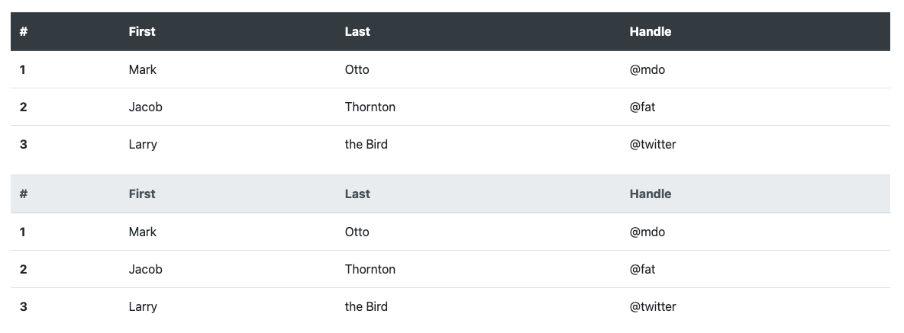

# Découverte de Bootstrap

Dans ce TP nous allons découvrir le framework CSS Bootstrap.

[Bootstrap](https://getbootstrap.com/)

## Introduction

Bootstrap est un Framework massivement utilisé dans le monde des développeurs Web. Il date maintenant de quelques années, mais celui-ci est mis à jour régulièrement ce qui lui permet d'être toujours à jour et toujours très intéressant. Les créateurs de Bootstrap sont Twitter vous ne serez donc pas vraiment surpris si celui-ci ressemble « sous certains aspects » à l'interface du site Twitter.com.

Bootstrap et très vaste, et très bien documenté le TP n'a pas pour but de vous apprendre « à utiliser Bootstrap », mais plutôt vous faire découvrir celui-ci pour que vous l'utilisiez aussi souvent que possible.

## Création de votre fichier HTML

La première étape est toujours la même. Je vous laisse créer un nouveau fichier HTML avec une structure basique (comprendre HTML 5). :hand: n'oubliez pas d'y mettre la meta permettant de faire du responsive.

::: tip Astuce du chef

Je vous le rappelle votre IDE à une fonctionnalité appelée « EMMET », vous avez donc des raccourcis à votre disposition permettant de gagner pas mal de temps.


:::

## Ajout de Bootstrap

Pour ajouter Bootstrap le plus simple est de **suivre la documentation officielle**. Celle-ci est disponible sur [le site de Bootstrap dans la partie Get Started](https://getbootstrap.com/docs/4.5/getting-started/introduction/#quick-start)

Vous pouvez également remplacer votre fichier HTML vide par [le starter template proposé par Bootstrap](https://getbootstrap.com/docs/4.5/getting-started/introduction/#starter-template)

Je vous laisse valider que votre site fonctionne correctement.

:hand: Vérifier bien qu'il n'y a pas d'erreur réseau lors du chargement de la page (avec l'inspecteur d'élément).

Questions :

- Pourquoi suivre la documentation officielle est très important ?
- Dans le code que vous avez copié. Pouvez-vous me dire à quoi correspond le paramètre `integrity=` ?

## Création d'une « structure » / « Layout »

Maintenant que nous avons une page vide disposant de Bootstrap, je vous propose de créer votre première page Bootstrap. Dans Bootstrap nous avons à notre disposition des « Templates » ou plutôt des « layouts » tout prêt nous permettant de partir d'une base de code déjà faite.

C'est templates [sont disponibles dans le menu de la documentation](https://getbootstrap.com/docs/4.5/examples/).

::: tip Pourquoi ? Quand ?
« Copier ≠ ne pas travailler » nous en avons parlé, mais c'est toujours un rappel important. Dans notre cas, Bootstrap nous propose des templates / gabarit déjà faits. Ils sont là pour :

- Vous faire gagner du temps.
- Améliorer la qualité de vos sites Internet.
- Vous montrer comment intégrer les éléments de Boostrap.

N'hésitez pas à vous en servir dans vos développements. Ils sont [disponible ici](https://getbootstrap.com/docs/4.5/examples)
:::

Faite votre choix, une fois que vous avez choisis regarder le code par exemple avec [du starter Template](https://getbootstrap.com/docs/4.5/examples/starter-template/)

## Mise en place d'une NavBar

La NavBar est un composant très important. Il nous permet de mettre en place une navigation entre nos pages. On la retrouve un peu partout dans le monde du développement, avec Bootstrap nous avons un composant tout prêt pour gérer cette problématique.

Voilà un exemple de NavBar :

```html
<nav class="navbar navbar-expand-md navbar-dark bg-dark fixed-top">
  <a class="navbar-brand" href="#">Navbar</a>
  <button class="navbar-toggler" type="button" data-toggle="collapse" data-target="#navbarsExampleDefault" aria-controls="navbarsExampleDefault" aria-expanded="false" aria-label="Toggle navigation">
    <span class="navbar-toggler-icon"></span>
  </button>

  <div class="collapse navbar-collapse" id="navbarsExampleDefault">
    <ul class="navbar-nav mr-auto">
      <li class="nav-item active">
        <a class="nav-link" href="#">Home <span class="sr-only">(current)</span></a>
      </li>
      <li class="nav-item active">
        <a class="nav-link" href="#">Contact</a>
      </li>
  </div>
</nav>
```

La documentation de la NavBar est disponible sur le site. [Je vous laisse la consulter pour plus de détail](https://getbootstrap.com/docs/4.5/components/navbar/)

### À faire

- Mettre en place une navbar sur votre site.

## Mise en place d'une Card

Un autre incontournable dans le développement est l'affichage de « Card » afin de structurer le contenu. Cette approche en Card a été introduite principalement par Google dans la plateforme Android. Mais c'est maintenant un basique dans le développement :


### À faire

- En vous inspirant [du code fourni sur la page](https://getbootstrap.com/docs/4.5/components/card/), mettre en place sur votre page une Card.

## Le responsive

Nous avons vu ensemble que Bootstrap était un framework permettant de gérer le responsive. En utilisant le système [de grid](https://getbootstrap.com/docs/4.5/layout/grid/) nous allons mettre sur notre site une grille de **3 colonnes**.

Nous allons bien évidemment le faire ensemble.

## Mise en place d'un formulaire

L'autre gros avantage de Bootstrap c'est l'aspect « propre » des formulaires. De bases sans que vous n'ayez aucune CSS vos formulaires seront « propre », pour ça rien de spécial à faire il suffit d'utiliser le code d'exemple fourni sur la documentation :

[Exemple ici](https://getbootstrap.com/docs/4.5/components/forms/#form-row)

::: tip Petite remarque

Comme vous avez pu le constater dans l'exemple précédent. La documentation de Bootstrap nous propose de mélanger les form et les grid. Et c'est bien normal, chaque composant est utilisable avec l'ensemble des possibilités des Bootstrap.

:::

### À faire

- En utilisant le code fourni sur le site de Bootstrap. Mettre en place **dans la card** précédemment créée un formulaire de contact.

## Les utilities de Bootstrap

Bootstrap nous propose également des « Utilities », les utilities sont des petites aides CSS, nous permettant de gagner du temps sur des taches récurrentes de mise en forme :

- Exemple [les bordures](https://getbootstrap.com/docs/4.5/utilities/borders/)
- Ou encore [les ombres](https://getbootstrap.com/docs/4.5/utilities/shadows/)
- Ou simplement [les alignements de textes](https://getbootstrap.com/docs/4.5/utilities/text/)

::: tip Je vous vois là !

Pourquoi avoir appris les bases de la CSS ?! C'est si simple en copiant les class de Bootstrap ! Alors, oui c'est simple, mais :

1. Vous avez maintenant les bases pour comprendre.
2. Vous êtes capable de les améliorer, surchargé, personnalisé.

:::

### À faire

- En utilisant les utilities, personnalisez votre page.

## Créer une seconde page dans votre site

Je vous laisse faire cette étape. Quelques règles à respecter cependant :

- Ajouter les liens dans la « NavBar ».
- Avoir une page « home » (nommée `index.html`).

### Ajout du texte

Je vous laisse ajouter un texte sur cette page. Attention à bien utiliser :

- Les class.
- Les balises titre.
- Les balises paragraphe pour le contenu.

### Ajout d'un tableau

Les tableaux, gros sujet les tableaux non ?! Bootstrap va vous simplifier GRANDEMENT la création et surtout le style des tableaux. Rendez-vous sur [la page Tables](https://getbootstrap.com/docs/4.5/content/tables/)



Le principe repose sur un ensemble de class. Ça passe du tableau « thème sombre » à « l'alignement ». Bref un vrai gain de temps.

### À faire

- Dans une nouvelle page, mettre en place un tableau et le personnaliser avec les classes de Bootstrap (couleurs, apparence, etc).

## Votre page d'accueil

Votre page d'accueil est très certainement « minimaliste », je vous propose de la rendre plus moderne (c'est très relatif comme notion). Pour ça nous allons utiliser une Cover appelée « Hero »

### Mise en place d'une cover « Hero »

En vous inspirant du code de la page suivante : [https://getbootstrap.com/docs/4.5/examples/cover/](https://getbootstrap.com/docs/4.5/examples/cover/) remplacer la home de votre page par une « Cover ».

::: tip Pas d'idée pour l'image ?

Le plus simple c'est d'aller sur [picsum.photos](https://picsum.photos/), ce site propose des images « d'illustration » utilisable dans vos projets sans problème de droit.

Autre solution [Unsplash](https://unsplash.com/), ce site propose des images _libre de droits_ utilisable dans vos projets.

:::

### Experimenter !

Le but de ce TP est l'expérimentation. N'hésitez pas à modifier, personnaliser, tester des idées. Donc, un fond de type « image », une toolbar avec une marge ou de couleur; rien ne sera assez fou !
